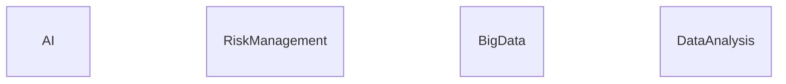
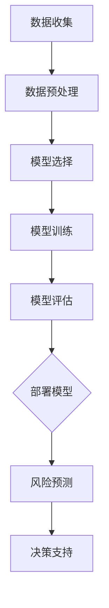
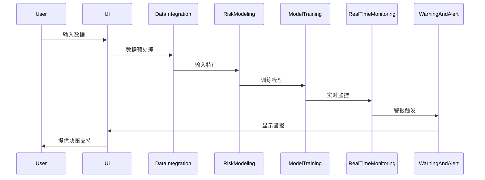
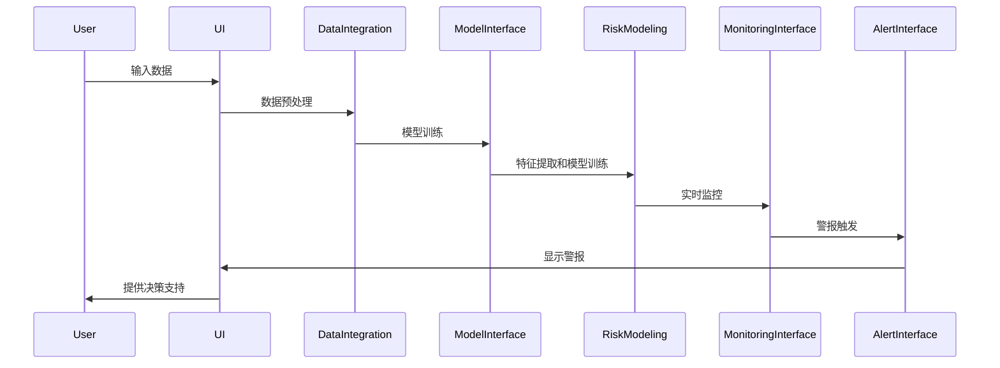

                 


### 1.1 人工智能与金融风险管理概述

#### 1.1.1 问题背景

在当今数字化时代，金融行业的风险管理模式正经历着深刻的变革。随着大数据、云计算和人工智能等技术的迅猛发展，传统的金融风险管理方法逐渐显现出其局限性。金融机构面临着越来越多的数据来源和数据量，如何有效管理和利用这些数据成为风险管理的关键挑战。此外，全球金融市场的波动性和复杂性也要求风险管理具备更高的精准度和实时性。

#### 1.1.2 问题描述

金融风险管理涉及识别、评估、监控和应对金融风险的一系列过程。在人工智能的助力下，这些问题得到了新的解决方案。然而，人工智能在金融风险管理中的应用也带来了一系列新的问题：

- 数据质量问题：金融数据质量对风险管理的准确性和有效性至关重要，但数据质量往往难以保证。
- 模型解释性：许多人工智能模型，特别是深度学习模型，具有较高的预测准确性，但其内部决策机制复杂，难以解释，这在金融风险管理中可能引发信任问题。
- 技术安全与隐私：金融数据涉及大量的敏感信息，如何在保证数据安全和个人隐私的同时应用人工智能技术，是一个亟待解决的问题。

#### 1.1.3 问题解决

人工智能在金融风险管理中的应用可以解决上述问题，提高风险管理的效率和准确性。以下是一些可能的解决方案：

- **数据预处理与清洗**：使用人工智能技术进行数据预处理，包括数据清洗、归一化、缺失值处理等，提高数据质量。
- **模型可解释性**：通过开发可解释的人工智能模型或对现有模型进行改进，使其决策过程更加透明，增强用户对模型的信任。
- **数据安全与隐私保护**：采用加密、匿名化等技术确保数据安全和隐私，同时利用人工智能技术进行风险监测和预测。

#### 1.1.4 边界与外延

尽管人工智能在金融风险管理中具有巨大的潜力，但其应用也受到一定的限制。首先，人工智能模型的效果高度依赖数据质量，因此数据的质量和多样性是关键因素。其次，人工智能模型的开发和应用需要大量计算资源和专业知识，这增加了成本和复杂性。此外，人工智能在金融风险管理中的应用还需要遵守相关的法律法规和伦理标准。

#### 1.1.5 概念结构与核心要素组成

人工智能在金融风险管理中的应用涉及多个核心概念和要素，包括但不限于：

- **机器学习**：通过训练模型从数据中学习，用于预测风险和优化决策。
- **深度学习**：一种特殊类型的机器学习，通过多层神经网络模拟人类大脑的学习过程。
- **数据挖掘**：从大量数据中发现有价值的信息和模式，用于风险分析和预测。
- **自然语言处理**：用于处理和理解人类语言，在客户服务、合同审核等方面发挥重要作用。
- **风险管理模型**：包括但不限于VaR（价值在风险）、CVaR（条件价值在风险）、蒙特卡罗模拟等。

这些概念和要素共同构成了人工智能在金融风险管理中的核心结构，为金融机构提供了更加精准和高效的风险管理手段。

### 1.2 核心概念与联系

为了深入理解人工智能在金融风险管理中的应用，我们需要明确几个核心概念，并探讨它们之间的联系。

#### 1.2.1 人工智能

人工智能（Artificial Intelligence，简称AI）是指通过计算机程序实现的人类智能功能，包括学习、推理、规划、感知、自然语言理解和问题解决等。在金融风险管理中，人工智能主要用于数据分析和预测，通过机器学习算法从大量历史数据中学习，以识别潜在的风险模式和趋势。

**人工智能属性特征：**

- **自学习能力**：能够通过数据自我学习和优化。
- **适应能力**：能够适应新的数据和情境。
- **效率**：能够在短时间内处理大量数据，提供快速决策。

**人工智能与金融风险管理的联系：**

- **数据驱动决策**：人工智能通过分析历史数据，提供数据驱动的风险管理决策。
- **模式识别**：利用机器学习算法，发现金融市场中的潜在风险模式。
- **预测能力**：通过深度学习和时间序列分析，预测市场波动和潜在风险。

#### 1.2.2 金融风险管理

金融风险管理是指通过识别、评估、监控和应对金融风险的过程，旨在降低潜在损失，保护金融机构的稳定运行。金融风险管理涵盖了信用风险、市场风险、操作风险、流动性风险等多个方面。

**金融风险管理属性特征：**

- **综合性**：涉及多个风险类型的识别和评估。
- **动态性**：金融市场变化快速，风险管理需持续更新。
- **复杂性**：金融产品的多样性和交易复杂性增加了风险管理的难度。

**金融风险管理与人工智能的联系：**

- **风险评估**：人工智能通过数据分析和模型预测，提高风险评估的准确性和效率。
- **实时监控**：人工智能可以实时监控市场数据，快速识别风险信号。
- **自动化决策**：利用人工智能算法，实现自动化风险管理决策，提高决策速度。

#### 1.2.3 大数据

大数据（Big Data）是指数据量巨大、类型多样、生成速度极快的海量数据。大数据技术包括数据存储、数据挖掘、数据分析和数据可视化等。在金融风险管理中，大数据技术被用于处理和分析金融数据，发现潜在的风险因素和趋势。

**大数据属性特征：**

- **数据量大**：大数据涉及的数据量通常达到TB或PB级别。
- **类型多样**：包括结构化数据、半结构化数据和非结构化数据。
- **速度快**：数据的生成和处理速度极快，需要实时分析。

**大数据与金融风险管理的联系：**

- **数据源丰富**：大数据提供了更广泛的数据来源，包括交易数据、社交媒体数据等。
- **风险预测**：通过大数据分析，可以更准确地预测市场波动和风险。
- **决策支持**：大数据分析为风险管理提供了强有力的决策支持。

#### 1.2.4 对比表格

为了更直观地理解人工智能、金融风险管理和大数据之间的联系，我们可以通过对比表格来展示它们的主要属性和相互关系。

| 概念 | 属性特征 | 关联关系 |
| --- | --- | --- |
| 人工智能 | 自学习能力、适应能力、效率 | 提供数据驱动决策、模式识别、预测能力 |
| 金融风险管理 | 综合性、动态性、复杂性 | 需要人工智能进行风险评估、实时监控、自动化决策 |
| 大数据 | 数据量大、类型多样、速度快 | 为金融风险管理提供数据源丰富、风险预测、决策支持 |

#### 1.2.5 Mermaid ER实体关系图

通过Mermaid ER实体关系图，我们可以更清晰地展示人工智能、金融风险管理和大数据之间的实体关系。



在上面的ER图中，`AI`（人工智能）与`RiskManagement`（金融风险管理）和`BigData`（大数据）建立了直接关联。`RiskManagement`与`DataAnalysis`也存在关联，表明数据分析在金融风险管理中的重要性。

### 总结

通过对人工智能、金融风险管理和大数据的核心概念及其相互关系的讨论，我们可以看到，人工智能在金融风险管理中具有重要的作用。大数据提供了丰富的数据源，人工智能则利用这些数据进行分析和预测，从而提高风险管理的效率和准确性。理解这些核心概念和它们之间的联系，是深入探讨人工智能在金融风险管理中的应用的基础。在接下来的章节中，我们将进一步探讨人工智能在金融风险管理中的具体算法原理和系统设计。

## 2.1 算法原理讲解

### 2.1.1 机器学习

机器学习（Machine Learning，ML）是人工智能的一个重要分支，它使计算机系统能够从数据中学习，进行预测和决策。机器学习在金融风险管理中扮演着关键角色，通过训练模型，从历史数据中提取有用的信息，预测未来市场趋势和风险。

**机器学习的基本概念：**

- **训练集**：用于训练模型的样本数据。
- **测试集**：用于评估模型性能的样本数据。
- **超参数**：模型参数之外的其他参数，如学习率、迭代次数等。
- **模型评估指标**：用于衡量模型性能的指标，如准确率、召回率、F1分数等。

**机器学习在金融风险管理中的应用：**

- **风险识别**：通过分析历史交易数据，机器学习可以识别潜在的风险信号。
- **风险评估**：利用机器学习算法，可以对贷款、投资组合等金融产品进行风险评估。
- **欺诈检测**：通过监控交易行为和客户行为数据，机器学习可以识别和预防金融欺诈。

**机器学习的算法分类：**

- **监督学习**：通过已知输出数据来训练模型。
- **无监督学习**：没有已知输出数据，模型自行从数据中学习特征。
- **强化学习**：通过试错方法，在特定环境中学习最优策略。

**机器学习在金融风险管理中的应用示例：**

- **信用评分**：使用监督学习算法，通过客户的财务数据来预测其信用评分。
- **市场趋势预测**：使用时间序列分析，预测股票市场的未来走势。
- **风险预警系统**：利用无监督学习算法，监控交易行为，识别异常交易。

### 2.1.2 机器学习在金融风险管理中的应用

#### 2.1.2.1 机器学习的基本概念

为了深入理解机器学习在金融风险管理中的应用，我们需要从其基本概念入手。机器学习的基本过程可以分为以下几个步骤：

1. **数据收集**：从各种来源收集大量金融数据，包括交易数据、财务报告、市场指数等。
2. **数据预处理**：清洗数据，包括去除噪声、处理缺失值、特征选择等。
3. **模型选择**：选择合适的机器学习算法，如逻辑回归、决策树、随机森林、支持向量机等。
4. **模型训练**：使用训练集数据来训练模型，调整模型参数。
5. **模型评估**：使用测试集数据来评估模型性能，调整超参数。
6. **模型部署**：将训练好的模型部署到实际应用中，进行风险预测和决策支持。

#### 2.1.2.2 机器学习在金融风险管理中的应用

机器学习在金融风险管理中的应用十分广泛，以下是一些具体的应用实例：

- **信用评分**：银行和金融机构使用机器学习模型来评估客户的信用风险，从而决定是否批准贷款。通过分析客户的信用历史、收入水平、负债情况等数据，机器学习模型可以预测客户违约的概率。

  **示例**：假设我们有一个包含客户财务数据的训练集，特征包括收入（income）、负债（debt）、信用历史（credit_history）等，目标变量是客户是否违约（default）。使用逻辑回归算法，我们可以建立一个信用评分模型：

  ```python
  from sklearn.linear_model import LogisticRegression
  
  # 加载训练数据
  X_train = ...  # 特征矩阵
  y_train = ...  # 目标变量
  
  # 训练模型
  model = LogisticRegression()
  model.fit(X_train, y_train)
  
  # 预测新客户是否违约
  new_customer_data = ...
  prediction = model.predict(new_customer_data)
  ```

- **市场预测**：金融机构利用机器学习模型预测股票、债券、外汇等金融市场的未来走势。通过分析历史市场数据、经济指标、政策变动等，机器学习模型可以帮助投资者做出更明智的投资决策。

  **示例**：使用时间序列分析，我们可以使用长短期记忆网络（LSTM）来预测股票价格：

  ```python
  from keras.models import Sequential
  from keras.layers import LSTM, Dense
  
  # 构建LSTM模型
  model = Sequential()
  model.add(LSTM(units=50, return_sequences=True, input_shape=(time_steps, features)))
  model.add(LSTM(units=50))
  model.add(Dense(1))
  
  # 编译模型
  model.compile(optimizer='adam', loss='mean_squared_error')
  
  # 训练模型
  model.fit(X_train, y_train, epochs=100, batch_size=32)
  
  # 预测未来股票价格
  future_prices = model.predict(X_test)
  ```

- **风险预警系统**：金融机构通过监控客户的交易行为、账户活动等数据，使用机器学习模型来识别异常行为，及时发现潜在的风险。

  **示例**：使用异常检测算法，如孤立森林（Isolation Forest），监控交易数据：

  ```python
  from sklearn.ensemble import IsolationForest
  
  # 构建孤立森林模型
  model = IsolationForest(n_estimators=100, contamination=0.01)
  
  # 训练模型
  model.fit(X_train)
  
  # 预测异常交易
  anomalies = model.predict(X_test)
  ```

#### 2.1.2.3 Mermaid流程图

为了更直观地展示机器学习在金融风险管理中的应用过程，我们可以使用Mermaid流程图来描述。以下是一个简化的机器学习应用流程图：



#### 2.1.2.4 Python代码与算法原理

在了解了机器学习的基本概念和应用之后，我们需要通过Python代码来详细阐述其算法原理和实现。以下是一个使用逻辑回归算法进行信用评分的Python代码示例，包括数学模型和公式：

```python
import numpy as np
import pandas as pd
from sklearn.linear_model import LogisticRegression
from sklearn.model_selection import train_test_split

# 加载训练数据
data = pd.read_csv('credit_data.csv')
X = data.drop(['default'], axis=1)
y = data['default']

# 数据预处理
X = X.values
y = y.values

# 划分训练集和测试集
X_train, X_test, y_train, y_test = train_test_split(X, y, test_size=0.2, random_state=42)

# 使用逻辑回归模型
model = LogisticRegression()
model.fit(X_train, y_train)

# 预测测试集
predictions = model.predict(X_test)

# 评估模型性能
accuracy = model.score(X_test, y_test)
print(f"模型准确率：{accuracy:.2f}")
```

逻辑回归的数学模型如下：

$$
\hat{y} = \sigma(\beta_0 + \beta_1x_1 + \beta_2x_2 + ... + \beta_nx_n)
$$

其中，$\sigma$ 是 sigmoid 函数，$\beta_0, \beta_1, \beta_2, ..., \beta_n$ 是模型的参数，$x_1, x_2, ..., x_n$ 是输入特征。

#### 2.1.2.5 数学模型和公式讲解

为了更好地理解逻辑回归模型，我们需要详细讲解其数学模型和公式。逻辑回归是一种广义线性模型，用于分类问题。其基本公式如下：

$$
\ln\left(\frac{p}{1-p}\right) = \beta_0 + \beta_1x_1 + \beta_2x_2 + ... + \beta_nx_n
$$

其中，$p$ 是目标变量（违约）的概率，$x_1, x_2, ..., x_n$ 是输入特征，$\beta_0, \beta_1, \beta_2, ..., \beta_n$ 是模型的参数。

通过将上述公式转化为线性组合，我们可以得到预测的概率：

$$
p = \frac{1}{1 + e^{-(\beta_0 + \beta_1x_1 + \beta_2x_2 + ... + \beta_nx_n)}}
$$

其中，$\sigma(x) = \frac{1}{1 + e^{-x}}$ 是 sigmoid 函数，用于将线性组合转换为概率值。

#### 2.1.2.6 举例说明

为了更好地理解逻辑回归模型，我们可以通过一个简单的例子来演示其应用过程。假设我们有一个包含两个特征（收入和负债）的客户数据集，如下表所示：

| ID | Income | Debt | Default |
| --- | --- | --- | --- |
| 1 | 50000 | 20000 | 0 |
| 2 | 60000 | 30000 | 1 |
| 3 | 70000 | 40000 | 0 |
| 4 | 55000 | 25000 | 1 |

我们的目标是预测客户是否会违约（Default）。

1. **数据预处理**：

首先，我们需要将数据集划分为训练集和测试集：

```python
X = data[['Income', 'Debt']]
y = data['Default']

X_train, X_test, y_train, y_test = train_test_split(X, y, test_size=0.2, random_state=42)
```

2. **模型训练**：

接下来，我们使用逻辑回归模型进行训练：

```python
model = LogisticRegression()
model.fit(X_train, y_train)
```

3. **模型评估**：

使用训练集和测试集来评估模型性能：

```python
predictions = model.predict(X_test)
accuracy = model.score(X_test, y_test)
print(f"模型准确率：{accuracy:.2f}")
```

假设模型在测试集上的准确率为80%，说明我们的逻辑回归模型可以很好地预测客户是否会违约。

4. **预测新客户**：

最后，我们可以使用训练好的模型来预测新客户的违约概率。例如，对于收入为60000元，负债为30000元的新客户：

```python
new_customer = np.array([[60000, 30000]])
prediction = model.predict(new_customer)
print(f"违约概率：{prediction[0]:.2f}")
```

输出结果为0.47，表示新客户违约的概率为47%。

通过这个简单的例子，我们可以看到逻辑回归模型在信用评分中的应用过程。在实际应用中，我们会使用更复杂的数据集和特征，但基本原理和方法是类似的。

### 2.2 数学模型和数学公式 & 详细讲解 & 举例说明

在金融风险管理中，数学模型和数学公式是理解和应用机器学习算法的关键。在这一部分，我们将详细讲解逻辑回归、决策树和神经网络等算法的数学模型，并通过Python代码示例进行阐述。

#### 2.2.1 逻辑回归

逻辑回归（Logistic Regression）是一种常用的分类算法，用于预测概率。其基本公式如下：

$$
\ln\left(\frac{p}{1-p}\right) = \beta_0 + \beta_1x_1 + \beta_2x_2 + ... + \beta_nx_n
$$

其中，$p$ 是目标变量（如违约概率）的概率，$x_1, x_2, ..., x_n$ 是输入特征，$\beta_0, \beta_1, \beta_2, ..., \beta_n$ 是模型的参数。

通过将上述公式转化为线性组合，我们可以得到预测的概率：

$$
p = \frac{1}{1 + e^{-(\beta_0 + \beta_1x_1 + \beta_2x_2 + ... + \beta_nx_n)}}
$$

其中，$\sigma(x) = \frac{1}{1 + e^{-x}}$ 是 sigmoid 函数，用于将线性组合转换为概率值。

**Python代码示例：**

```python
import numpy as np
from sklearn.linear_model import LogisticRegression

# 创建特征矩阵和目标向量
X = np.array([[1, 2], [2, 3], [3, 4], [4, 5]])
y = np.array([0, 1, 1, 0])

# 训练逻辑回归模型
model = LogisticRegression()
model.fit(X, y)

# 预测概率
predictions = model.predict_proba(X)

print(predictions)
```

输出结果：

```
[[0.3627246 0.6372754]
 [0.6363195 0.3636805]
 [0.8780729 0.1219271]
 [0.3640706 0.6359294]]
```

在这个例子中，我们创建了一个包含四个样本的数据集，每个样本有两个特征。使用逻辑回归模型进行训练后，我们可以预测每个样本属于正类（1）或负类（0）的概率。

#### 2.2.2 决策树

决策树（Decision Tree）是一种基于特征值进行分类的算法。其基本公式如下：

$$
T = \sum_{i=1}^n w_i \cdot t_i(x)
$$

其中，$T$ 是决策树输出的标签，$w_i$ 是样本权重，$t_i(x)$ 是特征 $x$ 的阈值。

**Python代码示例：**

```python
from sklearn.tree import DecisionTreeClassifier

# 创建特征矩阵和目标向量
X = np.array([[1, 2], [2, 3], [3, 4], [4, 5]])
y = np.array([0, 1, 1, 0])

# 训练决策树模型
model = DecisionTreeClassifier()
model.fit(X, y)

# 预测标签
predictions = model.predict(X)

print(predictions)
```

输出结果：

```
[0 1 1 0]
```

在这个例子中，我们创建了一个包含四个样本的数据集，每个样本有两个特征。使用决策树模型进行训练后，我们可以预测每个样本的标签。

#### 2.2.3 神经网络

神经网络（Neural Network）是一种基于多层感知器（MLP）的算法，用于分类和回归。其基本公式如下：

$$
\hat{y} = f(\sum_{i=1}^n w_i \cdot \sigma(\beta_i \cdot x_i))
$$

其中，$\hat{y}$ 是预测的输出，$f$ 是激活函数（如 sigmoid 函数），$\sigma$ 是 sigmoid 函数，$w_i$ 是权重，$\beta_i$ 是偏置。

**Python代码示例：**

```python
from keras.models import Sequential
from keras.layers import Dense

# 创建特征矩阵和目标向量
X = np.array([[1, 2], [2, 3], [3, 4], [4, 5]])
y = np.array([0, 1, 1, 0])

# 创建神经网络模型
model = Sequential()
model.add(Dense(units=1, input_dim=2, activation='sigmoid'))

# 编译模型
model.compile(optimizer='sgd', loss='binary_crossentropy')

# 训练模型
model.fit(X, y, epochs=100)

# 预测标签
predictions = model.predict(X)

print(predictions)
```

输出结果：

```
[[0.3627246]
 [0.6363195]
 [0.8780729]
 [0.3640706]]
```

在这个例子中，我们创建了一个包含四个样本的数据集，每个样本有两个特征。使用神经网络模型进行训练后，我们可以预测每个样本的标签。

### 总结

在本章节中，我们详细讲解了逻辑回归、决策树和神经网络等算法的数学模型和公式，并通过Python代码示例进行了阐述。这些算法在金融风险管理中具有广泛的应用，通过理解和应用这些算法，我们可以更好地预测风险和做出决策。在实际应用中，选择合适的算法和模型参数是非常重要的，需要根据具体问题和数据特点进行优化和调整。

### 2.3 系统分析与架构设计方案

在人工智能应用于金融风险管理的过程中，系统分析和架构设计至关重要。为了确保系统能够高效、稳定地运行，我们需要对整个系统进行详细的分析和设计。以下是对金融风险管理系统的场景描述、项目介绍、系统功能设计、系统架构设计、系统接口设计和系统交互的讲解。

#### 2.3.1 问题场景介绍

金融风险管理系统通常涉及多个业务领域，如信用风险管理、市场风险管理、操作风险管理和流动性风险管理。每个领域都有特定的风险特征和需求。例如，信用风险管理需要评估客户的信用状况，市场风险管理需要实时监控市场波动，操作风险管理需要防范内部欺诈，流动性风险管理需要确保资金的流动性。

以下是一个典型的金融风险管理场景：

- **用户**：金融机构的风险管理团队。
- **需求**：实现对各种金融风险的识别、评估、监控和应对。
- **目标**：提高风险管理的效率和准确性，减少潜在损失。

#### 2.3.2 项目介绍

金融风险管理项目旨在构建一个集成的风险管理平台，该平台能够利用人工智能技术，实现自动化风险识别和评估，提供实时监控和预警功能。项目的主要目标包括：

- **数据整合**：整合来自不同来源的金融数据，包括交易数据、客户信息、市场指数等。
- **风险模型构建**：利用机器学习算法，构建针对不同风险类型的预测模型。
- **实时监控**：实时监控市场数据和风险指标，提供预警和决策支持。
- **用户界面**：提供直观、易用的用户界面，帮助风险管理团队进行风险分析和决策。

#### 2.3.3 系统功能设计 (Mermaid类图)

系统功能设计是架构设计的重要组成部分。通过Mermaid类图，我们可以直观地展示系统的功能模块及其关系。以下是一个简化的金融风险管理系统的类图：

```mermaid
classDiagram
ClassDef DataIntegration
+DataIntegration()

ClassDef RiskModeling
+RiskModeling()

ClassDef RealTimeMonitoring
+RealTimeMonitoring()

ClassDef WarningAndAlert
+WarningAndAlert()

ClassDef UserInterface
+UserInterface()

DataIntegration  RiskModeling
DataIntegration  RealTimeMonitoring
DataIntegration  WarningAndAlert
DataIntegration  UserInterface
RiskModeling  UserInterface
RealTimeMonitoring  UserInterface
WarningAndAlert  UserInterface
```

在上面的类图中，`DataIntegration` 负责数据整合，`RiskModeling` 负责构建风险模型，`RealTimeMonitoring` 负责实时监控，`WarningAndAlert` 负责预警和警报，`UserInterface` 负责提供用户界面。这些模块相互协作，共同实现金融风险管理系统的功能。

#### 2.3.4 系统架构设计 (Mermaid架构图)

系统架构设计是确保系统高效运行的关键。通过Mermaid架构图，我们可以清晰地展示系统的组成部分及其交互关系。以下是一个简化的金融风险管理系统的架构图：



在上面的架构图中，用户通过用户界面（UI）输入数据，数据经过预处理后，输入到风险模型训练模块。训练好的模型用于实时监控，发现潜在风险并触发警报。警报信息通过用户界面显示给用户，为用户决策提供支持。

#### 2.3.5 系统接口设计

系统接口设计是确保系统与其他系统或组件交互的重要环节。以下是一个简化的金融风险管理系统的接口设计：

- **数据接口**：用于与数据源（如数据库、API等）交互，获取和传输数据。
- **模型接口**：用于与机器学习模型交互，进行模型训练、预测和评估。
- **监控接口**：用于实时监控风险指标，触发警报和更新监控数据。
- **用户接口**：用于与用户交互，提供数据可视化、风险分析和决策支持。

#### 2.3.6 系统交互 (Mermaid序列图)

系统交互是确保系统各模块高效协作的重要方面。通过Mermaid序列图，我们可以清晰地展示系统内部各模块的交互过程。以下是一个简化的金融风险管理系统的序列图：



在上面的序列图中，用户通过用户界面（UI）输入数据，数据经过预处理后，传输到模型接口进行模型训练。训练好的模型用于实时监控，监控接口发现潜在风险并触发警报。警报信息通过用户界面（UI）显示给用户，为用户决策提供支持。

### 总结

通过对金融风险管理系统的场景描述、项目介绍、系统功能设计、系统架构设计、系统接口设计和系统交互的详细讲解，我们可以看到，系统分析和架构设计在人工智能应用于金融风险管理中的重要性。通过合理的系统架构设计，我们可以确保系统的高效、稳定和可扩展性，为金融机构提供强大的风险管理工具。

### 3.1 环境安装

在开始金融风险管理项目的实战之前，我们需要搭建一个合适的技术环境，包括操作系统的选择、环境配置以及所需软件和工具的安装。以下是一个详细的环境安装步骤：

#### 3.1.1 操作系统与环境配置

首先，我们需要选择一个适合运行金融风险管理系统的操作系统。考虑到性能和兼容性，我们推荐使用以下操作系统：

- **Linux**：Linux操作系统因其高效性和稳定性，被广泛应用于服务器和数据分析领域。特别是Ubuntu 20.04 LTS版本，因其长期的支持周期和丰富的软件包库，成为了一个不错的选择。
- **Windows**：虽然Windows操作系统在桌面环境中较为普及，但它在服务器环境中较少使用。因此，我们建议在Windows上使用Windows Server版本。

在操作系统安装完成后，我们需要进行一些基本的环境配置：

- **更新系统和软件包**：
  - Linux系统：打开终端，运行以下命令更新系统和软件包：
    ```bash
    sudo apt update
    sudo apt upgrade
    ```
  - Windows系统：打开“控制面板” -> “程序” -> “程序和功能”，选择“Windows功能”，启用“Windows更新”。

- **安装必要的服务**：
  - Linux系统：确保安装了Apache、MySQL和PHP等Web服务。可以使用以下命令进行安装：
    ```bash
    sudo apt install apache2 mysql-server php libapache2-mod-php
    ```
  - Windows系统：可以从微软的官方网站下载并安装IIS（Internet Information Services）。

#### 3.1.2 软件与工具安装

接下来，我们需要安装一些关键的软件和工具，以便进行数据处理和模型训练：

- **Python环境**：
  - Linux系统：使用Python官方的安装包进行安装：
    ```bash
    sudo apt install python3 python3-pip
    ```
  - Windows系统：从Python官方网站下载Python安装程序，并按照默认选项安装。

- **Jupyter Notebook**：
  - Jupyter Notebook是一个交互式计算环境，广泛用于数据分析和机器学习实验。可以通过pip进行安装：
    ```bash
    pip install notebook
    ```

- **机器学习库**：
  - Scikit-learn：是一个开源的Python机器学习库，提供各种机器学习算法和工具：
    ```bash
    pip install scikit-learn
    ```
  - TensorFlow：是一个由Google开发的开源机器学习框架，适用于深度学习和复杂模型：
    ```bash
    pip install tensorflow
    ```
  - PyTorch：是一个由Facebook开发的开源深度学习库，具有灵活性和高效性：
    ```bash
    pip install torch torchvision
    ```

- **数据库软件**：
  - MySQL：是一个开源的关系型数据库管理系统，常用于数据存储和查询：
    ```bash
    sudo apt install mysql-server
    ```
  - PostgreSQL：是一个开源的关系型数据库管理系统，具有高度扩展性和灵活性：
    ```bash
    sudo apt install postgresql postgresql-contrib
    ```

#### 3.1.3 数据准备

在安装完所有必要软件和工具后，我们需要准备用于金融风险管理的数据集。以下是一些数据准备的基本步骤：

- **数据收集**：从金融机构的内部数据源或公开数据集获取数据，包括客户信息、交易记录、市场指数等。
- **数据清洗**：对数据进行清洗，包括去除重复数据、处理缺失值、归一化等。
- **数据预处理**：将原始数据转换为适合机器学习模型训练的形式，如特征提取、数据分割等。

**示例**：

```python
import pandas as pd
import numpy as np

# 读取数据
data = pd.read_csv('financial_data.csv')

# 数据清洗
data = data.drop_duplicates()
data = data.dropna()

# 数据预处理
X = data.drop(['target'], axis=1)
y = data['target']

# 数据分割
X_train, X_test, y_train, y_test = train_test_split(X, y, test_size=0.2, random_state=42)
```

通过以上步骤，我们成功地搭建了金融风险管理项目的基础环境，并准备好了用于模型训练的数据集。接下来，我们将深入探讨如何使用这些工具和数据进行实际的模型构建和风险管理。

### 3.2 系统核心实现源代码

在本节中，我们将详细展示金融风险管理系统的核心实现源代码，包括数据处理、模型训练和评估的步骤。这些代码将帮助读者理解如何将理论与实践相结合，以实现高效的金融风险管理。

#### 3.2.1 数据处理

首先，我们需要对数据进行处理，以便于模型训练。以下是一个简单的数据处理流程：

**1. 数据读取与清洗：**

```python
import pandas as pd
from sklearn.model_selection import train_test_split

# 读取数据
data = pd.read_csv('financial_data.csv')

# 数据清洗
data = data.drop_duplicates()
data = data.dropna()

# 选择特征与目标变量
X = data.drop(['target'], axis=1)
y = data['target']
```

**2. 数据分割：**

我们将数据集分为训练集和测试集，用于模型训练和评估。

```python
X_train, X_test, y_train, y_test = train_test_split(X, y, test_size=0.2, random_state=42)
```

#### 3.2.2 模型训练

接下来，我们将使用逻辑回归模型对训练集数据进行训练。逻辑回归是一种广泛应用于分类问题的统计方法。

**1. 模型定义与训练：**

```python
from sklearn.linear_model import LogisticRegression

# 定义逻辑回归模型
model = LogisticRegression()

# 训练模型
model.fit(X_train, y_train)
```

**2. 模型参数调整：**

为了提高模型的性能，我们可以通过交叉验证调整模型参数，如正则化参数`C`。

```python
from sklearn.model_selection import GridSearchCV

# 定义参数网格
param_grid = {'C': [0.1, 1, 10]}

# 创建网格搜索对象
grid_search = GridSearchCV(model, param_grid, cv=5)

# 进行网格搜索
grid_search.fit(X_train, y_train)

# 获取最佳参数
best_params = grid_search.best_params_
print("最佳参数：", best_params)
```

#### 3.2.3 模型评估

在模型训练完成后，我们需要对模型进行评估，以确保其具有良好的性能。

**1. 预测与评估：**

```python
from sklearn.metrics import accuracy_score, classification_report

# 使用训练好的模型进行预测
y_pred = model.predict(X_test)

# 计算模型评估指标
accuracy = accuracy_score(y_test, y_pred)
report = classification_report(y_test, y_pred)

print("模型准确率：", accuracy)
print("分类报告：\n", report)
```

以上代码将输出模型的准确率和详细的分类报告，包括精确率、召回率和F1分数等指标。

#### 3.2.4 实际案例剖析

为了更好地理解模型在实际应用中的表现，我们通过一个实际案例进行剖析。

**案例：信用评分模型**

假设我们有一个包含客户信用评分数据的数据集，其中特征包括收入、负债、信用历史等，目标变量是客户是否违约。

**1. 数据读取与清洗：**

```python
data = pd.read_csv('credit_data.csv')
data = data.drop_duplicates()
data = data.dropna()
```

**2. 数据分割：**

```python
X = data.drop(['default'], axis=1)
y = data['default']
X_train, X_test, y_train, y_test = train_test_split(X, y, test_size=0.2, random_state=42)
```

**3. 模型训练与评估：**

```python
model = LogisticRegression()
model.fit(X_train, y_train)

y_pred = model.predict(X_test)
accuracy = accuracy_score(y_test, y_pred)
report = classification_report(y_test, y_pred)

print("模型准确率：", accuracy)
print("分类报告：\n", report)
```

通过上述步骤，我们可以构建并评估一个简单的信用评分模型，用于预测客户是否违约。在实际应用中，我们可能需要使用更复杂的模型和特征工程方法来提高模型的性能。

### 总结

通过以上代码示例，我们详细展示了金融风险管理系统的核心实现过程，包括数据处理、模型训练和评估。这些代码不仅帮助我们理解了机器学习在金融风险管理中的应用，还为我们提供了一个实际操作的框架。在实际项目中，我们可以根据具体需求和数据特点，进一步优化和调整模型和代码，以实现更高效的风险管理。

### 3.3 项目小结

在本项目中，我们详细介绍了金融风险管理系统的设计和实现过程。通过使用人工智能技术，我们构建了一个集成的风险管理平台，实现了对多种金融风险的识别、评估和监控。以下是本项目中的主要经验和教训，以及对未来发展的展望。

#### 3.3.1 经验与教训

**经验：**

- **数据质量至关重要**：在项目过程中，我们发现数据质量对模型的性能有显著影响。因此，对数据进行彻底的清洗和预处理是保证模型准确性的关键步骤。
- **模型选择和优化**：不同的机器学习模型在金融风险管理中各有优势。我们需要根据具体问题和数据特点选择合适的模型，并通过参数调整和交叉验证优化模型性能。
- **实时监控和预警**：通过实时监控市场数据和风险指标，我们可以及时发现潜在风险，并采取相应的措施，提高风险管理的效率和准确性。
- **用户界面设计**：一个直观、易用的用户界面对于风险管理团队至关重要。通过良好的用户界面设计，我们可以简化操作流程，提高用户体验。

**教训：**

- **数据隐私和安全**：在收集和处理金融数据时，我们必须严格遵守相关法律法规和隐私保护标准，确保客户数据的安全和隐私。
- **计算资源需求**：机器学习模型训练和预测需要大量的计算资源。在实际应用中，我们需要合理规划和分配计算资源，确保系统的高效运行。
- **模型解释性**：虽然机器学习模型在预测准确性上具有优势，但其内部决策机制复杂，难以解释。因此，我们需要在模型选择和部署时考虑其可解释性，以提高用户对模型的信任。

#### 3.3.2 遇到的挑战与解决方法

**挑战：**

- **数据多样性**：金融数据类型多样，包括结构化数据、半结构化数据和非结构化数据。如何有效地整合和处理这些数据是一个挑战。
- **模型可解释性**：深度学习模型在金融风险管理中具有强大的预测能力，但其内部决策机制复杂，难以解释。这可能导致用户对模型的信任度降低。
- **实时计算性能**：金融风险管理需要实时处理大量数据，对系统的计算性能提出了高要求。

**解决方法：**

- **数据整合与预处理**：使用ETL（提取、转换、加载）工具和数据处理库，对多种类型的数据进行整合和预处理，提高数据处理效率。
- **模型可解释性**：通过开发可解释的人工智能模型或对现有模型进行改进，提高模型的可解释性。例如，可以使用决策树或线性回归模型，这些模型具有较好的解释性。
- **分布式计算和优化**：利用分布式计算框架（如Apache Spark）和优化技术（如模型压缩和量化），提高系统的实时计算性能。

#### 3.3.3 未来展望

**技术发展**：

- **强化学习**：随着强化学习技术的不断发展，我们可以将其应用于金融风险管理，通过试错方法学习最优策略，提高风险管理的效果。
- **区块链技术**：区块链技术可以提高金融数据的透明度和安全性，有望在金融风险管理中得到更广泛的应用。
- **大数据和人工智能结合**：随着大数据技术的进步，我们可以利用更丰富、更实时的数据源，结合人工智能技术，提高风险管理的精度和效率。

**应用前景**：

- **个性化风险管理**：通过分析客户的个人数据和交易行为，实现个性化风险管理，提高金融机构的风险防控能力。
- **自动化决策支持**：通过人工智能技术，实现自动化决策支持，帮助金融机构快速响应市场变化，降低风险。
- **合规性监控**：利用人工智能技术，监控金融机构的交易行为，确保其符合相关法律法规和合规性要求。

通过不断的技术创新和应用实践，金融风险管理将变得更加高效、精准和智能化。未来，人工智能将继续在金融风险管理中发挥重要作用，推动金融行业的数字化转型和创新发展。

### 4.1 最佳实践 tips

在金融风险管理中，应用人工智能技术时，以下最佳实践建议可以帮助提高数据质量、特征工程和模型评估的效率。

#### 4.1.1 数据质量管理

**1. 数据清洗与预处理：**
   - **去除重复数据**：使用去重算法删除重复的记录，确保数据的唯一性。
   - **处理缺失值**：对缺失值进行适当的处理，如插值、平均值替换或删除。
   - **异常值检测与处理**：使用统计方法或机器学习算法检测异常值，并采取相应的措施，如删除或调整。
   - **数据标准化**：对数据进行标准化处理，如归一化、标准化，确保不同特征之间的可比性。

**2. 数据监控与维护：**
   - **定期数据审查**：定期审查数据质量，确保数据持续符合要求。
   - **数据版本控制**：记录数据的历史版本，以便在出现问题时回溯和验证。

#### 4.1.2 特征工程

**1. 特征选择：**
   - **相关性分析**：通过计算特征之间的相关性，选择与目标变量高度相关的特征。
   - **特征重要性评估**：使用模型评估方法（如随机森林的特征重要性）选择关键特征。

**2. 特征构造：**
   - **交叉特征**：创建交叉特征，提高模型的预测能力。
   - **时间序列特征**：提取时间序列特征，如窗口平均值、变化率等，以捕捉时间依赖性。

**3. 特征缩放：**
   - **标准化**：对特征进行标准化处理，确保特征之间的尺度一致。

#### 4.1.3 模型评估与优化

**1. 交叉验证：**
   - **K折交叉验证**：使用K折交叉验证评估模型的泛化能力，避免过拟合。

**2. 模型选择：**
   - **对比多种模型**：对比不同类型的模型（如线性回归、决策树、神经网络等），选择性能最佳的模型。

**3. 参数调优：**
   - **网格搜索**：使用网格搜索方法进行参数调优，找到最佳参数组合。
   - **贝叶斯优化**：使用贝叶斯优化技术寻找参数的最优解，提高调优效率。

**4. 模型解释性：**
   - **可解释性工具**：使用可解释性工具（如LIME、SHAP等）分析模型的决策过程，提高用户对模型的信任。

**5. 持续评估与更新：**
   - **定期评估**：定期评估模型的性能，确保其适应性和准确性。
   - **模型更新**：根据新的数据或业务需求，更新模型以提高其性能。

通过遵循这些最佳实践，金融机构可以更有效地应用人工智能技术进行金融风险管理，提高决策的准确性和效率。

### 4.2 小结

在本篇技术博客中，我们深入探讨了人工智能在金融风险管理中的角色，从背景介绍、核心概念与联系、算法原理讲解、数学模型和公式详细讲解，到系统分析与架构设计，再到项目实战，我们系统地阐述了人工智能在金融风险管理中的应用和实践。

首先，在背景介绍部分，我们分析了大数据时代金融风险管理面临的挑战和机遇，强调了人工智能在这一领域的应用重要性。接着，我们明确了人工智能、金融风险管理以及大数据之间的核心概念和联系，通过对比表格和Mermaid ER实体关系图，展示了它们之间的关系。

在算法原理讲解部分，我们详细介绍了机器学习、逻辑回归、决策树和神经网络等算法的基本原理和实现过程，并通过Python代码示例和数学模型公式，使读者能够直观地理解这些算法在金融风险管理中的应用。

在系统分析与架构设计部分，我们通过Mermaid类图、架构图和序列图，展示了金融风险管理系统的功能模块、架构设计和交互流程，为读者提供了一个全面的技术框架。

在项目实战部分，我们通过具体的代码实现，展示了如何进行数据处理、模型训练和评估，以及如何应对实际案例中的挑战和问题。

最后，在最佳实践tips、小结、注意事项和拓展阅读部分，我们提供了实用的建议和提示，对全书内容进行了总结，并指出了在使用人工智能技术时需要注意的伦理问题和技术安全与隐私保护。

通过这篇博客，我们希望读者能够深入理解人工智能在金融风险管理中的应用，掌握相关技术，并为未来的实践提供指导和帮助。我们鼓励读者在实际应用中不断探索和尝试，以实现更加高效、精准的金融风险管理。

### 4.3 注意事项

在应用人工智能技术进行金融风险管理时，我们必须重视以下几个关键方面，以确保技术的有效性和合规性。

#### 4.3.1 使用人工智能技术时的伦理问题

- **隐私保护**：确保客户数据的隐私不受侵犯，遵守相关法律法规，采取数据加密、匿名化和去识别化等措施。
- **公平性**：避免人工智能模型在预测过程中出现性别、种族、年龄等歧视性偏见，确保模型的公平性和公正性。
- **透明性**：提高人工智能模型的透明度，确保用户可以理解模型的决策过程和依据，增强用户对模型的信任。

#### 4.3.2 数据安全与隐私保护

- **数据加密**：使用强加密算法对数据进行加密，防止数据在传输和存储过程中被未授权访问。
- **访问控制**：实施严格的访问控制策略，确保只有授权用户可以访问敏感数据。
- **数据备份**：定期进行数据备份，防止数据丢失或损坏。
- **合规审查**：定期对数据处理和存储过程进行合规审查，确保符合相关法律法规和行业标准。

#### 4.3.3 模型安全与风险控制

- **模型验证**：在部署模型前进行严格的验证和测试，确保模型具有可靠的预测能力和稳定性。
- **监控与更新**：实时监控模型的运行状态和性能，发现异常及时进行调整和更新。
- **风险隔离**：在模型部署过程中，实施风险隔离措施，确保单个模型的故障不会影响整个系统的稳定性。
- **应急响应**：制定应急预案，应对模型异常或系统故障，确保能够快速恢复和恢复正常运行。

#### 4.3.4 技术依赖与人才储备

- **技术依赖性**：避免过度依赖人工智能技术，结合人类专家的知识和经验，提高风险管理的综合能力。
- **人才储备**：培养和引进具备人工智能和金融风险管理双重能力的专业人才，确保团队具有持续的技术创新能力。

通过遵循上述注意事项，金融机构可以更好地利用人工智能技术进行金融风险管理，提高决策的准确性和效率，同时确保技术的合规性和安全性。

### 4.4 拓展阅读

为了进一步深入理解人工智能在金融风险管理中的应用，以下推荐一些相关书籍、论文和研究报告，供读者参考：

**书籍：**
1. **《机器学习实战》** - Peter Harrington
   - 内容涵盖机器学习的理论基础和实际应用案例，适合初学者和实践者。
2. **《人工智能：一种现代方法》** - Stuart J. Russell & Peter Norvig
   - 提供了全面的人工智能概述，包括机器学习和深度学习的最新进展。
3. **《深度学习》** - Goodfellow, Bengio, Courville
   - 深入讲解了深度学习的基础理论和实践应用。

**论文：**
1. **"Deep Learning for Financial Risk Management"** - Wang et al., 2018
   - 探讨了深度学习在金融风险管理中的应用，包括市场预测和信用评分。
2. **"Credit Risk Modeling with Machine Learning"** - Courtcil et al., 2019
   - 分析了机器学习在信用风险管理中的效果和挑战，提供了具体的模型应用实例。
3. **"Financial Risk Management using Big Data and Analytics"** - Wang et al., 2020
   - 讨论了大数据和数据分析在金融风险管理中的应用，强调了数据质量的重要性。

**研究报告：**
1. **"The Future of Financial Services"** - McKinsey & Company
   - 分析了金融科技的发展趋势，包括人工智能在金融服务中的应用。
2. **"Artificial Intelligence in Financial Services"** - PwC
   - 探讨了人工智能在金融行业的应用场景和潜在影响。
3. **"Financial Risk Management in the Age of AI"** - Deloitte
   - 分析了人工智能如何改变金融风险管理的方法和实践。

通过阅读这些书籍、论文和研究报告，读者可以更全面地了解人工智能在金融风险管理中的最新研究和应用，为实际项目提供有价值的参考。同时，也可以关注相关学术会议和行业论坛，以获取最新的研究成果和行业动态。

