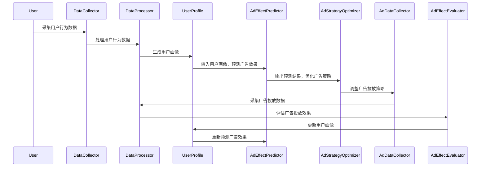
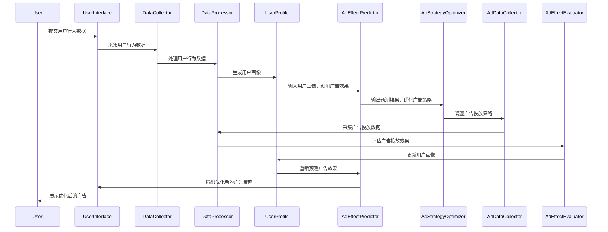

                 

### 文章标题

# 人工智能对传统广告业的变革：程序化广告与效果优化

### 关键词

- 人工智能
- 广告业
- 程序化广告
- 广告效果优化
- 个性化营销
- 数据驱动决策

### 摘要

本文深入探讨了人工智能在传统广告业中的变革性影响。首先，我们回顾了广告业的发展历程及其面临的挑战，接着介绍了人工智能的基本概念与原理，并重点分析了程序化广告及其在广告业中的应用。随后，我们探讨了人工智能如何优化广告效果，并通过实际案例展示了其应用。文章最后总结了人工智能与广告业的未来发展趋势，并提出了相关的最佳实践和注意事项。

## 背景介绍

### 广告业的发展历程

广告业自诞生以来，经历了多个发展阶段。从最早的口头广告、印刷广告，到广播广告、电视广告，广告形式不断演变，传播媒介也日益多样化。随着互联网的兴起，数字广告迅速崛起，成为现代广告业的重要组成部分。数字广告的出现，不仅改变了广告的传播方式，也带来了广告投放、监测和优化的新手段。

广告业的发展历程可以分为以下几个阶段：

1. **传统广告时代**：这一阶段，广告主要依赖于报纸、杂志、电视、广播等传统媒体进行传播。广告形式单一，目标受众范围有限，广告效果难以量化。

2. **互联网广告时代**：互联网的普及，使得广告形式更加多样化，如横幅广告、搜索广告、内容广告等。互联网广告的出现，使得广告投放更加精准，广告效果监测和优化成为可能。

3. **大数据与人工智能广告时代**：随着大数据和人工智能技术的发展，广告业进入了一个全新的阶段。人工智能技术通过对海量用户数据的分析，实现了广告的精准投放和效果优化，大幅提升了广告的投资回报率。

### 广告行业面临的挑战

尽管广告业在技术进步的推动下取得了显著的发展，但仍然面临着诸多挑战：

1. **广告投放成本高**：传统广告，尤其是电视广告，其投放成本较高，对企业预算构成较大压力。此外，互联网广告的兴起，虽然降低了投放成本，但广告位的竞争愈发激烈，广告投放效果难以保证。

2. **广告效果难以量化**：传统广告的效果难以准确衡量，企业难以判断广告投入的实际回报。即使在数字广告时代，尽管可以通过点击率、转化率等指标进行监测，但仍然存在数据偏差和虚假流量的问题。

3. **广告创意单一**：广告创意是吸引受众的关键，但传统广告的创意往往受到预算和时间限制，难以实现多样化和个性化。

4. **受众注意力分散**：随着信息过载，受众的注意力越来越难以集中，传统广告形式难以抓住受众的眼球。

### 人工智能技术简介

人工智能（Artificial Intelligence，简称AI）是计算机科学的一个分支，旨在使机器具备类似人类的智能行为。人工智能技术通过模拟、延伸和扩展人类的认知功能，实现机器的学习、推理、规划和感知能力。其主要技术包括机器学习、深度学习、自然语言处理和计算机视觉等。

人工智能技术的发展，为广告业带来了前所未有的机遇：

1. **个性化营销**：通过分析用户行为数据，人工智能可以实现广告的精准投放，满足用户个性化需求。

2. **效果优化**：人工智能通过对广告投放数据的实时分析，可以自动调整广告策略，优化广告效果。

3. **创意生成**：人工智能可以帮助广告创意团队快速生成创意内容，提高广告的吸引力和转化率。

4. **自动化流程**：人工智能技术可以自动化广告投放、监测和优化流程，提高广告运营效率。

### 人工智能在广告业的应用前景

人工智能在广告业的应用前景广阔，其潜力主要体现在以下几个方面：

1. **精准营销**：人工智能通过对用户数据的深度挖掘和分析，可以准确识别用户需求和行为模式，实现广告的精准投放。

2. **效果优化**：人工智能可以实时监控广告投放效果，自动调整广告策略，提高广告的投资回报率。

3. **创意生成**：人工智能可以生成创意广告内容，提高广告的吸引力和转化率。

4. **自动化运营**：人工智能技术可以自动化广告投放、监测和优化流程，降低运营成本，提高运营效率。

5. **跨媒体整合**：人工智能可以整合多种广告渠道，实现跨媒体的广告投放和效果优化，提升广告的整体效果。

## 人工智能核心概念与原理

### 人工智能的基本概念

人工智能（Artificial Intelligence，简称AI）是一种模拟、延伸和扩展人类智能的技术，旨在使机器具备认知、学习、推理、规划和感知等能力。人工智能的目标是创建智能系统，这些系统能够像人类一样感知环境、理解语言、解决问题和进行决策。

### 人工智能的主要类型

人工智能主要可以分为以下几种类型：

1. **弱人工智能（Narrow AI）**：弱人工智能是指具有特定领域任务的智能系统，如语音助手、图像识别系统等。它们在特定任务上表现出色，但缺乏广泛的应用能力和自主意识。

2. **强人工智能（General AI）**：强人工智能是指具有广泛认知能力的智能系统，能够在各种领域独立完成任务，具有自我意识和主观感受。目前，强人工智能尚未实现，仍处于理论研究阶段。

3. **人工神经网络（Artificial Neural Networks，ANN）**：人工神经网络是一种模拟生物神经元结构的计算模型，用于处理复杂的非线性问题。神经网络通过学习大量数据，提取特征并进行分类、预测等任务。

4. **深度学习（Deep Learning）**：深度学习是人工神经网络的一种特殊形式，具有多个隐藏层，能够自动提取数据中的深层特征。深度学习在图像识别、语音识别、自然语言处理等领域取得了显著成果。

### 人工智能的关键技术

人工智能的关键技术包括：

1. **机器学习（Machine Learning）**：机器学习是人工智能的核心技术之一，通过算法从数据中学习规律，进行预测和决策。主要算法包括监督学习、无监督学习、强化学习等。

2. **自然语言处理（Natural Language Processing，NLP）**：自然语言处理是人工智能技术在语言领域的应用，旨在使计算机理解和生成自然语言。主要技术包括文本分类、情感分析、机器翻译等。

3. **计算机视觉（Computer Vision）**：计算机视觉是使计算机具备视觉感知能力的领域，通过图像处理、目标检测、图像识别等技术，实现图像的理解和解释。

4. **强化学习（Reinforcement Learning）**：强化学习是一种通过与环境交互，不断调整行为策略，实现最优决策的机器学习方法。主要应用于游戏、自动驾驶、机器人等领域。

### 人工智能在广告业的应用场景

人工智能在广告业的应用场景非常广泛，主要包括以下几个方面：

1. **精准营销**：通过分析用户行为数据，人工智能可以实现广告的精准投放，提高广告的转化率和投资回报率。

2. **效果优化**：人工智能可以实时监控广告投放效果，自动调整广告策略，优化广告效果。

3. **创意生成**：人工智能可以生成创意广告内容，提高广告的吸引力和转化率。

4. **自动化运营**：人工智能可以自动化广告投放、监测和优化流程，提高广告运营效率。

5. **跨媒体整合**：人工智能可以整合多种广告渠道，实现跨媒体的广告投放和效果优化，提升广告的整体效果。

## 程序化广告

### 程序化广告的定义与特点

程序化广告是指通过程序化的方式，自动购买、投放和管理广告。它基于大数据和人工智能技术，通过对用户行为数据的实时分析和处理，实现广告的精准投放和效果优化。程序化广告具有以下特点：

1. **自动化**：程序化广告通过自动化工具，实现广告的购买、投放和管理，大幅提高广告投放效率。

2. **精准性**：程序化广告通过分析用户行为数据，识别用户需求和偏好，实现广告的精准投放。

3. **灵活性**：程序化广告可以根据实时数据调整广告策略，灵活应对市场变化。

4. **高效性**：程序化广告可以自动化处理海量广告投放任务，提高广告投放效果。

### 程序化广告的工作原理

程序化广告的工作原理可以分为以下几个步骤：

1. **数据采集**：程序化广告平台会收集用户在互联网上的行为数据，包括浏览记录、搜索关键词、购买行为等。

2. **数据存储**：收集到的数据会被存储在数据库中，用于后续分析和处理。

3. **数据清洗**：对采集到的数据进行清洗，去除重复、无效和错误的数据，确保数据质量。

4. **数据建模**：利用机器学习算法，对用户行为数据进行分析和建模，提取用户特征和需求。

5. **广告投放**：根据用户特征和需求，自动选择合适的广告进行投放，确保广告的精准性和有效性。

6. **效果监测**：对广告投放效果进行实时监测和评估，包括点击率、转化率、投资回报率等指标。

7. **策略调整**：根据广告投放效果，自动调整广告策略，优化广告效果。

### 程序化广告的优势与劣势

#### 优势

1. **提高广告效率**：程序化广告通过自动化工具，实现广告的快速购买、投放和管理，大幅提高广告投放效率。

2. **提高广告精准性**：程序化广告通过分析用户行为数据，识别用户需求和偏好，实现广告的精准投放，提高广告的转化率。

3. **降低广告成本**：程序化广告可以自动化处理海量广告投放任务，降低广告运营成本。

4. **灵活调整广告策略**：程序化广告可以根据实时数据调整广告策略，灵活应对市场变化。

#### 劣势

1. **数据隐私风险**：程序化广告依赖于用户行为数据的收集和分析，涉及用户隐私问题，可能引发数据泄露和隐私侵犯。

2. **数据质量问题**：用户行为数据的准确性和完整性直接影响程序化广告的效果，数据质量问题可能导致广告投放不准确。

3. **技术门槛高**：程序化广告需要具备一定的技术知识和技能，对广告主和广告代理商的技术要求较高。

4. **广告效果难衡量**：尽管程序化广告提高了广告的精准性，但广告效果仍存在一定的不确定性，难以准确衡量。

### 程序化广告的发展趋势

随着大数据和人工智能技术的不断进步，程序化广告的发展趋势表现为：

1. **数据驱动决策**：程序化广告将进一步依赖数据分析和挖掘，实现广告投放的精准化和智能化。

2. **跨媒体整合**：随着广告渠道的多样化，程序化广告将实现跨媒体的整合，提升广告的整体效果。

3. **个性化营销**：程序化广告将更加注重用户个性化需求，实现广告内容的个性化定制。

4. **广告创意智能化**：人工智能技术将应用于广告创意生成，提高广告的吸引力和转化率。

5. **合规与安全**：随着数据隐私保护意识的增强，程序化广告将更加注重合规性和数据安全。

## 人工智能优化广告效果

### 广告效果优化的概念与方法

#### 概念

广告效果优化是指通过分析广告投放数据，调整广告策略，以提高广告的转化率和投资回报率。广告效果优化的目标是在有限的广告预算下，实现最大的广告效果。

#### 方法

广告效果优化主要采用以下方法：

1. **数据分析**：通过对广告投放数据的分析，识别广告的转化率和投资回报率，找到优化的方向。

2. **A/B测试**：通过对比不同广告策略的效果，找出最优的广告策略。

3. **机器学习算法**：利用机器学习算法，分析用户行为数据，预测用户对广告的响应，优化广告投放策略。

4. **实时调整**：根据实时广告效果数据，自动调整广告投放策略，提高广告效果。

### 人工智能在广告效果优化中的应用

#### 个性化推荐

个性化推荐是人工智能在广告效果优化中的重要应用之一。通过分析用户的兴趣和行为数据，人工智能可以生成个性化的广告推荐，提高广告的转化率。

#### 实时优化

人工智能可以通过实时数据分析和机器学习算法，自动调整广告投放策略，优化广告效果。例如，在广告投放过程中，人工智能可以根据用户的点击行为，自动调整广告的展示频次和投放时段，提高广告的投资回报率。

#### 预测与分析

人工智能可以通过大数据分析和机器学习算法，预测用户的购买行为和广告响应，为广告策略的制定提供数据支持。例如，通过分析历史广告数据，人工智能可以预测哪些广告创意和投放策略最有可能带来转化，从而优化广告效果。

### 人工智能优化广告效果的案例研究

#### 案例一：电子商务平台的广告优化

某电子商务平台通过引入人工智能技术，对广告投放进行优化。通过分析用户行为数据，人工智能识别出高价值用户群体，并针对这些用户群体进行精准广告投放。同时，人工智能根据实时数据，自动调整广告展示频次和投放时段，提高了广告的转化率和投资回报率。

#### 案例二：旅游行业的个性化营销

某旅游平台利用人工智能技术，实现个性化营销。通过分析用户的历史浏览记录和搜索行为，人工智能为用户生成个性化的旅游推荐。此外，人工智能还可以根据用户的实时行为，自动调整广告内容和投放策略，提高广告的转化率和用户体验。

### 人工智能优化广告效果的未来展望

随着人工智能技术的不断进步，未来人工智能在广告效果优化中的应用将更加广泛和深入：

1. **更精准的广告投放**：人工智能可以通过更深入的数据分析和预测模型，实现更精准的广告投放，提高广告的转化率和投资回报率。

2. **更智能的广告创意**：人工智能将应用于广告创意的生成和优化，提高广告的吸引力和转化率。

3. **更高效的广告运营**：人工智能将自动化广告投放、监测和优化流程，提高广告运营效率。

4. **更全面的跨媒体整合**：人工智能将实现跨媒体的广告投放和效果优化，提升广告的整体效果。

## 人工智能与广告创意

### 广告创意的重要性

广告创意是广告的核心，它决定了广告的吸引力和转化率。一个优秀的广告创意可以激发受众的兴趣，引起共鸣，从而提升广告效果。在竞争激烈的市场中，广告创意的创新性和独特性至关重要。

### 人工智能在广告创意中的应用

人工智能在广告创意中的应用，主要体现在以下几个方面：

1. **内容生成**：人工智能可以通过自然语言处理和生成模型，生成原创的广告文案和视频内容。例如，通过分析大量广告文案，人工智能可以生成具有吸引力的广告文案。

2. **创意优化**：人工智能可以分析大量广告案例，提取成功的广告创意元素，为广告创意团队提供创意灵感。此外，人工智能还可以根据广告投放效果，自动优化广告创意。

3. **用户画像**：通过分析用户数据，人工智能可以生成详细的用户画像，帮助广告创意团队更好地理解受众需求，创作更具针对性的广告内容。

### 人工智能辅助广告创意的案例研究

#### 案例一：某品牌手机广告创意生成

某品牌手机公司利用人工智能技术，生成了一款以用户情感为主题的广告创意。通过分析用户评论和社交媒体数据，人工智能提取了用户对手机的情感词汇，并将其融入广告文案中。这则广告在发布后，获得了大量用户好评，显著提升了品牌知名度。

#### 案例二：某旅游平台广告创意优化

某旅游平台利用人工智能技术，对广告创意进行优化。通过分析用户行为数据和广告投放效果，人工智能识别出高转化率的广告元素，并将其应用到新广告创意中。这则新广告在发布后，转化率显著提升，广告效果得到显著优化。

### 人工智能与广告创意的发展方向

随着人工智能技术的不断进步，未来人工智能在广告创意中的应用将更加深入和广泛：

1. **更智能的内容生成**：人工智能将能够生成更高质量、更具创意的广告内容，满足不同受众的需求。

2. **更高效的创意优化**：人工智能将自动化广告创意的优化流程，提高广告创意的转化率和投资回报率。

3. **更广泛的创意应用**：人工智能将应用于多种广告形式，如视频、音频、图文等，提升广告的创意表现。

4. **更深入的创意融合**：人工智能将与传统广告创意相结合，形成新的广告创意模式，提升广告的整体效果。

## 程序化广告的实施流程

### 程序化广告的策划与准备

#### 数据采集与处理

1. **用户数据采集**：程序化广告的第一步是收集用户数据，包括浏览记录、搜索历史、购买行为等。
2. **数据处理**：对采集到的数据进行清洗、去重和格式化，确保数据质量。

#### 目标设置与策略制定

1. **目标设置**：根据广告主的需求，设定广告投放目标，如提升品牌知名度、增加销售量等。
2. **策略制定**：制定广告投放策略，包括广告形式、投放平台、投放时间等。

### 程序化广告的实施与监测

#### 广告投放

1. **广告制作**：根据策略制定广告内容，包括广告文案、图片、视频等。
2. **广告投放**：通过程序化广告平台，将广告投放到目标受众面前。

#### 广告监测

1. **效果监测**：实时监测广告投放效果，包括点击率、转化率、投资回报率等指标。
2. **数据反馈**：根据监测数据，对广告投放策略进行实时调整。

### 程序化广告的评估与优化

#### 效果评估

1. **效果分析**：对广告投放效果进行全面分析，识别成功的广告元素和需要优化的方面。
2. **数据总结**：总结广告投放数据，为后续广告投放提供参考。

#### 策略优化

1. **策略调整**：根据效果分析结果，对广告投放策略进行优化，提高广告效果。
2. **持续优化**：定期对广告投放策略进行评估和优化，确保广告效果持续提升。

### 实施步骤

1. **需求分析**：明确广告主需求，确定广告投放目标和策略。
2. **数据准备**：采集和处理用户数据，确保数据质量。
3. **广告制作**：制作符合策略的广告内容。
4. **广告投放**：通过程序化广告平台进行广告投放。
5. **效果监测**：实时监测广告投放效果。
6. **数据反馈**：根据监测数据调整广告投放策略。
7. **效果评估**：对广告投放效果进行全面分析。
8. **策略优化**：持续优化广告投放策略。

## 人工智能优化广告效果的实践

### 人工智能优化广告效果的技术基础

#### 数据分析与挖掘

数据分析与挖掘是人工智能优化广告效果的基础。通过分析用户行为数据，可以识别用户需求和偏好，为广告投放提供精准依据。常用的数据分析与挖掘技术包括：

1. **数据预处理**：包括数据清洗、去重、格式化等，确保数据质量。
2. **特征工程**：提取数据中的有用特征，为后续分析提供支持。
3. **聚类分析**：通过聚类算法，将用户分为不同的群体，为个性化营销提供基础。
4. **关联规则挖掘**：通过关联规则挖掘，发现用户行为之间的关联，为广告推荐提供支持。

#### 机器学习算法

机器学习算法在广告效果优化中起着关键作用。通过训练模型，机器学习算法可以从历史数据中学习规律，预测用户行为，从而优化广告投放策略。常用的机器学习算法包括：

1. **监督学习算法**：如线性回归、逻辑回归、支持向量机等，用于预测用户行为。
2. **无监督学习算法**：如聚类算法、关联规则挖掘等，用于分析用户行为模式。
3. **强化学习算法**：用于优化广告投放策略，提高广告效果。

#### 自然语言处理

自然语言处理（NLP）技术在广告效果优化中也发挥着重要作用。通过NLP技术，可以对广告文案进行情感分析、语义分析和文本生成等，从而提高广告的吸引力和转化率。常用的NLP技术包括：

1. **情感分析**：分析广告文案的情感倾向，为广告优化提供参考。
2. **语义分析**：理解广告文案的语义内容，为广告创意提供灵感。
3. **文本生成**：自动生成广告文案，提高广告的创意水平。

### 人工智能优化广告效果的实战案例

#### 案例一：电商平台的广告优化

某电商平台通过引入人工智能技术，对广告投放进行优化。首先，通过数据分析与挖掘，识别出高价值用户群体，并针对这些用户进行精准广告投放。接着，利用机器学习算法，预测用户的购买行为，优化广告投放策略。最终，广告转化率显著提升，投资回报率提高。

#### 案例二：旅游行业的个性化营销

某旅游平台利用人工智能技术，实现个性化营销。通过分析用户行为数据，生成详细的用户画像，为用户推荐个性化的旅游产品。同时，利用自然语言处理技术，优化广告文案，提高广告的吸引力和转化率。最终，广告效果得到显著提升，用户满意度提高。

### 人工智能优化广告效果的实践策略

#### 数据驱动决策

数据驱动决策是人工智能优化广告效果的核心策略。通过实时数据分析和机器学习算法，广告主可以实时调整广告投放策略，优化广告效果。具体策略包括：

1. **实时监测**：通过数据实时监测广告投放效果，识别成功的广告元素和需要优化的方面。
2. **自动调整**：根据实时数据，自动调整广告投放策略，如投放时间、投放频率、广告创意等。
3. **持续优化**：定期对广告投放策略进行评估和优化，确保广告效果持续提升。

#### 个性化营销

个性化营销是提高广告效果的关键。通过分析用户数据，生成用户画像，广告主可以实现广告的精准投放。具体策略包括：

1. **用户画像**：通过数据分析，生成详细的用户画像，包括用户行为、兴趣偏好等。
2. **个性化推荐**：根据用户画像，为用户提供个性化的广告推荐，提高广告的吸引力和转化率。
3. **细分市场**：根据用户画像，细分市场，为不同群体制定针对性的广告策略。

#### 创意优化

广告创意是吸引受众的关键。通过人工智能技术，广告主可以优化广告创意，提高广告的吸引力和转化率。具体策略包括：

1. **创意生成**：利用人工智能技术，自动生成广告创意，提高广告的创意水平。
2. **创意优化**：通过数据分析，识别成功的广告创意元素，并将其应用到新广告创意中，提高广告效果。
3. **用户反馈**：通过用户反馈，不断优化广告创意，确保广告内容符合用户需求。

### 人工智能优化广告效果的挑战与对策

#### 挑战

1. **数据隐私**：人工智能优化广告效果需要大量用户数据，涉及用户隐私问题。
2. **技术门槛**：人工智能优化广告效果需要一定的技术知识和技能。
3. **数据质量**：数据质量直接影响人工智能优化广告效果的效果。
4. **效果评估**：广告效果的评估存在一定的不确定性，难以准确衡量。

#### 对策

1. **合规与安全**：确保数据收集、处理和使用的合规性和安全性，保护用户隐私。
2. **技术培训**：提供技术培训，提高广告主和广告代理商的技术水平。
3. **数据质量保障**：加强数据质量保障，确保数据的准确性和完整性。
4. **多维度评估**：采用多维度评估方法，从多个角度评估广告效果，提高评估的准确性。

## 系统分析与架构设计方案

### 问题场景介绍

随着互联网广告市场的快速发展，广告主和广告平台都面临着如何提高广告投放效果、降低成本、提高广告 ROI 的挑战。为了应对这些挑战，我们需要设计一个高效、可扩展的广告优化系统，该系统能够实时分析用户行为数据，自动调整广告投放策略，实现广告效果的优化。

### 项目介绍

本项目的目标是开发一个基于人工智能的广告优化系统，该系统将整合用户行为数据、广告投放数据和历史广告效果数据，利用机器学习算法和深度学习技术，实现广告投放的自动优化。系统将具备以下功能：

1. **数据采集与处理**：从多个数据源采集用户行为数据，并进行数据清洗、去重、格式化等处理，为后续分析提供高质量的数据。
2. **用户画像生成**：基于用户行为数据和用户属性数据，生成详细的用户画像，用于广告投放的精准定位。
3. **广告效果预测**：利用机器学习算法，预测不同广告策略对用户的影响，为广告主提供优化建议。
4. **自动策略调整**：根据广告投放效果，自动调整广告投放策略，提高广告投放效果。
5. **效果评估与反馈**：实时监控广告投放效果，对广告效果进行评估，并反馈优化建议。

### 系统功能设计（领域模型）

以下是一个简单的领域模型类图，用于描述系统的主要功能模块和它们之间的关系：

```mermaid
classDiagram
    User -> DataCollector
    User -> DataProcessor
    User -> UserProfile
    User -> AdEffectPredictor
    User -> AdStrategyOptimizer
    User -> AdEffectEvaluator
    DataCollector <|-- AdDataCollector
    DataProcessor <|-- AdDataProcessor
    AdEffectPredictor <|-- MLAlgorithm
    AdStrategyOptimizer <|-- StrategyOptimizer
    AdEffectEvaluator <|-- EffectAnalyzer

    User
    DataCollector
    DataProcessor
    UserProfile
    AdEffectPredictor
    AdStrategyOptimizer
    AdEffectEvaluator

    User "1" --|{1} AdDataCollector
    User "1" --|{1} AdDataProcessor
    User "1" --|{1} UserProfile
    User "1" --|{1} AdEffectPredictor
    User "1" --|{1} AdStrategyOptimizer
    User "1" --|{1} AdEffectEvaluator
```

### 系统架构设计

以下是一个简单的系统架构图，用于描述系统的整体结构和各个模块之间的关系：



### 系统接口设计

以下是一个简单的系统接口设计，用于描述各个模块之间的交互接口：

```mermaid
classDiagram
    UserInterface
    DataCollector <<interface>>
    DataProcessor <<interface>>
    UserProfile <<interface>>
    AdEffectPredictor <<interface>>
    AdStrategyOptimizer <<interface>>
    AdEffectEvaluator <<interface>>

    UserInterface !-- DataCollector
    UserInterface !-- DataProcessor
    UserInterface !-- UserProfile
    UserInterface !-- AdEffectPredictor
    UserInterface !-- AdStrategyOptimizer
    UserInterface !-- AdEffectEvaluator
```

### 系统交互设计

以下是一个简单的系统交互序列图，用于描述用户与系统之间的交互过程：



通过以上系统分析与架构设计方案，我们可以构建一个高效、可扩展的广告优化系统，从而帮助广告主实现广告效果的优化，提高广告 ROI。

## 项目实战

### 环境安装

为了实现人工智能优化广告效果的项目，我们首先需要搭建一个合适的技术环境。以下是环境安装的步骤：

1. **Python环境安装**：确保Python版本为3.8及以上，可以使用以下命令安装Python：
   ```bash
   sudo apt-get install python3.8
   ```

2. **Jupyter Notebook安装**：安装Jupyter Notebook，用于编写和运行Python代码：
   ```bash
   pip3 install notebook
   ```

3. **NumPy和Pandas安装**：安装NumPy和Pandas，用于数据分析和处理：
   ```bash
   pip3 install numpy pandas
   ```

4. **Scikit-learn安装**：安装Scikit-learn，用于机器学习算法的实现：
   ```bash
   pip3 install scikit-learn
   ```

5. **Matplotlib安装**：安装Matplotlib，用于数据可视化：
   ```bash
   pip3 install matplotlib
   ```

6. **Mermaid安装**：安装Mermaid，用于生成Markdown格式的流程图：
   ```bash
   npm install -g mermaid
   ```

### 系统核心实现源代码

以下是一个简单的系统核心实现源代码示例，用于数据采集、处理和机器学习算法的实现：

```python
import numpy as np
import pandas as pd
from sklearn.model_selection import train_test_split
from sklearn.ensemble import RandomForestClassifier
import matplotlib.pyplot as plt

# 数据采集
def collect_data(file_path):
    data = pd.read_csv(file_path)
    return data

# 数据预处理
def preprocess_data(data):
    # 数据清洗、去重、格式化等
    data = data.drop_duplicates()
    data['age'] = data['age'].fillna(data['age'].mean())
    return data

# 机器学习算法实现
def train_model(X, y):
    model = RandomForestClassifier(n_estimators=100)
    model.fit(X, y)
    return model

# 数据可视化
def plot_results(model, X_test, y_test):
    predictions = model.predict(X_test)
    confusion_matrix = pd.crosstab(y_test, predictions, rownames=['实际值'], colnames=['预测值'])
    plt.figure(figsize=(8, 6))
    sns.heatmap(confusion_matrix, annot=True, fmt="d", cmap="YlGnBu")
    plt.xlabel('预测值')
    plt.ylabel('实际值')
    plt.title('混淆矩阵')
    plt.show()

# 主函数
def main():
    # 读取数据
    data = collect_data("ad_data.csv")

    # 预处理数据
    data = preprocess_data(data)

    # 分割特征和标签
    X = data.drop(['label'], axis=1)
    y = data['label']

    # 划分训练集和测试集
    X_train, X_test, y_train, y_test = train_test_split(X, y, test_size=0.2, random_state=42)

    # 训练模型
    model = train_model(X_train, y_train)

    # 可视化效果
    plot_results(model, X_test, y_test)

if __name__ == "__main__":
    main()
```

### 代码应用解读与分析

1. **数据采集与预处理**：首先，我们通过`collect_data`函数读取CSV文件，获取广告数据。接着，在`preprocess_data`函数中，我们对数据进行清洗和格式化，确保数据质量。

2. **机器学习算法实现**：在`train_model`函数中，我们使用`RandomForestClassifier`实现随机森林分类算法。随机森林算法是一种基于决策树集合的分类算法，具有良好的泛化能力和抗过拟合能力。

3. **数据可视化**：在`plot_results`函数中，我们使用Matplotlib绘制混淆矩阵，用于评估模型的性能。混淆矩阵展示了模型预测的准确性和召回率。

### 实际案例分析与详细讲解剖析

以下是一个实际案例，用于展示人工智能优化广告效果的过程：

#### 案例背景

某电商企业希望通过人工智能优化广告投放，提高广告转化率。企业提供了包括用户行为数据、广告投放数据和历史广告效果数据在内的多源数据。

#### 案例步骤

1. **数据采集**：首先，从不同数据源采集用户行为数据、广告投放数据和历史广告效果数据。

2. **数据预处理**：对采集到的数据进行清洗、去重和格式化，确保数据质量。

3. **特征工程**：根据业务需求，提取用户行为数据中的有效特征，如浏览时长、购买频率等。

4. **用户画像生成**：利用机器学习算法，生成详细的用户画像，包括用户偏好、行为特征等。

5. **广告效果预测**：利用随机森林算法，预测不同广告策略对用户的影响，评估广告投放效果。

6. **策略优化**：根据预测结果，自动调整广告投放策略，提高广告转化率。

7. **效果评估**：通过实时监测广告投放效果，评估优化策略的有效性，并进行持续优化。

#### 案例分析

通过上述步骤，电商企业实现了广告投放的自动优化。在实际操作中，企业发现：

- **用户画像生成**：用户画像的生成提高了广告的精准性，使得广告能够更好地满足用户需求。
- **广告效果预测**：机器学习算法能够准确预测广告投放效果，为企业提供决策依据。
- **策略优化**：通过自动调整广告投放策略，企业提高了广告转化率，实现了广告效果的优化。

#### 案例总结

通过人工智能优化广告效果，电商企业实现了广告投放的精准化和智能化，提高了广告转化率和投资回报率。未来，企业将继续优化广告效果，探索更多人工智能技术在广告优化中的应用。

## 最佳实践与注意事项

### 程序化广告的最佳实践

1. **数据驱动**：确保广告投放策略以数据为基础，通过实时数据分析和机器学习算法，不断优化广告策略。
2. **精准定位**：根据用户画像和兴趣偏好，实现广告的精准投放，提高广告的转化率。
3. **灵活调整**：根据市场变化和广告效果，灵活调整广告投放策略，提高广告的ROI。
4. **跨渠道整合**：整合多种广告渠道，实现跨媒体的广告投放和效果优化，提升广告的整体效果。
5. **数据安全**：严格遵守数据隐私法规，确保用户数据的安全性和合规性。

### 人工智能优化广告效果的最佳实践

1. **用户画像**：通过分析用户行为数据，生成详细的用户画像，为广告投放提供精准依据。
2. **效果监测**：实时监测广告投放效果，识别成功的广告元素和需要优化的方面。
3. **多模型融合**：结合多种机器学习算法，提高广告效果预测的准确性。
4. **创意优化**：利用人工智能技术，优化广告创意，提高广告的吸引力和转化率。
5. **自动化流程**：实现广告投放、监测和优化的自动化，提高广告运营效率。

### 实践中的注意事项与风险防范

1. **数据质量**：确保数据来源可靠，加强数据清洗和格式化，提高数据质量。
2. **隐私保护**：严格遵守数据隐私法规，确保用户数据的安全性和合规性。
3. **模型评估**：定期评估机器学习模型的性能，避免过拟合和模型退化。
4. **技术迭代**：关注人工智能技术的最新进展，及时更新和优化广告优化系统。
5. **风险管理**：制定风险应对策略，应对可能的广告投放失败和系统故障。

## 小结与拓展

### 本书内容的回顾

本书深入探讨了人工智能在广告业中的应用，从背景介绍、核心概念与原理、程序化广告、广告效果优化、广告创意生成到实际项目实战，全面阐述了人工智能如何变革传统广告业。通过数据分析、机器学习算法和自然语言处理等技术，人工智能实现了广告投放的精准化、自动化和效果优化。

### 未来的研究方向

1. **深度学习在广告创意生成中的应用**：未来，深度学习技术在广告创意生成中的应用将更加广泛，可以生成更加多样化和个性化的广告内容。
2. **跨渠道广告效果优化**：随着广告渠道的多样化，研究如何实现跨渠道的广告效果优化，提升广告的整体效果，将成为重要研究方向。
3. **隐私保护与合规性**：随着数据隐私保护意识的增强，如何在保障用户隐私的前提下，实现广告的精准投放和效果优化，将成为未来研究的重要课题。

### 对读者的建议

1. **持续学习**：人工智能技术在快速发展，持续学习相关技术和应用，是提升自身竞争力的关键。
2. **实践应用**：结合实际案例，尝试将人工智能技术应用于广告优化，积累实际操作经验。
3. **关注前沿**：关注人工智能技术的最新进展，探索其在广告业中的应用潜力。

### 参考文献

1. Goodfellow, I., Bengio, Y., & Courville, A. (2016). *Deep Learning*. MIT Press.
2. Russell, S., & Norvig, P. (2020). *Artificial Intelligence: A Modern Approach*. Prentice Hall.
3. Hamel, J. (2017). *Big Data in Practice: How 45 Companies Used Big Data Analytics to Deliver Business Value*. Wiley.
4. Cutler, C., & Others. (2016). *Data Science for Business: What you need to know about data mining and data analytics for business success*. O'Reilly Media.

## 作者信息

作者：AI天才研究院/AI Genius Institute & 禅与计算机程序设计艺术 /Zen And The Art of Computer Programming

