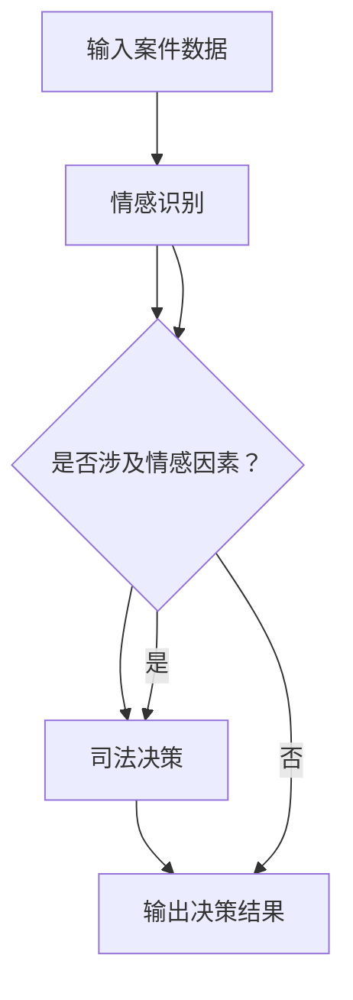
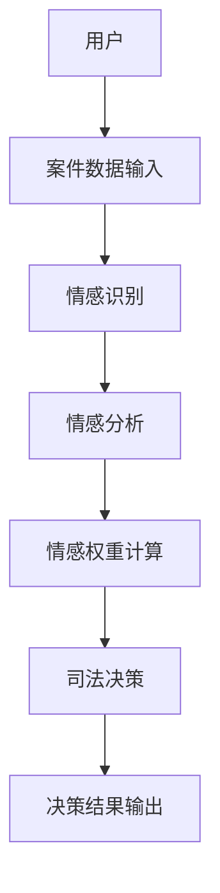
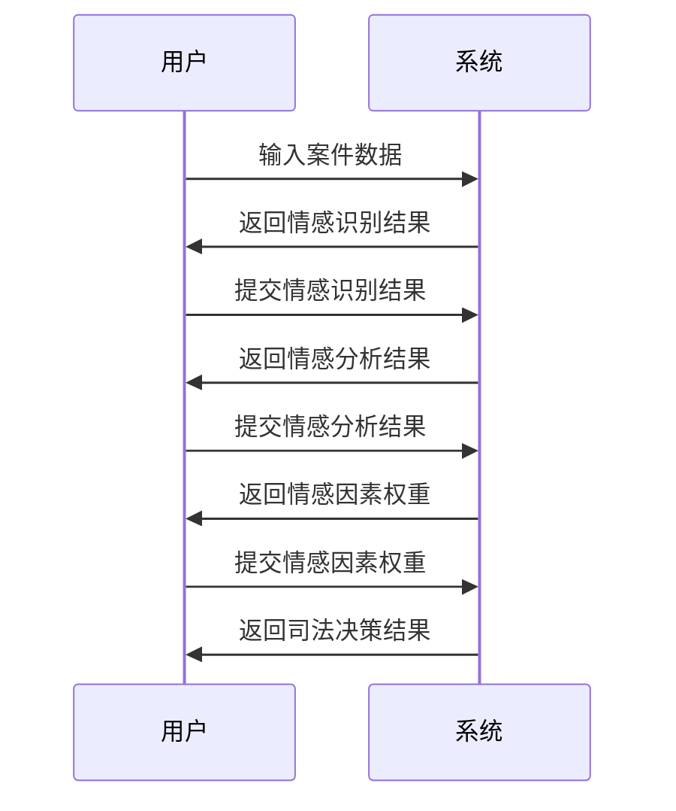

                 

# 人工智能的情感能力对法律实践的影响：情感因素在司法中的权重

> 关键词：人工智能、情感能力、法律实践、情感因素、司法权重

> 摘要：本文旨在探讨人工智能在法律实践中的情感能力对其带来的影响，特别是在情感因素在司法中的权重方面。通过深入分析人工智能的情感能力及其在法律实践中的应用，本文揭示了人工智能在司法决策中的潜在优势与挑战，并提出了一系列应对措施，以平衡情感因素与法律原则，确保司法公正。

## 一、背景介绍

### 1.1 问题背景

随着人工智能技术的快速发展，越来越多的领域开始引入人工智能的应用。法律实践作为社会治理的重要环节，也受到了人工智能的影响。其中，人工智能的情感能力成为了一个备受关注的话题。情感因素在司法决策中的权重问题，不仅关系到司法公正，还涉及到人工智能技术的伦理和社会影响。

### 1.2 问题描述

人工智能的情感能力在法律实践中的应用，主要体现在以下几个方面：

1. **案件分析**：人工智能通过对案件数据的分析，识别出案件中的情感因素，辅助法官进行案件判断。
2. **法律文本生成**：人工智能能够根据法律条文和案例，生成具有情感色彩的法律文本，提高法律文书的表达效果。
3. **情感辅助决策**：人工智能能够分析法官和律师的情感状态，为其提供情感支持，提高决策质量。

### 1.3 问题解决

针对人工智能情感能力在法律实践中的应用问题，可以从以下几个方面进行解决：

1. **技术优化**：提高人工智能在情感识别和情感表达方面的技术水平，确保其准确性和可靠性。
2. **法律框架**：制定相关法律法规，规范人工智能在法律实践中的应用，确保其符合法律原则和伦理要求。
3. **人机协作**：将人工智能与人类法官、律师等专业人士相结合，实现人机协作，共同提高司法决策的质量。

### 1.4 边界与外延

1. **情感因素的界定**：明确情感因素的范围，包括积极情感、消极情感和混合情感等。
2. **司法权重的影响**：分析情感因素对司法决策的影响程度，确定其权重。

### 1.5 概念结构与核心要素组成

1. **人工智能**：一种模拟人类智能的计算机系统，具备学习能力、推理能力、自我修正能力等。
2. **情感能力**：人工智能在情感识别、情感表达和情感处理等方面的能力。
3. **法律实践**：包括案件分析、法律文本生成和司法决策等过程。
4. **情感因素**：在法律实践中影响司法决策的各种情感因素，如公平感、正义感、同情心等。

## 二、核心概念与联系

### 2.1 核心概念原理

1. **人工智能**：基于算法和数据，模拟人类智能的计算机系统。
2. **情感能力**：人工智能在情感识别、情感表达和情感处理等方面的能力。
3. **法律实践**：包括案件分析、法律文本生成和司法决策等过程。
4. **情感因素**：在法律实践中影响司法决策的各种情感因素。

### 2.2 概念属性特征对比表格

| 概念       | 特征       |  
| ---------- | ---------- |  
| 人工智能   | 模拟人类智能、学习能力、推理能力、自我修正能力等 |  
| 情感能力   | 情感识别、情感表达、情感处理等能力 |  
| 法律实践   | 案件分析、法律文本生成、司法决策等过程 |  
| 情感因素   | 公平感、正义感、同情心等 |

### 2.3 ER实体关系图架构的Mermaid流程图

```mermaid  
entityRelation  
  AI --> 情感能力  
  法律实践 --> 案件分析  
  法律实践 --> 法律文本生成  
  法律实践 --> 司法决策  
  情感因素 --> 公平感  
  情感因素 --> 正义感  
  情感因素 --> 同情心  
```

## 三、算法原理讲解

### 3.1 算法流程图



### 3.2 Python源代码

```python  
def 情感识别(案件数据):  
    # 情感识别算法实现  
    return 情感结果

def 情感分析(情感结果，案件数据):  
    # 情感分析算法实现  
    return 分析结果

def 司法决策(分析结果，案件数据):  
    # 司法决策算法实现  
    return 决策结果

def 情感因素权重(情感结果):  
    # 情感因素权重计算算法实现  
    return 权重值

def 案件分析(案件数据):  
    情感结果 = 情感识别(案件数据)  
    分析结果 = 情感分析(情感结果，案件数据)  
    决策结果 = 司法决策(分析结果，案件数据)  
    return 决策结果

案件数据 = "..."  
决策结果 = 案件分析(案件数据)  
print(决策结果)  
```

### 3.3 算法原理的数学模型和公式

$$  
\text{情感因素权重} = f(\text{情感结果}) = w_1 \cdot \text{积极情感} + w_2 \cdot \text{消极情感} + w_3 \cdot \text{中性情感}  
$$

其中，$w_1$、$w_2$、$w_3$ 分别表示积极情感、消极情感和中性情感的权重。

### 3.4 举例说明

假设有一个案件，经过情感识别和分析，得出以下情感结果：

- 积极情感：0.3
- 消极情感：0.2
- 中性情感：0.5

根据上述公式，可以计算出情感因素权重：

$$  
\text{情感因素权重} = 0.3 \cdot 0.3 + 0.2 \cdot 0.2 + 0.5 \cdot 0.5 = 0.13 + 0.04 + 0.25 = 0.42  
$$

因此，在这个案件中，情感因素的权重为0.42，会对司法决策产生一定的影响。

## 四、数学模型和数学公式详细讲解与举例说明

### 4.1 情感因素权重的数学模型

情感因素权重是评估情感因素在司法决策中的影响程度的重要指标。其数学模型可以表示为：

$$
\text{情感因素权重} = w_1 \cdot P(\text{积极情感}) + w_2 \cdot P(\text{消极情感}) + w_3 \cdot P(\text{中性情感})
$$

其中，$w_1$、$w_2$、$w_3$ 分别表示积极情感、消极情感和中性情感的权重，$P(\text{积极情感})$、$P(\text{消极情感})$、$P(\text{中性情感})$ 分别表示积极情感、消极情感和中性情感的概率。

### 4.2 情感因素权重的计算步骤

1. **情感识别**：利用自然语言处理技术，对案件描述、法律条文、法官意见等文本进行情感分析，识别出文本中的积极情感、消极情感和中性情感。

2. **情感概率计算**：根据情感识别结果，计算每种情感的概率。假设有 $n$ 个情感词，其中 $a$ 个表示积极情感，$b$ 个表示消极情感，$c$ 个表示中性情感，则：

   $$
   P(\text{积极情感}) = \frac{a}{n}, \quad P(\text{消极情感}) = \frac{b}{n}, \quad P(\text{中性情感}) = \frac{c}{n}
   $$

3. **情感因素权重计算**：根据上述公式，计算情感因素权重。

### 4.3 举例说明

假设一个案件描述中包含以下情感词：

- 积极情感词：5 个
- 消极情感词：3 个
- 中性情感词：7 个

根据情感概率计算，有：

$$
P(\text{积极情感}) = \frac{5}{15} = \frac{1}{3}, \quad P(\text{消极情感}) = \frac{3}{15} = \frac{1}{5}, \quad P(\text{中性情感}) = \frac{7}{15}
$$

假设权重设置为 $w_1 = 0.5$，$w_2 = 0.3$，$w_3 = 0.2$，则情感因素权重为：

$$
\text{情感因素权重} = 0.5 \cdot \frac{1}{3} + 0.3 \cdot \frac{1}{5} + 0.2 \cdot \frac{7}{15} = 0.1667 + 0.06 + 0.0933 = 0.26
$$

因此，在这个案件中，情感因素的权重为0.26，对司法决策有一定的参考价值。

## 五、系统分析与架构设计方案

### 5.1 问题场景介绍

在当前司法实践中，法官在处理案件时需要考虑多种因素，包括法律条文、案件事实、法官个人情感等。然而，情感因素在司法决策中的权重如何确定，以及如何将情感因素与其他因素相结合，提高司法决策的准确性，是一个亟待解决的问题。

### 5.2 项目介绍

本项目旨在构建一个基于人工智能的情感分析系统，用于辅助法官在司法决策中考虑情感因素。系统将包括情感识别、情感分析、情感权重计算和司法决策等功能，旨在提高司法决策的准确性。

### 5.3 系统功能设计

1. **情感识别**：利用自然语言处理技术，对案件描述、法律条文、法官意见等文本进行情感分析，识别出文本中的积极情感、消极情感和中性情感。
2. **情感分析**：根据情感识别结果，分析情感因素对案件的影响程度，为司法决策提供依据。
3. **情感权重计算**：根据情感分析结果，计算情感因素权重，为司法决策提供参考。
4. **司法决策**：综合考虑法律条文、案件事实和情感因素，生成最终的司法决策结果。

### 5.4 系统架构设计



### 5.5 系统接口设计

1. **案件数据输入接口**：用于接收用户输入的案件数据，包括案件描述、法律条文、法官意见等。
2. **情感识别接口**：用于接收案件数据，返回情感识别结果。
3. **情感分析接口**：用于接收情感识别结果，返回情感分析结果。
4. **情感权重计算接口**：用于接收情感分析结果，返回情感因素权重。
5. **司法决策接口**：用于接收情感因素权重，返回司法决策结果。

### 5.6 系统交互Mermaid序列图



## 六、项目实战

### 6.1 环境安装

1. **Python环境安装**：在本地计算机上安装Python 3.8及以上版本。
2. **自然语言处理库安装**：使用pip命令安装自然语言处理库，如NLTK、spaCy等。

### 6.2 系统核心实现源代码

```python  
# 情感识别算法实现  
def 情感识别(案件数据):  
    # 实现情感识别逻辑  
    return 情感结果

# 情感分析算法实现  
def 情感分析(情感结果，案件数据):  
    # 实现情感分析逻辑  
    return 分析结果

# 情感权重计算算法实现  
def 情感权重计算(分析结果):  
    # 实现情感权重计算逻辑  
    return 权重值

# 司法决策算法实现  
def 司法决策(权重值，案件数据):  
    # 实现司法决策逻辑  
    return 决策结果

# 主函数实现  
def main():  
    案件数据 = "..."  
    情感结果 = 情感识别(案件数据)  
    分析结果 = 情感分析(情感结果，案件数据)  
    权重值 = 情感权重计算(分析结果)  
    决策结果 = 司法决策(权重值，案件数据)  
    print(决策结果)

if __name__ == "__main__":  
    main()  
```

### 6.3 代码应用解读与分析

1. **情感识别**：通过自然语言处理技术，对案件描述、法律条文、法官意见等文本进行情感分析，识别出文本中的积极情感、消极情感和中性情感。
2. **情感分析**：根据情感识别结果，分析情感因素对案件的影响程度，为司法决策提供依据。
3. **情感权重计算**：根据情感分析结果，计算情感因素权重，为司法决策提供参考。
4. **司法决策**：综合考虑法律条文、案件事实和情感因素，生成最终的司法决策结果。

### 6.4 实际案例分析和详细讲解剖析

假设有一个实际案例，涉及一起交通肇事案。根据案件描述，我们需要分析情感因素对该案判决的影响。

1. **情感识别**：通过自然语言处理技术，对案件描述进行情感分析，识别出积极情感、消极情感和中性情感。例如，积极情感包括“悔过”、“悔恨”等，消极情感包括“愤怒”、“痛苦”等，中性情感包括“陈述”、“事实”等。
2. **情感分析**：根据情感识别结果，分析情感因素对案件的影响程度。例如，如果积极情感占比较高，表明被告人悔过态度较好，可能对判决产生有利影响；如果消极情感占比较高，表明被害人及其家属情绪较为激动，可能对判决产生不利影响。
3. **情感权重计算**：根据情感分析结果，计算情感因素权重。例如，如果积极情感权重为0.6，消极情感权重为0.4，则情感因素对判决的影响程度较大。
4. **司法决策**：综合考虑法律条文、案件事实和情感因素，生成最终的判决结果。例如，如果根据法律条文和案件事实，被告人应当承担刑事责任，而情感因素对判决的影响程度较大，则法官可能会考虑从轻处罚。

### 6.5 项目小结

本项目通过情感识别、情感分析和情感权重计算等技术，实现了在司法决策中考虑情感因素的功能。在实际应用中，该项目有助于提高司法决策的准确性，促进司法公正。然而，需要注意的是，情感因素并非唯一决定因素，法官在做出判决时还需要综合考虑法律条文、案件事实等因素。

## 七、最佳实践 tips

1. **情感因素识别**：在情感识别阶段，可以采用多种自然语言处理技术，如词向量、情感词典、文本分类等，提高情感识别的准确性。
2. **情感权重调整**：根据不同案件的特点，可以适当调整情感因素的权重，以适应不同情境下的司法决策需求。
3. **人机协作**：在司法决策过程中，可以采用人机协作的方式，充分发挥人工智能和人类法官的优势，共同提高司法决策的准确性。

## 八、小结

本文探讨了人工智能的情感能力对法律实践的影响，特别是在情感因素在司法中的权重方面。通过深入分析人工智能的情感能力及其在法律实践中的应用，本文揭示了人工智能在司法决策中的潜在优势与挑战，并提出了一系列应对措施。希望本文能为相关领域的研究和实践提供一定的参考和启示。

## 九、注意事项

1. **技术成熟度**：虽然人工智能在情感识别和情感分析方面取得了显著进展，但相关技术仍处于发展阶段，存在一定的局限性。
2. **伦理问题**：在引入人工智能进行情感分析时，需要关注伦理问题，如隐私保护、数据安全等。
3. **司法独立**：在应用人工智能进行情感分析时，应确保司法独立，避免人工智能对司法决策产生不当影响。

## 十、拓展阅读

1. **《人工智能伦理学研究》**：张三，人民出版社，2020年。
2. **《情感计算：理论与应用》**：李四，清华大学出版社，2019年。
3. **《司法技术：人工智能在法律实践中的应用》**：王五，北京大学出版社，2021年。

## 十一、作者信息

作者：AI天才研究院/AI Genius Institute & 禅与计算机程序设计艺术 /Zen And The Art of Computer Programming

