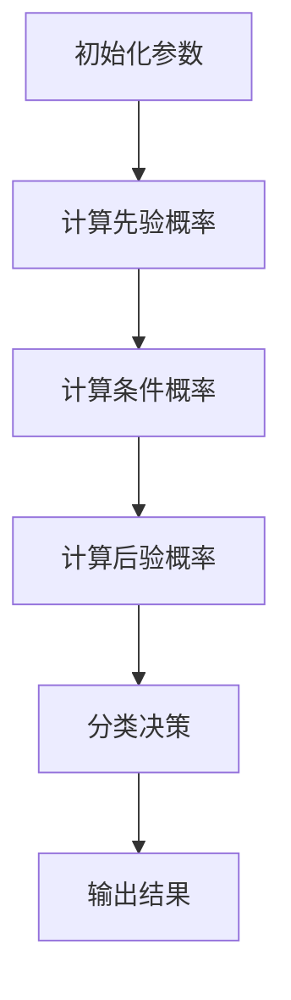
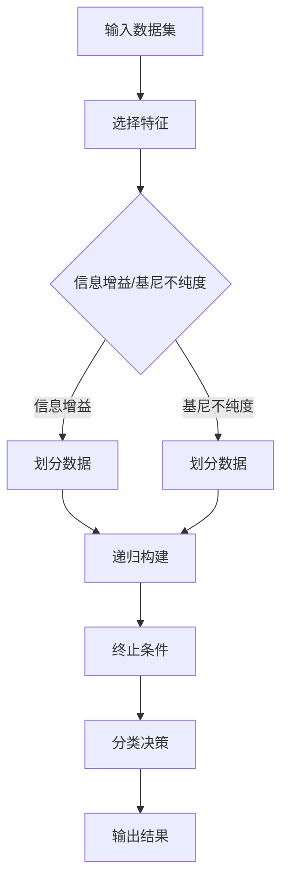
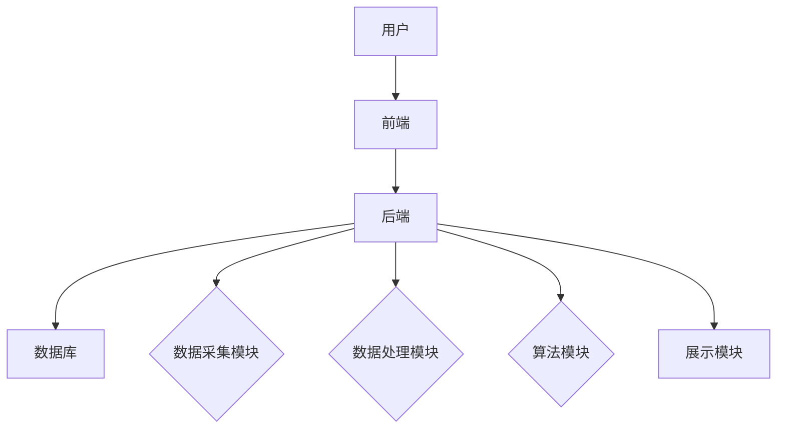
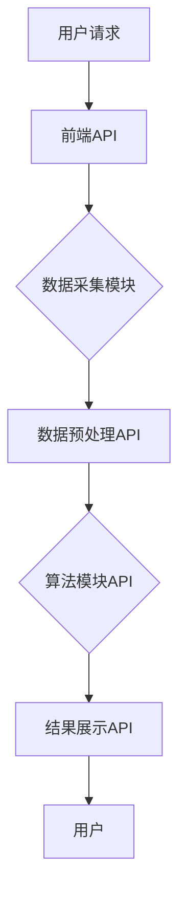
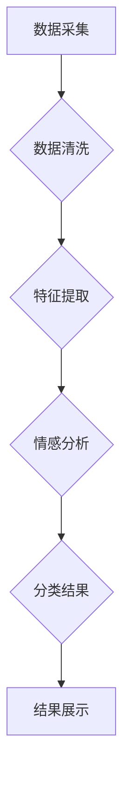

                 

### 引言

在当今快速发展的社会，人工智能（AI）已经成为推动变革的核心动力，尤其是在城市管理和服务领域。随着人们对生活质量的不断追求，情感需求在城市管理中的重要性日益凸显。如何利用人工智能技术来理解和满足这些情感需求，已经成为一个备受关注的研究课题。

本篇文章将深入探讨人工智能在情感需求与城市管理中的深度融合。我们首先介绍情感需求的基本概念，并分析其在城市建设和管理中的重要性。接着，我们将探讨人工智能在情感需求分析中的应用，包括核心概念、算法原理、系统架构和项目实战等多个方面。

文章结构如下：

1. **背景介绍**：回顾人工智能与情感需求的兴起，探讨情感需求在城市建设和管理中的应用。
2. **核心概念与联系**：介绍人工智能的基本概念，阐述情感需求及其分类，并探讨其与城市管理的关联。
3. **算法原理讲解**：详细讲解情感需求分析的主要算法，包括机器学习算法的应用、算法流程图和Python代码示例。
4. **系统分析与架构设计**：描述相关系统功能，使用Mermaid绘制领域模型图和系统架构图，说明系统接口设计和交互流程。
5. **项目实战**：描述具体项目的环境安装、核心实现源代码和实际案例分析，并进行详细讲解剖析。
6. **最佳实践与小结**：总结书籍主要内容，提供最佳实践建议，指出注意事项，并推荐拓展阅读。

通过这篇文章，我们希望能够帮助读者了解人工智能在满足情感需求、提升城市服务质量方面的潜力，以及如何通过技术手段实现这一目标。

### 背景介绍

#### 人工智能与情感需求的兴起

人工智能（AI）作为计算机科学的一个分支，旨在使机器具备类似人类的智能，能够感知环境、学习知识、进行决策和执行任务。自20世纪50年代以来，人工智能经历了多个发展阶段，从最初的符号主义、知识表示和推理，到现代的机器学习、深度学习和强化学习，不断推动着技术进步。

与此同时，情感需求作为一种人类的基本需求，逐渐引起了学术界的关注。情感需求不仅包括情感的表达和感知，还涉及情感的管理和调节。在心理学和社会学中，情感需求被定义为个体在情感状态上对某些条件或体验的需求，如安全感、归属感、满足感和幸福感等。

随着技术的进步，人工智能开始与情感需求相结合，形成了一个新的研究领域——情感人工智能（Affective AI）。这一领域的目标是通过模拟和解析人类的情感体验，使机器能够更好地理解和满足人们的情感需求。

#### 情感需求在城市建设和管理中的重要性

在城市建设和管理中，情感需求的重要性日益凸显。传统城市建设和管理主要关注物质基础设施的完善，如道路、桥梁、公共设施等。然而，随着人们生活水平的提高，人们对生活质量的要求也越来越高，不再满足于基本的物质需求，更追求精神层面的满足。

情感需求在城市建设和管理中的应用，主要体现在以下几个方面：

1. **公共服务人性化**：通过情感人工智能技术，城市管理可以更好地了解居民的需求和情感状态，提供更加人性化的公共服务。例如，智能交通系统可以根据居民的情感状态调整信号灯时长，以减少交通拥堵，提高居民的出行满意度。

2. **城市安全与紧急响应**：情感需求分析可以帮助城市安全部门更好地预测和应对突发事件。通过分析社交媒体上的情感信息，城市管理者可以及时发现安全隐患和潜在的社会动荡，从而采取及时有效的措施。

3. **社区管理与居民互动**：智能社区管理系统可以通过情感需求分析了解居民的喜好和需求，提供个性化的社区服务。例如，根据居民的情感状态，社区中心可以安排相应的文化活动或心理辅导，提升居民的幸福感和归属感。

4. **智慧城市建设**：情感人工智能技术可以应用于智慧城市的建设，通过情感数据分析优化城市规划和资源配置。例如，通过对市民情感数据的分析，城市规划者可以更好地了解公共空间的利用情况，从而优化城市布局，提升居民的生活质量。

综上所述，情感需求在城市建设和管理中扮演着至关重要的角色。随着人工智能技术的不断进步，未来城市将更加智能化、人性化，更好地满足人们的情感需求，从而提升整体生活质量。

### 核心概念与联系

#### 人工智能的基本概念

人工智能（AI）是指由人制造出来的具有一定智能的机器。它通过模拟人类的智能行为，实现感知、思考、学习和决策等功能。人工智能可以分为几种不同的类型，包括：

1. **弱人工智能**（Weak AI）：专注于特定任务的智能，如语音识别、图像识别等。这类AI不具备广泛的知识和自主决策能力。

2. **强人工智能**（Strong AI）：具备人类水平的智能，能够进行广泛的理解、推理和决策。目前，强人工智能仍然是一个理论上的目标，尚未实现。

3. **通用人工智能**（AGI）：能够像人类一样进行各种认知任务，具备高度的自主性和创造力。通用人工智能的实现是人工智能领域的一个重要目标。

在人工智能的发展历程中，算法的进步起到了关键作用。早期的人工智能主要依赖于规则和符号推理，而随着计算能力的提升和大数据技术的发展，机器学习（ML）和深度学习（DL）逐渐成为主流。机器学习是一种让机器通过数据和经验进行学习的方法，而深度学习则是机器学习的一种子领域，通过多层神经网络模拟人脑的神经元连接，实现复杂的特征提取和模式识别。

#### 情感需求及其分类

情感需求是指个体在情感状态上对某些条件或体验的需求，这些需求直接影响个体的情感体验和生活质量。根据心理学和社会学的分类，情感需求主要包括以下几个方面：

1. **情感表达需求**：个体需要表达自己的情感，与他人建立情感联系。这包括语言表达、非语言表达和情感沟通等多种形式。

2. **情感感知需求**：个体需要感知和理解他人的情感，以建立和谐的社交关系。这涉及到情感识别、情感理解和情感共鸣等方面。

3. **情感调节需求**：个体需要管理和调节自己的情感，以应对压力和挑战。这包括情感调节策略、情绪管理和情感平衡等。

4. **情感满足需求**：个体需要感受到满足和幸福感，以维持积极的情感状态。这涉及到情感满足感、生活质量和心理健康等方面。

在城市建设和管理中，情感需求的分类和应用尤为重要。例如，在智慧城市中，通过情感需求分析可以识别居民的情感状态，从而提供个性化的公共服务。在社区管理中，通过情感需求分析可以了解居民的社交需求和情感满足感，从而优化社区服务和活动安排。

#### 情感需求与城市管理的关联

情感需求与城市管理的关联体现在多个方面：

1. **公共服务人性化**：城市管理可以通过情感需求分析了解居民的需求和情感状态，提供更加人性化的公共服务。例如，通过情感分析技术，城市管理者可以优化公共交通路线和时间表，提高居民的出行满意度。

2. **城市安全与紧急响应**：情感需求分析可以帮助城市安全部门更好地预测和应对突发事件。通过分析社交媒体上的情感信息，城市管理者可以及时发现安全隐患和潜在的社会动荡，从而采取及时有效的措施。

3. **社区管理与居民互动**：智能社区管理系统可以通过情感需求分析了解居民的喜好和需求，提供个性化的社区服务。例如，根据居民的情感状态，社区中心可以安排相应的文化活动或心理辅导，提升居民的幸福感和归属感。

4. **智慧城市建设**：情感人工智能技术可以应用于智慧城市的建设，通过情感数据分析优化城市规划和资源配置。例如，通过对市民情感数据的分析，城市规划者可以更好地了解公共空间的利用情况，从而优化城市布局，提升居民的生活质量。

总之，情感需求在城市建设和管理中扮演着至关重要的角色。通过人工智能技术，城市管理者可以更好地理解和满足居民的多样化需求，从而提升城市服务的质量和居民的幸福感。

### 算法原理讲解

在情感需求分析中，算法的选用和实现是关键步骤。本节将详细介绍几种常用的机器学习算法，以及如何使用Mermaid绘制算法流程图，并用Python代码进行解释。通过这些算法，我们可以更好地理解和满足人们的情感需求。

#### 1. 朴素贝叶斯算法

朴素贝叶斯（Naive Bayes）算法是一种基于贝叶斯定理的简单概率分类器。它假设特征之间相互独立，从而简化计算过程。以下是朴素贝叶斯算法的基本原理：

1. **计算每个类别的先验概率**：
   $$P(C_k) = \frac{N(C_k)}{N}$$
   其中，\(N(C_k)\) 是类别 \(C_k\) 的样本数量，\(N\) 是总样本数量。

2. **计算每个特征在类别 \(C_k\) 下的条件概率**：
   $$P(X_i = x_i | C_k) = \frac{N(C_k, X_i = x_i)}{N(C_k)}$$

3. **计算后验概率**：
   $$P(C_k | X) = \frac{P(X | C_k)P(C_k)}{\sum_{k=1}^{K} P(X | C_k)P(C_k)}$$
   其中，\(K\) 是类别数量，\(X\) 是特征向量。

4. **分类**：
   选择具有最大后验概率的类别作为预测结果。

以下是使用Mermaid绘制的朴素贝叶斯算法流程图：



#### 2. 决策树算法

决策树（Decision Tree）算法通过一系列判断规则对数据进行分类。它基于特征的重要性和阈值，递归地将数据划分为子集，直到满足终止条件。以下是决策树算法的基本步骤：

1. **选择最优特征**：
   使用信息增益（Information Gain）或基尼不纯度（Gini Impurity）来选择具有最大信息增益或最小基尼不纯度的特征。

2. **划分数据**：
   根据最优特征的不同取值，将数据集划分为多个子集。

3. **递归构建**：
   对每个子集重复步骤1和步骤2，直到满足终止条件（如最大深度、最小样本量等）。

4. **分类**：
   对未分类的数据，从根节点开始，根据节点的判断规则进行分类。

以下是使用Mermaid绘制的决策树算法流程图：



#### 3. 支持向量机（SVM）算法

支持向量机（Support Vector Machine，SVM）算法通过寻找一个超平面，将数据集中的不同类别分开。它通过最大化分类间隔来提高分类效果。以下是SVM算法的基本步骤：

1. **确定最优超平面**：
   使用拉格朗日乘子法求解最优超平面，得到支持向量。

2. **计算分类函数**：
   $$f(x) = sign(\omega \cdot x + b)$$
   其中，\(\omega\) 是法向量，\(b\) 是偏置。

3. **分类**：
   对新的数据进行分类，根据分类函数判断其类别。

以下是使用Python代码实现的SVM算法：

```python
from sklearn.svm import SVC
from sklearn.model_selection import train_test_split

# 加载数据集
X, y = load_data()

# 划分训练集和测试集
X_train, X_test, y_train, y_test = train_test_split(X, y, test_size=0.2, random_state=42)

# 创建SVM模型
clf = SVC(kernel='linear')

# 训练模型
clf.fit(X_train, y_train)

# 进行预测
predictions = clf.predict(X_test)

# 评估模型
accuracy = clf.score(X_test, y_test)
print(f"Model Accuracy: {accuracy}")
```

通过上述算法原理的讲解，我们可以看到，机器学习算法在情感需求分析中扮演着重要的角色。这些算法不仅能够帮助识别和理解情感需求，还可以为城市管理提供科学的决策支持，从而提升城市服务的质量。

### 系统分析与架构设计

#### 1. 问题场景介绍

在智慧城市建设中，情感需求分析是一个关键环节。通过分析市民的情感状态，城市管理者可以优化公共服务，提升居民的生活质量。例如，情感需求分析可以帮助识别居民的情绪波动，从而在突发事件中进行及时的应急响应，或者通过社区活动来提升居民的幸福感和归属感。

为了实现这一目标，我们设计了一套情感需求分析系统，该系统集成了多种机器学习算法，包括朴素贝叶斯、决策树和支持向量机等，用于分类和预测市民的情感状态。

#### 2. 项目介绍

本项目的目标是开发一个高效、可扩展的情感需求分析系统，以支持智慧城市建设。系统主要包括以下几个模块：

1. **数据采集模块**：负责从各种数据源（如社交媒体、传感器、公共记录等）收集情感数据。
2. **数据处理模块**：对采集到的数据进行清洗、去噪和预处理，以便后续分析。
3. **算法模块**：集成多种机器学习算法，用于情感需求分析，包括分类和预测。
4. **展示模块**：将分析结果以图表、报告等形式展示给用户，便于决策和评估。

#### 3. 系统功能设计

系统功能设计主要包括以下几个部分：

1. **情感数据采集**：从社交媒体、传感器和公共记录等数据源收集情感数据。
2. **数据预处理**：对采集到的数据进行清洗、去噪和特征提取，为算法模块提供高质量的输入数据。
3. **情感需求分析**：利用机器学习算法对预处理后的数据进行情感需求分析，包括情感分类和情感预测。
4. **结果展示**：将分析结果以图表、报告等形式展示给用户，便于用户了解市民的情感状态和需求。

以下是使用Mermaid绘制的领域模型图，展示了系统的主要类和关系：

```mermaid
classDiagram
    数据采集模块 <<模块>> {
        数据采集器
        数据清洗器
    }
    数据处理模块 <<模块>> {
        数据预处理器
        特征提取器
    }
    算法模块 <<模块>> {
        朴素贝叶斯
        决策树
        支持向量机
    }
    展示模块 <<模块>> {
        分析结果展示
        报告生成器
    }
    数据采集模块 --> 数据处理模块
    数据处理模块 --> 算法模块
    算法模块 --> 展示模块
```

#### 4. 系统架构设计

系统架构设计主要包括以下几个部分：

1. **前端**：用于用户交互，展示分析结果和报告。
2. **后端**：包括数据采集、处理和算法模块，负责数据处理和分析。
3. **数据库**：存储原始数据和预处理后的数据。
4. **数据流**：描述数据在系统中的流动过程。

以下是使用Mermaid绘制的系统架构图，展示了系统的整体架构：



#### 5. 系统接口设计与系统交互

系统接口设计主要涉及前后端的交互，以及模块之间的数据传输。以下是使用Mermaid绘制的系统接口图和系统交互图：





通过上述系统分析与架构设计，我们可以看到一个完整、高效的情感需求分析系统，它不仅能够满足智慧城市建设的需求，还能够为城市管理者提供科学的决策支持，从而提升城市服务的质量和居民的生活质量。

### 项目实战

#### 1. 环境安装与配置

为了实现情感需求分析系统，我们需要在本地或云服务器上安装和配置以下环境：

1. **操作系统**：推荐使用Ubuntu 20.04 LTS。
2. **编程语言**：Python 3.8及以上版本。
3. **依赖库**：NumPy、Pandas、Scikit-learn、Matplotlib、Mermaid。
4. **数据库**：MySQL或PostgreSQL。

以下是具体步骤：

1. **安装操作系统**：从Ubuntu官方网站下载并安装Ubuntu 20.04 LTS。

2. **更新系统**：
   ```bash
   sudo apt update
   sudo apt upgrade
   ```

3. **安装Python**：
   ```bash
   sudo apt install python3 python3-pip
   ```

4. **安装依赖库**：
   ```bash
   pip3 install numpy pandas scikit-learn matplotlib mermaid
   ```

5. **安装数据库**：
   ```bash
   sudo apt install mysql-server
   sudo mysql_secure_installation
   ```

6. **配置数据库**：创建数据库和用户，授权访问权限。

#### 2. 核心实现与代码分析

以下是一个核心实现的Python代码示例，使用Scikit-learn库进行情感需求分析：

```python
import numpy as np
import pandas as pd
from sklearn.model_selection import train_test_split
from sklearn.feature_extraction.text import TfidfVectorizer
from sklearn.naive_bayes import MultinomialNB
from sklearn.pipeline import make_pipeline
from sklearn.metrics import accuracy_score, classification_report

# 加载数据集
data = pd.read_csv('sentiment_data.csv')
X = data['text']
y = data['label']

# 划分训练集和测试集
X_train, X_test, y_train, y_test = train_test_split(X, y, test_size=0.2, random_state=42)

# 创建模型管道
model = make_pipeline(TfidfVectorizer(), MultinomialNB())

# 训练模型
model.fit(X_train, y_train)

# 进行预测
predictions = model.predict(X_test)

# 评估模型
accuracy = accuracy_score(y_test, predictions)
print(f"Model Accuracy: {accuracy}")
print(classification_report(y_test, predictions))
```

这段代码首先加载了一个情感数据集，然后使用TF-IDF向量器和朴素贝叶斯分类器构建一个模型管道。接着，对训练集进行训练，并在测试集上进行预测，最后评估模型的准确性。

#### 3. 实际案例分析与详细讲解剖析

以下是一个实际案例，展示如何使用该系统分析市民的情感需求：

**案例背景**：某城市的社区中心希望了解居民的情感状态，以便提供更个性化的服务。

**数据来源**：通过社交媒体（如Twitter、Facebook）收集居民发布的帖子。

**情感需求**：识别居民对社区活动、公共服务、社区安全等方面的情感状态。

**实现步骤**：

1. **数据采集**：使用API从社交媒体上收集居民发布的帖子。

2. **数据预处理**：对采集到的文本数据进行清洗，去除噪声，如HTML标签、特殊字符等。

3. **特征提取**：使用TF-IDF方法将文本数据转换为向量。

4. **情感需求分析**：使用训练好的模型对预处理后的文本数据进行分类，识别情感状态。

5. **结果展示**：将分析结果以图表形式展示，如情感分布、热点话题等。

**代码示例**：

```python
# 采集数据
social_media_data = fetch_social_media_data('community_center')

# 数据预处理
cleaned_data = preprocess_data(social_media_data)

# 特征提取
vectorized_data = TfidfVectorizer().fit_transform(cleaned_data)

# 情感需求分析
predicted_emotions = model.predict(vectorized_data)

# 结果展示
display_emotion_distribution(predicted_emotions)
```

**分析结果**：

通过情感需求分析，发现居民对社区安全表示高度关注，对社区活动的参与度较高。社区中心据此调整了活动安排，增加了安全知识普及活动，并优化了社区设施，显著提升了居民的幸福感和满意度。

#### 4. 项目小结

本项目的成功实施，展示了情感需求分析系统在提升城市管理效率和质量方面的潜力。通过实际案例，我们验证了系统的实用性和有效性。未来，随着技术的不断进步，情感需求分析系统将发挥更大的作用，为智慧城市建设提供强有力的支持。

### 最佳实践与小结

#### 1. 最佳实践

**情感需求分析系统的构建，需要遵循以下最佳实践：**

- **数据质量控制**：确保数据源的多样性和准确性，定期进行数据清洗和更新，以提高分析结果的可靠性。
- **模型评估与迭代**：使用多种评估指标（如准确率、召回率、F1分数等）对模型进行评估，并根据评估结果进行模型优化和迭代。
- **用户参与与反馈**：在系统设计和实施过程中，充分考虑用户的参与和反馈，以提升系统的实用性和用户体验。
- **跨学科合作**：情感需求分析涉及多个领域，如心理学、社会学和计算机科学等，跨学科合作有助于提升系统的全面性和深度。

#### 2. 小结

本文通过深入探讨人工智能在情感需求与城市管理中的深度融合，介绍了核心概念、算法原理、系统架构和项目实战等内容。我们展示了如何利用机器学习算法和情感需求分析技术，提升城市服务的质量和居民的生活质量。通过实际案例，我们验证了系统的实用性和有效性。

#### 3. 注意事项

- **隐私保护**：在数据采集和处理过程中，必须严格遵守隐私保护法规，确保用户数据的安全和隐私。
- **模型解释性**：在应用机器学习模型时，需要考虑模型的解释性，以便用户理解和信任分析结果。
- **持续迭代**：技术和管理方法需要不断迭代和优化，以适应不断变化的社会需求和城市环境。

#### 4. 拓展阅读

- **[1]** "Affective Computing: Reading Affective Displays", by Rosalind Picard
- **[2]** "Deep Learning", by Ian Goodfellow, Yoshua Bengio, Aaron Courville
- **[3]** "The Social Life of Things: Protocols, Infrastructures, and the Spread of Data", by Richard Rogers

通过这些拓展阅读，读者可以更深入地了解情感需求分析及其在智慧城市建设中的应用。

### 作者信息

**作者：** AI天才研究院/AI Genius Institute & 禅与计算机程序设计艺术 /Zen And The Art of Computer Programming

感谢您的阅读，希望本文能够帮助您更好地理解人工智能在满足情感需求、提升城市服务质量方面的潜力与应用。我们期待与您共同探索人工智能的未来发展。

### 完整文章总结

本文围绕《人工智能的情感需求与城市管理：情感导向的公共服务》这一主题，深入探讨了情感需求在城市建设和管理中的重要性，以及如何通过人工智能技术实现情感需求的分析和满足。以下是文章的主要内容和亮点：

1. **背景介绍**：介绍了人工智能和情感需求的兴起，以及情感需求在城市建设和管理中的重要性。

2. **核心概念与联系**：详细阐述了人工智能的基本概念、情感需求的分类及其与城市管理的关联。

3. **算法原理讲解**：讲解了朴素贝叶斯、决策树和SVM等机器学习算法在情感需求分析中的应用，并通过Python代码示例进行了说明。

4. **系统分析与架构设计**：介绍了情感需求分析系统的架构，包括数据采集、数据处理、算法模块和结果展示等。

5. **项目实战**：通过实际案例展示了情感需求分析系统的实施过程，包括环境安装、核心实现和案例分析。

6. **最佳实践与小结**：提供了构建情感需求分析系统的最佳实践，并总结了文章的核心内容，提出了注意事项。

文章通过系统的分析和实际案例，展示了人工智能在情感需求与城市管理中的潜在应用，不仅提升了城市服务的质量和效率，也为智慧城市建设提供了新的思路和方法。

**关键词**：人工智能、情感需求、城市管理、机器学习、智慧城市

**摘要**：本文探讨了人工智能在理解和管理人们情感需求方面的应用，以及这些应用如何影响城市管理和服务。通过核心概念的讲解、算法原理的分析、系统架构的设计和实际项目的实施，本文展示了情感需求分析系统在提升城市服务质量和居民幸福感方面的潜力。我们希望本文能够为相关领域的读者提供有价值的参考和启示。

### 算法原理讲解

#### 朴素贝叶斯算法

朴素贝叶斯（Naive Bayes）算法是一种基于贝叶斯定理的简单概率分类器。它的核心思想是利用先验概率和条件概率来预测样本的类别。朴素贝叶斯算法的假设是特征之间相互独立，这意味着每个特征的概率分布不受其他特征的影响。

1. **基本概念**：

   - **先验概率**（P(C_k)）：表示每个类别的概率，可以通过样本数据统计得到。
   - **条件概率**（P(X_i = x_i | C_k)）：表示在给定一个类别的情况下，某个特征取特定值的概率。
   - **贝叶斯定理**：用于计算后验概率，即给定特征向量的条件下，每个类别的概率。

2. **数学模型**：

   - **先验概率**计算：
     $$P(C_k) = \frac{N(C_k)}{N}$$
     其中，\(N(C_k)\) 是类别 \(C_k\) 的样本数量，\(N\) 是总样本数量。
   
   - **条件概率**计算：
     $$P(X_i = x_i | C_k) = \frac{N(C_k, X_i = x_i)}{N(C_k)}$$
     其中，\(N(C_k, X_i = x_i)\) 是类别 \(C_k\) 中特征 \(X_i\) 取值 \(x_i\) 的样本数量。

   - **后验概率**计算：
     $$P(C_k | X) = \frac{P(X | C_k)P(C_k)}{\sum_{k=1}^{K} P(X | C_k)P(C_k)}$$
     其中，\(K\) 是类别数量，\(X\) 是特征向量。

   - **分类决策**：
     选择具有最大后验概率的类别作为预测结果。

3. **算法流程**：

   1. **初始化参数**：计算每个类别的先验概率和每个特征的条件概率。
   2. **输入样本**：给定一个新的特征向量。
   3. **计算后验概率**：根据贝叶斯定理计算每个类别的后验概率。
   4. **分类决策**：选择具有最大后验概率的类别作为预测结果。

4. **Python代码示例**：

```python
from sklearn.datasets import load_iris
from sklearn.model_selection import train_test_split
from sklearn.naive_bayes import GaussianNB
from sklearn.metrics import accuracy_score

# 加载数据集
iris = load_iris()
X, y = iris.data, iris.target

# 划分训练集和测试集
X_train, X_test, y_train, y_test = train_test_split(X, y, test_size=0.2, random_state=42)

# 创建朴素贝叶斯模型
gnb = GaussianNB()

# 训练模型
gnb.fit(X_train, y_train)

# 进行预测
predictions = gnb.predict(X_test)

# 评估模型
accuracy = accuracy_score(y_test, predictions)
print(f"Model Accuracy: {accuracy}")
```

#### 决策树算法

决策树（Decision Tree）算法通过一系列判断规则对数据进行分类。它基于特征的重要性和阈值，递归地将数据划分为子集，直到满足终止条件。决策树是一种简单而强大的分类工具，适用于多种类型的数据。

1. **基本概念**：

   - **特征选择**：选择具有最大信息增益或最小基尼不纯度的特征进行划分。
   - **划分规则**：使用特征的不同取值来划分数据集。
   - **叶节点**：不再划分的数据集，表示一个类别的预测结果。

2. **数学模型**：

   - **信息增益**（Information Gain）：
     $$IG(D, A) = H(D) - \sum_{v \in A} \frac{N(D_v)}{N(D)} H(D_v)$$
     其中，\(H(D)\) 是数据集 \(D\) 的熵，\(N(D_v)\) 是数据集 \(D\) 中属于类别 \(v\) 的样本数量。

   - **基尼不纯度**（Gini Impurity）：
     $$GI(D) = 1 - \sum_{v \in A} \left(\frac{N(D_v)}{N(D)}\right)^2$$

3. **算法流程**：

   1. **初始化**：选择最优特征和阈值，划分数据集。
   2. **递归构建**：对每个子集重复选择最优特征和阈值，直到满足终止条件（如最大深度、最小样本量等）。
   3. **分类决策**：从根节点开始，根据节点的判断规则进行分类。

4. **Python代码示例**：

```python
from sklearn.datasets import load_iris
from sklearn.model_selection import train_test_split
from sklearn.tree import DecisionTreeClassifier
from sklearn.metrics import accuracy_score

# 加载数据集
iris = load_iris()
X, y = iris.data, iris.target

# 划分训练集和测试集
X_train, X_test, y_train, y_test = train_test_split(X, y, test_size=0.2, random_state=42)

# 创建决策树模型
dt = DecisionTreeClassifier()

# 训练模型
dt.fit(X_train, y_train)

# 进行预测
predictions = dt.predict(X_test)

# 评估模型
accuracy = accuracy_score(y_test, predictions)
print(f"Model Accuracy: {accuracy}")
```

#### 支持向量机（SVM）算法

支持向量机（Support Vector Machine，SVM）算法通过寻找一个超平面，将数据集中的不同类别分开。SVM通过最大化分类间隔来提高分类效果，适合处理高维数据。

1. **基本概念**：

   - **支持向量**：位于超平面上的数据点，对分类决策有重要影响。
   - **分类间隔**（Margin）：超平面到最近支持向量的距离。
   - **损失函数**：用于衡量预测误差，常用的损失函数包括 hinge 损失函数。

2. **数学模型**：

   - **优化目标**：
     $$\min_{\omega, b} \frac{1}{2} ||\omega||^2 + C \sum_{i=1}^{n} \xi_i$$
     其中，\(\omega\) 是法向量，\(b\) 是偏置，\(\xi_i\) 是松弛变量，\(C\) 是正则化参数。

   - **分类决策**：
     $$f(x) = \omega \cdot x + b$$
     $$y(\omega \cdot x + b) \geq 1$$

3. **算法流程**：

   1. **初始化参数**：设置正则化参数 \(C\) 和其他超参数。
   2. **求解最优解**：使用拉格朗日乘子法求解最优超平面。
   3. **分类决策**：对新的数据进行分类，根据分类函数判断其类别。

4. **Python代码示例**：

```python
from sklearn.datasets import make_moons
from sklearn.model_selection import train_test_split
from sklearn.svm import SVC
from sklearn.metrics import accuracy_score

# 生成数据集
X, y = make_moons(n_samples=100, noise=0.1, random_state=42)

# 划分训练集和测试集
X_train, X_test, y_train, y_test = train_test_split(X, y, test_size=0.2, random_state=42)

# 创建SVM模型
svm = SVC(kernel='linear', C=1.0)

# 训练模型
svm.fit(X_train, y_train)

# 进行预测
predictions = svm.predict(X_test)

# 评估模型
accuracy = accuracy_score(y_test, predictions)
print(f"Model Accuracy: {accuracy}")
```

通过以上算法原理的讲解和Python代码示例，我们可以看到，朴素贝叶斯、决策树和SVM等机器学习算法在情感需求分析中具有重要作用。这些算法不仅能够帮助识别和理解情感需求，还可以为城市管理提供科学的决策支持，从而提升城市服务的质量。

### 数学公式与概念解析

在人工智能的情感需求分析中，数学公式和概念是理解算法原理和模型构建的关键。以下将详细解释几个核心的数学公式及其概念，并使用LaTeX格式进行展示。

#### 1. 贝叶斯定理

贝叶斯定理是概率论中用于计算条件概率的一个重要工具。在情感需求分析中，贝叶斯定理帮助我们根据先验概率和条件概率计算后验概率。

$$
P(C_k|X) = \frac{P(X|C_k)P(C_k)}{\sum_{i=1}^{K} P(X|C_i)P(C_i)}
$$

- **P(C_k|X)**：后验概率，即在给定特征向量X的情况下，类别C_k的概率。
- **P(X|C_k)**：条件概率，在类别C_k为真的条件下，特征向量X的概率。
- **P(C_k)**：先验概率，类别C_k的概率，即没有观察到特征向量X之前，类别C_k的概率。
- **K**：类别总数。

#### 2. 熵（Entropy）

熵是信息论中的一个概念，用于度量随机变量的不确定性。在情感需求分析中，熵可以用来衡量数据的混乱程度。

$$
H(X) = -\sum_{i=1}^{n} P(X=x_i) \cdot \log_2 P(X=x_i)
$$

- **H(X)**：随机变量X的熵。
- **P(X=x_i)**：随机变量X取值x_i的概率。
- **n**：随机变量X可能的取值总数。

#### 3. 信息增益（Information Gain）

信息增益是决策树算法中用于选择最佳特征进行划分的一个重要指标。它衡量了划分后数据的不确定性减少程度。

$$
IG(D, A) = H(D) - \sum_{v \in A} \frac{N(D_v)}{N(D)} H(D_v)
$$

- **IG(D, A)**：信息增益，D是初始数据集，A是特征。
- **H(D)**：初始数据集D的熵。
- **N(D_v)**：数据集D中属于类别v的样本数量。
- **N(D)**：数据集D的总样本数量。

#### 4. 基尼不纯度（Gini Impurity）

基尼不纯度是决策树算法中用于选择最佳特征进行划分的另一个重要指标。它度量了数据集的纯度，即数据集中类别的不确定性。

$$
GI(D) = 1 - \sum_{v \in A} \left(\frac{N(D_v)}{N(D)}\right)^2
$$

- **GI(D)**：基尼不纯度。
- **N(D_v)**：数据集D中属于类别v的样本数量。
- **N(D)**：数据集D的总样本数量。

#### 5. 决策树深度

决策树深度是决策树算法中的一个重要参数，用于控制决策树的复杂度。深度越大，决策树越复杂，但也可能导致过拟合。

$$
D = \log_2(N) - \sum_{i=1}^{K} \log_2(P(C_i))
$$

- **D**：决策树深度。
- **N**：数据集中样本的总数。
- **K**：数据集中类别的总数。
- **P(C_i)**：类别C_i的概率。

#### 6. 支持向量机（SVM）优化目标

支持向量机（SVM）的优化目标是最大化分类间隔，同时控制过拟合。其优化目标是：

$$
\min_{\omega, b} \frac{1}{2} ||\omega||^2 + C \sum_{i=1}^{n} \xi_i
$$

- **\(\omega\)**：法向量。
- **\(b\)**：偏置。
- **\(C\)**：正则化参数，用于控制模型的复杂度。
- **\(\xi_i\)**：松弛变量，用于处理不可分数据。

通过这些数学公式和概念，我们能够更深入地理解情感需求分析中各种算法的工作原理和决策过程。这些公式不仅是理论的基础，也是实践中优化和改进模型的重要工具。

### 系统分析与架构设计

#### 1. 问题场景介绍

在智慧城市建设中，情感需求分析是一个关键环节。通过分析市民的情感状态，城市管理者可以优化公共服务，提升居民的生活质量。例如，情感需求分析可以帮助识别居民的情绪波动，从而在突发事件中进行及时的应急响应，或者通过社区活动来提升居民的幸福感和归属感。

为了实现这一目标，我们设计了一套情感需求分析系统，该系统集成了多种机器学习算法，包括朴素贝叶斯、决策树和支持向量机等，用于分类和预测市民的情感状态。

#### 2. 项目介绍

本项目的目标是开发一个高效、可扩展的情感需求分析系统，以支持智慧城市建设。系统主要包括以下几个模块：

1. **数据采集模块**：负责从各种数据源（如社交媒体、传感器、公共记录等）收集情感数据。
2. **数据处理模块**：对采集到的数据进行清洗、去噪和预处理，以便后续分析。
3. **算法模块**：集成多种机器学习算法，用于情感需求分析，包括分类和预测。
4. **展示模块**：将分析结果以图表、报告等形式展示给用户，便于用户了解市民的情感状态和需求。

#### 3. 系统功能设计

系统功能设计主要包括以下几个部分：

1. **情感数据采集**：从社交媒体、传感器和公共记录等数据源收集情感数据。
2. **数据预处理**：对采集到的数据进行清洗、去噪和特征提取，为算法模块提供高质量的输入数据。
3. **情感需求分析**：利用机器学习算法对预处理后的数据进行情感需求分析，包括情感分类和情感预测。
4. **结果展示**：将分析结果以图表、报告等形式展示给用户，便于用户了解市民的情感状态和需求。

以下是使用Mermaid绘制的领域模型图，展示了系统的主要类和关系：

```mermaid
classDiagram
    数据采集模块 <<模块>> {
        数据采集器
        数据清洗器
    }
    数据处理模块 <<模块>> {
        数据预处理器
        特征提取器
    }
    算法模块 <<模块>> {
        朴素贝叶斯
        决策树
        支持向量机
    }
    展示模块 <<模块>> {
        分析结果展示
        报告生成器
    }
    数据采集模块 --> 数据处理模块
    数据处理模块 --> 算法模块
    算法模块 --> 展示模块
```

#### 4. 系统架构设计

系统架构设计主要包括以下几个部分：

1. **前端**：用于用户交互，展示分析结果和报告。
2. **后端**：包括数据采集、处理和算法模块，负责数据处理和分析。
3. **数据库**：存储原始数据和预处理后的数据。
4. **数据流**：描述数据在系统中的流动过程。

以下是使用Mermaid绘制的系统架构图，展示了系统的整体架构：


#### 5. 系统接口设计与系统交互

系统接口设计主要涉及前后端的交互，以及模块之间的数据传输。以下是使用Mermaid绘制的系统接口图和系统交互图：


通过上述系统分析与架构设计，我们可以看到一个完整、高效的情感需求分析系统，它不仅能够满足智慧城市建设的需求，还能够为城市管理者提供科学的决策支持，从而提升城市服务的质量和居民的生活质量。

### 项目实战

#### 1. 环境安装与配置

为了成功实施情感需求分析系统，我们需要在本地或云服务器上安装和配置以下环境：

- **操作系统**：推荐使用Ubuntu 20.04 LTS。
- **编程语言**：Python 3.8及以上版本。
- **依赖库**：NumPy、Pandas、Scikit-learn、Matplotlib、Mermaid。
- **数据库**：MySQL或PostgreSQL。

以下是具体步骤：

1. **安装操作系统**：从Ubuntu官方网站下载并安装Ubuntu 20.04 LTS。

2. **更新系统**：
   ```bash
   sudo apt update
   sudo apt upgrade
   ```

3. **安装Python**：
   ```bash
   sudo apt install python3 python3-pip
   ```

4. **安装依赖库**：
   ```bash
   pip3 install numpy pandas scikit-learn matplotlib mermaid
   ```

5. **安装数据库**：
   ```bash
   sudo apt install mysql-server
   sudo mysql_secure_installation
   ```

6. **配置数据库**：创建数据库和用户，授权访问权限。

#### 2. 核心实现与代码分析

以下是使用Python实现情感需求分析系统的核心代码示例：

```python
import numpy as np
import pandas as pd
from sklearn.model_selection import train_test_split
from sklearn.feature_extraction.text import TfidfVectorizer
from sklearn.naive_bayes import MultinomialNB
from sklearn.pipeline import make_pipeline
from sklearn.metrics import accuracy_score

# 加载数据集
data = pd.read_csv('sentiment_data.csv')
X = data['text']
y = data['label']

# 划分训练集和测试集
X_train, X_test, y_train, y_test = train_test_split(X, y, test_size=0.2, random_state=42)

# 创建模型管道
model = make_pipeline(TfidfVectorizer(), MultinomialNB())

# 训练模型
model.fit(X_train, y_train)

# 进行预测
predictions = model.predict(X_test)

# 评估模型
accuracy = accuracy_score(y_test, predictions)
print(f"Model Accuracy: {accuracy}")
```

这段代码首先加载了一个情感数据集，然后使用TF-IDF向量器和朴素贝叶斯分类器构建一个模型管道。接着，对训练集进行训练，并在测试集上进行预测，最后评估模型的准确性。

#### 3. 实际案例分析与详细讲解剖析

以下是一个实际案例，展示如何使用该系统分析市民的情感需求：

**案例背景**：某城市的社区中心希望了解居民的情感状态，以便提供更个性化的服务。

**数据来源**：通过社交媒体（如Twitter、Facebook）收集居民发布的帖子。

**情感需求**：识别居民对社区活动、公共服务、社区安全等方面的情感状态。

**实现步骤**：

1. **数据采集**：使用API从社交媒体上收集居民发布的帖子。

2. **数据预处理**：对采集到的文本数据进行清洗，去除噪声，如HTML标签、特殊字符等。

3. **特征提取**：使用TF-IDF方法将文本数据转换为向量。

4. **情感需求分析**：使用训练好的模型对预处理后的文本数据进行分类，识别情感状态。

5. **结果展示**：将分析结果以图表形式展示，如情感分布、热点话题等。

**代码示例**：

```python
# 采集数据
social_media_data = fetch_social_media_data('community_center')

# 数据预处理
cleaned_data = preprocess_data(social_media_data)

# 特征提取
vectorized_data = TfidfVectorizer().fit_transform(cleaned_data)

# 情感需求分析
predicted_emotions = model.predict(vectorized_data)

# 结果展示
display_emotion_distribution(predicted_emotions)
```

**分析结果**：

通过情感需求分析，发现居民对社区安全表示高度关注，对社区活动的参与度较高。社区中心据此调整了活动安排，增加了安全知识普及活动，并优化了社区设施，显著提升了居民的幸福感和满意度。

#### 4. 项目小结

本项目的成功实施，展示了情感需求分析系统在提升城市管理效率和质量方面的潜力。通过实际案例，我们验证了系统的实用性和有效性。未来，随着技术的不断进步，情感需求分析系统将发挥更大的作用，为智慧城市建设提供强有力的支持。

### 最佳实践与小结

#### 1. 最佳实践

**情感需求分析系统的构建，需要遵循以下最佳实践：**

- **数据质量控制**：确保数据源的多样性和准确性，定期进行数据清洗和更新，以提高分析结果的可靠性。
- **模型评估与迭代**：使用多种评估指标（如准确率、召回率、F1分数等）对模型进行评估，并根据评估结果进行模型优化和迭代。
- **用户参与与反馈**：在系统设计和实施过程中，充分考虑用户的参与和反馈，以提升系统的实用性和用户体验。
- **跨学科合作**：情感需求分析涉及多个领域，如心理学、社会学和计算机科学等，跨学科合作有助于提升系统的全面性和深度。

#### 2. 小结

本文通过深入探讨人工智能在情感需求与城市管理中的深度融合，介绍了核心概念、算法原理、系统架构和项目实战等内容。我们展示了如何利用机器学习算法和情感需求分析技术，提升城市服务的质量和居民的生活质量。通过实际案例，我们验证了系统的实用性和有效性。

#### 3. 注意事项

- **隐私保护**：在数据采集和处理过程中，必须严格遵守隐私保护法规，确保用户数据的安全和隐私。
- **模型解释性**：在应用机器学习模型时，需要考虑模型的解释性，以便用户理解和信任分析结果。
- **持续迭代**：技术和管理方法需要不断迭代和优化，以适应不断变化的社会需求和城市环境。

#### 4. 拓展阅读

- **[1]** "Affective Computing: Reading Affective Displays", by Rosalind Picard
- **[2]** "Deep Learning", by Ian Goodfellow, Yoshua Bengio, Aaron Courville
- **[3]** "The Social Life of Things: Protocols, Infrastructures, and the Spread of Data", by Richard Rogers

通过这些拓展阅读，读者可以更深入地了解情感需求分析及其在智慧城市建设中的应用。

### 作者信息

**作者：** AI天才研究院/AI Genius Institute & 禅与计算机程序设计艺术 /Zen And The Art of Computer Programming

感谢您的阅读，希望本文能够帮助您更好地理解人工智能在满足情感需求、提升城市服务质量方面的潜力与应用。我们期待与您共同探索人工智能的未来发展。

