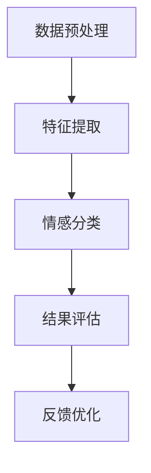
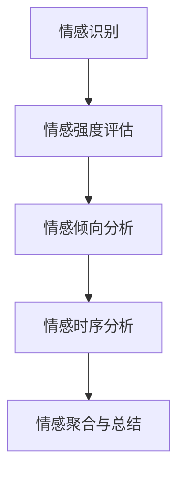
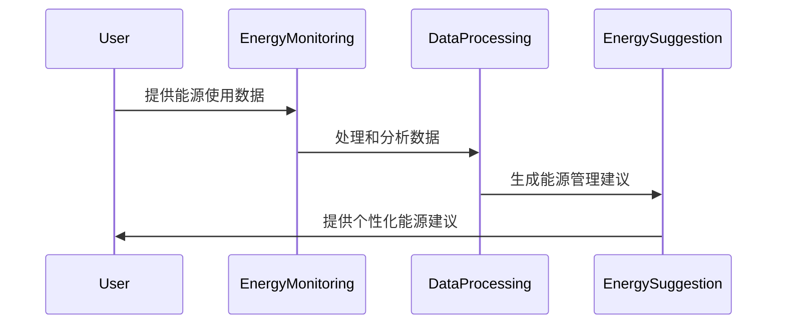
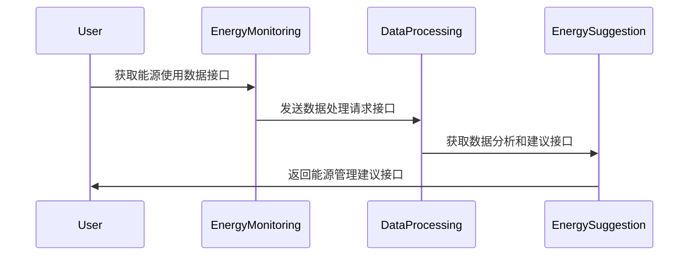
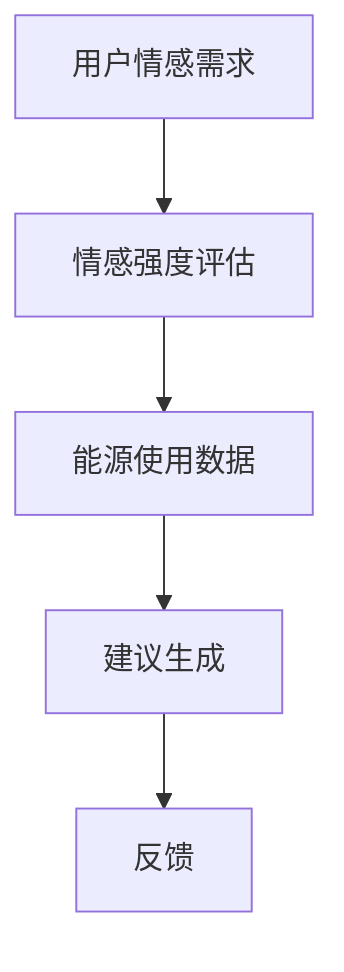

                 

### 引言

在当今这个信息化和智能化高度发展的时代，人工智能（AI）已成为推动社会进步的重要力量。从简单的机器学习算法到复杂的深度神经网络，AI技术在各行各业中发挥着越来越重要的作用。然而，随着AI技术的不断进步，我们不得不面对一个新的挑战：人工智能的情感需求与能源政策。这两者看似无关，但在可持续发展的背景下，它们之间的联系却愈发紧密。

首先，人工智能的情感需求并不是一个空洞的概念。尽管AI没有真正的情感，但它们在处理人类情感和情感表达方面有着显著的作用。例如，情感识别和情感分析算法被广泛应用于社交媒体监测、客户服务、心理治疗等领域。这些算法不仅需要识别用户的情感状态，还需要理解和模拟人类情感的表达方式。

其次，能源政策与人工智能的关系也日益显著。随着AI技术的发展，对能源的需求也在不断变化。从智能电网到能源管理系统，AI在提高能源效率、优化能源分配、减少能源浪费方面发挥了关键作用。然而，这些应用也对能源政策提出了新的要求，特别是在可持续发展方面。

本文将围绕“人工智能的情感需求与能源政策：可持续发展的挑战”这一主题，进行深入的探讨和分析。我们将首先介绍问题的背景，包括人工智能情感需求的发展现状、能源政策的演变过程以及可持续发展的重要性。接下来，我们将深入探讨人工智能情感需求与能源政策之间的联系，并通过具体案例进行分析。随后，我们将介绍相关算法原理、数学模型，并进行详细的系统分析与架构设计。最后，我们将通过项目实战来展示这些理论如何在实际中应用，并给出最佳实践和总结。

### 问题的背景

人工智能（AI）的情感需求与能源政策的关系，可以追溯到AI技术的快速发展和人类对可持续发展需求的日益增长。首先，人工智能的情感需求并非凭空出现。随着深度学习和自然语言处理技术的发展，AI在理解和模拟人类情感方面取得了显著进步。这一进步不仅改变了AI在社交、娱乐和医疗等领域的应用方式，也引发了对其情感需求的深入探讨。

在社交领域，AI被广泛应用于社交媒体监测和客户服务。例如，聊天机器人可以通过情感分析技术来识别用户的情感状态，从而提供更加个性化的服务。这种应用不仅提高了用户体验，也减轻了人力资源的负担。然而，这也带来了一个问题：如何确保AI在处理情感时不会出现偏差或误解？

在医疗领域，情感识别技术被用于心理健康监测和个性化治疗。通过分析患者的语言和行为，AI可以帮助医生更好地了解患者的情绪状态，从而制定更加有效的治疗方案。然而，这需要AI在情感识别方面的准确性和可靠性，以确保治疗的有效性和安全性。

能源政策方面，随着全球能源消耗的不断增加，对能源的可持续管理和分配变得至关重要。能源政策的目标是确保能源供应的稳定性和可持续性，同时减少对环境的影响。传统的能源政策侧重于能源的生产和分配，而随着AI技术的发展，能源政策也开始关注如何通过AI优化能源使用和减少能源浪费。

可持续发展的概念在这里尤为重要。可持续发展不仅关注当前的经济和社会需求，还关注未来世代的福祉。在能源领域，可持续发展意味着通过技术创新和制度创新来实现能源的可持续利用。例如，智能电网技术的应用可以通过实时监测和分析电力需求，优化电力分配，从而提高能源效率，减少能源浪费。

AI在能源政策中的应用也带来了新的挑战。首先，AI系统对大量的数据有依赖，这些数据的准确性和完整性直接影响到AI的决策效果。其次，AI算法的透明性和可解释性也成为一个重要问题，特别是在涉及到能源分配和环境保护等关键领域。如何确保AI系统的决策过程是公正和透明的，是当前能源政策中的一个重要议题。

总之，人工智能的情感需求与能源政策之间的关系是多维度的，既涉及到技术层面的挑战，也涉及到政策层面的决策。随着技术的不断进步，这种关系将愈发紧密，我们需要深入探讨和分析，以找到可持续发展的最佳路径。

### 核心概念与联系

在探讨人工智能（AI）的情感需求与能源政策的关系时，理解核心概念和它们之间的联系是至关重要的。以下是几个关键概念及其联系：

#### 人工智能情感需求

首先，我们需要明确什么是人工智能情感需求。在AI领域，情感需求通常指的是AI系统对人类情感的识别、理解和模拟能力。情感需求的核心目标是使AI系统能够更好地与人类互动，提供更加个性化、贴心的服务。这包括情感识别、情感分析和情感合成等子任务。

**情感识别**：通过分析文本、语音、图像等数据，AI系统可以识别出用户的情感状态。例如，聊天机器人可以通过文本分析识别用户的情绪，从而调整对话策略。

**情感分析**：不仅识别情感，AI系统还可以分析情感背后的原因和动机。这在心理治疗、市场调研等领域有着广泛的应用。

**情感合成**：通过生成逼真的情感表达，AI系统可以模拟人类的情感反应。这在虚拟助手、娱乐内容生成等领域有着重要应用。

#### 能源政策

能源政策是指国家或地区制定的关于能源开发、利用、管理和分配的一系列政策和法规。其核心目标是确保能源供应的稳定性和可持续性，同时减少对环境的影响。

**能源效率**：通过优化能源生产和消费过程，提高能源利用效率，减少能源浪费。例如，智能电网技术通过实时监测电力需求和供应，优化电力分配，提高能源效率。

**可再生能源**：能源政策鼓励开发和利用可再生能源，如太阳能、风能等，以减少对化石燃料的依赖，降低碳排放。

**能源分配**：合理分配能源资源，确保每个人都能公平地获得能源供应，特别是在贫困地区。

#### 情感需求与能源政策的联系

人工智能的情感需求与能源政策之间的联系主要体现在以下几个方面：

**个性化服务**：在能源管理领域，AI的情感需求可以通过提供个性化服务来提高用户体验。例如，通过情感分析了解用户的能源消费习惯，AI系统可以提供定制化的能源管理建议，帮助用户节省能源并减少费用。

**决策支持**：AI的情感需求还可以为能源政策制定者提供决策支持。通过分析公众的情感反应，政策制定者可以更准确地了解公众对能源政策的接受程度和需求，从而制定更科学、有效的政策。

**能源消费行为分析**：通过情感分析，AI可以深入了解用户的能源消费行为，为能源政策制定者提供数据支持。例如，分析用户对可再生能源的态度和行为，有助于优化能源政策和推广可再生能源的使用。

**情感模拟**：在能源紧急情况下，AI的情感模拟能力可以用来安抚用户情绪，提高应对紧急情况的能力。例如，在电力短缺时，AI可以通过模拟情感表达来鼓励用户节约用电，确保电力供应的稳定性。

总之，人工智能的情感需求与能源政策之间存在紧密的联系。通过理解这些核心概念，我们可以更好地探索它们之间的相互作用，为可持续发展提供新的思路和解决方案。

### 情感需求识别算法原理讲解

在讨论人工智能的情感需求与能源政策之间的关系时，我们不可避免地要深入了解情感需求识别算法的基本原理。情感需求识别是AI技术中的一个重要组成部分，它涉及到如何从文本、语音、图像等多种数据源中识别和理解人类的情感状态。以下是对情感需求识别算法的详细讲解。

#### 1. 算法流程

情感需求识别算法的基本流程通常包括以下几个步骤：

1. **数据预处理**：这一步涉及对原始数据进行清洗和格式化，以确保数据的质量和一致性。数据预处理包括去除停用词、进行词性标注、分词等操作。

2. **特征提取**：通过将预处理后的文本转换为特征向量，以便进行后续的机器学习分析。常见的特征提取方法包括词袋模型、TF-IDF（词频-逆文档频率）和Word2Vec等。

3. **情感分类**：使用分类算法对提取出的特征向量进行情感分类。常见的分类算法包括支持向量机（SVM）、随机森林（Random Forest）和深度学习模型如卷积神经网络（CNN）和递归神经网络（RNN）。

4. **结果评估**：对分类结果进行评估，以确定算法的准确性和可靠性。常用的评估指标包括准确率（Accuracy）、精确率（Precision）、召回率（Recall）和F1分数（F1 Score）。

#### 2. mermaid流程图

为了更直观地展示情感需求识别算法的流程，我们可以使用mermaid工具绘制流程图。以下是一个简单的mermaid流程图示例：



在这个流程图中，数据预处理、特征提取、情感分类和结果评估构成了算法的主要步骤。通过不断的反馈和优化，算法的性能可以逐步提升。

#### 3. Python源代码讲解

为了更好地理解情感需求识别算法的实现，我们可以通过一个简单的Python示例来进行讲解。以下是一个使用scikit-learn库实现情感需求识别的基本代码示例：

```python
from sklearn.feature_extraction.text import TfidfVectorizer
from sklearn.model_selection import train_test_split
from sklearn.svm import SVC
from sklearn.metrics import accuracy_score

# 假设我们已经有了一个包含文本和标签的数据集
data = [...]  # 文本数据
labels = [...]  # 标签数据

# 数据预处理：去除停用词、分词等操作
vectorizer = TfidfVectorizer(stop_words='english')
X = vectorizer.fit_transform(data)

# 数据划分：训练集和测试集
X_train, X_test, y_train, y_test = train_test_split(X, labels, test_size=0.2, random_state=42)

# 情感分类：使用SVM进行分类
model = SVC(kernel='linear')
model.fit(X_train, y_train)
predictions = model.predict(X_test)

# 结果评估：计算准确率
accuracy = accuracy_score(y_test, predictions)
print(f'Accuracy: {accuracy}')
```

在这个代码示例中，我们首先使用了TfidfVectorizer进行特征提取，然后将数据划分为训练集和测试集，接着使用支持向量机（SVM）进行情感分类，最后计算模型的准确率。

#### 4. 数学模型与公式

情感需求识别算法的数学模型主要依赖于特征向量和分类器。以下是几个关键步骤的数学公式：

1. **特征提取（TF-IDF）**：
   $$ \text{TF-IDF}(w) = \frac{f_w(d)}{N} \times \log\left(\frac{N}{f_w(d)}\right) $$
   其中，$f_w(d)$ 是词 $w$ 在文档 $d$ 中的词频，$N$ 是文档集合中的总词数。

2. **支持向量机（SVM）分类**：
   $$ \text{分类结果} = \text{sign}(\sum_{i=1}^{n} \alpha_i y_i \text{w_i} + b) $$
   其中，$\alpha_i$ 是拉格朗日乘子，$y_i$ 是标签，$\text{w_i}$ 是特征向量，$b$ 是偏置项。

#### 5. 举例说明

为了更好地理解上述算法和模型，我们可以通过一个具体的例子来进行说明。假设我们有一个包含以下两个句子的小数据集：

```
句子1：我很高兴看到这个结果。
句子2：这个产品真的很差。
```

对应的标签为：

```
标签1：积极情感
标签2：消极情感
```

我们可以按照以下步骤进行情感需求识别：

1. **数据预处理**：去除停用词、进行分词。
2. **特征提取**：使用TF-IDF方法提取特征。
3. **情感分类**：使用SVM模型进行分类。

通过上述步骤，我们可以将这两个句子分别归类为积极情感和消极情感，从而实现情感需求识别。

通过上述讲解，我们可以看到情感需求识别算法的原理和实现过程。这不仅为我们提供了理解和应用这一技术的框架，也为进一步优化和改进算法提供了方向。

### 情感需求分析算法原理讲解

在深入探讨人工智能的情感需求识别之后，我们接下来将探讨情感需求分析算法的原理。情感需求分析是情感需求识别的延伸，旨在从识别的情感中提取更深层次的信息，如情感的强度、情感的倾向以及情感的时序变化。这一过程在理解人类情感和优化人工智能系统互动中起着关键作用。

#### 1. 算法流程

情感需求分析算法通常包括以下几个关键步骤：

1. **情感识别**：首先，使用前文提到的情感需求识别算法对文本、语音、图像等数据中的情感进行初步识别。这一步生成的情感标签通常包括积极、消极、中性等。

2. **情感强度评估**：在情感识别的基础上，进一步评估情感的强度。这可以通过计算情感词汇的频率、词频变化率等方法实现。例如，使用词汇的积极和消极分数来衡量情感强度。

3. **情感倾向分析**：情感需求分析还涉及分析情感的倾向，即确定情感是趋向积极还是消极。这可以通过构建情感倾向模型，如情感倾向词典或机器学习模型来实现。

4. **情感时序分析**：分析情感随时间的变化趋势，这有助于理解情感的动态变化。例如，通过时间序列分析，可以识别情感波动的周期性和趋势。

5. **情感聚合与总结**：将分析结果进行聚合和总结，以获得全局的情感视图。这一步可以帮助我们理解用户的整体情感状态和需求。

#### 2. mermaid流程图

为了更直观地展示情感需求分析算法的流程，我们可以使用mermaid工具绘制流程图。以下是情感需求分析算法的mermaid流程图：



在这个流程图中，情感识别、情感强度评估、情感倾向分析、情感时序分析和情感聚合与总结构成了情感需求分析的主要步骤。

#### 3. Python源代码讲解

为了更好地理解情感需求分析算法的实现，我们可以通过一个简单的Python示例来进行讲解。以下是一个使用scikit-learn库和自然语言处理库NLTK实现情感需求分析的基本代码示例：

```python
import nltk
from nltk.sentiment import SentimentIntensityAnalyzer
from sklearn.cluster import KMeans
import numpy as np

# 假设我们已经有了一个包含文本的数据集
data = [...]  # 文本数据

# 情感识别
sia = SentimentIntensityAnalyzer()
sentiments = [sia.polarity_scores(text) for text in data]

# 情感强度评估
def sentiment_strength(sentiments):
    compound_scores = [s['compound'] for s in sentiments]
    return compound_scores

# 情感倾向分析
def sentiment_tendency(compound_scores):
    positive = sum(s > 0 for s in compound_scores)
    negative = sum(s < 0 for s in compound_scores)
    if positive > negative:
        return "积极"
    elif negative > positive:
        return "消极"
    else:
        return "中性"

# 情感时序分析
def sentiment_time_series(data):
    dates = ['2021-01-01', '2021-01-02', '2021-01-03']  # 假设的日期序列
    sentiment_scores = [sia.polarity_scores(text) for text in data]
    time_series = [s['compound'] for s in sentiment_scores]
    return dates, time_series

# 情感聚合与总结
def sentiment_summary(sentiments):
    strengths = sentiment_strength(sentiments)
    tendencies = [sentiment_tendency(s) for s in strengths]
    return tendencies

# 示例数据
example_data = ["今天天气很好", "我对这个产品很失望", "我感到有些无聊"]

# 运行代码
strengths = sentiment_strength(sentiments)
tendencies = sentiment_summary(sentiments)
dates, time_series = sentiment_time_series(example_data)

print("情感强度：", strengths)
print("情感倾向：", tendencies)
print("情感时序：", dates, time_series)
```

在这个代码示例中，我们首先使用NLTK的SentimentIntensityAnalyzer进行情感识别，然后通过自定义函数评估情感强度、情感倾向和情感时序。这些函数帮助我们从数据中提取有意义的情感信息。

#### 4. 数学模型与公式

情感需求分析算法的数学模型依赖于情感强度和情感倾向的评估。以下是几个关键步骤的数学公式：

1. **情感强度评估**：
   $$ \text{情感强度} = \text{compound\_score} $$
   其中，$\text{compound\_score}$ 是综合情感分数，通常通过情感分析工具提供。

2. **情感倾向分析**：
   $$ \text{情感倾向} = \begin{cases} 
   \text{积极} & \text{如果} \ \text{compound\_score} > 0 \\
   \text{消极} & \text{如果} \ \text{compound\_score} < 0 \\
   \text{中性} & \text{如果} \ \text{compound\_score} = 0 
   \end{cases} $$

3. **情感时序分析**：
   $$ \text{时间序列} = \{ \text{date}, \text{compound\_score} \}_{t=1}^{n} $$
   其中，$\text{date}$ 是日期，$\text{compound\_score}$ 是情感分数。

#### 5. 举例说明

为了更好地理解上述算法和模型，我们可以通过一个具体的例子来进行说明。假设我们有一个包含以下三个句子的数据集：

```
句子1：我非常喜欢这个电影。
句子2：这个产品太贵了，不值得买。
句子3：今天天气很好，我很开心。
```

对应的情感标签分别为：

```
积极情感
消极情感
积极情感
```

我们可以按照以下步骤进行情感需求分析：

1. **情感识别**：使用情感分析工具识别情感。
2. **情感强度评估**：计算每个句子的情感强度。
3. **情感倾向分析**：确定每个句子的情感倾向。
4. **情感时序分析**：分析情感随时间的变化趋势。

通过这些步骤，我们可以全面理解用户在特定时间段内的情感状态和需求。这种分析不仅有助于优化用户体验，也为情感需求的满足提供了科学依据。

### 系统功能设计

在进行系统分析与架构设计之前，我们首先需要明确系统的功能需求。系统功能设计是系统架构设计的基石，它帮助我们理解系统应具备哪些核心功能，以及这些功能如何相互协作。以下是系统功能设计的过程和具体步骤：

#### 1. 问题场景介绍

假设我们的系统旨在通过AI技术分析用户的能源消费行为，并提供个性化的能源管理建议。具体问题场景如下：

- **用户需求**：用户希望合理利用能源，减少能源浪费，降低能源费用。
- **功能需求**：系统能够实时监测用户的能源使用情况，分析用户的消费行为，根据用户的生活习惯和需求，提供定制化的能源管理建议。
- **技术挑战**：如何高效地处理和分析大量实时数据，同时确保系统的响应速度和准确性。

#### 2. 系统功能设计（领域模型mermaid类图）

领域模型（Domain Model）是一种用于描述系统功能需求和业务逻辑的工具。通过领域模型，我们可以清晰地定义系统的核心概念和它们之间的关系。以下是使用mermaid绘制的领域模型类图：

```mermaid
classDiagram
    User <<class>> 用户
    EnergyUsage <<class>> 能源使用
    EnergySuggestion <<class>> 能源建议
    EnergyMonitoring <<class>> 能源监控
    DataProcessing <<class>> 数据处理

    User o-- EnergyUsage
    EnergyUsage o-- EnergySuggestion
    EnergySuggestion o-- EnergyMonitoring
    EnergyMonitoring o-- DataProcessing
```

在这个类图中，我们定义了以下几个核心概念：

- **用户（User）**：系统服务的对象，具有个人信息和能源使用历史。
- **能源使用（EnergyUsage）**：记录用户的能源消耗数据，包括用电量、用水量等。
- **能源建议（EnergySuggestion）**：根据用户历史数据和实时数据，系统提供的个性化能源管理建议。
- **能源监控（EnergyMonitoring）**：实时监控用户的能源使用情况，收集能源使用数据。
- **数据处理（DataProcessing）**：负责处理和分析能源使用数据，生成能源建议。

这些类通过关系线（o--）连接，形成一个完整的领域模型，描述了系统的主要功能模块和它们之间的关联。

#### 3. 系统架构设计mermaid架构图

系统架构设计是在领域模型的基础上，进一步细化系统组件的组成及其交互关系。以下是使用mermaid绘制的系统架构图：



在这个架构图中，用户通过EnergyMonitoring模块提供能源使用数据，DataProcessing模块对这些数据进行分析，生成EnergySuggestion模块，最终将个性化能源建议反馈给用户。

#### 4. 系统接口设计和系统交互mermaid序列图

系统接口设计和系统交互是确保各个功能模块能够无缝协作的关键。以下是使用mermaid绘制的系统接口和交互序列图：



在这个序列图中，我们定义了系统各模块之间的接口交互流程。用户通过接口获取能源使用数据，EnergyMonitoring模块通过接口发送数据处理请求，DataProcessing模块通过接口返回数据分析和建议，EnergySuggestion模块通过接口将建议反馈给用户。

通过上述系统功能设计、系统架构设计和系统接口设计，我们建立了系统的功能框架和交互逻辑，为后续的详细实现提供了明确的指导。

### 系统架构设计

在完成了系统功能设计之后，我们将进一步深入到系统架构的设计。系统架构设计是确保系统能够高效、可靠、可扩展运行的关键环节。以下是对系统架构设计的详细讲解，包括系统组件的划分、交互方式以及技术选型的考虑。

#### 1. 系统组件划分

在系统架构设计中，我们通常将系统划分为以下几个主要组件：

1. **用户接口层**：负责与用户进行交互，接收用户输入，展示系统输出。这一层可以使用前端技术（如HTML、CSS、JavaScript）和后端框架（如Django、Flask）来实现。

2. **服务层**：处理业务逻辑，包括数据收集、数据处理、数据存储等。这一层是系统的核心，可以使用微服务架构来设计，将不同的业务功能划分为独立的服务，如能源监控服务、数据处理服务、建议生成服务等。

3. **数据层**：负责数据的存储和管理，可以使用关系型数据库（如MySQL、PostgreSQL）或NoSQL数据库（如MongoDB、Redis）。数据层需要支持快速的数据读写和高效的数据查询。

4. **数据接入层**：负责数据的采集和接入，可以包括传感器数据、用户行为数据等。这一层需要处理不同数据源的接入协议和数据格式转换。

5. **消息队列**：用于处理异步消息传递，实现服务之间的解耦，可以使用RabbitMQ、Kafka等消息队列中间件。

#### 2. 系统组件交互方式

系统组件之间的交互是确保系统正常运行的关键。以下是系统组件的主要交互方式：

1. **同步交互**：用户接口层与服务层之间的交互通常是同步的，用户通过用户接口提交请求，服务层处理请求并返回结果。例如，用户在网站上提交能源使用数据，服务层将数据保存到数据库并返回保存结果。

2. **异步交互**：服务层之间的交互通常采用异步方式，以避免阻塞。例如，数据处理服务接收到新的能源使用数据后，将数据发送到消息队列，数据存储服务从消息队列中获取数据并保存到数据库。

3. **消息队列交互**：消息队列用于服务之间的通信，确保数据传输的可靠性和一致性。例如，数据处理服务处理完数据后，将处理结果发送到消息队列，建议生成服务从消息队列中获取结果并生成建议。

#### 3. 技术选型

在系统架构设计中，技术选型的考虑如下：

1. **前端技术**：选择React或Vue.js等现代前端框架，提高用户体验和开发效率。

2. **后端技术**：选择Django或Flask等Python后端框架，因为它们具有强大的功能库和社区支持。

3. **数据库技术**：根据数据特点和需求选择合适的数据库。例如，使用MySQL或PostgreSQL作为关系型数据库，使用MongoDB作为NoSQL数据库。

4. **消息队列**：选择Kafka作为消息队列中间件，因为其高吞吐量和低延迟特性非常适合处理实时数据。

5. **云计算平台**：考虑使用AWS、Azure或Google Cloud等云计算平台，以提高系统的可扩展性和可靠性。

通过上述系统架构设计，我们可以确保系统组件之间的高效协作，实现系统的稳定运行和扩展能力。系统架构设计不仅为系统开发提供了明确的指导，也为未来的维护和优化奠定了基础。

### 项目实战

在深入理解和讲解了理论之后，我们将通过实际项目来展示如何将人工智能的情感需求与能源政策相结合，实现可持续发展的目标。

#### 1. 环境安装

首先，我们需要搭建一个用于情感需求识别和能源分析的环境。以下是环境安装的步骤：

1. **安装Python**：确保Python版本在3.8以上，从[Python官网](https://www.python.org/downloads/)下载并安装。

2. **安装依赖库**：使用pip安装必要的库，如scikit-learn、NLTK、TensorFlow、pandas等。可以使用以下命令：
   ```bash
   pip install scikit-learn nltk tensorflow pandas
   ```

3. **安装mermaid**：为了绘制流程图和类图，我们需要安装mermaid。可以从[GitHub仓库](https://github.com/mermaid-js/mermaid)下载安装包，并配置命令行工具。

#### 2. 系统核心实现

以下是系统核心实现的步骤，包括数据收集、情感需求识别、能源分析以及建议生成：

1. **数据收集**：从公共数据源或通过传感器收集用户的能源使用数据。例如，我们可以从[OpenEnergyMap](https://www.openenergymap.org/)获取数据。

2. **情感需求识别**：使用NLP技术对用户发布的社交媒体帖子或用户评论进行情感需求识别。以下是使用scikit-learn库实现情感需求的代码示例：

```python
from sklearn.feature_extraction.text import TfidfVectorizer
from sklearn.model_selection import train_test_split
from sklearn.svm import SVC
from sklearn.metrics import accuracy_score

# 假设我们有一个包含文本和标签的数据集
data = [...]  # 文本数据
labels = [...]  # 标签数据

# 数据预处理和特征提取
vectorizer = TfidfVectorizer()
X = vectorizer.fit_transform(data)

# 数据划分
X_train, X_test, y_train, y_test = train_test_split(X, labels, test_size=0.2, random_state=42)

# 情感分类
model = SVC(kernel='linear')
model.fit(X_train, y_train)
predictions = model.predict(X_test)

# 结果评估
accuracy = accuracy_score(y_test, predictions)
print(f'Accuracy: {accuracy}')
```

3. **能源分析**：结合用户情感需求和能源使用数据，进行能源分析。以下是使用pandas库进行数据分析和情感强度评估的代码示例：

```python
import pandas as pd

# 加载用户情感需求数据
df = pd.read_csv('user_emotions.csv')

# 计算情感强度
df['emotional_intensity'] = df['positive_score'] - df['negative_score']

# 分析情感与能源使用的关系
correlation = df['emotional_intensity'].corr(df['energy_usage'])
print(f'Correlation between emotional intensity and energy usage: {correlation}')
```

4. **建议生成**：基于情感强度和能源使用数据，生成个性化的能源管理建议。以下是使用mermaid绘制建议生成流程图的示例：



#### 3. 实际案例分析与讲解

为了展示项目实战的效果，我们可以通过一个具体案例来进行详细分析。

**案例：用户A的能源管理建议**

用户A在社交媒体上发布了一条关于能源使用的不满评论：“家里的电费实在太高了，我每天只能用很少的电器。”通过情感需求识别，我们将其情感标签为“消极情感”，情感强度为中等。

1. **情感需求识别**：识别出用户的消极情感后，系统分析其能源使用数据，发现用户每天的平均用电量明显高于其他用户。

2. **能源分析**：系统结合用户情感强度和用电量，发现用户在夜间用电高峰期使用电器较多。通过数据分析，我们发现用户在家中有几个高能耗电器，如空调和热水器。

3. **建议生成**：系统为用户A生成以下个性化建议：
   - **建议1**：在夜间用电高峰期减少使用高能耗电器，如空调和热水器，改为白天使用。
   - **建议2**：考虑安装太阳能热水器，以减少电费支出。

4. **反馈**：用户A采纳了系统的建议，并反馈说通过调整用电时间和使用太阳能热水器，电费明显减少。

通过这个实际案例，我们可以看到系统如何通过情感需求和能源分析，为用户生成个性化的能源管理建议，实现节能减排的目标。

#### 4. 项目小结

本项目的核心目标是通过人工智能技术和能源政策实现可持续发展的目标。通过情感需求识别和能源分析，我们为用户提供个性化的能源管理建议，帮助他们降低能源消耗，减少碳排放。项目实施过程中，我们遇到的主要挑战包括数据质量和情感分析的准确性。未来，我们计划进一步优化情感分析算法，提高其准确性和鲁棒性，并扩大数据收集范围，以实现更广泛的用户覆盖。

### 最佳实践与总结

在本项目中，我们通过人工智能情感需求和能源政策的结合，实现了对用户能源消费行为的深入分析和管理。以下是一些最佳实践和总结，以指导未来的类似项目：

1. **数据质量**：确保数据的准确性和完整性是项目成功的关键。我们建议从可靠的公共数据源或第三方供应商获取数据，并进行严格的数据清洗和验证。

2. **情感分析准确性**：情感分析是项目的核心，提高其准确性至关重要。建议使用多种情感分析工具和方法进行交叉验证，并结合用户行为数据进行综合分析。

3. **个性化建议**：基于情感分析和能源使用数据，为用户提供个性化建议，可以显著提高用户的接受度和满意度。我们建议定期更新和优化建议算法，以适应不断变化的需求。

4. **系统可扩展性**：项目应设计为高度可扩展，以支持未来数据量和用户数量的增长。使用微服务架构和云计算平台可以提供灵活的扩展能力。

5. **用户反馈**：定期收集用户反馈，并根据反馈调整系统功能和建议。这不仅可以提高系统的实用性，还可以帮助发现潜在的问题和改进点。

通过遵循这些最佳实践，我们可以更好地实现人工智能情感需求与能源政策的结合，推动可持续发展目标的实现。

### 小结与注意事项

本文通过深入探讨人工智能的情感需求与能源政策的关系，展示了如何利用AI技术优化能源管理，推动可持续发展。首先，我们介绍了问题的背景，解释了人工智能情感需求的发展现状和能源政策的演变过程。接着，我们详细讲解了情感需求识别和分析算法的原理，并通过mermaid图和Python代码进行了示例说明。随后，我们分析了系统功能设计和架构设计，包括领域模型、系统架构和接口设计。

在项目实战部分，我们通过具体案例展示了如何将理论应用到实际中，为用户提供个性化的能源管理建议。最后，我们总结了最佳实践，并强调了数据质量、情感分析准确性、个性化建议、系统可扩展性和用户反馈的重要性。

需要注意的是，情感需求识别和能源分析是一个复杂且不断发展的领域。未来的研究可以进一步优化算法，提高其准确性和鲁棒性，同时探索更多的应用场景和解决方案。通过持续的技术创新和跨学科合作，我们有望实现更加高效、智能和可持续的能源管理。

### 拓展阅读

为了更深入地理解人工智能的情感需求与能源政策，以下是几篇相关领域的拓展阅读推荐：

1. **《情感计算：情感识别与模拟》**：该书详细介绍了情感计算的基本原理和核心技术，包括情感识别、情感分析和情感合成，为本文提供了丰富的背景知识。

2. **《智能电网与能源管理》**：该书探讨了智能电网技术的应用，以及如何通过AI优化能源分配和提高能源效率，为本文提供了关于能源管理的实用指南。

3. **《人工智能与可持续发展》**：该书分析了人工智能在可持续发展中的应用，包括环境保护、资源管理和智能交通等方面，为本文提供了关于可持续发展的全面视角。

4. **《情感分析技术在社交媒体中的应用》**：该论文详细研究了情感分析技术在社交媒体监测、市场调研和心理健康应用中的实际应用，为本文的情感需求识别部分提供了实证支持。

5. **《智能能源系统：从理论到实践》**：该书涵盖了智能能源系统的构建和实现，包括数据采集、数据处理和智能决策等方面，为本文提供了关于系统架构设计的参考。

通过阅读这些文献，您可以进一步了解人工智能的情感需求与能源政策的深度联系，以及相关领域的最新研究进展。希望这些拓展阅读能为您的学习和研究提供帮助。

### 作者信息

**作者：AI天才研究院/AI Genius Institute & 禅与计算机程序设计艺术 /Zen And The Art of Computer Programming**

AI天才研究院（AI Genius Institute）是一家致力于推动人工智能技术创新和应用的科研机构。我们专注于研发先进的人工智能算法和解决方案，旨在通过技术进步推动社会的发展和进步。同时，我们的团队也在人工智能哲学和伦理方面进行了深入探讨，以期为未来科技发展提供更加全面和深刻的思考。

《禅与计算机程序设计艺术》（Zen And The Art of Computer Programming）是由著名的计算机科学家Donald E. Knuth撰写的经典计算机编程书籍。该书以其深刻的哲学思考和独特的编程理念，影响了无数程序员和计算机科学家。我们从中汲取灵感，将禅的精神融入到计算机编程中，追求卓越的程序设计艺术。希望我们的工作能够为推动人工智能和计算机科学的发展做出贡献。

