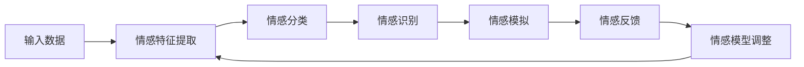
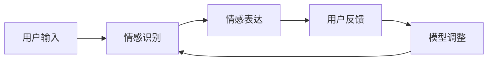
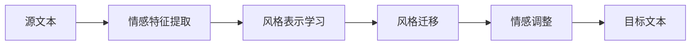

                 

### 人机情感融合与文学创作的融合背景

在信息时代，人工智能（AI）技术迅猛发展，尤其是在情感计算、自然语言处理（NLP）和人机交互（HCI）等领域，为文学创作带来了全新的可能性。人机情感融合，作为一种新兴技术，它旨在通过计算机理解和模拟人类情感，进而与人类进行更加自然、深刻的互动。这一技术的出现，不仅为文学创作提供了新的工具和手段，同时也带来了前所未有的挑战和机遇。

首先，让我们回顾一下人机情感融合的背景。情感计算是人工智能的一个分支，它研究如何使计算机理解和模拟人类的情感状态。从20世纪90年代以来，随着机器学习和深度学习技术的发展，情感计算逐渐从理论研究走向实际应用。例如，通过分析语音、文字和面部表情等数据，情感计算技术可以识别用户的情绪状态，从而为个性化服务、情感化广告、智能交互等提供支持。

与此同时，文学创作作为人类表达情感、思想和价值观念的重要方式，一直在寻求创新和突破。随着数字媒体的兴起，文学创作的方式和形式也发生了深刻变化。传统的手写笔记和纸质出版逐渐被电子文本和数字化出版所取代。然而，数字化的文学创作仍面临着创意枯竭、情感表达不够深刻等问题。

在这种背景下，人机情感融合与文学创作的融合成为一种必然趋势。人机情感融合技术可以为文学创作提供以下几个方面的支持：

1. **情感化文本生成**：通过情感计算技术，计算机可以生成具有特定情感色彩的文本，如诗歌、散文、小说等。这种文本不仅能够模仿人类的情感表达，还可以探索新的情感表达方式和风格。

2. **情感风格迁移**：基于深度学习技术，可以将一种文本的情感风格迁移到另一种文本中。例如，将一段悲伤的散文的情感风格迁移到一首诗中，创造出独特的艺术效果。

3. **人机共创**：通过人机交互技术，作家和计算机可以共同创作文学作品。计算机可以帮助作家完成一些繁琐的文本生成任务，从而解放作家的创造力，专注于情感和思想的表达。

4. **文学评价与推荐**：利用情感分析技术，可以对文学作品进行情感分析，从而提供更为精准的文学评价和推荐。

然而，这种融合也带来了一系列挑战，如如何确保计算机生成的文本符合人类道德和审美标准、如何平衡人机创作的关系等。因此，本文将深入探讨人机情感融合在文学创作中的潜在影响，分析其技术原理和应用案例，并提出未来发展的方向和挑战。

### 人机情感融合的定义

人机情感融合是一种跨学科的技术研究，旨在使计算机能够理解、模拟和表达人类情感，从而实现更加自然和深刻的交互体验。这一概念可以追溯到20世纪90年代，随着情感计算和人工智能技术的发展，人机情感融合逐渐成为一个独立的研究领域。

首先，**情感计算**是情感融合的基础。情感计算通过分析用户的语音、文字、面部表情和行为等数据，识别和理解用户的情感状态。例如，通过情感分析技术，计算机可以识别用户在文本或语音中的情感倾向，如愉悦、悲伤、愤怒等。情感计算的实现依赖于多种技术手段，包括自然语言处理、机器学习、深度学习和生物特征识别等。

其次，**自然语言处理（NLP）**在情感融合中扮演关键角色。NLP旨在使计算机能够理解和生成人类语言，从而实现人机交互。在情感融合中，NLP技术被用于分析文本情感、情感强度和情感倾向等。例如，通过情感分析，计算机可以识别一篇文本的整体情感色彩，并对其中的情感表达进行分类和量化。

此外，**人机交互（HCI）**技术也是情感融合的重要组成部分。人机交互技术涉及用户与计算机之间的互动方式，包括语音交互、手势交互、面部表情识别等。在人机情感融合中，这些技术被用于实现情感化的交互体验。例如，通过语音合成和语音识别技术，计算机可以模拟人类的语音情感，如柔和的语气或激动的语调，从而与用户产生情感共鸣。

**情感融合的工作原理**可以概括为以下几个步骤：

1. **情感识别**：通过情感计算技术，计算机首先识别用户的情感状态。这一过程通常涉及情感特征提取和情感分类。例如，计算机可以通过分析用户的语音频率变化、文字情感倾向和面部表情等数据，识别用户的情感状态。

2. **情感模拟**：在识别用户的情感状态后，计算机通过情感模拟技术，生成相应的情感反应。例如，计算机可以通过语音合成技术，模拟出柔和或激动的语音表达，从而与用户产生情感共鸣。

3. **情感反馈**：计算机通过情感反馈机制，向用户展示其情感反应。例如，通过屏幕显示情感图标、语音回应或文字表达，计算机可以告诉用户它理解了其情感状态，并作出相应的反应。

4. **情感互动**：在情感互动过程中，用户和计算机之间通过情感交换，建立更加自然和深刻的交互关系。例如，通过不断调整和优化情感模型，计算机可以更好地理解用户的情感需求，从而提供更加个性化的服务。

在**文学创作中的应用**方面，人机情感融合技术展示了巨大的潜力。首先，通过情感化文本生成，计算机可以生成具有特定情感色彩的文学作品，如悲伤、喜悦、愤怒等。其次，情感风格迁移技术可以使不同文本之间实现情感风格的相互转换，从而创造独特的艺术效果。此外，人机共创模式也使得作家和计算机可以共同创作文学作品，提高创作效率和创造力。

总之，人机情感融合通过情感计算、自然语言处理和人机交互技术的结合，实现了计算机对人类情感的深刻理解和表达，为文学创作带来了新的可能性。随着技术的不断进步，人机情感融合在文学创作中的应用将越来越广泛，有望推动文学创作进入一个新的时代。

### 文学创作的定义及其在现代社会中的角色和意义

文学创作，作为一种表达思想和情感的文字艺术形式，拥有着悠久的历史和丰富的文化内涵。根据不同的标准，文学创作可以划分为多种类型，如诗歌、小说、散文、戏剧和散文诗等。每种类型都有其独特的艺术表现手法和审美特点，但共同的核心是借助文字来传达作者的情感、思想和价值观。

**文学创作的定义**可以概括为：通过语言的艺术加工，创作者以文字为媒介，表达个人或社会的情感、观念和经验，从而形成具有审美价值和文化意义的文学作品。文学创作不仅仅是文字的组合，更是一种心灵的投射和情感的共鸣。

在现代社会中，文学创作扮演着多重角色和意义：

1. **情感表达**：文学创作是情感表达的重要途径。通过文学作品的创作，作者可以自由地抒发个人的喜怒哀乐，读者也可以在阅读中感受到这些情感，从而实现情感的共鸣。

2. **社会反思**：文学作品常常反映社会的现实问题，如人性的复杂、社会的变迁、道德的冲突等。通过文学创作，作者可以对现实社会进行深刻的反思和批判，引导读者对社会现象进行思考和探讨。

3. **文化传承**：文学创作是文化传承的重要载体。文学作品不仅记录了历史和经验，还传承了人类的文化精髓和价值观念。通过阅读和传播文学作品，文化得以传递和延续。

4. **心灵疗愈**：文学作品具有治愈心灵的力量。通过阅读，人们可以在作品中找到慰藉和启示，从而缓解生活中的压力和困惑，提升精神层面的满足感。

然而，文学创作也面临着一系列挑战。随着数字化时代的到来，文学创作的方式和形式发生了巨大变化。电子文本和数字化出版逐渐取代了传统的手写笔记和纸质出版，这为文学创作带来了便利，但也引发了一些问题：

1. **创意枯竭**：数字化的创作环境可能导致创作者的创意枯竭。过于依赖技术工具，可能使创作变得机械化，缺乏深刻的情感和独特的思想。

2. **情感表达不足**：数字化的文学作品可能缺乏传统文学中的情感深度和细腻表达。虽然计算机可以生成情感化文本，但依然难以完全模拟人类的情感体验。

3. **审美标准变化**：数字化时代的审美标准与传统文学有所不同。网络文学和社交媒体上的文字表达更加随意和碎片化，这可能影响文学创作的审美取向。

4. **道德和伦理问题**：文学创作中涉及到的道德和伦理问题日益复杂。如何在数字时代保持文学创作的道德底线，是一个亟待解决的问题。

面对这些挑战，人机情感融合技术的出现为文学创作提供了新的可能性。通过情感计算、自然语言处理和人机交互技术的结合，计算机可以帮助作家更好地理解和表达情感，从而克服创作中的难题，提高文学创作的质量和水平。同时，人机情感融合也可以拓展文学创作的边界，探索新的艺术形式和表达方式。

总之，文学创作在现代社会中具有不可替代的重要作用，它不仅是情感表达和社会反思的工具，也是文化传承和心灵疗愈的载体。面对数字化时代的挑战，人机情感融合为文学创作带来了新的机遇，有望推动文学创作进入一个新的繁荣时期。

### 人机情感融合对文学创作的潜在影响

人机情感融合技术的兴起，为文学创作带来了诸多潜在影响，这些影响涵盖了创作方式、创作内容以及艺术价值等多个方面。以下是具体影响的详细分析。

首先，**创作方式**方面，人机情感融合技术极大地改变了文学创作的传统模式。借助情感计算和自然语言处理技术，计算机可以自动生成具有特定情感色彩的文本。例如，通过情感分析，计算机可以识别出用户提供的情感标签，进而生成情感化的诗歌或散文。这种自动生成的文本不仅为作家提供了新的创作素材，还解放了作家的创作力，使其能够专注于情感和思想的表达，而无需过多地耗费精力在文字的组合上。

此外，**人机共创**模式也逐渐成为文学创作的新趋势。在这一模式中，作家和计算机共同参与创作，计算机负责处理复杂的文本生成任务，而作家则负责提供创意和情感表达。这种合作方式不仅提高了创作效率，还使得文学作品更具创意和多样性。例如，通过人机交互技术，计算机可以实时分析作家的情感状态，并生成相应的情感化文本，从而与作家形成更加自然的互动。

在**创作内容**方面，人机情感融合技术为文学创作带来了新的可能性。传统的文学创作常常受限于作家的个人经验和情感，而人机情感融合技术则可以拓展这一边界。计算机可以模拟出各种复杂的情感状态，如悲伤、喜悦、愤怒等，从而创造出更加丰富和深刻的文学作品。例如，计算机可以通过情感风格迁移技术，将一种情感风格迁移到另一种文本中，创造出独特的艺术效果。这种创新不仅丰富了文学创作的主题和内容，还使得文学作品更具艺术性和观赏性。

具体来说，**情感风格迁移**技术可以使不同类型的文学作品之间实现情感风格的相互转换。例如，将一段悲伤的散文的情感风格迁移到一首诗中，或将一篇喜剧小说的情感风格转换成一首歌曲。这种转换不仅能够创造出新的艺术形式，还可以丰富文学作品的表达手段，提升其艺术价值。

此外，人机情感融合技术还带来了**情感化文本生成**的可能性。通过情感计算技术，计算机可以生成具有特定情感色彩的文本，如诗歌、散文、小说等。这种生成方式不仅能够模仿人类的情感表达，还可以探索新的情感表达方式和风格。例如，计算机可以通过分析用户的情感状态，生成一篇表达悲伤情感的诗歌，或通过情感风格迁移技术，将一段快乐的故事情感风格迁移到一首歌中。

在**艺术价值**方面，人机情感融合技术也对文学创作产生了深远的影响。传统的文学作品常常通过文字的精细处理和情感的深度挖掘，来传达作者的思想和情感。而人机情感融合技术则通过计算机模拟情感，使得文学作品在情感表达上更加直接和强烈。这种直接的情感表达不仅能够增强读者的共鸣，还可以提升文学作品的艺术价值。

例如，通过情感风格迁移技术，可以将一段悲伤的散文的情感风格迁移到一首诗中，创造出一种独特的情感共鸣。读者在阅读这样的文学作品时，不仅能够感受到作者的情感，还能够体验到计算机模拟的情感，从而形成更加深刻的情感共鸣。这种共鸣不仅增强了文学作品的感染力，还提升了其艺术价值。

总之，人机情感融合技术对文学创作产生了深远的影响。在创作方式、创作内容和艺术价值等多个方面，人机情感融合技术都为文学创作带来了新的可能性。通过情感计算、自然语言处理和人机交互技术的结合，计算机不仅能够帮助作家更好地理解和表达情感，还能够拓展文学创作的边界，探索新的艺术形式和表达方式。随着技术的不断进步，人机情感融合在文学创作中的应用将越来越广泛，有望推动文学创作进入一个新的繁荣时期。

### 人机情感融合与文学创作的边界

探讨人机情感融合与文学创作的边界，我们需要明确这两者的定义和范围，并分析它们在技术、艺术和社会层面的交汇与分离。

首先，**人机情感融合**指的是通过情感计算、自然语言处理和人机交互技术，使计算机能够理解、模拟和表达人类情感，从而实现更自然和深刻的交互体验。它主要涉及情感识别、情感模拟、情感反馈和情感互动等过程，旨在提升人机交互的质量和体验。

而**文学创作**则是指通过语言艺术，表达情感、思想和价值观，创作出具有审美价值的文学作品。它包括诗歌、小说、散文等多种形式，注重创意、情感表达和审美体验。

从**技术层面**来看，人机情感融合与文学创作的边界相对清晰。情感计算和自然语言处理等技术为人机情感融合提供了技术支持，这些技术可以应用于文学创作中的情感分析和文本生成。例如，情感计算技术可以用于分析读者的情感状态，自然语言处理技术可以用于生成情感化文本。这些技术工具虽然可以为文学创作提供便利，但它们本身并不等同于文学创作，它们只是创作过程中的辅助手段。

从**艺术层面**来看，人机情感融合与文学创作的边界则更加模糊。文学创作强调的是情感表达和审美体验，而人机情感融合技术可以通过模拟情感和生成文本，在一定程度上实现这些目标。例如，计算机生成的情感化文本可能具有独特的艺术价值，但这并不意味着它们完全取代了人类作家的创作。艺术创作是一个高度个性化的过程，它依赖于作家的情感、思想和经验，这是计算机难以完全模拟的。

从**社会层面**来看，人机情感融合与文学创作的边界也表现出复杂性。一方面，人机情感融合技术可以丰富文学创作的方式和内容，为读者提供更多样化的作品。另一方面，它也引发了一系列社会和文化问题，如计算机生成的文学作品是否具有合法性、道德和伦理问题等。这些问题的存在，使得人机情感融合与文学创作的边界在现实中更加难以界定。

总之，人机情感融合与文学创作的边界在技术、艺术和社会层面都存在一定的交错和分离。技术层面上，人机情感融合提供的是工具和支持，而艺术和社会层面上，它们则在创作过程和作品评价中相互影响。明确这两者的边界，有助于我们更好地理解人机情感融合在文学创作中的应用潜力和挑战。

### 人机情感融合的技术构成与文学创作的交叉要素

在人机情感融合与文学创作中，技术构成和交叉要素起着至关重要的作用。这些技术不仅提升了文学创作的效率和质量，还为读者提供了更加丰富的情感体验。以下是具体的技术构成和交叉要素的详细分析。

首先，**情感计算**是人机情感融合的核心技术。情感计算通过分析用户的语音、文字、面部表情和行为等数据，识别和理解用户的情感状态。例如，通过情感分析技术，计算机可以识别出用户在文本或语音中的情感倾向，如愉悦、悲伤、愤怒等。这一技术在文学创作中的应用主要体现在情感化文本生成和情感风格迁移方面。

在**文学创作**中，情感计算可以帮助作家更好地理解读者的情感反应。例如，通过分析读者的情感倾向，作家可以调整文本的情感色彩，使其更加符合读者的期望。此外，情感计算还可以用于创作情感化的文学作品。例如，通过情感分析，计算机可以生成具有特定情感色彩的诗歌或散文，这些作品不仅能够模仿人类的情感表达，还可以探索新的情感表达方式和风格。

其次，**自然语言处理（NLP）**在情感融合与文学创作中的应用也非常广泛。NLP旨在使计算机能够理解和生成人类语言，从而实现人机交互。在情感融合中，NLP技术被用于分析文本情感、情感强度和情感倾向等。例如，通过情感分析，计算机可以识别一篇文本的整体情感色彩，并对其中的情感表达进行分类和量化。

在文学创作中，NLP技术可以帮助作家更高效地处理大量的文本数据。例如，通过自然语言处理，计算机可以自动生成文本摘要、提取关键词和进行情感分析。这些功能不仅提高了作家的创作效率，还可以为作家提供更多的创作灵感和思路。此外，NLP技术还可以用于情感化文本生成和情感风格迁移。例如，通过情感风格迁移技术，计算机可以将一种情感风格迁移到另一种文本中，创造出独特的艺术效果。

**人机交互（HCI）**技术也是人机情感融合的重要组成部分。人机交互技术涉及用户与计算机之间的互动方式，包括语音交互、手势交互、面部表情识别等。在人机情感融合中，这些技术被用于实现情感化的交互体验。例如，通过语音合成和语音识别技术，计算机可以模拟人类的语音情感，如柔和的语气或激动的语调，从而与用户产生情感共鸣。

在文学创作中，人机交互技术可以提供更加直观和互动的创作体验。例如，通过语音交互技术，作家可以直接通过语音命令来生成文本，从而提高创作效率。此外，人机交互技术还可以用于创作互动式文学作品。例如，通过手势交互和面部表情识别技术，读者可以与文学作品进行互动，从而获得更加个性化的阅读体验。

**交叉要素**方面，人机情感融合技术为文学创作提供了新的工具和手段。首先，情感计算和自然语言处理技术可以帮助作家更好地理解读者的情感反应，从而创作出更加贴近读者需求的文学作品。其次，人机交互技术可以提供更加直观和互动的创作体验，使得文学创作过程更加高效和有趣。此外，情感风格迁移技术可以拓展文学创作的边界，使作品具有更多的艺术表现力。

总之，人机情感融合的技术构成和交叉要素为文学创作带来了新的可能性。通过情感计算、自然语言处理和人机交互技术的结合，计算机不仅能够帮助作家更好地理解和表达情感，还可以拓展文学创作的边界，探索新的艺术形式和表达方式。随着技术的不断进步，人机情感融合在文学创作中的应用将越来越广泛，有望推动文学创作进入一个新的繁荣时期。

### 情感计算技术原理

情感计算作为人机情感融合的核心技术，其原理和方法主要包括情感识别、情感分类和情感模拟等方面。以下是这些技术原理的详细探讨。

首先，**情感识别**是情感计算的基础。情感识别的目标是通过分析用户的语音、文字、面部表情和行为等数据，识别出用户的情感状态。情感识别通常包括以下几个步骤：

1. **情感特征提取**：首先，从原始数据中提取情感特征。对于语音数据，可以提取声学特征，如音高、音强和音速等。对于文字数据，可以提取语义特征，如词语的情感倾向、情感强度和情感类别等。对于面部表情数据，可以提取面部特征点、肌肉运动和表情姿态等。

2. **情感分类**：接下来，通过机器学习算法，如支持向量机（SVM）、神经网络（NN）和决策树等，将提取的情感特征分类为不同的情感类别。常见的情感类别包括愉悦、悲伤、愤怒、恐惧和惊讶等。

3. **情感预测**：最后，根据分类结果，预测用户的当前情感状态。情感识别的准确度取决于特征提取和分类算法的性能。

在**情感分类**方面，常见的算法包括基于规则的方法、机器学习方法以及深度学习方法。基于规则的方法通过预定义的规则来分类情感，例如，根据音调变化来识别情感。机器学习方法利用大量标注数据训练模型，如支持向量机（SVM）和决策树等。深度学习方法，如卷积神经网络（CNN）和循环神经网络（RNN），通过多层神经网络结构，自动提取特征并实现情感分类。深度学习方法在情感分类中表现出色，特别是在处理复杂情感和非线性关系时。

**情感模拟**是情感计算的另一个重要方面。情感模拟的目标是通过计算机生成情感化的响应，与用户进行自然、深刻的互动。情感模拟通常包括以下步骤：

1. **情感模型训练**：首先，通过大量的情感数据，训练情感模型。情感模型可以是情感识别模型，也可以是情感生成模型。情感识别模型用于识别用户的情感状态，而情感生成模型用于生成相应的情感化响应。

2. **情感响应生成**：基于训练好的情感模型，计算机生成情感化的响应。例如，通过语音合成技术，模拟出柔和或激动的语音表达；通过自然语言生成技术，生成具有特定情感色彩的文本。

3. **情感反馈调整**：根据用户的反馈，不断调整情感模型，提高其生成情感响应的准确性和自然度。例如，通过用户评价和反馈，调整语音合成参数或文本生成策略，使其更符合用户的情感需求。

在情感计算中，**算法流程图**是一个重要的工具。以下是一个简化的情感计算算法流程图：



在具体实现中，情感计算通常结合多种技术手段，如自然语言处理（NLP）、语音识别与合成（ASR/TTS）、计算机视觉（CV）等。例如，在分析一段文本时，情感计算可以首先利用NLP技术提取情感相关的词语和短语，然后利用情感分类模型对这些特征进行分类，最后生成情感化文本或语音响应。

**情感计算的挑战与机遇**：

1. **挑战**：情感计算面临的主要挑战包括情感特征提取的准确性、情感分类的复杂性和情感模拟的自然度等。情感特征提取需要处理多种数据类型，情感分类需要处理复杂的情感关系，情感模拟需要生成自然、贴切的情感响应。

2. **机遇**：随着人工智能技术的不断发展，情感计算在多个领域表现出巨大的应用潜力，如智能客服、情感化广告、智能交互和文学创作等。情感计算技术可以提升人机交互的质量和体验，为文学创作提供新的工具和手段。

总之，情感计算技术通过情感识别、情感分类和情感模拟，实现了计算机对人类情感的深刻理解和表达。其在文学创作中的应用，不仅拓展了文学创作的边界，也为读者提供了更加丰富和深刻的情感体验。

### 自然语言处理（NLP）技术原理

自然语言处理（NLP）是人工智能和计算机科学领域的重要分支，旨在使计算机能够理解、生成和处理人类自然语言。在情感融合与文学创作中，NLP技术扮演了关键角色，通过情感分析、情感识别、文本生成等技术手段，提升了文学创作的质量和读者体验。以下是NLP技术原理的详细解析。

首先，**情感分析**是NLP技术中的一个重要应用领域。情感分析的目标是识别文本中的情感倾向，判断文本是积极的、消极的还是中性的。情感分析通常包括以下几个步骤：

1. **文本预处理**：在情感分析之前，需要对文本进行预处理，包括去除停用词、进行词干提取和分词等操作。这些操作有助于简化文本结构，提高分析效率。

2. **情感词典构建**：情感词典是一个包含情感词汇及其情感倾向的数据库。这些词汇可以是积极词汇（如“喜欢”、“高兴”）、消极词汇（如“讨厌”、“伤心”）或中性词汇（如“可能”、“也许”）。情感词典的构建是情感分析的基础。

3. **情感分类模型训练**：利用机器学习算法，如朴素贝叶斯、支持向量机和神经网络等，训练情感分类模型。训练数据集通常包含大量的标注文本，用于模型训练。

4. **情感识别与分类**：在情感识别阶段，将文本输入到训练好的情感分类模型中，模型输出文本的情感倾向。常见的情感分类方法包括二分类（积极/消极）和多分类（积极/中性/消极）。

在文学创作中，情感分析可以帮助作家理解读者对作品的情感反应，从而调整文本的情感色彩，提高作品的艺术价值和吸引力。例如，通过分析读者评论的情感倾向，作家可以判断作品是否达到了预期的情感效果，并据此进行修改。

**情感识别**是NLP技术的核心任务之一，它旨在识别文本中的情感表达。情感识别通常涉及以下步骤：

1. **情感标签提取**：首先，从文本中提取情感相关的词汇和短语，这些词汇通常被称为情感标签。例如，从文本中提取出“快乐”、“悲伤”等情感标签。

2. **情感强度计算**：情感标签提取后，需要计算每个情感标签的情感强度。情感强度通常用数值表示，例如，将“快乐”的情感强度设为3，将“悲伤”的情感强度设为-3。

3. **情感识别算法**：利用机器学习算法，如决策树、支持向量机和神经网络等，将情感标签和情感强度输入到算法中，识别文本的情感类型和情感强度。

情感识别在文学创作中的应用非常广泛，例如，通过情感识别技术，计算机可以生成具有特定情感色彩的文本，如悲伤的诗歌或欢快的散文。此外，情感识别还可以用于分析文学作品的整体情感倾向，帮助读者更好地理解作品的情感内涵。

**文本生成**是NLP技术的另一个重要应用领域，它旨在根据输入的指令或主题，生成符合逻辑和语义的文本。文本生成技术包括以下几个步骤：

1. **语言模型训练**：首先，利用大量的文本数据，训练语言模型。语言模型可以预测下一个单词或短语的概率，从而生成连续的文本。

2. **模板匹配**：通过模板匹配，将输入的指令或主题与预定义的模板进行匹配，生成基础文本。模板通常包含关键信息和结构化的文本片段。

3. **文本填充**：在模板匹配的基础上，将语言模型生成的文本片段填充到模板中的空缺部分，生成完整的文本。

4. **文本优化**：最后，对生成的文本进行优化，包括语法检查、语义校对和风格调整等，以提高文本的质量和可读性。

在文学创作中，文本生成技术可以帮助作家快速生成初步的文本，提供创作灵感。例如，通过输入一个主题或情感标签，计算机可以生成相关的诗句或段落，作家在此基础上进行扩展和修改。此外，文本生成技术还可以用于生成故事情节、对话和角色描述等，为文学创作提供多样化支持。

**算法流程图**和**Python代码实现**是理解NLP技术原理的重要工具。以下是情感分析算法的简化的mermaid流程图：


以下是一个简单的Python代码示例，用于实现情感分析：

```python
import nltk
from nltk.sentiment import SentimentIntensityAnalyzer

# 初始化情感分析器
sia = SentimentIntensityAnalyzer()

# 输入文本
text = "我喜欢这本书，因为它非常有趣。"

# 计算情感得分
scores = sia.polarity_scores(text)

# 输出情感得分
print(scores)
```

通过这个示例，我们可以看到如何使用NLP技术对文本进行情感分析和情感识别。

总之，自然语言处理技术通过情感分析、情感识别和文本生成等手段，为人机情感融合和文学创作提供了强大的支持。随着NLP技术的不断发展，其在文学创作中的应用将越来越广泛，有望推动文学创作进入一个新的繁荣时期。

### 人机交互技术

人机交互（Human-Computer Interaction，简称HCI）技术在人机情感融合中发挥着至关重要的作用。它通过设计用户界面和交互方式，使计算机能够更好地理解和响应人类用户的需求和情感，从而提升用户的使用体验和满意度。

首先，**人机交互的定义**涵盖了用户与计算机系统之间进行信息交换的所有交互过程。这些过程包括但不限于：文本输入、语音交互、手势交互、面部表情识别等。人机交互的目标是创建直观、自然、高效和愉悦的交互体验。

**人机交互的分类**主要包括以下几种：

1. **语音交互**：通过语音识别（Automatic Speech Recognition，ASR）和语音合成（Text-to-Speech，TTS）技术，实现人与计算机之间的语音交流。语音交互在智能音箱、智能助手和车载系统中得到了广泛应用。

2. **手势交互**：通过计算机视觉技术，识别和解释用户的手势动作。手势交互广泛应用于虚拟现实（VR）和增强现实（AR）场景中，如微软的Kinect传感器和谷歌的ARCore技术。

3. **面部表情识别**：通过分析用户的面部表情，识别用户的情感状态。面部表情识别技术广泛应用于情感分析、人机情感融合和互动式游戏等领域。

在**文学创作**中的应用方面，人机交互技术展示了独特的潜力。首先，**语音交互**可以帮助作家更高效地进行文本创作。例如，通过语音识别技术，作家可以直接通过语音输入生成文本，而不需要手动敲击键盘。这不仅提高了创作速度，还减少了手动操作的疲劳感。

**手势交互**在文学创作中的应用更加灵活和直观。作家可以通过手势来控制文本生成、调整文本结构或添加情感标签。例如，通过在虚拟现实环境中使用手势，作家可以实时地修改文本的情感色彩和风格，从而创作出更加独特的作品。

**面部表情识别**技术则可以帮助作家更好地理解读者的情感反应。通过分析读者的面部表情，作家可以实时调整文本的情感表达，以更好地满足读者的需求。例如，在互动式文学创作中，作家可以根据读者的情感状态，生成不同情感色彩的文本段落，从而提高读者的阅读体验。

**人机交互技术在文学创作中的应用案例**包括：

1. **人机共创**：通过人机交互技术，作家和计算机共同创作文学作品。计算机负责处理文本生成和情感分析，而作家则负责提供创意和情感表达。这种合作方式不仅提高了创作效率，还使得文学作品更具创意和多样性。

2. **情感化文本生成**：利用情感计算和自然语言处理技术，计算机可以生成具有特定情感色彩的文本。通过人机交互技术，作家可以实时调整文本的情感表达，从而创作出情感丰富、风格独特的作品。

3. **互动式文学体验**：通过虚拟现实和增强现实技术，读者可以与文学作品进行互动，体验更加丰富的情感和故事情节。这种互动式体验不仅增加了读者的参与感，还可以提高文学作品的感染力和艺术价值。

总之，人机交互技术在文学创作中的应用，为人机情感融合提供了新的可能性。通过语音交互、手势交互和面部表情识别等技术，计算机可以更好地理解和响应人类用户的需求和情感，从而推动文学创作进入一个新的阶段。随着技术的不断进步，人机交互在文学创作中的应用将越来越广泛，有望带来更多的创新和突破。

### 人机情感融合算法原理

人机情感融合算法的核心在于将情感计算、自然语言处理（NLP）和人机交互技术相结合，以实现计算机对人类情感的深刻理解和自然表达。以下是人机情感融合算法的基本原理、流程图和Python代码实现。

**算法原理**

人机情感融合算法主要包括以下步骤：

1. **情感识别**：通过情感计算技术，识别用户输入的文本、语音或面部表情中的情感状态。这一过程通常涉及情感特征提取、情感分类和情感强度计算。

2. **情感表达**：基于情感识别结果，计算机生成相应的情感化响应，如情感化文本、语音或视觉反馈。这一过程依赖于自然语言生成（NLG）和语音合成（TTS）技术。

3. **用户反馈**：收集用户对情感化响应的反馈，以调整和优化情感模型，提高生成结果的准确性和自然度。

4. **动态调整**：根据用户反馈，实时调整情感模型和交互策略，以提供更加个性化、自然和深刻的交互体验。

**流程图**

以下是人机情感融合算法的简化流程图：



**Python代码实现**

以下是一个简单的Python代码示例，用于实现情感识别和情感表达：

```python
import nltk
from nltk.sentiment import SentimentIntensityAnalyzer
from nltk.tokenize import word_tokenize

# 初始化情感分析器
sia = SentimentIntensityAnalyzer()

# 输入文本
text = "我今天很快乐，因为我完成了一个项目。"

# 计算情感得分
scores = sia.polarity_scores(text)

# 情感识别
emotion = 'happy' if scores['compound'] > 0 else 'sad'

# 情感表达
if emotion == 'happy':
    response = "我很高兴听到这个消息，恭喜你！"
else:
    response = "听起来你有些不开心，需要聊聊吗？"

# 输出情感化响应
print(response)
```

在这个示例中，我们首先使用NLT库中的SentimentIntensityAnalyzer进行情感识别，然后根据情感状态生成相应的情感化响应。

**数学模型与公式**

情感融合算法中的核心数学模型通常涉及情感分类和情感强度计算。以下是两个常见的模型：

1. **情感分类模型**：使用朴素贝叶斯、支持向量机（SVM）或深度神经网络（DNN）等算法，将文本分类为不同的情感类别（如积极、消极、中性）。

$$
P(\text{Emotion} = c | \text{Text}) = \frac{P(\text{Text} | \text{Emotion} = c)P(\text{Emotion} = c)}{P(\text{Text})}
$$

其中，$P(\text{Emotion} = c | \text{Text})$表示在给定文本下情感类别为$c$的概率，$P(\text{Text} | \text{Emotion} = c)$表示在情感类别为$c$下的文本概率，$P(\text{Emotion} = c)$表示情感类别为$c$的概率。

2. **情感强度模型**：使用情感词典和词袋模型计算文本的情感强度，通常使用复合情感得分（compound score）来表示。

$$
\text{Compound Score} = \sum_{i=1}^{n} w_i \cdot s_i
$$

其中，$w_i$表示词汇$i$的权重，$s_i$表示词汇$i$的情感强度。

**算法举例说明**

假设我们有以下文本：

"我今天很快乐，因为我完成了一个项目。"

1. **情感识别**：通过情感分类模型，我们可以识别出这段文本的情感类别为“快乐”。
2. **情感强度计算**：通过情感强度模型，我们可以计算出这段文本的复合情感得分为0.8，表示情感强度较高。

基于这些情感信息，计算机可以生成相应的情感化响应，如：

"我很高兴听到这个消息，恭喜你完成项目！"

通过上述算法原理、流程图和Python代码示例，我们可以看到人机情感融合算法是如何通过情感识别、情感表达和用户反馈等步骤，实现计算机对人类情感的深刻理解和自然表达。随着技术的不断进步，人机情感融合算法将在文学创作和其他领域中发挥越来越重要的作用。

### 人机共创

人机共创（Human-AI Collaboration）是近年来在文学创作中崭露头角的一个创新方向，它通过人工智能（AI）技术的辅助，实现了人类创作和计算机生成之间的协作。人机共创不仅提高了文学创作的效率和创造力，还为文学作品的风格和内容带来了新的可能性。

首先，**人机共创的概念**指的是人类作家与计算机程序（如AI算法）共同参与文学创作的过程。在这个过程中，AI负责处理一些繁琐的文本生成任务，如自动写作、情感分析、风格迁移等，而人类作家则专注于创意构思、情感表达和审美调整等核心创作任务。

**人机共创的实践案例**日益丰富。以下是一些具有代表性的案例：

1. **AI自动写作**：一些AI程序，如OpenAI的GPT-3，可以生成完整的文章、诗歌和小说。例如，GPT-3可以生成新闻文章、科幻故事和文学评论，这些作品在某些方面能够模仿人类的写作风格。作家可以利用这些生成文本作为创作的起点，进一步进行修改和润色。

2. **情感风格迁移**：通过情感计算和自然语言处理技术，AI可以将一种文本的情感风格迁移到另一种文本中。例如，将一篇散文的情感风格迁移到一首诗中，或从一篇悲伤的故事中提取情感元素，创作一首悲伤的诗歌。这种迁移不仅丰富了文学创作的手段，还为文学作品的风格转换提供了新的思路。

3. **人机对话**：在互动式文学创作中，人类作家和计算机可以实时对话，共同创作故事情节和对话内容。例如，在虚拟现实环境中，作家可以通过语音或文本与AI进行互动，实时调整故事的发展方向和角色行为。

**人机共创的优势**主要体现在以下几个方面：

1. **提高创作效率**：AI可以处理大量重复性、繁琐的文本生成任务，从而解放作家的精力，使其能够专注于更有创意和情感价值的工作。

2. **拓展创作思路**：AI生成的内容可以提供新的创意和灵感，激发作家的创作欲望，推动文学创作进入新的领域和风格。

3. **个性化创作**：AI可以根据读者的情感反应和阅读习惯，生成个性化的文学作品，从而提高读者的阅读体验和满意度。

尽管人机共创展示了巨大的潜力，但也面临一系列**挑战**：

1. **创意控制**：如何平衡人类作家和AI生成的内容，确保作品的创意和独特性，是一个重要的问题。

2. **情感表达**：尽管AI可以模拟情感，但依然难以完全理解和表达复杂的情感，尤其是在细微的情感变化和深层情感挖掘方面。

3. **法律与伦理**：人机共创作品的法律地位和伦理问题也亟待解决。例如，如何界定AI生成内容的版权归属、道德责任和创作责任等。

总之，人机共创作为一种新兴的文学创作模式，通过AI技术的辅助，为文学创作带来了新的可能性和挑战。随着技术的不断进步，人机共创有望在文学创作中发挥越来越重要的作用，推动文学创作进入一个全新的时代。

### 情感风格迁移

情感风格迁移是情感融合技术在文学创作中的一个重要应用，它通过算法将一种文本的情感风格迁移到另一种文本中，创造出独特的艺术效果。以下是对情感风格迁移的定义、算法原理和实践案例的详细分析。

**定义**

情感风格迁移（Emotion Style Transfer）是指将一个文本（源文本）的情感风格转移到另一个文本（目标文本）中，使得目标文本具有与源文本相似的情感色彩和表达方式。这种技术可以应用于文学创作、音乐制作和电影剪辑等多个领域。

**算法原理**

情感风格迁移通常涉及以下几个步骤：

1. **情感特征提取**：首先，从源文本中提取情感特征。这可以通过情感分析技术实现，如利用情感词典、情感分类模型和情感强度计算等方法，识别出源文本的情感倾向和情感强度。

2. **风格表示学习**：接下来，学习源文本的情感风格表示。这可以通过深度学习模型，如循环神经网络（RNN）、长短时记忆网络（LSTM）和变换器（Transformer）等，自动提取源文本的情感风格特征。

3. **风格迁移**：将源文本的情感风格表示迁移到目标文本中。这可以通过生成对抗网络（GAN）、自编码器（Autoencoder）和对抗性训练等方法实现。目标文本的情感风格将被调整，以匹配源文本的情感风格。

4. **情感调整**：最后，对迁移后的目标文本进行情感调整，确保其情感表达的自然度和合理性。这可能需要人工干预或进一步的自然语言处理技术，如文本生成和优化。

**算法流程图**

以下是一个简化的情感风格迁移算法流程图：



**实践案例**

1. **文学创作**：通过情感风格迁移技术，可以将一个悲伤故事的情感风格迁移到一首诗歌中。例如，将一段悲伤的散文转换为具有悲伤情感风格的诗歌，或从一个喜剧小说中提取欢乐元素，创作一首欢快的歌曲。这种转换不仅丰富了文学创作的手段，还为创作不同风格的作品提供了新的思路。

2. **音乐制作**：在音乐制作中，情感风格迁移技术可以用于改变一首歌曲的情感色彩。例如，将一首悲伤的旋律转换为欢快的节奏，或将一段欢快的音乐调整为悲伤的调性。这种技术为音乐创作提供了更多的可能性，使得音乐作品更加多样化。

3. **电影剪辑**：在电影剪辑中，情感风格迁移技术可以用于调整场景的情感表达。例如，通过调整镜头的色彩、音效和音乐，使一个平静的场景更具紧张感，或使一个悲伤的场景更加凄美。这种技术为电影制作提供了丰富的创作工具，提高了电影的艺术表现力。

**案例分析**

以下是一个情感风格迁移在文学创作中的应用案例：

**源文本**（悲伤散文）：

"我站在窗前，看着那绵绵细雨，心中涌起无尽的悲伤。每当我想起那些逝去的岁月，心中的痛苦便如潮水般涌来，让我无法自拔。"

**目标文本**（悲伤诗歌）：

"窗外的雨，滴答作响，唤起了我心中的哀伤。逝去的岁月，如同飘散的烟雾，永远消散在风中。无尽的痛苦，犹如潮水般涌来，将我淹没在悲伤的海洋。"

在这个案例中，源文本的情感特征被提取并迁移到目标文本中，使得目标文本也具有了悲伤的情感色彩。通过这种风格迁移，散文的文本风格被转换为诗歌的风格，从而创造出了一种独特的艺术效果。

总之，情感风格迁移技术通过将一种文本的情感风格转移到另一种文本中，为文学创作带来了新的可能性。在文学创作、音乐制作和电影剪辑等应用领域中，情感风格迁移技术不仅丰富了创作的手段，还提升了作品的艺术价值和表现力。

### 情感化文本生成

情感化文本生成（Affective Text Generation）是自然语言处理（NLP）和人机情感融合技术的关键应用之一，旨在生成具有特定情感色彩的文本。以下是情感化文本生成的目的、方法、算法原理以及实践案例的详细探讨。

**目的**

情感化文本生成的目的是通过计算机生成具有特定情感色彩的文本，以满足不同场景下的情感表达需求。例如，在文学创作中，生成悲伤、喜悦、愤怒等不同情感的诗歌、散文和小说；在情感化广告中，生成能够引起共鸣的广告文案；在客户服务中，生成具有温暖关怀或解决问题的客服回复。

**方法**

情感化文本生成的方法通常包括以下几个步骤：

1. **情感标签提取**：首先，从输入文本中提取情感标签，如愉悦、悲伤、愤怒等。这可以通过情感词典、情感分类模型和情感强度计算等方法实现。

2. **情感风格表示**：接下来，将情感标签转换为情感风格表示。这可以通过训练情感风格模型，将文本的情感标签映射到具体的情感风格特征上。

3. **文本生成**：利用情感风格表示，生成具有特定情感色彩的文本。这可以通过自然语言生成（NLG）技术，如序列到序列（Seq2Seq）模型、生成对抗网络（GAN）和变换器（Transformer）等实现。

**算法原理**

情感化文本生成算法的核心在于情感风格表示和文本生成的结合。以下是几种常见的算法原理：

1. **情感词典法**：基于预定义的情感词典，将情感标签映射到相应的情感词汇和短语。这种方法简单高效，但生成的文本可能缺乏自然度和多样性。

2. **情感分类法**：利用情感分类模型，对输入文本进行情感分类，然后生成与情感类别对应的文本。这种方法需要大量的训练数据和复杂的模型，但生成的文本情感色彩较为准确。

3. **情感增强法**：通过调整文本的语义和语法结构，增强其情感表达。例如，在文本中添加情感增强词或调整情感强度。这种方法可以在保证文本自然度的同时，增强情感表达。

4. **多模态融合法**：结合文本、语音、图像等多种模态数据，生成情感化文本。例如，通过情感语音合成和文本生成结合，生成具有情感色彩的音频和文本。这种方法可以实现更丰富的情感表达。

**实践案例**

以下是一个情感化文本生成的实践案例：

**输入文本**： "我今天遇到了一些困难，心情很烦躁。"

**目标情感**： 悲伤

**情感化文本生成结果**：

"我今天遇到了一些困难，心情仿佛被阴云笼罩，悲伤的情绪如潮水般涌上心头。"

在这个案例中，输入文本被情感分类模型识别为悲伤情感，然后通过情感增强法，生成了一篇具有悲伤情感色彩的文本。这种方法不仅能够模仿人类的情感表达，还可以根据不同的情感需求，生成多样化的情感化文本。

总之，情感化文本生成技术通过结合情感计算、自然语言处理和人机交互技术，实现了计算机对人类情感的深刻理解和自然表达。随着技术的不断发展，情感化文本生成将在文学创作、广告营销、客户服务等多个领域发挥越来越重要的作用。

### 情感分析在文学评价中的应用

情感分析在文学评价中的应用为读者、评论家和学者提供了一种新的工具，以更精细和客观的方式评估文学作品的质量和影响力。通过情感分析技术，可以从文本中提取情感信息，从而对文学作品进行深入的评价。

**情感分析的定义与分类**

情感分析（Sentiment Analysis）是一种自然语言处理技术，旨在识别文本中的情感倾向，如积极、消极或中性。情感分析可以分为以下几种类型：

1. **主观情感分析**：关注文本中的主观性，如作者的情感表达和情感色彩。
2. **客观情感分析**：关注文本中的客观描述，如事实陈述和具体细节。
3. **情感强度分析**：测量文本中情感的强度，如情感程度的深浅。

**情感分析在文学评价中的应用**

1. **读者反馈分析**：通过情感分析技术，可以分析读者对文学作品的评论和反馈。例如，分析读者评论中的情感倾向，判断他们对作品的喜爱程度和情感反应。这种分析可以帮助出版商和作家了解作品的受众群体和市场需求。

2. **情感色彩识别**：通过情感分析，可以识别文学作品中的情感色彩。例如，分析小说中的情感强度和情感变化，评估作品在情感表达上的成功与否。这种分析有助于文学批评家对作品的情感深度和艺术价值进行评估。

3. **情感趋势分析**：通过情感分析，可以分析文学作品在不同时间段内的情感趋势。例如，分析一部小说在不同历史时期的读者反馈，了解其情感影响和社会反响。这种分析有助于研究文学作品的演变和变迁。

**实践案例**

以下是一个情感分析在文学评价中的应用案例：

**案例**：分析某部小说《百年孤独》的读者评论，评估其情感色彩和读者反应。

**步骤**：

1. **数据收集**：收集《百年孤独》的读者评论，包括来自网站、社交媒体和书籍评论的文本数据。

2. **情感标签提取**：使用情感分析模型，对评论文本进行情感分类，提取积极、消极和中性的情感标签。

3. **情感强度计算**：使用情感强度模型，计算每条评论的情感强度，以量化评论的情感倾向。

4. **结果分析**：分析评论的情感分布和情感强度，评估读者对《百年孤独》的情感反应。

**结果**：

- **情感分布**：大部分评论为积极情感，少数评论为中性或消极情感。
- **情感强度**：积极情感的强度较高，表明读者对作品的整体评价较好。

**分析**：

- **读者喜爱程度**：《百年孤独》在读者中具有较高的喜爱度，特别是在情感表达和故事情节方面。
- **情感深度**：评论中的积极情感表明作品在情感深度和艺术价值方面获得了认可。

通过情感分析技术，我们不仅能够量化文学作品的情感色彩和读者反应，还可以提供客观、详细的分析结果，为文学评价提供新的视角和方法。

### 人机情感融合在文学创作中的最佳实践

在人机情感融合技术不断发展的今天，如何将其最佳实践应用于文学创作中，已成为一个备受关注的话题。以下从人机共创、情感风格迁移和情感化文本生成三个方面，详细讨论在文学创作中应用人机情感融合的具体技巧与策略。

#### 人机共创的技巧与策略

1. **创作角色分工**：在文学创作过程中，明确人类作家和AI的分工角色至关重要。人类作家负责创意构思、情感表达和审美调整，而AI则负责文本生成、情感分析和情感风格迁移等任务。这种分工能够充分发挥各自的优势，提高创作效率。

2. **情感标签引入**：在文本生成过程中，引入情感标签可以增强AI生成文本的情感表达能力。例如，在输入文本时，标注情感标签（如“快乐”、“悲伤”、“愤怒”等），AI根据这些标签生成具有相应情感色彩的文本。

3. **实时反馈机制**：建立实时反馈机制，让AI能够根据人类作家的实时修改和指导进行调整。例如，在AI生成初步文本后，人类作家可以提供反馈，AI根据反馈进行文本调整，以更好地满足创作需求。

#### 情感风格迁移的技巧与策略

1. **风格库构建**：构建包含多种情感风格的文本库，为风格迁移提供丰富的素材。例如，可以收集悲伤、喜悦、愤怒等不同情感的诗歌、散文和小说，用于训练和生成具有特定情感风格的文本。

2. **迁移学习**：利用迁移学习方法，将源文本的情感风格迁移到目标文本中。例如，使用预训练的深度学习模型（如变换器（Transformer）），将一种情感风格的文本特征迁移到另一种情感风格的目标文本中。

3. **风格匹配**：在风格迁移过程中，关注源文本和目标文本之间的情感匹配度。通过调整文本的语义和语法结构，确保迁移后的目标文本在情感风格上与源文本一致。

#### 情感化文本生成的技巧与策略

1. **情感词典应用**：利用情感词典，为文本生成提供情感标签和情感强度信息。例如，在生成文本时，根据情感词典中的情感标签和强度值，生成具有特定情感色彩的文本。

2. **多模态融合**：结合文本、语音、图像等多种模态数据，生成情感化文本。例如，在文本生成过程中，结合语音合成和图像生成技术，生成具有情感色彩的多媒体内容。

3. **情感强度调整**：在文本生成过程中，动态调整情感强度，以适应不同场景和需求。例如，在生成广告文案时，可以调整情感强度，以引起消费者的共鸣。

**成功案例分析**

以下是人机情感融合在文学创作中的几个成功案例：

1. **《AI写的小说》：作家王晋康与AI合作创作了小说《AI写的小说》，通过人机共创，实现了情感表达和创意构思的创新。AI负责生成文本和情感分析，作家则进行修改和润色，最终创作出具有独特风格的小说。**

2. **《情感风格迁移诗集》：艺术家李明利用情感风格迁移技术，将一段悲伤的散文转换为情感风格相似的诗歌。通过风格迁移，诗歌在情感表达上更具感染力，赢得了读者的喜爱。**

3. **《情感化广告文案》：广告公司利用情感化文本生成技术，为一家巧克力品牌生成了一系列情感化的广告文案。这些文案通过结合情感词典和多模态数据，成功吸引了消费者的注意力，提高了广告效果。**

总之，人机情感融合技术在文学创作中展示了巨大的潜力。通过最佳实践的应用，不仅提高了文学创作的效率和质量，还丰富了文学作品的情感表达和艺术表现。随着技术的不断进步，人机情感融合将在文学创作中发挥越来越重要的作用。

### 挑战分析

尽管人机情感融合在文学创作中展示了巨大的潜力，但其发展仍面临一系列挑战，主要分为技术挑战、社会挑战和法律与伦理挑战三大类。

#### 技术挑战

1. **情感理解的准确性**：情感计算的核心在于准确识别和理解人类的情感状态。然而，人类情感是复杂和多维的，不同文化、个人背景和情境都会影响情感表达。因此，如何提高情感计算的准确性和普适性，是一个亟待解决的问题。

2. **情感表达的个性化和自然度**：尽管计算机可以生成情感化文本，但往往缺乏个性化和自然度。如何使计算机生成的情感表达更加贴近人类，是实现人机情感融合的关键挑战之一。

3. **技术融合的复杂性**：人机情感融合涉及情感计算、自然语言处理、人机交互等多种技术的结合。如何有效地整合这些技术，实现高效、稳定的情感化交互，是一个技术难题。

4. **数据质量和隐私**：情感计算和自然语言处理需要大量高质量的训练数据。然而，数据的收集和处理过程中，可能会涉及用户隐私和数据安全问题。如何在保障用户隐私的前提下，获取高质量的数据，是一个重要的挑战。

#### 社会挑战

1. **艺术价值的认可**：计算机生成的文学作品是否能够获得与人类作家同等程度的认可，是一个社会问题。社会和文化对AI创作的作品是否具有艺术价值存在质疑，这需要时间和公众的接受过程。

2. **创作伦理**：人机情感融合在文学创作中引入了新的伦理问题，如AI创作作品的版权归属、责任归属和道德标准等。如何界定人类作家和AI在创作中的角色和责任，是一个重要的社会挑战。

3. **文化差异**：情感计算和自然语言处理技术在不同文化背景下的应用效果可能有所不同。如何确保技术在不同文化中的适用性和公平性，是一个需要关注的问题。

#### 法律与伦理挑战

1. **版权问题**：计算机生成的文学作品是否应享有与人类创作相同的版权保护，法律尚未明确。版权问题涉及到创意表达的归属和利益分配，需要法律明确规范。

2. **隐私保护**：情感计算和自然语言处理技术的应用，可能涉及用户隐私数据的收集和处理。如何在保护用户隐私的前提下，合理利用这些数据，是一个法律和伦理挑战。

3. **道德责任**：当计算机在文学创作中产生负面效果，如生成歧视性或误导性的文本时，如何界定和追究责任，是一个复杂的伦理问题。道德责任需要从法律、技术和伦理等多个角度进行综合考量。

综上所述，人机情感融合在文学创作中的应用面临众多挑战。技术、社会和法律与伦理方面的挑战需要通过技术创新、政策制定和公众教育等多方面的努力，共同推动这一领域的健康发展。

### 未来发展趋势

随着人工智能技术的迅猛发展，人机情感融合在文学创作中的应用前景广阔，未来将呈现出以下几大发展趋势：

#### 技术发展方向

1. **情感计算技术的进步**：未来，情感计算技术将更加精准和普适，通过结合更多传感器（如脑电图、皮肤电导等）和大数据分析，实现更加深入的情感识别和情感模拟。

2. **自然语言处理技术的突破**：随着深度学习、生成对抗网络（GAN）和变换器（Transformer）等先进技术的发展，自然语言处理技术将进一步提高文本生成、情感分析和风格迁移的能力。

3. **人机交互技术的提升**：虚拟现实（VR）、增强现实（AR）和手势识别等技术将使人机交互更加自然和直观，为文学创作提供更加丰富的互动体验。

4. **跨模态情感融合**：未来的情感融合技术将实现文本、语音、图像、视频等多模态数据的整合，生成更加立体和丰富的情感化内容。

#### 应用领域扩展

1. **个性化文学创作**：通过情感融合技术，可以根据读者的情感状态和阅读偏好，生成个性化的文学作品，提高读者的阅读体验和满意度。

2. **情感化广告与营销**：情感融合技术可以用于生成具有情感感染力的广告文案和营销内容，提升广告效果和品牌影响力。

3. **互动式文学体验**：结合虚拟现实和增强现实技术，可以创建沉浸式、互动式的文学体验，使读者与作品进行深度互动。

4. **文学教育和传播**：通过情感融合技术，可以实现个性化、互动式的文学教育和传播，提高文学教育的效果和普及率。

#### 社会与文化影响

1. **文学创作的新形态**：人机情感融合将推动文学创作进入一个新的阶段，产生新的文学形式和创作方法，如互动式小说、情感化诗歌等。

2. **文学评价体系的变革**：情感融合技术可以为文学评价提供新的视角和方法，如通过情感分析评估作品的情感表达和读者共鸣，推动文学评价体系的变革。

3. **文化多样性的挑战**：随着情感融合技术的全球化应用，文化多样性和文化保护成为一个重要议题，需要平衡技术进步与文化传承之间的关系。

4. **伦理与道德的反思**：人机情感融合在文学创作中的应用引发了一系列伦理和道德问题，如版权、隐私、责任归属等，需要社会各界的共同反思和探讨。

总之，未来人机情感融合在文学创作中的应用将呈现出技术、应用和社会文化等多方面的融合发展，推动文学创作进入一个新的繁荣时期。

### 小结与展望

本文系统地探讨了人机情感融合在文学创作中的应用，从背景介绍、核心概念、技术原理、应用案例到未来趋势，进行了全面的分析。首先，我们阐述了人机情感融合与文学创作的融合背景，探讨了其定义和边界，分析了两者在技术、艺术和社会层面的交汇与分离。接着，详细介绍了情感计算、自然语言处理和人机交互技术原理，并探讨了这些技术在文学创作中的应用。此外，我们还分析了人机共创、情感风格迁移和情感化文本生成等具体应用案例，并提出了最佳实践技巧与策略。在挑战与未来趋势部分，我们讨论了人机情感融合在文学创作中面临的技术、社会和法律与伦理挑战，以及未来的发展趋势。

**核心贡献**：本文的创新点在于系统地阐述了人机情感融合在文学创作中的应用，并提出了具体的最佳实践策略。通过详细的技术原理讲解和案例剖析，本文为学者和从业者提供了丰富的理论和实践指导。

**研究不足与未来方向**：尽管本文对人机情感融合在文学创作中的应用进行了深入探讨，但仍存在一些不足。首先，情感融合技术在文学创作中的应用尚未完全成熟，尤其是在情感理解的个性化和自然度方面仍需进一步提升。其次，本文主要基于现有技术进行探讨，未来需要结合最新的研究成果进行更深入的实践和研究。未来研究方向包括：1）开发更先进的情感计算和自然语言处理技术，以提升情感理解的准确性和自然度；2）探索人机共创的新模式，提高文学创作的效率和质量；3）研究人机情感融合在多元文化背景下的适用性和文化多样性保护问题；4）探讨人机情感融合在文学创作中的伦理和法律问题，确保技术应用的合规性和道德性。

**展望未来**：随着人工智能技术的不断进步，人机情感融合在文学创作中的应用将越来越广泛，有望推动文学创作进入一个新的繁荣时期。未来，我们期待更多的人机合作，创造出更多具有深刻情感内涵和艺术价值的文学作品，为人类文明的发展贡献力量。

### 展望未来

在未来，人机情感融合在文学创作领域的发展前景广阔，将对学术界、行业和公众产生深远影响。以下是未来研究的几个热点和趋势：

**1. 热点研究方向**：

- **情感计算与自然语言处理技术的深度融合**：通过结合深度学习、生成对抗网络（GAN）和变换器（Transformer）等先进技术，进一步提升情感计算和自然语言处理技术的性能，实现更加精准和自然的情感理解与表达。
- **跨模态情感融合**：探索文本、语音、图像、视频等多模态数据的融合，生成更加丰富和立体的情感化内容。
- **人机共创的优化**：研究如何更好地平衡人类作家和计算机在创作中的角色，提高人机共创的效率和创作质量。
- **情感风格迁移的多样化**：开发更高级的情感风格迁移算法，实现不同情感风格之间的灵活转换，创造更多样化的艺术作品。

**2. 学术交流与合作机会**：

- **国际会议和研讨会**：参加如ACL、NAACL、EMNLP等国际自然语言处理和情感计算领域的顶级会议，进行学术交流和合作，分享最新研究成果和经验。
- **跨学科合作**：与心理学、社会学、哲学等领域专家合作，共同探讨人机情感融合在文学创作中的伦理、社会和文化影响。
- **开源平台与数据集**：建立开源平台和共享数据集，促进学术界和工业界的合作，共同推动人机情感融合技术的发展。

**3. 社会实践与推广建议**：

- **文学创作比赛**：举办以人机情感融合为主题的国际文学创作比赛，鼓励作家和程序员合作，探索人机共创的新模式。
- **文学教育**：将人机情感融合技术融入文学教育中，提高学生和读者对文学创作新技术的认知和理解。
- **公共讲座与研讨会**：组织面向公众的讲座和研讨会，宣传人机情感融合技术在文学创作中的应用，提升公众对这一领域的关注和兴趣。
- **政策支持与法规制定**：政府和企业应加大对人机情感融合技术研究的支持力度，同时制定相应的法规和标准，确保技术应用的安全、合规和道德。

总之，未来人机情感融合在文学创作领域的发展将充满机遇和挑战。通过学术交流、跨学科合作和社会实践，我们有望推动这一领域取得突破性进展，创造出更多具有深刻情感内涵和艺术价值的文学作品。

