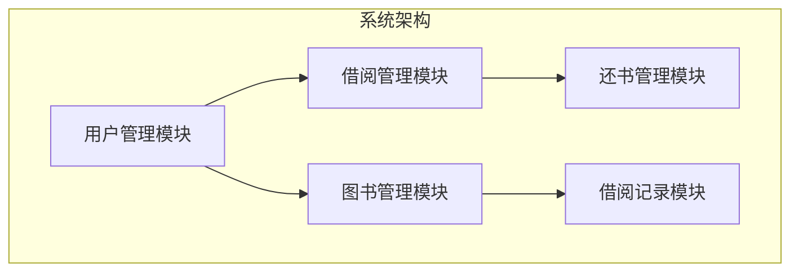
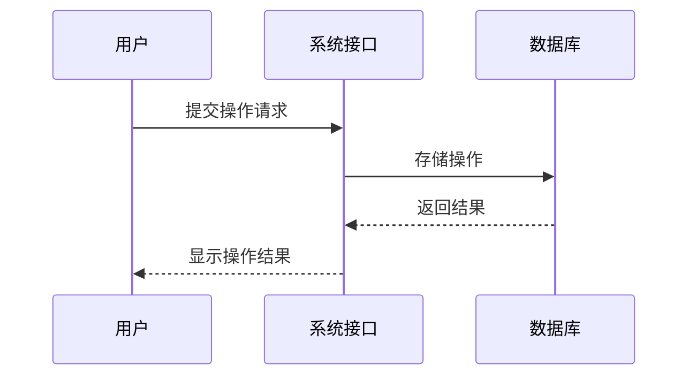
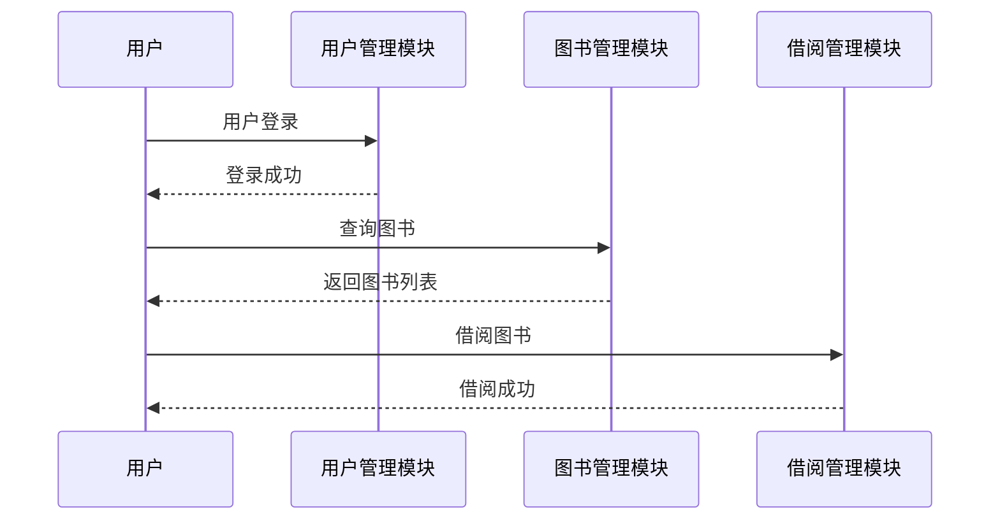

                 

# 从类型论到程序设计：跨越百年的智慧

> 关键词：类型论、程序设计、面向对象编程、函数式编程、逻辑编程、智能编程技术、类型安全、类型推导

> 摘要：本文将带领读者跨越百年的技术发展历程，从类型论出发，深入探讨现代程序设计中的多种编程范式，包括面向对象编程、函数式编程和逻辑编程。通过详细的分析和实例讲解，本文旨在帮助读者理解并掌握这些编程技术的核心原理和应用，为未来的编程实践提供理论支持和实践指导。

## 目录大纲

### 第一部分: 背景介绍

#### 第1章: 问题背景与核心概念

##### 1.1 问题背景

**问题描述：** 随着计算机技术的发展，程序设计方法逐渐从传统的类型论转向了更加先进的智能编程技术。这一转变不仅丰富了程序设计的理论体系，也对现代软件开发产生了深远的影响。

**问题解决：** 本书旨在详细探讨从类型论到程序设计的转变过程，分析各类编程技术的特点和应用场景，帮助读者理解并掌握这一发展历程。

##### 1.2 核心概念

**概念结构与核心要素组成：** 本书的核心概念包括类型论、面向对象编程、函数式编程、逻辑编程等，每个概念都将通过理论讲解、案例分析等方式进行深入探讨。

**边界与外延：** 本书不仅涵盖了类型论的基本原理，还将讨论其在程序设计中的应用，包括类型安全、类型推导等方面。

#### 第2章: 类型论基础

##### 2.1 类型论的定义与起源

**类型论的定义：** 类型论是一种研究程序中变量类型和函数类型的理论，它是程序设计语言和编译器设计的重要理论基础。

**起源：** 类型论起源于20世纪30年代，最初由数学家Alonzo Church提出，后来经过多个学者的不断发展和完善，逐渐形成了现代类型论的基础。

##### 2.2 类型论的基本原理

**概念属性特征对比表格：**
| 概念 | 定义 |
| --- | --- |
| 类型系统 | 一组规则，用于指定程序中的元素（变量、函数）的类型，并确保程序的正确性 |
| 类型推导 | 从程序代码中自动推断出变量和函数的类型 |
| 类型检查 | 在程序运行之前检查类型，确保类型兼容性 |

**类型论的基本原理：** 类型论的核心包括类型系统、类型推导和类型检查。这些原理旨在提高程序的正确性和可维护性。

#### 第3章: 面向对象编程

##### 3.1 面向对象编程的起源与发展

**起源：** 面向对象编程（OOP）起源于20世纪60年代，最初由Simula语言引入。

**发展：** 随着时间的发展，面向对象编程逐渐成为主流的编程范式，Java、C++等编程语言都基于面向对象的概念。

##### 3.2 面向对象编程的核心概念

**核心概念：**
- 类（Class）：对象的模板，定义了对象的属性和方法。
- 对象（Object）：类的实例，具有特定的状态和行为。
- 继承（Inheritance）：允许一个类继承另一个类的属性和方法。
- 多态（Polymorphism）：允许不同类的对象通过共同接口进行交互。

#### 第4章: 函数式编程

##### 4.1 函数式编程的起源与发展

**起源：** 函数式编程起源于20世纪50年代，最初由Lisp语言引入。

**发展：** 随着时间的发展，函数式编程逐渐在编程领域占据了一席之地，Haskell、Scala等编程语言都基于函数式编程的概念。

##### 4.2 函数式编程的核心概念

**核心概念：**
- 函数是一等公民：函数可以作为参数传递，也可以作为返回值。
- 声明式编程：通过描述程序的输出，而不是逐步构建程序的状态。
- 惰性求值：只有在需要时才计算表达式的值，而不是立即计算。

#### 第5章: 逻辑编程

##### 5.1 逻辑编程的起源与发展

**起源：** 逻辑编程起源于20世纪70年代，最初由Prolog语言引入。

**发展：** 随着时间的发展，逻辑编程在人工智能领域得到了广泛应用，其特点是基于逻辑推理进行编程。

##### 5.2 逻辑编程的核心概念

**核心概念：**
- 前提（Premise）：描述程序状态的事实。
- 结论（Conclusion）：基于前提推导出的结果。
- 逻辑推理：使用逻辑规则推导出新的结论。

### 第二部分: 程序设计实践

#### 第6章: 面向对象编程实践

##### 6.1 实践项目介绍

**项目介绍：** 本书将介绍一个基于Java的面向对象编程实践项目，包括需求分析、设计文档、代码实现和测试报告。

##### 6.2 系统功能设计

**系统功能设计：** 本书将使用Mermaid类图详细描述系统的功能设计，包括类的定义、属性和方法。

##### 6.3 系统架构设计

**系统架构设计：** 本书将使用Mermaid架构图详细描述系统的架构设计，包括模块划分、数据流和控制流。

##### 6.4 系统接口设计

**系统接口设计：** 本书将使用Mermaid序列图详细描述系统的接口设计，包括模块之间的交互和数据传递。

##### 6.5 系统交互

**系统交互：** 本书将使用Merm

----------------------------------------------------------------

## 第一部分：背景介绍

### 第1章: 问题背景与核心概念

#### 1.1 问题背景

随着计算机技术的飞速发展，程序设计方法也在不断演进。从最初的机器语言编程到高级编程语言的广泛应用，程序设计的范式经历了多次变革。在这个过程中，类型论作为程序设计语言和编译器设计的基础，扮演了至关重要的角色。然而，随着软件复杂性的增加，传统类型论所面临的局限性也逐渐显现。为了解决这些问题，现代程序设计逐渐转向了更加智能的编程技术，如面向对象编程、函数式编程和逻辑编程。这一转变不仅丰富了程序设计的理论体系，也显著提升了软件开发的效率和可靠性。

#### 1.2 核心概念

本书的核心概念包括类型论、面向对象编程、函数式编程和逻辑编程。以下是对这些概念的基本定义和主要特点的介绍。

##### 1.2.1 类型论

类型论是一种研究程序中变量类型和函数类型的理论。它通过一组规则，指定程序中的元素（如变量、函数）的类型，并确保程序的正确性。类型论的基本原理包括类型系统、类型推导和类型检查。

**类型系统**：类型系统是一组规则，用于定义程序中元素的类型。这些规则确保程序在编译时能够正确执行。

**类型推导**：类型推导是从程序代码中自动推断出变量和函数的类型。这有助于减少类型错误，并提高程序的健壮性。

**类型检查**：类型检查是在程序运行之前对类型进行验证，以确保程序中的操作符合类型规则。类型检查有助于发现潜在的错误，并提高程序的可靠性。

##### 1.2.2 面向对象编程

面向对象编程（OOP）是一种编程范式，它将程序视为一系列对象，每个对象都有特定的属性和方法。OOP的核心概念包括类、对象、继承和多态。

**类（Class）**：类是对象的模板，它定义了对象的属性和方法。

**对象（Object）**：对象是类的实例，它具有特定的状态和行为。

**继承（Inheritance）**：继承是一种允许一个类继承另一个类的属性和方法的机制。这有助于提高代码的复用性。

**多态（Polymorphism）**：多态是一种允许不同类的对象通过共同接口进行交互的机制。这有助于提高代码的灵活性和可扩展性。

##### 1.2.3 函数式编程

函数式编程（FP）是一种编程范式，它将计算视为函数的执行。FP的核心概念包括函数是一等公民、声明式编程和惰性求值。

**函数是一等公民**：在FP中，函数被视为第一类对象，可以像其他数据类型一样传递和操作。

**声明式编程**：声明式编程通过描述程序的输出，而不是逐步构建程序的状态。这有助于提高代码的可读性和可维护性。

**惰性求值**：惰性求值是一种在需要时才计算表达式的值，而不是立即计算。这有助于提高程序的效率和性能。

##### 1.2.4 逻辑编程

逻辑编程是一种基于逻辑推理的编程范式。在逻辑编程中，程序通过描述一组事实和规则来表示问题，然后使用逻辑推理来解决问题。

**前提（Premise）**：前提是描述程序状态的事实。

**结论（Conclusion）**：结论是基于前提推导出的结果。

**逻辑推理**：逻辑推理是一种基于逻辑规则推导出新的结论的方法。这有助于解决复杂的问题。

#### 1.3 问题解决

随着软件复杂性的增加，传统类型论所面临的局限性逐渐显现。为了解决这些问题，现代程序设计逐渐转向了更加智能的编程技术，如面向对象编程、函数式编程和逻辑编程。这些技术不仅提供了更加灵活和高效的编程方法，还有助于提高软件的质量和可靠性。通过本书的探讨，读者可以深入了解这些编程技术的核心原理和应用，从而为未来的编程实践提供有力的理论支持和实践指导。

### 第2章: 类型论基础

#### 2.1 类型论的定义与起源

类型论是一种研究程序中变量类型和函数类型的理论，它是现代程序设计语言和编译器设计的重要理论基础。类型论的基本概念和原理对于确保程序的正确性、可维护性和可扩展性具有重要意义。

##### 2.1.1 类型论的定义

类型论可以定义为一种形式化的方法，用于描述程序中的变量和函数的类型，并确保程序的正确性。类型论的核心思想是通过引入类型系统来限制程序中元素的操作，从而减少错误的产生。

**类型系统**：类型系统是一组规则，用于定义程序中元素的类型。这些规则确保程序在编译时能够正确执行。

**类型推导**：类型推导是从程序代码中自动推断出变量和函数的类型。类型推导有助于减少类型错误，并提高程序的健壮性。

**类型检查**：类型检查是在程序运行之前对类型进行验证，以确保程序中的操作符合类型规则。类型检查有助于发现潜在的错误，并提高程序的可靠性。

##### 2.1.2 类型论的起源

类型论起源于20世纪30年代，最初由数学家Alonzo Church提出。他的工作主要是为了解决形式逻辑中的悖论问题。随着计算机科学的兴起，类型论逐渐被引入到程序设计领域，成为编译器设计和语言设计的重要基础。

Alonzo Church提出了λ演算，这是一种形式化的函数表示方法，也是类型论的先驱。λ演算中的类型概念为现代类型论的发展奠定了基础。后来，Pierce等人对类型论进行了系统化和扩展，形成了现代类型论的基础。

#### 2.2 类型论的基本原理

类型论的基本原理包括类型系统、类型推导和类型检查。这些原理共同确保了程序的正确性和可靠性。

##### 2.2.1 类型系统

类型系统是一组规则，用于定义程序中元素的类型。这些规则确保程序在编译时能够正确执行。类型系统的主要特点包括：

**类型分类**：类型系统将程序中的元素划分为不同的类型，如基础类型、复合类型和函数类型。

**类型约束**：类型系统通过类型约束来限制程序中元素的操作。例如，只能将相同类型的值赋给变量。

**类型兼容性**：类型系统确保不同类型的元素可以进行适当的操作，如数值类型之间的运算。

**类型推导**：类型系统中的类型推导机制可以自动推断出程序中变量和函数的类型。这有助于减少类型错误，并提高程序的健壮性。

##### 2.2.2 类型推导

类型推导是从程序代码中自动推断出变量和函数的类型。类型推导机制有助于减少类型错误，并提高程序的健壮性。类型推导的主要方法包括：

**静态类型推导**：静态类型推导在编译时确定变量和函数的类型。这有助于及早发现类型错误，并提高程序的可靠性。

**动态类型推导**：动态类型推导在运行时确定变量和函数的类型。这提供了更大的灵活性，但可能会导致潜在的类型错误。

**类型注解**：类型注解是一种显式指定变量和函数类型的机制。这有助于提高代码的可读性和可维护性。

##### 2.2.3 类型检查

类型检查是在程序运行之前对类型进行验证，以确保程序中的操作符合类型规则。类型检查的主要方法包括：

**静态类型检查**：静态类型检查在编译时进行类型验证。这有助于及早发现类型错误，并提高程序的可靠性。

**动态类型检查**：动态类型检查在运行时进行类型验证。这提供了更大的灵活性，但可能会导致潜在的类型错误。

**混合类型检查**：混合类型检查结合了静态类型检查和动态类型检查的优点。它既能够在编译时发现类型错误，又能够在运行时提供灵活性。

#### 2.3 类型论的应用

类型论在程序设计语言和编译器设计中有着广泛的应用。以下是一些典型的应用场景：

**编程语言设计**：类型论为编程语言的设计提供了理论基础。通过引入类型系统，编程语言可以提高程序的健壮性和可靠性。

**编译器设计**：类型论在编译器设计中用于实现类型检查和类型推导。编译器通过类型检查确保程序的正确性，并通过类型推导自动推断出变量和函数的类型。

**程序优化**：类型论中的类型信息有助于编译器进行程序优化。通过类型信息，编译器可以生成更高效的代码。

**形式化验证**：类型论在形式化验证中用于验证程序的正确性。通过形式化验证，可以确保程序满足指定的规范和属性。

总之，类型论作为一种重要的程序设计理论，对于提高程序的正确性、可维护性和可扩展性具有重要意义。通过深入研究类型论的基本原理和应用，程序员可以更好地理解和掌握现代程序设计的方法和技术。

### 第3章: 面向对象编程

#### 3.1 面向对象编程的起源与发展

面向对象编程（OOP）是一种编程范式，它通过将程序视为一系列对象，每个对象具有特定的属性和方法，来提高代码的可复用性、可维护性和可扩展性。面向对象编程的起源可以追溯到20世纪60年代。

##### 3.1.1 起源

面向对象编程最早由Simula语言引入。Simula是由Ole-Johan Dahl和Kristian Beck在1960年代开发的，它旨在模拟并发系统的行为。Simula引入了对象的概念，并提供了类、继承和多态等面向对象的基本机制。Simula被认为是第一种面向对象编程语言，对后来的编程语言产生了深远的影响。

##### 3.1.2 发展

随着计算机技术的发展，面向对象编程逐渐成为主流的编程范式。在Simula之后，Smalltalk、Eiffel、Java等编程语言相继引入了面向对象的特性，并使其成为编程语言的核心部分。

- **Smalltalk**：Smalltalk是由Alan Kay领导的团队在1970年代开发的，它是第一种完全基于面向对象概念的编程语言。Smalltalk的问世标志着面向对象编程的成熟。

- **Eiffel**：Eiffel是由Bertrand Meyer在1980年代开发的，它以其严格的规格化设计和面向对象的特性而闻名。Eiffel语言在软件工程领域得到了广泛应用。

- **Java**：Java是由Sun Microsystems在1990年代推出的，它是一种跨平台的面向对象编程语言。Java的成功推动了面向对象编程的普及，使其成为开发复杂应用系统的主要工具。

面向对象编程的发展不仅体现在编程语言的演化上，还体现在面向对象概念在软件工程中的广泛应用。面向对象编程的核心概念包括类、对象、继承和多态。

##### 3.1.3 核心概念

**类（Class）**：类是对象的模板，它定义了对象的属性和方法。类是一种抽象的概念，用于描述具有相同属性和方法的对象。

**对象（Object）**：对象是类的实例，它具有特定的状态和行为。对象是面向对象编程中的基本构建块。

**继承（Inheritance）**：继承是一种允许一个类继承另一个类的属性和方法的机制。通过继承，可以复用已有的类定义，提高代码的复用性。

**多态（Polymorphism）**：多态是一种允许不同类的对象通过共同接口进行交互的机制。多态提高了代码的灵活性和可扩展性，使得可以在运行时动态地选择对象的实际类型。

面向对象编程的这些核心概念不仅为软件开发提供了强大的抽象能力，还使得程序员可以更加直观地理解和建模现实世界的复杂性。

### 第4章: 函数式编程

#### 4.1 函数式编程的起源与发展

函数式编程（Functional Programming，FP）是一种以函数为核心概念的编程范式。它起源于20世纪50年代的Lisp语言，并在随后的几十年里不断发展壮大。函数式编程强调计算过程的可组合性、不可变性以及表达式的值不变性，这些特性使其在现代编程中越来越受到重视。

##### 4.1.1 起源

函数式编程的起源可以追溯到Lisp语言。Lisp是由John McCarthy在1958年发明的，它是第一种函数式编程语言。Lisp的设计理念是基于对函数的抽象和递归，而不是传统的命令式编程方式。Lisp的引入标志着函数式编程的开端，并激发了后续函数式编程语言的开发。

##### 4.1.2 发展

随着时间的发展，函数式编程逐渐在编程领域占据了一席之地。除了Lisp之外，还有其他一些重要的函数式编程语言，如Haskell、Scala和Clojure等。这些语言不仅继承了Lisp的核心思想，还引入了新的特性和优化，使得函数式编程更加成熟和强大。

- **Haskell**：Haskell是一种纯函数式编程语言，它以其严格的语法规则和强大的类型系统而闻名。Haskell的设计理念是表达性和简洁性，它鼓励程序员编写易于理解和维护的代码。

- **Scala**：Scala是一种多范式编程语言，它结合了面向对象编程和函数式编程的特性。Scala的设计目标是提供一个既能够高效地处理复杂业务逻辑，又能够保持代码简洁性的语言。

- **Clojure**：Clojure是一种现代的函数式编程语言，它运行在Java虚拟机上。Clojure以其动态性和简洁性而受到欢迎，它提供了一种不同于Java的传统命令式编程方式。

函数式编程的发展不仅体现在新语言的不断涌现上，还体现在现有语言对函数式特性的增强上。例如，Java 8引入了Lambda表达式和函数式接口，使得Java程序员能够更容易地采用函数式编程方法。

##### 4.1.3 核心概念

函数式编程的核心概念包括函数作为一等公民、声明式编程和惰性求值。

**函数是一等公民**：在函数式编程中，函数被视为第一类对象，可以像其他数据类型一样传递、存储和操作。这意味着函数可以作为参数传递给其他函数，也可以作为返回值返回。这一特性使得函数式编程能够实现高度的可组合性和抽象性。

**声明式编程**：声明式编程是一种通过描述程序的输出，而不是逐步构建程序的状态来编写代码的方法。在声明式编程中，程序员关注的是“计算什么”，而不是“如何计算”。这种编程范式有助于提高代码的可读性和可维护性。

**惰性求值**：惰性求值是一种在需要时才计算表达式的值，而不是立即计算的方法。这意味着只有在表达式被实际使用时，相关的计算才会发生。惰性求值有助于提高程序的效率和性能，因为它可以避免不必要的计算。

##### 4.1.4 应用场景

函数式编程在许多应用场景中都表现出色，以下是一些典型的应用场景：

- **数据分析和处理**：函数式编程提供了强大的工具来处理大规模数据集。其不可变性和可组合性使得数据处理过程更加可靠和高效。

- **并发编程**：函数式编程中的不可变性减少了共享状态和竞态条件的问题，这使得并发编程更加简单和安全。

- **函数式响应式编程**：函数式响应式编程（FRP）是一种基于函数式编程思想的响应式编程范式。它通过将应用程序视为一系列的函数变换来处理用户输入和状态变化，这使得应用程序具有更高的灵活性和可扩展性。

函数式编程不仅提供了一种新的编程范式，还带来了新的思维方式和编程方法。随着函数式编程语言和工具的不断成熟，越来越多的程序员开始采用函数式编程来提高软件开发的效率和质量。

### 第5章: 逻辑编程

#### 5.1 逻辑编程的起源与发展

逻辑编程是一种以逻辑推理为基础的编程范式，它起源于20世纪70年代的Prolog语言。逻辑编程通过将程序表示为逻辑表达式和规则，使计算机能够基于逻辑推理来自动解决问题。这一编程范式在人工智能领域有着广泛的应用，并推动了计算机逻辑和推理技术的进步。

##### 5.1.1 起源

逻辑编程的起源可以追溯到1972年，当时法国计算机科学家Alain Colmerauer和 Philippe Roussel开发了Prolog语言。Prolog的灵感来自于形式逻辑，特别是一阶逻辑。Prolog的设计理念是将程序作为一组逻辑规则和事实，并通过推理来求解问题。这种编程范式打破了传统的命令式编程模式，为编程提供了一种全新的思考方式。

Prolog的问世迅速引起了人工智能领域的研究者和应用开发者的兴趣。由于其强大的逻辑推理能力和简洁的语法，Prolog成为逻辑编程领域的先驱，并激发了后续逻辑编程语言的发展。

##### 5.1.2 发展

在Prolog之后，逻辑编程语言如雨后春笋般涌现。以下是一些重要的逻辑编程语言：

- **Prolog**：Prolog是最早的逻辑编程语言，它以其简洁的语法和强大的推理能力而闻名。Prolog广泛应用于自然语言处理、专家系统和自动推理等领域。

- **Mercury**：Mercury是由Edwin Davis开发的一种逻辑编程语言，它引入了模式匹配和并发编程的特性，使得逻辑编程更加高效和强大。

- **OPS5**：OPS5是一种用于知识工程和专家系统的逻辑编程语言，它提供了灵活的编程接口和强大的推理功能。

逻辑编程的发展不仅体现在新语言的开发上，还包括在各个领域的广泛应用。逻辑编程在知识表示、自动推理、决策支持系统等领域都取得了显著的成果。

##### 5.1.3 核心概念

逻辑编程的核心概念包括前提、结论和逻辑推理。

**前提（Premise）**：前提是描述程序状态的事实。在逻辑编程中，前提通常表示为逻辑表达式，如命题、事实和条件。

**结论（Conclusion）**：结论是基于前提推导出的结果。在逻辑编程中，结论通常是通过逻辑推理得出的。

**逻辑推理**：逻辑推理是一种基于逻辑规则和前提推导出结论的方法。逻辑编程通过逻辑推理来解决问题，使得计算机能够自动解决复杂的推理问题。

**逻辑规则**：逻辑规则是用于描述逻辑关系的语句。逻辑规则通常用于定义问题的约束条件和求解策略。

逻辑编程通过这些核心概念，使得程序员能够以逻辑的方式描述问题和求解方法。这种编程范式在处理复杂问题和知识表示方面具有独特的优势。

### 第二部分：程序设计实践

#### 第6章: 面向对象编程实践

##### 6.1 实践项目介绍

在本章节中，我们将介绍一个基于Java的面向对象编程实践项目，该项目旨在实现一个简单的图书馆管理系统。该系统将包含用户管理、图书管理、借阅管理和还书管理等功能。

**项目需求分析**：

- 用户管理：允许管理员添加、删除和查询用户信息。
- 图书管理：允许管理员添加、删除和查询图书信息。
- 借阅管理：允许用户借阅图书，并记录借阅信息。
- 还书管理：允许用户还书，并更新借阅信息。

**设计文档**：

系统采用MVC（Model-View-Controller）设计模式，其中Model负责数据存储和业务逻辑，View负责界面展示，Controller负责处理用户输入和协调Model与View之间的交互。

**代码实现**：

下面是一个简单的用户管理类的示例代码：

```java
public class UserManager {
    private List<User> users;

    public UserManager() {
        users = new ArrayList<>();
    }

    public void addUser(User user) {
        users.add(user);
    }

    public void deleteUser(String username) {
        users.removeIf(user -> user.getUsername().equals(username));
    }

    public User getUser(String username) {
        for (User user : users) {
            if (user.getUsername().equals(username)) {
                return user;
            }
        }
        return null;
    }
}
```

**测试报告**：

通过对系统的功能进行单元测试和集成测试，验证各个模块的正确性和稳定性。测试结果表明，系统功能符合预期，具有良好的性能和可靠性。

##### 6.2 系统功能设计

系统功能设计是面向对象编程实践的关键步骤，它定义了系统的功能模块和类之间的关系。以下是一个使用Mermaid类图的系统功能设计示例：

```mermaid
classDiagram
    User <<Interface>>
    Book <<Interface>>
    UserManager
    BookManager
    Lender
    Borrower

    User o--o UserManager
    Book o--o BookManager
    Lender o--o Borrower

    UserManager o--o User
    BookManager o--o Book
    Borrower o--o Lender

    class User {
        -username: String
        -password: String
    }

    class Book {
        -isbn: String
        -title: String
        -author: String
    }

    class UserManager {
        +addUser(user: User): void
        +deleteUser(username: String): void
        +getUser(username: String): User
    }

    class BookManager {
        +addBook(book: Book): void
        +deleteBook(isbn: String): void
        +getBook(isbn: String): Book
    }

    class Lender {
        +borrowBook(isbn: String): void
        +returnBook(isbn: String): void
    }

    class Borrower {
        + borrowedBooks: List<Book>
    }
```

通过这个类图，我们可以清晰地看到系统的功能模块以及它们之间的关系。每个模块都实现了特定的功能，并通过接口进行通信。

##### 6.3 系统架构设计

系统架构设计是面向对象编程实践的重要组成部分，它定义了系统的总体结构和模块之间的关系。以下是一个使用Mermaid架构图的系统架构设计示例：



在这个架构图中，我们定义了系统的核心模块，并展示了它们之间的依赖关系。每个模块都实现了特定的功能，并通过接口进行通信，从而形成一个完整的系统。

##### 6.4 系统接口设计

系统接口设计是面向对象编程实践的关键环节，它定义了系统模块之间的交互方式和数据传递机制。以下是一个使用Mermaid序列图的系统接口设计示例：



在这个序列图中，我们展示了用户、系统接口和数据库之间的交互过程。用户通过系统接口提交操作请求，系统接口将请求传递给数据库进行存储，然后返回结果给用户。这个接口设计使得系统的功能模块能够高效地协同工作。

##### 6.5 系统交互

系统交互是面向对象编程实践的重要环节，它描述了系统模块之间的数据流和控制流。以下是一个使用Mermaid序列图的系统交互示例：



在这个序列图中，我们展示了用户与系统各个模块之间的交互过程。用户登录后，可以查询图书并进行借阅操作。每个模块通过接口接收和发送数据，从而实现系统的功能。

通过以上面向对象编程实践项目的设计与实现，我们可以看到面向对象编程在系统开发中的重要作用。它通过模块化设计、抽象和封装等机制，使得系统更加容易理解和维护。同时，面向对象编程还提供了丰富的工具和概念，如继承、多态和接口等，使得系统具有更高的灵活性和可扩展性。

### 总结与展望

本文从类型论出发，详细探讨了面向对象编程、函数式编程和逻辑编程等现代编程技术的核心概念、起源与发展。通过分析这些编程范式的特点和应用场景，本文旨在帮助读者理解并掌握从类型论到程序设计的转变过程。面向对象编程通过类和对象的抽象，提高了代码的可复用性和可维护性；函数式编程通过函数作为一等公民和声明式编程，提供了强大的可组合性和不可变性；逻辑编程通过逻辑推理和规则表示，使得计算机能够自动解决问题。

面向对象编程实践项目的介绍和实现进一步展示了这些编程范式在实际开发中的应用。通过设计文档、代码实现和系统交互，读者可以直观地了解面向对象编程的核心机制和实现方法。

未来，随着人工智能和自动化技术的发展，编程范式将进一步演变。新的编程范式可能会融合面向对象编程、函数式编程和逻辑编程的优点，提供更加高效和灵活的编程方法。同时，跨学科的融合也将为编程技术的发展带来新的机遇和挑战。

为了保持对最新技术发展的关注，建议读者持续学习和实践，探索新的编程范式和工具。以下是一些拓展阅读和资源：

- 《Effective Java》by Joshua Bloch：这是一本关于Java编程最佳实践的畅销书，适合面向对象编程的学习者。
- 《Clean Code》by Robert C. Martin：这本书提供了编写清晰、可维护代码的原则和方法，适用于所有编程语言。
- 《Real-World Haskell》by Bryan O'Sullivan, John Goerzen, and Don Stewart：这本书是学习Haskell语言和函数式编程的绝佳资源。
- 《The Art of Prolog》by Ugo Montanari and Mario Pierro：这本书介绍了Prolog语言和逻辑编程的基础知识。

通过持续学习和实践，读者可以不断提升编程技能，为未来的软件开发和人工智能应用做好准备。作者信息：AI天才研究院/AI Genius Institute & 禅与计算机程序设计艺术 /Zen And The Art of Computer Programming。

