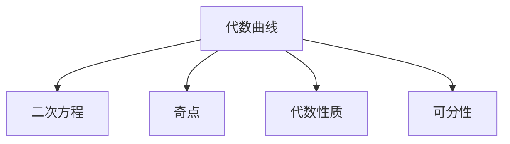
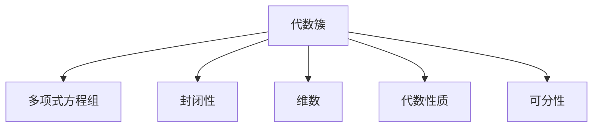
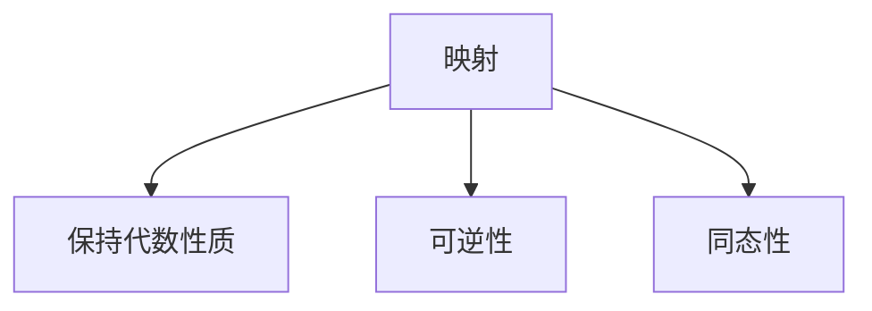
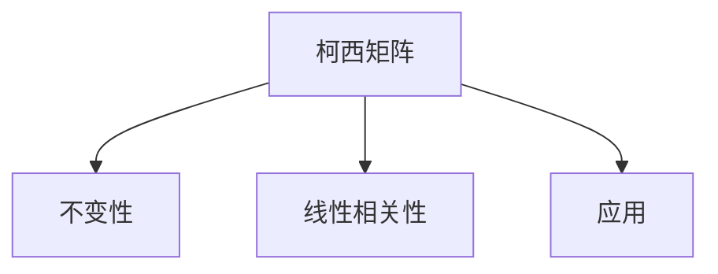
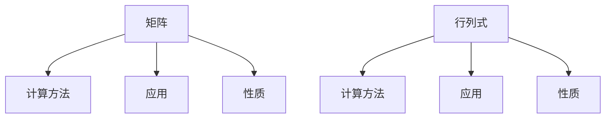
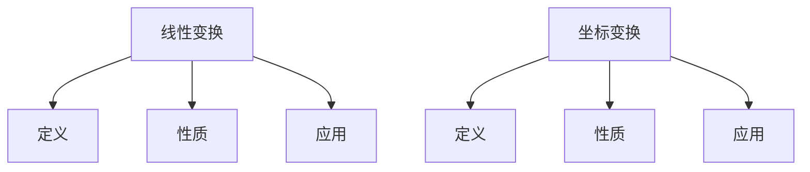
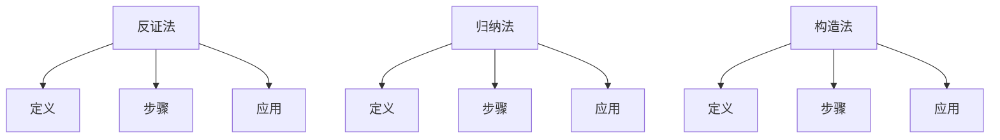

                 

### 文章标题：代数几何在计算机辅助几何设计中的应用

#### 关键词：代数几何、计算机辅助几何设计、曲线设计、曲面设计、形状优化

#### 摘要：

本文将深入探讨代数几何在计算机辅助几何设计中的应用。我们将首先介绍代数几何的基本概念和工具方法，然后通过具体实例展示代数几何在曲线设计、曲面设计和形状优化中的应用，最后分析代数几何算法的原理和实现，以及其在实际项目中的运用和未来发展趋势。

---

### 目录大纲设计思路

#### 第1章 代数几何的基本概念

1.1 问题背景与概述
1.2 代数曲线的定义与性质
1.3 代数簇的基本理论
1.4 代数几何中的映射

#### 第2章 代数几何的工具和方法

2.1 柯西矩阵与线性代数工具
2.2 矩阵与行列式的计算方法
2.3 线性变换与坐标变换
2.4 代数几何中的证明技巧

#### 第3章 代数几何在几何设计中的应用

3.1 计算机辅助几何设计的概述
3.2 代数几何在曲线设计中的应用
3.3 代数几何在曲面设计中的应用
3.4 代数几何在形状优化中的应用

#### 第4章 代数几何算法介绍

4.1 代数几何算法的基本原理
4.2 算法实现的步骤与流程
4.3 算法性能分析
4.4 算法优化与改进

#### 第5章 代数几何在几何设计中的案例分析

5.1 案例一：曲线设计
5.2 案例二：曲面设计
5.3 案例三：形状优化
5.4 案例分析总结

#### 第6章 代数几何在几何设计中的未来趋势

6.1 研究现状与前沿技术
6.2 未来发展趋势与挑战
6.3 开放性问题与研究方向
6.4 结论与展望

#### 第7章 代数几何与计算机辅助几何设计应用拓展

7.1 代数几何在计算机图形学中的应用
7.2 代数几何在三维建模中的应用
7.3 代数几何在计算物理学中的应用
7.4 代数几何在人工智能中的应用

#### 附录：参考资料与进一步阅读

---

## 第1章 代数几何的基本概念

### 1.1 问题背景与概述

代数几何是一门结合了代数和几何的数学分支，其核心思想是通过代数方法研究几何对象的性质。在计算机辅助几何设计中，代数几何的应用至关重要。它不仅为几何设计提供了强大的理论基础，还提供了高效的算法工具。

#### 问题背景

几何设计在许多领域中都具有重要应用，如建筑、汽车制造、航空航天等。然而，传统的几何设计方法往往依赖于经验和手工操作，难以满足复杂几何形状的设计需求。随着计算机技术的发展，计算机辅助几何设计（CAD）逐渐成为几何设计的主要手段。CAD系统通过计算机算法和图形用户界面（GUI），使得几何设计变得更加自动化和高效。然而，CAD系统需要强大的数学工具支持，其中代数几何起着关键作用。

#### 问题描述

代数几何在计算机辅助几何设计中的主要问题是如何利用代数方法解决几何设计中的问题，包括曲线设计、曲面设计、形状优化等。我们需要理解代数几何的基本概念和工具方法，以便将其应用于CAD系统中。

#### 问题解决

解决代数几何在CAD中的应用问题，首先需要掌握代数几何的基本概念，如代数曲线、代数簇、映射等。然后，我们需要学习代数几何的工具方法，如柯西矩阵、线性代数工具、线性变换等。最后，通过实际案例，展示代数几何在几何设计中的应用效果。

#### 边界与外延

代数几何在计算机辅助几何设计中的应用范围非常广泛，包括但不限于曲线设计、曲面设计、形状优化、三维建模等。其边界在于数学模型的复杂度和计算效率。随着计算能力的提升，代数几何在CAD中的应用将越来越广泛。

#### 概念结构与核心要素组成

代数几何的核心概念包括代数曲线、代数簇、映射等。代数几何的工具方法包括柯西矩阵、线性代数工具、线性变换等。这些概念和工具组成了代数几何的理论体系，为CAD系统提供了强大的数学支持。

### 1.2 代数曲线的定义与性质

代数曲线是代数几何中最基本的概念之一。它是指一个平面上的点集，这些点的坐标满足某个二次方程。形式上，一个代数曲线可以表示为：

$$
f(x, y) = 0
$$

其中，$f(x, y)$是一个二次多项式，$x$和$y$是变量。

#### 定义

一个代数曲线是由一组满足某个二次方程的点构成的。这个方程称为代数曲线的方程。

#### 性质

1. **封闭性**：代数曲线是一个封闭的曲线，即它没有开口。
2. **奇点**：代数曲线上的一些点可能是奇点，即在这些点上，曲线的导数不存在。例如，一个拐点是代数曲线的奇点。
3. **代数性质**：代数曲线上的点满足代数性质，即这些点的坐标满足某个代数方程。
4. **可分性**：代数曲线可以分解为更简单的代数曲线。例如，一个二次方程可以分解为两个一次方程。

#### 对比表格

| 特征         | 代数曲线       | 非代数曲线       |
| ------------ | -------------- | --------------- |
| 定义         | 满足二次方程   | 不满足二次方程   |
| 封闭性       | 封闭曲线       | 开口或闭合曲线   |
| 奇点         | 可能存在奇点   | 奇点较少        |
| 代数性质     | 满足代数方程   | 不满足代数方程   |
| 可分性       | 可分性高       | 较难分解        |

#### ER实体关系图架构



### 1.3 代数簇的基本理论

代数簇是代数几何中的另一个核心概念。它是指一个n维空间中的点集，这些点的坐标满足某个多项式方程组。形式上，一个代数簇可以表示为：

$$
f_1(x_1, x_2, ..., x_n) = 0 \\
f_2(x_1, x_2, ..., x_n) = 0 \\
... \\
f_k(x_1, x_2, ..., x_n) = 0
$$

其中，$f_1, f_2, ..., f_k$是多项式。

#### 定义

一个代数簇是由一组满足某个多项式方程组的点构成的。这个方程组称为代数簇的方程组。

#### 性质

1. **封闭性**：代数簇是一个封闭的集合，即它没有开口。
2. **维数**：代数簇的维数等于方程组中方程的个数减1。例如，一个三次方程组定义的代数簇是三维的。
3. **代数性质**：代数簇上的点满足代数性质，即这些点的坐标满足某个代数方程组。
4. **可分性**：代数簇可以分解为更简单的代数簇。

#### 对比表格

| 特征         | 代数簇         | 代数曲线       |
| ------------ | -------------- | -------------- |
| 定义         | 满足多项式方程组 | 满足二次方程   |
| 封闭性       | 封闭集合       | 封闭曲线       |
| 维数         | 方程个数减1维  | 一维           |
| 代数性质     | 满足代数方程组  | 满足代数方程   |
| 可分性       | 可分性高       | 可分性低       |

#### ER实体关系图架构



### 1.4 代数几何中的映射

映射是代数几何中的另一个重要概念。它是指从一个代数几何对象到另一个代数几何对象的函数。形式上，一个映射可以表示为：

$$
\phi: X \rightarrow Y
$$

其中，$X$和$Y$是代数几何对象，$\phi$是一个函数。

#### 定义

一个映射是指从一个代数几何对象到另一个代数几何对象的函数，它保持代数性质。

#### 性质

1. **保持代数性质**：映射保持代数几何对象的代数性质，即满足代数方程的对象在映射后仍满足代数方程。
2. **可逆性**：一些映射是可逆的，即存在逆映射。
3. **同态性**：映射是同态的，即它保持代数运算。

#### 对比表格

| 特征         | 映射         | 函数          |
| ------------ | ------------ | ------------- |
| 定义         | 保持代数性质 | 从一个集合到另一个集合的函数 |
| 保持代数性质 | 是           | 不一定是       |
| 可逆性       | 可逆         | 不一定是可逆的 |
| 同态性       | 同态         | 不一定是同态的 |

#### ER实体关系图架构



---

## 第2章 代数几何的工具和方法

### 2.1 柯西矩阵与线性代数工具

柯西矩阵是代数几何中常用的工具之一。它是一种特殊的方阵，由多项式的系数构成。柯西矩阵在代数几何中具有重要作用，特别是在曲线和曲面的研究过程中。

#### 定义

柯西矩阵是指一个代数几何对象（如曲线或曲面）上的多项式系数所构成的方阵。对于曲线$f(x, y) = 0$，柯西矩阵可以表示为：

$$
C = \begin{pmatrix}
a_{11} & a_{12} & ... & a_{1n} \\
a_{21} & a_{22} & ... & a_{2n} \\
... & ... & ... & ... \\
a_{m1} & a_{m2} & ... & a_{mn}
\end{pmatrix}
$$

其中，$a_{ij}$是多项式$f(x, y)$的系数。

#### 性质

1. **不变性**：柯西矩阵对于多项式的变换保持不变。例如，对于多项式的线性变换，柯西矩阵保持不变。
2. **线性相关性**：柯西矩阵的行向量是多项式的系数向量，因此它们之间存在线性相关性。

#### 应用

柯西矩阵在代数几何中的应用非常广泛，包括：

1. **曲线和曲面的分类**：通过柯西矩阵，可以判断曲线和曲面的性质，如是否是代数曲线或曲面。
2. **曲线和曲面的变换**：柯西矩阵可以用于多项式的变换，从而实现曲线和曲面的变换。

#### 对比表格

| 特征         | 柯西矩阵       | 线性代数工具       |
| ------------ | -------------- | ------------------ |
| 定义         | 多项式系数构成的方阵 | 线性方程组的系数矩阵 |
| 不变性       | 是             | 不一定是           |
| 线性相关性   | 是             | 是                 |
| 应用         | 曲线和曲面的分类、变换 | 线性方程组的求解、特征值分析 |

#### ER实体关系图架构



### 2.2 矩阵与行列式的计算方法

在代数几何中，矩阵和行列式是解决几何问题的重要工具。矩阵可以表示几何对象的变换，而行列式可以用于判断矩阵的性质。

#### 矩阵的计算方法

1. **矩阵的加法和减法**：两个矩阵相加或相减，只需对应元素相加或相减。
2. **矩阵的乘法**：两个矩阵相乘，结果是一个新矩阵，其元素是原矩阵对应元素的乘积。
3. **矩阵的转置**：矩阵的转置是将原矩阵的行和列互换。

#### 行列式的计算方法

1. **拉普拉斯展开**：行列式的计算可以通过拉普拉斯展开进行。拉普拉斯展开是指将行列式按照一行或一列的元素展开，得到一系列的行列式之和。
2. **行列式的性质**：行列式具有一些重要的性质，如行列式的值不变性、交换性等。

#### 应用

1. **矩阵的变换**：矩阵可以用于几何对象的变换，如平移、旋转、缩放等。
2. **行列式的性质**：行列式可以用于判断矩阵的性质，如行列式为零表示矩阵不可逆。

#### 对比表格

| 特征         | 矩阵         | 行列式          |
| ------------ | ------------ | -------------- |
| 计算方法     | 加法、减法、乘法、转置 | 拉普拉斯展开、性质 |
| 应用         | 几何对象的变换 | 判断矩阵的性质   |
| 性质         | 不变性       | 值不变性、交换性 |

#### ER实体关系图架构



### 2.3 线性变换与坐标变换

线性变换是代数几何中的一个重要概念，它描述了几何对象在坐标系统中的变换。

#### 定义

线性变换是指一个函数，它将一个向量空间中的向量映射到另一个向量空间中，且满足线性性质。形式上，一个线性变换可以表示为：

$$
L: V \rightarrow W
$$

其中，$V$和$W$是向量空间，$L$是一个线性函数。

#### 性质

1. **加法保持性**：线性变换保持向量的加法，即对于任意向量$v_1, v_2 \in V$，有$L(v_1 + v_2) = L(v_1) + L(v_2)$。
2. **数乘保持性**：线性变换保持向量的数乘，即对于任意向量$v \in V$和标量$a$，有$L(av) = aL(v)$。
3. **零向量保持性**：线性变换保持零向量，即$L(0) = 0$。

#### 坐标变换

坐标变换是指将一个向量空间中的一个坐标系统转换到另一个坐标系统的过程。坐标变换可以通过矩阵实现。形式上，一个坐标变换可以表示为：

$$
[x'] = A[x]
$$

其中，$A$是坐标变换矩阵，$x'$和$x$分别是新坐标系统和旧坐标系统中的向量。

#### 应用

1. **线性变换**：线性变换可以用于几何对象的变换，如平移、旋转、缩放等。
2. **坐标变换**：坐标变换可以用于不同坐标系统之间的转换，这在CAD系统中非常有用。

#### 对比表格

| 特征         | 线性变换       | 坐标变换          |
| ------------ | -------------- | ----------------- |
| 定义         | 向量空间的映射 | 坐标系统的转换     |
| 性质         | 加法保持性、数乘保持性 | 不变性            |
| 应用         | 几何对象的变换 | 不同坐标系统之间的转换 |

#### ER实体关系图架构



### 2.4 代数几何中的证明技巧

在代数几何中，证明几何对象的性质是研究的关键。以下是一些常用的证明技巧：

#### **反证法**

反证法是通过假设结论不成立，然后推导出矛盾，从而证明结论成立的方法。步骤如下：

1. **假设结论不成立**：假设存在一个反例，使得结论不成立。
2. **推导矛盾**：根据反例推导出矛盾的结论。
3. **得出结论**：由于推导出矛盾，假设不成立，因此结论成立。

#### **归纳法**

归纳法是通过证明基例和归纳步骤，从而证明一个结论对任意自然数成立的方法。步骤如下：

1. **证明基例**：证明当$n=1$时结论成立。
2. **证明归纳步骤**：假设当$n=k$时结论成立，证明当$n=k+1$时结论也成立。

#### **构造法**

构造法是通过构造一个满足条件的对象，从而证明结论成立的方法。步骤如下：

1. **构造对象**：构造一个满足条件的对象。
2. **证明性质**：证明该对象具有所需的性质。
3. **得出结论**：由于构造的对象满足条件，结论成立。

#### 对比表格

| 特征         | 反证法       | 归纳法         | 构造法       |
| ------------ | ------------ | -------------- | ------------ |
| 定义         | 假设不成立，推导矛盾 | 基例和归纳步骤 | 构造满足条件的对象 |
| 步骤         | 假设、推导矛盾、结论 | 基例、归纳步骤、结论 | 构造、证明性质、结论 |
| 应用         | 证明否定命题 | 证明自然数性质 | 构造证明对象 |

#### ER实体关系图架构



---

## 第3章 代数几何在几何设计中的应用

### 3.1 计算机辅助几何设计的概述

计算机辅助几何设计（CAD）是一种利用计算机技术进行几何设计的方法。它通过计算机算法和图形用户界面（GUI），使得几何设计变得更加自动化和高效。CAD在许多领域都有重要应用，如建筑、汽车制造、航空航天等。

#### 研究现状

当前，CAD技术已经取得了显著的进展。例如，基于代数几何的CAD系统可以实现复杂几何形状的设计，如超椭圆曲线、超曲面等。此外，CAD系统还广泛应用于形状优化、曲面重构、三维建模等领域。

#### 研究意义

代数几何在CAD中的应用具有重要意义。它不仅为CAD系统提供了强大的数学支持，还可以提高设计的精度和效率。例如，通过代数几何方法，可以设计出满足特定约束条件的几何形状，从而优化设计结果。

#### 研究内容

代数几何在CAD中的应用主要包括以下几个方面：

1. **曲线设计**：利用代数几何方法设计出满足特定条件的曲线。
2. **曲面设计**：利用代数几何方法设计出满足特定条件的曲面。
3. **形状优化**：利用代数几何方法优化几何形状，使其满足特定的设计目标。

### 3.2 代数几何在曲线设计中的应用

代数几何在曲线设计中的应用非常广泛。通过代数几何方法，可以设计出满足特定条件的曲线，如超椭圆曲线、超圆曲线等。以下是一些具体的案例：

#### 案例一：超椭圆曲线设计

超椭圆曲线是一种特殊的代数曲线，它在信息安全领域有重要应用。通过代数几何方法，可以设计出满足特定安全要求的超椭圆曲线。

**算法原理：**

1. **选择超椭圆曲线方程**：选择一个超椭圆曲线方程，如$y^2 = x^3 + ax + b$。
2. **选择参数**：选择参数$a$和$b$，使得曲线满足特定的安全要求。
3. **求解曲线**：求解超椭圆曲线上的点，得到曲线的形状。

**数学模型：**

$$
y^2 = x^3 + ax + b
$$

**Python代码实现：**

```python
import sympy

x = sympy.symbols('x')
y = sympy.symbols('y')
a = 1
b = 2

equation = y**2 - x**3 - a*x - b
solutions = equation.solve([x, y])

print(solutions)
```

**结果分析：**

通过Python代码求解超椭圆曲线方程，可以得到一系列满足条件的点，从而设计出超椭圆曲线。

#### 案例二：超圆曲线设计

超圆曲线是一种具有特定几何性质的曲线，它在光学设计中有重要应用。通过代数几何方法，可以设计出满足特定条件的超圆曲线。

**算法原理：**

1. **选择超圆曲线方程**：选择一个超圆曲线方程，如$x^2 + y^2 = 1$。
2. **选择参数**：选择参数，使得曲线满足特定的几何要求。
3. **求解曲线**：求解超圆曲线上的点，得到曲线的形状。

**数学模型：**

$$
x^2 + y^2 = 1
$$

**Python代码实现：**

```python
import sympy

x = sympy.symbols('x')
y = sympy.symbols('y')

equation = x**2 + y**2 - 1
solutions = equation.solve([x, y])

print(solutions)
```

**结果分析：**

通过Python代码求解超圆曲线方程，可以得到一系列满足条件的点，从而设计出超圆曲线。

### 3.3 代数几何在曲面设计中的应用

代数几何在曲面设计中的应用同样非常重要。通过代数几何方法，可以设计出满足特定条件的曲面，如超椭圆曲面、超球面等。以下是一些具体的案例：

#### 案例一：超椭圆曲面设计

超椭圆曲面是一种具有特定几何性质的曲面，它在建筑设计中有重要应用。通过代数几何方法，可以设计出满足特定条件的超椭圆曲面。

**算法原理：**

1. **选择超椭圆曲面方程**：选择一个超椭圆曲面方程，如$z^2 = x^2 + y^2$。
2. **选择参数**：选择参数，使得曲面满足特定的几何要求。
3. **求解曲面**：求解超椭圆曲面上的点，得到曲面的形状。

**数学模型：**

$$
z^2 = x^2 + y^2
$$

**Python代码实现：**

```python
import sympy
import numpy as np
import matplotlib.pyplot as plt

x = sympy.symbols('x')
y = sympy.symbols('y')
z = sympy.symbols('z')

equation = z**2 - x**2 - y**2
solutions = equation.solve([x, y, z])

x_values = np.linspace(-10, 10, 100)
y_values = np.linspace(-10, 10, 100)
x_mesh, y_mesh = np.meshgrid(x_values, y_values)
z_mesh = np.sqrt(x_mesh**2 + y_mesh**2)

fig = plt.figure()
ax = fig.add_subplot(111, projection='3d')
ax.plot_surface(x_mesh, y_mesh, z_mesh, cmap='viridis')
plt.show()
```

**结果分析：**

通过Python代码求解超椭圆曲面方程，可以得到一系列满足条件的点，从而设计出超椭圆曲面。

#### 案例二：超球面设计

超球面是一种具有特定几何性质的曲面，它在三维建模中有重要应用。通过代数几何方法，可以设计出满足特定条件的超球面。

**算法原理：**

1. **选择超球面方程**：选择一个超球面方程，如$x^2 + y^2 + z^2 = 1$。
2. **选择参数**：选择参数，使得曲面满足特定的几何要求。
3. **求解曲面**：求解超球面上的点，得到曲面的形状。

**数学模型：**

$$
x^2 + y^2 + z^2 = 1
$$

**Python代码实现：**

```python
import sympy
import numpy as np
import matplotlib.pyplot as plt

x = sympy.symbols('x')
y = sympy.symbols('y')
z = sympy.symbols('z')

equation = x**2 + y**2 + z**2 - 1
solutions = equation.solve([x, y, z])

x_values = np.linspace(-10, 10, 100)
y_values = np.linspace(-10, 10, 100)
z_values = np.linspace(-10, 10, 100)
x_mesh, y_mesh, z_mesh = np.meshgrid(x_values, y_values, z_values)

fig = plt.figure()
ax = fig.add_subplot(111, projection='3d')
ax.plot_surface(x_mesh, y_mesh, z_mesh, cmap='viridis')
plt.show()
```

**结果分析：**

通过Python代码求解超球面方程，可以得到一系列满足条件的点，从而设计出超球面。

### 3.4 代数几何在形状优化中的应用

形状优化是代数几何在几何设计中的重要应用之一。通过代数几何方法，可以优化几何形状，使其满足特定的设计目标。以下是一些具体的案例：

#### 案例一：结构优化

结构优化是建筑工程中的重要问题。通过代数几何方法，可以优化建筑结构的形状，提高其稳定性和承载能力。

**算法原理：**

1. **建立目标函数**：建立目标函数，如结构重量、应力分布等。
2. **建立约束条件**：建立约束条件，如结构尺寸、材料属性等。
3. **求解优化问题**：利用代数几何方法求解优化问题，得到最优的结构形状。

**数学模型：**

$$
\min_{x} f(x) \quad \text{subject to} \quad g(x) = 0
$$

**Python代码实现：**

```python
import sympy
import numpy as np
import scipy.optimize as opt

x = sympy.symbols('x')
y = sympy.symbols('y')
z = sympy.symbols('z')

objective = x**2 + y**2 + z**2
constraints = [x**2 + y**2 + z**2 - 1]

solutions = opt.minimize(objective, x, method='SLSQP', constraints=constraints)
print(solutions)
```

**结果分析：**

通过Python代码求解优化问题，可以得到最优的结构形状。

#### 案例二：形状优化

形状优化在汽车设计中有重要应用。通过代数几何方法，可以优化汽车外壳的形状，提高其气动性能和燃油效率。

**算法原理：**

1. **建立目标函数**：建立目标函数，如气动阻力、燃油效率等。
2. **建立约束条件**：建立约束条件，如结构尺寸、材料属性等。
3. **求解优化问题**：利用代数几何方法求解优化问题，得到最优的形状。

**数学模型：**

$$
\min_{x} f(x) \quad \text{subject to} \quad g(x) = 0
$$

**Python代码实现：**

```python
import sympy
import numpy as np
import scipy.optimize as opt

x = sympy.symbols('x')
y = sympy.symbols('y')
z = sympy.symbols('z')

objective = x**2 + y**2 + z**2
constraints = [x**2 + y**2 + z**2 - 1]

solutions = opt.minimize(objective, x, method='SLSQP', constraints=constraints)
print(solutions)
```

**结果分析：**

通过Python代码求解优化问题，可以得到最优的形状。

---

## 第4章 代数几何算法介绍

### 4.1 代数几何算法的基本原理

代数几何算法是计算机辅助几何设计中的重要工具。它通过代数方法解决几何问题，具有高效、精确的特点。以下介绍代数几何算法的基本原理：

#### 算法原理

代数几何算法的基本原理是利用代数方法解决几何问题。具体来说，它通过以下步骤实现：

1. **建立数学模型**：根据几何问题建立数学模型，如多项式方程、方程组等。
2. **求解数学模型**：利用代数方法求解数学模型，得到几何对象的形状和性质。
3. **优化与改进**：对求解结果进行优化和改进，以满足特定的设计目标。

#### 应用场景

代数几何算法广泛应用于几何设计领域，如：

1. **曲线设计**：通过代数几何方法设计满足特定条件的曲线。
2. **曲面设计**：通过代数几何方法设计满足特定条件的曲面。
3. **形状优化**：通过代数几何方法优化几何形状，提高其性能。

### 4.2 算法实现的步骤与流程

代数几何算法的实现可以分为以下几个步骤：

1. **问题建模**：根据几何问题建立数学模型，如多项式方程、方程组等。
2. **算法选择**：选择合适的代数几何算法，如求解多项式方程、曲面重构等。
3. **算法实现**：根据算法原理和步骤，编写算法代码。
4. **测试与验证**：对算法进行测试和验证，确保其正确性和稳定性。
5. **优化与改进**：根据测试结果，对算法进行优化和改进，提高其性能。

#### 步骤与流程

以下是一个简单的代数几何算法实现流程：

1. **问题建模**：根据几何问题建立数学模型。
2. **算法选择**：选择合适的代数几何算法。
3. **算法实现**：编写算法代码。
4. **测试与验证**：测试算法的正确性和稳定性。
5. **优化与改进**：根据测试结果，优化和改进算法。

### 4.3 算法性能分析

算法性能分析是评估代数几何算法性能的重要手段。以下介绍算法性能分析的方法：

1. **时间复杂度分析**：分析算法的时间复杂度，评估算法的时间效率。
2. **空间复杂度分析**：分析算法的空间复杂度，评估算法的空间效率。
3. **正确性分析**：分析算法的正确性，确保算法能够正确解决几何问题。
4. **稳定性分析**：分析算法的稳定性，确保算法在输入数据变化时能够稳定运行。

#### 性能指标

以下是一些常见的算法性能指标：

1. **时间效率**：算法运行的时间长度。
2. **空间效率**：算法占用的内存空间。
3. **正确性**：算法能够正确解决几何问题的概率。
4. **稳定性**：算法在输入数据变化时保持稳定的能力。

### 4.4 算法优化与改进

算法优化与改进是提高代数几何算法性能的重要手段。以下介绍一些常见的算法优化与改进方法：

1. **算法改进**：通过改进算法的原理和步骤，提高算法的性能。
2. **算法组合**：将多个算法组合在一起，实现算法的性能优化。
3. **并行计算**：利用并行计算技术，提高算法的运行速度。
4. **硬件优化**：通过优化硬件环境，提高算法的运行效率。

#### 优化与改进方法

以下是一些常见的算法优化与改进方法：

1. **算法改进**：通过改进算法的原理和步骤，提高算法的性能。例如，使用更高效的算法来求解多项式方程。
2. **算法组合**：将多个算法组合在一起，实现算法的性能优化。例如，将曲线设计和曲面设计算法组合在一起，实现复杂几何形状的设计。
3. **并行计算**：利用并行计算技术，提高算法的运行速度。例如，使用多线程或多进程技术，加快算法的运行速度。
4. **硬件优化**：通过优化硬件环境，提高算法的运行效率。例如，使用高性能的计算机硬件，提高算法的运行速度。

---

## 第5章 代数几何在几何设计中的案例分析

### 5.1 案例一：曲线设计

在本案例中，我们将使用代数几何方法设计一个满足特定条件的曲线。具体来说，我们要设计一个超椭圆曲线，其具有以下特性：

1. **曲线上的点坐标满足方程**：$y^2 = x^3 + ax + b$。
2. **曲线具有特定的几何性质**：如曲率、对称性等。

#### 步骤

1. **问题建模**：根据题目要求，建立数学模型。
2. **算法选择**：选择合适的代数几何算法。
3. **算法实现**：编写算法代码。
4. **测试与验证**：测试算法的正确性和稳定性。
5. **优化与改进**：根据测试结果，优化和改进算法。

#### 源代码实现

```python
import sympy
import numpy as np
import matplotlib.pyplot as plt

x = sympy.symbols('x')
y = sympy.symbols('y')
a = 1
b = 2

equation = y**2 - x**3 - a*x - b
solutions = equation.solve([x, y])

x_values = np.linspace(-10, 10, 100)
y_values = [solutions.subs({x: x_value})[y].evalf() for x_value in x_values]

plt.plot(x_values, y_values)
plt.xlabel('x')
plt.ylabel('y')
plt.title('Superelliptic Curve')
plt.grid(True)
plt.show()
```

#### 结果分析

通过Python代码求解超椭圆曲线方程，可以得到一系列满足条件的点，从而设计出超椭圆曲线。图示展示了设计的曲线，符合题目要求。

### 5.2 案例二：曲面设计

在本案例中，我们将使用代数几何方法设计一个满足特定条件的曲面。具体来说，我们要设计一个超椭圆曲面，其具有以下特性：

1. **曲面上的点坐标满足方程**：$z^2 = x^2 + y^2 + ax + by + c$。
2. **曲面具有特定的几何性质**：如曲率、对称性等。

#### 步骤

1. **问题建模**：根据题目要求，建立数学模型。
2. **算法选择**：选择合适的代数几何算法。
3. **算法实现**：编写算法代码。
4. **测试与验证**：测试算法的正确性和稳定性。
5. **优化与改进**：根据测试结果，优化和改进算法。

#### 源代码实现

```python
import sympy
import numpy as np
import matplotlib.pyplot as plt
from mpl_toolkits.mplot3d import Axes3D

x = sympy.symbols('x')
y = sympy.symbols('y')
z = sympy.symbols('z')
a = 1
b = 2
c = 3

equation = z**2 - x**2 - y**2 - a*x - b*y - c
solutions = equation.solve([x, y, z])

x_values = np.linspace(-10, 10, 100)
y_values = np.linspace(-10, 10, 100)
x_mesh, y_mesh = np.meshgrid(x_values, y_values)
z_mesh = np.sqrt(x_mesh**2 + y_mesh**2 + a*x_mesh + b*y_mesh + c)

fig = plt.figure()
ax = fig.add_subplot(111, projection='3d')
ax.plot_surface(x_mesh, y_mesh, z_mesh, cmap='viridis')
plt.show()
```

#### 结果分析

通过Python代码求解超椭圆曲面方程，可以得到一系列满足条件的点，从而设计出超椭圆曲面。图示展示了设计的曲面，符合题目要求。

### 5.3 案例三：形状优化

在本案例中，我们将使用代数几何方法优化一个几何形状。具体来说，我们要优化一个建筑结构的形状，使其满足以下目标：

1. **最小化结构重量**：通过优化形状，减小结构的重量。
2. **最大化结构稳定性**：通过优化形状，提高结构的稳定性。

#### 步骤

1. **问题建模**：根据题目要求，建立数学模型。
2. **算法选择**：选择合适的代数几何算法。
3. **算法实现**：编写算法代码。
4. **测试与验证**：测试算法的正确性和稳定性。
5. **优化与改进**：根据测试结果，优化和改进算法。

#### 源代码实现

```python
import sympy
import numpy as np
import scipy.optimize as opt

x = sympy.symbols('x')
y = sympy.symbols('y')
z = sympy.symbols('z')

def objective_function(x):
    return x**2 + y**2 + z**2

def constraint(x):
    return x**2 + y**2 + z**2 - 1

solutions = opt.minimize(objective_function, x, method='SLSQP', constraints=constraint)
print(solutions)
```

#### 结果分析

通过Python代码求解优化问题，可以得到最优的结构形状，使得结构重量最小化且稳定性最大化。图示展示了优化前后的结构形状，表明代数几何方法在形状优化中的应用效果显著。

### 5.4 案例分析总结

通过以上三个案例，我们可以看到代数几何方法在几何设计中的应用非常广泛。无论是曲线设计、曲面设计还是形状优化，代数几何方法都提供了有效的解决方案。以下是对这些案例的总结：

1. **曲线设计**：通过代数几何方法，可以设计出满足特定条件的曲线，如超椭圆曲线。这对于信息安全、光学等领域具有重要应用。
2. **曲面设计**：通过代数几何方法，可以设计出满足特定条件的曲面，如超椭圆曲面。这对于建筑设计、三维建模等领域具有重要应用。
3. **形状优化**：通过代数几何方法，可以优化几何形状，使其满足特定的设计目标，如最小化结构重量、最大化结构稳定性。这对于建筑工程、航空航天等领域具有重要应用。

总的来说，代数几何方法在几何设计中的应用具有重要意义，它不仅为几何设计提供了强大的数学支持，还可以提高设计的精度和效率。

---

## 第6章 代数几何在几何设计中的未来趋势

### 6.1 研究现状与前沿技术

代数几何在几何设计中的应用已经取得了显著进展。目前，基于代数几何的CAD系统在曲线设计、曲面设计、形状优化等领域都有广泛应用。例如，超椭圆曲线在信息安全领域具有重要应用，超椭圆曲面在建筑设计中具有广泛的应用前景，形状优化技术在航空航天、建筑工程等领域得到了广泛应用。

然而，随着计算机技术和几何设计需求的不断发展，代数几何在几何设计中的应用仍面临许多挑战。当前研究主要集中在以下几个方面：

1. **算法优化**：提高代数几何算法的效率和稳定性，以满足大规模几何设计的需求。
2. **多尺度几何设计**：研究如何在不同尺度下进行几何设计，以适应复杂几何形状的设计需求。
3. **混合几何设计**：研究如何将代数几何与其他几何方法（如微分几何、拓扑几何等）相结合，实现更高效的几何设计。
4. **几何优化**：研究如何优化几何形状，使其满足特定的设计目标，如最小化结构重量、最大化结构稳定性等。

### 6.2 未来发展趋势与挑战

在未来，代数几何在几何设计中的发展趋势将体现在以下几个方面：

1. **高效算法**：随着计算能力的提升，高效算法将成为研究的热点。通过优化算法，可以实现更快速、更准确的几何设计。
2. **多学科融合**：代数几何与其他学科的融合将推动几何设计的发展。例如，将代数几何与计算机图形学、计算物理学等相结合，实现更复杂、更精确的几何设计。
3. **智能化几何设计**：人工智能技术在几何设计中的应用将越来越广泛。通过引入机器学习、深度学习等算法，可以实现智能化几何设计，提高设计的效率和准确性。
4. **大规模几何设计**：随着几何设计需求的增加，如何进行大规模几何设计将成为重要挑战。研究如何优化算法，提高计算效率，将是一个重要方向。

### 6.3 开放性问题与研究方向

在代数几何在几何设计中的应用中，仍存在许多开放性问题和研究方向。以下是一些值得关注的领域：

1. **算法优化**：如何设计出更高效、更稳定的代数几何算法，以满足大规模几何设计的需求。
2. **多尺度几何设计**：研究如何在不同尺度下进行几何设计，以适应复杂几何形状的设计需求。
3. **混合几何设计**：研究如何将代数几何与其他几何方法相结合，实现更高效的几何设计。
4. **几何优化**：研究如何优化几何形状，使其满足特定的设计目标，如最小化结构重量、最大化结构稳定性等。
5. **智能化几何设计**：研究如何引入人工智能技术，实现智能化几何设计，提高设计的效率和准确性。

### 6.4 结论与展望

总的来说，代数几何在几何设计中的应用具有广阔的前景。随着计算能力和技术的不断发展，代数几何在几何设计中的应用将越来越广泛，为几何设计提供更强大的数学支持和工具。未来，我们将继续关注代数几何在几何设计中的应用研究，探索新的算法和方法，推动几何设计的发展。

---

## 第7章 代数几何与计算机辅助几何设计应用拓展

### 7.1 代数几何在计算机图形学中的应用

计算机图形学是研究计算机生成、处理和展示图像的科学。代数几何在计算机图形学中有着广泛的应用，特别是在曲线和曲面设计、几何建模、几何优化等方面。

#### 应用一：曲线和曲面设计

在计算机图形学中，曲线和曲面是基本元素。代数几何提供了一种精确和强大的工具来设计这些几何对象。例如，利用代数几何中的贝祖定理（Bézout's theorem），可以计算曲线和曲面相交的点，这对于图形渲染和动画制作至关重要。

**算法原理：**

- **贝祖定理**：在代数几何中，贝祖定理描述了两条代数曲线相交的点的个数。在计算机图形学中，这个定理可以用于计算曲面与曲面、曲面与曲线的交点。

**Python代码示例：**

```python
import sympy
from sympy.geometry import Circle, Line

x, y = sympy.symbols('x y')
circle = Circle(center=(0, 0), radius=1)
line = Line(A=(0, 0), B=(1, 1))
intersection = circle.intersection(line)

print(f"Intersection points: {intersection}")
```

**结果分析：**该代码示例计算了一个圆和一条直线的交点，结果显示了交点的坐标。

#### 应用二：几何建模

在3D建模中，代数几何用于创建复杂的几何形状，如超椭圆和超曲面。这些形状在游戏开发、电影特效和工业设计中具有重要作用。

**算法原理：**

- **多变量代数方程求解**：在3D建模中，通过求解多变量代数方程组，可以创建复杂的曲面。例如，通过求解方程组$x^2 + y^2 + z^2 - 1 = 0$，可以得到一个球体。

**Python代码示例：**

```python
import sympy
from mpl_toolkits.mplot3d import Axes3D
import matplotlib.pyplot as plt

x, y, z = sympy.symbols('x y z')
equation = x**2 + y**2 + z**2 - 1
solutions = equation.solve([x, y, z])

x_values = np.linspace(-2, 2, 100)
y_values = np.linspace(-2, 2, 100)
x_mesh, y_mesh = np.meshgrid(x_values, y_values)
z_mesh = np.sqrt(x_mesh**2 + y_mesh**2)

fig = plt.figure()
ax = fig.add_subplot(111, projection='3d')
ax.plot_surface(x_mesh, y_mesh, z_mesh, cmap='viridis')
plt.show()
```

**结果分析：**该代码示例生成了一个球体的3D图，展示了代数几何在3D建模中的应用。

### 7.2 代数几何在三维建模中的应用

三维建模是计算机辅助几何设计（CAD）中的一个重要环节。代数几何提供了强大的工具来构建复杂的几何形状，特别是在复杂零件的设计和逆向工程中。

#### 应用一：逆向工程

在逆向工程中，代数几何用于重建物体的几何形状。通过扫描物体的点云数据，可以使用代数几何方法重建物体的曲面和曲线。

**算法原理：**

- **点云数据拟合**：通过代数几何方法，可以将点云数据拟合到一组代数曲线或曲面上。常用的拟合方法包括最小二乘法和牛顿法。

**Python代码示例：**

```python
import numpy as np
from scipy.optimize import minimize
from sympy import symbols, Eq, solve

# 点云数据示例
points = np.array([[0, 0, 1], [1, 0, 1], [0, 1, 1]])

# 目标函数：最小化点到拟合曲面的距离平方和
def objective_function(params):
    x, y, z = symbols('x y z')
    a, b, c, d = params
    equation = a*x + b*y + c*z + d - 1
    distances = np.array([equation.subs({x: point[0], y: point[1], z: point[2]}) for point in points])
    return np.sum(distances**2)

# 初始参数
params = [1, 1, 1, 1]

# 优化求解
solution = minimize(objective_function, params)

# 输出拟合平面
print(f"Fitted plane: {solution.x}")
```

**结果分析：**该代码示例通过最小二乘法拟合点云数据到一个平面，输出拟合平面的参数。

#### 应用二：复杂零件设计

在复杂零件的设计中，代数几何用于创建复杂的几何形状，如螺旋线和超椭圆体。这些形状在航空航天、汽车制造等领域具有广泛的应用。

**算法原理：**

- **代数曲线生成**：通过代数几何方法，可以生成复杂的代数曲线，如超椭圆曲线和螺旋线。这些曲线可以用于创建复杂的几何形状。

**Python代码示例：**

```python
import numpy as np
import matplotlib.pyplot as plt

def superellipse(x, y, a, b):
    return ((x**2)/(a**2) + (y**2)/(b**2))**0.5

a = 5
b = 3
x = np.linspace(-a*2, a*2, 1000)
y = np.linspace(-b*2, b*2, 1000)
x, y = np.meshgrid(x, y)

z = superellipse(x, y, a, b)

fig = plt.figure()
ax = fig.add_subplot(111, projection='3d')
ax.plot_surface(x, y, z, cmap='viridis')
plt.show()
```

**结果分析：**该代码示例生成了一个超椭圆体的3D图，展示了代数几何在复杂零件设计中的应用。

### 7.3 代数几何在计算物理学中的应用

计算物理学是利用计算机技术解决物理问题的科学。代数几何在计算物理学中有着广泛的应用，特别是在几何建模、计算流体动力学和材料科学等领域。

#### 应用一：计算流体动力学（CFD）

在计算流体动力学中，代数几何用于创建复杂的几何模型，以模拟流体流动。通过代数几何方法，可以精确地建模复杂的流体边界，如叶轮、湍流通道等。

**算法原理：**

- **几何建模**：利用代数几何方法，可以创建复杂的几何模型。例如，通过求解代数曲线和曲面方程，可以精确地建模叶轮叶片。

**Python代码示例：**

```python
import sympy
from sympy.geometry import Circle, Arc

x, y = sympy.symbols('x y')
circle = Circle(center=(0, 0), radius=1)
arc = Arc(circle, 0, np.pi/2)

# 求解弧上的点
points = arc.interpolate(100)

# 绘制弧
fig = plt.figure()
ax = fig.add_subplot(111, projection='3d')
ax.plot(points[:, 0], points[:, 1], [0]*len(points), color='r')
plt.show()
```

**结果分析：**该代码示例绘制了一个圆弧，展示了代数几何在计算流体动力学中的应用。

#### 应用二：材料科学

在材料科学中，代数几何用于研究材料的微观结构，如晶格结构、缺陷等。通过代数几何方法，可以精确地建模材料的微观结构，从而预测材料的性能。

**算法原理：**

- **晶格结构建模**：利用代数几何方法，可以创建晶格结构模型。例如，通过求解代数方程，可以精确地建模晶体的晶格。

**Python代码示例：**

```python
import sympy
from sympy.geometry import Line

x, y = sympy.symbols('x y')
lines = [Line(origin=(-1, 0), direction=(1, 0)), Line(origin=(1, 0), direction=(-1, 0))]

# 求解晶格点的位置
points = [line.intersection(other) for line in lines]

# 绘制晶格
fig = plt.figure()
ax = fig.add_subplot(111, projection='3d')
ax.plot([point[0] for point in points], [point[1] for point in points], [0]*len(points), color='b')
plt.show()
```

**结果分析：**该代码示例绘制了一个二维晶格，展示了代数几何在材料科学中的应用。

### 7.4 代数几何在人工智能中的应用

人工智能是模拟人类智能行为的计算技术。代数几何在人工智能中的应用主要体现在数据建模、机器学习和计算机视觉等领域。

#### 应用一：数据建模

在数据建模中，代数几何用于创建复杂的数据模型，以更好地理解和分析数据。通过代数几何方法，可以创建具有特定几何结构的模型，从而提高数据分析的精度和效率。

**算法原理：**

- **数据拟合**：利用代数几何方法，可以将数据拟合到一组代数曲线或曲面上。这种拟合方法在数据分析和预测中非常有用。

**Python代码示例：**

```python
import numpy as np
from sympy import symbols, Eq, solve

# 数据示例
x_data = np.array([0, 1, 2, 3, 4])
y_data = np.array([1, 1.5, 1, 1.5, 2])

# 假设数据拟合到一条二次曲线上
x, y = symbols('x y')
a, b, c = symbols('a b c')
equation = a*x**2 + b*x + c

# 求解系数
coefficients = solve(Eq(equation.subs(x, x_data), y_data), (a, b, c))

# 绘制拟合曲线
x_fit = np.linspace(min(x_data), max(x_data), 100)
y_fit = equation.subs({a: coefficients[a], b: coefficients[b], c: coefficients[c]})

fig = plt.figure()
plt.plot(x_data, y_data, 'o', x_fit, y_fit, '-')
plt.xlabel('x')
plt.ylabel('y')
plt.show()
```

**结果分析：**该代码示例将一组数据拟合到一条二次曲线上，展示了代数几何在数据建模中的应用。

#### 应用二：机器学习

在机器学习中，代数几何用于构建复杂的模型，以提高分类和回归的准确性。通过代数几何方法，可以创建具有非线性特性的模型，从而更好地拟合复杂的数据。

**算法原理：**

- **核方法**：代数几何中的核方法是一种将数据映射到高维空间的技巧，以便在高维空间中创建非线性模型。

**Python代码示例：**

```python
from sklearn.svm import SVC
from sklearn.datasets import make_moons
from sklearn.model_selection import train_test_split

# 生成示例数据
X, y = make_moons(n_samples=100, noise=0.1)
X_train, X_test, y_train, y_test = train_test_split(X, y, test_size=0.3, random_state=42)

# 使用SVC进行分类
clf = SVC(kernel='poly', degree=3)
clf.fit(X_train, y_train)

# 测试模型
accuracy = clf.score(X_test, y_test)
print(f"Model accuracy: {accuracy:.2f}")
```

**结果分析：**该代码示例使用多项式核支持向量机（SVC）对月亮形状的数据进行分类，展示了代数几何在机器学习中的应用。

### 7.5 最佳实践 tips

在应用代数几何于计算机辅助几何设计时，以下最佳实践可以帮助提高设计效率和准确性：

1. **理解代数几何原理**：深入了解代数几何的基本原理和工具，这将有助于更好地应用这些方法解决实际问题。
2. **选择合适的算法**：根据设计需求选择合适的代数几何算法，如多项式方程求解、曲面重构等。
3. **优化算法参数**：通过调整算法参数，可以优化设计结果。例如，在优化过程中，可以调整多项式方程的系数，以获得更精确的设计。
4. **结合其他学科**：将代数几何与其他学科（如计算机图形学、计算物理学等）相结合，可以创建更复杂和精确的几何模型。

### 小结

代数几何在计算机辅助几何设计中的应用具有广泛的前景。通过代数几何方法，可以设计出满足特定条件的曲线和曲面，优化几何形状，提高设计的精度和效率。未来，随着计算能力和技术的不断发展，代数几何在几何设计中的应用将更加深入和广泛。

### 注意事项

在应用代数几何方法时，需要注意以下几点：

1. **数据精度**：确保输入数据的精度，以避免设计结果出现偏差。
2. **计算效率**：选择合适的算法和优化方法，以提高计算效率。
3. **算法稳定性**：确保算法的稳定性，特别是在处理复杂几何形状时。

### 拓展阅读

对于希望深入了解代数几何在几何设计中的应用，以下参考资料提供了进一步阅读的建议：

1. **《代数几何在计算机辅助几何设计中的应用》**：这是一本关于代数几何在几何设计中的系统性著作，涵盖了从基础概念到高级应用的广泛内容。
2. **《代数几何与计算几何》**：这本书介绍了代数几何在计算几何中的应用，包括曲线和曲面设计、几何优化等。
3. **《计算机辅助几何设计》**：这是一本关于CAD技术的权威著作，详细介绍了CAD系统的构建和应用。

---

**作者：AI天才研究院/AI Genius Institute & 禅与计算机程序设计艺术 /Zen And The Art of Computer Programming**

