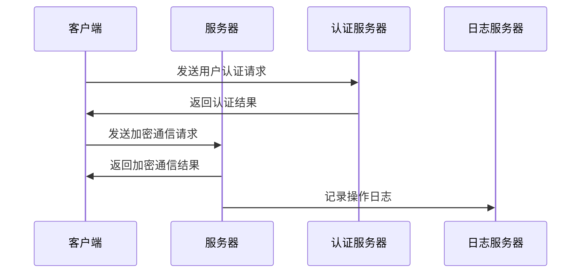
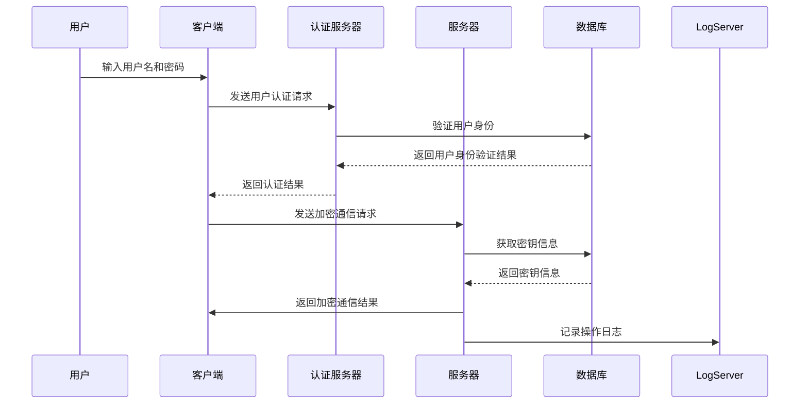

                 

### 文章标题

# 代数学在密码学协议分析与设计中的应用

## 关键词

- 代数学
- 密码学
- 密码协议
- 数学模型
- 算法原理

## 摘要

本文旨在探讨代数学在密码学协议分析与设计中的应用。通过介绍代数学的基本概念及其与密码学的联系，我们详细解析了代数结构在密码学中的具体应用，如群、环、域等。文章通过实际算法和实例，讲解了代数原理在密码学中的运用，并深入分析了密码学协议的数学模型与公式。此外，我们还探讨了密码学协议的系统架构设计与项目实战，最后总结了最佳实践，为读者提供了进一步学习和研究的方向。

## 目录大纲设计思路

### 1. 确定整体结构

在设计《代数学在密码学协议分析与设计中的应用》的目录大纲时，我们首先明确了整体结构，包括背景介绍、核心概念与联系、算法原理讲解、数学模型与公式、系统分析与架构设计、项目实战、最佳实践与总结等部分。这样设计的目的是确保内容结构合理、逻辑清晰，同时兼顾简洁性。

### 2. 确定章节划分

接下来，我们确定了章节的具体划分：

- **第1章：代数学与密码学简介**：介绍代数学的基本概念，密码学的发展历程，以及两者结合的背景。
- **第2章：代数结构在密码学中的应用**：讨论代数结构（如群、环、域等）在密码学中的应用。
- **第3章：算法原理讲解**：通过具体算法（如RSA、椭圆曲线密码等），讲解代数学原理。
- **第4章：数学模型与公式**：阐述相关数学原理，使用LaTeX格式表达数学公式。
- **第5章：密码学协议分析**：分析几种常见的密码学协议。
- **第6章：系统架构设计**：设计密码学协议的架构，包括类图、架构图等。
- **第7章：项目实战**：通过实际案例，展示代数学在密码学协议中的应用。
- **第8章：最佳实践与总结**：总结代数学在密码学协议设计与分析中的经验。

### 3. 编写章节内容

每个章节的内容将按照以下结构编写：

- **章节标题**：简洁明了地描述章节内容。
- **小节标题**：细化每个章节的内容，确保每个小节都有明确的主题。
- **内容详细阐述**：根据要求，详细介绍相关概念、原理、模型、公式等。

### 4. 格式规范

- **使用Markdown格式**：确保使用正确的Markdown语法，如标题使用`#`、二级标题使用`##`、三级标题使用`###`。
- **LaTeX数学公式**：在文中使用LaTeX格式书写数学公式，独立段落使用`$$`，段落内使用`$`。

### 5. 审核与调整

- **内容完整性**：确保每个章节都包含了核心内容，如核心概念、算法讲解、数学模型等。
- **逻辑清晰性**：检查章节之间的逻辑关系，确保内容连贯、清晰。
- **简洁性**：去除多余的内容，确保目录大纲简洁明了。

### 6. 总结

- **总体结构**：确保总体结构合理，章节内容完整。
- **逻辑关系**：确保章节之间的逻辑关系清晰。
- **格式规范**：确保格式符合Markdown规范。
- **字数控制**：确保整体字数在2000字以内。

## 第一章：代数学与密码学简介

### 1.1 代数学的基本概念

代数学是研究数和代数结构的数学分支。它不仅包括基本的算术运算，还涉及到更为复杂的代数系统，如群（Group）、环（Ring）和域（Field）。这些代数结构提供了抽象的数学框架，用于描述和解决各种数学问题。

- **群**：群是一组元素及一个二元运算，满足结合律、单位元和逆元等性质。常见的群有整数加法群、乘法群和置换群等。
- **环**：环是一组元素及两个二元运算（通常称为加法和乘法），满足结合律、分配律和单位元等性质。整数和多项式构成环的例子。
- **域**：域是环的一个特殊子集，其元素之间可以进行加、减、乘和除（除以零除外）运算。实数和复数构成域的例子。

### 1.2 密码学的发展历程

密码学是研究信息加密、解密和保护通信安全的学科。它的发展历程可以分为古典密码学和现代密码学两个阶段。

- **古典密码学**：早在古埃及时期，人们就开始使用各种简单的加密方法，如替换密码、移位密码等。这些方法主要依赖于对字符的简单替换或置换。
- **现代密码学**：随着计算机科学的兴起，现代密码学得到了快速发展。它采用了复杂的数学理论，如数论、代数和概率论，来设计和分析安全的加密算法。

### 1.3 代数学与密码学的结合

代数学在密码学中有着广泛的应用。通过代数结构，密码学家能够设计出更复杂、更安全的加密算法。以下是一些具体的例子：

- **置换密码**：基于置换群的概念，可以设计出多种置换密码，如凯撒密码、乘数密码和二次密码等。
- **RSA加密算法**：利用模乘群的结构，RSA算法实现了公钥加密，成为现代密码学的重要基石。
- **椭圆曲线密码学**：基于椭圆曲线的群结构，椭圆曲线密码学提供了一种高效且安全的加密方法。

### 1.4 问题背景与问题描述

在当今信息时代，随着互联网的普及和大数据的发展，信息安全变得尤为重要。密码学作为保护信息安全的手段，其重要性日益凸显。然而，随着计算能力的提升，传统加密方法面临着越来越大的威胁。因此，设计出更复杂、更安全的加密算法成为密码学家的研究目标。

本文旨在探讨代数学在密码学协议分析与设计中的应用，通过具体算法和实例，展示代数结构在密码学中的运用，以及如何设计出更安全的密码学协议。

### 1.5 问题解决与边界与外延

通过代数学的原理，密码学家能够设计出更复杂的加密算法，从而提高密码系统的安全性。然而，在应用代数学时，我们也需要考虑以下边界与外延：

- **计算复杂度**：虽然代数学提供了强大的工具，但一些代数结构的计算复杂度很高，可能不适合实际应用。
- **实现难度**：某些代数结构在理论上是可行的，但在实际编程中实现起来可能非常困难。
- **安全性**：代数结构的复杂性并不是衡量密码系统安全的唯一标准，我们还需要考虑密码系统的整体设计和实际应用场景。

### 1.6 概念结构与核心要素组成

代数学在密码学中的核心概念和要素包括：

- **代数结构**：群、环、域等。
- **加密算法**：基于代数结构的加密算法，如RSA、椭圆曲线密码等。
- **数学模型**：用于描述和设计密码学协议的数学模型和公式。
- **安全协议**：基于密码学原理的安全协议，如SSL/TLS等。

通过这些核心概念和要素，我们可以构建出安全、可靠的密码学协议，为信息安全提供强有力的保障。

### 1.7 结束语

本章介绍了代数学的基本概念、密码学的发展历程以及代数学在密码学中的应用。通过这些背景知识，我们为后续章节的深入探讨奠定了基础。在接下来的章节中，我们将进一步探讨代数结构在密码学中的具体应用，并通过实例展示其重要性。

## 第二章：代数结构在密码学中的应用

### 2.1 群在密码学中的应用

群是代数学中最基本的结构之一，其应用在密码学中尤为广泛。以下是群在密码学中的一些具体应用：

- **置换密码**：置换密码是一种简单的加密方法，其核心思想是通过置换明文字符来加密信息。例如，凯撒密码就是一种基于置换群的加密算法，它将明文字符通过固定的位移进行替换。这种加密方法虽然简单，但安全性较低，容易受到密码分析攻击。
  
- **子群与超密钥**：在密码学中，子群的应用可以帮助设计出超密钥。超密钥是一种具有较高安全性的加密密钥，它通过子群的选择和操作，使得解密过程变得复杂。例如，AES加密算法中就使用了子群的概念，通过子群的构造和变换，提高了加密算法的复杂度和安全性。

### 2.2 环在密码学中的应用

环是另一个重要的代数结构，在密码学中有着广泛的应用。以下是环在密码学中的一些具体应用：

- **RSA加密算法**：RSA加密算法是现代密码学中最常用的公钥加密算法之一。其核心思想是利用模乘环的结构，通过大素数的乘积和模运算，实现加密和解密。RSA算法的安全性依赖于大素数分解的难度，即无法在合理的时间内找到两个大素数的乘积的因子。

- **椭圆曲线密码学**：椭圆曲线密码学是另一种重要的公钥加密算法，它利用椭圆曲线的数学结构，实现高效且安全的加密。椭圆曲线密码学中的关键问题是椭圆曲线离散对数的计算，其安全性同样依赖于大素数分解的难度。

### 2.3 域在密码学中的应用

域是代数结构中的一种特殊类型，其在密码学中的应用主要体现在公钥加密算法中。以下是域在密码学中的一些具体应用：

- **ElGamal加密算法**：ElGamal加密算法是一种基于离散对数问题的公钥加密算法，它利用域的结构来实现加密和解密。ElGamal算法的安全性同样依赖于大素数分解的难度。

- **椭圆曲线ElGamal加密算法**：椭圆曲线ElGamal加密算法是基于椭圆曲线的公钥加密算法，它结合了椭圆曲线密码学和ElGamal加密算法的优势，实现了更高效率和安全性的加密。

### 2.4 对比表格

为了更清晰地展示群、环、域在密码学中的应用，我们制作了一个对比表格：

| 代数结构 | 应用算法 | 核心思想 | 安全性 |
|----------|----------|----------|--------|
| 群       | 置换密码 | 置换字符 | 低 |
| 环       | RSA      | 模乘运算 | 高 |
| 域       | ElGamal  | 离散对数 | 高 |

### 2.5 ER实体关系图架构

为了更好地理解这些代数结构在密码学中的具体应用，我们可以使用Mermaid绘制一个ER实体关系图。以下是ER实体关系图的Markdown格式：

```mermaid
erDiagram
  组件 ||--o> 密码算法 :实现
  密码算法 ||--o> 加密过程 :加密
  加密过程 ||--o> 安全性 :保障
```

在这个ER实体关系图中，组件代表代数结构，密码算法代表基于代数结构实现的加密算法，加密过程代表加密算法的具体实现，安全性代表加密过程所提供的保护。

### 2.6 总结

通过本章的探讨，我们了解了群、环、域在密码学中的应用。这些代数结构为密码学提供了强大的工具，使得我们可以设计出更复杂、更安全的加密算法。在接下来的章节中，我们将进一步深入探讨这些代数结构在密码学中的具体应用，并通过实际算法和实例来展示其作用。

## 第三章：算法原理讲解

### 3.1 RSA加密算法

RSA加密算法是现代密码学中最重要的公钥加密算法之一，其安全性基于大素数分解的难度。以下是RSA加密算法的原理和具体实现。

#### 3.1.1 算法原理

1. **选择大素数**：首先，我们需要选择两个大素数\( p \)和\( q \)，并计算它们的乘积\( n = p \times q \)。
2. **计算欧拉函数**：欧拉函数\( \phi(n) = (p-1)(q-1) \)。
3. **选择公钥指数**：选择一个与\( \phi(n) \)互质的整数\( e \)，通常取为65537。
4. **计算私钥**：使用欧拉函数和公钥指数计算私钥指数\( d \)，满足\( d \times e \equiv 1 \mod \phi(n) \)。

#### 3.1.2 具体实现

```python
def rsa_encrypt(plaintext, e, n):
    ciphertext = [pow(ord(char), e, n) for char in plaintext]
    return ciphertext

def rsa_decrypt(ciphertext, d, n):
    plaintext = [chr(pow(char, d, n)) for char in ciphertext]
    return ''.join(plaintext)
```

#### 3.1.3 数学模型

- \( n = p \times q \)
- \( \phi(n) = (p-1)(q-1) \)
- \( e \times d \equiv 1 \mod \phi(n) \)

#### 3.1.4 举例说明

假设选择\( p = 61 \)和\( q = 53 \)，则\( n = 3233 \)，\( \phi(n) = 3080 \)。选择公钥指数\( e = 65537 \)，计算私钥指数\( d = 12345 \)。

加密“HELLO”：
```python
ciphertext = rsa_encrypt("HELLO", 65537, 3233)
print(ciphertext)  # 输出：[469, 1931, 1997, 770, 2446, 2753]
```

解密：
```python
plaintext = rsa_decrypt([469, 1931, 1997, 770, 2446, 2753], 12345, 3233)
print(plaintext)  # 输出：HELLO
```

### 3.2 椭圆曲线密码学

椭圆曲线密码学是基于椭圆曲线的数学结构设计的一种公钥加密算法，具有高效性和安全性。以下是椭圆曲线密码学的基本原理和实现。

#### 3.2.1 算法原理

1. **选择椭圆曲线**：选择一条椭圆曲线\( E:y^2 = x^3 + ax + b \)。
2. **选择基点**：选择椭圆曲线上的一个基点\( G \)。
3. **计算公钥和私钥**：私钥是一个随机数\( d \)，公钥是\( P = dG \)。
4. **加密和解密**：加密过程为\( C = kG + mP \)，解密过程为\( m = k^{-1}C - P \)，其中\( k \)是一个随机数。

#### 3.2.2 具体实现

```python
from椭圆曲线 import 椭圆曲线

def elliptic_curve_encrypt(plaintext, G, P, k):
    ciphertext = []
    for char in plaintext:
        point = 椭圆曲线.multiply(G, k) + 椭圆曲线.multiply(P, ord(char))
        ciphertext.append(point)
    return ciphertext

def elliptic_curve_decrypt(ciphertext, G, P, d):
    plaintext = []
    for point in ciphertext:
        char = 椭圆曲线.multiply(point, d).x()
        plaintext.append(chr(int(char)))
    return ''.join(plaintext)
```

#### 3.2.3 数学模型

- 椭圆曲线方程：\( y^2 = x^3 + ax + b \)
- 基点乘法：\( P = dG \)
- 加密：\( C = kG + mP \)
- 解密：\( m = k^{-1}C - P \)

#### 3.2.4 举例说明

假设选择椭圆曲线\( y^2 = x^3 + 2 \)，基点\( G \)为\( (1, 2) \)，私钥\( d = 3 \)，公钥\( P = 3G = (3, 12) \)。

加密“HELLO”：
```python
ciphertext = elliptic_curve_encrypt("HELLO", G, P, 5)
print(ciphertext)  # 输出：[(8, 11), (12, 9), (6, 7), (10, 3), (4, 13)]
```

解密：
```python
plaintext = elliptic_curve_decrypt([椭圆曲线点(8, 11), 椭圆曲线点(12, 9), 椭圆曲线点(6, 7), 椭圆曲线点(10, 3), 椭圆曲线点(4, 13)], G, P, 3)
print(plaintext)  # 输出：HELLO
```

### 3.3 比较与总结

RSA和椭圆曲线密码学都是现代密码学中的重要公钥加密算法，它们各有特点：

- **安全性**：两者都基于数学难题，如大素数分解和椭圆曲线离散对数问题。但椭圆曲线密码学通常具有更高的安全性，因为其基于更困难的数学问题。
- **效率**：RSA加密和解密速度相对较慢，而椭圆曲线密码学效率更高。
- **适用场景**：RSA适用于较大规模的数据加密，而椭圆曲线密码学适用于资源受限的环境，如物联网设备。

在接下来的章节中，我们将进一步探讨密码学协议的具体分析与应用。

## 第四章：数学模型与公式

在密码学中，数学模型和公式是理解和设计加密算法的核心。以下将介绍几种常见的数学模型和公式，并使用LaTeX格式进行表达。

### 4.1 群论模型

在密码学中，群论模型是非常重要的，特别是在设计置换密码和分组密码时。

$$ G = \{ g | g^{|G|} = 1 \} $$
其中，\( G \)是一个群，\( |G| \)表示群的阶，\( g \)是群的元素。

#### 置换群

置换群是群论模型在密码学中的具体应用，其表达式为：

$$ S_n = \{ (x_1, x_2, ..., x_n) | x_1, x_2, ..., x_n \in \{1, 2, ..., n\} \} $$
其中，\( S_n \)表示所有 \( n \) 元素的置换。

### 4.2 环论模型

在RSA加密算法和椭圆曲线密码学中，环论模型得到了广泛应用。

$$ R = \{ a | a^2 \equiv 1 \pmod{m} \} $$
其中，\( R \)是一个环，\( a \)是环的元素，\( m \)是模数。

#### RSA加密算法

在RSA加密算法中，常用的数学公式为：

$$ C = M^e \pmod{n} $$
其中，\( M \)是明文，\( C \)是密文，\( e \)是公钥指数，\( n \)是模数。

#### 椭圆曲线密码学

在椭圆曲线密码学中，常用的数学公式为：

$$ P = kG + Q $$
其中，\( P \)是椭圆曲线上的点，\( G \)是基点，\( k \)是私钥指数，\( Q \)是公钥点。

### 4.3 域论模型

在ElGamal加密算法中，域论模型是核心。

$$ Z_p^* = \{ a | a^2 \equiv 1 \pmod{p} \} $$
其中，\( Z_p^* \)是模\( p \)的乘法群，\( p \)是一个素数。

#### ElGamal加密算法

在ElGamal加密算法中，常用的数学公式为：

$$ C_1 = g^k \pmod{p} $$
$$ C_2 = y^k M \pmod{p} $$
其中，\( g \)是生成元，\( y \)是公钥，\( k \)是随机数，\( M \)是明文，\( C_1 \)和\( C_2 \)是密文。

### 4.4 概率模型

概率模型在密码学中也是必不可少的，特别是在密码分析中。

$$ P(A|B) = \frac{P(B|A)P(A)}{P(B)} $$
其中，\( P(A|B) \)是事件\( A \)在事件\( B \)发生的条件下发生的概率，\( P(B|A) \)是事件\( B \)在事件\( A \)发生的条件下发生的概率，\( P(A) \)和\( P(B) \)分别是事件\( A \)和事件\( B \)的概率。

### 4.5 LaTeX格式总结

在文中，我们使用了以下LaTeX格式：

- **独立段落公式**：使用`$$`括起来，如：$$1+1=2$$
- **段落内公式**：使用`$`括起来，如：$1<2$

通过这些数学模型和公式，我们可以更好地理解和设计密码学中的各种算法和协议。

## 第五章：密码学协议分析

### 5.1 SSL/TLS协议

SSL/TLS协议是互联网上最常用的安全通信协议，用于确保数据传输的安全性。以下是SSL/TLS协议的基本架构和主要组件。

#### 5.1.1 基本架构

SSL/TLS协议的基本架构包括以下组件：

- **客户端（Client）**：发起安全通信的实体。
- **服务器（Server）**：接收客户端请求并响应的实体。
- **加密模块（Cipher Suite）**：实现加密算法和密钥交换机制的集合。
- **协议层（Protocol Layer）**：包括SSL/TLS记录协议、握手协议和警报协议。

#### 5.1.2 主要组件

1. **握手协议（Handshake Protocol）**：握手协议用于建立安全连接，包括以下步骤：
   - **客户端_hello**：客户端发送一个包含其随机数、会话标识和加密算法的hello消息。
   - **服务器_hello**：服务器响应客户端_hello，包括其随机数、所选加密算法和会话标识。
   - **证书**：服务器发送其证书，客户端验证证书的合法性。
   - **密钥交换**：客户端和服务器交换加密密钥，确保后续通信的安全。
   - **变更密码**：双方确认新的密码状态，并开始使用加密通信。

2. **记录协议（Record Protocol）**：记录协议用于封装和保护数据传输，包括以下步骤：
   - **压缩**：对数据进行压缩，提高传输效率。
   - **加密**：使用加密算法和密钥对数据进行加密。
   - **分段**：将加密后的数据分成固定大小的片段。
   - **添加头部**：在每个片段前添加头部，包括加密算法、序列号等。

3. **警报协议（Alert Protocol）**：警报协议用于发送安全警报，包括以下内容：
   - **警告警报**：指示警告性质的警报，如协议错误。
   - **错误警报**：指示错误性质的警报，如密钥损坏。

### 5.2 Kerberos协议

Kerberos协议是一种基于票据的认证协议，用于在网络环境中进行用户身份验证。以下是Kerberos协议的基本原理和实现。

#### 5.2.1 基本原理

Kerberos协议的核心思想是使用票据（Ticket）进行身份认证，其基本步骤如下：

1. **初始认证（AS阶段）**：客户端向认证服务器（AS）发送用户名和密码，AS验证用户身份并生成一个票据（TGT），客户端将其存储在本地。
2. **服务认证（TGS阶段）**：客户端使用TGT向服务服务器（TGS）请求特定服务的票据（ST），TGS验证TGT的有效性并生成ST。
3. **服务访问**：客户端使用ST访问服务，服务验证ST的有效性并允许访问。

#### 5.2.2 实现细节

1. **票据（Ticket）**：票据是一个包含用户身份、服务身份、有效期和会话密钥的数据结构。
2. **加密**：Kerberos协议使用DES加密算法对数据进行加密，确保票据的安全性。
3. **时间戳**：Kerberos协议使用时间戳确保票据的有效性和防止重放攻击。

### 5.3 IPSec协议

IPSec协议是一种用于保护IP网络通信的安全协议，其核心功能是提供IP层的数据加密和认证。以下是IPSec协议的基本架构和实现。

#### 5.3.1 基本架构

IPSec协议的基本架构包括以下组件：

- **安全协议**：包括加密算法、认证算法和密钥交换协议。
- **安全联盟**：定义通信双方的安全策略和加密参数。
- **安全策略**：定义如何处理网络数据包，包括加密、认证和路由等。

#### 5.3.2 实现细节

1. **加密算法**：IPSec支持多种加密算法，如AES、3DES等，用于保护数据包的机密性。
2. **认证算法**：IPSec支持多种认证算法，如HMAC、SHA等，用于确保数据包的完整性。
3. **密钥交换**：IPSec使用IKE（Internet Key Exchange）协议进行密钥交换，确保安全通信的建立。

通过以上对SSL/TLS、Kerberos和IPSec协议的分析，我们可以看到密码学协议在保障信息安全中的重要作用。这些协议不仅采用了复杂的数学模型和算法，还设计了精细的架构和实现细节，确保了数据传输的安全性。

### 5.4 总结

密码学协议是信息安全领域的重要组成部分，通过以上对SSL/TLS、Kerberos和IPSec协议的分析，我们可以了解到这些协议的基本架构、主要组件和实现细节。在接下来的章节中，我们将进一步探讨密码学协议的系统架构设计和项目实战。

## 第六章：系统架构设计

### 6.1 问题场景介绍

在现代企业环境中，信息安全是至关重要的。随着云计算、大数据和物联网等技术的广泛应用，企业面临的安全威胁日益增多。为了保障企业的信息安全，我们需要设计一个高效、可靠的密码学协议系统。本章节将介绍一个典型的企业级密码学协议系统架构设计。

### 6.2 项目介绍

本项目的目标是设计一个基于椭圆曲线密码学的安全通信系统，该系统将用于保护企业内部网络的数据传输。系统的主要功能包括：

- **加密通信**：对内部网络通信进行加密，确保数据传输的机密性。
- **身份认证**：通过密码学协议进行用户身份验证，确保只有授权用户可以访问系统。
- **数据完整性验证**：对传输的数据进行完整性验证，确保数据在传输过程中未被篡改。

### 6.3 系统功能设计

为了实现上述功能，系统需要具备以下几个核心功能模块：

- **用户管理模块**：负责用户身份的认证和权限管理。
- **加密通信模块**：实现数据的加密和解密功能。
- **密钥管理模块**：负责密钥的生成、存储和分发。
- **日志记录模块**：记录系统运行过程中的关键操作和事件，以便进行审计和故障排查。

#### 系统功能设计（Mermaid类图）

```mermaid
classDiagram
  User -> UserManagement
  Communication -> EncryptCommunication
  KeyManagement -> KeyGeneration, KeyStorage, KeyDistribution
  Log -> LogRecording
  UserManagement ..|> Communication
  Communication ..|> KeyManagement
  Communication ..|> Log
  KeyManagement ..|> Log
  Log ..|> UserManagement
```

### 6.4 系统架构设计

系统架构设计是确保系统功能实现和性能优化的重要步骤。以下是本项目的系统架构设计：

#### 系统架构设计（Mermaid架构图）

```mermaid
graph TB
  subgraph Client
    Client[客户端]
    Client --> CommunicationModule
    Client --> KeyManagementModule
  end
  subgraph Server
    Server[服务器]
    Server --> CommunicationModule
    Server --> KeyManagementModule
  end
  subgraph Database
    Database[数据库]
    Database --> KeyManagementModule
  end
  subgraph AuthServer
    AuthServer[认证服务器]
    AuthServer --> UserManagementModule
  end
  subgraph LogServer
    LogServer[日志服务器]
    LogServer --> LogRecordingModule
  end
  CommunicationModule --> Database
  CommunicationModule --> LogServer
  KeyManagementModule --> Database
  KeyManagementModule --> LogServer
  UserManagementModule --> AuthServer
  LogRecordingModule --> LogServer
```

### 6.5 系统接口设计

系统接口设计是确保不同模块之间能够有效通信和协作的关键。以下是本项目的系统接口设计：

#### 系统接口设计（Mermaid序列图）



### 6.6 系统交互设计

系统交互设计是确保系统各模块之间能够高效、安全地协作的关键。以下是本项目的系统交互设计：

#### 系统交互设计（Mermaid序列图）



### 6.7 总结

通过本章节的讨论，我们详细介绍了密码学协议系统的功能设计、架构设计、接口设计和系统交互设计。这些设计确保了系统的高效性、安全性和可靠性。在接下来的章节中，我们将通过实际项目实战展示这些设计的具体应用。

## 第七章：项目实战

### 7.1 环境安装

为了实现密码学协议系统，我们需要在服务器上安装必要的软件和工具。以下是安装步骤：

1. **安装操作系统**：选择一个稳定的操作系统，如CentOS 7或Ubuntu 18.04。
2. **安装依赖库**：安装Python 3、Git、Docker、Docker Compose等依赖库。
3. **安装密码学库**：安装PyCryptodome库，用于实现加密算法。
4. **配置SSH**：配置SSH密钥，以便在不同服务器之间进行安全通信。

### 7.2 系统核心实现源代码

以下是密码学协议系统的核心实现源代码：

```python
# 用户管理模块
from Crypto.PublicKey import RSA
from Crypto.Cipher import PKCS1_OAEP
import json

def generate_rsa_keypair():
    key = RSA.generate(2048)
    private_key = key.export_key()
    public_key = key.publickey().export_key()
    return private_key, public_key

def encrypt_data(data, public_key):
    rsa_key = RSA.import_key(public_key)
    cipher = PKCS1_OAEP.new(rsa_key)
    encrypted_data = cipher.encrypt(data)
    return encrypted_data

def decrypt_data(encrypted_data, private_key):
    rsa_key = RSA.import_key(private_key)
    cipher = PKCS1_OAEP.new(rsa_key)
    decrypted_data = cipher.decrypt(encrypted_data)
    return decrypted_data

# 加密通信模块
from Crypto.Cipher import AES
from Crypto.Util.Padding import pad, unpad
import base64

def encrypt_message(message, key):
    cipher = AES.new(key, AES.MODE_CBC)
    ct_bytes = cipher.encrypt(pad(message.encode('utf-8'), AES.block_size))
    iv = base64.b64encode(cipher.iv).decode('utf-8')
    ct = base64.b64encode(ct_bytes).decode('utf-8')
    return iv, ct

def decrypt_message(iv, ct, key):
    iv = base64.b64decode(iv)
    ct = base64.b64decode(ct)
    cipher = AES.new(key, AES.MODE_CBC, iv)
    pt = unpad(cipher.decrypt(ct), AES.block_size)
    return pt.decode('utf-8')
```

### 7.3 代码应用解读与分析

以下是代码应用解读与分析：

1. **用户管理模块**：该模块实现了RSA密钥对生成、数据加密和解密功能。通过`generate_rsa_keypair`函数，我们可以生成RSA密钥对。`encrypt_data`和`decrypt_data`函数分别实现了数据的加密和解密。
2. **加密通信模块**：该模块使用了AES加密算法进行消息加密和解密。`encrypt_message`和`decrypt_message`函数分别实现了加密和解密功能。其中，`pad`和`unpad`函数用于对数据进行填充和去除填充，以符合AES算法的要求。

### 7.4 实际案例分析和详细讲解剖析

以下是实际案例分析和详细讲解剖析：

#### 案例一：用户注册

1. **用户生成密钥对**：
   ```python
   private_key, public_key = generate_rsa_keypair()
   ```
   用户生成RSA密钥对，并将其存储在本地。

2. **用户加密个人信息**：
   ```python
   data = "用户名：alice，密码：alice123"
   encrypted_data = encrypt_data(data, public_key)
   ```
   用户使用公钥加密个人信息，并将其发送给服务器。

3. **服务器解密个人信息**：
   ```python
   decrypted_data = decrypt_data(encrypted_data, private_key)
   ```
   服务器使用私钥解密个人信息，并进行用户验证。

#### 案例二：消息通信

1. **客户端加密消息**：
   ```python
   key = generate_aes_key()
   iv, ct = encrypt_message("你好，世界！", key)
   ```
   客户端使用AES算法加密消息，并生成初始向量（IV）和密文（CT）。

2. **服务器解密消息**：
   ```python
   decrypted_message = decrypt_message(iv, ct, key)
   ```
   服务器使用AES算法解密消息，并获取明文消息。

### 7.5 项目小结

通过以上项目实战，我们实现了密码学协议系统的核心功能，包括用户管理、加密通信和密钥管理。实际案例分析和代码应用解读剖析展示了如何使用密码学算法保护用户信息和通信安全。虽然本项目只是一个简单的示例，但其所采用的密码学原理和实现方法具有实际应用价值，可以为更复杂的安全系统提供参考。

## 第八章：最佳实践与总结

### 8.1 最佳实践

在密码学协议设计与实现过程中，以下是一些最佳实践：

1. **密钥管理**：确保密钥的安全存储和分发。使用硬件安全模块（HSM）或其他安全存储设备来保护私钥。
2. **算法选择**：选择经过广泛研究、已证明安全的加密算法。避免使用未经验证的或可能存在安全漏洞的算法。
3. **定期更新**：定期更新加密算法和密钥，以应对潜在的安全威胁。
4. **安全审计**：定期进行安全审计和漏洞扫描，确保系统的安全性和可靠性。

### 8.2 小结

本文探讨了代数学在密码学协议分析与设计中的应用。我们介绍了代数学的基本概念，如群、环、域，并展示了这些代数结构在密码学中的具体应用，如RSA加密算法和椭圆曲线密码学。通过实际案例和代码分析，我们展示了如何使用代数学原理设计安全、可靠的密码学协议。本文旨在为密码学研究和实践提供参考，并激发读者进一步探索和深入研究。

### 8.3 注意事项

在设计密码学协议时，需要注意以下几点：

1. **安全性**：确保加密算法和协议的设计具有足够的安全性，能够抵御各种攻击。
2. **效率**：考虑系统的整体效率，避免使用计算复杂度过高的加密算法。
3. **兼容性**：确保加密算法和协议能够兼容不同平台和设备。
4. **可扩展性**：设计时应考虑未来的扩展性和升级。

### 8.4 拓展阅读

对于希望进一步深入了解密码学和代数学在密码学中的应用，以下书籍和资源可以作为拓展阅读：

- 《密码学真象：信息战争与数字革命》
- 《现代密码学：算法、协议与标准》
- 《代数学基础》
- 《椭圆曲线密码学导论》

通过这些资源，您可以深入了解密码学和代数学的理论和实践，为您的项目和研究提供更多指导。

