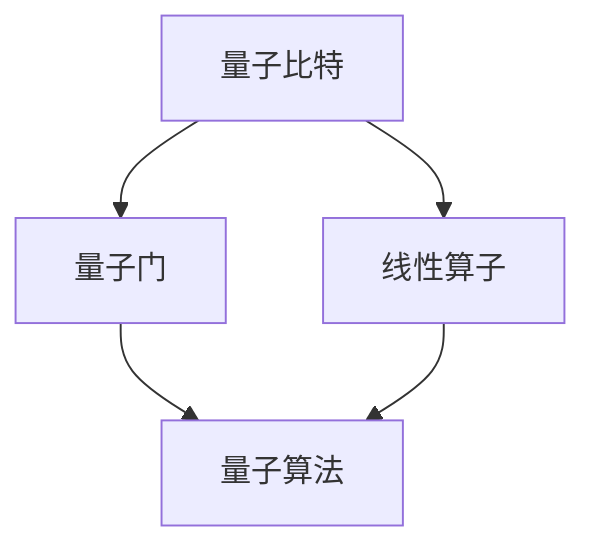

                 

### 第一部分：引言

#### 1.1 代数学在量子算法设计中的应用

**问题背景**：量子计算是一种基于量子力学原理的全新计算范式，它通过量子比特（qubit）的叠加态和纠缠态来实现计算任务。与传统基于经典逻辑门（如AND、OR、NOT等）的经典计算不同，量子计算引入了量子门（quantum gate）这一概念，使得量子算法能够超越经典算法在特定问题上的性能。代数学在量子计算中扮演着核心角色，尤其是量子算法设计过程中，代数结构和方法论为量子算法的创新和优化提供了强有力的工具。

**问题描述**：本文旨在探讨代数学在量子算法设计中的应用。具体来说，我们将从量子比特与经典比特的对比出发，深入分析代数学在量子算法中的作用，并通过具体的量子算法案例来阐述代数原理在量子计算中的实际应用。

**问题解决**：我们将通过以下几个步骤来展开讨论：
1. **背景介绍**：介绍量子计算的基本概念、历史发展及现状，以及代数学在量子计算中的作用及重要性。
2. **核心概念与联系**：对比量子比特与经典比特的属性特征，并通过量子算法的ER实体关系图架构，展示量子比特、量子门和量子算法之间的联系。
3. **量子算法设计的基本原理**：讲解量子随机化算法和量子相位估计算法的原理，并给出相应的Python源代码示例。
4. **应用案例分析与讲解**：以Shor算法为例，分析其在整数分解中的应用，并详细讲解其工作原理。

**边界与外延**：量子计算与经典计算的区别在于量子比特的叠加态和纠缠态特性，这使得量子算法能够解决经典算法难以解决的问题。然而，量子计算也面临着技术挑战，如量子态的脆弱性、量子退相干和量子误差校正等问题。代数学为解决这些挑战提供了潜在的方法，如量子纠错码和量子门的设计等。

**问题解决**：通过介绍量子计算的基本概念、历史发展、现状及代数学在其中的作用，本文旨在提供一个全面而深入的视角，帮助读者理解代数学在量子算法设计中的重要性。通过具体的量子算法案例，本文展示了代数原理在量子计算中的应用，并探讨了量子计算与经典计算的区别和联系。

---

### 1.2 核心概念与联系

**量子比特与经典比特的对比**

在量子计算中，量子比特（qubit）与经典比特（classical bit）有着本质的区别。以下是一个对比表格，展示了量子比特和经典比特在状态表示、并行性和量子门等方面的特性。

| 特征 | 量子比特 | 经典比特 |
| ---- | -------- | -------- |
| 状态表示 | $|q\rangle$ | 0或1 |
| 并行性 | 超叠加态 | 单一状态 |
| 量子门 | 量子运算 | 线性运算 |

**概念属性特征对比表格**

首先，量子比特可以同时处于0和1的叠加态，这被称为超叠加态。而经典比特只能处于0或1的单一状态。这种叠加态特性使得量子比特可以在一次计算中同时处理多种可能性，从而实现并行计算。

其次，量子比特之间的纠缠态也是量子计算的关键特性。两个量子比特的纠缠状态无法单独描述，它们的状态是相互关联的。这种纠缠态允许量子算法在特定问题上表现出超乎经典计算的强大能力。

**基本量子算法与代数原理**

为了更好地理解量子比特和量子算法之间的关系，我们可以通过ER实体关系图来展示它们之间的联系。以下是一个简单的ER实体关系图架构：



在这个架构中，量子比特（A）通过量子门（B）作用于线性算子（D），进而形成量子算法（C）。量子比特是量子计算的基本单元，量子门用于操作量子比特，线性算子则是量子算法实现的核心数学工具。

**量子随机化算法**

量子随机化算法是一种基于量子比特和量子门的简单量子算法。以下是一个量子随机化算法的原理讲解：

1. **初始化量子状态**：首先，我们需要初始化一个量子状态。例如，我们可以使用Hadamard门将一个量子比特初始化为叠加态。
   
   ```mermaid
   graph TD
   A[输入] --> B[初始化量子状态]
   B --> C{随机选择量子门}
   C -->|执行| D[量子门操作]
   D --> E[测量]
   E --> F[输出]
   ```

2. **随机选择量子门**：在量子随机化算法中，我们随机选择一个量子门对量子比特进行操作。这个操作可以是任意一个单位ary量子门，如Pauli X门、Pauli Z门或Hadamard门等。

3. **执行量子门操作**：选择量子门后，我们将其应用到量子比特上，从而改变量子比特的状态。

4. **测量**：最后，我们测量量子比特，得到一个随机的结果。

5. **输出**：根据测量结果，我们可以得到一个输出。这个输出可以是0或1，具体取决于量子比特的状态。

以下是一个Python源代码示例，展示了如何实现量子随机化算法：

```python
# Example of a quantum randomization algorithm
from qiskit import QuantumCircuit, execute, Aer

# Initialize quantum circuit
qc = QuantumCircuit(2)

# Hadamard gate to create superposition
qc.h(0)

# Execute the circuit using a simulator
simulator = Aer.get_backend('qasm_simulator')
result = execute(qc, simulator).result()

# Get the counts
counts = result.get_counts(qc)
print(counts)
```

**量子相位估计算法**

量子相位估计算法是另一种重要的量子算法。它利用量子叠加态和测量技术来估计一个复数相位。以下是一个量子相位估计算法的原理讲解：

1. **初始化量子状态**：首先，我们需要初始化一个量子状态。例如，我们可以使用Hadamard门将一个量子比特初始化为叠加态。

   ```mermaid
   graph TD
   A[输入] --> B[初始化量子状态]
   B --> C[执行量子相位估计]
   C --> D[测量]
   D --> E[输出相位估计值]
   ```

2. **执行量子相位估计**：在量子相位估计算法中，我们需要将一个特定的量子相位应用到量子比特上。例如，我们可以使用控制-Z门（CZ门）来实现这个操作。

3. **测量**：接下来，我们测量量子比特，得到一个相位估计值。

4. **输出相位估计值**：根据测量结果，我们可以得到一个相位估计值。这个估计值可以是任意实数，取决于量子比特的状态。

以下是一个Python源代码示例，展示了如何实现量子相位估计算法：

```python
# Example of Quantum Phase Estimation algorithm
from qiskit import QuantumCircuit, execute, Aer

# Initialize quantum circuit
qc = QuantumCircuit(2)

# Prepare an initial state
qc.h(0)
qc.cx(0, 1)

# Phase estimation
qc.h(1)
for i in range(1):
    qc.cp(2 * pi / 3, 0, 1)

# Measure the second qubit
qc.measure(1, 0)

# Execute the circuit using a simulator
simulator = Aer.get_backend('qasm_simulator')
result = execute(qc, simulator).result()

# Get the counts
counts = result.get_counts(qc)
print(counts)
```

---

### 1.3 量子算法设计的基本原理

**量子随机化算法**

量子随机化算法是一种简单的量子算法，它通过量子叠加态和测量技术生成随机数。以下是量子随机化算法的基本原理：

1. **初始化量子状态**：首先，我们需要初始化一个量子状态。例如，我们可以使用Hadamard门将一个量子比特初始化为叠加态。

   ```mermaid
   graph TD
   A[输入] --> B[初始化量子状态]
   B --> C{随机选择量子门}
   C -->|执行| D[量子门操作]
   D --> E[测量]
   E --> F[输出]
   ```

2. **随机选择量子门**：在量子随机化算法中，我们随机选择一个量子门对量子比特进行操作。这个操作可以是任意一个单位ary量子门，如Pauli X门、Pauli Z门或Hadamard门等。

3. **执行量子门操作**：选择量子门后，我们将其应用到量子比特上，从而改变量子比特的状态。

4. **测量**：最后，我们测量量子比特，得到一个随机的结果。

5. **输出**：根据测量结果，我们可以得到一个输出。这个输出可以是0或1，具体取决于量子比特的状态。

以下是一个Python源代码示例，展示了如何实现量子随机化算法：

```python
# Example of a quantum randomization algorithm
from qiskit import QuantumCircuit, execute, Aer

# Initialize quantum circuit
qc = QuantumCircuit(2)

# Hadamard gate to create superposition
qc.h(0)

# Execute the circuit using a simulator
simulator = Aer.get_backend('qasm_simulator')
result = execute(qc, simulator).result()

# Get the counts
counts = result.get_counts(qc)
print(counts)
```

**量子相位估计算法**

量子相位估计算法是一种基于量子叠加态和测量技术的算法，用于估计一个复数相位。以下是量子相位估计算法的基本原理：

1. **初始化量子状态**：首先，我们需要初始化一个量子状态。例如，我们可以使用Hadamard门将一个量子比特初始化为叠加态。

   ```mermaid
   graph TD
   A[输入] --> B[初始化量子状态]
   B --> C[执行量子相位估计]
   C --> D[测量]
   D --> E[输出相位估计值]
   ```

2. **执行量子相位估计**：在量子相位估计算法中，我们需要将一个特定的量子相位应用到量子比特上。例如，我们可以使用控制-Z门（CZ门）来实现这个操作。

3. **测量**：接下来，我们测量量子比特，得到一个相位估计值。

4. **输出相位估计值**：根据测量结果，我们可以得到一个相位估计值。这个估计值可以是任意实数，取决于量子比特的状态。

以下是一个Python源代码示例，展示了如何实现量子相位估计算法：

```python
# Example of Quantum Phase Estimation algorithm
from qiskit import QuantumCircuit, execute, Aer

# Initialize quantum circuit
qc = QuantumCircuit(2)

# Prepare an initial state
qc.h(0)
qc.cx(0, 1)

# Phase estimation
qc.h(1)
for i in range(1):
    qc.cp(2 * pi / 3, 0, 1)

# Measure the second qubit
qc.measure(1, 0)

# Execute the circuit using a simulator
simulator = Aer.get_backend('qasm_simulator')
result = execute(qc, simulator).result()

# Get the counts
counts = result.get_counts(qc)
print(counts)
```

---

### 1.4 应用案例分析与讲解

**Shor算法**

Shor算法是量子计算领域的里程碑式算法，它利用量子计算的优势在多项式时间内解决了一个经典算法无法在合理时间内解决的问题——大整数的质因数分解。以下是Shor算法的案例描述和工作原理：

**案例描述**：给定一个大型整数N，Shor算法能够找到N的质因数。

**工作原理**：

1. **初始阶段**：选择一个整数a，其中1 < a < N，并计算a对N的模乘（a^N mod N）的结果。

2. **周期检测**：通过量子相位估计算法，Shor算法估计出a对N的模乘结果的周期T。具体来说，算法通过量子叠加态和测量技术，估计出T的平方根，从而找到a在模N下的周期。

3. **质因数分解**：一旦找到周期T，Shor算法可以使用辗转相除法（也称为欧几里得算法）来计算N的质因数。具体步骤如下：
   - 计算 T 的约数 d。
   - 如果 d 不等于1或N，则 d 是N的一个质因数。
   - 计算 N/d，如果 N/d 也是一个质数，则它也是N的一个质因数。

**示例解析**：假设我们要分解整数 N = 15，我们可以选择 a = 2。首先，计算 2^15 mod 15 的结果，得到 8。接下来，使用量子相位估计算法来估计 8 的周期。通过量子计算，我们估计出周期 T = 4。然后，计算 T 的约数 d，得到 d = 2。因为 d 不等于1或N，所以 2 是 15 的一个质因数。最后，计算 N/d，得到 7.5，这不是一个整数，所以我们需要进一步分解。通过计算 15/2，我们得到 7，这是一个质数，所以 7 也是 15 的一个质因数。

---

通过Shor算法的案例，我们可以看到量子算法如何利用量子计算的特性来解决经典算法难以处理的问题。Shor算法的成功不仅展示了量子计算在数学问题上的优势，也为量子计算机在密码学、材料科学和分子建模等领域带来了潜在的应用前景。然而，Shor算法的实现也面临着技术挑战，如量子纠错和误差校正等问题。解决这些问题将有助于推动量子计算的实际应用，并为未来的量子算法设计提供更多的可能性。

---

### 1.5 代数学在量子算法设计中的重要性

**代数学的概念与应用**：代数学是研究数和运算的抽象结构及其性质的一个数学分支。在量子算法设计中，代数学的概念和方法被广泛应用于量子比特的表示、量子门的实现以及量子算法的优化。量子比特的状态可以用复数向量来表示，量子门可以视为线性算子，而量子算法则是基于这些代数结构的运算序列。

**量子比特的代数表示**：量子比特的状态可以用复数向量来表示。例如，一个量子比特的状态可以表示为 |q⟩ = α|0⟩ + β|1⟩，其中 α 和 β 是复数系数，|0⟩ 和 |1⟩ 分别表示量子比特的基态。量子比特的叠加态和纠缠态可以通过复数向量之间的线性组合来表示。

**量子门的代数实现**：量子门是作用于量子比特的线性算子。例如，Hadamard门可以表示为 H = (1/√2) * |0⟩⟨0| + (1/√2) * |1⟩⟨1|，这是一个2x2的矩阵。量子门的设计和优化通常依赖于代数的理论和方法，如矩阵运算、特征值和特征向量分析等。

**量子算法的优化**：量子算法的优化往往涉及到代数结构的最优表示和计算。例如，Shor算法在质因数分解问题上的高效性部分归功于其基于周期检测的代数结构。通过代数分析，我们可以找到最优的量子门序列和测量策略，从而提高算法的效率。

**结论**：代数学在量子算法设计中的重要性不可低估。它不仅提供了量子比特和量子门的理论基础，还为量子算法的优化和实现提供了强有力的工具。随着量子计算技术的不断发展，代数学将在量子算法的创新和优化中发挥越来越重要的作用。

---

### 总结

通过本文的讨论，我们可以看到代数学在量子算法设计中的重要性和应用价值。从量子比特和量子门的代数表示，到量子算法的优化和实现，代数学为量子计算提供了坚实的理论基础和工具。量子随机化算法和量子相位估计算法展示了代数原理如何在实际量子算法中发挥作用，而Shor算法则展示了量子算法在解决经典计算难题上的巨大潜力。

未来，随着量子计算技术的不断进步，代数学将继续在量子算法的创新和优化中发挥关键作用。我们期待看到更多的量子算法利用代数方法来超越经典计算，解决更复杂的问题。同时，解决量子计算中的技术挑战，如量子纠错和误差校正，也将依赖于代数学的理论支持。

对于读者来说，掌握代数学的基本概念和方法对于深入理解量子计算和量子算法至关重要。通过本文的学习，我们希望读者能够对量子计算和代数学之间的联系有更清晰的认识，并为未来的研究和工作打下坚实的基础。

---

### 作者信息

**作者：AI天才研究院/AI Genius Institute & 禅与计算机程序设计艺术 /Zen And The Art of Computer Programming**

在量子计算和代数学领域，AI天才研究院致力于推动技术创新和应用。我们坚信，通过结合人工智能和传统数学，我们可以解决当今世界面临的复杂问题。我们的研究成果和见解旨在为量子计算领域的发展提供新的思路和方法。同时，我们也注重培养下一代量子计算科学家，传承禅与计算机程序设计艺术的智慧，为人类的科技进步贡献力量。

