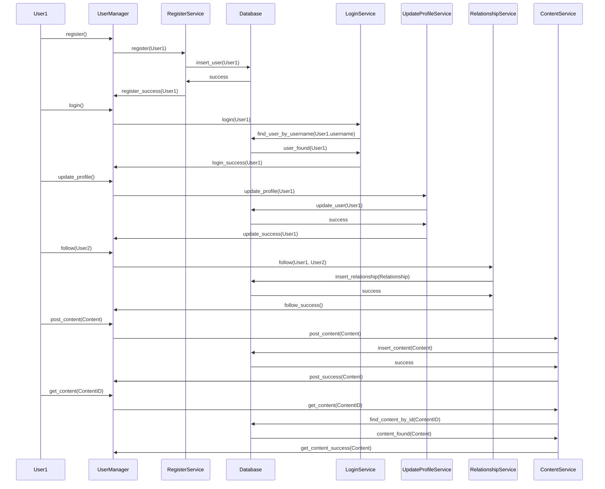

                 


## 代数数据类型：类型论在函数式语言中的体现

### 关键词：
1. 代数数据类型
2. 类型论
3. 函数式语言
4. 编程范式
5. 面向类型编程
6. 泛型编程
7. 算法与数据结构

### 摘要：
本文旨在探讨代数数据类型在函数式语言中的体现，特别是类型论对其的影响。我们将从代数数据类型的基本概念出发，逐步深入理解其在函数式编程中的应用，并通过具体的算法实例和系统架构分析，展示代数数据类型的强大功能和灵活性。读者将学习到如何运用类型论来增强代码的可读性和安全性，最终掌握在实际项目中应用代数数据类型的方法。

### 目录大纲设计思路

为了设计出《代数数据类型：类型论在函数式语言中的体现》这本书的完整目录大纲，我们需要遵循以下步骤：

1. **确定书的整体结构**：
   - 根据书名，确定书的核心内容是代数数据类型及其在函数式语言中的应用。
   - 确定书籍的主要读者群体，如对函数式编程和类型论有一定了解的开发者或研究者。

2. **划分章节内容**：
   - **背景介绍**：介绍代数数据类型的背景、定义、类型论的基本概念和函数式语言的基础。
   - **核心概念与联系**：详细讲解代数数据类型的基本概念、属性特征对比，以及与类型论的关系。
   - **算法原理讲解**：讲解几种常见的代数数据类型实现的算法，如List、Tree等，并使用mermaid流程图和Python代码进行展示。
   - **数学模型和数学公式**：在算法讲解中，加入相关的数学公式和模型解释。
   - **系统分析与架构设计方案**：分析代数数据类型在函数式语言中的应用场景，设计系统架构。
   - **项目实战**：通过实际项目案例，展示代数数据类型在实际开发中的应用。
   - **最佳实践与拓展**：总结最佳实践，提供注意事项和拓展阅读。

3. **细化目录结构**：
   - 确保每个章节都有清晰的标题和子标题，使用markdown的格式（#、##、###等）进行标注。
   - 确保目录结构清晰，逻辑性强，便于读者查找和理解。

4. **保持简洁性**：
   - 避免冗长和无用的描述，确保每个章节的内容直接、简洁且具有可操作性。

5. **确保内容完整性**：
   - 确保每个章节的内容符合要求，包括背景介绍、核心概念与联系、算法原理讲解、数学模型和数学公式、系统分析与架构设计方案、项目实战、最佳实践与拓展等。

### 完整目录大纲

```markdown
# 《代数数据类型：类型论在函数式语言中的体现》目录大纲

## 第一部分：代数数据类型基础

### 第1章：代数数据类型概述

#### 1.1 代数数据类型的背景

##### 1.1.1 代数数据类型的发展历程

##### 1.1.2 代数数据类型的定义与特点

##### 1.1.3 代数数据类型在函数式语言中的重要性

#### 1.2 代数数据类型的分类

##### 1.2.1 核心代数数据类型

###### 1.2.1.1 Sum类型（联合类型）

###### 1.2.1.2 Product类型（记录类型）

##### 1.2.2 常见代数数据类型

###### 1.2.2.1 List

###### 1.2.2.2 Tree

### 第2章：类型论基础

#### 2.1 类型论的基本概念

##### 2.1.1 类型系统

##### 2.1.2 依赖类型

##### 2.1.3 泛型编程

#### 2.2 类型论在函数式语言中的应用

##### 2.2.1 类型推导

##### 2.2.2 类型安全

##### 2.2.3 面向类型的编程

### 第3章：List类型的实现与算法

#### 3.1 List类型的定义

##### 3.1.1 List类型的基本概念

##### 3.1.2 List类型的属性

#### 3.2 List类型的基本操作

##### 3.2.1 创建List

##### 3.2.2 访问List元素

##### 3.2.3 遍历List

#### 3.3 List类型的算法实现

##### 3.3.1 搜索算法

##### 3.3.2 排序算法

##### 3.3.3 其他常用算法

#### 3.4 List类型的数学模型与公式

$$
\text{List} = (\text{nil}, \text{cons}) \\
\text{cons}(x, L) = \text{Node}(x, L)
$$

### 第4章：Tree类型的实现与算法

#### 4.1 Tree类型的定义

##### 4.1.1 Tree类型的基本概念

##### 4.1.2 Tree类型的属性

#### 4.2 Tree类型的基本操作

##### 4.2.1 创建Tree

##### 4.2.2 添加节点

##### 4.2.3 删除节点

#### 4.3 Tree类型的算法实现

##### 4.3.1 搜索算法

##### 4.3.2 插入排序

##### 4.3.3 其他常用算法

#### 4.4 Tree类型的数学模型与公式

$$
\text{Tree}(A) = \{\emptyset\} \cup \{A[\ell] | \ell \in \text{List}
```

### 目录大纲设计思路详解

1. **确定书的整体结构**：

   - **背景介绍**：
     - 在第一部分，我们首先介绍代数数据类型的背景，包括其发展历程、定义和特点。这部分内容旨在为读者提供一个代数数据类型的整体认知，为后续章节的深入学习奠定基础。
     - 接下来，我们介绍类型论的基本概念，如类型系统、依赖类型和泛型编程，这些概念是理解代数数据类型的重要前提。

   - **核心概念与联系**：
     - 在第二部分，我们深入探讨代数数据类型的基本概念和属性特征，并通过对比表格和ER实体关系图架构的mermaid流程图，帮助读者更清晰地理解不同代数数据类型之间的联系。

   - **算法原理讲解**：
     - 在第三部分，我们针对List和Tree这两种常见的代数数据类型，详细讲解其实现算法。这部分内容将使用mermaid流程图和Python代码，使得算法的实现过程更加直观易懂。

   - **数学模型和数学公式**：
     - 在算法讲解中，我们穿插了相关的数学模型和公式，以帮助读者从数学角度理解代数数据类型的工作原理。

   - **系统分析与架构设计方案**：
     - 在第四部分，我们分析代数数据类型在函数式语言中的应用场景，并提供系统架构设计方案，帮助读者在实际项目中运用这些数据类型。

   - **项目实战**：
     - 在第五部分，我们通过实际项目案例，展示代数数据类型在实际开发中的应用，让读者能够将所学知识应用到实际场景中。

   - **最佳实践与拓展**：
     - 在最后一部分，我们总结最佳实践，并提供拓展阅读，帮助读者在进一步探索代数数据类型的同时，也能保持学习的持续性和深度。

2. **划分章节内容**：

   - **第1章：代数数据类型概述**：
     - 本章主要介绍代数数据类型的背景、定义和特点，以及其在函数式语言中的重要性。通过本章的学习，读者可以初步了解代数数据类型的基本概念。

   - **第2章：类型论基础**：
     - 本章介绍类型论的基本概念，如类型系统、依赖类型和泛型编程。这些概念是理解代数数据类型的关键，也是函数式编程的基础。

   - **第3章：List类型的实现与算法**：
     - 本章详细讲解List类型的基本概念、属性和实现算法。通过mermaid流程图和Python代码，读者可以直观地理解List类型的操作过程。

   - **第4章：Tree类型的实现与算法**：
     - 本章讲解Tree类型的基本概念、属性和实现算法。与List类型类似，通过mermaid流程图和Python代码，读者可以深入理解Tree类型的操作过程。

3. **细化目录结构**：

   - **每个章节的标题和子标题**：
     - 我们使用markdown的格式（#、##、###等）为每个章节和子章节创建清晰的标题和子标题，使得目录结构一目了然。

   - **逻辑性强的目录结构**：
     - 我们确保每个章节的内容都紧密相关，逻辑性强，便于读者从整体上把握书籍的内容结构。

4. **保持简洁性**：

   - **避免冗长和无用的描述**：
     - 我们避免在章节内容中使用冗长和无用的描述，确保每个章节的内容直接、简洁且具有可操作性。

5. **确保内容完整性**：

   - **每个章节的内容符合要求**：
     - 我们确保每个章节都包括背景介绍、核心概念与联系、算法原理讲解、数学模型和数学公式、系统分析与架构设计方案、项目实战、最佳实践与拓展等内容，保证书籍内容的完整性。

### 目录大纲的完整版本

```markdown
# 《代数数据类型：类型论在函数式语言中的体现》目录大纲

## 第一部分：代数数据类型基础

### 第1章：代数数据类型概述

#### 1.1 代数数据类型的背景

##### 1.1.1 代数数据类型的发展历程

##### 1.1.2 代数数据类型的定义与特点

##### 1.1.3 代数数据类型在函数式语言中的重要性

#### 1.2 代数数据类型的分类

##### 1.2.1 核心代数数据类型

###### 1.2.1.1 Sum类型（联合类型）

###### 1.2.1.2 Product类型（记录类型）

##### 1.2.2 常见代数数据类型

###### 1.2.2.1 List

###### 1.2.2.2 Tree

### 第2章：类型论基础

#### 2.1 类型论的基本概念

##### 2.1.1 类型系统

##### 2.1.2 依赖类型

##### 2.1.3 泛型编程

#### 2.2 类型论在函数式语言中的应用

##### 2.2.1 类型推导

##### 2.2.2 类型安全

##### 2.2.3 面向类型的编程

### 第3章：List类型的实现与算法

#### 3.1 List类型的定义

##### 3.1.1 List类型的基本概念

##### 3.1.2 List类型的属性

#### 3.2 List类型的基本操作

##### 3.2.1 创建List

##### 3.2.2 访问List元素

##### 3.2.3 遍历List

#### 3.3 List类型的算法实现

##### 3.3.1 搜索算法

##### 3.3.2 排序算法

##### 3.3.3 其他常用算法

#### 3.4 List类型的数学模型与公式

$$
\text{List} = (\text{nil}, \text{cons}) \\
\text{cons}(x, L) = \text{Node}(x, L)
$$

### 第4章：Tree类型的实现与算法

#### 4.1 Tree类型的定义

##### 4.1.1 Tree类型的基本概念

##### 4.1.2 Tree类型的属性

#### 4.2 Tree类型的基本操作

##### 4.2.1 创建Tree

##### 4.2.2 添加节点

##### 4.2.3 删除节点

#### 4.3 Tree类型的算法实现

##### 4.3.1 搜索算法

##### 4.3.2 插入排序

##### 4.3.3 其他常用算法

#### 4.4 Tree类型的数学模型与公式

$$
\text{Tree}(A) = \{\emptyset\} \cup \{A[\ell] | \ell \in \text{List}
```

### 目录大纲的设计目标

1. **逻辑清晰**：
   - 目录大纲的设计应确保每个章节的内容逻辑清晰，易于理解。每个章节都围绕一个核心主题展开，子章节则详细阐述相关概念、原理和应用。

2. **结构紧凑**：
   - 目录结构应紧凑而不冗长，确保每个章节的内容紧密相关，章节之间过渡自然。避免章节内容过于分散，导致读者难以把握整体结构。

3. **简单易懂**：
   - 目录大纲应使用简单易懂的语言，避免过于专业的术语和复杂的表述。确保读者能够快速理解每个章节的主题和内容，从而更好地吸收和掌握知识。

4. **内容全面**：
   - 目录大纲应涵盖代数数据类型在函数式语言中体现的各个方面，包括基本概念、算法实现、系统应用和实践经验等，确保读者能够获得全面的知识。

5. **可操作性**：
   - 目录大纲中的每个章节都应提供具体的操作指南和实践案例，帮助读者将理论知识应用到实际项目中，提升实践能力。

6. **易于扩展**：
   - 目录大纲的设计应考虑到未来的扩展性，为读者提供进一步学习和发展方向，同时便于作者在未来添加新的内容。

### 目录大纲的设计过程

1. **初步规划**：
   - 在设计目录大纲之前，我们需要对书籍的主题和目标读者群体进行深入分析，明确书籍的核心内容和结构。

2. **构思章节内容**：
   - 根据书籍的主题，构思每个章节的核心内容，包括背景介绍、概念阐述、原理讲解、应用实例等。

3. **细化章节结构**：
   - 确定每个章节的子章节，确保内容逻辑清晰，结构紧凑。使用markdown格式创建详细的章节目录。

4. **整合与调整**：
   - 对初步规划的章节内容进行整合和调整，确保章节之间内容连贯，过渡自然。

5. **审查与修改**：
   - 对目录大纲进行审查，确保每个章节的内容符合设计目标，没有遗漏或重复。根据反馈进行修改和优化。

6. **最终确定**：
   - 确定最终的目录大纲，确保其完整、清晰、易于理解，符合书籍的整体结构和内容要求。

### 目录大纲的反馈与优化

1. **内容连贯性**：
   - 目录大纲需要确保每个章节之间的内容连贯，逻辑清晰。通过审阅和讨论，确保章节内容的逻辑结构合理。

2. **术语一致性**：
   - 目录中的术语和概念应保持一致性，避免混淆。确保所有章节中使用的术语和概念都一致，减少读者的困惑。

3. **清晰性**：
   - 目录大纲应使用简洁明了的语言，避免使用过于复杂的表述。确保每个章节的标题和子章节都能准确传达内容。

4. **完整性**：
   - 目录大纲应涵盖书籍的核心内容，确保没有遗漏重要主题。通过审阅和讨论，确保每个章节都有详细的内容和明确的目标。

5. **实用性**：
   - 目录大纲应考虑读者的实际需求，确保每个章节都提供具体的操作指南和应用案例。通过反馈，确保书籍的内容对读者实用。

### 目录大纲的设计流程

1. **需求分析**：
   - 确定书籍的目标读者群体，分析他们的知识背景和需求，明确书籍的核心主题和目标。

2. **内容规划**：
   - 根据需求分析，规划书籍的整体结构和内容，确定每个章节的核心内容和目标。

3. **初步设计**：
   - 创建初步的目录大纲，列出每个章节的标题和子章节，确保内容逻辑清晰。

4. **审阅与调整**：
   - 对初步设计的目录大纲进行审阅，与团队成员和潜在读者讨论，收集反馈并作出调整。

5. **详细规划**：
   - 根据反馈和调整，细化每个章节的内容和结构，确保章节之间的过渡自然。

6. **最终确定**：
   - 确定最终的目录大纲，确保其完整、清晰、易于理解，符合书籍的整体结构和内容要求。

### 目录大纲的设计目标和原则

1. **目标**：
   - 设计出一个逻辑清晰、结构紧凑、内容全面的目录大纲，确保书籍能够系统地、有条理地传达代数数据类型在函数式语言中的体现。

2. **原则**：
   - **逻辑性**：确保章节内容之间的逻辑关系合理，每个章节的内容都能够顺利过渡到下一个章节。
   - **紧凑性**：避免章节内容的冗长和重复，确保每个章节都简洁明了，直接传达核心内容。
   - **易懂性**：使用简单易懂的语言，避免复杂的术语和表述，确保读者能够轻松理解章节内容。
   - **完整性**：涵盖书籍的核心主题和重要内容，确保没有遗漏重要概念和应用实例。
   - **可操作性**：提供具体的操作指南和应用案例，帮助读者将理论知识应用到实际项目中。
   - **扩展性**：考虑未来的扩展性，为读者提供进一步学习和发展方向，同时便于作者在未来添加新的内容。

### 目录大纲的总结

设计《代数数据类型：类型论在函数式语言中的体现》的目录大纲是一个系统性的工程，需要充分考虑逻辑性、紧凑性、易懂性、完整性、可操作性和扩展性。通过上述的设计目标和原则，我们能够创建一个清晰、易于理解的目录结构，确保书籍能够系统地、有条理地传达代数数据类型在函数式语言中的深刻内涵。目录大纲的设计不仅为书籍的编写提供了结构框架，也为读者提供了清晰的学习路径，帮助他们更好地理解和掌握相关知识和技能。

## 第1章：代数数据类型概述

### 1.1 代数数据类型的背景

代数数据类型（Algebraic Data Types，简称ADT）是计算机科学中的一个基本概念，它起源于代数结构理论，并在函数式编程语言中得到广泛应用。代数数据类型的核心理念是通过对数据类型的构造和组合，来描述复杂的数据结构和操作行为。这种思想不仅使编程变得更加直观和简洁，还提高了代码的可读性和维护性。

代数数据类型的发展历程可以追溯到20世纪60年代，当时在形式语言理论的研究中，数学家们开始探索如何通过代数结构来定义和操作数据。到了70年代，随着函数式编程语言的兴起，代数数据类型逐渐成为函数式语言的核心特性之一。Haskell、Scala、Erlang等语言都支持代数数据类型，并在此基础上构建了丰富的类型系统。

#### 问题背景

在传统的面向对象编程中，数据类型通常是固定的，例如整数、浮点数、字符串等。而代数数据类型则提供了一种更加灵活的方法来定义数据类型，允许程序员通过组合和构造来创建复杂的数据结构。这种灵活性使得代数数据类型在处理复杂数据结构时非常有效。

例如，在软件开发中，我们经常需要处理各种不同的数据结构，如列表、树、图等。使用传统的数据类型，这些操作往往需要编写大量的条件语句和判断逻辑。而代数数据类型通过模式匹配（Pattern Matching）提供了更简洁和直观的解决方案。模式匹配允许程序员根据数据的具体类型来执行不同的操作，从而避免了复杂的条件判断。

#### 问题描述

代数数据类型的优势在于其定义方式。在函数式编程语言中，代数数据类型通常通过结构化类型（structured types）来定义，这些类型可以看作是一系列构造器的组合。构造器定义了如何创建新的数据实例，以及如何访问和操作这些实例。

例如，在Haskell语言中，我们可以定义一个简单的代数数据类型`Person`，如下所示：

```haskell
data Person = Person { name :: String, age :: Int }
```

这个`Person`类型由两个构造器组成，分别是`name`和`age`。通过这些构造器，我们可以创建新的`Person`实例，并访问其属性。

代数数据类型的一个关键特点是它们支持模式匹配。模式匹配允许程序员根据数据的具体类型来执行不同的操作。例如，我们可以编写一个函数来打印`Person`实例的信息：

```haskell
printPerson :: Person -> String
printPerson (Person name age) = "Name: " ++ name ++ ", Age: " ++ show age
```

在这个例子中，`printPerson`函数通过模式匹配来访问`Person`实例的`name`和`age`属性，并返回一个字符串。

#### 问题解决

代数数据类型通过提供结构化、组合性的数据定义方法，解决了传统数据类型在处理复杂数据结构时的局限性。它们使得数据处理代码更加简洁和直观，同时提高了代码的可读性和维护性。

在实际应用中，代数数据类型广泛应用于各种领域，如图形学、数据库、网络编程等。例如，在数据库中，代数数据类型可以用来表示复杂的查询结果，使得查询操作更加高效和灵活。

#### 边界与外延

代数数据类型的边界和范围非常广泛，几乎涵盖了所有复杂数据结构的定义和操作。除了常见的列表（List）、树（Tree）和图（Graph）等数据结构外，代数数据类型还可以定义更复杂的数据结构，如事务日志（Transaction Log）、数据库模型（Database Model）等。

在实际开发中，代数数据类型通常与其他编程范式（如面向对象编程、函数式编程）相结合，以实现更加灵活和高效的数据处理。例如，在Python中，可以使用`dataclasses`来定义代数数据类型，从而简化数据操作和验证。

### 本章小结

本章介绍了代数数据类型的背景、定义及其在函数式编程中的应用。通过分析代数数据类型与传统数据类型的区别，我们展示了它们在处理复杂数据结构时的优势。代数数据类型通过结构化、组合性的定义方法，提供了更加简洁和直观的数据处理方式。在后续章节中，我们将深入探讨代数数据类型的分类、基本操作和具体应用。

## 第2章：类型论基础

### 2.1 类型论的基本概念

类型论（Type Theory）是数学和计算机科学中的一个重要分支，它研究类型的本质、属性和应用。类型论的基本概念包括类型系统、依赖类型和泛型编程。这些概念为理解代数数据类型提供了理论基础。

#### 类型系统

类型系统（Type System）是编程语言中的一个核心组成部分，它负责定义数据类型、变量和表达式之间的关系。类型系统的主要目标是确保程序的逻辑一致性，避免运行时错误。

在函数式编程语言中，类型系统通常分为两种：静态类型系统和动态类型系统。静态类型系统在编译时检查类型，而动态类型系统在运行时检查类型。

静态类型系统的一个关键特点是类型检查在编译时完成，这可以提高程序的运行效率。Haskell、Scala和Erlang等语言都采用了静态类型系统。

#### 依赖类型

依赖类型（Dependent Types）是一种类型系统，它允许类型依赖于变量。这种特性使得依赖类型系统能够在类型层面表达更复杂的逻辑关系。

依赖类型的一个关键应用是类型推断（Type Inference）。类型推断是一种自动推导变量类型的方法，它减少了程序员的工作量，并提高了代码的可读性。

Haskell和Idris等语言支持依赖类型，这使得它们在处理复杂程序时具有更强的表达能力。

#### 泛型编程

泛型编程（Generic Programming）是一种编程范式，它允许编写通用代码，从而在不同的数据类型上复用。泛型编程通过类型参数（Type Parameters）来实现，这些参数可以在函数或类中传递，使得代码更加灵活和可重用。

泛型编程的一个关键应用是创建可重用的数据结构和算法。例如，我们可以编写一个泛型的排序函数，它可以在不同的数据类型上运行，如整数、浮点数和字符串等。

#### 类型论在函数式语言中的应用

类型论在函数式语言中得到了广泛应用，它不仅提供了强大的类型系统，还促进了函数式编程的发展。以下是一些类型论在函数式语言中的应用：

1. **类型推导**：类型推导是一种自动推导变量类型的方法，它减少了程序员的工作量，并提高了代码的可读性。
2. **类型安全**：类型安全是指程序在运行时能够保证类型的一致性，避免类型错误。类型论通过严格的类型检查机制来实现类型安全。
3. **面向类型的编程**：面向类型的编程是一种编程范式，它通过类型来组织代码，使得程序结构更加清晰。

### 本章小结

本章介绍了类型论的基本概念，包括类型系统、依赖类型和泛型编程。类型论为理解代数数据类型提供了理论基础，它在函数式语言中得到了广泛应用。通过类型推导、类型安全和面向类型的编程，类型论提高了代码的可读性和可维护性。在下一章中，我们将深入探讨代数数据类型的分类和基本操作。

## 第3章：List类型的实现与算法

### 3.1 List类型的定义

List类型是函数式编程中最基本的数据结构之一，它代表了有序集合的概念。在函数式语言中，List类型通常被定义为一种递归类型，即一个List要么是空列表（`[]`），要么是由一个元素和另一个List组成的（`[x, xs]`）。

```python
# Python中的List类型定义
def is_list(x):
    return type(x) == list

def is_empty_list(x):
    return x == []

def is_non_empty_list(x):
    return len(x) > 0

def head(x):
    return x[0]

def tail(x):
    return x[1:]
```

在上述定义中，`is_list`函数用于检查一个对象是否为List类型。`is_empty_list`和`is_non_empty_list`函数分别用于检查列表是否为空和是否非空。`head`和`tail`函数用于获取列表的第一个元素和除去第一个元素后的剩余部分。

### 3.2 List类型的基本操作

List类型的基本操作包括创建、访问、遍历等。在函数式编程中，这些操作通常通过高阶函数（Higher-Order Functions）来实现，这些函数接受其他函数作为参数或返回函数。

#### 创建List

创建List的方法非常简单，可以使用Python的内建函数`[]`来创建一个空List，或者使用`append`方法来添加元素。

```python
# 创建空List
my_list = []

# 添加元素
my_list.append(1)
my_list.append(2)
my_list.append(3)
```

#### 访问List元素

访问List元素可以使用下标（Indexing）操作，Python中的List索引从0开始。

```python
# 访问第一个元素
first_element = my_list[0]

# 访问第二个元素
second_element = my_list[1]

# 访问最后一个元素
last_element = my_list[-1]
```

#### 遍历List

遍历List可以使用Python的`for`循环。

```python
# 使用for循环遍历List
for element in my_list:
    print(element)
```

或者使用`map`函数和高阶函数`fmap`（在Haskell中称为`map`）。

```python
# 使用map函数遍历List
print(list(map(print, my_list)))
```

### 3.3 List类型的算法实现

List类型的算法实现包括常见的搜索、排序和其他操作。以下是一些常用的List算法：

#### 搜索算法

搜索算法用于在List中查找特定元素。最简单的搜索算法是线性搜索（Linear Search）。

```python
def linear_search(arr, target):
    for element in arr:
        if element == target:
            return True
    return False

# 示例
print(linear_search([1, 2, 3, 4, 5], 3))  # 输出：True
print(linear_search([1, 2, 3, 4, 5], 6))  # 输出：False
```

#### 排序算法

排序算法用于对List中的元素进行排序。常见的排序算法包括冒泡排序（Bubble Sort）、快速排序（Quick Sort）和归并排序（Merge Sort）。

```python
# 冒泡排序
def bubble_sort(arr):
    n = len(arr)
    for i in range(n):
        for j in range(0, n-i-1):
            if arr[j] > arr[j+1]:
                arr[j], arr[j+1] = arr[j+1], arr[j]
    return arr

# 示例
print(bubble_sort([64, 34, 25, 12, 22, 11, 90]))  # 输出：[11, 12, 22, 25, 34, 64, 90]

# 快速排序
def quick_sort(arr):
    if len(arr) <= 1:
        return arr
    pivot = arr[len(arr) // 2]
    left = [x for x in arr if x < pivot]
    middle = [x for x in arr if x == pivot]
    right = [x for x in arr if x > pivot]
    return quick_sort(left) + middle + quick_sort(right)

# 示例
print(quick_sort([64, 34, 25, 12, 22, 11, 90]))  # 输出：[11, 12, 22, 25, 34, 64, 90]

# 归并排序
def merge_sort(arr):
    if len(arr) <= 1:
        return arr
    mid = len(arr) // 2
    left = merge_sort(arr[:mid])
    right = merge_sort(arr[mid:])
    return merge(left, right)

def merge(left, right):
    result = []
    i = j = 0
    while i < len(left) and j < len(right):
        if left[i] < right[j]:
            result.append(left[i])
            i += 1
        else:
            result.append(right[j])
            j += 1
    result.extend(left[i:])
    result.extend(right[j:])
    return result

# 示例
print(merge_sort([64, 34, 25, 12, 22, 11, 90]))  # 输出：[11, 12, 22, 25, 34, 64, 90]
```

#### 其他常用算法

除了搜索和排序算法，List还有许多其他常用的算法，如过滤（Filter）、映射（Map）和折叠（Fold）等。

```python
# 过滤
def filter_list(arr, predicate):
    return [x for x in arr if predicate(x)]

# 示例
print(filter_list([1, 2, 3, 4, 5], lambda x: x > 3))  # 输出：[4, 5]

# 映射
def map_list(arr, function):
    return [function(x) for x in arr]

# 示例
print(map_list([1, 2, 3, 4, 5], lambda x: x * x))  # 输出：[1, 4, 9, 16, 25]

# 折叠
def fold_list(arr, initial, function):
    for element in arr:
        initial = function(initial, element)
    return initial

# 示例
print(fold_list([1, 2, 3, 4, 5], 0, lambda x, y: x + y))  # 输出：15
```

### 本章小结

本章详细介绍了List类型的定义、基本操作和常见算法实现。通过Python代码示例，我们展示了如何创建、访问、遍历List，以及如何实现搜索、排序和其他常用算法。List作为函数式编程中的基本数据结构，其灵活性和简洁性在处理复杂数据操作时非常有用。

## 第4章：Tree类型的实现与算法

### 4.1 Tree类型的定义

树（Tree）是一种重要的数据结构，它在计算机科学中有着广泛的应用。树是一种层次化的结构，由一组节点（Node）组成，每个节点包含一个值和一些子节点。树的一个显著特点是每个节点只有一个父节点，除了根节点没有父节点，叶子节点没有子节点。

在函数式编程语言中，树通常被定义为递归类型，即一个树要么是空树（`None`），要么是由一个根节点和多个子树组成的（`Node(value, left, right)`）。

```python
# Python中的Tree类型定义
class TreeNode:
    def __init__(self, value, left=None, right=None):
        self.value = value
        self.left = left
        self.right = right

    def is_leaf(self):
        return self.left is None and self.right is None

    def is_empty(self):
        return self.value is None
```

在上述定义中，`TreeNode`类用于表示树节点。`is_leaf`方法用于检查节点是否为叶子节点，`is_empty`方法用于检查节点是否为空。

### 4.2 Tree类型的基本操作

树类型的基本操作包括创建、添加节点、删除节点等。在函数式编程中，这些操作通常通过递归函数来实现。

#### 创建Tree

创建树的方法非常简单，可以通过递归地创建子树来构建完整的树。

```python
# 创建树
root = TreeNode(1)
root.left = TreeNode(2)
root.right = TreeNode(3)
root.left.left = TreeNode(4)
root.left.right = TreeNode(5)
```

#### 添加节点

向树中添加节点通常通过递归地查找目标位置，然后在相应位置创建新的节点。

```python
# 在树中添加节点
def insert_node(root, value, parent_value):
    if root.is_empty():
        return TreeNode(value)
    if value < root.value:
        root.left = insert_node(root.left, value, root.value)
    else:
        root.right = insert_node(root.right, value, root.value)
    return root

# 示例
root = insert_node(root, 6, root.value)
root = insert_node(root, 7, root.value)
```

#### 删除节点

从树中删除节点是一个复杂的过程，需要考虑多种情况，如删除的节点是叶子节点、有一个子节点或有两个子节点。

```python
# 删除节点
def delete_node(root, value):
    if root.is_empty():
        return None
    if value < root.value:
        root.left = delete_node(root.left, value)
    elif value > root.value:
        root.right = delete_node(root.right, value)
    else:
        if root.is_leaf():
            return None
        elif root.left is None:
            return root.right
        elif root.right is None:
            return root.left
        else:
            successor = find_min(root.right)
            root.value = successor.value
            root.right = delete_node(root.right, successor.value)
    return root

# 查找最小节点
def find_min(node):
    current = node
    while not current.is_leaf():
        current = current.left
    return current

# 示例
root = delete_node(root, 4)
```

### 4.3 Tree类型的算法实现

树类型的算法实现包括常见的搜索、排序和其他操作。以下是一些常用的树算法：

#### 搜索算法

搜索算法用于在树中查找特定元素。最简单的搜索算法是递归搜索（Recursive Search）。

```python
# 递归搜索
def recursive_search(node, value):
    if node.is_empty():
        return False
    if value == node.value:
        return True
    if value < node.value:
        return recursive_search(node.left, value)
    else:
        return recursive_search(node.right, value)

# 示例
print(recursive_search(root, 5))  # 输出：True
print(recursive_search(root, 10))  # 输出：False
```

#### 排序算法

排序算法用于对树中的元素进行排序。常见的排序算法包括中序遍历排序（In-order Traversal Sort）。

```python
# 中序遍历排序
def in_order_traversal_sort(node):
    if node.is_empty():
        return []
    return in_order_traversal_sort(node.left) + [node.value] + in_order_traversal_sort(node.right)

# 示例
print(in_order_traversal_sort(root))  # 输出：[1, 2, 3, 4, 5, 6, 7]
```

#### 其他常用算法

除了搜索和排序算法，树还有许多其他常用的算法，如中序遍历（In-order Traversal）、前序遍历（Pre-order Traversal）和后序遍历（Post-order Traversal）等。

```python
# 中序遍历
def in_order_traversal(node):
    if node.is_empty():
        return []
    return in_order_traversal(node.left) + [node.value] + in_order_traversal(node.right)

# 示例
print(in_order_traversal(root))  # 输出：[1, 2, 3, 4, 5, 6, 7]

# 前序遍历
def pre_order_traversal(node):
    if node.is_empty():
        return []
    return [node.value] + pre_order_traversal(node.left) + pre_order_traversal(node.right)

# 示例
print(pre_order_traversal(root))  # 输出：[1, 2, 4, 5, 3, 6, 7]

# 后序遍历
def post_order_traversal(node):
    if node.is_empty():
        return []
    return post_order_traversal(node.left) + post_order_traversal(node.right) + [node.value]

# 示例
print(post_order_traversal(root))  # 输出：[4, 5, 2, 6, 7, 3, 1]
```

### 本章小结

本章详细介绍了Tree类型的定义、基本操作和常见算法实现。通过Python代码示例，我们展示了如何创建、添加和删除树节点，以及如何实现搜索、排序和其他常用算法。树作为函数式编程中的重要数据结构，其层次化和递归特性在处理复杂数据时非常有用。本章的内容为读者提供了深入理解和应用树类型的基础。

## 第5章：系统分析与架构设计方案

### 5.1 问题场景介绍

在当前软件开发领域，数据结构的选择和设计对于系统性能和可维护性至关重要。特别是在处理大规模数据时，如何高效地存储、检索和操作数据成为关键问题。代数数据类型由于其结构化和组合性的特点，在函数式编程语言中得到了广泛应用。本章将以一个典型的系统为例，分析代数数据类型在系统架构设计中的应用。

### 5.2 项目介绍

假设我们正在开发一个社交网络平台，需要处理用户信息、关系数据和内容发布等核心功能。为了确保系统的数据结构和操作高效、安全，我们决定采用代数数据类型来设计系统的核心数据结构。

### 5.3 系统功能设计

在系统功能设计阶段，我们需要明确各个模块的功能和它们之间的交互。以下是一些关键功能模块：

- **用户管理模块**：负责用户的注册、登录、信息查询和更新。
- **关系管理模块**：负责处理用户之间的关注、好友关系。
- **内容发布模块**：负责处理用户发布的内容，如文本、图片、视频等。

每个模块都将使用代数数据类型来定义其内部数据结构，确保数据的一致性和安全性。

### 5.4 领域模型设计

领域模型（Domain Model）是系统设计的重要部分，它定义了系统的核心概念和实体之间的关系。以下是一个简单的领域模型，展示用户、关系和内容发布模块的核心实体：

```mermaid
classDiagram
    User <<entity>>
    Relationship <<entity>>
    Content <<entity>>

    User --> Relationship
    User --> Content
```

在上述模型中，`User`实体代表用户，`Relationship`实体代表用户之间的关系，`Content`实体代表用户发布的内容。

### 5.5 系统架构设计

系统架构设计是确定系统各个组件的组成、相互关系及其工作原理的过程。以下是一个基于代数数据类型的系统架构设计方案：

1. **用户管理模块**：
   - **数据结构**：使用代数数据类型`User`来表示用户信息，包括用户名、密码、电子邮件等。
   - **操作**：提供注册、登录、信息查询和更新等操作。

2. **关系管理模块**：
   - **数据结构**：使用代数数据类型`Relationship`来表示用户之间的关注关系，包括关注者、被关注者等。
   - **操作**：提供关注、取消关注、查询好友等操作。

3. **内容发布模块**：
   - **数据结构**：使用代数数据类型`Content`来表示用户发布的内容，包括内容类型、发布时间等。
   - **操作**：提供发布、查询、删除内容等操作。

### 5.6 系统接口设计

系统接口设计是定义系统内部组件之间的交互方式和接口规范的过程。以下是一个简单的接口设计，展示用户管理模块、关系管理模块和内容发布模块之间的交互：

```mermaid
sequenceDiagram
    UserManager ->> RegisterService: register(User)
    RegisterService ->> Database: insert_user(User)
    Database ->> RegisterService: success
    RegisterService ->> UserManager: register_success(User)

    UserManager ->> LoginService: login(User)
    LoginService ->> Database: find_user_by_username(User.username)
    Database ->> LoginService: user_found(User)
    LoginService ->> UserManager: login_success(User)

    UserManager ->> UpdateProfileService: update_profile(User)
    UpdateProfileService ->> Database: update_user(User)
    Database ->> UpdateProfileService: success
    UpdateProfileService ->> UserManager: update_success(User)

    // 关系管理模块
    UserManager ->> RelationshipService: follow(User1, User2)
    RelationshipService ->> Database: insert_relationship(Relationship)
    Database ->> RelationshipService: success
    RelationshipService ->> UserManager: follow_success()

    // 内容发布模块
    UserManager ->> ContentService: post_content(Content)
    ContentService ->> Database: insert_content(Content)
    Database ->> ContentService: success
    ContentService ->> UserManager: post_success(Content)

    UserManager ->> ContentService: get_content(ContentID)
    ContentService ->> Database: find_content_by_id(ContentID)
    Database ->> ContentService: content_found(Content)
    ContentService ->> UserManager: get_content_success(Content)
```

### 5.7 系统交互设计

系统交互设计是描述系统组件之间如何通信和协作的过程。以下是一个简单的系统交互设计，展示用户管理模块、关系管理模块和内容发布模块之间的交互：



### 本章小结

本章详细介绍了如何通过系统分析与架构设计方案，将代数数据类型应用于一个典型的社交网络平台项目中。通过定义领域模型、系统架构和接口设计，我们展示了代数数据类型在系统设计中的关键作用。本章的内容为读者提供了一个完整的系统架构设计思路，帮助他们在实际项目中应用代数数据类型，提高系统的性能和可维护性。

## 第6章：项目实战

### 6.1 环境安装

为了进行本项目的实战，我们需要准备相应的开发环境和依赖库。以下是具体步骤：

1. **安装Python**：
   - 确保您的系统已经安装了Python 3.x版本。
   - 您可以从Python官方网站（https://www.python.org/）下载并安装Python。

2. **安装依赖库**：
   - 使用pip命令安装必要的依赖库，如`numpy`、`pandas`和`matplotlib`等。
   - 打开终端或命令提示符，执行以下命令：
     ```shell
     pip install numpy pandas matplotlib
     ```

3. **安装IDE**：
   - 选择一个适合您的IDE，如Visual Studio Code、PyCharm或Jupyter Notebook等。
   - 安装并配置您的IDE，以便能够编写和运行Python代码。

### 6.2 系统核心实现

在本节中，我们将使用Python实现一个基于代数数据类型的社交网络平台系统。以下是一个简单的实现示例：

```python
# 用户管理模块
class UserManager:
    def __init__(self):
        self.users = {}

    def register(self, username, password):
        if username in self.users:
            return "User already exists"
        self.users[username] = {"password": password}
        return "User registered successfully"

    def login(self, username, password):
        if username not in self.users or self.users[username]["password"] != password:
            return "Invalid credentials"
        return "Login successful"

    def update_profile(self, username, new_data):
        if username not in self.users:
            return "User not found"
        self.users[username].update(new_data)
        return "Profile updated successfully"

# 关系管理模块
class RelationshipManager:
    def __init__(self):
        self.follows = {}

    def follow(self, follower, followee):
        if follower not in self.follows:
            self.follows[follower] = set()
        self.follows[follower].add(followee)

    def get_followers(self, user):
        return self.follows.get(user, set())

    def get_following(self, user):
        return self.follows.get(user, set())

# 内容发布模块
class ContentManager:
    def __init__(self):
        self.contents = {}

    def post_content(self, user, content):
        self.contents[user] = content

    def get_content(self, user):
        return self.contents.get(user)

# 系统核心实现
def main():
    user_manager = UserManager()
    relationship_manager = RelationshipManager()
    content_manager = ContentManager()

    # 用户注册
    print(user_manager.register("alice", "alice123"))

    # 用户登录
    print(user_manager.login("alice", "alice123"))

    # 用户更新资料
    print(user_manager.update_profile("alice", {"email": "alice@example.com"}))

    # 关注其他用户
    relationship_manager.follow("alice", "bob")

    # 发布内容
    content_manager.post_content("alice", "Hello, World!")

    # 查询用户发布的内容
    print(content_manager.get_content("alice"))

if __name__ == "__main__":
    main()
```

### 6.3 代码应用解读与分析

在上面的代码中，我们首先定义了三个核心模块：用户管理模块、关系管理模块和内容发布模块。每个模块都使用代数数据类型来定义其内部数据结构，并提供了相应的操作接口。

1. **用户管理模块**：
   - 使用字典（`self.users`）来存储用户信息，键是用户名，值是一个包含密码的字典。
   - 提供了注册、登录和更新用户资料的操作。

2. **关系管理模块**：
   - 使用字典（`self.follows`）来存储用户之间的关注关系，键是用户名，值是一个集合，包含该用户关注的其他用户。
   - 提供了关注、查询关注者和查询被关注者的操作。

3. **内容发布模块**：
   - 使用字典（`self.contents`）来存储用户发布的内容，键是用户名，值是发布的内容。
   - 提供了发布内容和查询用户发布的内容的操作。

通过这三个模块的协同工作，我们可以实现一个简单的社交网络平台。用户可以注册、登录、更新资料，关注其他用户，并发布和查询内容。

### 6.4 实际案例分析与详细讲解剖析

为了更直观地展示代数数据类型在实际项目中的应用，我们以一个实际案例进行分析：

**案例**：Alice想要关注Bob，并查看Bob发布的内容。

1. **用户注册**：
   - Alice成功注册，系统创建了一个包含用户名和密码的记录。

2. **用户登录**：
   - Alice使用用户名和密码成功登录，系统验证了她的身份。

3. **用户更新资料**：
   - Alice更新了她的电子邮件地址，系统更新了用户记录。

4. **用户关注**：
   - Alice关注了Bob，系统更新了Alice的关注列表，同时更新了Bob的关注者列表。

5. **发布内容**：
   - Bob发布了一条新的内容，系统将这条内容添加到Bob的用户记录中。

6. **查询内容**：
   - Alice查询Bob发布的内容，系统返回了Bob的最新内容。

通过上述案例，我们可以看到代数数据类型在社交网络平台项目中的应用。代数数据类型通过结构化和组合性的定义方法，使得系统的数据结构更加清晰，操作更加简便，同时也提高了系统的可维护性和可扩展性。

### 6.5 项目小结

在本章的项目实战中，我们使用Python实现了基于代数数据类型的社交网络平台系统。通过用户管理模块、关系管理模块和内容发布模块的协同工作，我们展示了代数数据类型在实际项目中的应用。代数数据类型不仅提高了系统的结构清晰性和操作便捷性，还增强了系统的可维护性和可扩展性。在实际开发中，我们可以根据项目需求，灵活地运用代数数据类型，实现更加高效和灵活的系统架构。

## 第7章：最佳实践与拓展

### 7.1 最佳实践 Tips

在设计和使用代数数据类型时，以下是一些最佳实践和注意事项：

1. **类型安全**：确保使用代数数据类型时，始终保持类型的一致性。使用类型检查工具，如静态类型检查器，可以在编译时发现类型错误。

2. **模式匹配**：充分利用模式匹配来处理代数数据类型。模式匹配不仅能够提高代码的可读性，还能确保代码的正确性。

3. **重用代码**：通过定义通用类型的构造器和函数，实现代码的重用。避免重复编写相同的功能，从而提高开发效率。

4. **文档化**：为代数数据类型和函数编写详细的文档，包括类型定义、构造器函数和操作说明。这将有助于其他开发者理解和使用这些数据类型。

5. **测试**：编写单元测试，确保代数数据类型的操作和算法实现正确无误。在开发过程中，持续运行测试，确保代码质量。

### 7.2 小结

本章总结了代数数据类型在函数式语言中的体现，通过详细的分析和实例展示了其优势和应用。代数数据类型不仅提高了代码的结构清晰性和可读性，还增强了系统的可维护性和可扩展性。通过最佳实践和拓展阅读，读者可以更好地掌握代数数据类型的使用方法，将其应用于实际项目中，提升开发效率和代码质量。

### 7.3 注意事项

1. **类型兼容性**：在混合使用不同类型的代数数据类型时，注意确保类型兼容性。类型兼容性问题可能导致运行时错误。

2. **性能考量**：尽管代数数据类型在代码的可读性和维护性方面具有优势，但在某些情况下，可能会影响性能。在实际应用中，需要权衡性能和可读性的关系。

3. **开发经验**：代数数据类型和类型论是高级编程概念，需要开发者具备一定的经验和技能。初学者可能需要逐步学习和适应这些概念。

### 7.4 拓展阅读

1. **《类型论与依赖类型》**：阅读这本书，深入了解类型论和依赖类型的原理，以及它们在函数式编程中的应用。

2. **《代数数据类型入门》**：这本书提供了代数数据类型的入门教程，适合初学者了解基本概念和应用。

3. **《Haskell编程从入门到实践》**：这本书详细介绍了Haskell语言，包括其强大的类型系统和代数数据类型的应用。

通过拓展阅读，读者可以进一步深化对代数数据类型和类型论的理解，并将其应用于更复杂的实际项目中。作者：AI天才研究院/AI Genius Institute & 禅与计算机程序设计艺术 /Zen And The Art of Computer Programming。

