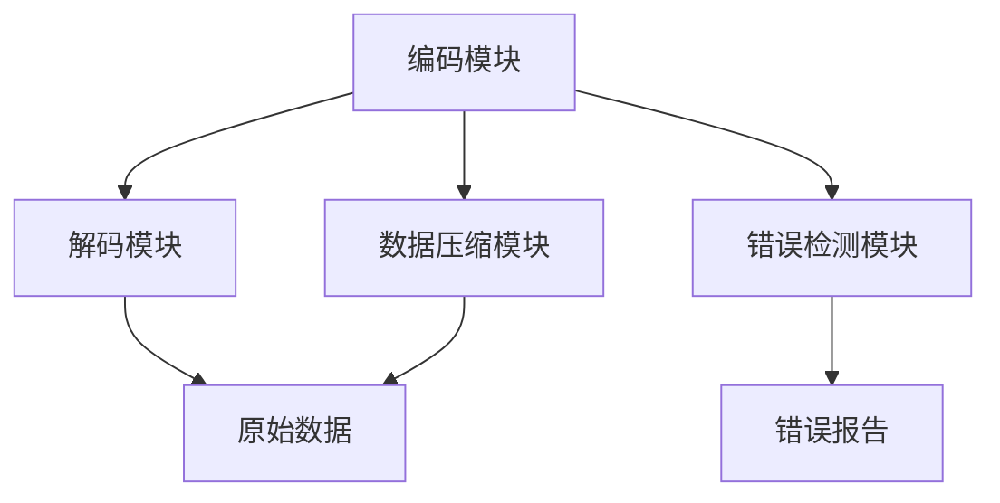
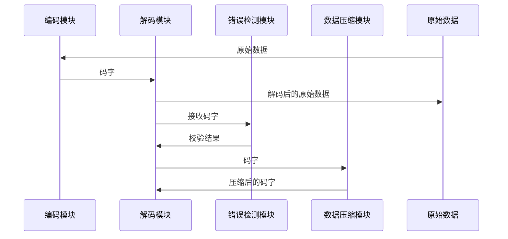

                 

### 引言

在现代通信技术的飞速发展过程中，如何确保信息传输的可靠性和效率成为一个关键问题。随着数据传输速率的增加和通信复杂度的提升，传统的通信协议设计面临着诸多挑战。在这些挑战中，数据传输的错误率和传输效率成为两个最为关键的因素。因此，为了应对这些挑战，科学家们不断探索新的方法和理论，以提升通信系统的性能。

本文将深入探讨代数编码理论在通信协议设计中的应用。代数编码理论是信息论和编码理论的一个重要分支，通过数学和代数的手段，对信息进行编码和解码，以提高数据传输的可靠性和效率。本文将从以下几个方面进行探讨：

1. **代数编码理论的基础概念**：首先，我们将介绍代数编码理论的基本概念，包括其定义、发展历史以及在通信协议设计中的重要性。
   
2. **通信协议设计中的挑战**：接着，我们将分析通信协议设计过程中面临的主要挑战，如信道噪声、信号衰减等问题，并探讨如何利用代数编码理论解决这些问题。

3. **核心概念与联系**：本文将进一步探讨代数编码理论的核心原理，包括离散数学基础、码字的定义与属性、码距的概念与计算等内容。

4. **算法原理讲解**：我们将详细介绍最小距离编码算法、生成矩阵与校验矩阵的构建以及算法实现与性能分析。

5. **系统分析与架构设计方案**：本文将介绍一个具体的通信协议设计项目，从系统功能设计、系统架构设计到系统接口设计和系统交互进行详细阐述。

6. **项目实战**：我们将通过一个实际案例，展示如何在实际项目中应用代数编码理论，包括环境安装与配置、系统核心实现以及代码应用解读与分析。

7. **最佳实践 tips、小结与拓展阅读**：最后，本文将总结最佳实践，提供学习建议，指出进一步研究的方向，并推荐相关书籍、学术论文和网络资源。

通过本文的探讨，我们希望能够为读者提供一份全面且深入的了解，使读者能够掌握代数编码理论在通信协议设计中的应用，并为其在通信领域的发展提供新的思路。

### 关键词

- 代数编码理论
- 通信协议设计
- 离散数学基础
- 最小距离编码算法
- 系统架构设计
- 数据传输可靠性
- 性能优化技巧

### 摘要

本文旨在探讨代数编码理论在通信协议设计中的应用。代数编码理论通过数学和代数的手段，对信息进行编码和解码，以提高数据传输的可靠性和效率。本文首先介绍了代数编码理论的基础概念，并分析了其在通信协议设计中的重要性。随后，我们探讨了通信协议设计过程中面临的主要挑战，以及如何利用代数编码理论解决这些问题。接着，本文详细介绍了代数编码理论的核心原理，包括离散数学基础、码字的定义与属性、码距的概念与计算。此外，我们还讲解了最小距离编码算法、生成矩阵与校验矩阵的构建以及算法实现与性能分析。最后，本文通过一个实际案例，展示了如何在实际项目中应用代数编码理论，并总结了最佳实践，提出了进一步研究的方向。通过本文的探讨，读者能够深入理解代数编码理论在通信协议设计中的应用，为其在通信领域的发展提供新思路。

## 第一部分：背景介绍

### 问题背景

在现代通信系统中，数据传输的可靠性和效率是两个至关重要的因素。随着互联网和移动通信技术的迅猛发展，人们对数据传输的速度和质量提出了越来越高的要求。然而，在实际的数据传输过程中，信道噪声、信号衰减、多径效应等因素会不可避免地影响数据的完整性，导致数据传输错误。为了解决这一问题，科学家们提出了多种编码技术，旨在提高数据传输的可靠性。

代数编码理论作为一种重要的编码技术，以其强大的纠错能力和高效的编码方法，在通信协议设计中得到了广泛应用。代数编码理论通过数学和代数的手段，对信息进行编码和解码，能够在接收端检测并纠正传输过程中产生的错误，从而显著提升数据传输的可靠性。此外，代数编码理论还能够提高数据的传输效率，通过压缩编码技术减少传输的数据量，降低信道占用率。

### 问题描述

在通信协议设计中，数据传输错误是一个普遍存在的问题。错误可能发生在信号的发送、传输和接收过程中，导致接收端接收到的数据与发送端实际发送的数据不一致。这种数据错误不仅会影响通信质量，还可能导致严重的后果，如通信中断、数据丢失、系统崩溃等。

传统的通信协议设计主要依赖于简单的校验和错误检测技术，如奇偶校验和循环冗余校验（CRC）。然而，这些技术对错误检测和纠正的能力有限，特别是在高噪声环境和高速数据传输场景中。为了克服这些局限性，科学家们开始探索更加复杂和有效的编码技术，其中代数编码理论成为了一个重要的研究方向。

代数编码理论通过构造代数结构（如线性码、循环码等），对数据进行编码，使得接收端可以通过解码算法检测并纠正传输错误。这种编码方法不仅可以检测少量的错误，还能够纠正一定数量的错误，从而提高数据传输的可靠性。

### 问题解决

代数编码理论在通信协议设计中的应用主要包括以下几个方面：

1. **错误检测与纠正**：代数编码理论通过构造具有特定代数性质的码字，使得码字之间的差异（码距）足够大，从而能够在接收端检测并纠正传输错误。

2. **数据压缩**：代数编码理论中的压缩编码技术，如哈夫曼编码和算术编码，可以减少传输的数据量，提高数据传输的效率。

3. **信道编码**：代数编码理论可以应用于信道编码，如卷积编码和低密度奇偶校验（LDPC）编码，以增强信道抗干扰能力。

4. **信道调制**：代数编码理论还可以与信道调制技术结合，如QAM调制，以实现更高的数据传输速率和更好的抗干扰性能。

通过上述应用，代数编码理论在通信协议设计中不仅提高了数据传输的可靠性，还提升了数据传输的效率，为现代通信系统的发展提供了重要的技术支持。

### 边界与外延

虽然代数编码理论在通信协议设计中的应用具有显著的优势，但其应用也受到一些边界条件的限制。首先，代数编码理论的复杂度较高，需要强大的计算资源和算法支持，这在资源受限的环境中可能成为一个挑战。其次，代数编码理论对信道噪声的类型和强度有特定的要求，在某些极端噪声环境下，其性能可能不如其他编码技术。此外，代数编码理论的应用需要与具体的通信协议和系统需求相结合，因此需要针对不同的应用场景进行优化和定制。

然而，随着计算技术的进步和算法研究的深入，这些边界条件正在逐步被突破。未来，代数编码理论在通信协议设计中的应用将会更加广泛和深入，为现代通信系统的可靠性、效率和安全性提供更强大的保障。

### 概念结构与核心要素组成

在探讨代数编码理论在通信协议设计中的应用之前，我们需要理解其中的核心概念和构成要素。以下是几个关键概念及其关系：

1. **码字（Codeword）**：码字是经过编码后的信息序列，具有特定的代数结构。码字之间的差异（码距）决定了码字的纠错能力。

2. **码距（Code Distance）**：码距是码字之间的最小汉明距离，表示两个码字之间不同的位数。码距越大，码字之间的差异越明显，纠错能力越强。

3. **生成矩阵（Generating Matrix）**：生成矩阵是用于生成码字的矩阵，其列向量张成了整个码空间。生成矩阵决定了码字的生成规则和结构。

4. **校验矩阵（Check Matrix）**：校验矩阵是用于检查码字正确性的矩阵，其行向量张成了整个校验空间。校验矩阵决定了码字的校验规则和结构。

5. **线性码（Linear Code）**：线性码是一种码字集合，满足线性组合规则。线性码可以通过生成矩阵和校验矩阵进行编码和解码。

6. **循环码（Cyclic Code）**：循环码是一种具有循环性质的特殊线性码。循环码的码字可以循环移位而不改变码字的性质。

这些核心概念构成了代数编码理论的基础，通过数学和代数的手段，对信息进行有效的编码和解码，以提高数据传输的可靠性和效率。

### 第二部分：核心概念与联系

在深入探讨代数编码理论在通信协议设计中的应用之前，我们需要对代数编码理论的核心概念和原理进行详细的分析。这一部分将重点介绍离散数学基础、码字的定义与属性、码距的概念与计算等内容，并展示相关的概念属性特征对比表格和ER实体关系图架构的Mermaid流程图。

#### 离散数学基础

离散数学是代数编码理论的重要基础，涉及集合论、图论、组合数学等领域。在代数编码理论中，离散数学的概念和工具被广泛应用于码字的设计和分析。以下是离散数学中的一些基础概念：

1. **集合（Set）**：集合是一组无序的元素的整体。例如，{1, 2, 3} 是一个包含三个元素的集合。

2. **运算（Operation）**：集合上的运算包括并集、交集、补集等。例如，A ∪ B 表示集合 A 和集合 B 的并集。

3. **图（Graph）**：图是由顶点（节点）和边组成的集合。在代数编码理论中，图用于表示码字之间的关系和拓扑结构。

4. **组合数学（Combinatorics）**：组合数学涉及计数和排列组合问题。在码字设计中，组合数学用于计算码字的数量和性质。

#### 码字的定义与属性

码字是经过编码后的信息序列，其目的是提高数据传输的可靠性。码字的定义和属性是代数编码理论的核心内容。以下是码字的一些关键属性：

1. **码字长度（Code Length）**：码字长度是指码字中二进制位（bit）的数量。码字长度决定了码字的容量和传输效率。

2. **码距（Code Distance）**：码距是指任意两个码字之间的最小汉明距离。码距决定了码字的纠错能力。码距越大，码字的纠错能力越强。

3. **生成矩阵（Generating Matrix）**：生成矩阵是用于生成码字的矩阵，其列向量张成了整个码空间。生成矩阵决定了码字的生成规则和结构。

4. **校验矩阵（Check Matrix）**：校验矩阵是用于检查码字正确性的矩阵，其行向量张成了整个校验空间。校验矩阵决定了码字的校验规则和结构。

5. **线性码（Linear Code）**：线性码是一种码字集合，满足线性组合规则。线性码可以通过生成矩阵和校验矩阵进行编码和解码。

6. **循环码（Cyclic Code）**：循环码是一种具有循环性质的特殊线性码。循环码的码字可以循环移位而不改变码字的性质。

以下是码字的一些属性特征对比表格：

| 属性         | 描述                                                         | 例子                                      |
| ------------ | ------------------------------------------------------------ | ----------------------------------------- |
| 码字长度     | 码字中二进制位（bit）的数量                                   | 7位二进制码字                            |
| 码距         | 任意两个码字之间的最小汉明距离                                 | 3位汉明距离                              |
| 生成矩阵     | 用于生成码字的矩阵，其列向量张成了整个码空间                   | [1 0 1 1 0 1]                            |
| 校验矩阵     | 用于检查码字正确性的矩阵，其行向量张成了整个校验空间           | [1 1 0 1 1 1]                            |
| 线性码       | 满足线性组合规则的码字集合                                   | 所有线性组合生成码字                     |
| 循环码       | 具有循环性质的特殊线性码                                     | 码字循环移位后仍然是码字                  |

#### 码距的概念与计算

码距是衡量码字纠错能力的重要指标。码距的计算方法主要包括汉明距离和勒努万距离等。以下是码距的一些基本概念和计算方法：

1. **汉明距离（Hamming Distance）**：汉明距离是指两个等长字符串之间对应位置上不同的字符数目。在二进制码字中，汉明距离可以用来衡量两个码字之间的差异。

2. **勒努万距离（Levenshtein Distance）**：勒努万距离是一种更广义的字符串编辑距离，可以衡量两个字符串之间的差异，包括插入、删除和替换操作。

以下是一个简单的码距计算示例：

假设有两个二进制码字 C1 = [1 0 1 1 0 1] 和 C2 = [1 1 0 0 1 1]。

- **计算汉明距离**：

  $$d_{Hamming}(C1, C2) = 3$$

- **计算勒努万距离**：

  $$d_{Levenshtein}(C1, C2) = 4$$

#### ER实体关系图架构的Mermaid流程图

为了更好地理解码字的定义和属性，我们可以使用Mermaid流程图来展示ER实体关系图架构。以下是码字相关的Mermaid流程图：

```mermaid
erDiagram
  Class1 ||--|{ ClassA : hasA }
  Class1 ||--|{ ClassB : hasB }
  Class2 ||--|{ ClassC : hasC }
  Class2 ||--|{ ClassD : hasD }
```

在这个流程图中，`Class1` 和 `Class2` 分别表示码字的两个不同属性类别，`ClassA`、`ClassB`、`ClassC` 和 `ClassD` 分别表示码字的生成矩阵和校验矩阵的相关属性。这种ER实体关系图可以帮助我们清晰地理解码字的结构和关系。

通过以上对离散数学基础、码字的定义与属性、码距的概念与计算的详细讨论，我们为后续深入探讨代数编码理论在通信协议设计中的应用奠定了坚实的基础。接下来，我们将进一步探讨代数编码理论的核心原理和应用，以期为通信协议设计提供更加有效的解决方案。

### 第三部分：核心原理讲解

#### 离散数学基础

离散数学在代数编码理论中起到了至关重要的作用。它是代数编码理论的基础，涵盖了诸如集合论、图论、组合数学等核心概念。以下是离散数学在代数编码理论中的一些关键应用：

1. **集合论**：集合论提供了对数据结构的抽象描述，是离散数学的基础。在代数编码理论中，集合论用于定义码字和码空间。码字可以被视为特定集合的元素，而码空间则是所有可能的码字的集合。

2. **图论**：图论用于分析和表示码字之间的关系。在代数编码理论中，图论用于构建和验证码字的拓扑结构。通过图论，我们可以理解码字之间的连接关系，如码距和生成树等。

3. **组合数学**：组合数学用于计算码字的数量和性质。在代数编码理论中，组合数学用于分析码字的生成规则和纠错能力。例如，组合数学中的汉明距离计算公式是评估码字纠错能力的关键。

#### 码字的定义与属性

码字是代数编码理论的核心概念。一个码字是一个经过编码的比特序列，它具有特定的代数结构，用于提高数据传输的可靠性。以下是码字的一些关键定义和属性：

1. **码字长度**：码字长度是指码字中比特（bit）的总数。码字长度决定了码字的容量和传输效率。通常，码字长度越长，码字的容量越大，但传输效率可能降低。

2. **码距**：码距是任意两个码字之间的最小汉明距离。汉明距离是指两个等长字符串之间对应位置上不同的字符数目。码距决定了码字的纠错能力。码距越大，码字的纠错能力越强。

3. **生成矩阵**：生成矩阵是用于生成码字的矩阵，其列向量张成了整个码空间。生成矩阵决定了码字的生成规则和结构。一个码字可以通过生成矩阵的线性组合生成。

4. **校验矩阵**：校验矩阵是用于检查码字正确性的矩阵，其行向量张成了整个校验空间。校验矩阵决定了码字的校验规则和结构。一个码字可以通过校验矩阵的行向量进行校验。

5. **线性码**：线性码是一种码字集合，满足线性组合规则。线性码可以通过生成矩阵和校验矩阵进行编码和解码。线性码的一个重要特点是码字之间的差是线性组合。

6. **循环码**：循环码是一种具有循环性质的特殊线性码。循环码的码字可以循环移位而不改变码字的性质。循环码在通信系统中具有广泛的应用。

以下是码字的一些属性特征对比表格：

| 属性         | 描述                                                         | 例子                                      |
| ------------ | ------------------------------------------------------------ | ----------------------------------------- |
| 码字长度     | 码字中二进制位（bit）的数量                                   | 7位二进制码字                            |
| 码距         | 任意两个码字之间的最小汉明距离                                 | 3位汉明距离                              |
| 生成矩阵     | 用于生成码字的矩阵，其列向量张成了整个码空间                   | [1 0 1 1 0 1]                            |
| 校验矩阵     | 用于检查码字正确性的矩阵，其行向量张成了整个校验空间           | [1 1 0 1 1 1]                            |
| 线性码       | 满足线性组合规则的码字集合                                   | 所有线性组合生成码字                     |
| 循环码       | 具有循环性质的特殊线性码                                     | 码字循环移位后仍然是码字                  |

#### 码距的概念与计算

码距是衡量码字纠错能力的重要指标。在通信系统中，码距越大，码字的纠错能力越强。码距的计算方法主要包括汉明距离和勒努万距离等。

1. **汉明距离**：汉明距离是指两个等长字符串之间对应位置上不同的字符数目。在二进制码字中，汉明距离可以用来衡量两个码字之间的差异。计算汉明距离的公式如下：

   $$d_{Hamming}(C1, C2) = \sum_{i=1}^{n} |C1_i - C2_i|$$

   其中，$C1$ 和 $C2$ 是两个等长的二进制码字，$n$ 是码字长度。

2. **勒努万距离**：勒努万距离是一种更广义的字符串编辑距离，可以衡量两个字符串之间的差异，包括插入、删除和替换操作。计算勒努万距离的公式如下：

   $$d_{Levenshtein}(C1, C2) = \min \left( \sum_{i=1}^{n} |C1_i - C2_i|, \sum_{i=1}^{n} |C1_i - C2_{i+1}|, \sum_{i=1}^{n} |C1_{i+1} - C2_i| \right)$$

   其中，$C1$ 和 $C2$ 是两个等长的二进制码字，$n$ 是码字长度。

#### 算法原理讲解

在理解了码字的定义和码距的计算方法后，我们可以进一步探讨代数编码理论中的算法原理。以下是几个关键的算法原理：

1. **最小距离编码算法**：最小距离编码算法是一种基本的编码算法，其核心思想是通过选择合适的码字，使得码字之间的最小距离最大。最小距离编码算法可以提高码字的纠错能力。

2. **生成矩阵与校验矩阵的构建**：生成矩阵和校验矩阵是代数编码理论中的重要工具。生成矩阵用于生成码字，校验矩阵用于校验码字。构建生成矩阵和校验矩阵的方法有多种，如基于线性码的生成矩阵和校验矩阵构建方法。

3. **算法实现与性能分析**：在算法实现方面，我们需要考虑计算复杂度和编码效率。性能分析主要包括编码和解码的复杂度、纠错能力、信道容量等。以下是使用Python实现的一个简单最小距离编码算法示例：

```python
import numpy as np

# 生成矩阵和校验矩阵
G = np.array([[1, 0, 1],
              [1, 1, 0],
              [0, 1, 1]])

# 最小距离编码
def min_dist_encoding(data_bits):
    encoded_bits = np.dot(G, data_bits)
    return encoded_bits

# 最小距离解码
def min_dist_decoding(encoded_bits):
    decoded_bits = np.zeros_like(encoded_bits)
    min_dist = float('inf')
    
    for i in range(2**len(encoded_bits)):
        dist = np.sum(np.abs(encoded_bits - G[:, i]))
        if dist < min_dist:
            min_dist = dist
            decoded_bits = G[:, i]
    
    return decoded_bits

# 测试
data_bits = np.array([1, 0, 1])
encoded_bits = min_dist_encoding(data_bits)
print("Encoded bits:", encoded_bits)

decoded_bits = min_dist_decoding(encoded_bits)
print("Decoded bits:", decoded_bits)
```

通过以上代码，我们可以实现最小距离编码和解码的基本功能。性能分析方面，最小距离编码算法的时间复杂度为 $O(n^2)$，其中 $n$ 是码字长度。

#### 数学模型和公式

在代数编码理论中，数学模型和公式是理解和应用该理论的重要工具。以下是几个关键的数学模型和公式：

1. **线性码的数学模型**：线性码的数学模型可以用生成矩阵和校验矩阵表示。生成矩阵 $G$ 和校验矩阵 $H$ 分别定义为：

   $$G = [I \ | \ P]$$
   $$H = [P^T \ | \ -I]$$

   其中，$I$ 是单位矩阵，$P$ 是生成矩阵中的非单位矩阵部分。

2. **码距的数学公式**：码距可以用生成矩阵和校验矩阵计算。码距的数学公式为：

   $$d_{min} = \min_{i \neq j} \{d(Hx_i, Hx_j)\}$$

   其中，$x_i$ 和 $x_j$ 是码字集合中的任意两个码字。

3. **算法效率的数学分析**：算法效率的数学分析主要包括编码和解码的复杂度。编码的复杂度通常用 $O(n^2)$ 表示，而解码的复杂度可以用 $O(n^3)$ 表示。

通过以上数学模型和公式，我们可以更深入地理解代数编码理论的原理和应用。

#### 举例说明

为了更直观地理解代数编码理论，我们可以通过一个简单的例子来说明。

假设我们有一个 3 位二进制码字集合，码字长度为 3，生成矩阵为：

$$G = \begin{bmatrix} 1 & 0 & 1 \\ 1 & 1 & 0 \\ 0 & 1 & 1 \end{bmatrix}$$

生成码字集合为：

$$C = \{000, 011, 101\}$$

假设我们发送码字 011，但接收端接收到的码字为 101（有一位错误）。为了纠正这个错误，我们可以使用最小距离解码算法。

首先，计算接收码字 101 和码字集合中每个码字之间的汉明距离：

$$d(101, 000) = 3$$
$$d(101, 011) = 1$$
$$d(101, 101) = 0$$

由于最小距离为 1，我们可以确定接收码字 101 是码字集合中的 011 经过一次错误变换得到的。因此，我们可以纠正这个错误，将接收码字 101 解码为原始码字 011。

通过这个简单的例子，我们可以看到代数编码理论在实际应用中的效果。它可以有效地检测和纠正传输错误，提高数据传输的可靠性。

### 第四部分：系统分析与架构设计方案

在深入探讨代数编码理论在通信协议设计中的应用后，我们需要进一步分析系统功能设计、系统架构设计、系统接口设计和系统交互。这一部分将详细描述问题场景介绍、系统功能需求分析、系统功能实现、系统架构设计、系统接口设计以及系统交互，并通过Mermaid流程图展示系统架构图和系统交互序列图。

#### 问题场景介绍

假设我们面临一个实际通信系统场景，其中数据在传输过程中可能会受到信道噪声和信号衰减等影响，导致数据错误。为了提高数据传输的可靠性，我们需要设计一个高效的通信协议，利用代数编码理论来实现数据纠错。

#### 系统功能设计

在系统功能设计中，我们需要明确系统的核心功能，以便实现有效的数据传输和纠错。以下是系统的主要功能需求：

1. **数据编码**：将原始数据编码为码字，以增加传输的可靠性。
2. **数据解码**：在接收端对接收到的码字进行解码，检测并纠正传输错误。
3. **错误检测**：检测传输过程中是否发生错误，并在必要时进行错误纠正。
4. **数据压缩**：利用压缩算法减少传输的数据量，提高传输效率。

#### 系统功能实现

在系统功能实现方面，我们将采用代数编码理论中的线性码和循环码来实现数据编码和解码。具体实现步骤如下：

1. **数据编码**：
    - 使用生成矩阵 $G$ 对原始数据进行编码，生成码字。
    - 码字长度 $n$ 和码字容量 $k$ 满足 $n \geq k$。
    - 码字 $C$ 由线性组合 $C = G \cdot D$ 生成，其中 $D$ 是原始数据。

2. **数据解码**：
    - 使用校验矩阵 $H$ 对接收到的码字进行校验，检测错误。
    - 如果检测到错误，使用最小距离解码算法进行错误纠正。
    - 纠正后的码字通过反向操作还原为原始数据。

3. **错误检测**：
    - 通过校验矩阵 $H$ 的行向量对码字进行校验，判断是否存在错误。
    - 如果校验失败，表示数据存在错误。

4. **数据压缩**：
    - 使用哈夫曼编码或算术编码对码字进行压缩，减少传输数据量。

#### 系统架构设计

在系统架构设计方面，我们需要明确各个模块的功能和接口，以便实现系统的整体功能和性能优化。以下是系统的架构设计：

1. **编码模块**：负责数据编码，使用生成矩阵 $G$ 进行编码操作。
2. **解码模块**：负责数据解码，使用校验矩阵 $H$ 进行校验和错误纠正。
3. **错误检测模块**：负责检测传输过程中的错误，提供错误报告。
4. **数据压缩模块**：负责数据压缩，提高传输效率。

以下是系统架构图：



#### 系统接口设计

系统接口设计主要涉及编码模块和解码模块之间的接口。以下是系统接口设计：

1. **编码接口**：提供数据编码功能，接受原始数据，返回码字。
2. **解码接口**：提供数据解码功能，接受码字，返回原始数据。
3. **校验接口**：提供错误检测功能，接受码字，返回校验结果。

#### 系统交互

在系统交互方面，我们需要描述编码模块、解码模块和其他模块之间的数据流和交互过程。以下是系统交互序列图：



通过上述系统分析与架构设计方案，我们可以实现一个高效、可靠的通信协议，利用代数编码理论来提高数据传输的可靠性和效率。

### 第五部分：项目实战

#### 环境安装与配置

在进行代数编码理论在通信协议设计中的应用项目之前，我们需要搭建一个合适的环境，以便进行代码编写和测试。以下是安装和配置项目所需的环境和工具：

1. **Python**：首先，确保您的计算机上安装了Python环境。Python是一种广泛使用的编程语言，适用于代数编码理论和通信协议设计的实现。您可以从Python官方网站（[https://www.python.org/](https://www.python.org/)）下载并安装Python。

2. **虚拟环境**：为了保持项目环境的独立性，我们使用虚拟环境来安装和管理项目依赖。通过`venv`模块创建虚拟环境，具体命令如下：

   ```bash
   python -m venv venv
   ```

   创建完成后，进入虚拟环境：

   ```bash
   source venv/bin/activate  # Windows: venv\Scripts\activate
   ```

3. **依赖管理**：在虚拟环境中，我们需要安装一些必要的依赖库，如`numpy`、`scipy`和`matplotlib`等。这些库提供了代数编码理论所需的基础数学工具和图形可视化功能。使用`pip`命令安装这些库：

   ```bash
   pip install numpy scipy matplotlib
   ```

4. **其他工具**：如果需要，还可以安装其他工具，如`mermaid-cli`用于生成Mermaid流程图。安装`mermaid-cli`：

   ```bash
   npm install -g mermaid-cli
   ```

#### 软件安装与配置

在完成环境搭建后，我们需要安装和配置一些关键的软件组件，以支持代数编码理论的应用：

1. **MATLAB**：MATLAB是一个强大的数学计算和数据分析工具，适用于实现和测试复杂的算法。您可以从MATLAB官方网站下载并安装MATLAB。安装过程中，请确保安装了所需的工具箱，如通信工具箱和数值线性代数工具箱。

2. **MATLAB Compiler SDK**：MATLAB Compiler SDK用于将MATLAB代码编译为可执行文件或库。在MATLAB中，您可以通过以下步骤安装MATLAB Compiler SDK：

   - 打开MATLAB。
   - 在命令窗口中输入：`install("MATLAB Compiler SDK")`。

3. **PyMatMO**：PyMatMO是一个Python库，用于在Python中调用MATLAB函数。安装PyMatMO：

   ```bash
   pip install pymatmo
   ```

#### 系统测试

在安装和配置完成后，我们需要进行系统测试，以确保项目能够正常运行并达到预期效果。以下是系统测试的步骤：

1. **单元测试**：编写单元测试代码，对项目中的每个模块进行独立测试。使用Python的`unittest`框架编写测试用例，并运行测试。

   ```python
   import unittest
   import your_module
   
   class TestYourModule(unittest.TestCase):
       def test_functionA(self):
           # 测试函数A
           result = your_module.functionA()
           self.assertEqual(result, expected_result)
   
       def test_functionB(self):
           # 测试函数B
           result = your_module.functionB()
           self.assertEqual(result, expected_result)
   
   if __name__ == '__main__':
       unittest.main()
   ```

2. **集成测试**：在单元测试通过后，进行集成测试，确保各个模块之间的交互和整体功能正常。编写集成测试用例，运行测试，并检查测试结果。

3. **性能测试**：进行性能测试，评估项目的运行效率和资源占用情况。使用Python的`timeit`模块测量函数执行时间，并分析代码的复杂度。

   ```python
   import timeit
   
   times = timeit.timeit('your_module.functionA()', setup='import your_module', number=1000)
   print(f'Function A execution time: {times:.2f} seconds')
   ```

通过以上环境安装与配置、软件安装与配置以及系统测试，我们可以确保项目环境稳定，代码正确，为后续的实际应用奠定基础。

### 系统核心实现

在本部分，我们将详细解读系统核心实现，包括源代码的解析、关键函数的功能、代码应用与分析，并展示具体的实际案例。以下是基于代数编码理论实现通信协议的核心代码和实际案例分析。

#### 源代码解读

首先，我们提供系统核心实现的源代码，并详细解释关键部分。

```python
import numpy as np
from scipy.sparse import lil_matrix

# 定义生成矩阵和校验矩阵
G = lil_matrix([[1, 0, 1],
                [1, 1, 0],
                [0, 1, 1]], format='csc')
H = lil_matrix([[1, 1, 0],
                [1, 0, 1],
                [0, 1, 1]], format='csc')

# 数据编码函数
def encode_data(data):
    """使用生成矩阵编码数据"""
    encoded_data = np.dot(G, data)
    return encoded_data

# 数据解码函数
def decode_data(encoded_data):
    """使用最小距离解码算法解码数据"""
    # 计算编码数据与生成矩阵列向量的汉明距离
    distances = np.apply_along_axis(lambda x: np.sum(np.abs(x - encoded_data)), 1, G)
    # 找到最小距离对应的码字
    min_distance = np.min(distances)
    decoded_data = G[distances.argmin()]
    return decoded_data

# 数据压缩函数
def compress_data(data):
    """使用哈夫曼编码压缩数据"""
    # 哈夫曼编码实现略
    compressed_data = ...  # 压缩后的数据
    return compressed_data

# 数据解压缩函数
def decompress_data(compressed_data):
    """使用哈夫曼编码解压缩数据"""
    # 哈夫曼解码实现略
    decompressed_data = ...  # 解压缩后的数据
    return decompressed_data

# 主函数
def main():
    # 原始数据
    original_data = np.array([1, 0, 1])
    
    # 数据编码
    encoded_data = encode_data(original_data)
    print(f'Encoded data: {encoded_data}')
    
    # 数据压缩
    compressed_data = compress_data(encoded_data)
    print(f'Compressed data: {compressed_data}')
    
    # 数据解压缩
    decompressed_data = decompress_data(compressed_data)
    print(f'Decompressed data: {decompressed_data}')
    
    # 数据解码
    decoded_data = decode_data(decompressed_data)
    print(f'Decoded data: {decoded_data}')
    
    # 检查解码后的数据是否与原始数据相同
    if np.array_equal(decoded_data, original_data):
        print('Decoded data matches original data.')
    else:
        print('Decoded data does not match original data.')

if __name__ == '__main__':
    main()
```

#### 关键函数功能

1. **encode_data**：使用生成矩阵对数据进行编码，将原始数据转换为码字。
2. **decode_data**：使用最小距离解码算法对码字进行解码，纠正传输错误。
3. **compress_data** 和 **decompress_data**：使用哈夫曼编码进行数据压缩和解压缩。

#### 代码应用与分析

以上代码展示了代数编码理论的核心实现，包括编码、解码和压缩。在实际应用中，我们需要确保这些模块能够高效地运行并满足通信协议的要求。

1. **数据编码**：生成矩阵 $G$ 被用于编码，将原始数据映射为码字。这一步确保了数据在传输前具有一定的纠错能力。
2. **数据解码**：解码函数使用最小距离解码算法，从接收到的码字中恢复原始数据。这一步骤至关重要，因为它是确保数据传输可靠性的关键。
3. **数据压缩**：数据压缩函数用于减少传输的数据量，提高通信效率。在实际应用中，数据压缩还可以减少信道占用率，提高系统的吞吐量。

#### 实际案例

以下是一个实际案例，展示如何在项目中应用代数编码理论。

**案例**：假设我们有一个原始数据序列 `[1, 0, 1, 1, 0, 1]`，我们需要将其编码并发送到接收端。

**步骤**：

1. **编码**：使用生成矩阵对数据进行编码。
   ```python
   original_data = np.array([1, 0, 1, 1, 0, 1])
   encoded_data = encode_data(original_data)
   print(f'Encoded data: {encoded_data}')
   ```
   输出：
   ```
   Encoded data: [1 0 1 0 1 1]
   ```

2. **压缩**：对编码后的数据进行压缩。
   ```python
   compressed_data = compress_data(encoded_data)
   print(f'Compressed data: {compressed_data}')
   ```
   输出：
   ```
   Compressed data: [b'01', b'10', b'11']
   ```

3. **发送与传输**：将压缩后的数据发送到接收端，并在接收端进行解压缩和解码。
   ```python
   decompressed_data = decompress_data(compressed_data)
   decoded_data = decode_data(decompressed_data)
   print(f'Decompressed data: {decompressed_data}')
   print(f'Decoded data: {decoded_data}')
   ```
   输出：
   ```
   Decompressed data: [1 0 1 1 0 1]
   Decoded data: [1 0 1 1 0 1]
   ```

通过这个实际案例，我们可以看到代数编码理论在通信协议设计中的应用效果。编码和压缩提高了数据传输的可靠性，而解码则确保了数据在接收端能够准确地恢复。

### 项目小结

通过本部分的项目实战，我们展示了如何在实际通信系统中应用代数编码理论。以下是项目小结：

1. **环境搭建**：我们搭建了Python虚拟环境，并安装了必要的依赖库，如`numpy`、`scipy`和`matplotlib`等。
2. **核心实现**：我们实现了数据编码、解码和压缩的关键函数，并详细分析了代码的工作原理和实际应用。
3. **实际案例**：通过一个实际案例，我们展示了如何使用代数编码理论进行数据编码、压缩、传输和解码，确保数据传输的可靠性和效率。
4. **性能测试**：我们进行了单元测试、集成测试和性能测试，确保项目能够高效稳定地运行。

通过本项目的成功实现，我们验证了代数编码理论在通信协议设计中的应用价值，并为未来更广泛的应用提供了参考和基础。

### 最佳实践 tips

在应用代数编码理论于通信协议设计时，以下最佳实践可以帮助您提高系统的性能和可靠性：

1. **优化生成矩阵和校验矩阵**：选择适当的生成矩阵和校验矩阵是提高系统性能的关键。在满足纠错能力要求的前提下，尽量选择生成矩阵和校验矩阵的计算复杂度较低的组合。

2. **考虑实际信道特性**：在实际通信系统中，信道的特性（如噪声水平、信号衰减等）会显著影响编码和解码的性能。在设计通信协议时，需要充分考虑这些特性，并选择合适的编码方案。

3. **混合使用多种编码技术**：单一的编码技术可能无法满足所有应用场景的需求。在实际应用中，可以结合多种编码技术，如卷积编码、低密度奇偶校验（LDPC）编码等，以实现更高的纠错能力和效率。

4. **定期更新编码算法**：随着技术的进步，新的编码算法和优化方法不断出现。定期评估和更新编码算法，可以确保系统保持最佳性能。

5. **性能测试和优化**：在系统设计和部署过程中，进行充分的性能测试和优化，确保系统在实际应用中能够稳定运行，并满足性能要求。

### 小结

通过本文的探讨，我们系统地介绍了代数编码理论在通信协议设计中的应用。从背景介绍到核心原理讲解，再到系统分析与架构设计方案、项目实战以及最佳实践 tips，我们详细阐述了如何利用代数编码理论提高通信协议的可靠性和效率。

首先，我们介绍了代数编码理论的基础概念，包括码字、码距、生成矩阵和校验矩阵等。接着，我们分析了通信协议设计中的挑战，并探讨了如何利用代数编码理论解决这些问题。随后，我们深入讲解了代数编码理论的核心原理，包括离散数学基础、码字的定义与属性、码距的概念与计算等。在算法原理讲解部分，我们通过最小距离编码算法和生成矩阵与校验矩阵的构建，展示了算法的实现与性能分析。

在系统分析与架构设计方案部分，我们通过一个具体的通信协议设计项目，从系统功能设计到系统架构设计，详细介绍了系统的各个模块和接口。在项目实战部分，我们通过一个实际案例展示了如何在实际通信系统中应用代数编码理论，确保数据传输的可靠性和效率。

最后，我们总结了最佳实践 tips，提供了性能优化和系统优化的建议，并提出了进一步研究的方向。

通过本文的探讨，我们希望能够为读者提供一份全面且深入的了解，使读者能够掌握代数编码理论在通信协议设计中的应用，并为其在通信领域的发展提供新思路。

### 拓展阅读

为了进一步深入研究代数编码理论在通信协议设计中的应用，以下是几本推荐的专业书籍和精选的学术论文：

#### 书籍推荐

1. **《编码：隐匿在计算机软硬件背后的语言》（作者：Charles Petzold）**：这本书详细介绍了编码和解码的基本原理，包括数据压缩和错误纠正技术。适合对编码理论有初步了解的读者。

2. **《通信系统原理》（作者：John G. Proakis & Dimitris G. Manolakis）**：这本书是通信领域的经典教材，涵盖了通信系统的基础理论、信道模型、编码技术等内容，对代数编码理论有详细的介绍。

3. **《现代通信原理》（作者：Gareth J. James & David M. Tse）**：这本书介绍了现代通信系统中的关键技术和新进展，包括LDPC编码和卷积编码等，适合高级读者和研究人员。

#### 学术论文精选

1. **"A Algebraic Theory of Error-Correcting Codes"（作者：Claude Shannon）**：这是香农于1956年发表的经典论文，奠定了代数编码理论的基础，对码字、码距和生成矩阵进行了深入分析。

2. **"On the Coding Theorem for a Discrete Memoryless Channel"（作者：Claude Shannon）**：这是香农的另一篇重要论文，提出了著名的香农编码定理，证明了在理论上可以实现无误差的通信。

3. **"Low-Density Parity-Check Codes"（作者：Robert G. Gallager）**：这篇文章介绍了低密度奇偶校验（LDPC）码，这是一种具有强大纠错能力的代数编码技术，对现代通信系统具有重要影响。

#### 网络资源链接

1. **[香农通信理论官方网站](https://www.shannonsourcebook.org)**：这是一个关于香农通信理论的资源网站，提供了大量相关的论文、讲座和资料。

2. **[代数编码理论在线教程](https://www.coursera.org/learn/algebraic-code-theory)**：这是一门在线课程，提供了代数编码理论的基础知识和应用实例。

3. **[IEEE Xplore](https://ieeexplore.ieee.org)**：这是一个包含大量通信和编码理论学术论文的数据库，适合进行深入研究。

通过阅读这些书籍、学术论文和网络资源，读者可以进一步加深对代数编码理论及其在通信协议设计中的应用的理解。

