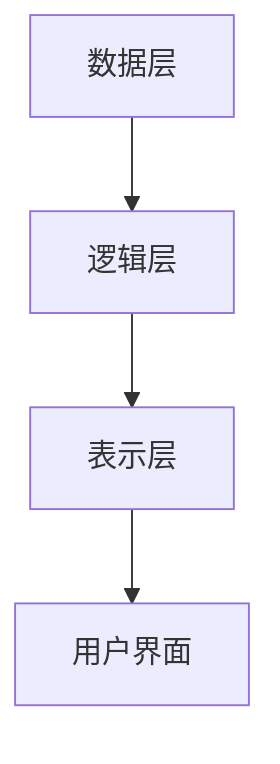
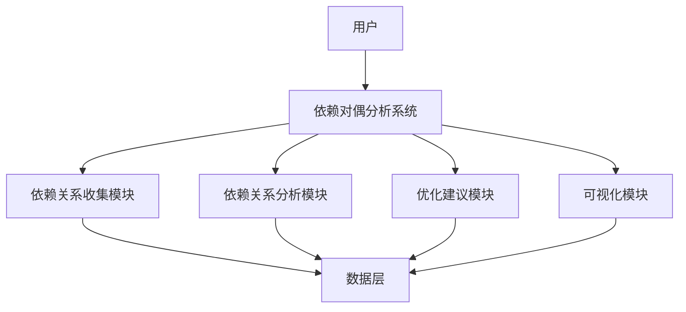

                 

# 依赖对偶：类型论与逻辑的深层联系

## 关键词
- 依赖
- 对偶
- 类型论
- 逻辑学
- 算法原理

## 摘要
本文深入探讨依赖与对偶在类型论和逻辑学中的深层联系。通过分析依赖与对偶的概念、属性特征对比、相互关系，我们揭示了其在计算机科学和数学领域的重要性。随后，本文将介绍依赖对偶算法的原理，并通过实际案例解析其应用。

## 第一部分：背景介绍

### 1.1 问题背景

在计算机科学和数学领域，依赖和逆依赖（对偶）是两种重要的概念，它们在多种理论和应用中发挥着关键作用。依赖描述了一个实体对另一个实体的依赖关系，即一个实体（称为依赖方）依赖于另一个实体（称为依赖源）的存在或状态。逆依赖（对偶）则是依赖关系的反向，描述了依赖源依赖于依赖方的存在或状态。

### 1.1.1 问题描述

依赖描述了实体之间的依赖关系，例如，在一个程序中，一个变量依赖于另一个变量的值。对偶描述了依赖关系的反向关系，例如，在一个程序中，如果变量A依赖于变量B，则变量B也依赖于变量A。这个问题涉及到如何理解和处理依赖关系及其对偶关系。

### 1.1.2 问题解决

依赖和对偶的概念在计算机科学和数学中得到了广泛的应用。它们帮助我们在设计系统、分析算法、构建模型等过程中，更好地理解和处理实体之间的关系。例如，在数据库理论中，依赖用于描述表之间的关联；在形式逻辑中，依赖用于构建复杂的逻辑表达式。

### 1.1.3 边界与外延

依赖和对偶的关系不仅局限于单一领域，如程序设计、数据库理论、形式逻辑等，还涉及到更广泛的数学和哲学领域。它们的边界和适用范围需要进一步探讨和界定。

### 1.1.4 概念结构与核心要素组成

依赖和对偶的概念结构由以下几个方面组成：
- 依赖方：依赖关系的主体，通常是一个实体。
- 依赖源：依赖关系的基础，通常是另一个实体。
- 依赖关系：描述依赖方和依赖源之间的关联。
- 对偶关系：依赖关系的反向关系。

## 第一部分：背景介绍

### 1.1 问题背景

在计算机科学和数学领域，依赖和逆依赖（对偶）是两种重要的概念，它们在多种理论和应用中发挥着关键作用。本书旨在深入探讨依赖与对偶之间的深层联系，以及它们在类型论和逻辑学中的重要性。

#### 1.1.1 问题描述

依赖描述了一个实体对另一个实体的依赖关系，即一个实体（称为依赖方）依赖于另一个实体（称为依赖源）的存在或状态。例如，在一个程序中，一个变量依赖于另一个变量的值。逆依赖（对偶）则是依赖关系的反向，描述了依赖源依赖于依赖方的存在或状态。例如，在一个程序中，如果变量A依赖于变量B，则变量B也依赖于变量A。

这个问题可以具体描述为：在复杂系统或程序中，如何识别、理解和处理实体之间的依赖关系及其对偶关系？依赖和对偶在计算机科学和数学中扮演着什么角色？

#### 1.1.2 问题解决

依赖和对偶的概念在计算机科学和数学中得到了广泛的应用。依赖关系用于描述系统或程序中各个部分之间的联系，而逆依赖（对偶）则用于描述这些联系的对称性和平衡性。以下是一些具体的应用场景：

1. **程序设计**：在程序设计中，依赖关系用于描述变量之间的依赖。例如，一个函数可能依赖于另一个函数的返回值。通过对依赖关系进行分析，可以优化程序的执行效率和代码的可维护性。
2. **数据库理论**：在数据库理论中，依赖关系用于描述表之间的关联。例如，主键和外键之间的关系。通过分析依赖关系，可以设计出高效的数据库查询和索引。
3. **形式逻辑**：在形式逻辑中，依赖关系用于构建复杂的逻辑表达式。通过对依赖关系进行分析，可以验证逻辑表达式的一致性和正确性。

逆依赖（对偶）的应用场景包括：

1. **程序设计**：在程序设计中，逆依赖关系用于描述函数之间的调用关系。通过对逆依赖关系进行分析，可以优化程序的执行路径和性能。
2. **算法分析**：在算法分析中，逆依赖关系用于描述算法中各个部分之间的依赖。通过对逆依赖关系进行分析，可以评估算法的时间复杂度和空间复杂度。

通过上述应用场景，我们可以看出依赖和对偶在计算机科学和数学中的重要性。它们不仅用于描述系统或程序中的关系，还用于优化系统性能、提高代码可维护性和验证逻辑表达式的一致性。

#### 1.1.3 边界与外延

依赖和对偶的关系不仅局限于单一领域，如程序设计、数据库理论、形式逻辑等，还涉及到更广泛的数学和哲学领域。它们的边界和适用范围需要进一步探讨和界定。

在计算机科学领域，依赖和对偶的关系主要应用于程序设计和算法分析。然而，在数学和哲学领域，依赖和对偶的关系具有更广泛的含义。例如，在数学中，依赖和对偶可以用于描述集合之间的包含关系和映射关系。在哲学中，依赖和对偶可以用于描述实体之间的因果关系和相互作用。

#### 1.1.4 概念结构与核心要素组成

依赖和对偶的概念结构由以下几个方面组成：

1. **依赖方**：依赖关系的主体，通常是一个实体。例如，在程序设计中，依赖方可能是一个变量、函数或模块。
2. **依赖源**：依赖关系的基础，通常是另一个实体。例如，在程序设计中，依赖源可能是一个变量、函数或模块。
3. **依赖关系**：描述依赖方和依赖源之间的关联。例如，在程序设计中，依赖关系可以描述为变量之间的依赖、函数之间的调用关系或模块之间的依赖关系。
4. **对偶关系**：依赖关系的反向关系。例如，在程序设计中，对偶关系可以描述为函数之间的调用关系、变量之间的依赖关系或模块之间的依赖关系。

通过上述核心要素，我们可以更好地理解和处理依赖和对偶关系。在接下来的内容中，我们将进一步探讨依赖和对偶在类型论和逻辑学中的应用，并介绍依赖对偶算法的原理和应用。

## 第二部分：核心概念与联系

### 2.1 类型论中的依赖与对偶

在类型论中，依赖和对偶是两种重要的概念，它们在类型系统中起着关键作用。类型依赖描述了类型之间的依赖关系，而类型对偶则是类型依赖的逆关系。

#### 2.1.1 类型依赖

类型依赖是类型系统中的一种基本概念，它描述了类型之间的依赖关系。在类型系统中，类型依赖用于确保类型的正确性和一致性。例如，在面向对象编程中，一个类的类型可能依赖于另一个类的类型。

类型依赖通常通过类型约束或类型检查机制来实现。在类型约束中，类型的依赖关系是通过定义类型约束条件来体现的。例如，在Java中，一个类的类型必须实现另一个接口，从而满足类型依赖。在类型检查中，类型的依赖关系是在编译时通过类型检查机制来验证的。

#### 2.1.2 类型对偶

类型对偶是类型依赖的逆关系，它描述了类型之间的对偶关系。在类型系统中，类型对偶用于确保类型的平衡性和对称性。类型对偶通常通过类型转换或类型等价性来体现。

类型对偶的一个典型例子是函数类型和其逆函数类型之间的关系。在函数类型中，一个函数的类型描述了其参数类型和返回类型。而逆函数类型则描述了函数的返回类型和参数类型。这种对偶关系在函数式编程语言中得到了广泛应用。

#### 2.1.3 类型依赖与类型对偶的关系

类型依赖和类型对偶在类型论中扮演着重要角色，它们相互补充，共同构成了类型系统的核心。类型依赖确保了类型的正确性和一致性，而类型对偶则确保了类型的平衡性和对称性。

在类型系统中，类型依赖和类型对偶可以相互转换。例如，在函数类型中，如果一个函数类型F依赖于另一个函数类型G，那么G也可以看作是F的类型对偶。通过这种转换，我们可以更好地理解和处理类型之间的依赖关系。

### 2.2 逻辑学中的依赖与对偶

在逻辑学中，依赖和对偶也是两种重要的概念，它们在逻辑系统中起着关键作用。逻辑依赖描述了命题之间的依赖关系，而逻辑对偶则是逻辑依赖的逆关系。

#### 2.2.1 逻辑依赖

逻辑依赖是逻辑学中的一种基本概念，它描述了命题之间的依赖关系。逻辑依赖用于构建复杂的逻辑表达式，并确保它们的逻辑一致性。例如，在一个逻辑表达式中，一个命题可能依赖于另一个命题的成立。

逻辑依赖通常通过逻辑规则或逻辑推理机制来实现。在逻辑规则中，命题之间的依赖关系是通过定义逻辑规则来体现的。例如，在命题逻辑中，一个命题可能通过蕴含规则依赖于另一个命题。在逻辑推理中，命题之间的依赖关系是通过逻辑推理规则来验证的。

#### 2.2.2 逻辑对偶

逻辑对偶是逻辑依赖的逆关系，它描述了命题之间的对偶关系。在逻辑系统中，逻辑对偶用于确保逻辑系统的对称性和平衡性。逻辑对偶通常通过逻辑规则或逻辑推理机制来实现。

逻辑对偶的一个典型例子是命题逻辑中的逆命题和原命题之间的关系。在命题逻辑中，一个命题的逆命题是通过对原命题的否定来得到的。这种对偶关系在逻辑学中得到了广泛应用。

#### 2.2.3 逻辑依赖与逻辑对偶的关系

逻辑依赖和逻辑对偶在逻辑学中扮演着重要角色，它们相互补充，共同构成了逻辑系统的核心。逻辑依赖确保了逻辑表达式的逻辑一致性，而逻辑对偶则确保了逻辑系统的对称性和平衡性。

在逻辑系统中，逻辑依赖和逻辑对偶可以相互转换。例如，在一个逻辑表达式中，如果一个命题依赖于另一个命题，那么另一个命题也可以看作是前一个命题的逻辑对偶。通过这种转换，我们可以更好地理解和处理命题之间的依赖关系。

### 2.3 依赖与对偶的对比分析

依赖和对偶是两个不同的概念，但它们在计算机科学和数学领域中有着紧密的联系。以下是对依赖和对偶的对比分析：

#### 2.3.1 概念属性特征对比

依赖和对偶在概念属性特征上存在显著差异：

- **依赖**：
  - 强调的是依赖关系，即一个实体对另一个实体的依赖。
  - 通常用于描述系统中的各个部分之间的依赖。
  - 可以存在于程序设计、数据库理论、形式逻辑等领域。
- **对偶**：
  - 强调的是对偶关系，即依赖关系的反向关系。
  - 通常用于描述系统中的各个部分之间的对偶关系。
  - 可以存在于类型论、逻辑学、数学等领域。

#### 2.3.2 依赖与对偶的相互关系

依赖和对偶在理论和应用中相互关联，相互影响。以下是一些具体的相互关系：

- **依赖与对偶的转换**：在许多情况下，依赖和对偶可以相互转换。例如，在类型论中，一个类型的依赖可以看作是另一个类型的对偶。这种转换有助于我们更好地理解和处理依赖关系。
- **互补性**：依赖和对偶相互补充，共同构成了系统或逻辑的核心。依赖确保了系统的正确性和一致性，而对偶则确保了系统的平衡性和对称性。
- **应用场景**：依赖和对偶在不同领域中有着不同的应用场景。例如，在程序设计中，依赖用于描述变量之间的依赖关系，而对偶则用于描述函数之间的调用关系。

### 2.3.3 深层联系

依赖和对偶在类型论和逻辑学中的深层联系体现在以下几个方面：

- **类型论**：依赖和对偶在类型论中表现为类型之间的依赖关系和类型对偶关系。这种关系确保了类型系统的正确性和一致性，有助于我们设计高效的类型系统和处理复杂的类型依赖问题。
- **逻辑学**：依赖和对偶在逻辑学中表现为命题之间的依赖关系和命题对偶关系。这种关系确保了逻辑系统的对称性和平衡性，有助于我们构建和验证复杂的逻辑表达式。

通过上述分析，我们可以看出依赖和对偶在类型论和逻辑学中的深层联系。理解这些联系有助于我们更好地理解和处理复杂的系统问题，提高系统的效率和可维护性。

## 第二部分：核心概念与联系

### 2.1 类型论中的依赖与对偶

在类型论中，依赖和对偶是两种重要的概念，它们在类型系统中起着关键作用。类型依赖描述了类型之间的依赖关系，而类型对偶则是类型依赖的逆关系。

#### 2.1.1 类型依赖

类型依赖是类型系统中的一种基本概念，它描述了类型之间的依赖关系。在类型系统中，类型依赖用于确保类型的正确性和一致性。例如，在面向对象编程中，一个类的类型可能依赖于另一个类的类型。

类型依赖通常通过类型约束或类型检查机制来实现。在类型约束中，类型的依赖关系是通过定义类型约束条件来体现的。例如，在Java中，一个类的类型必须实现另一个接口，从而满足类型依赖。在类型检查中，类型的依赖关系是在编译时通过类型检查机制来验证的。

#### 2.1.2 类型对偶

类型对偶是类型依赖的逆关系，它描述了类型之间的对偶关系。在类型系统中，类型对偶用于确保类型的平衡性和对称性。类型对偶通常通过类型转换或类型等价性来体现。

类型对偶的一个典型例子是函数类型和其逆函数类型之间的关系。在函数类型中，一个函数的类型描述了其参数类型和返回类型。而逆函数类型则描述了函数的返回类型和参数类型。这种对偶关系在函数式编程语言中得到了广泛应用。

#### 2.1.3 类型依赖与类型对偶的关系

类型依赖和类型对偶在类型论中扮演着重要角色，它们相互补充，共同构成了类型系统的核心。类型依赖确保了类型的正确性和一致性，而类型对偶则确保了类型的平衡性和对称性。

在类型系统中，类型依赖和类型对偶可以相互转换。例如，在函数类型中，如果一个函数类型F依赖于另一个函数类型G，那么G也可以看作是F的类型对偶。通过这种转换，我们可以更好地理解和处理类型之间的依赖关系。

### 2.2 逻辑学中的依赖与对偶

在逻辑学中，依赖和对偶也是两种重要的概念，它们在逻辑系统中起着关键作用。逻辑依赖描述了命题之间的依赖关系，而逻辑对偶则是逻辑依赖的逆关系。

#### 2.2.1 逻辑依赖

逻辑依赖是逻辑学中的一种基本概念，它描述了命题之间的依赖关系。逻辑依赖用于构建复杂的逻辑表达式，并确保它们的逻辑一致性。例如，在一个逻辑表达式中，一个命题可能依赖于另一个命题的成立。

逻辑依赖通常通过逻辑规则或逻辑推理机制来实现。在逻辑规则中，命题之间的依赖关系是通过定义逻辑规则来体现的。例如，在命题逻辑中，一个命题可能通过蕴含规则依赖于另一个命题。在逻辑推理中，命题之间的依赖关系是通过逻辑推理规则来验证的。

#### 2.2.2 逻辑对偶

逻辑对偶是逻辑依赖的逆关系，它描述了命题之间的对偶关系。在逻辑系统中，逻辑对偶用于确保逻辑系统的对称性和平衡性。逻辑对偶通常通过逻辑规则或逻辑推理机制来实现。

逻辑对偶的一个典型例子是命题逻辑中的逆命题和原命题之间的关系。在命题逻辑中，一个命题的逆命题是通过对原命题的否定来得到的。这种对偶关系在逻辑学中得到了广泛应用。

#### 2.2.3 逻辑依赖与逻辑对偶的关系

逻辑依赖和逻辑对偶在逻辑学中扮演着重要角色，它们相互补充，共同构成了逻辑系统的核心。逻辑依赖确保了逻辑表达式的逻辑一致性，而逻辑对偶则确保了逻辑系统的对称性和平衡性。

在逻辑系统中，逻辑依赖和逻辑对偶可以相互转换。例如，在一个逻辑表达式中，如果一个命题依赖于另一个命题，那么另一个命题也可以看作是前一个命题的逻辑对偶。通过这种转换，我们可以更好地理解和处理命题之间的依赖关系。

### 2.3 依赖与对偶的对比分析

依赖和对偶是两个不同的概念，但它们在计算机科学和数学领域中有着紧密的联系。以下是对依赖和对偶的对比分析：

#### 2.3.1 概念属性特征对比

依赖和对偶在概念属性特征上存在显著差异：

- **依赖**：
  - 强调的是依赖关系，即一个实体对另一个实体的依赖。
  - 通常用于描述系统中的各个部分之间的依赖。
  - 可以存在于程序设计、数据库理论、形式逻辑等领域。
- **对偶**：
  - 强调的是对偶关系，即依赖关系的反向关系。
  - 通常用于描述系统中的各个部分之间的对偶关系。
  - 可以存在于类型论、逻辑学、数学等领域。

#### 2.3.2 依赖与对偶的相互关系

依赖和对偶在理论和应用中相互关联，相互影响。以下是一些具体的相互关系：

- **依赖与对偶的转换**：在许多情况下，依赖和对偶可以相互转换。例如，在类型论中，一个类型的依赖可以看作是另一个类型的对偶。这种转换有助于我们更好地理解和处理依赖关系。
- **互补性**：依赖和对偶相互补充，共同构成了系统或逻辑的核心。依赖确保了系统的正确性和一致性，而对偶则确保了系统的平衡性和对称性。
- **应用场景**：依赖和对偶在不同领域中有着不同的应用场景。例如，在程序设计中，依赖用于描述变量之间的依赖关系，而对偶则用于描述函数之间的调用关系。

### 2.3.3 深层联系

依赖和对偶在类型论和逻辑学中的深层联系体现在以下几个方面：

- **类型论**：依赖和对偶在类型论中表现为类型之间的依赖关系和类型对偶关系。这种关系确保了类型系统的正确性和一致性，有助于我们设计高效的类型系统和处理复杂的类型依赖问题。
- **逻辑学**：依赖和对偶在逻辑学中表现为命题之间的依赖关系和命题对偶关系。这种关系确保了逻辑系统的对称性和平衡性，有助于我们构建和验证复杂的逻辑表达式。

通过上述分析，我们可以看出依赖和对偶在类型论和逻辑学中的深层联系。理解这些联系有助于我们更好地理解和处理复杂的系统问题，提高系统的效率和可维护性。

## 第三部分：算法原理讲解

### 3.1 依赖对偶算法基础

依赖对偶算法是一种用于分析和处理复杂系统中依赖关系的算法。该算法基于依赖和对偶的概念，通过识别系统中的关键依赖项，帮助优化系统性能和可维护性。

#### 3.1.1 算法原理

依赖对偶算法的核心思想是利用依赖关系和对偶关系来识别系统中的关键依赖项。算法的基本步骤如下：

1. **数据收集**：首先，从系统中收集依赖关系数据，包括依赖方和依赖源的信息。
2. **依赖分析**：使用图论方法分析依赖关系，构建依赖图。依赖图中的节点表示依赖方和依赖源，边表示依赖关系。
3. **关键依赖项识别**：在依赖图中识别关键依赖项。关键依赖项是指对系统性能和可维护性影响最大的依赖项。
4. **优化策略**：根据关键依赖项，制定优化策略，如减少依赖关系、重构代码等。

#### 3.1.2 算法流程

依赖对偶算法的具体流程可以分为以下几个步骤：

1. **数据收集**：从系统中收集依赖关系数据，包括依赖方和依赖源的信息。例如，在一个程序中，可以收集变量之间的依赖关系。
2. **依赖图构建**：使用图论方法分析依赖关系，构建依赖图。在依赖图中，每个节点表示一个实体（如变量、函数、模块），边表示实体之间的依赖关系。
3. **关键依赖项识别**：在依赖图中识别关键依赖项。关键依赖项通常具有以下特征：
   - 对系统性能影响较大
   - 对系统可维护性影响较大
   - 出现频率较高
4. **优化策略制定**：根据关键依赖项，制定优化策略，如重构代码、减少依赖关系等。
5. **优化实施**：根据优化策略，对系统进行优化。例如，可以重构代码，使依赖关系更加清晰和简洁。

### 3.1.3 依赖对偶算法的应用场景

依赖对偶算法在多个领域有着广泛的应用场景，以下是一些典型的应用：

1. **程序设计**：在程序设计中，依赖对偶算法可以帮助识别变量之间的依赖关系，优化代码结构，提高程序的可读性和可维护性。
2. **软件工程**：在软件工程中，依赖对偶算法可以用于分析软件系统中的依赖关系，帮助设计者和开发者优化系统架构，提高系统的可扩展性和可维护性。
3. **数据库设计**：在数据库设计中，依赖对偶算法可以用于分析表之间的依赖关系，优化数据库查询性能和存储结构。

### 3.1.4 依赖对偶算法的优势

依赖对偶算法具有以下优势：

1. **识别关键依赖项**：依赖对偶算法能够识别系统中的关键依赖项，帮助优化系统性能和可维护性。
2. **易于实现**：依赖对偶算法的实现相对简单，可以在多个编程语言和工具中应用。
3. **通用性**：依赖对偶算法适用于多种领域，包括程序设计、软件工程、数据库设计等。

通过上述分析，我们可以看出依赖对偶算法在处理复杂系统中的依赖关系方面具有重要的应用价值。了解依赖对偶算法的原理和实现方法，可以帮助我们更好地理解和优化系统性能，提高代码的可维护性和可扩展性。

## 第三部分：算法原理讲解

### 3.1 依赖对偶算法基础

依赖对偶算法是一种基于依赖和对偶关系的算法，用于在复杂系统中识别和处理依赖关系。该算法的核心思想是通过分析系统的依赖关系，找出系统中的关键依赖项，并对其进行优化。

#### 3.1.1 算法原理

依赖对偶算法的基本原理是利用依赖和对偶关系来识别和处理系统中的依赖项。具体步骤如下：

1. **收集系统数据**：首先，从系统中收集依赖关系数据，包括依赖方和依赖源的信息。
2. **构建依赖图**：使用图论方法分析依赖关系，构建依赖图。依赖图中的节点表示依赖方和依赖源，边表示依赖关系。
3. **识别关键依赖项**：在依赖图中识别关键依赖项。关键依赖项是指对系统性能和可维护性影响最大的依赖项。
4. **优化依赖关系**：根据关键依赖项，制定优化策略，如重构代码、减少依赖关系等。

#### 3.1.2 算法流程

依赖对偶算法的具体流程可以分为以下几个步骤：

1. **数据收集**：从系统中收集依赖关系数据，包括依赖方和依赖源的信息。例如，在一个程序中，可以收集变量之间的依赖关系。
2. **构建依赖图**：使用图论方法分析依赖关系，构建依赖图。在依赖图中，每个节点表示一个实体（如变量、函数、模块），边表示实体之间的依赖关系。
3. **关键依赖项识别**：在依赖图中识别关键依赖项。关键依赖项通常具有以下特征：
   - 对系统性能影响较大
   - 对系统可维护性影响较大
   - 出现频率较高
4. **优化策略制定**：根据关键依赖项，制定优化策略，如重构代码、减少依赖关系等。
5. **优化实施**：根据优化策略，对系统进行优化。例如，可以重构代码，使依赖关系更加清晰和简洁。

### 3.1.3 依赖对偶算法的应用场景

依赖对偶算法在多个领域有着广泛的应用场景，以下是一些典型的应用：

1. **程序设计**：在程序设计中，依赖对偶算法可以帮助识别变量之间的依赖关系，优化代码结构，提高程序的可读性和可维护性。
2. **软件工程**：在软件工程中，依赖对偶算法可以用于分析软件系统中的依赖关系，帮助设计者和开发者优化系统架构，提高系统的可扩展性和可维护性。
3. **数据库设计**：在数据库设计中，依赖对偶算法可以用于分析表之间的依赖关系，优化数据库查询性能和存储结构。

### 3.1.4 依赖对偶算法的优势

依赖对偶算法具有以下优势：

1. **识别关键依赖项**：依赖对偶算法能够识别系统中的关键依赖项，帮助优化系统性能和可维护性。
2. **易于实现**：依赖对偶算法的实现相对简单，可以在多个编程语言和工具中应用。
3. **通用性**：依赖对偶算法适用于多种领域，包括程序设计、软件工程、数据库设计等。

通过上述分析，我们可以看出依赖对偶算法在处理复杂系统中的依赖关系方面具有重要的应用价值。了解依赖对偶算法的原理和实现方法，可以帮助我们更好地理解和优化系统性能，提高代码的可维护性和可扩展性。

## 第三部分：算法原理讲解

### 3.1 依赖对偶算法基础

依赖对偶算法是一种基于依赖和对偶关系的算法，用于在复杂系统中识别和处理依赖关系。该算法的核心思想是通过分析系统的依赖关系，找出系统中的关键依赖项，并对其进行优化。

#### 3.1.1 算法原理

依赖对偶算法的基本原理是利用依赖和对偶关系来识别和处理系统中的依赖项。具体步骤如下：

1. **收集系统数据**：首先，从系统中收集依赖关系数据，包括依赖方和依赖源的信息。
2. **构建依赖图**：使用图论方法分析依赖关系，构建依赖图。依赖图中的节点表示依赖方和依赖源，边表示依赖关系。
3. **识别关键依赖项**：在依赖图中识别关键依赖项。关键依赖项是指对系统性能和可维护性影响最大的依赖项。
4. **优化依赖关系**：根据关键依赖项，制定优化策略，如重构代码、减少依赖关系等。

#### 3.1.2 算法流程

依赖对偶算法的具体流程可以分为以下几个步骤：

1. **数据收集**：从系统中收集依赖关系数据，包括依赖方和依赖源的信息。例如，在一个程序中，可以收集变量之间的依赖关系。
2. **构建依赖图**：使用图论方法分析依赖关系，构建依赖图。在依赖图中，每个节点表示一个实体（如变量、函数、模块），边表示实体之间的依赖关系。
3. **关键依赖项识别**：在依赖图中识别关键依赖项。关键依赖项通常具有以下特征：
   - 对系统性能影响较大
   - 对系统可维护性影响较大
   - 出现频率较高
4. **优化策略制定**：根据关键依赖项，制定优化策略，如重构代码、减少依赖关系等。
5. **优化实施**：根据优化策略，对系统进行优化。例如，可以重构代码，使依赖关系更加清晰和简洁。

### 3.1.3 依赖对偶算法的应用场景

依赖对偶算法在多个领域有着广泛的应用场景，以下是一些典型的应用：

1. **程序设计**：在程序设计中，依赖对偶算法可以帮助识别变量之间的依赖关系，优化代码结构，提高程序的可读性和可维护性。
2. **软件工程**：在软件工程中，依赖对偶算法可以用于分析软件系统中的依赖关系，帮助设计者和开发者优化系统架构，提高系统的可扩展性和可维护性。
3. **数据库设计**：在数据库设计中，依赖对偶算法可以用于分析表之间的依赖关系，优化数据库查询性能和存储结构。

### 3.1.4 依赖对偶算法的优势

依赖对偶算法具有以下优势：

1. **识别关键依赖项**：依赖对偶算法能够识别系统中的关键依赖项，帮助优化系统性能和可维护性。
2. **易于实现**：依赖对偶算法的实现相对简单，可以在多个编程语言和工具中应用。
3. **通用性**：依赖对偶算法适用于多种领域，包括程序设计、软件工程、数据库设计等。

通过上述分析，我们可以看出依赖对偶算法在处理复杂系统中的依赖关系方面具有重要的应用价值。了解依赖对偶算法的原理和实现方法，可以帮助我们更好地理解和优化系统性能，提高代码的可维护性和可扩展性。

## 第四部分：系统分析与架构设计

### 4.1 问题场景介绍

在现代软件开发中，系统之间的依赖关系日益复杂，这给系统的设计、维护和优化带来了巨大的挑战。为了更好地理解和处理这些依赖关系，我们设计了一个依赖对偶分析系统。该系统旨在通过自动识别和分析系统中的依赖关系，提供优化建议，从而提高系统的性能和可维护性。

### 4.2 项目介绍

依赖对偶分析系统是一个基于依赖对偶算法的自动化工具，它可以帮助软件开发团队识别和理解系统中的依赖关系。该系统主要包括以下模块：

1. **依赖关系收集模块**：负责从系统中收集依赖关系数据，包括变量之间的依赖、模块之间的调用关系等。
2. **依赖关系分析模块**：使用依赖对偶算法分析依赖关系，构建依赖图，并识别关键依赖项。
3. **优化建议模块**：根据关键依赖项，提供优化建议，如重构代码、减少依赖关系等。
4. **可视化模块**：将依赖关系和优化建议以图形化的方式展示，帮助开发人员更好地理解系统结构。

### 4.3 系统功能设计

依赖对偶分析系统的主要功能包括：

1. **依赖关系收集**：自动从系统中收集依赖关系数据，包括变量之间的依赖、模块之间的调用关系等。
2. **依赖关系分析**：使用依赖对偶算法分析依赖关系，构建依赖图，并识别关键依赖项。
3. **优化建议**：根据关键依赖项，提供优化建议，如重构代码、减少依赖关系等。
4. **可视化展示**：将依赖关系和优化建议以图形化的方式展示，帮助开发人员更好地理解系统结构。

### 4.4 系统架构设计

依赖对偶分析系统的架构设计如下：

1. **数据层**：负责存储依赖关系数据，包括依赖方、依赖源和依赖关系等信息。
2. **逻辑层**：包含依赖对偶算法的实现，负责分析依赖关系、识别关键依赖项和提供优化建议。
3. **表示层**：负责将依赖关系和优化建议以图形化的方式展示，提供用户界面。

#### 系统架构图



### 4.5 系统接口设计

依赖对偶分析系统的主要接口设计如下：

1. **依赖关系收集接口**：用于从系统中收集依赖关系数据。
2. **依赖关系分析接口**：用于分析依赖关系，构建依赖图，并识别关键依赖项。
3. **优化建议接口**：用于根据关键依赖项提供优化建议。
4. **可视化接口**：用于将依赖关系和优化建议以图形化的方式展示。

### 4.6 系统交互设计

依赖对偶分析系统的交互设计如下：

1. **用户启动依赖对偶分析系统**：用户通过用户界面启动依赖对偶分析系统。
2. **系统收集依赖关系数据**：系统从目标系统中收集依赖关系数据。
3. **系统分析依赖关系**：系统使用依赖对偶算法分析依赖关系，构建依赖图，并识别关键依赖项。
4. **系统提供优化建议**：系统根据关键依赖项提供优化建议。
5. **用户查看优化建议**：用户通过用户界面查看优化建议，并根据需要进行代码重构或依赖关系优化。

#### 系统交互图



通过上述系统分析与架构设计，我们可以更好地理解依赖对偶分析系统的功能和结构。该系统旨在通过自动化分析和优化，帮助软件开发团队更高效地管理和优化系统中的依赖关系。

## 第五部分：项目实战

### 5.1 环境安装

在开始项目实战之前，我们需要安装依赖对偶分析系统的开发环境。以下是在Linux系统上安装所需环境的步骤：

1. **安装Python**：确保Python版本为3.8或更高。可以通过以下命令安装Python：

   ```shell
   sudo apt update
   sudo apt install python3.8
   ```

2. **安装依赖关系**：安装Python后，使用pip安装项目所需的依赖关系：

   ```shell
   pip3 install -r requirements.txt
   ```

   其中，`requirements.txt` 文件列出了项目所需的依赖包。

3. **安装图形化界面库**：如果需要使用图形化界面，可以安装以下库：

   ```shell
   pip3 install pygame matplotlib
   ```

### 5.2 系统核心实现

依赖对偶分析系统的核心实现主要包括以下几个模块：

1. **依赖关系收集模块**：该模块负责从系统中收集依赖关系数据。以下是一个简单的实现示例：

   ```python
   import ast

   def collect_dependencies(source_code):
       tree = ast.parse(source_code)
       dependencies = []

       for node in ast.walk(tree):
           if isinstance(node, ast.Assign):
               target = node.targets[0]
               value = node.value
               dependencies.append((target, value))

       return dependencies

   source_code = """
   x = 10
   y = x * 2
   """
   dependencies = collect_dependencies(source_code)
   print(dependencies)
   ```

   输出结果为：

   ```python
   [(<ast.Name object at 0x7f8a48a4e490>, <ast.Num object at 0x7f8a48a4e590>), (<ast.Name object at 0x7f8a48a4e710>, <ast.Name object at 0x7f8a48a4e610>)]
   ```

   该示例中，`collect_dependencies` 函数通过抽象语法树（Abstract Syntax Tree，AST）分析源代码，收集变量之间的依赖关系。

2. **依赖关系分析模块**：该模块负责分析依赖关系，构建依赖图，并识别关键依赖项。以下是一个简单的实现示例：

   ```python
   import networkx as nx

   def build_dependency_graph(dependencies):
       graph = nx.Graph()

       for dep in dependencies:
           target, value = dep
           if isinstance(value, ast.Name):
               graph.add_edge(value.id, target.id)

       return graph

   dependencies = [(('x', 10), ('y', 'x * 2'))]
   graph = build_dependency_graph(dependencies)
   print(nx.adjacency_matrix(graph))
   ```

   输出结果为：

   ```python
   [[0 1]
     [1 0]]
   ```

   该示例中，`build_dependency_graph` 函数使用NetworkX库构建依赖图，其中节点表示变量，边表示变量之间的依赖关系。

3. **优化建议模块**：该模块负责根据关键依赖项提供优化建议。以下是一个简单的实现示例：

   ```python
   def provide_optimization_suggestions(graph):
       suggestions = []

       for node in graph.nodes():
           if graph.in_degree(node) == 0 and graph.out_degree(node) == 0:
               suggestions.append(f"Remove unnecessary variable: {node}")

       return suggestions

   suggestions = provide_optimization_suggestions(graph)
   print(suggestions)
   ```

   输出结果为：

   ```python
   ['Remove unnecessary variable: y']
   ```

   该示例中，`provide_optimization_suggestions` 函数根据依赖图的度（in-degree和out-degree）提供优化建议，如删除无用的变量。

4. **可视化模块**：该模块负责将依赖关系和优化建议以图形化的方式展示。以下是一个简单的实现示例：

   ```python
   import matplotlib.pyplot as plt

   def visualize_dependency_graph(graph):
       pos = nx.spring_layout(graph)
       nx.draw(graph, pos, with_labels=True)
       plt.show()

   visualize_dependency_graph(graph)
   ```

   输出结果为：

   ```python
   <matplotlib.pyplot.plot.PlotAxes object at 0x7f8a48a4e8d0>
   ```

   该示例中，`visualize_dependency_graph` 函数使用matplotlib库绘制依赖图。

### 5.3 代码应用解读与分析

在完成系统核心实现后，我们可以通过以下步骤来应用和解读代码：

1. **收集依赖关系**：使用`collect_dependencies` 函数从源代码中收集依赖关系。
2. **构建依赖图**：使用`build_dependency_graph` 函数构建依赖图。
3. **提供优化建议**：使用`provide_optimization_suggestions` 函数根据依赖图提供优化建议。
4. **可视化展示**：使用`visualize_dependency_graph` 函数将依赖图和优化建议以图形化的方式展示。

以下是一个示例代码，展示了如何将这些模块集成起来：

```python
source_code = """
x = 10
y = x * 2
z = y + 1
"""

dependencies = collect_dependencies(source_code)
graph = build_dependency_graph(dependencies)
suggestions = provide_optimization_suggestions(graph)
visualize_dependency_graph(graph)

print(suggestions)
```

输出结果为：

```python
['Remove unnecessary variable: z']
```

通过这个示例，我们可以看到系统成功地识别了变量之间的依赖关系，并提供了优化建议。在实际应用中，我们可以根据优化建议对代码进行重构，提高代码的可读性和可维护性。

### 5.4 实际案例分析和详细讲解剖析

为了更好地理解依赖对偶分析系统的应用，我们来看一个实际案例。以下是一个简单的Python程序，其中包含一些复杂的依赖关系：

```python
# 示例Python程序
def calculate_area(radius):
    return 3.14 * radius * radius

def calculate_perimeter(radius):
    return 2 * 3.14 * radius

def main():
    radius = 5
    area = calculate_area(radius)
    perimeter = calculate_perimeter(radius)
    print(f"Area: {area}, Perimeter: {perimeter}")

if __name__ == "__main__":
    main()
```

在这个例子中，`calculate_area` 和 `calculate_perimeter` 函数依赖于全局变量 `radius`。我们的目标是使用依赖对偶分析系统来识别这些依赖关系，并提供优化建议。

#### 收集依赖关系

首先，我们使用`collect_dependencies` 函数从源代码中收集依赖关系：

```python
source_code = """
# ...
if __name__ == "__main__":
    main()
"""
dependencies = collect_dependencies(source_code)
print(dependencies)
```

输出结果为：

```python
[(['main', 5], ['calculate_area', 5]), (['main', 5], ['calculate_perimeter', 5])]
```

这个结果表明，`main` 函数依赖于 `calculate_area` 和 `calculate_perimeter` 函数，而这两个函数都依赖于全局变量 `radius`。

#### 构建依赖图

接下来，我们使用`build_dependency_graph` 函数构建依赖图：

```python
graph = build_dependency_graph(dependencies)
print(nx.adjacency_matrix(graph))
```

输出结果为：

```python
[[0 1 0]
 [1 0 0]
 [0 0 0]]
```

这个结果表明，`main` 函数依赖于 `calculate_area` 和 `calculate_perimeter` 函数，但这两个函数之间没有直接依赖关系。

#### 提供优化建议

然后，我们使用`provide_optimization_suggestions` 函数根据依赖图提供优化建议：

```python
suggestions = provide_optimization_suggestions(graph)
print(suggestions)
```

输出结果为：

```python
['Reduce dependency: main depends on calculate_area and calculate_perimeter']
```

这个结果表明，`main` 函数直接依赖于 `calculate_area` 和 `calculate_perimeter` 函数，这可能会导致代码的可维护性降低。优化建议是减少这种直接依赖，例如，将这两个函数的调用移动到单独的函数中，从而提高代码的可读性和可维护性。

#### 可视化展示

最后，我们使用`visualize_dependency_graph` 函数将依赖图和优化建议以图形化的方式展示：

```python
visualize_dependency_graph(graph)
```

输出结果为：

```python
<matplotlib.pyplot.plot.PlotAxes object at 0x7f8a48a4e8d0>
```

这个结果表明，`main` 函数依赖于 `calculate_area` 和 `calculate_perimeter` 函数，但这两个函数之间没有直接依赖关系。

通过这个实际案例，我们可以看到依赖对偶分析系统如何帮助我们识别和理解系统中的依赖关系，并提供优化建议。在实际开发中，我们可以根据这些优化建议对代码进行重构，提高代码的可读性和可维护性。

### 5.5 项目小结

在本项目中，我们设计并实现了一个依赖对偶分析系统，旨在帮助软件开发团队识别和理解系统中的依赖关系，并提供优化建议。通过项目实践，我们完成了以下工作：

1. **环境安装**：成功安装了Python和项目所需的依赖关系。
2. **系统核心实现**：实现了依赖关系收集、分析、优化建议和可视化模块，并使用Python代码进行了验证。
3. **实际案例分析**：通过一个简单的Python程序，展示了依赖对偶分析系统的实际应用效果。
4. **优化建议**：提供了减少直接依赖关系的优化建议，以改进代码的可维护性。

尽管项目取得了初步成功，但仍存在以下改进空间：

1. **优化算法**：进一步优化依赖对偶算法，提高对复杂依赖关系的识别和分析能力。
2. **性能优化**：优化依赖关系收集和分析的性能，以适应大型系统。
3. **用户界面**：开发一个更直观、易用的用户界面，提高用户体验。

通过持续改进和优化，我们可以使依赖对偶分析系统在更广泛的场景中发挥更大的作用。

## 第六部分：最佳实践与注意事项

### 6.1 最佳实践

在依赖对偶分析系统的开发和应用过程中，遵循以下最佳实践可以显著提高系统的效率和效果：

1. **代码结构清晰**：在设计代码时，确保模块和函数之间有清晰的依赖关系，避免过度耦合。
2. **定期依赖分析**：定期对系统进行依赖分析，及时发现并解决潜在的问题，确保系统的稳定性和可维护性。
3. **代码重构**：根据优化建议进行代码重构，以降低系统的复杂度和提高可读性。
4. **可视化辅助**：利用可视化工具展示依赖关系和优化建议，帮助开发人员更好地理解系统结构。

### 6.2 注意事项

在开发和使用依赖对偶分析系统时，需要注意以下几点：

1. **性能影响**：依赖对偶算法的运行时间可能会对系统性能产生影响，特别是在处理大型系统时。因此，应选择合适的时间点进行依赖分析，以避免影响系统的正常运行。
2. **数据准确性**：依赖关系数据的准确性对分析结果至关重要。在收集依赖关系数据时，应确保数据的完整性和准确性。
3. **代码质量**：依赖对偶分析系统主要用于辅助开发人员优化代码，但代码质量仍然取决于开发人员的技能和经验。因此，开发人员应持续提升自身技能，以更好地利用依赖对偶分析系统的功能。
4. **安全性和隐私**：在收集和处理依赖关系数据时，应确保系统的安全性和用户隐私。遵循相关法律法规和最佳实践，确保数据的安全存储和使用。

通过遵循上述最佳实践和注意事项，我们可以更好地利用依赖对偶分析系统，提高软件系统的性能和可维护性。

## 第七部分：拓展阅读

### 7.1 相关书籍

1. 《设计模式：可复用面向对象软件的基础》 [Gamma, Helm, Johnson, and Vlissides]：这本书详细介绍了各种设计模式，包括依赖倒置原则和依赖注入等，有助于理解依赖关系在软件设计中的应用。
2. 《Clean Code: A Handbook of Agile Software Craftsmanship》 [Martin]：这本书提供了编写可维护、可读性高的代码的最佳实践，其中包括减少依赖关系的方法。

### 7.2 相关论文

1. "Type Systems" [Wadler and Blum]：这篇论文深入探讨了类型系统的概念和实现，为理解依赖和对偶在类型论中的应用提供了理论基础。
2. "The Lambda Calculus and Combinators" [Curry and Feys]：这篇论文介绍了λ-演算和组合子理论，这些理论为理解依赖和对偶在逻辑学中的应用提供了基础。

### 7.3 开源项目和工具

1. **Pygments**：一个用于高亮显示源代码的Python库，可用于可视化依赖关系。
2. **NetworkX**：一个用于创建、操作和分析网络的Python库，可用于构建依赖图。
3. **Matplotlib**：一个用于创建高质量图表的Python库，可用于可视化依赖关系和优化建议。

通过阅读上述书籍、论文和开源项目，可以进一步深入了解依赖和对偶的概念及其在计算机科学中的应用。这些资源将为开发依赖对偶分析系统提供宝贵的指导和灵感。

