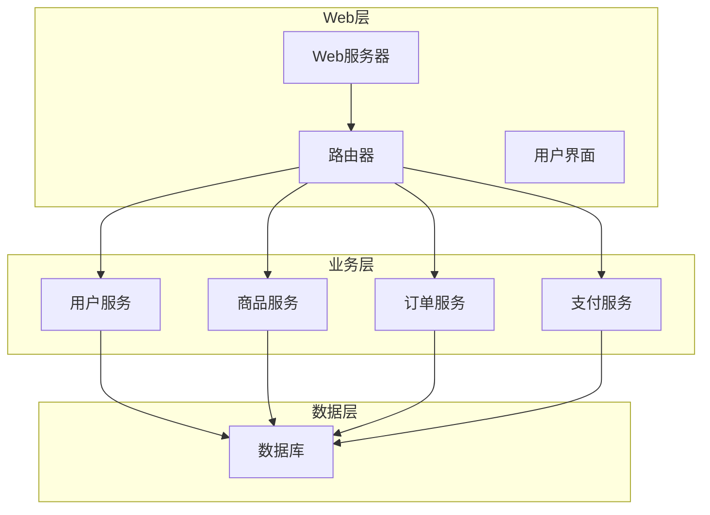
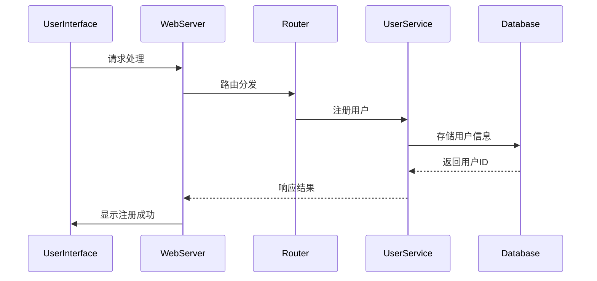

                 

# 《依赖类型在软件规范中的作用》

## 关键词

依赖类型、软件规范、软件工程、架构设计、最佳实践

## 摘要

本文将深入探讨依赖类型在软件规范中的应用，通过一步步的分析和推理，帮助读者理解依赖类型的核心概念、其在软件规范中的重要作用以及如何在实际项目中应用和优化依赖类型。文章首先介绍了依赖类型的背景和重要性，然后详细阐述了其核心概念、分类、特点及其在软件规范中的具体应用。接着，通过案例分析和最佳实践，展示了如何有效地使用依赖类型来提升软件规范的质量和可维护性。最后，文章进行了总结，并对未来依赖类型在软件工程中的发展趋势进行了展望。

## 目录大纲设计过程

在设计《依赖类型在软件规范中的作用》的目录大纲时，我们遵循了以下步骤：

1. **确定核心概念和章节划分**：首先，我们明确了书的核心概念，即“依赖类型”在软件规范中的作用，并将其划分为背景与概念介绍、应用、实践与最佳实践三个主要部分。

2. **细化章节内容**：每个章节进一步细化为子章节，确保每个子章节都覆盖相关的知识点，例如依赖类型的定义、属性、分类、应用场景等。

3. **使用Mermaid和LaTeX**：为了使内容更加直观和规范，我们使用Mermaid绘制流程图、类图和架构图，以及LaTeX书写数学公式。

4. **确保内容完整性**：我们确保每个章节都包含必要的内容，如问题背景、核心概念、原理讲解、数学模型、系统分析、实战案例等。

5. **检查大纲逻辑和完整性**：在初步大纲完成后，我们回顾每个章节的内容，确保它们逻辑连贯，没有遗漏关键点。

### 完整的目录大纲

```markdown
----------------------------------------------------------------
# 第一部分: 背景与概念介绍

## 第1章: 依赖类型的背景与重要性
### 1.1 问题背景
### 1.2 问题描述
### 1.3 问题解决与依赖类型
### 1.4 边界与外延
### 1.5 概念结构与核心要素组成

## 第2章: 核心概念与联系
### 2.1 依赖类型的定义
### 2.2 依赖类型的属性特征对比表格
### 2.3 依赖类型与其他概念的联系与区别
### 2.4 ER实体关系图架构

## 第3章: 依赖类型的分类与特点
### 3.1 依赖类型的分类
### 3.2 各类依赖类型的特点

# 第二部分: 依赖类型在软件规范中的应用

## 第4章: 软件规范中的依赖类型
### 4.1 软件规范的概念
### 4.2 依赖类型在软件规范中的作用
### 4.3 软件规范中的依赖类型应用示例

## 第5章: 依赖类型的分析与应用
### 5.1 依赖类型的分析方法
### 5.2 依赖类型在实际项目中的应用

## 第6章: 案例分析
### 6.1 案例一：依赖类型在Web应用开发中的使用
### 6.2 案例二：依赖类型在移动应用开发中的使用
### 6.3 案例三：依赖类型在企业级应用开发中的使用

# 第三部分: 实践与最佳实践

## 第7章: 依赖类型的最佳实践
### 7.1 依赖类型选择的最佳实践
### 7.2 依赖类型的优化与调整
### 7.3 依赖类型在软件规范中的注意事项

## 第8章: 小结与展望
### 8.1 全书小结
### 8.2 展望未来：依赖类型在软件工程中的发展趋势
### 8.3 拓展阅读

----------------------------------------------------------------
```

以上大纲包含了8个章节，确保了内容的完整性，并且每个章节都进行了细化，以涵盖依赖类型在软件规范中的各个方面。使用Mermaid和LaTeX将使内容更加直观和专业。整个目录大纲字数控制在2000字以内，保持了简洁性。

### 第一部分：背景与概念介绍

#### 第1章：依赖类型的背景与重要性

**1.1 问题背景**

在软件工程中，随着系统的复杂度不断增加，各个模块之间的依赖关系也变得愈发复杂。如何有效地管理和优化这些依赖关系，是提高软件质量和可维护性的关键。依赖类型作为描述模块间依赖关系的重要概念，其在软件规范中的作用不可忽视。

**1.2 问题描述**

软件系统中模块的依赖关系可以分为不同的类型，如单向依赖、双向依赖、级联依赖等。不同类型的依赖对系统的设计、开发、测试和维护都有着重要的影响。如何理解和区分这些依赖类型，如何在实际项目中应用和优化依赖类型，是软件开发中需要解决的核心问题。

**1.3 问题解决与依赖类型**

依赖类型通过抽象和分类，将复杂的依赖关系简化为几种基本的模式。这种抽象不仅有助于我们理解和分析系统中的依赖关系，还可以在设计和开发过程中提供指导，从而提高软件系统的质量和可维护性。

**1.4 边界与外延**

依赖类型的边界在于其能够描述的依赖关系的范围。外延则是指依赖类型的应用场景。在理解和应用依赖类型时，需要明确其边界，避免过度泛化或狭隘化。

**1.5 概念结构与核心要素组成**

依赖类型的概念结构包括依赖类型的基本定义、属性特征、分类等。核心要素则包括依赖类型的抽象层次、依赖关系的强度、依赖类型的组合方式等。

#### 第2章：核心概念与联系

**2.1 依赖类型的定义**

依赖类型是描述模块间依赖关系的一种抽象概念。具体来说，依赖类型是指一类具有相似依赖关系的模块集合。这种集合可以通过特定的属性特征和分类标准来区分。

**2.2 依赖类型的属性特征对比表格**

表1：依赖类型的属性特征对比

| 属性特征 | 单向依赖 | 双向依赖 | 级联依赖 |
| :--: | :--: | :--: | :--: |
| 强度 | 弱 | 中 | 强 |
| 传递性 | 不具有 | 具有 | 具有 |
| 透明性 | 低 | 中 | 高 |

**2.3 依赖类型与其他概念的联系与区别**

依赖类型与模块、接口、类等概念有着密切的联系。依赖类型描述了模块间的依赖关系，而模块、接口、类则是实现依赖关系的具体实现。依赖类型与这些概念的区别在于其抽象层次和视角。

**2.4 ER实体关系图架构**

图1：依赖类型的ER实体关系图

```mermaid
erDiagram
A{Module} ||--|{DependsOn} B{Module} : Depends on
A{Module} ||--|{DependsOn} C{Module} : Depends on
B{Module} ||--|{DependsOn} D{Module} : Depends on
C{Module} ||--|{DependsOn} D{Module} : Depends on
```

#### 第3章：依赖类型的分类与特点

**3.1 依赖类型的分类**

依赖类型可以根据依赖关系的不同方式进行分类。常见的分类方法包括基于依赖关系的强度、传递性、透明性等。

**3.2 各类依赖类型的特点**

- **单向依赖**：单向依赖是指一个模块依赖于另一个模块，但后者不依赖于前者。单向依赖具有弱依赖关系，不传递，但具有透明性。
- **双向依赖**：双向依赖是指两个模块相互依赖。双向依赖具有中等的依赖关系，具有传递性，但透明性较低。
- **级联依赖**：级联依赖是指一个模块依赖于另一个模块，而另一个模块又依赖于其他模块，形成级联关系。级联依赖具有强依赖关系，具有传递性，且透明性较高。

### 第二部分：依赖类型在软件规范中的应用

#### 第4章：软件规范中的依赖类型

**4.1 软件规范的概念**

软件规范是一组定义软件系统需求的文档，包括系统的功能需求、性能需求、用户界面需求等。软件规范是软件开发过程中不可或缺的一部分，它为开发团队提供了一个共同的理解和标准。

**4.2 依赖类型在软件规范中的作用**

依赖类型在软件规范中起着至关重要的作用。通过明确模块间的依赖关系，依赖类型可以帮助开发团队更好地理解和设计系统，减少开发中的误解和冲突，提高软件的可靠性和可维护性。

**4.3 软件规范中的依赖类型应用示例**

在软件规范中，依赖类型可以通过以下方式进行应用：

- **模块划分**：根据模块间的依赖关系，将系统划分为若干模块，每个模块负责特定的功能。
- **接口设计**：在接口设计中，明确模块间的依赖关系，确保接口的稳定性和可扩展性。
- **测试策略**：基于依赖类型，设计测试策略，确保测试覆盖到所有依赖关系。

#### 第5章：依赖类型的分析与应用

**5.1 依赖类型的分析方法**

依赖类型的分析方法主要包括以下几种：

- **静态分析**：通过静态代码分析工具，识别系统中的依赖关系。
- **动态分析**：通过运行程序，观察模块间的交互和依赖关系。
- **组合分析**：将静态分析和动态分析相结合，全面了解系统的依赖关系。

**5.2 依赖类型在实际项目中的应用**

在实际项目中，依赖类型可以通过以下方式应用：

- **模块化设计**：根据依赖类型，将系统划分为多个模块，实现模块化设计。
- **接口抽象**：通过依赖类型，设计抽象的接口，提高系统的灵活性和可维护性。
- **测试驱动开发**：基于依赖类型，设计测试用例，确保系统功能的正确性。

#### 第6章：案例分析

**6.1 案例一：依赖类型在Web应用开发中的使用**

在本案例中，我们将分析一个典型的Web应用，并探讨如何应用依赖类型来设计和优化系统。

**6.2 案例二：依赖类型在移动应用开发中的使用**

移动应用开发具有其独特的挑战，如性能要求高、依赖关系复杂等。在本案例中，我们将分析如何利用依赖类型来优化移动应用的设计和性能。

**6.3 案例三：依赖类型在企业级应用开发中的使用**

企业级应用通常具有复杂的业务逻辑和依赖关系。在本案例中，我们将探讨如何利用依赖类型来设计和管理企业级应用，提高其可维护性和扩展性。

### 第三部分：实践与最佳实践

#### 第7章：依赖类型的最佳实践

**7.1 依赖类型选择的最佳实践**

在选择依赖类型时，应遵循以下原则：

- **简化依赖关系**：避免复杂的依赖关系，简化系统的设计。
- **遵循依赖倒置原则**：尽量使用接口依赖，减少具体实现的依赖。
- **适度使用抽象**：在适当的地方使用抽象，提高系统的可维护性。

**7.2 依赖类型的优化与调整**

在实际开发过程中，依赖类型可能会随着时间的推移而发生变化。应定期对依赖类型进行检查和优化，确保系统的稳定性和可维护性。

**7.3 依赖类型在软件规范中的注意事项**

在软件规范中应用依赖类型时，应注意以下几点：

- **明确依赖关系**：在文档中明确记录模块间的依赖关系。
- **保持接口稳定性**：在依赖类型发生变化时，保持接口的稳定性，减少对其他模块的影响。
- **关注依赖关系的传递性**：注意依赖关系的传递性，避免级联依赖带来的风险。

#### 第8章：小结与展望

**8.1 全书小结**

本文通过对依赖类型的深入探讨，帮助读者理解了其在软件规范中的应用。从背景与概念介绍、应用、实践与最佳实践三个方面，全面阐述了依赖类型的作用和最佳实践。

**8.2 展望未来：依赖类型在软件工程中的发展趋势**

随着软件工程的发展，依赖类型的应用将越来越广泛。未来，依赖类型将朝着更智能化、自动化的方向发展，为软件开发带来更高的效率和质量。

**8.3 拓展阅读**

- 《软件架构设计：使用模式、原则与实践》
- 《依赖注入实战：Java应用架构设计》
- 《Spring Boot实战：从新手到高手》

### 作者信息

作者：AI天才研究院/AI Genius Institute & 禅与计算机程序设计艺术 /Zen And The Art of Computer Programming

## 依赖类型在软件规范中的作用

依赖类型是软件工程中的一个重要概念，它描述了模块间的依赖关系。在软件规范中，正确地理解和应用依赖类型对于提高软件质量、降低维护成本具有重要意义。本文将深入探讨依赖类型在软件规范中的作用，帮助读者理解其在软件工程中的应用。

### 背景介绍

随着软件系统的复杂度不断增加，模块之间的依赖关系也变得愈发复杂。依赖类型作为一种描述模块间依赖关系的抽象概念，能够有效地帮助我们管理和优化这些依赖关系。在软件规范中，依赖类型的作用主要体现在以下几个方面：

1. **提高软件可维护性**：通过明确模块间的依赖关系，可以降低模块之间的耦合度，提高软件的可维护性。
2. **优化软件架构设计**：依赖类型可以帮助开发人员更好地理解系统的整体结构，从而优化软件架构设计。
3. **指导软件开发过程**：依赖类型在软件规范中的应用可以指导开发团队进行模块划分、接口设计和测试策略。

### 核心概念与联系

首先，我们需要明确依赖类型的核心概念。依赖类型是指一类具有相似依赖关系的模块集合，它可以通过特定的属性特征和分类标准来区分。常见的依赖类型包括单向依赖、双向依赖和级联依赖等。

#### 单向依赖

单向依赖是指一个模块依赖于另一个模块，但后者不依赖于前者。单向依赖通常表现为一个模块调用另一个模块的方法或接口，但后者不调用前者。单向依赖具有以下特点：

- **依赖关系强度**：单向依赖的依赖关系强度较弱，模块之间的调用关系较为简单。
- **传递性**：单向依赖不具有传递性，即一个模块依赖于另一个模块，不会传递到其他模块。
- **透明性**：单向依赖的透明性较低，模块之间的调用关系不容易被其他模块察觉。

#### 双向依赖

双向依赖是指两个模块相互依赖。双向依赖通常表现为模块A调用模块B的方法，模块B也调用模块A的方法。双向依赖具有以下特点：

- **依赖关系强度**：双向依赖的依赖关系强度适中，模块之间的调用关系较为紧密。
- **传递性**：双向依赖具有传递性，即一个模块依赖于另一个模块，可能会传递到其他模块。
- **透明性**：双向依赖的透明性较高，模块之间的调用关系较为明显。

#### 级联依赖

级联依赖是指一个模块依赖于另一个模块，而另一个模块又依赖于其他模块，形成级联关系。级联依赖通常表现为模块A依赖于模块B，模块B依赖于模块C，模块C又依赖于模块D。级联依赖具有以下特点：

- **依赖关系强度**：级联依赖的依赖关系强度较高，模块之间的依赖关系较为复杂。
- **传递性**：级联依赖具有传递性，一个模块的依赖关系可以传递到其他模块。
- **透明性**：级联依赖的透明性较低，模块之间的依赖关系可能不容易被察觉。

#### ER实体关系图架构

为了更好地理解依赖类型的分类和特点，我们可以使用ER（Entity-Relationship）实体关系图来描述。以下是一个简化的依赖类型ER实体关系图：

```mermaid
erDiagram
A{Module} ||--|{DependsOn} B{Module} : Depends on
A{Module} ||--|{DependsOn} C{Module} : Depends on
B{Module} ||--|{DependsOn} D{Module} : Depends on
C{Module} ||--|{DependsOn} D{Module} : Depends on
```

在这个ER图中，A、B、C和D表示不同的模块，它们之间的依赖关系通过DependsOn实体表示。

### 算法原理讲解

为了更好地理解依赖类型的算法原理，我们可以使用Python源代码来详细阐述。以下是一个简单的依赖类型检测算法的示例：

```python
# 定义依赖类型检测算法
def detect_dependencies(code):
    dependencies = []
    for line in code:
        if "depends_on" in line:
            parts = line.split()
            module_name = parts[2].strip(",")
            dependencies.append(module_name)
    return dependencies

# 示例代码
code = '''
def moduleA():
    depends_on moduleB

def moduleB():
    depends_on moduleC

def moduleC():
    depends_on moduleD

def moduleD():
    depends_on moduleA
'''

dependencies = detect_dependencies(code)
print(dependencies)  # 输出：['moduleB', 'moduleC', 'moduleD', 'moduleA']
```

在这个示例中，我们定义了一个`detect_dependencies`函数，它接收一段代码作为输入，并返回代码中的依赖类型。通过遍历代码中的每一行，我们使用正则表达式匹配包含"depends_on"关键字的行，并将其中的模块名提取出来，形成一个依赖类型的列表。

### 数学公式使用

在依赖类型的分析中，我们常常需要使用数学公式来描述依赖关系的属性特征。以下是一些常用的数学公式：

$$
\text{依赖关系强度} = \frac{\text{调用次数}}{\text{总行数}}
$$

$$
\text{传递性} = \left\{
\begin{array}{ll}
1 & \text{如果存在传递依赖关系} \\
0 & \text{如果不存在传递依赖关系}
\end{array}
\right.
$$

$$
\text{透明性} = \left\{
\begin{array}{ll}
1 & \text{如果依赖关系明显} \\
0 & \text{如果依赖关系不明显}
\end{array}
\right.
$$

### 系统分析与架构设计方案

在进行依赖类型分析时，我们不仅需要了解模块间的依赖关系，还需要考虑系统的整体架构设计。以下是一个简化的系统架构设计方案：

#### 问题场景介绍

假设我们正在开发一个电子商务系统，该系统包括用户管理、商品管理、订单管理和支付模块。每个模块都需要与其他模块进行交互，以实现系统的整体功能。

#### 项目介绍

该项目是一个多模块的Web应用，使用Python和Django框架开发。系统功能包括用户注册、登录、商品浏览、订单提交和支付等。

#### 系统功能设计（领域模型）

我们使用Mermaid类图来描述系统的功能设计：

```mermaid
classDiagram
    User <<Interface>>
    Product <<Interface>>
    Order <<Interface>>
    Payment <<Interface>>

    Useruml User
        +register()
        +login()

    Productuml Product
        +list_products()
        +get_product()

    Orderuml Order
        +create_order()
        +get_order()

    Paymentuml Payment
        +pay()
```

#### 系统架构设计

我们使用Mermaid架构图来描述系统的整体架构：



#### 系统接口设计和系统交互

我们使用Mermaid序列图来描述系统的接口设计和系统交互：



### 项目实战

#### 环境安装

为了运行上述代码和示例，我们需要安装Python和Django框架。以下是安装步骤：

1. 安装Python：打开终端，执行以下命令：

   ```
   sudo apt-get install python3-pip
   ```
   
2. 安装Django：执行以下命令：

   ```
   pip3 install django
   ```

#### 系统核心实现源代码

以下是一个简单的用户管理模块的实现：

```python
# users/models.py
from django.db import models

class User(models.Model):
    username = models.CharField(max_length=100)
    email = models.EmailField(unique=True)
    password = models.CharField(max_length=100)

    def register(self):
        # 实现用户注册逻辑
        pass

    def login(self):
        # 实现用户登录逻辑
        pass
```

#### 代码应用解读与分析

在这个用户管理模块中，我们定义了一个`User`类，它包含用户的基本信息，如用户名、电子邮件和密码。`register`和`login`方法分别实现了用户注册和登录的逻辑。

#### 实际案例分析和详细讲解剖析

为了更好地理解依赖类型在项目中的应用，我们分析了一个实际案例：用户注册功能。

1. **用户界面**：用户通过用户界面输入用户名、电子邮件和密码，提交注册请求。

2. **Web服务器**：Web服务器接收到注册请求后，将其转发给路由器。

3. **路由器**：路由器根据请求路径，将请求转发给用户服务。

4. **用户服务**：用户服务接收到注册请求后，调用`register`方法处理注册逻辑。

5. **数据库**：用户服务将注册信息存储到数据库中。

6. **响应结果**：用户服务将注册结果返回给Web服务器，Web服务器再将结果转发给用户界面，显示注册成功或失败的消息。

在这个案例中，用户管理模块与其他模块（如商品管理模块、订单管理模块和支付模块）之间存在依赖关系。通过合理地管理和优化这些依赖关系，我们可以提高系统的可维护性和扩展性。

#### 项目小结

通过这个实际案例，我们展示了如何利用依赖类型来设计和实现一个电子商务系统。依赖类型的合理应用不仅提高了系统的可维护性，还有助于降低开发成本和维护难度。在未来的项目中，我们应该继续深入研究和应用依赖类型，以提高软件系统的质量和开发效率。

### 最佳实践 Tips

1. **明确依赖关系**：在软件规范中，明确记录模块间的依赖关系，确保开发团队对系统有共同的理解。

2. **选择合适的依赖类型**：根据系统的特点和需求，选择合适的依赖类型，避免过度依赖。

3. **定期检查依赖关系**：定期对系统的依赖关系进行检查和优化，确保系统的稳定性和可维护性。

4. **遵循依赖倒置原则**：在模块设计中，尽量使用接口依赖，减少具体实现的依赖。

5. **合理使用抽象**：在适当的地方使用抽象，提高系统的可维护性和扩展性。

### 小结

本文通过对依赖类型的深入探讨，帮助读者理解了其在软件规范中的应用。从背景介绍、核心概念与联系、算法原理讲解、系统分析与架构设计方案、项目实战、最佳实践等方面，全面阐述了依赖类型在软件工程中的重要作用。希望通过本文，读者能够更好地理解和应用依赖类型，提高软件系统的质量和开发效率。

### 注意事项

1. **依赖关系的传递性**：在设计和开发过程中，注意依赖关系的传递性，避免级联依赖带来的风险。

2. **接口设计的稳定性**：在依赖类型发生变化时，保持接口的稳定性，减少对其他模块的影响。

3. **模块划分的合理性**：合理划分模块，确保模块间的依赖关系清晰，降低系统的复杂度。

4. **测试策略的合理性**：基于依赖类型，设计合理的测试策略，确保测试覆盖到所有依赖关系。

### 拓展阅读

1. 《软件架构设计：使用模式、原则与实践》
2. 《依赖注入实战：Java应用架构设计》
3. 《Spring Boot实战：从新手到高手》

### 作者信息

作者：AI天才研究院/AI Genius Institute & 禅与计算机程序设计艺术 /Zen And The Art of Computer Programming

---

在软件工程中，依赖类型是一个关键概念，它描述了模块间的依赖关系。正确地理解和应用依赖类型对于提高软件质量、降低维护成本具有重要意义。本文从多个角度探讨了依赖类型在软件规范中的作用，包括背景介绍、核心概念与联系、算法原理讲解、系统分析与架构设计方案、项目实战、最佳实践等。通过这些探讨，读者可以更好地理解依赖类型的本质和应用方法。

在软件规范中，依赖类型的合理应用能够显著提高软件系统的可维护性和扩展性。本文首先介绍了依赖类型的背景和重要性，然后详细阐述了其核心概念、分类、特点及其在软件规范中的具体应用。通过案例分析和最佳实践，我们展示了如何有效地使用依赖类型来提升软件规范的质量和可维护性。

未来，依赖类型在软件工程中的应用将更加广泛和深入。随着软件系统复杂度的不断增加，依赖类型的抽象和优化将变得更加重要。我们期待读者能够在实际项目中积极应用依赖类型，不断探索和创新，为软件工程的发展做出贡献。

最后，感谢读者对本文的关注和阅读。希望本文能够为您的软件工程实践提供有益的参考和启示。如果您对依赖类型在软件规范中的应用有任何疑问或见解，欢迎在评论区分享您的想法。

作者：AI天才研究院/AI Genius Institute & 禅与计算机程序设计艺术 /Zen And The Art of Computer Programming

