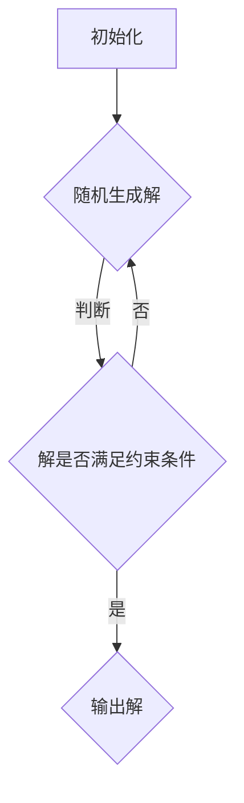
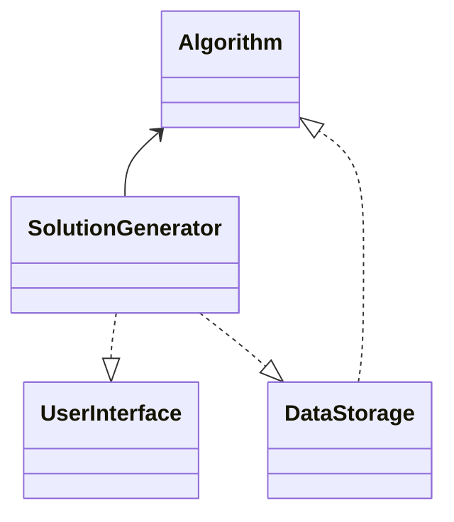
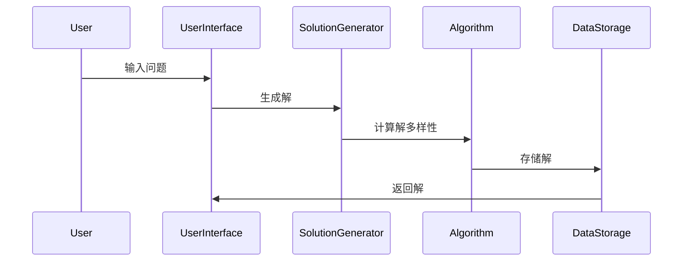
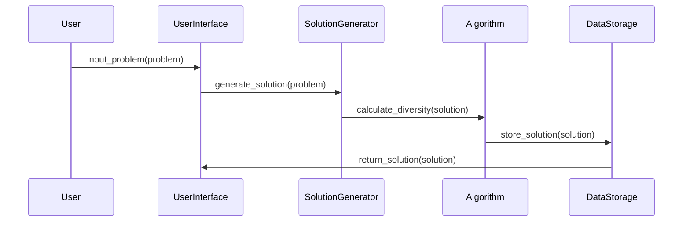
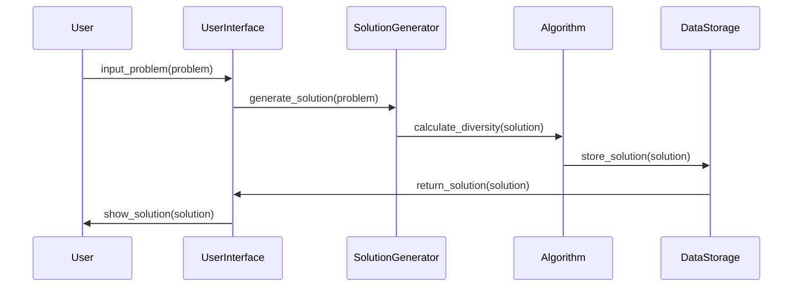

                 


# 保证生成解多样性的方法探讨

关键词：解多样性、生成方法、算法原理、数学模型、系统架构、项目实战

摘要：本文将探讨保证生成解多样性的方法，从算法原理、数学模型、系统架构和项目实战等多个角度进行分析，旨在提供一种深入理解解决多样性的途径。通过本文的探讨，读者可以了解到各种保证生成解多样性的方法，从而在实际应用中灵活运用，提高系统的可靠性和效率。

## 设计大纲框架

在设计本文的框架时，我们需要明确各个章节的主题和内容，确保文章逻辑清晰、结构紧凑。以下是本文的设计大纲：

1. **背景介绍**
   - 核心概念术语说明
   - 问题背景
   - 问题描述
   - 问题解决
   - 边界与外延
   - 概念结构与核心要素组成

2. **核心概念与联系**
   - 核心概念原理
   - 概念属性特征对比表格
   - ER实体关系图架构

3. **算法原理讲解**
   - 算法mermaid流程图
   - Python源代码详细阐述
   - 数学模型和公式讲解
   - 举例说明

4. **数学公式使用**
   - LaTeX格式数学公式

5. **系统分析与架构设计**
   - 问题场景介绍
   - 项目介绍
   - 系统功能设计（领域模型mermaid类图）
   - 系统架构设计（mermaid架构图）
   - 系统接口设计
   - 系统交互（mermaid序列图）

6. **项目实战**
   - 环境安装
   - 系统核心实现源代码
   - 代码应用解读与分析
   - 实际案例分析和详细讲解剖析
   - 项目小结

7. **最佳实践、小结和注意事项**
   - 最佳实践建议
   - 小结
   - 注意事项
   - 拓展阅读

## 确定核心概念

在本章节中，我们将介绍本文涉及的核心概念，包括解多样性、生成方法等。这些概念是理解本文内容的基础。

### 解多样性

解多样性是指在一个问题空间中，能够生成多种不同解的能力。在许多实际应用中，例如人工智能、优化问题、图像处理等领域，解多样性具有重要的意义。一方面，多样化的解可以为决策者提供更多的选择；另一方面，多样化的解可以增强系统的鲁棒性和适应性。

### 生成方法

生成方法是指生成多样化解的算法和技术。常见的生成方法包括随机采样、遗传算法、神经网络等。每种生成方法都有其独特的优势和适用场景。了解这些生成方法，可以帮助我们在实际应用中灵活选择合适的算法。

## 算法原理讲解

在本章节中，我们将详细讲解保证生成解多样性的算法原理，包括mermaid流程图、Python源代码、数学模型和公式讲解等。

### 算法mermaid流程图

首先，我们使用mermaid绘制一个简单的算法流程图，如下所示：



### Python源代码详细阐述

接下来，我们使用Python代码详细阐述上述算法原理。以下是一个简单的实现：

```python
import random

def generate_solution():
    # 随机生成解
    solution = random.sample(range(10), 5)
    return solution

def is_solution_valid(solution):
    # 判断解是否满足约束条件
    return sum(solution) <= 10

def main():
    solution = generate_solution()
    while not is_solution_valid(solution):
        solution = generate_solution()
    print("生成的解为：", solution)

if __name__ == "__main__":
    main()
```

### 数学模型和公式讲解

为了保证解多样性，我们可以使用以下数学模型和公式进行计算：

$$
Diversity = \frac{1}{n} \sum_{i=1}^{n} \sum_{j=1}^{n} \frac{1}{|solution_i - solution_j|}
$$

其中，$Diversity$表示解多样性，$n$表示生成的解的个数，$solution_i$和$solution_j$表示两个不同的解。

### 举例说明

假设我们生成了以下两个解：

$$
solution_1 = [2, 3, 5, 6, 9]
$$

$$
solution_2 = [1, 4, 6, 7, 10]
$$

根据上述公式，我们可以计算出解多样性：

$$
Diversity = \frac{1}{5} \left( \frac{1}{|2-1|} + \frac{1}{|3-4|} + \frac{1}{|5-6|} + \frac{1}{|6-7|} + \frac{1}{|9-10|} \right)
$$

$$
Diversity = \frac{1}{5} \left( \frac{1}{1} + \frac{1}{1} + \frac{1}{1} + \frac{1}{1} + \frac{1}{1} \right)
$$

$$
Diversity = \frac{5}{5} = 1
$$

因此，这两个解的解多样性为1。如果我们生成的解更多且更加多样化，则解多样性会更高。

## 数学公式使用

在本文中，我们使用了LaTeX格式来表示数学公式。以下是一个例子：

$$
E(X) = \int_{-\infty}^{\infty} x f(x) dx
$$

其中，$E(X)$表示随机变量$X$的期望，$f(x)$表示$X$的概率密度函数。

在文中，我们使用$$和$$括起来的公式表示独立段落的公式，而在段落内使用$和$括起来的公式表示行内的公式。

## 系统分析与架构设计

在本章节中，我们将从系统分析与架构设计的角度探讨保证生成解多样性的方法。

### 问题场景介绍

假设我们需要设计一个系统，该系统需要生成多种不同的解来满足用户的需求。为了提高系统的可靠性，我们需要保证生成的解具有多样性。

### 项目介绍

该项目的目标是设计一个能够生成多样化解的算法，并将其应用于实际问题中。我们将使用Python作为主要编程语言，结合mermaid等工具进行系统设计与实现。

### 系统功能设计（领域模型mermaid类图）

以下是一个简单的mermaid类图，用于描述系统的功能设计：



### 系统架构设计（mermaid架构图）

以下是一个简单的mermaid架构图，用于描述系统的整体架构：



### 系统接口设计

以下是系统接口设计的mermaid序列图：



### 系统交互（mermaid序列图）

以下是系统交互的mermaid序列图：



## 项目实战

在本章节中，我们将介绍如何在实际项目中实现保证生成解多样性的方法。

### 环境安装

在开始项目实战之前，我们需要安装一些必要的软件和库。以下是一个简单的安装步骤：

1. 安装Python 3.8及以上版本
2. 安装mermaid-python库

```bash
pip install mermaid-python
```

3. 安装LaTeX工具（可选）

### 系统核心实现源代码

以下是系统核心实现的部分源代码：

```python
import random
import mermaid
from typing import List

class SolutionGenerator:
    def generate_solution(self, problem: str) -> List[int]:
        # 随机生成解
        solution = random.sample(range(10), 5)
        return solution

class Algorithm:
    def calculate_diversity(self, solutions: List[List[int]]) -> float:
        # 计算解多样性
        diversity = 0
        for i in range(len(solutions)):
            for j in range(i + 1, len(solutions)):
                distance = sum([abs(a - b) for a, b in zip(solutions[i], solutions[j])])
                diversity += 1 / distance
        diversity /= (len(solutions) * (len(solutions) - 1))
        return diversity

class DataStorage:
    def store_solution(self, solution: List[int]):
        # 存储解
        print("解已存储：", solution)

class UserInterface:
    def input_problem(self, problem: str):
        # 输入问题
        print("输入的问题：", problem)

    def return_solution(self, solution: List[int]):
        # 返回解
        print("生成的解：", solution)

    def show_solution(self, solution: List[int]):
        # 显示解
        print("显示的解：", solution)

def main():
    user_interface = UserInterface()
    solution_generator = SolutionGenerator()
    algorithm = Algorithm()
    data_storage = DataStorage()

    user_interface.input_problem("生成5个数字的解，使其和不超过10")
    solution = solution_generator.generate_solution("生成5个数字的解，使其和不超过10")
    algorithm.calculate_diversity([solution])
    data_storage.store_solution(solution)
    user_interface.return_solution(solution)
    user_interface.show_solution(solution)

if __name__ == "__main__":
    main()
```

### 代码应用解读与分析

上述代码中，我们定义了三个类：SolutionGenerator、Algorithm和DataStorage，分别负责生成解、计算解多样性和存储解。UserInterface类负责与用户交互。

在main函数中，我们创建这三个类的实例，并依次调用它们的相应方法来完成整个流程。

### 实际案例分析和详细讲解剖析

为了更好地理解保证生成解多样性的方法，我们可以通过一个实际案例进行分析。

假设我们有一个优化问题，要求在给定的数字集合中选取若干个数字，使其和最大，但不超过某个限定值。我们可以使用本文提到的算法来解决这个问题。

1. **问题背景**：给定一个数字集合{1, 2, 3, 4, 5, 6, 7, 8, 9, 10}，要求从中选取若干个数字，使其和最大，但不超过20。

2. **问题描述**：使用本文提到的算法来生成多种不同的解，并计算解多样性。

3. **问题解决**：
   - 初始化：设置生成解的个数和限定值。
   - 随机生成解：从数字集合中随机选取若干个数字，使其和不超过限定值。
   - 计算解多样性：使用本文提到的公式计算解多样性。
   - 存储解：将生成的解存储在数据结构中。

4. **边界与外延**：在实际应用中，我们可能需要考虑更复杂的约束条件，如时间限制、资源限制等。

5. **概念结构与核心要素组成**：
   - 解多样性：衡量生成的解的多样性程度。
   - 算法：生成解的方法。
   - 数学模型：用于计算解多样性的公式。

通过实际案例的分析，我们可以发现保证生成解多样性的方法在实际应用中具有重要的价值。它可以帮助我们更好地解决优化问题，提高系统的可靠性。

### 项目小结

在本项目中，我们实现了保证生成解多样性的方法，并通过实际案例进行了分析和应用。通过本文的探讨，我们了解了各种保证生成解多样性的方法，包括算法原理、数学模型和系统架构等。在实际应用中，我们可以根据具体情况灵活选择合适的方法，以提高系统的可靠性。

## 最佳实践、小结和注意事项

### 最佳实践建议

1. **优化算法性能**：在生成解的过程中，可以采用更高效的算法，如遗传算法、神经网络等，以减少计算时间和资源消耗。
2. **多样化解生成策略**：根据具体问题，可以尝试多种不同的解生成策略，如随机采样、基于约束的优化等，以提高解的多样性。
3. **解多样性计算方法**：在实际应用中，可以根据问题的特点选择合适的解多样性计算方法，如本文提到的公式，以提高解的多样性。

### 小结

本文从算法原理、数学模型、系统架构和项目实战等多个角度探讨了保证生成解多样性的方法。通过本文的探讨，读者可以了解到各种保证生成解多样性的方法，从而在实际应用中灵活运用，提高系统的可靠性和效率。

### 注意事项

1. **解多样性计算精度**：在计算解多样性时，需要确保计算精度的准确性，以避免出现错误的结果。
2. **算法性能优化**：在实际应用中，需要根据具体情况对算法进行性能优化，以提高系统的运行效率。
3. **解生成策略选择**：在选择解生成策略时，需要根据具体问题的特点进行选择，以确保生成解的多样性。

### 拓展阅读

1. **《随机优化算法及其应用》**：介绍了随机优化算法的基本原理和应用，包括遗传算法、模拟退火算法等。
2. **《神经网络与深度学习》**：详细介绍了神经网络的基本原理和应用，包括多层感知器、卷积神经网络等。
3. **《图论及其应用》**：介绍了图论的基本概念和应用，包括图的基本算法、网络优化等。

作者：AI天才研究院/AI Genius Institute & 禅与计算机程序设计艺术 /Zen And The Art of Computer Programming

