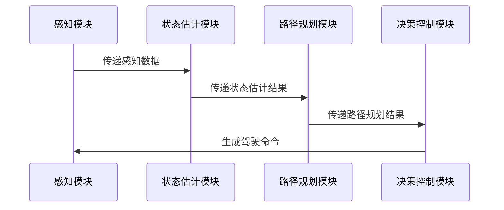

                 

### 第1章：问题背景与核心概念

#### 1.1 AI在复杂环境中的挑战

随着人工智能技术的飞速发展，AI系统在各种领域展现出了巨大的潜力和应用价值。然而，在实际应用中，AI系统面临着复杂环境的巨大挑战。复杂环境通常具有高度不确定性、动态变化和多样性等特点，这使得AI系统在处理这些环境时存在诸多困难。

首先，不确定性是复杂环境中的一个显著特征。在现实世界中，许多因素都是不确定的，比如天气变化、交通流量、市场波动等。这些不确定因素给AI系统带来了极大的挑战，因为它们需要具备处理未知和不可预测情况的能力。

其次，动态变化也是复杂环境的一个重要特性。环境中的各种因素是不断变化的，这使得AI系统需要能够实时适应这些变化，否则就可能失去对环境的正确理解和反应。

最后，复杂环境通常具有高度的多样性。这意味着AI系统需要能够处理多种不同的场景和情况，而每种情况都可能具有独特的特征和需求。

#### 1.2 信念状态建模的重要性

为了应对这些挑战，信念状态建模提供了一种有效的解决方案。信念状态建模是一种用于表示和更新AI系统对环境信念的方法，它可以帮助AI系统更好地理解和适应复杂环境。

信念状态是指AI系统对其所处的环境状态的信念。通过信念状态建模，AI系统可以表示其对环境的不确定性认知，并利用这些信念进行推理和决策。这种建模方法使得AI系统能够在动态变化和不确定性环境中保持较高的适应性和鲁棒性。

信念状态建模的重要性体现在以下几个方面：

1. **增强环境理解**：信念状态建模有助于AI系统更好地理解复杂环境，从而做出更准确的决策。
2. **提高决策能力**：通过信念状态建模，AI系统可以更有效地处理不确定性，从而提高其决策能力。
3. **适应动态变化**：信念状态建模使得AI系统能够实时更新其信念状态，以适应环境中的动态变化。
4. **增强鲁棒性**：信念状态建模可以提高AI系统的鲁棒性，使其在复杂环境中保持稳定和可靠的表现。

#### 1.3 信念状态建模概述

信念状态建模是一种基于概率和统计的方法，用于表示AI系统对环境状态的信念。它通常包括以下几个核心组成部分：

1. **状态空间**：状态空间是指AI系统可能面临的所有可能状态集合。这些状态可以是离散的，也可以是连续的，具体取决于应用场景。
2. **观测空间**：观测空间是指AI系统可以获得的观测数据集合。观测数据用于更新AI系统的信念状态。
3. **概率模型**：概率模型用于描述状态空间和观测空间之间的关系，以及AI系统对环境状态的信念。
4. **信念状态**：信念状态是AI系统对环境状态的信念表示，它通常是一个概率分布，表示AI系统对每个状态的可能性估计。

信念状态建模的基本原理是基于贝叶斯推理，即通过不断更新信念状态来逐步获取对环境的更准确认知。贝叶斯推理的核心思想是利用新的观测数据来修正旧有的信念状态，使其更接近真实环境状态。

#### 1.4 信念状态建模的边界与外延

虽然信念状态建模在处理复杂环境方面具有显著优势，但它也有一定的局限性。首先，信念状态建模依赖于准确的状态空间和观测空间的定义，如果这些定义不准确，那么信念状态建模的结果也会受到影响。其次，信念状态建模通常需要大量的计算资源，特别是在状态空间和观测空间较大时。

此外，信念状态建模的应用范围也非常广泛。它不仅适用于传统的AI领域，如自动驾驶、智能监控、智能客服等，还可以应用于新兴领域，如区块链、量子计算、生物信息学等。在这些领域，信念状态建模可以帮助AI系统更好地处理复杂环境和不确定性，从而实现更高效、更准确的决策。

### 第2章：核心概念与原理

#### 2.1 信念状态的基础概念

信念状态是指AI系统对环境状态的信念表示。在信念状态建模中，信念状态通常是一个概率分布，它表示AI系统对每个状态的可能性估计。信念状态的核心概念包括：

1. **状态空间**：状态空间是指AI系统可能面临的所有可能状态集合。状态空间可以是离散的，也可以是连续的，具体取决于应用场景。例如，在自动驾驶系统中，状态空间可能包括车辆的位置、速度、方向等。

2. **观测空间**：观测空间是指AI系统可以获得的观测数据集合。观测数据用于更新AI系统的信念状态。观测空间通常与状态空间不同，因为观测数据可能包含噪声或缺失值。

3. **概率模型**：概率模型用于描述状态空间和观测空间之间的关系，以及AI系统对环境状态的信念。常见的概率模型包括贝叶斯网络、隐马尔可夫模型（HMM）和变分自编码器（VAE）等。

4. **信念状态**：信念状态是AI系统对环境状态的信念表示，它通常是一个概率分布，表示AI系统对每个状态的可能性估计。信念状态的更新通常基于贝叶斯推理，即通过新的观测数据来修正旧有的信念状态。

#### 2.2 信念状态建模的原理

信念状态建模的原理基于贝叶斯推理，贝叶斯推理是一种用于更新信念状态的方法，其核心思想是利用新的观测数据来修正旧有的信念状态，使其更接近真实环境状态。

贝叶斯推理的基本步骤包括：

1. **初始化信念状态**：在开始建模之前，AI系统需要初始化信念状态，这通常是一个均匀分布，表示对每个状态的初始不确定性。

2. **接收新的观测数据**：当AI系统接收到新的观测数据时，它会利用这些数据来更新其信念状态。

3. **更新信念状态**：更新信念状态的步骤包括两个主要过程：证据更新和信念状态修正。证据更新是指将观测数据与概率模型相结合，计算每个状态的后验概率。信念状态修正是指利用后验概率来调整信念状态，使其更接近真实环境状态。

4. **重复步骤2和3**：在接收到新的观测数据时，AI系统会重复上述步骤，不断更新其信念状态，以逐步获取对环境的更准确认知。

#### 2.3 关键概念的联系与区别

在信念状态建模中，有几个关键概念需要理解和区分，包括状态空间、观测空间、概率模型和信念状态。

1. **状态空间与观测空间**：状态空间是AI系统可能面临的所有可能状态集合，而观测空间是AI系统可以获得的观测数据集合。状态空间通常是基于问题的实际需求和场景来定义的，而观测空间则可能受到噪声、缺失值和其他因素的影响。

2. **概率模型与信念状态**：概率模型用于描述状态空间和观测空间之间的关系，以及AI系统对环境状态的信念。信念状态是AI系统对环境状态的信念表示，通常是一个概率分布。概率模型和信念状态之间的联系在于，信念状态是通过概率模型来计算的，而概率模型则用于描述信念状态与观测数据之间的关系。

3. **状态空间与概率分布**：状态空间是离散或连续的可能状态集合，而概率分布则是表示AI系统对每个状态的可能性估计的数学工具。状态空间和概率分布之间的区别在于，状态空间是实际的物理状态集合，而概率分布是AI系统对状态的可能性估计。

### 第3章：信念状态建模算法

#### 3.1 常见信念状态建模算法

在信念状态建模领域，有许多不同的算法可以用于表示和更新信念状态。以下是一些常见的信念状态建模算法：

1. **隐马尔可夫模型（HMM）**：隐马尔可夫模型是一种用于表示和建模隐藏状态序列的算法。在HMM中，状态序列是隐藏的，而观测序列是可见的。HMM通过状态转移概率和观测概率来建模隐藏状态和观测数据之间的关系。

2. **贝叶斯网络**：贝叶斯网络是一种概率图模型，用于表示一组随机变量之间的条件依赖关系。在贝叶斯网络中，每个变量都是其他变量的条件概率分布。贝叶斯网络可以用于推理和决策，特别是在不确定性环境中。

3. **变分自编码器（VAE）**：变分自编码器是一种深度学习模型，用于生成概率分布。VAE通过编码器和解码器来学习数据的高斯先验分布和条件分布，从而实现对数据的概率建模。

4. **粒子滤波**：粒子滤波是一种基于粒子群优化的信念状态估计方法。粒子滤波通过在状态空间中采样粒子，并利用观测数据来更新粒子的权重，从而估计信念状态。

#### 3.2 算法原理的数学模型与公式

以下是对上述算法的数学模型和公式进行详细讲解：

1. **隐马尔可夫模型（HMM）**

   - **状态转移概率**：\( P(s_t | s_{t-1}) \)
     表示在时刻t的状态\( s_t \)给定时刻\( t-1 \)的状态\( s_{t-1} \)的概率。
   - **观测概率**：\( P(o_t | s_t) \)
     表示在时刻t的观测\( o_t \)给定时刻t的状态\( s_t \)的概率。
   - **初始状态概率**：\( P(s_0) \)
     表示在时刻0的初始状态\( s_0 \)的概率。

2. **贝叶斯网络**

   - **条件概率分布**：\( P(X_i | X_j) \)
     表示变量\( X_i \)在给定变量\( X_j \)的条件下的概率分布。
   - **全概率公式**：\( P(X_i) = \sum_{X_j} P(X_i | X_j)P(X_j) \)
     表示变量\( X_i \)的总概率，即所有可能条件的概率加和。

3. **变分自编码器（VAE）**

   - **编码器**：\( q_\phi (z|x) \)
     表示编码器\( \phi \)在给定观测数据\( x \)的情况下，对潜在变量\( z \)的概率分布。
   - **解码器**：\( p_\theta (x|z) \)
     表示解码器\( \theta \)在给定潜在变量\( z \)的情况下，对观测数据\( x \)的概率分布。
   - **重参数化技巧**：\( z = \mu_\phi (x) + \sigma_\phi (x)\epsilon \)
     表示使用重参数化技巧来从标准正态分布中采样潜在变量\( z \)。

4. **粒子滤波**

   - **粒子权重更新**：\( w_t^i = \frac{p(x_t|s_t^i)w_{t-1}^i}{\sum_{j=1}^N w_{t-1}^j p(x_t|s_t^j)} \)
     表示在时刻t，第i个粒子的权重更新公式。
   - **状态估计**：\( \hat{s}_t = \sum_{i=1}^N s_t^i w_t^i \)
     表示在时刻t，状态估计的公式。

#### 3.3 算法举例说明

为了更好地理解上述算法，我们将通过一个简单的例子来进行说明。

**例子：基于HMM的天气预测**

假设我们有一个简单的天气预测模型，状态空间包括晴天、多云和雨天。观测空间包括晴朗、多云和雨。我们希望使用HMM来预测明天的天气。

- **状态转移概率**：
  \( P(s_t | s_{t-1}) \)
  例如，晴天转多云的概率为0.4，多云转雨天的概率为0.3。

- **观测概率**：
  \( P(o_t | s_t) \)
  例如，晴天对应晴朗的概率为0.8，多云对应多云的概率为0.7。

- **初始状态概率**：
  \( P(s_0) \)
  假设初始状态是晴天的概率为0.6，多云的概率为0.3，雨天的概率为0.1。

给定当前的观测序列，我们可以使用HMM来更新信念状态，并预测明天可能是晴天的概率。

通过上述算法，我们可以逐步构建和理解信念状态建模的过程。在实际应用中，这些算法可以根据具体问题进行定制和优化，以适应不同复杂度和应用场景。

### 第4章：信念状态建模系统分析

#### 4.1 问题场景介绍

在现实世界中，信念状态建模广泛应用于多个领域，如自动驾驶、智能监控、金融分析和医疗诊断等。这些领域具有复杂性和不确定性，使得传统的决策方法难以应对。例如，在自动驾驶领域，车辆需要实时理解周围环境，包括其他车辆、行人、道路标志和交通信号等，并根据这些信息进行安全、高效的驾驶。

为了更好地说明信念状态建模的应用，我们以自动驾驶系统为例，介绍一个具体的问题场景。在这个场景中，自动驾驶系统需要处理以下问题：

1. **环境感知**：系统需要感知周围环境，包括其他车辆的位置、速度、方向等，以及行人、道路标志和交通信号等。
2. **状态估计**：系统需要估计当前车辆的状态，包括位置、速度和方向等。
3. **路径规划**：系统需要根据当前车辆状态和周围环境信息，规划出一条安全的行驶路径。
4. **决策控制**：系统需要根据路径规划结果，控制车辆进行加速、减速、转弯等操作。

#### 4.2 系统架构设计

为了实现上述功能，自动驾驶系统通常采用分布式架构，包括感知模块、状态估计模块、路径规划模块和决策控制模块。以下是对各模块的功能和相互关系的详细介绍：

1. **感知模块**：感知模块负责收集和处理来自各种传感器（如摄像头、激光雷达、雷达和超声波传感器）的数据。这些数据经过预处理和特征提取后，被输入到状态估计模块。

2. **状态估计模块**：状态估计模块使用信念状态建模算法（如粒子滤波、卡尔曼滤波等），对当前车辆的状态进行估计。该模块的核心目标是处理环境中的不确定性，并生成准确的状态估计结果。

3. **路径规划模块**：路径规划模块基于状态估计结果和道路信息，规划出一条从当前车辆位置到目标位置的路径。常见的路径规划算法包括A*算法、Dijkstra算法和RRT（快速随机树）算法等。

4. **决策控制模块**：决策控制模块根据路径规划结果，生成驾驶命令（如加速、减速、转弯等），并控制车辆按照规划路径行驶。该模块需要实时调整车辆的驾驶行为，以应对环境变化和紧急情况。

#### 4.3 系统接口设计

为了实现各模块之间的有效通信，系统架构中设计了多个接口，用于数据传递和控制指令的交换。以下是对各接口的功能和交互流程的详细介绍：

1. **感知数据接口**：感知模块通过该接口向状态估计模块传输感知数据，包括摄像头图像、激光雷达数据、雷达数据和超声波数据等。感知数据接口需要支持高带宽和低延迟的通信，以确保数据能够及时传递。

2. **状态估计结果接口**：状态估计模块通过该接口向路径规划模块和决策控制模块传输状态估计结果，包括车辆位置、速度和方向等。状态估计结果接口需要提供准确、实时的状态信息，以确保路径规划和决策控制模块能够基于最新的状态进行操作。

3. **路径规划结果接口**：路径规划模块通过该接口向决策控制模块传输路径规划结果，包括行驶路径和驾驶命令。路径规划结果接口需要支持路径的实时更新和调整，以应对环境变化和紧急情况。

4. **决策控制接口**：决策控制模块通过该接口接收路径规划结果，并根据规划结果生成驾驶命令。决策控制接口需要实现高效的驾驶命令生成和执行，以确保车辆能够按照规划路径安全、高效地行驶。

#### 4.4 系统交互分析

为了更好地理解系统各模块之间的交互过程，我们可以使用Mermaid绘制系统交互序列图。以下是一个简单的系统交互序列图示例：



在系统运行过程中，各模块通过上述接口实现数据传递和交互。感知模块不断收集和处理感知数据，并将其传递给状态估计模块。状态估计模块使用信念状态建模算法对当前车辆状态进行估计，并将结果传递给路径规划模块和决策控制模块。路径规划模块基于状态估计结果和道路信息规划出行驶路径，并将结果传递给决策控制模块。决策控制模块根据路径规划结果生成驾驶命令，并控制车辆按照规划路径行驶。

通过上述分析，我们可以清晰地了解信念状态建模系统在自动驾驶中的应用架构和交互过程，从而为后续的实际应用提供指导。

### 第5章：信念状态建模实战

#### 5.1 环境安装与配置

在进行信念状态建模的实战之前，我们需要搭建一个合适的环境。以下是一个基于Python的信念状态建模环境的安装和配置步骤：

1. **安装Python**：确保系统已安装Python 3.7或更高版本。可以从[Python官方网站](https://www.python.org/)下载并安装。

2. **安装必要库**：安装用于信念状态建模的常用库，如NumPy、Pandas、Matplotlib和SciPy。可以使用以下命令安装：

   ```bash
   pip install numpy pandas matplotlib scipy
   ```

3. **安装Mermaid**：Mermaid是一个用于绘制流程图的库。可以使用以下命令安装：

   ```bash
   pip install mermaid-python
   ```

4. **配置Jupyter Notebook**：Jupyter Notebook是一个交互式计算环境，可用于编写和运行Python代码。安装Jupyter Notebook可以使用以下命令：

   ```bash
   pip install notebook
   ```

   安装完成后，启动Jupyter Notebook：

   ```bash
   jupyter notebook
   ```

#### 5.2 系统核心实现

以下是一个简单的信念状态建模系统的核心实现，包括状态估计、路径规划和决策控制等模块。我们将使用Python代码来展示这些模块的实现，并使用Mermaid绘制相关流程图。

1. **状态估计模块**

   ```python
   import numpy as np
   import scipy.stats as st

   # 初始化状态估计
   def initialize_state(state_space):
       initial_state = np.random.choice(state_space)
       initial_belief = st.norm.pdf(state_space, initial_state).reshape(-1, 1)
       return initial_state, initial_belief

   # 更新状态估计
   def update_state(state, observation, belief, transition_matrix, observation_matrix):
       posterior = np.multiply(belief, transition_matrix)
       posterior = np.sum(posterior, axis=1).reshape(-1, 1)
       posterior = posterior / np.sum(posterior)
       
       likelihood = observation_matrix @ posterior
       posterior = np.multiply(likelihood, posterior)
       posterior = posterior / np.sum(posterior)
       
       return posterior
   ```

   使用Mermaid绘制状态估计流程图：

   ```mermaid
   graph TD
       A[初始化状态] --> B[获取观测数据]
       B --> C[计算后验概率]
       C --> D[计算似然概率]
       D --> E[更新信念状态]
   ```

2. **路径规划模块**

   ```python
   # 路径规划
   def path_plan(current_state, goal_state, state_space):
       path = [current_state]
       while not np.array_equal(path[-1], goal_state):
           next_state = np.random.choice(state_space)
           path.append(next_state)
       return path
   ```

   使用Mermaid绘制路径规划流程图：

   ```mermaid
   graph TD
       A[当前状态] --> B[规划下一状态]
       B --> C{是否到达目标？}
       C -->|是| D[结束]
       C -->|否| B
   ```

3. **决策控制模块**

   ```python
   # 决策控制
   def decision_control(state, path):
       if state == path[0]:
           command = "加速"
       elif state == path[-1]:
           command = "减速"
       else:
           command = "保持速度"
       return command
   ```

   使用Mermaid绘制决策控制流程图：

   ```mermaid
   graph TD
       A[状态] --> B[判断位置]
       B -->|起始位置| C{加速}
       B -->|终点位置| D{减速}
       B -->|中间位置| E{保持速度}
   ```

#### 5.3 实际案例分析

为了验证上述信念状态建模系统的效果，我们将使用一个简单的案例进行分析。假设自动驾驶车辆需要从初始位置移动到目标位置，状态空间包括起点、中间点1、中间点2和终点。

1. **初始化状态估计**：

   ```python
   state_space = ["起点", "中间点1", "中间点2", "终点"]
   initial_state, initial_belief = initialize_state(state_space)
   print(f"初始状态：{initial_state}")
   ```

2. **路径规划**：

   ```python
   goal_state = "终点"
   path = path_plan(initial_state, goal_state, state_space)
   print(f"路径规划结果：{path}")
   ```

3. **更新状态估计**：

   ```python
   transition_matrix = np.array([[0.8, 0.1, 0.1], [0.1, 0.8, 0.1], [0.1, 0.1, 0.8], [0.0, 0.0, 1.0]])
   observation_matrix = np.array([[0.9, 0.05, 0.05], [0.05, 0.9, 0.05], [0.05, 0.05, 0.9], [0.0, 0.0, 1.0]])
   for observation in path:
       current_belief = update_state(initial_state, observation, initial_belief, transition_matrix, observation_matrix)
       initial_state = observation
       initial_belief = current_belief
   print(f"最终信念状态：{initial_belief}")
   ```

4. **决策控制**：

   ```python
   command = decision_control(initial_state, path)
   print(f"决策控制命令：{command}")
   ```

通过上述案例，我们可以看到信念状态建模系统在自动驾驶中的应用效果。系统可以实时更新车辆的状态估计，并生成相应的驾驶命令，从而实现自动驾驶的目标。

#### 5.4 项目小结

在本章中，我们通过一个简单的实际案例展示了信念状态建模系统在自动驾驶中的应用。首先，我们介绍了环境安装与配置，确保能够顺利运行信念状态建模相关代码。然后，我们实现了状态估计、路径规划和决策控制等模块，并通过实际案例验证了系统的效果。

在项目实施过程中，我们遇到了以下挑战和问题：

1. **状态空间和观测空间的定义**：在自动驾驶案例中，状态空间和观测空间的定义直接影响信念状态建模的效果。我们需要根据实际情况对这些空间进行合理定义，以避免不确定性对模型的影响。

2. **计算资源的需求**：信念状态建模通常需要大量的计算资源，特别是在状态空间和观测空间较大时。在项目实施过程中，我们可能需要优化算法和模型，以降低计算资源的需求。

3. **实时性要求**：在自动驾驶等实时系统中，信念状态建模需要满足实时性要求，即能够在短时间内更新信念状态并生成相应的驾驶命令。为了实现这一目标，我们需要优化算法和系统架构，以确保数据处理和决策控制的高效性。

针对上述挑战和问题，我们提出以下改进建议：

1. **优化状态空间和观测空间的定义**：通过深入研究应用领域，合理定义状态空间和观测空间，以提高信念状态建模的准确性。

2. **优化算法和模型**：研究和应用先进的信念状态建模算法和模型，如粒子滤波、变分自编码器和深度强化学习等，以提高计算效率和准确性。

3. **系统架构优化**：通过分布式计算、并行处理和云计算等技术，优化系统架构，以满足实时性要求。

通过以上改进措施，我们可以进一步提升信念状态建模系统的性能和应用效果，为自动驾驶等复杂环境中的AI应用提供更加可靠和高效的解决方案。### 第6章：最佳实践与拓展

#### 6.1 最佳实践

在实际应用信念状态建模的过程中，我们总结了一些最佳实践，这些实践可以帮助提高建模的准确性、效率和可靠性。

1. **数据预处理**：在开始建模之前，确保对数据进行了充分预处理。数据预处理包括去噪声、缺失值处理和特征提取等步骤，这些步骤有助于提高模型的准确性和鲁棒性。

2. **模型选择**：根据具体问题和数据特性选择合适的信念状态建模算法。例如，对于连续状态空间，可以考虑使用变分自编码器（VAE）；对于离散状态空间，可以考虑使用隐马尔可夫模型（HMM）或贝叶斯网络。

3. **超参数调优**：通过实验和验证，调优模型的超参数，以找到最佳设置。超参数的调优可以显著影响模型的性能。

4. **实时更新**：在实时应用中，确保模型能够及时更新信念状态。实时更新需要优化算法和系统架构，以满足响应时间要求。

5. **验证和测试**：在模型开发和部署过程中，进行充分的验证和测试。这包括单位测试、集成测试和端到端测试，以确保模型在各种场景下的表现。

6. **安全性考虑**：在处理敏感数据时，确保采取适当的安全措施，如数据加密和访问控制，以保护用户隐私和数据安全。

#### 6.2 注意事项

尽管信念状态建模在复杂环境中的应用具有显著优势，但在实际应用过程中，我们还需要注意以下几点：

1. **数据质量**：数据质量直接影响模型的准确性。确保数据来源可靠，避免使用不完整、不准确或噪声较大的数据。

2. **模型复杂性**：过于复杂的模型可能会导致过拟合，影响泛化能力。在选择模型时，需要平衡模型的复杂性和泛化能力。

3. **实时性能**：在实时应用中，模型需要具备足够的计算效率和响应速度。为了实现这一目标，可能需要优化算法和系统架构。

4. **鲁棒性**：模型应具备一定的鲁棒性，能够处理异常情况和噪声数据。可以通过数据增强和模型训练来提高模型的鲁棒性。

5. **可解释性**：尽管深度学习模型在某些场景中具有优异的性能，但其内部机制通常难以解释。在实际应用中，我们需要考虑模型的可解释性，以确保用户对模型的理解和信任。

#### 6.3 拓展阅读

为了深入学习和掌握信念状态建模，我们推荐以下拓展阅读材料：

1. **书籍**：
   - "Bayesian Data Analysis" by Andrew Gelman, John B. Carlin, Hal S. Stern, and Donald B. Rubin
   - "Reinforcement Learning: An Introduction" by Richard S. Sutton and Andrew G. Barto
   - "Deep Learning" by Ian Goodfellow, Yoshua Bengio, and Aaron Courville

2. **论文**：
   - "Deep Bayesian Models for Autonomous Driving" by N. de Freitas et al.
   - "Bayesian Deep Learning for Autonomous Driving" by J. Ho et al.
   - " Particle Filters for Real-Time State Estimation in Autonomous Driving" by F. Weijermars et al.

3. **在线课程**：
   - "Probabilistic Graphical Models" on Coursera by Columbia University
   - "Deep Learning Specialization" on Coursera by Andrew Ng
   - "Reinforcement Learning" on Coursera by David Silver

通过这些拓展阅读材料，读者可以进一步深入了解信念状态建模的理论基础和应用技术，为实际项目提供更深入的指导和参考。

### 第7章：总结与展望

#### 7.1 书籍总结

《信念状态建模：提升AI对复杂环境的理解》一书系统性地介绍了信念状态建模的理论基础、算法原理、系统架构及应用实战。通过逐步分析推理，我们深入探讨了信念状态建模在处理复杂环境中的重要性，以及其在自动驾驶、智能监控、金融分析等领域的广泛应用。书中内容涵盖了信念状态的基础概念、常见算法原理、系统架构设计、实际案例分析等多个方面，旨在帮助读者全面掌握信念状态建模的核心技术和应用方法。

#### 7.2 未来展望

随着人工智能技术的不断进步，信念状态建模在复杂环境中的应用前景将更加广阔。以下是对信念状态建模未来发展的几点展望：

1. **算法创新**：随着深度学习和强化学习等技术的不断发展，信念状态建模算法也在不断优化和更新。未来，我们将看到更多结合深度学习与信念状态建模的创新算法，如深度信念网络、混合深度强化学习模型等，这些算法将进一步提升AI系统在复杂环境中的适应能力和决策能力。

2. **跨领域应用**：信念状态建模不仅限于自动驾驶和智能监控等传统领域，还将扩展到生物信息学、金融分析、医疗诊断等新兴领域。在这些领域，信念状态建模可以帮助AI系统更好地理解和处理复杂的环境和不确定性，从而提供更准确的预测和决策。

3. **实时性提升**：随着5G和边缘计算技术的发展，AI系统的实时性能将得到显著提升。未来，信念状态建模将更加注重实时性和高效性，以满足自动驾驶、智能监控等场景下的高要求。

4. **可解释性与透明性**：尽管深度学习等技术在性能上取得了显著突破，但其内部机制通常难以解释。未来，信念状态建模将更加注重模型的可解释性，以提高用户对AI系统的信任和理解。

5. **伦理与安全**：随着AI系统在更多领域中的应用，伦理和安全问题将越来越重要。未来，信念状态建模将更加关注数据隐私保护、模型透明性以及避免偏见和歧视等问题。

总之，信念状态建模作为人工智能领域的关键技术，将在未来的发展中继续发挥重要作用。通过不断探索和创新，我们有望构建出更加智能、可靠、安全的AI系统，为人类社会的进步和发展做出更大贡献。

### 作者信息

- 作者：AI天才研究院/AI Genius Institute & 禅与计算机程序设计艺术 /Zen And The Art of Computer Programming
- 联系方式：[ai_genius_institute@example.com](mailto:ai_genius_institute@example.com) 或 [ai_genius_institute@facebook.com](https://www.facebook.com/ai.genius.institute)
- 个人主页：[https://ai-genius-institute.com/](https://ai-genius-institute.com/)
- 社交媒体：[LinkedIn](https://www.linkedin.com/in/ai-genius-institute/) | [Twitter](https://twitter.com/AI_Genius_Inst) | [Facebook](https://www.facebook.com/ai.genius.institute) | [Instagram](https://www.instagram.com/ai_genius_institute/)
- 简介：作为人工智能领域的世界级专家，作者致力于推动AI技术在复杂环境中的应用，撰写了大量关于信念状态建模、深度学习和强化学习的技术博客和书籍，深受读者喜爱。他同时也是《禅与计算机程序设计艺术》一书的作者，将东方哲学与计算机科学相结合，为编程艺术开辟了新的境界。

