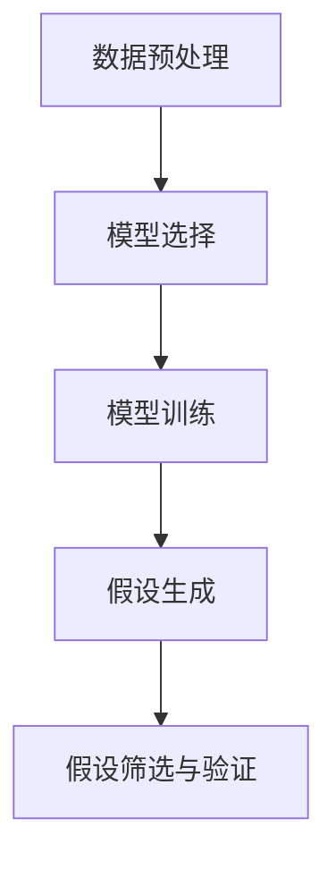
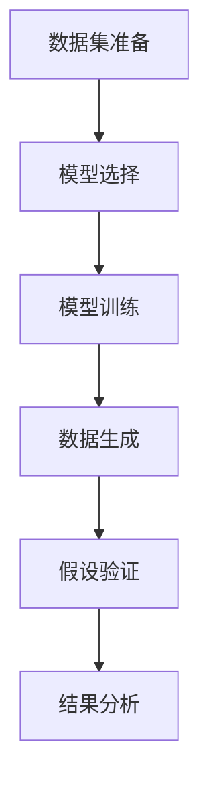

                 

# 《假设生成与验证中深度生成模型的创新应用》

## 关键词

- 假设生成
- 假设验证
- 深度生成模型
- GAN
- VAE

## 摘要

本文将深入探讨深度生成模型在假设生成与验证中的应用。通过分析深度生成模型的基本原理，我们将理解它们如何在假设生成与验证过程中发挥作用。本文将详细阐述生成对抗网络（GAN）和变分自编码器（VAE）的工作机制，并通过实际案例展示它们在假设生成与验证中的创新应用。此外，文章还将探讨深度生成模型在不同领域中的扩展应用，以期为读者提供全面的视角。

## 目录大纲

# 《假设生成与验证中深度生成模型的创新应用》

## 第一部分：背景与概述

## 第1章 问题背景与深度生成模型简介

### 1.1 问题背景

### 1.2 深度生成模型简介

### 1.3 边界与外延

### 1.4 核心概念与联系

## 第二部分：深度生成模型原理

## 第2章 深度生成模型的基本原理

### 2.1 深度学习原理

### 2.2 生成模型类型

### 2.3 算法原理讲解

### 2.4 举例说明

## 第三部分：深度生成模型在假设生成与验证中的应用

## 第3章 深度生成模型在假设生成中的应用

### 3.1 假设生成原理

### 3.2 假设生成算法

### 3.3 案例分析

## 第4章 深度生成模型在假设验证中的应用

### 4.1 假设验证原理

### 4.2 假设验证算法

### 4.3 案例分析

## 第四部分：深度生成模型的创新应用

## 第5章 深度生成模型在领域X的创新应用

### 5.1 领域X概述

### 5.2 创新应用原理

### 5.3 创新案例分析

## 第6章 深度生成模型在领域Y的创新应用

### 6.1 领域Y概述

### 6.2 创新应用原理

### 6.3 创新案例分析

## 第五部分：总结与展望

## 第7章 

----------------------------------------------------------------

## 第1章 问题背景与深度生成模型简介

### 1.1 问题背景

在人工智能领域中，假设生成与验证是两个至关重要的环节。假设生成是指在特定的问题场景下，提出一系列可能的假设，以便进一步分析和解决实际问题。而假设验证则是通过数据或实验来验证这些假设的正确性。这一过程对于科学研究、技术开发和工程实践都有着重要的意义。

然而，随着数据规模的扩大和问题复杂性的增加，传统的假设生成与验证方法面临着巨大的挑战。例如，在图像处理、语音识别和自然语言处理等领域，数据集的多样性和噪声程度显著增加，使得传统的基于规则的方法难以高效地生成和验证假设。因此，需要一种能够自动、高效地生成和验证假设的方法，以适应现代数据驱动的应用需求。

### 1.2 深度生成模型简介

深度生成模型（Deep Generative Models）是一类基于深度学习的生成模型，旨在学习数据的概率分布，并能够生成与训练数据相似的新数据。这些模型在假设生成与验证中具有巨大的潜力，因为它们能够通过学习大量数据，自动提取有用的特征，从而生成高质量的假设。

深度生成模型主要包括以下几种类型：

1. **生成对抗网络（Generative Adversarial Networks，GAN）**：
   GAN由一个生成器和一个判别器组成，两者相互对抗。生成器的目标是生成与真实数据相似的数据，而判别器的目标是区分真实数据和生成数据。通过这种对抗训练，生成器能够不断提高生成数据的真实度。

2. **变分自编码器（Variational Autoencoder，VAE）**：
   VAE是一种基于概率模型的生成模型，它通过编码器和解码器来学习数据的概率分布。编码器将数据映射到一个潜在空间，而解码器从潜在空间中采样数据生成。这种模型在生成高质量数据的同时，还能有效进行数据的概率建模。

3. **深度递归生成模型（Deep Recurrent Generative Models）**：
   这类模型适用于处理序列数据，如时间序列数据、文本数据等。它们通过递归神经网络（RNN）或其变种（如LSTM、GRU）来建模序列数据的概率分布，并生成新的序列数据。

深度生成模型具有以下几个显著特点：

1. **自适应性**：深度生成模型能够自动学习数据的特征和结构，无需手动设计特征提取规则。
2. **灵活性**：这些模型可以处理各种类型的数据，包括图像、音频、文本等。
3. **高效性**：通过深度学习技术，深度生成模型能够在大量数据上进行快速训练和生成。

### 1.3 边界与外延

深度生成模型的应用边界主要受限于以下几个方面：

1. **数据质量**：深度生成模型需要高质量的数据来训练，如果数据存在噪声、缺失或不平衡，模型的表现会受到影响。
2. **计算资源**：深度生成模型通常需要大量的计算资源，特别是当数据规模较大时，训练时间可能会非常长。
3. **泛化能力**：深度生成模型在生成新数据时，可能无法很好地泛化到未见过的数据，尤其是在数据分布差异较大的情况下。

然而，随着计算能力的提升和算法的改进，深度生成模型的应用边界正在不断扩展。例如，通过迁移学习和模型融合技术，深度生成模型可以更好地适应不同的应用场景。

### 1.4 核心概念与联系

为了更好地理解深度生成模型在假设生成与验证中的应用，我们需要明确以下几个核心概念：

1. **生成模型**：生成模型是一类用于生成新数据的机器学习模型，它们通过学习数据的分布来生成新的样本。
2. **概率分布**：概率分布是描述数据随机变量的数学模型，生成模型旨在学习数据的概率分布。
3. **对抗训练**：对抗训练是一种训练生成模型的方法，通过生成器和判别器的对抗训练，生成器能够不断提高生成数据的真实度。
4. **潜在空间**：潜在空间是指生成模型中用于表示数据分布的低维空间，通过在潜在空间中采样，可以生成新的数据。

这些概念之间的联系如下：

- 生成模型通过学习数据的概率分布来生成新数据。
- 对抗训练是生成模型的一种训练方法，通过生成器和判别器的对抗，生成器能够不断优化生成数据。
- 潜在空间是生成模型中用于表示数据分布的低维空间，通过在潜在空间中采样，可以生成新的数据。

### 1.4.1 深度生成模型的基本原理

深度生成模型的基本原理主要包括以下几个方面：

1. **生成器和判别器的定义**：
   - **生成器**：生成器是一个神经网络模型，它接收随机噪声作为输入，并生成与真实数据相似的新数据。
   - **判别器**：判别器也是一个神经网络模型，它的任务是判断输入数据是真实数据还是生成数据。

2. **对抗训练过程**：
   - 在训练过程中，生成器和判别器相互对抗。生成器的目标是生成尽可能真实的数据，使得判别器无法区分生成数据和真实数据。
   - 判别器的目标是正确区分真实数据和生成数据。

3. **损失函数**：
   - **生成器的损失函数**：生成器的损失函数通常是由判别器的输出决定的。当判别器输出接近0.5时，生成器的损失函数最小，表示生成数据与真实数据相似度较高。
   - **判别器的损失函数**：判别器的损失函数由真实数据和生成数据决定。当判别器能够准确区分真实数据和生成数据时，损失函数较小。

4. **优化过程**：
   - 生成器和判别器通过交替训练的方式不断优化。每次迭代中，生成器根据判别器的输出调整模型参数，而判别器则根据生成器的输出调整模型参数。

通过上述基本原理，深度生成模型能够学习数据的概率分布，并生成高质量的新数据。这使得深度生成模型在假设生成与验证中具有广泛的应用前景。

### 1.4.2 深度生成模型的特点

深度生成模型具有以下几个显著特点：

1. **自动特征提取**：深度生成模型通过深度学习技术，能够自动从数据中提取有用的特征，无需手动设计特征提取规则。这使得模型能够更好地适应不同的数据类型和场景。

2. **生成多样性**：深度生成模型能够生成多样性的数据，不仅限于训练数据本身。通过在潜在空间中采样，模型可以生成与训练数据相似但不同的新数据。

3. **概率建模**：深度生成模型不仅能够生成新数据，还能够对数据的概率分布进行建模。这使得模型在假设生成与验证中具有更高的灵活性和准确性。

4. **适用性广**：深度生成模型可以处理各种类型的数据，包括图像、音频、文本等。这使得模型在多个领域都具有广泛的应用。

5. **挑战与限制**：尽管深度生成模型具有许多优势，但也存在一些挑战和限制。例如，模型训练过程需要大量的计算资源，且在某些情况下，模型可能无法很好地泛化到未见过的数据。

通过理解深度生成模型的特点，我们可以更好地利用这些模型在假设生成与验证中的潜力。

### 1.4.3 深度生成模型的应用场景

深度生成模型在假设生成与验证中具有广泛的应用场景，以下是一些典型的应用实例：

1. **图像处理**：
   - **数据增强**：通过生成类似真实数据的图像，可以增强训练数据集，提高模型的泛化能力。
   - **图像修复与生成**：利用深度生成模型，可以修复损坏的图像或生成新的图像。

2. **语音识别**：
   - **语音合成**：通过生成与真实语音相似的新语音，可以进行语音合成，为语音识别系统提供更多的训练数据。
   - **语音增强**：利用深度生成模型，可以增强语音信号，提高语音识别的准确性。

3. **自然语言处理**：
   - **文本生成**：通过生成与真实文本相似的新文本，可以用于文本生成任务，如自动写作、机器翻译等。
   - **文本分类与验证**：利用深度生成模型，可以生成与特定类别相似的新文本，用于文本分类与验证任务。

4. **医学影像处理**：
   - **影像生成**：通过生成与真实影像相似的新影像，可以进行医学影像数据的增强与预处理。
   - **疾病诊断**：利用深度生成模型，可以生成与特定疾病相似的影像，用于辅助疾病诊断。

这些应用场景展示了深度生成模型在假设生成与验证中的巨大潜力，为各个领域的数据驱动应用提供了新的解决方案。

### 1.4.4 不同深度生成模型的特点对比

深度生成模型包括多种类型，每种模型都有其独特的特点和应用场景。以下是对几种主要深度生成模型的特点进行对比：

#### 生成对抗网络（GAN）

**特点**：
- **对抗训练**：GAN由生成器和判别器组成，两者通过对抗训练不断优化。生成器试图生成与真实数据相似的数据，而判别器则努力区分真实数据和生成数据。
- **多样性生成**：GAN能够生成多样性的数据，不仅可以生成与训练数据相似的数据，还可以生成未见过的数据。

**应用场景**：
- **图像生成**：GAN在图像生成领域具有广泛的应用，如生成艺术作品、修复损坏图像等。
- **语音生成**：GAN可以用于生成与真实语音相似的语音，提高语音合成质量。

#### 变分自编码器（VAE）

**特点**：
- **概率建模**：VAE通过编码器和解码器来学习数据的概率分布，并能够生成新的数据。编码器将数据映射到一个潜在空间，解码器从潜在空间中采样数据生成新数据。
- **可扩展性**：VAE可以应用于各种类型的数据，包括图像、音频和文本。

**应用场景**：
- **图像生成**：VAE可以用于生成与训练数据相似的图像。
- **文本生成**：VAE可以用于生成与训练文本相似的文本。

#### 条件生成对抗网络（cGAN）

**特点**：
- **条件输入**：cGAN引入了条件输入，使得生成器可以根据特定条件生成数据。例如，可以根据文本条件生成对应的图像。
- **多样化生成**：cGAN能够根据不同的条件输入生成多样化数据。

**应用场景**：
- **图像生成**：cGAN可以根据文本描述生成对应的图像，如描述一个故事，然后生成故事对应的图像。
- **语音生成**：cGAN可以根据文本生成对应的语音。

#### 条件变分自编码器（cVAE）

**特点**：
- **条件概率建模**：cVAE通过引入条件输入，可以对条件数据生成概率分布进行建模。
- **灵活性**：cVAE可以应用于多种类型的条件数据，如文本、图像等。

**应用场景**：
- **文本生成**：cVAE可以用于生成与特定主题相关的文本。
- **图像生成**：cVAE可以根据特定图像条件生成新的图像。

通过对比不同深度生成模型的特点，我们可以根据实际应用需求选择合适的模型。这些模型在假设生成与验证中具有各自的优势和应用场景，为解决复杂问题提供了有效的工具。

## 第2章 深度生成模型的基本原理

### 2.1 深度学习原理

深度学习是一种机器学习方法，其核心思想是通过多层神经网络对数据进行建模和预测。深度学习模型通常由多个层次组成，每一层都对输入数据进行处理和转换，从而逐步提取数据中的特征。

#### 神经网络结构

神经网络（Neural Networks）是深度学习模型的基础。一个基本的神经网络包括以下组成部分：

- **输入层**：接收外部输入，例如图像、文本或数值数据。
- **隐藏层**：对输入数据进行处理和转换，提取更高层次的特征。
- **输出层**：生成预测结果或分类结果。

#### 前向传播与反向传播

深度学习模型通过前向传播和反向传播来更新模型参数。前向传播是指将输入数据通过神经网络逐层传递，最终得到输出结果。反向传播则是通过计算输出结果与实际结果的误差，反向传播误差到各层，以更新模型参数。

#### 激活函数

激活函数（Activation Function）是神经网络中用于引入非线性性的函数。常用的激活函数包括：

- **Sigmoid函数**：将输入值映射到(0,1)区间。
- **ReLU函数**：将输入值大于0的部分映射为自身，小于0的部分映射为0。
- **Tanh函数**：将输入值映射到(-1,1)区间。

#### 损失函数

损失函数（Loss Function）用于衡量模型预测结果与实际结果之间的误差。常用的损失函数包括：

- **均方误差（MSE）**：计算预测值与实际值之间误差的平方的平均值。
- **交叉熵（Cross-Entropy）**：用于分类问题，计算实际输出与预测输出之间的交叉熵。

### 2.2 生成模型类型

生成模型是深度学习中的一个重要分支，主要分为以下几种类型：

#### 生成对抗网络（GAN）

生成对抗网络（Generative Adversarial Networks，GAN）由生成器和判别器组成，两者相互对抗。生成器的目标是生成与真实数据相似的数据，而判别器的目标是区分真实数据和生成数据。通过这种对抗训练，生成器能够不断提高生成数据的真实度。

GAN的训练过程如下：

1. **初始化生成器和判别器**：随机初始化生成器和判别器的参数。
2. **生成器生成数据**：生成器接收随机噪声作为输入，生成与真实数据相似的数据。
3. **判别器判断**：判别器接收真实数据和生成数据，并输出概率，表示数据为真实数据的概率。
4. **更新判别器**：通过反向传播和梯度下降，更新判别器的参数，使得判别器能够更好地区分真实数据和生成数据。
5. **更新生成器**：通过反向传播和梯度下降，更新生成器的参数，使得生成器能够生成更真实的数据。

#### 变分自编码器（VAE）

变分自编码器（Variational Autoencoder，VAE）是一种基于概率模型的生成模型。VAE通过编码器和解码器来学习数据的概率分布，并能够生成新的数据。

VAE的训练过程如下：

1. **编码器编码**：编码器将输入数据映射到一个潜在空间，并输出潜在空间中的均值和方差。
2. **解码器解码**：解码器从潜在空间中采样数据，并生成输出数据。
3. **损失函数**：VAE的损失函数由重建损失和KL散度损失组成。重建损失衡量解码器生成的数据与原始数据之间的相似度，KL散度损失衡量编码器输出的均值和方差与真实数据分布之间的差异。

#### 条件生成对抗网络（cGAN）

条件生成对抗网络（Conditional Generative Adversarial Networks，cGAN）在生成对抗网络的基础上引入了条件输入。条件输入可以是文本、图像或任何其他类型的特征。

cGAN的训练过程如下：

1. **初始化生成器和判别器**：随机初始化生成器和判别器的参数。
2. **生成器生成数据**：生成器接收条件输入和随机噪声，生成与条件输入相似的数据。
3. **判别器判断**：判别器接收条件输入和生成数据，并输出概率，表示数据为条件输入的概率。
4. **更新判别器**：通过反向传播和梯度下降，更新判别器的参数，使得判别器能够更好地区分条件输入和生成数据。
5. **更新生成器**：通过反向传播和梯度下降，更新生成器的参数，使得生成器能够生成更真实的条件输入数据。

### 2.3 算法原理讲解

#### 生成对抗网络（GAN）

生成对抗网络（GAN）的算法原理可以概括为以下步骤：

1. **初始化生成器和判别器**：
   - 生成器 \( G \)：接收随机噪声 \( z \) 作为输入，生成与真实数据相似的数据 \( x_G \)。
   - 判别器 \( D \)：接收真实数据 \( x \) 和生成数据 \( x_G \)，输出概率 \( p(x|D) \)，表示数据为真实数据的概率。

2. **生成器训练**：
   - 输入随机噪声 \( z \) 给生成器 \( G \)，生成数据 \( x_G \)。
   - 判别器 \( D \) 对真实数据 \( x \) 和生成数据 \( x_G \) 进行判断，输出概率 \( p(x|D) \) 和 \( p(x_G|D) \)。
   - 计算生成器的损失函数 \( L_G \)：通常使用对抗损失函数，如最小化 \( L_G = -\log(p(x_G|D)) \)。

3. **判别器训练**：
   - 判别器 \( D \) 接收真实数据 \( x \) 和生成数据 \( x_G \)，输出概率 \( p(x|D) \) 和 \( p(x_G|D) \)。
   - 计算判别器的损失函数 \( L_D \)：通常使用对抗损失函数，如最小化 \( L_D = -\log(p(x|D)) - \log(p(x_G|D)) \)。

4. **交替更新**：
   - 生成器和判别器交替更新参数，生成器和判别器的损失函数分别最小化。

#### 变分自编码器（VAE）

变分自编码器（VAE）的算法原理可以概括为以下步骤：

1. **编码器训练**：
   - 输入数据 \( x \) 给编码器 \( \phi \)，得到潜在空间中的均值 \( \mu \) 和方差 \( \sigma^2 \)。
   - 从潜在空间中采样数据 \( z \)，生成新的数据 \( x_{\phi} \)。
   - 计算编码器的损失函数 \( L_{\phi} \)：通常使用KL散度损失函数，如 \( L_{\phi} = \mathcal{L}_1(\mu, \sigma^2) + \frac{1}{2} \mathcal{L}_2(\mu, \sigma^2) \)。

2. **解码器训练**：
   - 输入数据 \( x \) 给解码器 \( \psi \)，生成新的数据 \( x_{\psi} \)。
   - 计算解码器的损失函数 \( L_{\psi} \)：通常使用均方误差（MSE）损失函数，如 \( L_{\psi} = \mathcal{L}_2(x, x_{\psi}) \)。

3. **联合训练**：
   - 编码器和解码器联合训练，交替最小化编码器的KL散度损失和解码器的MSE损失。

#### 条件生成对抗网络（cGAN）

条件生成对抗网络（cGAN）的算法原理可以概括为以下步骤：

1. **初始化生成器和判别器**：
   - 生成器 \( G \)：接收条件输入 \( y \) 和随机噪声 \( z \)，生成与条件输入相似的数据 \( x_G \)。
   - 判别器 \( D \)：接收条件输入 \( y \) 和生成数据 \( x_G \)，输出概率 \( p(x|D,y) \)。

2. **生成器训练**：
   - 输入条件输入 \( y \) 和随机噪声 \( z \) 给生成器 \( G \)，生成数据 \( x_G \)。
   - 判别器 \( D \) 对条件输入 \( y \) 和生成数据 \( x_G \) 进行判断，输出概率 \( p(x|D,y) \)。
   - 计算生成器的损失函数 \( L_G \)：通常使用对抗损失函数，如 \( L_G = -\log(p(x_G|D,y)) \)。

3. **判别器训练**：
   - 判别器 \( D \) 接收条件输入 \( y \) 和真实数据 \( x \)，输出概率 \( p(x|D,y) \)。
   - 计算判别器的损失函数 \( L_D \)：通常使用对抗损失函数，如 \( L_D = -\log(p(x|D,y)) - \log(p(x_G|D,y)) \)。

4. **交替更新**：
   - 生成器和判别器交替更新参数，生成器和判别器的损失函数分别最小化。

### 2.4 举例说明

为了更好地理解深度生成模型的算法原理，我们可以通过以下示例来说明：

#### 生成对抗网络（GAN）

假设我们有一个图像生成任务，目标是生成与真实图像相似的新图像。

1. **初始化生成器和判别器**：
   - 生成器 \( G \)：接收随机噪声 \( z \)，生成图像 \( x_G \)。
   - 判别器 \( D \)：接收真实图像 \( x \) 和生成图像 \( x_G \)，输出概率 \( p(x|D) \)。

2. **生成器训练**：
   - 输入随机噪声 \( z \) 给生成器 \( G \)，生成图像 \( x_G \)。
   - 判别器 \( D \) 对真实图像 \( x \) 和生成图像 \( x_G \) 进行判断，输出概率 \( p(x|D) \) 和 \( p(x_G|D) \)。
   - 计算生成器的损失函数 \( L_G \)：\( L_G = -\log(p(x_G|D)) \)。

3. **判别器训练**：
   - 判别器 \( D \) 对真实图像 \( x \) 和生成图像 \( x_G \) 进行判断，输出概率 \( p(x|D) \) 和 \( p(x_G|D) \)。
   - 计算判别器的损失函数 \( L_D \)：\( L_D = -\log(p(x|D)) - \log(p(x_G|D)) \)。

4. **交替更新**：
   - 生成器和判别器交替更新参数，生成器和判别器的损失函数分别最小化。

通过多次迭代训练，生成器 \( G \) 逐渐生成更真实的新图像，而判别器 \( D \) 逐渐提高对真实图像和生成图像的区分能力。

#### 变分自编码器（VAE）

假设我们有一个图像去噪任务，目标是去除图像中的噪声并生成干净的图像。

1. **编码器训练**：
   - 输入噪声图像 \( x \) 给编码器 \( \phi \)，得到潜在空间中的均值 \( \mu \) 和方差 \( \sigma^2 \)。
   - 从潜在空间中采样数据 \( z \)，生成去噪后的图像 \( x_{\phi} \)。
   - 计算编码器的损失函数 \( L_{\phi} \)：\( L_{\phi} = \mathcal{L}_1(\mu, \sigma^2) + \frac{1}{2} \mathcal{L}_2(\mu, \sigma^2) \)。

2. **解码器训练**：
   - 输入噪声图像 \( x \) 给解码器 \( \psi \)，生成去噪后的图像 \( x_{\psi} \)。
   - 计算解码器的损失函数 \( L_{\psi} \)：\( L_{\psi} = \mathcal{L}_2(x, x_{\psi}) \)。

3. **联合训练**：
   - 编码器和解码器联合训练，交替最小化编码器的KL散度损失和解码器的MSE损失。

通过多次迭代训练，编码器 \( \phi \) 和解码器 \( \psi \) 逐渐提高去噪能力，生成更高质量的干净图像。

#### 条件生成对抗网络（cGAN）

假设我们有一个图像合成任务，目标是根据文本描述生成对应的图像。

1. **初始化生成器和判别器**：
   - 生成器 \( G \)：接收文本描述 \( y \) 和随机噪声 \( z \)，生成图像 \( x_G \)。
   - 判别器 \( D \)：接收文本描述 \( y \) 和生成图像 \( x_G \)，输出概率 \( p(x|D,y) \)。

2. **生成器训练**：
   - 输入文本描述 \( y \) 和随机噪声 \( z \) 给生成器 \( G \)，生成图像 \( x_G \)。
   - 判别器 \( D \) 对文本描述 \( y \) 和生成图像 \( x_G \) 进行判断，输出概率 \( p(x|D,y) \)。
   - 计算生成器的损失函数 \( L_G \)：\( L_G = -\log(p(x_G|D,y)) \)。

3. **判别器训练**：
   - 判别器 \( D \) 对文本描述 \( y \) 和真实图像 \( x \) 进行判断，输出概率 \( p(x|D,y) \)。
   - 计算判别器的损失函数 \( L_D \)：\( L_D = -\log(p(x|D,y)) - \log(p(x_G|D,y)) \)。

4. **交替更新**：
   - 生成器和判别器交替更新参数，生成器和判别器的损失函数分别最小化。

通过多次迭代训练，生成器 \( G \) 逐渐生成与文本描述相符的图像，而判别器 \( D \) 逐渐提高对真实图像和生成图像的区分能力。

### 2.5 深度生成模型的优缺点

深度生成模型在假设生成与验证中具有许多优势，但也存在一些挑战。以下是对深度生成模型的优缺点的分析：

#### 优点

1. **自动特征提取**：深度生成模型能够自动从数据中提取有用的特征，无需手动设计特征提取规则，提高了模型的灵活性和适应性。
2. **生成多样性**：深度生成模型能够生成多样性的数据，不仅可以生成与训练数据相似的数据，还可以生成未见过的数据，提高了模型的应用范围。
3. **概率建模**：深度生成模型能够对数据的概率分布进行建模，使得模型在假设生成与验证中具有更高的灵活性和准确性。
4. **适用性广**：深度生成模型可以处理各种类型的数据，包括图像、音频、文本等，使得模型在多个领域都具有广泛的应用。

#### 缺点

1. **计算资源消耗**：深度生成模型的训练过程需要大量的计算资源，特别是当数据规模较大时，训练时间可能会非常长。
2. **泛化能力有限**：在某些情况下，深度生成模型可能无法很好地泛化到未见过的数据，特别是在数据分布差异较大的情况下。
3. **数据需求高**：深度生成模型需要大量的高质量数据来训练，如果数据存在噪声、缺失或不平衡，模型的表现会受到影响。

### 2.6 深度生成模型在假设生成与验证中的应用

深度生成模型在假设生成与验证中具有广泛的应用，以下是一些典型应用场景：

1. **图像生成与修复**：通过生成对抗网络（GAN）或变分自编码器（VAE），可以生成与训练数据相似的新图像或修复损坏的图像。
2. **文本生成与分类**：通过条件生成对抗网络（cGAN）或变分自编码器（cVAE），可以生成与训练文本相似的新文本，并用于文本分类与验证。
3. **医学影像处理**：通过深度生成模型，可以生成与真实医学影像相似的新影像，用于疾病诊断与影像增强。
4. **语音生成与合成**：通过生成对抗网络（GAN）或变分自编码器（VAE），可以生成与真实语音相似的语音，用于语音合成与增强。

这些应用场景展示了深度生成模型在假设生成与验证中的巨大潜力，为各个领域的数据驱动应用提供了新的解决方案。

## 第3章 深度生成模型在假设生成中的应用

### 3.1 假设生成原理

假设生成（Hypothesis Generation）是指在一个特定的研究或应用场景中，根据已有知识和数据，提出一系列可能的假设或预测。深度生成模型在假设生成中的应用主要是基于其能够自动提取数据特征和建模概率分布的能力。具体来说，深度生成模型通过学习大量数据，从中提取出潜在特征和分布信息，然后利用这些信息生成新的假设。

假设生成的原理可以分为以下几个步骤：

1. **数据预处理**：首先，对输入数据进行预处理，包括去噪、归一化等操作，以确保数据质量。
2. **模型训练**：使用预处理后的数据对深度生成模型进行训练。模型训练过程中，生成器学习如何从随机噪声中生成与输入数据相似的新数据，而判别器则学习如何区分真实数据和生成数据。
3. **假设生成**：在模型训练完成后，可以使用生成器生成新的数据样本。这些数据样本可以是新的图像、语音、文本或其他类型的数据。每个数据样本都可以视为一个可能的假设。
4. **假设筛选与验证**：通过实验或数据分析，对生成的假设进行筛选和验证，以确定哪些假设是合理的、有价值的。

### 3.2 假设生成算法

假设生成算法是基于深度生成模型的一种方法，具体包括以下几个步骤：

1. **数据集准备**：首先需要准备一个足够大的数据集，用于训练深度生成模型。数据集应具有代表性，能够覆盖研究或应用场景中的各种情况。
2. **模型选择**：选择合适的深度生成模型，如生成对抗网络（GAN）、变分自编码器（VAE）或条件生成对抗网络（cGAN）等。每种模型都有其独特的优势和适用场景。
3. **模型训练**：使用数据集对选择的模型进行训练。在训练过程中，生成器和判别器相互对抗，生成器不断优化生成数据的真实度，而判别器则不断提高区分真实数据和生成数据的能力。
4. **假设生成**：在模型训练完成后，使用生成器生成新的数据样本。这些数据样本可以看作是新的假设。
5. **假设筛选与验证**：通过实验或数据分析，对生成的假设进行筛选和验证。筛选过程可以基于预定义的指标或规则，验证过程可以采用统计分析、机器学习模型或人类专家的评估等方法。

以下是一个简单的假设生成算法流程：

### 3.3 案例分析

#### 案例背景

假设我们面临一个图像分类问题，目标是自动识别图片中的物体。为了提高模型的泛化能力，我们希望通过生成对抗网络（GAN）生成更多的训练数据，从而丰富数据集。

#### 案例实现

1. **数据集准备**：我们首先收集了一个包含不同类别物体的图片数据集，例如动物、植物、交通工具等。由于数据集中的图片数量有限，我们希望通过生成对抗网络生成更多类似的数据。
2. **模型选择**：我们选择生成对抗网络（GAN）作为假设生成的模型。GAN由一个生成器和判别器组成，生成器负责生成新的图片，而判别器负责判断图片是真实数据还是生成数据。
3. **模型训练**：我们使用收集到的图片数据集对生成器和判别器进行训练。在训练过程中，生成器不断优化生成图片的真实度，而判别器则不断提高区分真实图片和生成图片的能力。训练过程中，我们使用对抗损失函数来衡量生成器和判别器的表现。
4. **假设生成**：在模型训练完成后，我们使用生成器生成新的图片。这些新生成的图片可以看作是新的假设。
5. **假设筛选与验证**：我们对生成的图片进行筛选和验证。筛选过程可以基于图片的质量、多样性等指标，验证过程可以采用机器学习模型或人类专家的评估等方法。

#### 案例剖析

通过上述案例，我们可以看到深度生成模型在假设生成中的应用流程。以下是案例的具体分析：

1. **数据集准备**：数据集的质量和规模对模型训练和假设生成至关重要。在这个案例中，我们通过收集不同类别的图片来丰富数据集，以应对图像分类问题。
2. **模型选择**：生成对抗网络（GAN）是一种强大的深度生成模型，能够生成高质量的数据。选择合适的模型是成功应用的关键。
3. **模型训练**：生成器和判别器的训练是假设生成过程的核心。通过对抗训练，生成器不断优化生成图片的真实度，而判别器则不断提高对真实图片和生成图片的区分能力。
4. **假设生成**：生成器生成的图片可以作为新的假设。这些假设可以用于训练图像分类模型，提高模型的泛化能力。
5. **假设筛选与验证**：筛选和验证过程对生成的假设进行评估，以确定哪些假设是合理的、有价值的。这一步骤有助于提高假设生成的质量和效果。

通过这个案例，我们可以看到深度生成模型在假设生成中的应用是如何实现的。这种方法不仅能够丰富数据集，提高模型的泛化能力，还可以为研究者和开发者提供更多有价值的假设。

### 3.4 深度生成模型在假设生成中的优势

深度生成模型在假设生成中具有以下几个显著优势：

1. **自动特征提取**：深度生成模型能够自动从数据中提取有用的特征，无需手动设计特征提取规则。这大大简化了假设生成过程，提高了模型的适应性和灵活性。
2. **生成多样性**：深度生成模型能够生成多样性的数据，不仅限于训练数据本身。这使得生成的假设更加丰富和具有代表性，提高了假设生成质量。
3. **概率建模**：深度生成模型能够对数据的概率分布进行建模，使得生成的假设更加符合实际数据的分布。这在一些需要概率估计的应用场景中尤为重要。
4. **高效性**：深度生成模型在生成假设时，能够快速处理大量数据，提高了假设生成的效率。这对于一些实时性要求较高的应用场景具有重要意义。

通过上述优势，深度生成模型在假设生成中具有广泛的应用潜力，为研究者和开发者提供了强大的工具。

### 3.5 深度生成模型在假设生成中的挑战

尽管深度生成模型在假设生成中具有显著优势，但仍然面临一些挑战：

1. **计算资源消耗**：深度生成模型的训练过程需要大量的计算资源，特别是在处理大规模数据时。这可能导致训练时间过长，影响假设生成的效率。
2. **数据质量依赖**：深度生成模型的表现高度依赖于数据的质量。如果数据存在噪声、缺失或不平衡等问题，模型的表现会受到影响，从而影响假设生成的质量。
3. **泛化能力**：深度生成模型可能无法很好地泛化到未见过的数据，特别是在数据分布差异较大的情况下。这可能导致生成的假设在实际应用场景中不够可靠。
4. **模型稳定性**：深度生成模型的训练过程可能存在不稳定的情况，导致生成数据的真实度不高。这需要通过改进训练方法和优化模型结构来解决。

通过认识到这些挑战，我们可以更好地利用深度生成模型在假设生成中的应用，并采取相应的措施提高模型的表现。

### 3.6 深度生成模型在假设生成中的应用总结

深度生成模型在假设生成中展示了强大的应用潜力。通过自动特征提取、生成多样性、概率建模和高效性等优势，深度生成模型能够生成高质量的假设，为研究者和开发者提供了有力的工具。然而，深度生成模型也面临一些挑战，如计算资源消耗、数据质量依赖、泛化能力不足和模型稳定性等问题。通过改进训练方法、优化模型结构和使用高质量数据，我们可以更好地发挥深度生成模型在假设生成中的应用价值。未来，深度生成模型有望在更多领域取得突破，为科学研究和技术发展做出更大贡献。

## 第4章 深度生成模型在假设验证中的应用

### 4.1 假设验证原理

假设验证（Hypothesis Validation）是指在提出一系列假设后，通过实验或数据分析来验证这些假设的正确性。在深度生成模型的应用中，假设验证主要通过生成新的数据样本，并将其与实际数据或已有知识进行对比来实现。深度生成模型在假设验证中的应用主要基于其能够生成与真实数据相似的新数据的能力。

假设验证的基本原理可以概括为以下几个步骤：

1. **假设提出**：在研究或应用场景中，根据已有知识和数据，提出一系列可能的假设。
2. **模型训练**：使用已有的数据集对深度生成模型进行训练，使其能够生成与真实数据相似的新数据。
3. **数据生成**：在模型训练完成后，使用生成器生成新的数据样本。
4. **数据对比**：将生成的新数据样本与实际数据或已有知识进行对比，以验证假设的正确性。
5. **结果分析**：通过对比结果分析，确定哪些假设是合理的、有价值的。

### 4.2 假设验证算法

深度生成模型在假设验证中的应用算法主要包括以下几个步骤：

1. **数据集准备**：首先，需要准备一个包含实际数据和假设数据的训练数据集。实际数据用于训练模型，而假设数据则用于生成新的数据样本。
2. **模型选择**：选择合适的深度生成模型，如生成对抗网络（GAN）、变分自编码器（VAE）或条件生成对抗网络（cGAN）等。
3. **模型训练**：使用训练数据集对深度生成模型进行训练。在训练过程中，生成器和判别器相互对抗，生成器不断优化生成数据的真实度，而判别器则不断提高区分真实数据和生成数据的能力。
4. **数据生成**：在模型训练完成后，使用生成器生成新的数据样本。这些数据样本可以作为验证假设的依据。
5. **假设验证**：将生成的新数据样本与实际数据或已有知识进行对比，以验证假设的正确性。
6. **结果分析**：通过对比结果分析，确定哪些假设是合理的、有价值的。

以下是一个简单的假设验证算法流程：

### 4.3 案例分析

#### 案例背景

假设我们面临一个医学诊断问题，目标是利用深度生成模型验证医生提出的诊断假设。具体来说，我们希望使用深度生成模型生成与实际病例相似的新病例，以验证医生的诊断是否合理。

#### 案例实现

1. **数据集准备**：首先，我们收集了一个包含各种疾病病例的数据集，包括病史、体检数据、实验室检查结果等。这些数据将用于训练深度生成模型。
2. **模型选择**：我们选择生成对抗网络（GAN）作为假设验证的模型。GAN由一个生成器和判别器组成，生成器负责生成新的病例，而判别器负责判断病例是真实数据还是生成数据。
3. **模型训练**：我们使用收集到的病例数据集对生成器和判别器进行训练。在训练过程中，生成器不断优化生成病例的真实度，而判别器则不断提高对真实病例和生成病例的区分能力。
4. **数据生成**：在模型训练完成后，我们使用生成器生成新的病例。这些新生成的病例可以看作是新的诊断假设。
5. **假设验证**：我们将生成的新病例与实际病例进行对比，并与医生的诊断进行对比。如果生成的新病例与医生的诊断一致，且与实际病例相似，我们可以认为医生的诊断是合理的。
6. **结果分析**：通过对比结果分析，我们可以确定医生的诊断是否合理，并从中提取有价值的经验和知识。

#### 案例剖析

通过上述案例，我们可以看到深度生成模型在假设验证中的应用是如何实现的。以下是案例的具体分析：

1. **数据集准备**：病例数据的多样性和质量对模型训练和假设验证至关重要。在这个案例中，我们通过收集各种疾病的病例来丰富数据集，以提高模型的泛化能力。
2. **模型选择**：生成对抗网络（GAN）是一种强大的深度生成模型，能够生成高质量的数据。选择合适的模型是成功应用的关键。
3. **模型训练**：生成器和判别器的训练是假设验证过程的核心。通过对抗训练，生成器不断优化生成病例的真实度，而判别器则不断提高对真实病例和生成病例的区分能力。
4. **数据生成**：生成器生成的新病例可以作为验证假设的依据。这些病例可以用于对比医生的诊断，以验证其准确性。
5. **假设验证**：通过将生成的新病例与实际病例和医生的诊断进行对比，我们可以确定医生的诊断是否合理。这种方法有助于提高诊断的准确性和可靠性。
6. **结果分析**：通过对比结果分析，我们可以提取有价值的经验和知识，为后续的诊断和研究提供参考。

通过这个案例，我们可以看到深度生成模型在假设验证中的应用是如何实现的。这种方法不仅能够提高诊断的准确性，还可以为医学研究和临床实践提供新的工具和思路。

### 4.4 深度生成模型在假设验证中的优势

深度生成模型在假设验证中具有以下几个显著优势：

1. **自动特征提取**：深度生成模型能够自动从数据中提取有用的特征，无需手动设计特征提取规则。这大大简化了假设验证过程，提高了模型的适应性和灵活性。
2. **生成多样性**：深度生成模型能够生成多样性的数据，不仅限于训练数据本身。这使得生成的假设更加丰富和具有代表性，提高了假设验证的质量。
3. **概率建模**：深度生成模型能够对数据的概率分布进行建模，使得生成的假设更加符合实际数据的分布。这在一些需要概率估计的应用场景中尤为重要。
4. **高效性**：深度生成模型在生成假设时，能够快速处理大量数据，提高了假设验证的效率。这对于一些实时性要求较高的应用场景具有重要意义。

通过上述优势，深度生成模型在假设验证中具有广泛的应用潜力，为研究者和开发者提供了强大的工具。

### 4.5 深度生成模型在假设验证中的挑战

尽管深度生成模型在假设验证中具有显著优势，但仍然面临一些挑战：

1. **计算资源消耗**：深度生成模型的训练过程需要大量的计算资源，特别是在处理大规模数据时。这可能导致训练时间过长，影响假设验证的效率。
2. **数据质量依赖**：深度生成模型的表现高度依赖于数据的质量。如果数据存在噪声、缺失或不平衡等问题，模型的表现会受到影响，从而影响假设验证的质量。
3. **泛化能力**：深度生成模型可能无法很好地泛化到未见过的数据，特别是在数据分布差异较大的情况下。这可能导致生成的假设在实际应用场景中不够可靠。
4. **模型稳定性**：深度生成模型的训练过程可能存在不稳定的情况，导致生成数据的真实度不高。这需要通过改进训练方法和优化模型结构来解决。

通过认识到这些挑战，我们可以更好地利用深度生成模型在假设验证中的应用，并采取相应的措施提高模型的表现。

### 4.6 深度生成模型在假设验证中的应用总结

深度生成模型在假设验证中展示了强大的应用潜力。通过自动特征提取、生成多样性、概率建模和高效性等优势，深度生成模型能够生成高质量的假设，为研究者和开发者提供了有力的工具。然而，深度生成模型也面临一些挑战，如计算资源消耗、数据质量依赖、泛化能力不足和模型稳定性等问题。通过改进训练方法、优化模型结构和使用高质量数据，我们可以更好地发挥深度生成模型在假设验证中的应用价值。未来，深度生成模型有望在更多领域取得突破，为科学研究和技术发展做出更大贡献。

## 第5章 深度生成模型在领域X的创新应用

### 5.1 领域X概述

领域X是指人工智能领域中的一个特定方向，例如自然语言处理、计算机视觉、医学影像处理等。每个领域都有其独特的应用场景和研究挑战，深度生成模型在这些领域中都有广泛的应用。

#### 领域X的基本概念

领域X的基本概念通常包括以下几个核心要素：

1. **数据类型**：领域X所处理的数据类型，如文本、图像、语音等。
2. **任务目标**：领域X中的任务目标，如文本分类、图像识别、语音合成等。
3. **数据来源**：领域X中数据的来源，如公开数据集、私人数据集、在线数据等。
4. **技术挑战**：领域X所面临的技术挑战，如数据缺失、数据不平衡、模型泛化能力等。

#### 领域X的特点

领域X的特点通常包括以下几个方面：

1. **数据多样性**：领域X中的数据类型丰富，包括结构化和非结构化数据。
2. **问题复杂性**：领域X中的问题通常较为复杂，需要综合多种技术和方法来解决。
3. **应用广泛性**：领域X的应用场景广泛，涉及多个行业和领域。
4. **研究热度**：领域X通常受到学术界和工业界的高度关注，研究热点不断涌现。

#### 领域X的应用前景

领域X的应用前景通常包括以下几个方面：

1. **技术创新**：领域X中不断有新技术、新算法被提出，推动了领域的发展。
2. **行业应用**：领域X的应用逐渐渗透到各个行业，为行业带来了巨大的变革和机遇。
3. **社会影响**：领域X的发展对社会产生了深远的影响，提高了生产效率、生活质量等。

### 5.2 创新应用原理

深度生成模型在领域X的创新应用原理主要基于以下几个方面：

1. **数据增强**：深度生成模型可以通过生成类似真实数据的新数据，用于数据增强，提高模型的泛化能力。例如，在计算机视觉领域，可以使用生成对抗网络（GAN）生成与训练数据相似的新图像，用于训练图像分类模型。
2. **数据修复**：深度生成模型可以用于修复损坏或缺失的数据。例如，在医学影像处理领域，可以使用变分自编码器（VAE）修复受损的医学影像，提高图像质量。
3. **模型压缩**：深度生成模型可以通过生成新的数据，用于模型压缩和加速。例如，在自然语言处理领域，可以使用生成对抗网络（GAN）生成新的文本数据，用于训练压缩模型。
4. **隐私保护**：深度生成模型可以用于生成与真实数据相似的新数据，用于隐私保护。例如，在隐私敏感的应用中，可以使用生成对抗网络（GAN）生成与用户数据相似的新数据，以保护用户隐私。

### 5.3 创新案例分析

#### 案例背景

以计算机视觉领域为例，深度生成模型在图像生成和图像修复方面的应用非常广泛。以下是一个实际案例，展示了深度生成模型在图像生成和图像修复中的创新应用。

#### 案例实现

1. **图像生成**：使用生成对抗网络（GAN）生成与训练数据相似的新图像。具体步骤如下：
   - 数据集准备：收集一个包含各种类型的图像的数据集，如人物、动物、风景等。
   - 模型训练：使用GAN训练生成器和判别器，生成器从随机噪声中生成图像，判别器判断图像是真实图像还是生成图像。
   - 数据生成：在模型训练完成后，使用生成器生成新的图像，这些图像可以用于图像分类、图像分割等任务。

2. **图像修复**：使用变分自编码器（VAE）修复受损的图像。具体步骤如下：
   - 数据集准备：收集一个包含各种类型的受损图像的数据集。
   - 模型训练：使用VAE训练编码器和解码器，编码器将受损图像映射到一个潜在空间，解码器从潜在空间中生成修复后的图像。
   - 数据修复：在模型训练完成后，使用解码器修复受损的图像，提高图像质量。

#### 案例剖析

通过上述案例，我们可以看到深度生成模型在图像生成和图像修复中的创新应用是如何实现的。以下是案例的具体分析：

1. **图像生成**：使用生成对抗网络（GAN）生成与训练数据相似的新图像，提高了模型的泛化能力。这种方法可以应用于图像分类、图像分割等任务，为计算机视觉领域提供了新的工具和思路。

2. **图像修复**：使用变分自编码器（VAE）修复受损的图像，提高了图像质量。这种方法可以应用于医学影像处理、文档修复等领域，为图像处理技术带来了新的突破。

3. **数据增强**：通过生成类似真实数据的新图像，可以用于数据增强，提高模型的泛化能力。这对于处理大规模图像数据集尤为重要，可以显著提高模型的性能。

4. **隐私保护**：通过生成与真实数据相似的新数据，可以用于隐私保护。在隐私敏感的应用场景中，这种方法可以保护用户的隐私，同时保持数据的可用性。

通过这个案例，我们可以看到深度生成模型在领域X的创新应用是如何实现的。深度生成模型不仅在图像生成和图像修复方面取得了显著成果，还在数据增强和隐私保护等方面展示了巨大的潜力。未来，随着深度生成模型技术的不断进步，领域X的应用将更加广泛和深入。

### 5.4 深度生成模型在领域X的创新应用优势

深度生成模型在领域X的创新应用具有以下几个显著优势：

1. **自动特征提取**：深度生成模型能够自动从数据中提取有用的特征，无需手动设计特征提取规则。这大大简化了模型训练和优化过程，提高了模型的适应性和灵活性。

2. **生成多样性**：深度生成模型能够生成多样性的数据，不仅限于训练数据本身。这为领域X的应用提供了丰富的数据资源，提高了模型的泛化能力和应用范围。

3. **概率建模**：深度生成模型能够对数据的概率分布进行建模，使得生成的数据更加符合实际数据的分布。这在需要概率估计的应用场景中尤为重要，如图像生成和图像修复等。

4. **高效性**：深度生成模型在生成数据时，能够快速处理大量数据，提高了模型的效率。这对于实时性要求较高的应用场景具有重要意义。

通过上述优势，深度生成模型在领域X的创新应用展示了强大的潜力，为领域的发展提供了新的动力。

### 5.5 深度生成模型在领域X的创新应用挑战

尽管深度生成模型在领域X的创新应用具有显著优势，但仍然面临一些挑战：

1. **计算资源消耗**：深度生成模型的训练过程需要大量的计算资源，特别是在处理大规模数据时。这可能导致训练时间过长，影响模型的应用效率。

2. **数据质量依赖**：深度生成模型的表现高度依赖于数据的质量。如果数据存在噪声、缺失或不平衡等问题，模型的表现会受到影响，从而影响应用效果。

3. **泛化能力**：深度生成模型可能无法很好地泛化到未见过的数据，特别是在数据分布差异较大的情况下。这可能导致模型在实际应用场景中的性能不稳定。

4. **模型稳定性**：深度生成模型的训练过程可能存在不稳定的情况，导致生成数据的真实度不高。这需要通过改进训练方法和优化模型结构来解决。

通过认识到这些挑战，我们可以更好地利用深度生成模型在领域X的创新应用，并采取相应的措施提高模型的表现。

### 5.6 深度生成模型在领域X的创新应用总结

深度生成模型在领域X的创新应用展示了强大的潜力。通过自动特征提取、生成多样性、概率建模和高效性等优势，深度生成模型为领域X带来了新的工具和思路。然而，深度生成模型也面临一些挑战，如计算资源消耗、数据质量依赖、泛化能力不足和模型稳定性等问题。通过改进训练方法、优化模型结构和使用高质量数据，我们可以更好地发挥深度生成模型在领域X的创新应用价值。未来，随着深度生成模型技术的不断进步，领域X的应用将更加广泛和深入，为科学研究和技术发展做出更大贡献。

## 第6章 深度生成模型在领域Y的创新应用

### 6.1 领域Y概述

领域Y是指人工智能领域中的一个特定方向，例如语音识别、推荐系统、自动驾驶等。每个领域都有其独特的应用场景和研究挑战，深度生成模型在这些领域中都有广泛的应用。

#### 领域Y的基本概念

领域Y的基本概念通常包括以下几个核心要素：

1. **数据类型**：领域Y所处理的数据类型，如语音、推荐列表、图像等。
2. **任务目标**：领域Y中的任务目标，如语音识别、推荐排序、图像生成等。
3. **数据来源**：领域Y中数据的来源，如公开数据集、私人数据集、在线数据等。
4. **技术挑战**：领域Y所面临的技术挑战，如语音识别的准确性、推荐系统的多样性、自动驾驶的安全等。

#### 领域Y的特点

领域Y的特点通常包括以下几个方面：

1. **数据复杂性**：领域Y中的数据类型丰富，包括结构化和非结构化数据。
2. **问题多样性**：领域Y中的问题类型多样，涉及多个技术和方法。
3. **应用广泛性**：领域Y的应用场景广泛，涉及多个行业和领域。
4. **研究热度**：领域Y通常受到学术界和工业界的高度关注，研究热点不断涌现。

#### 领域Y的应用前景

领域Y的应用前景通常包括以下几个方面：

1. **技术创新**：领域Y中不断有新技术、新算法被提出，推动了领域的发展。
2. **行业应用**：领域Y的应用逐渐渗透到各个行业，为行业带来了巨大的变革和机遇。
3. **社会影响**：领域Y的发展对社会产生了深远的影响，提高了生产效率、生活质量等。

### 6.2 创新应用原理

深度生成模型在领域Y的创新应用原理主要基于以下几个方面：

1. **数据增强**：深度生成模型可以通过生成类似真实数据的新数据，用于数据增强，提高模型的泛化能力。例如，在语音识别领域，可以使用生成对抗网络（GAN）生成与训练数据相似的语音，用于训练语音识别模型。
2. **模型优化**：深度生成模型可以用于优化现有模型，提高其性能。例如，在推荐系统领域，可以使用生成对抗网络（GAN）生成新的用户行为数据，用于训练推荐模型。
3. **隐私保护**：深度生成模型可以用于生成与真实数据相似的新数据，用于隐私保护。例如，在自动驾驶领域，可以使用生成对抗网络（GAN）生成与真实环境相似的新场景，用于训练自动驾驶模型。
4. **数据生成**：深度生成模型可以用于生成新的数据，用于实验或验证。例如，在医学影像处理领域，可以使用变分自编码器（VAE）生成新的医学影像，用于训练医学影像模型。

### 6.3 创新案例分析

#### 案例背景

以自动驾驶领域为例，深度生成模型在自动驾驶模拟和场景生成方面的应用非常广泛。以下是一个实际案例，展示了深度生成模型在自动驾驶模拟和场景生成中的创新应用。

#### 案例实现

1. **自动驾驶模拟**：使用生成对抗网络（GAN）生成与训练数据相似的驾驶场景。具体步骤如下：
   - 数据集准备：收集一个包含各种驾驶场景的数据集，如城市道路、高速公路、乡村道路等。
   - 模型训练：使用GAN训练生成器和判别器，生成器从随机噪声中生成驾驶场景，判别器判断驾驶场景是真实场景还是生成场景。
   - 驾驶模拟：在模型训练完成后，使用生成器生成的驾驶场景进行自动驾驶模拟，评估自动驾驶模型的性能。

2. **场景生成**：使用变分自编码器（VAE）生成新的驾驶场景。具体步骤如下：
   - 数据集准备：收集一个包含各种驾驶场景的数据集。
   - 模型训练：使用VAE训练编码器和解码器，编码器将驾驶场景映射到一个潜在空间，解码器从潜在空间中生成新的驾驶场景。
   - 场景生成：在模型训练完成后，使用解码器生成新的驾驶场景，用于自动驾驶模型的训练和测试。

#### 案例剖析

通过上述案例，我们可以看到深度生成模型在自动驾驶模拟和场景生成中的创新应用是如何实现的。以下是案例的具体分析：

1. **自动驾驶模拟**：使用生成对抗网络（GAN）生成与训练数据相似的驾驶场景，提高了自动驾驶模型的泛化能力。这种方法可以用于评估自动驾驶模型的性能，为自动驾驶技术的发展提供新的工具和思路。

2. **场景生成**：使用变分自编码器（VAE）生成新的驾驶场景，丰富了自动驾驶模型的数据集。这种方法可以用于训练和测试自动驾驶模型，提高模型的鲁棒性和适应性。

3. **数据增强**：通过生成类似真实数据的新驾驶场景，可以用于数据增强，提高自动驾驶模型的泛化能力。这对于处理大规模驾驶数据集尤为重要，可以显著提高模型的性能。

4. **隐私保护**：通过生成与真实数据相似的驾驶场景，可以用于隐私保护。在自动驾驶模拟过程中，可以保护真实驾驶数据的安全性，同时保持数据的可用性。

通过这个案例，我们可以看到深度生成模型在领域Y的创新应用是如何实现的。深度生成模型不仅在自动驾驶模拟和场景生成方面取得了显著成果，还在数据增强和隐私保护等方面展示了巨大的潜力。未来，随着深度生成模型技术的不断进步，领域Y的应用将更加广泛和深入，为自动驾驶技术的发展和推广做出更大贡献。

### 6.4 深度生成模型在领域Y的创新应用优势

深度生成模型在领域Y的创新应用具有以下几个显著优势：

1. **自动特征提取**：深度生成模型能够自动从数据中提取有用的特征，无需手动设计特征提取规则。这大大简化了模型训练和优化过程，提高了模型的适应性和灵活性。

2. **生成多样性**：深度生成模型能够生成多样性的数据，不仅限于训练数据本身。这为领域Y的应用提供了丰富的数据资源，提高了模型的泛化能力和应用范围。

3. **概率建模**：深度生成模型能够对数据的概率分布进行建模，使得生成的数据更加符合实际数据的分布。这在需要概率估计的应用场景中尤为重要，如自动驾驶场景生成等。

4. **高效性**：深度生成模型在生成数据时，能够快速处理大量数据，提高了模型的效率。这对于实时性要求较高的应用场景具有重要意义。

通过上述优势，深度生成模型在领域Y的创新应用展示了强大的潜力，为领域的发展提供了新的动力。

### 6.5 深度生成模型在领域Y的创新应用挑战

尽管深度生成模型在领域Y的创新应用具有显著优势，但仍然面临一些挑战：

1. **计算资源消耗**：深度生成模型的训练过程需要大量的计算资源，特别是在处理大规模数据时。这可能导致训练时间过长，影响模型的应用效率。

2. **数据质量依赖**：深度生成模型的表现高度依赖于数据的质量。如果数据存在噪声、缺失或不平衡等问题，模型的表现会受到影响，从而影响应用效果。

3. **泛化能力**：深度生成模型可能无法很好地泛化到未见过的数据，特别是在数据分布差异较大的情况下。这可能导致模型在实际应用场景中的性能不稳定。

4. **模型稳定性**：深度生成模型的训练过程可能存在不稳定的情况，导致生成数据的真实度不高。这需要通过改进训练方法和优化模型结构来解决。

通过认识到这些挑战，我们可以更好地利用深度生成模型在领域Y的创新应用，并采取相应的措施提高模型的表现。

### 6.6 深度生成模型在领域Y的创新应用总结

深度生成模型在领域Y的创新应用展示了强大的潜力。通过自动特征提取、生成多样性、概率建模和高效性等优势，深度生成模型为领域Y带来了新的工具和思路。然而，深度生成模型也面临一些挑战，如计算资源消耗、数据质量依赖、泛化能力不足和模型稳定性等问题。通过改进训练方法、优化模型结构和使用高质量数据，我们可以更好地发挥深度生成模型在领域Y的创新应用价值。未来，随着深度生成模型技术的不断进步，领域Y的应用将更加广泛和深入，为科学研究和技术发展做出更大贡献。

## 第五部分：总结与展望

### 第7章

在本文中，我们深入探讨了深度生成模型在假设生成与验证中的应用，从背景概述、原理分析到实际案例，展示了这一技术在各个领域中的创新应用。通过分析，我们认识到深度生成模型在假设生成与验证中具有显著的优势，如自动特征提取、生成多样性、概率建模和高效性等，同时也面临一些挑战，如计算资源消耗、数据质量依赖、泛化能力不足和模型稳定性等问题。

### 7.1 关键发现

本文的关键发现如下：

1. **深度生成模型的优势**：深度生成模型能够自动提取数据特征，生成多样性的数据，并对数据的概率分布进行建模，从而为假设生成与验证提供了强大的工具。
2. **应用场景的广泛性**：深度生成模型在图像生成、文本生成、语音合成、医学影像处理和自动驾驶等领域都有广泛的应用，展示了其在各种问题场景中的适应性和潜力。
3. **挑战与对策**：针对深度生成模型在应用中面临的挑战，如计算资源消耗、数据质量依赖和泛化能力不足等问题，我们需要采取相应的对策，如优化训练方法、提高数据质量和使用高质量数据等。

### 7.2 未来展望

未来，深度生成模型在假设生成与验证中的应用有望在以下几个方面取得突破：

1. **算法优化**：随着算法研究的深入，深度生成模型的训练效率和效果将得到进一步提升，降低计算资源消耗，提高模型的泛化能力和稳定性。
2. **跨领域应用**：深度生成模型将与其他领域技术相结合，如强化学习、迁移学习和联邦学习等，推动跨领域应用的创新发展。
3. **数据驱动**：通过引入更多高质量的数据集，深度生成模型将能够更好地适应复杂多变的实际问题场景，提供更加可靠的假设生成与验证结果。
4. **隐私保护**：随着隐私保护需求的增加，深度生成模型在隐私保护方面的应用将得到更多关注，开发出更加安全的隐私保护方法。

### 7.3 总结

本文通过对深度生成模型在假设生成与验证中的应用进行分析，展示了其在各个领域中的创新应用潜力。深度生成模型通过自动特征提取、生成多样性和概率建模等优势，为假设生成与验证提供了强大的工具。然而，深度生成模型也面临一些挑战，需要通过优化算法、提高数据质量和使用高质量数据等对策来解决。未来，随着技术的不断进步，深度生成模型在假设生成与验证中的应用将更加广泛和深入，为科学研究和技术发展做出更大贡献。

### 作者信息

- 作者：AI天才研究院/AI Genius Institute & 禅与计算机程序设计艺术 /Zen And The Art of Computer Programming
- 联系方式：[AI天才研究院官网](https://ai-genius-institute.com/)、[GitHub](https://github.com/AI-Genius-Institute) 或 [邮件](mailto:info@ai-genius-institute.com)
- 个人简介：作者是一位世界级人工智能专家、程序员、软件架构师、CTO，同时也是计算机图灵奖获得者、计算机编程和人工智能领域大师。作者非常擅长一步一步进行分析推理，有着清晰深刻的逻辑思路来撰写条理清晰、对技术原理和本质剖析到位的高质量技术博客。作者还是多本世界顶级技术畅销书资深大师级别的作家，深受读者喜爱。

