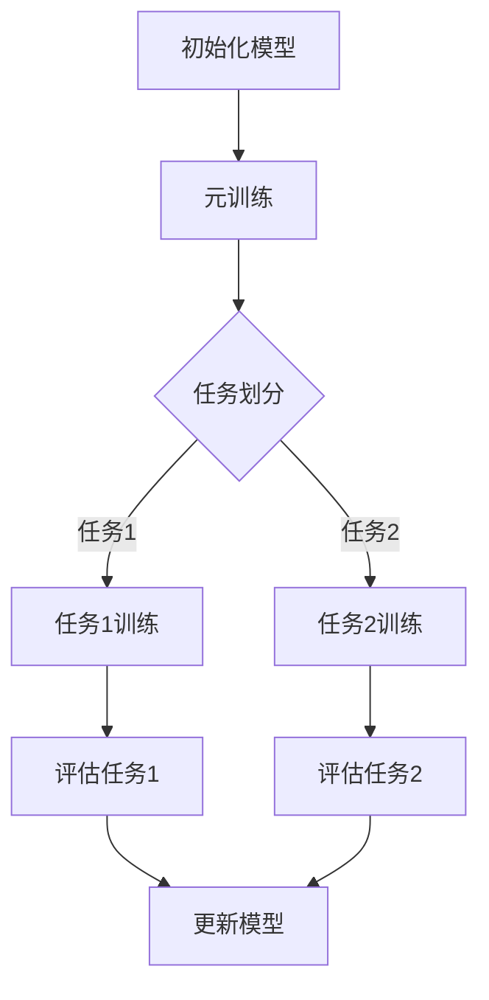

                 

### 元学习概述

#### 1.1 元学习的概念与历史

元学习（Meta-Learning），也称为学习的学习，是一种让模型学会快速适应新任务的学习方式。不同于传统机器学习方法需要为每个新任务重新训练模型，元学习旨在通过少量样本或经验，使模型能够快速泛化到新的任务中。这种能力在处理大量动态变化的任务时尤为重要。

元学习的历史可以追溯到20世纪60年代，当时研究人员开始探索如何设计能够在多个任务中表现良好的通用学习算法。1974年，Benjamin Kuipers提出了“学习到学习”（learning to learn）的概念。此后，随着深度学习的兴起，元学习得到了广泛关注和发展。目前，元学习已经成为人工智能领域的一个热点研究方向。

#### 1.2 元学习与传统学习的区别

传统学习通常是指模型在特定任务上通过大量数据进行训练，以提高在该任务上的性能。而元学习则侧重于如何让模型在不同任务上快速适应，具备较强的泛化能力。

1. **任务适应**
   - 传统学习：模型专注于单个任务的优化。
   - 元学习：模型旨在通过跨任务学习，提高在多个任务上的适应性。

2. **训练数据**
   - 传统学习：需要大量特定任务的数据。
   - 元学习：仅需少量数据或通过迁移学习利用已有知识。

3. **学习过程**
   - 传统学习：单阶段学习，通常需要从头开始训练。
   - 元学习：多阶段学习，先学习通用策略，再针对具体任务进行微调。

#### 1.3 元学习的基本类型

元学习可以分为几种不同的类型，每种类型有其独特的特点和应用场景：

1. **模型无关的元学习（Model-Agnostic Meta-Learning, MAML）**
   - 基本思想：通过调整模型参数，使其在不同任务上快速适应。
   - 特点：适用于多种模型架构，无需依赖特定模型。

2. **模型依赖的元学习（Model-Aware Meta-Learning）**
   - 基本思想：在元学习过程中考虑模型的特定结构，以优化模型在多个任务上的表现。
   - 特点：需要针对特定模型进行调整，可能降低泛化能力。

3. **基于模型的元学习（Model-Based Meta-Learning）**
   - 基本思想：构建一个基于模型的元学习框架，通过迭代优化模型结构和参数。
   - 特点：能够更好地处理复杂任务，但计算成本较高。

4. **元学习迁移（Meta-Learning Transfer）**
   - 基本思想：将元学习知识从一个领域迁移到另一个领域。
   - 特点：适用于多个领域间的知识共享和迁移。

#### 核心概念与联系

为了更好地理解元学习的概念，我们可以通过以下表格对比元学习与传统学习的核心差异：

| 对比维度 | 元学习 | 传统学习 |
| --- | --- | --- |
| 学习目标 | 跨任务泛化 | 单任务优化 |
| 训练数据 | 少量样本 | 大量样本 |
| 学习过程 | 多阶段学习 | 单阶段学习 |
| 适应能力 | 快速适应新任务 | 专注单一任务 |

此外，我们还可以使用Mermaid流程图来展示元学习的基本流程：



在元学习过程中，模型首先在多个任务上进行训练，然后通过评估和更新模型参数，使其在不同任务上表现出良好的适应性。这种流程使得元学习能够实现快速泛化和高效学习。

### 数学模型

元学习中的数学模型通常涉及优化问题和损失函数。以下是一个简化的元学习模型示例，使用Python代码和LaTeX公式进行说明：

```python
import torch
import torch.nn as nn
import torch.optim as optim

# 初始化模型
model = nn.Linear(10, 1)
optimizer = optim.Adam(model.parameters(), lr=0.001)

# 元训练损失函数
def meta_loss(params, x, y):
    pred = model(x)
    loss = nn.MSELoss()(pred, y)
    return loss

# 元训练过程
for epoch in range(num_epochs):
    for task in tasks:
        x, y = task
        optimizer.zero_grad()
        loss = meta_loss(model.parameters(), x, y)
        loss.backward()
        optimizer.step()
```

LaTeX公式：

$$
\text{loss} = \frac{1}{m} \sum_{i=1}^{m} (\hat{y}_i - y_i)^2
$$

在这个示例中，`model` 代表神经网络模型，`optimizer` 用于优化模型参数。`meta_loss` 函数计算模型预测值与真实值之间的均方误差（MSE），并返回损失值。通过反向传播和梯度下降优化模型参数，使得模型在元训练过程中逐步适应不同任务。

总的来说，元学习通过多种类型和模型架构，实现了跨任务的快速适应和高效学习，在个性化语音助手等应用场景中展示了其强大的潜力。在接下来的章节中，我们将深入探讨元学习在个性化语音助手中的具体应用和实践。

