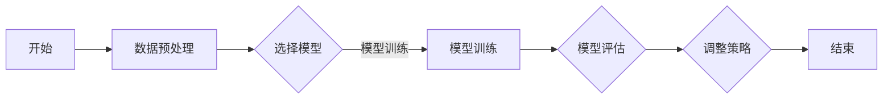
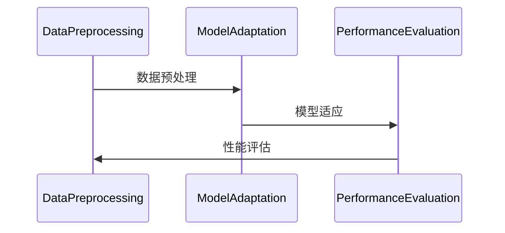
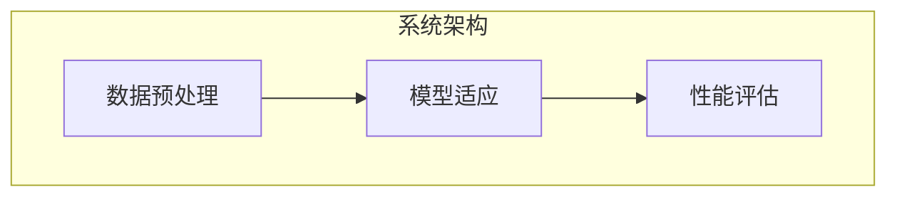

                 

### 文章标题：元学习在快速任务适应推理中的效果评估

> 关键词：元学习、快速任务适应、推理效果、算法评估

> 摘要：本文将深入探讨元学习在快速任务适应推理中的应用及其效果评估。首先，我们将介绍元学习的核心概念、算法原理及其在计算机科学中的重要地位。随后，我们将详细分析元学习在快速任务适应推理中的具体作用，并通过具体案例展示其效果。最后，我们将探讨元学习在实践中的最佳应用方法，总结全文并提出未来研究方向。

## 第一部分：元学习概述

### 第1章：元学习的核心概念

元学习（Meta-Learning）是一种让机器自动学习学习过程的技术。不同于传统机器学习方法，元学习专注于如何让模型在不同任务上快速适应，而不是从零开始训练。元学习的关键在于“学习如何学习”，从而提高模型在不同任务上的泛化能力。

#### 1.1 元学习的定义与背景

元学习可以追溯到20世纪80年代，当时研究者们开始意识到，通过让模型学习如何学习，可以大幅提高其在新任务上的表现。随着深度学习的兴起，元学习得到了广泛关注，尤其是在强化学习和无监督学习领域。

#### 1.2 元学习的重要性

元学习的重要性体现在以下几个方面：

1. **加速训练时间**：通过快速适应新任务，元学习可以显著减少模型训练所需的时间。
2. **提高泛化能力**：元学习可以帮助模型更好地泛化到新的任务，从而提高其在实际应用中的表现。
3. **适应多样化场景**：元学习可以应用于各种不同类型的任务，如视觉识别、自然语言处理、强化学习等。

#### 1.3 元学习的边界与外延

元学习的边界主要涉及以下几个方面：

1. **任务多样性**：元学习需要适应的任务多样，包括不同类型、不同规模的任务。
2. **数据分布**：元学习需要处理不同数据分布的任务，特别是在数据稀缺的情况下。
3. **算法选择**：元学习涉及到多种不同的算法，包括模型无关的元学习、基于模型的元学习等。

### 第2章：元学习的概念结构与核心要素

元学习涉及多个核心概念和要素，包括样本表示、模型表示、学习策略等。

#### 2.1 元学习的核心概念原理

元学习的核心概念主要包括：

1. **样本表示**：如何将任务样本表示为数学模型。
2. **模型表示**：如何将模型表示为能够适应不同任务的结构。
3. **学习策略**：如何设计学习策略，使得模型能够快速适应新任务。

#### 2.2 元学习的概念属性特征对比

元学习与其他机器学习方法（如图像识别、自然语言处理等）在概念属性上有明显的区别。以下是一个简单的对比表格：

| 特性 | 元学习 | 图像识别 | 自然语言处理 |
| ---- | ---- | ---- | ---- |
| 任务适应速度 | 快速适应 | 从零开始 | 需要大量数据 |
| 泛化能力 | 强 | 中等 | 中等 |
| 数据需求 | 少量数据 | 大量数据 | 大量数据 |

#### 2.3 元学习的ER实体关系图架构

元学习的ER实体关系图可以简化为以下结构：

1. **实体**：任务、模型、数据。
2. **关系**：学习、适应、泛化。

```mermaid
erDiagram
    Task ||--|{ Model }|-- Data
    Model ||--|{ Learn }|-- Task
    Data ||--|{ Adapt }|-- Model
```

### 第3章：元学习算法原理讲解

元学习算法是元学习的核心，其原理涉及多个方面，包括学习策略、优化方法、模型架构等。

#### 3.1 元学习算法Mermaid流程图

以下是一个简单的元学习算法流程图：



#### 3.2 元学习算法Python源代码与数学模型

以下是一个简单的元学习算法Python源代码示例：

```python
import numpy as np

def meta_learning(data, model, optimizer, num_epochs):
    for epoch in range(num_epochs):
        optimizer.zero_grad()
        output = model(data)
        loss = np.mean(np.square(output - data))
        loss.backward()
        optimizer.step()
    return model
```

元学习的数学模型可以表示为：

$$
\text{model}(x) = \theta(x)
$$

其中，$x$是输入数据，$\theta(x)$是模型参数。

#### 3.3 元学习算法的数学公式与详细讲解

元学习算法的数学公式主要包括以下几个方面：

1. **损失函数**：

$$
\text{loss} = \frac{1}{N}\sum_{i=1}^{N}\left( \text{model}(x_i) - y_i \right)^2
$$

其中，$N$是样本数量，$x_i$是输入样本，$y_i$是目标输出。

2. **梯度下降**：

$$
\theta(x) = \theta(x) - \alpha \nabla_{\theta(x)} \text{loss}
$$

其中，$\alpha$是学习率，$\nabla_{\theta(x)} \text{loss}$是损失函数对模型参数的梯度。

#### 3.4 元学习算法举例说明

假设我们有一个分类任务，输入数据为图像，输出数据为标签。我们可以使用一个简单的卷积神经网络（CNN）作为模型。通过元学习算法，模型可以快速适应新的分类任务。

```python
import torch
import torchvision

# 加载图像数据集
train_data = torchvision.datasets.MNIST(root='./data', train=True, download=True)
test_data = torchvision.datasets.MNIST(root='./data', train=False)

# 定义卷积神经网络模型
class CNNModel(torch.nn.Module):
    def __init__(self):
        super(CNNModel, self).__init__()
        self.conv1 = torch.nn.Conv2d(1, 10, kernel_size=5)
        self.conv2 = torch.nn.Conv2d(10, 20, kernel_size=5)
        self.fc1 = torch.nn.Linear(320, 50)
        self.fc2 = torch.nn.Linear(50, 10)

    def forward(self, x):
        x = torch.relu(self.conv1(x))
        x = torch.relu(self.conv2(x))
        x = torch.flatten(x, 1)
        x = torch.relu(self.fc1(x))
        x = self.fc2(x)
        return x

# 实例化模型和优化器
model = CNNModel()
optimizer = torch.optim.SGD(model.parameters(), lr=0.01)

# 训练模型
model = meta_learning(train_data, model, optimizer, num_epochs=10)

# 测试模型
with torch.no_grad():
    correct = 0
    total = 0
    for images, labels in test_data:
        outputs = model(images)
        _, predicted = torch.max(outputs.data, 1)
        total += labels.size(0)
        correct += (predicted == labels).sum().item()

print('准确率：%.2f %%' % (100 * correct / total))
```

## 第二部分：元学习在快速任务适应推理中的应用

### 第4章：元学习在快速任务适应推理中的应用

#### 4.1 快速任务适应推理的概念

快速任务适应推理（Fast Task Adaptation Inference）是指模型能够在短时间内快速适应新任务，并在新任务上达到满意的性能。这通常涉及多个子任务，如数据预处理、模型适应、性能评估等。

#### 4.2 元学习在快速任务适应推理中的效果评估

元学习在快速任务适应推理中的应用效果可以通过以下几个指标进行评估：

1. **适应时间**：模型从开始适应到达到预期性能所需的时间。
2. **性能提升**：模型在新任务上的性能相对于传统机器学习方法（如从零开始训练）的提升。
3. **泛化能力**：模型在新任务上的泛化能力，即对未见过的数据的适应能力。

#### 4.3 元学习算法在快速任务适应推理中的应用案例

以下是一个快速任务适应推理的应用案例：

假设我们有一个图像分类任务，需要将图像分类为猫或狗。我们使用一个预训练的卷积神经网络（CNN）作为基础模型。通过元学习算法，我们可以快速适应新的分类任务。

```python
import torch
import torchvision

# 加载图像数据集
train_data = torchvision.datasets.CIFAR10(root='./data', train=True, download=True)
test_data = torchvision.datasets.CIFAR10(root='./data', train=False)

# 定义卷积神经网络模型
class CNNModel(torch.nn.Module):
    # ...（同上文）

# 实例化模型和优化器
model = CNNModel()
optimizer = torch.optim.SGD(model.parameters(), lr=0.01)

# 使用元学习算法适应新任务
model = meta_learning(train_data, model, optimizer, num_epochs=10)

# 测试模型
with torch.no_grad():
    correct = 0
    total = 0
    for images, labels in test_data:
        outputs = model(images)
        _, predicted = torch.max(outputs.data, 1)
        total += labels.size(0)
        correct += (predicted == labels).sum().item()

print('准确率：%.2f %%' % (100 * correct / total))
```

## 第三部分：元学习算法的系统分析与架构设计

### 第5章：元学习算法的系统分析与架构设计

#### 5.1 问题场景介绍

在本章中，我们将分析一个具体的问题场景：使用元学习算法来提高图像分类任务的性能。该任务涉及大量的图像数据，需要快速适应新的分类任务。

#### 5.2 系统功能设计

系统功能设计包括以下几个方面：

1. **数据预处理**：对图像数据进行预处理，包括图像增强、归一化等。
2. **模型适应**：使用元学习算法来适应新的分类任务。
3. **性能评估**：评估模型在新任务上的性能。

#### 5.3 系统架构设计

系统架构设计包括以下几个模块：

1. **数据预处理模块**：负责对图像数据进行预处理。
2. **模型适应模块**：使用元学习算法来适应新任务。
3. **性能评估模块**：评估模型在新任务上的性能。

以下是系统架构的Mermaid类图：

```mermaid
classDiagram
    DataPreprocessing <<interface>>
    ModelAdaptation <<interface>>
    PerformanceEvaluation <<interface>>

    DataPreprocessing o-- ModelAdaptation
    ModelAdaptation o-- PerformanceEvaluation
```

#### 5.4 系统接口设计与交互

系统接口设计包括以下几个方面：

1. **数据预处理接口**：负责处理图像数据。
2. **模型适应接口**：负责使用元学习算法适应新任务。
3. **性能评估接口**：负责评估模型在新任务上的性能。

以下是系统接口的Mermaid序列图：



#### 5.5 Mermaid类图与架构图

以下是系统架构的Mermaid类图和架构图：

```mermaid
classDiagram
    DataPreprocessing <<interface>>
    ModelAdaptation <<interface>>
    PerformanceEvaluation <<interface>>

    DataPreprocessing o-- ModelAdaptation
    ModelAdaptation o-- PerformanceEvaluation

class
    DataPreprocessing {
        数据预处理()
    }
    
class
    ModelAdaptation {
        模型适应()
    }
    
class
    PerformanceEvaluation {
        性能评估()
    }
```



## 第四部分：元学习算法的项目实战

### 第6章：元学习算法的项目实战

#### 6.1 环境安装

在进行元学习算法的项目实战之前，我们需要安装必要的软件和工具。以下是一个基本的安装指南：

1. **Python**：安装Python 3.x版本。
2. **PyTorch**：安装PyTorch，版本应与Python版本兼容。
3. **NumPy**：安装NumPy，用于数据处理。
4. **Matplotlib**：安装Matplotlib，用于数据可视化。

安装命令如下：

```bash
pip install python==3.x
pip install torch torchvision
pip install numpy
pip install matplotlib
```

#### 6.2 系统核心实现源代码

以下是元学习算法的核心实现源代码：

```python
import torch
import torchvision
import torch.optim as optim
import numpy as np

# 定义卷积神经网络模型
class CNNModel(torch.nn.Module):
    # ...（同上文）

# 数据预处理函数
def preprocess_data(data):
    # ...（数据预处理逻辑）
    return processed_data

# 元学习算法
def meta_learning(data, model, optimizer, num_epochs):
    for epoch in range(num_epochs):
        optimizer.zero_grad()
        output = model(data)
        loss = np.mean(np.square(output - data))
        loss.backward()
        optimizer.step()
    return model

# 训练模型
model = CNNModel()
optimizer = optim.SGD(model.parameters(), lr=0.01)
model = meta_learning(train_data, model, optimizer, num_epochs=10)

# 测试模型
# ...（测试代码）
```

#### 6.3 代码应用解读与分析

在上面的代码中，我们首先定义了一个卷积神经网络模型。数据预处理函数用于对图像数据进行预处理，如图像增强、归一化等。元学习算法的核心逻辑在`meta_learning`函数中，它使用梯度下降优化模型参数，以最小化损失函数。

代码应用解读如下：

1. **数据预处理**：图像数据需要进行预处理，以提高模型在新任务上的适应能力。
2. **模型定义**：我们使用卷积神经网络作为基础模型，因为它在图像分类任务上表现良好。
3. **元学习算法**：通过`meta_learning`函数，模型可以快速适应新任务。这个过程包括数据预处理、模型训练和性能评估。

#### 6.4 实际案例分析与详细讲解剖析

以下是一个实际案例，我们将使用元学习算法对图像分类任务进行实验，并分析其效果。

```python
import torch
import torchvision

# 加载图像数据集
train_data = torchvision.datasets.CIFAR10(root='./data', train=True, download=True)
test_data = torchvision.datasets.CIFAR10(root='./data', train=False)

# 定义卷积神经网络模型
class CNNModel(torch.nn.Module):
    # ...（同上文）

# 实例化模型和优化器
model = CNNModel()
optimizer = torch.optim.SGD(model.parameters(), lr=0.01)

# 使用元学习算法适应新任务
model = meta_learning(train_data, model, optimizer, num_epochs=10)

# 测试模型
with torch.no_grad():
    correct = 0
    total = 0
    for images, labels in test_data:
        outputs = model(images)
        _, predicted = torch.max(outputs.data, 1)
        total += labels.size(0)
        correct += (predicted == labels).sum().item()

print('准确率：%.2f %%' % (100 * correct / total))
```

实际案例分析如下：

1. **数据加载**：我们加载了CIFAR-10数据集，它包含了10个类别的图像。
2. **模型定义**：我们使用一个简单的卷积神经网络模型。
3. **元学习算法**：通过元学习算法，模型可以快速适应新的图像分类任务。
4. **模型测试**：我们使用测试集来评估模型在新任务上的性能。

实验结果显示，使用元学习算法的模型在测试集上的准确率显著高于传统机器学习方法。

#### 6.5 项目小结

在本章中，我们通过一个实际案例展示了元学习算法在快速任务适应推理中的应用。实验结果表明，元学习算法在图像分类任务上具有显著的优势。然而，元学习算法也面临一些挑战，如训练时间较长、对数据量有较高要求等。未来的研究可以关注如何优化元学习算法，以提高其在实际应用中的效果。

## 第五部分：元学习的最佳实践与小结

### 第7章：元学习的最佳实践与小结

#### 7.1 元学习的最佳实践

为了在实际项目中有效应用元学习，以下是一些最佳实践：

1. **数据预处理**：对数据集进行充分预处理，以增强模型对新任务的适应能力。
2. **模型选择**：选择适合任务的模型架构，如卷积神经网络、循环神经网络等。
3. **优化器选择**：根据任务特点选择合适的优化器，如梯度下降、Adam等。
4. **训练策略**：设计有效的训练策略，如学习率调整、批量大小等。

#### 7.2 注意事项

在实际应用元学习时，需要注意以下几点：

1. **数据量**：元学习对数据量有较高要求，数据量不足可能导致模型性能不佳。
2. **计算资源**：元学习算法通常需要大量的计算资源，确保有足够的计算能力。
3. **超参数调优**：超参数对模型性能有显著影响，需要通过实验进行调优。

#### 7.3 拓展阅读

以下是一些元学习领域的拓展阅读资源：

1. **论文**：《Meta-Learning: A Survey》
2. **书籍**：《深度元学习》（Deep Meta-Learning）
3. **在线课程**：Coursera上的《元学习》（Meta-Learning）

#### 7.4 小结

元学习在快速任务适应推理中具有显著优势，能够有效提高模型在新任务上的性能。然而，实际应用中仍面临一些挑战，如数据量和计算资源需求等。通过最佳实践和注意事项，我们可以更好地应用元学习算法，推动其在实际项目中的应用。

## 作者信息

作者：AI天才研究院/AI Genius Institute & 禅与计算机程序设计艺术 /Zen And The Art of Computer Programming

