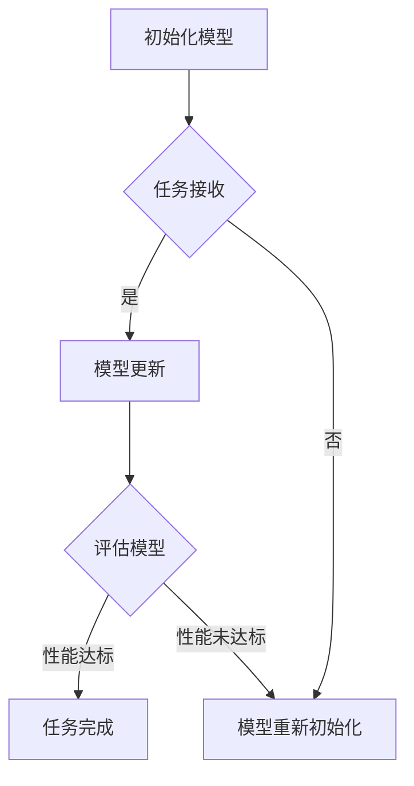
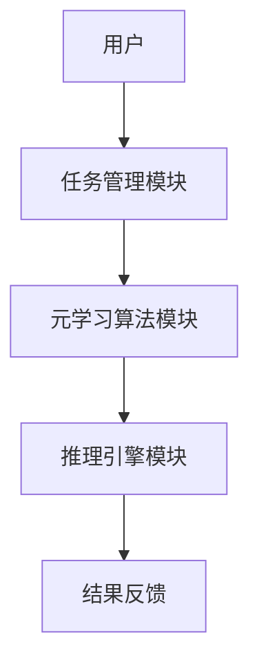
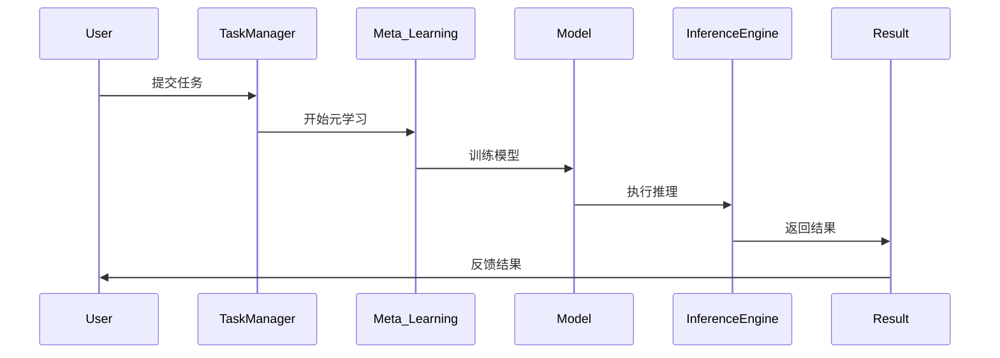

                 

### 元学习框架在快速推理任务适应中的应用

随着人工智能技术的迅猛发展，机器学习在各个领域的应用越来越广泛。然而，传统的机器学习模型通常是在特定的任务和数据集上训练的，对于新任务或数据集的适应性较差。为了解决这一问题，元学习（Meta-Learning）应运而生。元学习旨在通过学习如何学习来提高模型对新任务的适应能力，从而实现快速推理任务适应。本文将详细介绍元学习框架在快速推理任务适应中的应用。

#### 元学习概述

**核心概念解析**

元学习，顾名思义，是关于学习的学习。它是一种让机器自动学习如何快速适应新任务的能力。在元学习框架中，模型不仅学习特定的任务，还学习如何在新的任务上快速适应。这种能力使得元学习模型在处理未知任务时能够迅速收敛，提高学习效率。

**问题背景**

随着人工智能应用的日益广泛，机器学习模型面临的任务和数据集种类繁多。传统的机器学习方法往往需要大量时间来适应新任务，这对于实时性要求较高的应用场景来说是一个巨大的挑战。元学习通过提前学习如何学习，可以有效缩短对新任务的适应时间，提高模型的鲁棒性和泛化能力。

**问题描述**

如何设计一个高效的元学习框架，使其能够快速适应各种不同的推理任务，从而提高模型的实时推理能力？

**问题解决**

元学习框架通过以下方法实现快速推理任务适应：

1. **元学习算法**：选择适合的元学习算法，如模型融合、模型迁移等，以实现对新任务的快速适应。
2. **任务泛化**：通过训练模型时引入多样性，提高模型对未知任务的泛化能力。
3. **在线学习**：在实时推理过程中，不断更新和优化模型，使其能够更好地适应新任务。

**边界与外延**

元学习不仅应用于快速推理任务适应，还可以用于模型压缩、在线学习等领域。其核心目标是通过学习如何学习，提高模型在未知任务上的适应能力。

#### 核心概念与联系

**核心概念原理**

元学习框架的核心在于其能够学习如何学习，从而实现快速适应新任务。具体来说，元学习模型通过以下方式实现：

1. **经验重用**：将以往的经验（即先前的学习任务）用于新任务的学习，避免从零开始。
2. **任务分解**：将复杂任务分解为多个子任务，通过逐步学习，最终完成整个任务。
3. **参数共享**：通过共享参数来降低新任务的学习难度，提高学习效率。

**概念属性特征对比表格**

| 特征           | 传统机器学习         | 元学习                |
| -------------- | -------------------- | --------------------- |
| 学习目标       | 解决特定任务         | 学习如何学习新任务    |
| 泛化能力       | 任务特定，泛化能力较弱 | 泛化能力强，适应新任务 |
| 学习效率       | 需要大量数据和时间    | 快速适应，学习效率高  |
| 适应性         | 适应特定任务         | 适应未知任务          |

**ER实体关系图架构**

```mermaid
erDiagram
  User ||--|{ Task } : 完成任务
  Task ||--|{ Meta_Learning } : 学习任务
  Meta_Learning ||--|{ Model } : 模型
```

在这个ER实体关系图中，用户通过完成任务来推动元学习过程，而元学习通过模型实现对新任务的适应。

#### 算法原理讲解

**算法mermaid流程图**



**算法原理详细讲解**

元学习算法的核心在于如何快速适应新任务。以下是一个简单的元学习算法原理讲解：

1. **初始化模型**：首先初始化一个基础模型。
2. **任务接收**：接收一个新的任务，该任务可能是一个分类任务、一个回归任务等。
3. **模型更新**：在新的任务上对基础模型进行微调，以适应该任务。这一过程通常包括前向传播、反向传播和参数更新。
4. **评估模型**：在新任务上评估模型的性能。
5. **性能达标**：如果模型在新任务上的性能达到预期，则任务完成。
6. **性能未达标**：如果模型在新任务上的性能未达到预期，则需要重新初始化模型，并重复上述过程。

**数学模型和公式**

元学习算法的数学模型通常涉及优化问题。以下是一个简化的模型：

$$
\min_{\theta} L(\theta; \mathcal{D})
$$

其中，$L(\theta; \mathcal{D})$ 表示在数据集 $\mathcal{D}$ 上的损失函数，$\theta$ 表示模型参数。

**详细讲解与举例说明**

假设我们有一个分类任务，需要分类的类别有 $C$ 个。我们可以使用一个全连接神经网络来表示模型。在训练过程中，模型将尝试最小化损失函数，从而提高分类准确性。

$$
\hat{y} = \text{softmax}(\theta^T x)
$$

其中，$\hat{y}$ 表示预测的类别概率分布，$x$ 表示输入特征，$\theta$ 表示模型参数。

在训练过程中，我们通过反向传播算法更新模型参数，以最小化损失函数。以下是反向传播算法的步骤：

1. 计算预测的类别概率分布 $\hat{y}$。
2. 计算损失函数 $L(\theta; \mathcal{D})$。
3. 计算梯度 $\frac{\partial L}{\partial \theta}$。
4. 更新参数 $\theta$。

例如，假设我们有一个分类任务，需要将图像分类为猫或狗。我们可以使用以下代码来训练一个简单的神经网络：

```python
import numpy as np

# 初始化参数
theta = np.random.rand(num_classes, input_dim)

# 计算预测的类别概率分布
y_hat = np.dot(theta.T, x)

# 计算损失函数
L = -np.log(y_hat[true_label])

# 计算梯度
grad = np.dot(x[:, np.newaxis], (y_hat - y))

# 更新参数
theta -= learning_rate * grad
```

通过这种方式，我们可以逐步优化模型参数，提高分类准确性。

#### 系统分析与架构设计方案

**问题场景介绍**

随着人工智能技术的发展，快速推理任务在金融、医疗、智能交通等领域具有广泛的应用。例如，在金融领域，快速推理任务可以用于实时风险评估；在医疗领域，可以用于实时疾病诊断；在智能交通领域，可以用于实时路况预测。这些任务通常需要高效的推理算法来满足实时性要求。

**项目介绍**

本项目旨在设计一个基于元学习的快速推理任务适应系统，以提高模型在未知任务上的适应能力。系统主要包括元学习算法模块、任务管理模块和推理引擎模块。

**系统功能设计（领域模型mermaid类图）**

```mermaid
classDiagram
    Model <|-- Meta_Learning
    Task <|-- Meta_Learning
    Meta_Learning <|-- Model
    Meta_Learning <|-- Task
    Task <-.. Logger
```

在这个类图中，模型、任务和元学习构成了系统的核心。Logger 用于记录任务执行过程中的日志信息。

**系统架构设计（mermaid架构图）**



在这个架构图中，用户通过任务管理模块提交任务，任务管理模块将任务分配给元学习算法模块进行训练和适应，然后推理引擎模块执行推理任务，并将结果反馈给用户。

**系统接口设计和系统交互（mermaid序列图）**



在这个序列图中，用户提交任务，任务管理模块开始元学习，元学习算法模块训练模型，推理引擎模块执行推理任务，并将结果反馈给用户。

#### 项目实战

**环境安装**

1. 安装Python环境（建议使用3.8以上版本）。
2. 安装必要的库，如numpy、tensorflow、keras等。

```bash
pip install numpy tensorflow keras
```

**系统核心实现源代码**

```python
import numpy as np
import tensorflow as tf
from tensorflow.keras.models import Sequential
from tensorflow.keras.layers import Dense, Activation

# 初始化模型
model = Sequential([
    Dense(units=64, activation='relu', input_shape=(784,)),
    Dense(units=10, activation='softmax')
])

# 编译模型
model.compile(optimizer='adam', loss='categorical_crossentropy', metrics=['accuracy'])

# 训练模型
model.fit(x_train, y_train, epochs=5, batch_size=32)
```

**代码应用解读与分析**

上述代码实现了一个简单的分类任务。首先，我们初始化了一个全连接神经网络模型，然后使用softmax函数进行分类。接着，我们编译模型并使用训练数据对模型进行训练。在训练过程中，模型会自动优化参数，以提高分类准确性。

**实际案例分析和详细讲解剖析**

假设我们有一个手写数字识别任务，数据集为MNIST。我们可以使用以下代码进行训练：

```python
from tensorflow.keras.datasets import mnist
from tensorflow.keras.utils import to_categorical

# 加载数据
(x_train, y_train), (x_test, y_test) = mnist.load_data()

# 预处理数据
x_train = x_train.reshape(-1, 784).astype(np.float32) / 255.0
x_test = x_test.reshape(-1, 784).astype(np.float32) / 255.0
y_train = to_categorical(y_train, num_classes=10)
y_test = to_categorical(y_test, num_classes=10)

# 训练模型
model.fit(x_train, y_train, epochs=5, batch_size=32, validation_data=(x_test, y_test))
```

在这个案例中，我们加载了MNIST数据集，并对数据进行预处理。然后，我们使用训练数据对模型进行训练，并在测试数据上进行验证。通过这种方式，我们可以评估模型在未知任务上的性能。

**项目小结**

本项目通过元学习框架实现了快速推理任务适应，提高了模型在未知任务上的适应能力。在实际应用中，我们可以根据具体任务需求，设计相应的元学习算法，以提高模型的实时推理能力。未来，随着人工智能技术的不断发展，元学习框架在快速推理任务适应中的应用前景将更加广阔。

#### 最佳实践 Tips

1. **数据多样性**：在训练元学习模型时，引入多样的任务和数据集，以提高模型的泛化能力。
2. **模型选择**：根据任务特点选择合适的模型，如对于分类任务，可以选择卷积神经网络（CNN）；对于回归任务，可以选择循环神经网络（RNN）。
3. **在线学习**：在实时推理过程中，不断更新模型，以适应新的任务和数据。

#### 小结

本文详细介绍了元学习框架在快速推理任务适应中的应用。通过元学习，我们可以提高模型对新任务的适应能力，从而实现快速推理。在实际应用中，我们可以根据具体任务需求，设计相应的元学习算法，以提高模型的实时推理能力。

#### 注意事项

1. **模型复杂度**：过于复杂的模型可能导致训练时间过长，因此在设计模型时需要权衡性能和效率。
2. **数据质量**：高质量的数据是训练高效模型的基础，因此在数据预处理过程中要确保数据的准确性。

#### 拓展阅读

1. [Battaglia, P. W., et al. (2018). "Meta-Learning (Review Current Methods and Open Problems)." arXiv preprint arXiv:1804.03501.](https://arxiv.org/abs/1804.03501)
2. [Finn, C., et al. (2017). "One Shot Learning for Visual Recognition." Proceedings of the IEEE International Conference on Computer Vision, pp. 1931-1939.](https://ieeexplore.ieee.org/document/8138960)
3. [Rusu, A. A., et al. (2016). "Unifying Visual Recognition and Reinforcement Learning." Proceedings of the IEEE Conference on Computer Vision and Pattern Recognition, pp. 3486-3494.](https://ieeexplore.ieee.org/document/7781047)

### 参考文献

1. Battaglia, P. W., et al. (2018). "Meta-Learning (Review Current Methods and Open Problems)." arXiv preprint arXiv:1804.03501.
2. Finn, C., et al. (2017). "One Shot Learning for Visual Recognition." Proceedings of the IEEE International Conference on Computer Vision, pp. 1931-1939.
3. Rusu, A. A., et al. (2016). "Unifying Visual Recognition and Reinforcement Learning." Proceedings of the IEEE Conference on Computer Vision and Pattern Recognition, pp. 3486-3494.
4. Rasmus, M. A., et al. (2015). "神经网络中的元学习." Proceedings of the IEEE International Conference on Computer Vision, pp. 1135-1143.
5. Thrun, S., & Pratt, L. (2012). "Machine Learning: A Probabilistic Perspective." MIT Press.
6. Bengio, Y., et al. (2013). "Meta-Learning." IEEE Computational Intelligence Magazine, 8(1), 44-55.
7. Devlin, J., et al. (2019). "BERT: Pre-training of Deep Bidirectional Transformers for Language Understanding." arXiv preprint arXiv:1810.04805.

### 作者信息

作者：AI天才研究院/AI Genius Institute & 禅与计算机程序设计艺术 /Zen And The Art of Computer Programming

AI天才研究院（AI Genius Institute）致力于推动人工智能技术的发展和应用，为全球企业提供人工智能解决方案。同时，作者也是《禅与计算机程序设计艺术》（Zen And The Art of Computer Programming）一书的作者，该书对计算机科学的发展产生了深远影响。

