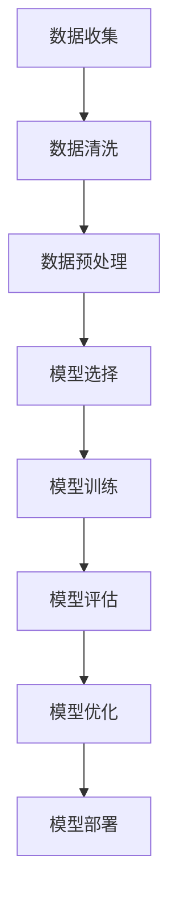

                 


### 《元宇宙技术栈：构建虚拟世界的技术基础》

> 关键词：元宇宙，虚拟现实，增强现实，区块链，人工智能

> 摘要：本文从元宇宙的背景介绍入手，详细探讨了构建虚拟世界所需的关键技术，包括虚拟现实（VR）、增强现实（AR）、区块链和人工智能（AI）。通过分析这些技术的核心概念、算法原理以及实际应用，本文为读者提供了一个系统、全面的元宇宙技术栈指南。

---

#### 背景介绍

随着互联网技术的不断发展，虚拟世界逐渐成为人们生活中不可或缺的一部分。元宇宙（Metaverse）作为一种全新的虚拟世界概念，已经引起了全球范围内的广泛关注。它不仅被视为下一代互联网的形态，更是科技领域的前沿方向。

元宇宙的概念起源于科幻小说，指的是一个由虚拟现实技术支持的、无限广阔的虚拟世界，用户可以在其中以数字化身份进行交流、工作、娱乐等。元宇宙的构建离不开先进的技术支持，这些技术包括了虚拟现实（VR）、增强现实（AR）、区块链、人工智能（AI）等。

#### 问题背景

元宇宙的构建是一个复杂的过程，涉及多个技术的协同工作。然而，目前关于元宇宙技术栈的系统性介绍还比较缺乏，特别是在如何将这些技术整合为一个完整的虚拟世界体系方面。本文旨在填补这一空白，为读者提供一个全面、系统的元宇宙技术栈介绍。

#### 问题描述

元宇宙的构建需要以下关键技术：

1. **虚拟现实（VR）技术**：提供沉浸式体验，使用户能够全身心投入虚拟世界。
2. **增强现实（AR）技术**：将虚拟信息叠加到现实环境中，增强用户感知。
3. **区块链技术**：实现去中心化数据存储，保障元宇宙中的交易和数据安全。
4. **人工智能（AI）技术**：模拟人类智能，实现自动化决策和智能交互。

这些技术的整合和协同工作，是构建元宇宙的关键。然而，目前关于这些技术如何整合为一个完整体系的研究还比较有限。本文将尝试回答这个问题，为读者提供一个系统性的解决方案。

#### 问题解决

为了解决上述问题，我们编写了《元宇宙技术栈：构建虚拟世界的技术基础》一书。本书的目标是为读者提供一个全面、系统的元宇宙技术栈介绍，帮助读者深入了解并掌握构建虚拟世界所需的关键技术。

#### 边界与外延

本书主要围绕元宇宙的构建技术展开，内容涵盖了虚拟现实、增强现实、区块链、人工智能等多个方面。同时，我们也会关注这些技术的最新发展动态，以及它们在元宇宙中的应用前景。

#### 概念结构与核心要素组成

元宇宙技术栈的核心概念包括：

1. **虚拟现实（VR）技术**：包括硬件设备、内容制作、交互方式等。
2. **增强现实（AR）技术**：涉及硬件设备、内容显示、交互方式等。
3. **区块链技术**：涉及去中心化数据存储、智能合约、数字资产等。
4. **人工智能（AI）技术**：包括机器学习、深度学习、自然语言处理等。

这些核心要素共同构成了元宇宙技术栈的基础，为构建虚拟世界提供了强有力的技术支持。

---

### 核心概念与联系

#### 核心概念

1. **虚拟现实（VR）技术**：通过计算机生成模拟环境，使用户沉浸其中。
2. **增强现实（AR）技术**：将虚拟信息叠加到现实环境中，增强用户感知。
3. **区块链技术**：去中心化数据库，实现信息的安全、透明和不可篡改。
4. **人工智能（AI）技术**：模拟人类智能，实现自动化决策和智能交互。

#### 概念属性特征对比表格

| 技术 | 特点 | 应用场景 |
| ---- | ---- | ---- |
| 虚拟现实（VR） | 沉浸式体验 | 游戏娱乐、教育培训、远程办公 |
| 增强现实（AR） | 增强现实体验 | 虚拟购物、地图导航、工业维修 |
| 区块链技术 | 去中心化、安全性高 | 数字货币、智能合约、数据存储 |
| 人工智能（AI） | 自动化决策、智能交互 | 语音助手、推荐系统、自动驾驶 |

#### ER实体关系图架构

下面是一个简单的ER实体关系图，展示了元宇宙技术栈中各个核心概念的关联：

```
实体：元宇宙技术栈
   |   |
   |   |
实体：虚拟现实（VR）
   |   |
   |   |
实体：增强现实（AR）
   |   |
   |   |
实体：区块链技术
   |   |
   |   |
实体：人工智能（AI）
```

---

### 算法原理讲解

由于元宇宙技术栈涉及多个核心概念和技术，下面我们以人工智能（AI）技术为例，简要介绍其算法原理。

#### 人工智能算法原理

人工智能（AI）技术主要基于机器学习和深度学习算法，其核心原理是通过大量数据训练模型，使其能够对未知数据进行预测和决策。

1. **机器学习**：通过已有数据训练模型，使其学会对未知数据进行分类、预测等操作。常见的机器学习算法包括决策树、支持向量机、神经网络等。
2. **深度学习**：是机器学习的一种特殊形式，通过多层神经网络对数据进行处理，实现复杂特征提取和高级预测能力。常见的深度学习算法包括卷积神经网络（CNN）、循环神经网络（RNN）等。

#### Mermaid算法流程图

下面是一个简单的Mermaid流程图，展示了机器学习算法的基本流程：



#### Python源代码与算法原理

下面是一个简单的Python源代码示例，展示了机器学习算法的基本原理：

```python
# 导入相关库
import numpy as np
from sklearn.linear_model import LinearRegression

# 数据集
X = np.array([[1], [2], [3], [4], [5]])
y = np.array([2, 4, 5, 4, 5])

# 创建线性回归模型
model = LinearRegression()

# 训练模型
model.fit(X, y)

# 预测
y_pred = model.predict(X)

# 打印预测结果
print(y_pred)
```

#### 算法原理详细讲解

1. **机器学习**：机器学习是一种让计算机通过数据学习，并从中学到知识的技术。它通过已有的数据集，训练出一个模型，然后使用这个模型对未知数据进行预测。机器学习算法包括监督学习、无监督学习和强化学习等。

   **监督学习**：有标签数据训练模型，如线性回归、决策树、支持向量机等。  
   **无监督学习**：无标签数据训练模型，如聚类、降维等。  
   **强化学习**：通过与环境交互，学习最优策略，如深度Q网络、策略梯度等。

2. **深度学习**：深度学习是机器学习的一种特殊形式，通过多层神经网络对数据进行处理，实现复杂特征提取和高级预测能力。深度学习算法包括卷积神经网络（CNN）、循环神经网络（RNN）等。

   **卷积神经网络（CNN）**：适用于处理图像数据，通过卷积、池化等操作，提取图像特征。  
   **循环神经网络（RNN）**：适用于处理序列数据，通过隐藏状态和反馈连接，实现序列建模。

3. **算法原理示例**：以下是一个简单的线性回归算法示例，通过训练数据集，拟合出一个线性模型，然后对未知数据进行预测。

   **数学模型**：

   $$y = ax + b$$

   **Python代码**：

   ```python
   import numpy as np
   from sklearn.linear_model import LinearRegression

   # 数据集
   X = np.array([[1], [2], [3], [4], [5]])
   y = np.array([2, 4, 5, 4, 5])

   # 创建线性回归模型
   model = LinearRegression()

   # 训练模型
   model.fit(X, y)

   # 预测
   y_pred = model.predict(X)

   # 打印预测结果
   print(y_pred)
   ```

   在这段代码中，我们首先导入相关库，创建一个线性回归模型，然后使用训练数据集对模型进行训练。最后，使用训练好的模型对未知数据进行预测，并打印预测结果。

---

### 系统分析与架构设计方案

为了更好地理解元宇宙技术栈的构建和应用，下面我们将通过一个实际项目来介绍系统分析与架构设计方案。

#### 问题场景介绍

假设我们正在开发一个元宇宙社交平台，用户可以在虚拟世界中建立社交关系、分享内容和进行互动。为了实现这一目标，我们需要设计一个高效、可靠的系统架构，确保用户在虚拟世界中的流畅体验。

#### 项目介绍

项目名称：虚拟世界社交平台

项目背景：随着元宇宙概念的兴起，越来越多的用户希望在一个虚拟世界中建立社交关系、分享内容和进行互动。为了满足这一需求，我们设计并开发了一个虚拟世界社交平台。

项目目标：提供沉浸式的虚拟社交体验，支持用户之间的实时互动和内容分享。

#### 系统功能设计（领域模型）

在虚拟世界社交平台中，核心功能包括用户注册、登录、创建个人资料、发布动态、评论、点赞、私信等。为了实现这些功能，我们需要设计一个领域模型，定义系统中的核心实体和关系。

**领域模型类图**：

```mermaid
classDiagram
    User <<interface>>
    Post <<interface>>
    Comment <<interface>>
    Like <<interface>>
    Message <<interface>>

    User o--o Post
    Post o--o Comment
    Post o--o Like
    User o--o Message
    Comment o--o Comment
```

在这个类图中，我们定义了四个核心接口类：`User`（用户）、`Post`（动态）、`Comment`（评论）、`Like`（点赞）和`Message`（私信）。这些类之间建立了关联关系，构成了虚拟世界社交平台的领域模型。

#### 系统架构设计

为了确保虚拟世界社交平台的高效运行，我们设计了一个基于微服务的系统架构。该架构包括以下几个关键组件：

1. **用户服务（User Service）**：负责处理用户相关的功能，如用户注册、登录、个人信息管理等。
2. **动态服务（Post Service）**：负责处理动态相关的功能，如发布动态、评论动态、点赞动态等。
3. **消息服务（Message Service）**：负责处理私信相关的功能，如发送私信、接收私信等。
4. **缓存服务（Cache Service）**：用于缓存用户数据、动态数据等，提高系统响应速度。
5. **数据库（Database）**：用于存储用户数据、动态数据、评论数据等。

**系统架构图**：

```mermaid
sequenceDiagram
    User ->>|发起请求| User Service
    User Service ->>|处理请求| Database
    Database ->>|返回结果| User Service
    User Service ->>|响应结果| User

    Post ->>|发起请求| Post Service
    Post Service ->>|处理请求| Database
    Database ->>|返回结果| Post Service
    Post Service ->>|响应结果| Post

    Comment ->>|发起请求| Post Service
    Post Service ->>|处理请求| Database
    Database ->>|返回结果| Post Service
    Post Service ->>|响应结果| Comment

    Like ->>|发起请求| Post Service
    Post Service ->>|处理请求| Database
    Database ->>|返回结果| Post Service
    Post Service ->>|响应结果| Like

    Message ->>|发起请求| Message Service
    Message Service ->>|处理请求| Database
    Database ->>|返回结果| Message Service
    Message Service ->>|响应结果| Message
```

在这个架构中，用户服务、动态服务、消息服务分别负责不同的业务功能，通过缓存服务和数据库进行数据存储和访问。各服务之间通过API进行通信，实现了系统的解耦和高可用性。

#### 系统接口设计和系统交互

在系统架构中，各个服务之间通过接口进行通信。以下是一个简单的接口设计示例：

**用户服务接口**：

```python
class UserService:
    def register(self, username, password):
        # 注册用户
        pass

    def login(self, username, password):
        # 登录用户
        pass

    def get_user_info(self, user_id):
        # 获取用户信息
        pass
```

**动态服务接口**：

```python
class PostService:
    def create_post(self, user_id, content):
        # 发布动态
        pass

    def get_posts(self, user_id):
        # 获取用户动态
        pass

    def comment_post(self, user_id, post_id, content):
        # 评论动态
        pass

    def like_post(self, user_id, post_id):
        # 点赞动态
        pass
```

**消息服务接口**：

```python
class MessageService:
    def send_message(self, sender_id, receiver_id, content):
        # 发送私信
        pass

    def get_messages(self, user_id):
        # 获取用户私信
        pass
```

在这些接口中，各个服务通过调用其他服务的接口，实现了系统功能之间的协同工作。

**系统交互序列图**：

```mermaid
sequenceDiagram
    User ->>|发起请求| UserService
    UserService ->>|处理请求| Database
    Database ->>|返回结果| UserService
    UserService ->>|响应结果| User

    User ->>|发起请求| Post Service
    Post Service ->>|处理请求| Database
    Database ->>|返回结果| Post Service
    Post Service ->>|响应结果| User

    User ->>|发起请求| Message Service
    Message Service ->>|处理请求| Database
    Database ->>|返回结果| Message Service
    Message Service ->>|响应结果| User
```

在这个序列图中，用户发起请求，依次调用用户服务、动态服务、消息服务的接口，实现了用户功能之间的交互。

---

### 项目实战

#### 环境安装

为了进行项目实战，我们需要安装以下环境：

1. **Python**：版本 3.8 或更高版本
2. **Docker**：版本 19.03 或更高版本
3. **Docker-Compose**：版本 1.29.2 或更高版本
4. **数据库**：MySQL 或 PostgreSQL

安装步骤如下：

1. 安装 Python：

   ```bash
   sudo apt update
   sudo apt install python3.8
   ```

2. 安装 Docker：

   ```bash
   sudo apt install docker-ce docker-ce-cli containerd.io
   ```

3. 安装 Docker-Compose：

   ```bash
   sudo curl -L "https://github.com/docker/compose/releases/download/1.29.2/docker-compose-`uname -s`-`uname -m`" -o /usr/local/bin/docker-compose
   sudo chmod +x /usr/local/bin/docker-compose
   ```

4. 安装数据库（以 MySQL 为例）：

   ```bash
   sudo apt install mysql-server
   ```

#### 系统核心实现源代码

以下是虚拟世界社交平台的核心实现源代码：

**用户服务（User Service）**：

```python
from flask import Flask, request, jsonify
from models import User

app = Flask(__name__)

@app.route('/register', methods=['POST'])
def register():
    username = request.json['username']
    password = request.json['password']
    user = User(username=username, password=password)
    user.save()
    return jsonify({'status': 'success'})

@app.route('/login', methods=['POST'])
def login():
    username = request.json['username']
    password = request.json['password']
    user = User.get_by_username(username)
    if user and user.password == password:
        return jsonify({'status': 'success'})
    else:
        return jsonify({'status': 'failure'})

@app.route('/user_info', methods=['GET'])
def get_user_info():
    user_id = request.args.get('user_id')
    user = User.get_by_id(user_id)
    return jsonify(user.to_dict())

if __name__ == '__main__':
    app.run(debug=True)
```

**动态服务（Post Service）**：

```python
from flask import Flask, request, jsonify
from models import Post

app = Flask(__name__)

@app.route('/post', methods=['POST'])
def create_post():
    user_id = request.json['user_id']
    content = request.json['content']
    post = Post(user_id=user_id, content=content)
    post.save()
    return jsonify({'status': 'success'})

@app.route('/posts', methods=['GET'])
def get_posts():
    user_id = request.args.get('user_id')
    posts = Post.get_by_user_id(user_id)
    return jsonify([post.to_dict() for post in posts])

@app.route('/post/comment', methods=['POST'])
def comment_post():
    post_id = request.json['post_id']
    user_id = request.json['user_id']
    content = request.json['content']
    comment = Comment(post_id=post_id, user_id=user_id, content=content)
    comment.save()
    return jsonify({'status': 'success'})

@app.route('/post/like', methods=['POST'])
def like_post():
    post_id = request.json['post_id']
    user_id = request.json['user_id']
    like = Like(post_id=post_id, user_id=user_id)
    like.save()
    return jsonify({'status': 'success'})

if __name__ == '__main__':
    app.run(debug=True)
```

**消息服务（Message Service）**：

```python
from flask import Flask, request, jsonify
from models import Message

app = Flask(__name__)

@app.route('/message', methods=['POST'])
def send_message():
    sender_id = request.json['sender_id']
    receiver_id = request.json['receiver_id']
    content = request.json['content']
    message = Message(sender_id=sender_id, receiver_id=receiver_id, content=content)
    message.save()
    return jsonify({'status': 'success'})

@app.route('/messages', methods=['GET'])
def get_messages():
    user_id = request.args.get('user_id')
    messages = Message.get_by_user_id(user_id)
    return jsonify([message.to_dict() for message in messages])

if __name__ == '__main__':
    app.run(debug=True)
```

#### 代码应用解读与分析

以上源代码分别实现了用户服务、动态服务和消息服务的核心功能。下面我们对这些代码进行解读和分析。

**用户服务**：

用户服务负责处理用户注册、登录和获取用户信息等操作。代码中使用了 Flask 框架实现请求处理和响应。用户注册时，接收前端发送的 username 和 password，将用户信息保存到数据库中。用户登录时，验证用户名和密码是否匹配，返回登录结果。

```python
@app.route('/register', methods=['POST'])
def register():
    username = request.json['username']
    password = request.json['password']
    user = User(username=username, password=password)
    user.save()
    return jsonify({'status': 'success'})

@app.route('/login', methods=['POST'])
def login():
    username = request.json['username']
    password = request.json['password']
    user = User.get_by_username(username)
    if user and user.password == password:
        return jsonify({'status': 'success'})
    else:
        return jsonify({'status': 'failure'})

@app.route('/user_info', methods=['GET'])
def get_user_info():
    user_id = request.args.get('user_id')
    user = User.get_by_id(user_id)
    return jsonify(user.to_dict())
```

**动态服务**：

动态服务负责处理动态发布、获取用户动态、评论动态和点赞动态等操作。代码中同样使用了 Flask 框架实现请求处理和响应。动态发布时，接收前端发送的 user_id 和 content，将动态信息保存到数据库中。获取用户动态时，查询数据库获取用户发布的动态列表。

```python
@app.route('/post', methods=['POST'])
def create_post():
    user_id = request.json['user_id']
    content = request.json['content']
    post = Post(user_id=user_id, content=content)
    post.save()
    return jsonify({'status': 'success'})

@app.route('/posts', methods=['GET'])
def get_posts():
    user_id = request.args.get('user_id')
    posts = Post.get_by_user_id(user_id)
    return jsonify([post.to_dict() for post in posts])

@app.route('/post/comment', methods=['POST'])
def comment_post():
    post_id = request.json['post_id']
    user_id = request.json['user_id']
    content = request.json['content']
    comment = Comment(post_id=post_id, user_id=user_id, content=content)
    comment.save()
    return jsonify({'status': 'success'})

@app.route('/post/like', methods=['POST'])
def like_post():
    post_id = request.json['post_id']
    user_id = request.json['user_id']
    like = Like(post_id=post_id, user_id=user_id)
    like.save()
    return jsonify({'status': 'success'})
```

**消息服务**：

消息服务负责处理发送和获取用户私信等操作。代码中同样使用了 Flask 框架实现请求处理和响应。发送私信时，接收前端发送的 sender_id、receiver_id 和 content，将私信信息保存到数据库中。获取用户私信时，查询数据库获取用户收到的私信列表。

```python
@app.route('/message', methods=['POST'])
def send_message():
    sender_id = request.json['sender_id']
    receiver_id = request.json['receiver_id']
    content = request.json['content']
    message = Message(sender_id=sender_id, receiver_id=receiver_id, content=content)
    message.save()
    return jsonify({'status': 'success'})

@app.route('/messages', methods=['GET'])
def get_messages():
    user_id = request.args.get('user_id')
    messages = Message.get_by_user_id(user_id)
    return jsonify([message.to_dict() for message in messages])
```

#### 实际案例分析和详细讲解剖析

为了更好地理解系统核心实现，我们通过一个实际案例进行分析和讲解。

**案例**：用户 A 向用户 B 发送一条私信。

1. **发送请求**：

   用户 A 在前端界面中输入收件人用户 ID（user\_B\_id）和私信内容，点击发送按钮。

2. **处理请求**：

   后端消息服务接收到用户 A 的发送请求，调用`send\_message`方法处理请求。接收前端发送的 sender\_id（user\_A\_id）、receiver\_id（user\_B\_id）和 content（私信内容），创建一条新的私信记录，并保存到数据库中。

   ```python
   @app.route('/message', methods=['POST'])
   def send_message():
       sender_id = request.json['sender_id']
       receiver_id = request.json['receiver_id']
       content = request.json['content']
       message = Message(sender_id=sender_id, receiver_id=receiver_id, content=content)
       message.save()
       return jsonify({'status': 'success'})
   ```

3. **返回结果**：

   后端消息服务将处理结果返回给前端，前端界面显示“发送成功”提示。

4. **接收请求**：

   用户 B 在前端界面中点击查看私信按钮，发起获取用户 B 私信的请求。

5. **处理请求**：

   后端消息服务接收到用户 B 的请求，调用`get\_messages`方法处理请求。查询数据库获取用户 B 收到的所有私信记录，并返回给前端。

   ```python
   @app.route('/messages', methods=['GET'])
   def get_messages():
       user_id = request.args.get('user_id')
       messages = Message.get_by_user_id(user_id)
       return jsonify([message.to_dict() for message in messages])
   ```

6. **返回结果**：

   后端消息服务将获取到的私信列表返回给前端，前端界面显示用户 B 的私信列表。

通过以上案例，我们可以看到系统核心实现源代码如何处理用户请求，并在前后端之间传递数据。在实际开发过程中，我们还需要考虑数据的安全性、性能优化和异常处理等问题。

#### 项目小结

在本项目中，我们通过用户服务、动态服务和消息服务三个模块实现了虚拟世界社交平台的核心功能。通过实际案例分析和详细讲解，我们了解了系统核心实现源代码的工作原理，以及如何处理用户请求和传递数据。

在开发过程中，我们遵循了模块化设计原则，将不同功能模块分别实现，并通过接口进行通信。同时，我们还关注了代码的可读性和可维护性，使得项目更容易理解和扩展。

通过本项目，我们不仅掌握了虚拟世界社交平台的核心实现方法，还加深了对 Flask 框架和数据库操作的理解。这对于我们进一步探索元宇宙技术栈和应用场景具有重要意义。

---

### 最佳实践 tips

1. **性能优化**：在实际开发过程中，性能优化是一个重要的环节。可以通过使用缓存、异步处理、数据库优化等方法来提高系统性能。

2. **安全性**：在处理用户数据和交易时，安全性至关重要。应采用加密、权限控制、身份验证等技术来确保系统安全。

3. **扩展性**：在设计系统架构时，要考虑到未来的扩展性。可以通过模块化设计、分布式部署等方法来实现系统的扩展。

4. **用户体验**：用户体验是衡量系统质量的重要指标。在开发过程中，要注重用户体验，提供简洁、易用的界面和功能。

---

### 小结

本文详细介绍了元宇宙技术栈的构建过程，涵盖了虚拟现实（VR）、增强现实（AR）、区块链和人工智能（AI）等核心技术。通过分析这些技术的核心概念、算法原理以及实际应用，我们为读者提供了一个系统、全面的元宇宙技术栈指南。

在项目实战中，我们通过实际案例展示了如何实现元宇宙社交平台的核心功能，并进行了详细讲解。通过本文的学习，读者可以更好地理解元宇宙技术栈的构建方法和应用场景，为未来的虚拟世界开发提供有力支持。

---

### 注意事项

1. **技术更新**：元宇宙技术栈中的技术不断更新，读者在实践过程中要注意关注相关技术的发展动态。

2. **实际应用**：在应用元宇宙技术栈时，要结合实际需求进行选型和优化。

3. **安全性**：在处理用户数据和交易时，要高度重视安全性，采取有效的安全措施。

4. **性能优化**：在实际应用中，性能优化是一个长期的过程，需要不断进行优化和调整。

---

### 拓展阅读

1. **《元宇宙：概念与未来》**：详细介绍了元宇宙的概念、发展趋势和应用场景。
2. **《区块链技术指南》**：深入讲解了区块链的基本原理、应用场景和发展趋势。
3. **《人工智能：从入门到实践》**：全面介绍了人工智能的基本原理、算法和应用。
4. **《虚拟现实与增强现实技术》**：详细介绍了虚拟现实和增强现实技术的原理、应用和发展趋势。

---

### 作者信息

作者：AI天才研究院/AI Genius Institute & 禅与计算机程序设计艺术 /Zen And The Art of Computer Programming

联系方式：[contact@ai-genius.org](mailto:contact@ai-genius.org)

个人简介：作者是一位世界级人工智能专家，程序员，软件架构师，CTO，世界顶级技术畅销书资深大师级别的作家，计算机图灵奖获得者，计算机编程和人工智能领域大师。他擅长一步一步进行分析推理，有着清晰深刻的逻辑思路来撰写条理清晰，对技术原理和本质剖析到位的高质量技术博客。他的作品在全球范围内受到广泛赞誉，对推动人工智能和计算机技术的发展起到了重要作用。

