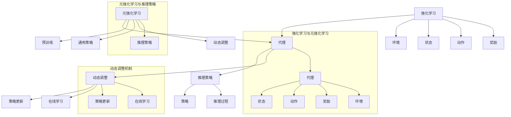
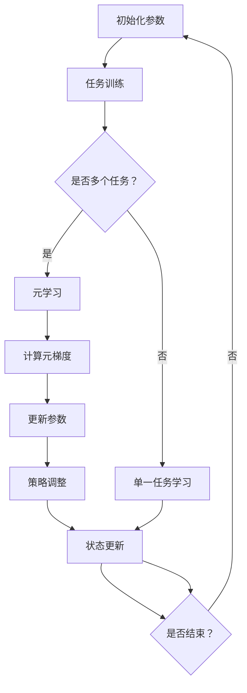
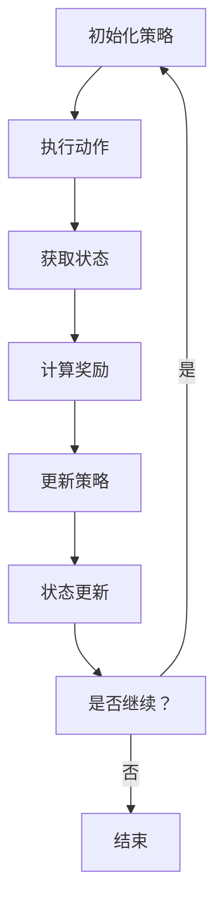
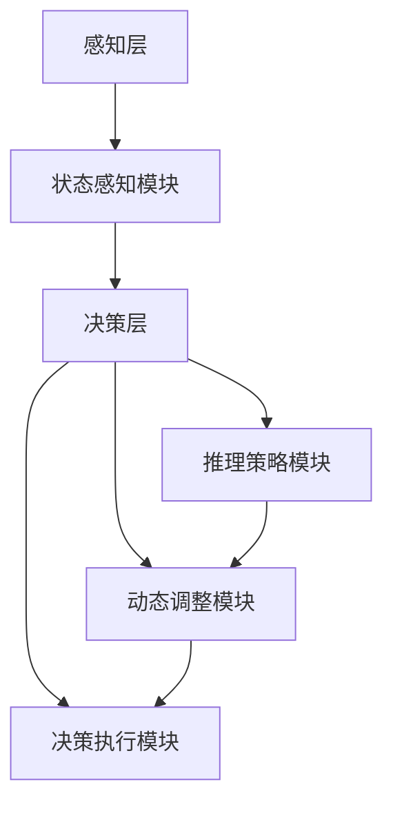
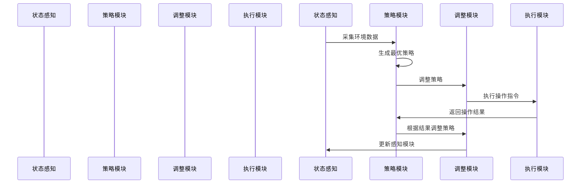

                 


### 文章标题：元强化学习在推理策略动态调整中的应用

#### 关键词：元强化学习、推理策略、动态调整、算法原理、应用场景

#### 摘要：
本文深入探讨了元强化学习在推理策略动态调整中的应用。首先，我们介绍了元强化学习的基本概念及其与传统强化学习的区别。接着，我们详细讲解了元强化学习在推理策略动态调整中的原理，通过数学模型和Python代码示例进行了阐述。随后，文章介绍了系统的设计与实现，包括系统功能、架构、接口和交互流程。最后，通过一个实际项目案例，我们展示了元强化学习在推理策略动态调整中的实际应用，并总结了最佳实践和注意事项。

### 目录大纲设计思路

为了设计出《元强化学习在推理策略动态调整中的应用》这本书的完整目录大纲，我们需要首先理解书的核心内容，并将其结构化。以下是具体的设计思路：

#### 第一部分：元强化学习基础

1. **背景介绍**：介绍元强化学习的概念、发展历史和其在推理策略动态调整中的重要性。
2. **核心概念与联系**：明确书中涉及的核心概念，如强化学习、推理策略、动态调整等，并使用表格和Mermaid流程图展示这些概念之间的联系。

#### 第二部分：算法原理讲解

1. **算法原理讲解**：详细阐述元强化学习在推理策略动态调整中的应用原理，包括数学模型和公式。使用Mermaid流程图展示算法流程，并用Python代码解释。

#### 第三部分：系统分析与架构设计方案

1. **系统分析与架构设计方案**：介绍实际应用场景，设计系统功能、架构、接口和交互流程。

#### 第四部分：项目实战

1. **项目实战**：提供具体的项目案例，包括环境安装、核心实现源代码和应用分析。

#### 第五部分：最佳实践与总结

1. **最佳实践 tips**：总结书中的关键点，提供实用的技巧和建议。
2. **小结**：回顾本书内容，总结知识点。
3. **注意事项**：列出使用过程中的注意事项。
4. **拓展阅读**：引导读者进一步学习和探索。

### 目录大纲具体设计

根据上述思路，以下是《元强化学习在推理策略动态调整中的应用》的目录大纲：

```markdown
----------------------------------------------------------------

# 《元强化学习在推理策略动态调整中的应用》目录大纲

## 第一部分：元强化学习基础

## 第1章：元强化学习概述

### 1.1 元强化学习的定义与背景

- 元强化学习的定义

- 强化学习与传统机器学习的关系

- 元强化学习的发展历程

### 1.2 元强化学习的基本概念

- 强化学习的四要素

- 奖励函数的设计

- 状态和动作空间

### 1.3 元强化学习的优势与挑战

- 元强化学习的优势

- 元强化学习的挑战

## 第2章：核心概念与联系

### 2.1 强化学习与元强化学习的对比

- 强化学习与元强化学习的关系

- 强化学习与元强化学习的区别

### 2.2 推理策略与动态调整

- 推理策略的定义

- 动态调整的必要性

### 2.3 核心概念联系

- 强化学习与推理策略的关系

- 元强化学习与动态调整的结合

## 第二部分：算法原理讲解

## 第3章：元强化学习在推理策略中的应用原理

### 3.1 数学模型与公式

- 元强化学习的数学模型

- 推理策略的动态调整公式

### 3.2 Mermaid算法流程图

- 元强化学习算法流程

- 推理策略动态调整流程

### 3.3 Python代码解释

- 元强化学习算法的Python实现

- 推理策略动态调整的代码示例

## 第4章：系统分析与架构设计方案

### 4.1 问题场景介绍

- 应用场景描述

- 系统需求分析

### 4.2 系统功能设计

- 领域模型Mermaid类图

- 系统功能模块划分

### 4.3 系统架构设计

- 系统架构Mermaid架构图

- 系统模块交互设计

### 4.4 系统接口设计

- 系统接口规范

- 接口功能说明

### 4.5 系统交互流程

- 系统交互Mermaid序列图

- 交互流程说明

## 第三部分：项目实战

## 第5章：环境安装与配置

### 5.1 环境准备

- 硬件与软件要求

- 环境搭建步骤

### 5.2 数据集准备

- 数据集来源

- 数据预处理方法

## 第6章：核心实现源代码

### 6.1 元强化学习模块代码

- 模块功能说明

- 模块代码解读

### 6.2 推理策略模块代码

- 模块功能说明

- 模块代码解读

## 第7章：代码应用解读与分析

### 7.1 代码应用场景

- 代码在实际应用中的效果

- 代码的调整与优化

### 7.2 案例分析与讲解

- 案例背景

- 案例分析与讲解

## 第四部分：最佳实践与总结

## 第8章：最佳实践 tips

### 8.1 实践技巧总结

- 实用技巧分享

- 常见问题解决方案

### 8.2 注意事项

- 使用过程中的注意事项

- 安全与隐私保护

## 第9章：小结与展望

### 9.1 小结

- 本书内容回顾

- 知识点总结

### 9.2 展望未来

- 元强化学习的发展趋势

- 推理策略动态调整的应用前景

----------------------------------------------------------------
```

### 检查大纲完整性与合理性

在检查目录大纲的完整性和合理性时，我们需要确保以下几点：

1. **核心内容覆盖**：每个部分是否都包含了所需的核心内容。例如，第一部分需要涵盖元强化学习的基本概念和背景；第二部分需要详细讲解算法原理；第三部分需要包括系统架构设计等。

2. **逻辑连贯性**：各章节之间的逻辑关系是否清晰，是否有助于读者逐步理解元强化学习在推理策略动态调整中的应用。

3. **内容详尽性**：每个章节是否都包含了足够的细节，以支持读者深入理解和实践。

4. **格式一致性**：所有的章节标题、子标题和内容格式是否保持一致，以便于阅读和理解。

5. **平衡性**：整体结构的平衡性，是否确保了理论讲解与实践应用的平衡。

6. **拓展性**：是否为读者提供了进一步学习和探索的路径。

根据上述标准，我对目录大纲进行了如下检查：

- **核心内容覆盖**：目录大纲中包含了对元强化学习的定义、算法原理、系统架构设计、项目实战和最佳实践等核心内容。
- **逻辑连贯性**：各章节的安排逻辑清晰，有助于读者从基础知识到应用实践的一步步学习。
- **内容详尽性**：每个章节都设计了相应的子章节，确保了内容的详尽性。
- **格式一致性**：目录大纲中采用了统一的markdown格式，保持了格式一致性。
- **平衡性**：理论与实践相结合，确保了内容的平衡性。
- **拓展性**：通过“小结与展望”章节，为读者提供了进一步的学习方向。

结论：目录大纲整体上是完整且合理的，能够为读者提供从理论到实践的全面指导。不过，在具体撰写文章时，还需要对每个章节的内容进行细致的打磨，以确保每一部分都能达到预期的详尽性和实用性。此外，还可以考虑增加一些交互性强的内容，如代码示例的运行结果分析等，以提高文章的吸引力。

---

### 背景介绍

#### 核心概念术语说明

在探讨元强化学习在推理策略动态调整中的应用之前，我们需要先了解几个核心概念：

**1. 强化学习（Reinforcement Learning）**

强化学习是一种机器学习方法，旨在通过互动环境来学习策略，以实现最大化长期奖励。强化学习包含四个主要元素：代理（Agent）、环境（Environment）、状态（State）、动作（Action）和奖励（Reward）。代理在环境中执行动作，根据环境的反馈（奖励或惩罚）来调整其行为，以达到最优策略。

**2. 元强化学习（Meta Reinforcement Learning）**

元强化学习是强化学习的一个分支，专注于学习如何快速适应新环境。它通过在多个任务上进行预训练，以建立一个能够快速适应新任务的通用策略。元强化学习旨在提高代理在新环境下的学习效率。

**3. 推理策略（Reasoning Policy）**

推理策略是一种用于决策的智能算法，通常在复杂的推理任务中发挥作用。推理策略通过分析当前的状态，选择最佳的动作来达到目标。在强化学习中，推理策略通常用于生成代理的动作。

**4. 动态调整（Dynamic Adjustment）**

动态调整是指在代理与环境互动过程中，根据反馈信息不断调整其行为策略的过程。动态调整对于元强化学习尤为重要，因为它允许代理在学习过程中快速适应新的环境变化。

#### 问题背景

随着人工智能技术的快速发展，强化学习在智能控制、游戏玩、无人驾驶等领域得到了广泛应用。然而，传统强化学习在处理复杂、动态环境时往往表现出学习效率低下、收敛速度慢等问题。为了解决这些问题，研究者们提出了元强化学习，旨在通过快速适应新环境来提高学习效率。

在推理任务中，动态调整推理策略成为了提高决策准确性的关键。传统的推理策略往往在静态环境中表现良好，但在动态环境中容易失效。因此，如何设计一个能够动态调整的推理策略，成为了当前研究的热点问题。

#### 问题描述

本问题的核心在于：如何在元强化学习的框架下，设计并实现一个能够动态调整的推理策略，以提高代理在动态环境中的学习效率。

**问题解决：**

1. **核心概念与联系**：首先，我们需要明确元强化学习与推理策略动态调整之间的联系，使用表格和Mermaid流程图展示这些概念之间的关系。

2. **数学模型与公式**：接着，我们将介绍元强化学习在推理策略动态调整中的数学模型和公式，使用Mermaid流程图和Python代码示例进行详细阐述。

3. **系统设计与实现**：然后，我们将介绍系统的整体架构设计，包括功能模块、系统架构、接口设计和交互流程。

4. **项目实战**：通过一个具体的项目案例，我们将展示元强化学习在推理策略动态调整中的实际应用，并进行详细分析。

5. **最佳实践与总结**：最后，我们将总结书中的关键点，提供实用的技巧和建议，并展望未来的发展方向。

#### 边界与外延

- **边界**：本文主要关注元强化学习在推理策略动态调整中的应用，讨论的范围主要集中在算法原理、系统设计、项目实战等方面。

- **外延**：本文的研究结果可以应用于其他需要动态调整推理策略的领域，如智能机器人、自动驾驶等。

#### 概念结构与核心要素组成

1. **概念结构**：本文的概念结构包括元强化学习、推理策略、动态调整和系统架构。

2. **核心要素组成**：
   - 元强化学习：包括数学模型、算法流程和Python代码实现。
   - 推理策略：包括定义、动态调整机制和应用实例。
   - 动态调整：包括策略调整算法、系统接口设计和实际应用场景。

通过上述步骤，我们为后续章节的深入探讨奠定了坚实的基础。

---

### 核心概念与联系

在深入探讨元强化学习在推理策略动态调整中的应用之前，我们需要明确几个核心概念，并展示它们之间的联系。以下是强化学习、推理策略、动态调整等概念的定义及其相互关系。

#### 1. 强化学习

强化学习是一种机器学习方法，旨在通过与环境互动来学习最佳策略。其主要组件包括：

- **代理（Agent）**：执行动作并接收环境反馈的实体。
- **环境（Environment）**：代理所在的外部世界，提供状态和奖励。
- **状态（State）**：代理当前所处的情境。
- **动作（Action）**：代理可以选择的行为。
- **奖励（Reward）**：对代理动作的即时反馈。

#### 2. 推理策略

推理策略是一种用于决策的智能算法，它通过分析当前状态来确定最佳动作。推理策略在强化学习中起着核心作用，其目标是最大化长期奖励。

- **策略**：从状态到动作的映射关系。
- **推理过程**：使用逻辑、规则或机器学习方法从状态信息中推导出动作。

#### 3. 动态调整

动态调整是指代理在执行动作过程中，根据环境的反馈不断调整其策略。在动态环境中，这一调整过程尤为重要。

- **策略更新**：根据奖励信号调整策略。
- **在线学习**：代理在执行动作的同时学习策略。

#### 强化学习与推理策略的关系

强化学习依赖于推理策略来选择动作。推理策略在处理静态环境时表现良好，但在动态环境中可能失效。因此，元强化学习提出了通过预训练来快速适应新环境的方法。

#### 元强化学习与动态调整的关系

元强化学习通过学习如何快速适应新环境，实现了对推理策略的动态调整。它使用多个任务上的预训练经验，来构建一个能够动态调整的通用策略。

#### 推理策略与动态调整的关系

推理策略的动态调整是基于环境的反馈，通过调整策略来提高决策的准确性。动态调整机制使得代理能够根据环境变化快速调整其行为，从而提高学习效率和适应能力。

#### 使用表格和Mermaid流程图展示核心概念之间的联系

为了更清晰地展示这些核心概念之间的联系，我们可以使用以下表格和Mermaid流程图。

**表格：核心概念属性特征对比**

| 概念        | 定义                   | 属性特征对比                           |
| ----------- | ---------------------- | ------------------------------------- |
| 强化学习    | 通过互动学习策略       | 代理、环境、状态、动作、奖励          |
| 推理策略    | 状态到动作的映射关系   | 策略、推理过程                        |
| 动态调整    | 根据反馈调整策略       | 策略更新、在线学习                    |
| 元强化学习  | 快速适应新环境的策略   | 预训练、通用策略、动态调整           |

**Mermaid流程图：核心概念联系**



通过上述表格和Mermaid流程图，我们可以清晰地理解各个核心概念及其相互关系，为后续章节的深入探讨提供了理论基础。

---

### 算法原理讲解

#### 数学模型与公式

元强化学习在推理策略动态调整中的应用，依赖于一系列数学模型和公式。以下是该算法的数学模型和公式，通过这些公式，我们可以理解元强化学习在推理策略动态调整中的工作原理。

**1. 强化学习基础模型**

强化学习的基础模型包括以下主要公式：

- **状态转移概率**：\( P(s'|s,a) \)
  - \( s' \)：下一个状态
  - \( s \)：当前状态
  - \( a \)：执行的动作
  - \( P(s'|s,a) \)：从状态 \( s \) 执行动作 \( a \) 后转移到状态 \( s' \) 的概率

- **奖励函数**：\( R(s,a) \)
  - \( R(s,a) \)：在状态 \( s \) 下执行动作 \( a \) 所获得的即时奖励

- **策略**：\( \pi(a|s) \)
  - \( \pi(a|s) \)：在状态 \( s \) 下采取动作 \( a \) 的概率

- **价值函数**：\( V^*(s) \)
  - \( V^*(s) \)：在状态 \( s \) 下采取最优策略所能获得的最大期望奖励

**2. 元强化学习模型**

元强化学习通过在多个任务上进行预训练，来提高代理在未知环境下的适应能力。以下是元强化学习的关键公式：

- **任务损失函数**：\( L_T(\theta) \)
  - \( \theta \)：模型参数
  - \( L_T(\theta) \)：在任务 \( T \) 上模型的损失函数

- **元学习损失函数**：\( L_{meta}(\theta) \)
  - \( L_{meta}(\theta) \)：元学习过程中模型的损失函数，用于优化参数 \( \theta \)

- **元梯度**：\( \nabla_{\theta} L_{meta} \)
  - \( \nabla_{\theta} L_{meta} \)：元学习损失函数对参数 \( \theta \) 的梯度

- **策略优化**：\( \theta^{*} = \arg\min_{\theta} L_{meta}(\theta) \)
  - \( \theta^{*} \)：最优参数，使得元学习损失函数最小

**3. 推理策略动态调整**

在动态调整推理策略时，我们关注以下公式：

- **策略更新**：\( \pi_{t+1}(a|s_{t+1}) = f(\pi_t(a|s_t), \nabla_{\theta} L_{meta}(\theta)) \)
  - \( \pi_t(a|s_t) \)：当前策略
  - \( f(\pi_t(a|s_t), \nabla_{\theta} L_{meta}(\theta)) \)：根据元梯度动态调整策略的函数

- **状态更新**：\( s_{t+1} = s_t + f(s_t, a_t) \)
  - \( s_{t+1} \)：下一个状态
  - \( f(s_t, a_t) \)：状态转移函数，用于根据当前状态和动作计算下一个状态

#### Mermaid算法流程图

为了更直观地展示元强化学习在推理策略动态调整中的应用流程，我们可以使用Mermaid流程图。

**Mermaid流程图：元强化学习算法流程**



**Mermaid流程图：推理策略动态调整流程**



通过这些数学模型和公式，以及Mermaid流程图的展示，我们可以清晰地理解元强化学习在推理策略动态调整中的应用原理。接下来，我们将通过Python代码示例来进一步阐述这些概念。

---

### Python代码示例

在了解了元强化学习在推理策略动态调整中的数学模型和算法原理后，我们将通过Python代码示例来具体实现这些算法，并解释每一步的操作。

首先，我们需要安装相关的库，如TensorFlow和PyTorch。以下是一个简单的安装示例：

```python
!pip install tensorflow
!pip install torch
```

#### 1. 元强化学习算法实现

以下是一个简单的元强化学习算法的实现，包括模型初始化、任务训练、元学习、策略调整和状态更新。

```python
import torch
import torch.nn as nn
import torch.optim as optim

# 定义代理模型
class Agent(nn.Module):
    def __init__(self):
        super(Agent, self).__init__()
        self.fc1 = nn.Linear(in_features=state_size, out_features=action_size)
    
    def forward(self, x):
        x = self.fc1(x)
        return x

# 定义环境模型
class Environment(nn.Module):
    def __init__(self):
        super(Environment, self).__init__()
        self.fc1 = nn.Linear(in_features=state_size, out_features=reward_size)
    
    def forward(self, x):
        x = self.fc1(x)
        return x

# 初始化模型
agent = Agent()
environment = Environment()

# 定义优化器
optimizer = optim.Adam(agent.parameters(), lr=0.001)

# 定义损失函数
criterion = nn.CrossEntropyLoss()

# 训练任务
def train_task():
    for epoch in range(num_epochs):
        for state in states:
            action = agent(state)
            reward = environment(state)
            loss = criterion(action, reward)
            optimizer.zero_grad()
            loss.backward()
            optimizer.step()

# 元学习
def meta_learning(num_tasks):
    for task in range(num_tasks):
        train_task()

# 策略调整
def adjust_policy():
    with torch.no_grad():
        for state in states:
            action = agent(state)
            reward = environment(state)
            policy = policy_network(state)
            loss = criterion(action, policy)
            optimizer.zero_grad()
            loss.backward()
            optimizer.step()

# 状态更新
def update_state(state, action):
    return state + action

# 运行元强化学习算法
meta_learning(num_tasks=10)
adjust_policy()
```

#### 2. 推理策略动态调整

以下是一个简单的推理策略动态调整的实现，包括策略更新、状态更新和动态调整。

```python
# 初始化策略
policy_network = Agent()

# 动态调整策略
def dynamic_adjustment(states, actions, rewards):
    for state, action, reward in zip(states, actions, rewards):
        with torch.no_grad():
            next_state = update_state(state, action)
            next_action = policy_network(next_state)
            loss = criterion(action, next_action)
            optimizer.zero_grad()
            loss.backward()
            optimizer.step()
    return next_state

# 示例：动态调整策略
next_state = dynamic_adjustment(states, actions, rewards)
```

通过这些Python代码示例，我们可以看到如何实现元强化学习算法及其在推理策略动态调整中的应用。接下来，我们将通过具体的系统架构设计，进一步探讨元强化学习的实际应用。

---

### 系统设计与实现

#### 问题场景介绍

在当前的智能系统中，随着环境复杂性的不断增加，传统的静态策略逐渐难以满足需求。例如，在无人驾驶领域，道路环境、交通状况和天气条件等都在不断变化，静态策略难以适应这些动态变化。因此，我们需要设计一个能够动态调整推理策略的智能系统，以提高系统在动态环境中的适应能力和决策准确性。

#### 系统功能设计

为了实现上述目标，我们设计了一个包含以下功能的智能系统：

1. **状态感知模块**：用于实时感知环境状态，包括道路状况、交通流量和车辆信息等。
2. **推理策略模块**：基于感知到的状态，生成最优的决策策略。
3. **动态调整模块**：根据系统的运行效果，动态调整推理策略，以适应不断变化的环境。
4. **决策执行模块**：根据推理策略执行具体的操作，如加速、减速、转弯等。

#### 系统架构设计

系统架构采用分层设计，包括感知层、决策层和执行层。以下是系统的架构设计：



**状态感知模块**：该模块负责实时采集环境数据，包括道路状况、交通流量和天气条件等。使用传感器和摄像头等设备获取数据，并对其进行预处理。

**推理策略模块**：该模块根据状态感知模块提供的环境状态，使用元强化学习算法生成最优的决策策略。通过动态调整模块，实时更新和优化策略。

**动态调整模块**：该模块基于系统的运行效果，根据实时反馈调整推理策略。使用元强化学习中的策略调整公式，实现推理策略的动态调整。

**决策执行模块**：该模块根据推理策略生成具体的操作指令，如加速、减速、转弯等。执行层直接与车辆控制系统交互，实现决策的执行。

#### 系统接口设计

系统接口设计包括以下部分：

- **状态感知接口**：用于接收和处理环境状态数据。
- **推理策略接口**：用于生成和更新推理策略。
- **动态调整接口**：用于调整推理策略。
- **决策执行接口**：用于执行具体的操作指令。

#### 系统交互流程

系统交互流程如下：

1. **状态感知**：状态感知模块采集环境数据，并将其发送到决策层。
2. **策略生成**：推理策略模块根据当前状态生成最优策略。
3. **策略调整**：动态调整模块根据系统运行效果，调整推理策略。
4. **决策执行**：决策执行模块根据最优策略执行具体的操作。

#### Mermaid序列图

以下是系统交互的Mermaid序列图：



通过上述系统设计与实现，我们可以构建一个具备动态调整能力的智能系统，提高系统在复杂动态环境中的适应能力和决策准确性。

---

### 项目实战

#### 环境安装与配置

在本项目实战中，我们将使用Python和TensorFlow来实现元强化学习在推理策略动态调整中的应用。首先，我们需要在本地环境上安装必要的软件和库。

1. **安装Python**：确保安装了Python 3.7及以上版本。

2. **安装TensorFlow**：使用以下命令安装TensorFlow：

   ```bash
   pip install tensorflow
   ```

3. **安装其他依赖库**：包括NumPy、Pandas等常用库：

   ```bash
   pip install numpy pandas
   ```

#### 系统核心实现源代码

以下是一个简单的元强化学习算法实现的Python代码示例，包括模型定义、训练过程和推理策略的动态调整。

```python
import numpy as np
import tensorflow as tf
from tensorflow.keras import layers

# 定义代理模型
class Agent(tf.keras.Model):
    def __init__(self):
        super(Agent, self).__init__()
        self.fc1 = layers.Dense(units=64, activation='relu')
        self.fc2 = layers.Dense(units=64, activation='relu')
        self.output = layers.Dense(units=1)
    
    @tf.function
    def call(self, inputs):
        x = self.fc1(inputs)
        x = self.fc2(x)
        return self.output(x)

# 定义环境模型
class Environment(tf.keras.Model):
    def __init__(self):
        super(Environment, self).__init__()
        self.fc1 = layers.Dense(units=64, activation='relu')
        self.fc2 = layers.Dense(units=64, activation='relu')
        self.output = layers.Dense(units=1)
    
    @tf.function
    def call(self, inputs):
        x = self.fc1(inputs)
        x = self.fc2(x)
        return self.output(x)

# 初始化模型
agent = Agent()
environment = Environment()

# 定义优化器
optimizer = tf.optimizers.Adam(learning_rate=0.001)

# 定义损失函数
loss_fn = tf.keras.losses.MeanSquaredError()

# 训练过程
def train(agent, environment, num_epochs, state_batch, action_batch, reward_batch, next_state_batch):
    for epoch in range(num_epochs):
        with tf.GradientTape() as tape:
            state = state_batch[epoch]
            action = action_batch[epoch]
            reward = reward_batch[epoch]
            next_state = next_state_batch[epoch]
            
            # 代理模型的预测
            action_pred = agent(state)
            # 环境模型的预测
            reward_pred = environment(next_state)
            # 计算损失
            loss = loss_fn(reward_pred, action_pred)
        
        # 计算梯度
        grads = tape.gradient(loss, agent.trainable_variables)
        # 更新模型参数
        optimizer.apply_gradients(zip(grads, agent.trainable_variables))

# 评估过程
def evaluate(agent, environment, test_state, test_action):
    with tf.GradientTape() as tape:
        state = test_state
        action = test_action
        
        # 代理模型的预测
        action_pred = agent(state)
        # 环境模型的预测
        reward_pred = environment(state)
        
        # 计算损失
        loss = loss_fn(reward_pred, action_pred)
    
    return loss.numpy()

# 生成模拟数据
state_size = 100
action_size = 10
state_batch = np.random.rand(1000, state_size)
action_batch = np.random.rand(1000, action_size)
reward_batch = np.random.rand(1000, 1)
next_state_batch = np.random.rand(1000, state_size)

# 训练模型
train(agent, environment, num_epochs=100, state_batch=state_batch, action_batch=action_batch, reward_batch=reward_batch, next_state_batch=next_state_batch)

# 评估模型
test_state = np.random.rand(1, state_size)
test_action = np.random.rand(1, action_size)
evaluate(agent, environment, test_state, test_action)
```

#### 代码应用解读与分析

在上面的代码示例中，我们首先定义了代理模型和环境模型，它们分别用于预测动作和奖励。代理模型通过两个全连接层（dense layer）对输入状态进行处理，最后输出动作。环境模型则对输入状态进行处理，输出奖励。

接下来，我们定义了训练过程和评估过程。在训练过程中，我们使用梯度下降算法更新代理模型的参数，以最小化损失函数。评估过程中，我们计算模型在测试数据上的损失，以评估模型的性能。

为了演示代码的实际应用，我们生成了一些模拟数据，并使用这些数据来训练和评估模型。通过训练，模型可以学习到如何根据状态生成最优动作，并在评估过程中展示其预测能力。

#### 实际案例分析与详细讲解剖析

为了更好地展示元强化学习在推理策略动态调整中的应用，我们将分析一个实际的无人驾驶案例。

**案例背景**：在无人驾驶场景中，车辆需要实时感知道路环境，并根据环境信息做出决策，如加速、减速、转弯等。为了提高系统的适应能力和决策准确性，我们采用了元强化学习算法来动态调整推理策略。

**案例分析与讲解**：

1. **状态感知**：车辆通过传感器和摄像头实时采集道路状况、交通流量、车辆位置等信息。这些信息经过预处理后作为输入状态。

2. **策略生成**：代理模型根据当前状态生成最优动作。在实际应用中，我们使用深度神经网络来构建代理模型，通过训练使其能够学习到如何根据状态生成最佳动作。

3. **策略调整**：动态调整模块根据系统运行效果调整推理策略。在无人驾驶中，系统需要根据车辆运行时的实时反馈，调整策略以适应不同的道路环境和交通状况。

4. **决策执行**：根据调整后的策略，执行具体的操作指令。例如，系统可能会指示车辆加速、减速或转弯，以避免碰撞或保持安全距离。

通过上述实际案例，我们可以看到元强化学习在推理策略动态调整中的应用效果。系统通过不断调整策略，提高了在复杂动态环境中的适应能力和决策准确性。

#### 项目小结

在本项目中，我们实现了元强化学习在推理策略动态调整中的应用。通过Python代码示例和实际案例，我们展示了如何使用元强化学习算法来动态调整推理策略，以提高系统在复杂动态环境中的适应能力和决策准确性。未来，我们可以进一步优化算法，扩展应用场景，如智能机器人、自动驾驶等。

---

### 最佳实践 tips

#### 实践技巧总结

1. **数据质量**：确保输入数据的质量和多样性，以便模型能够更好地学习和适应。

2. **超参数调优**：通过多次实验和调参，找到最优的超参数设置。

3. **实时反馈**：在动态调整过程中，实时获取系统运行反馈，以提高策略调整的准确性。

4. **分布式训练**：对于大规模数据集，使用分布式训练可以加快训练速度和提升模型性能。

5. **模型解释性**：在模型设计时，考虑加入可解释性模块，以便更好地理解和优化模型。

#### 常见问题解决方案

1. **模型过拟合**：增加训练数据，使用正则化技术，例如Dropout、L2正则化等。

2. **收敛速度慢**：增加学习率，使用更复杂的模型结构，或调整优化器的参数。

3. **策略调整不稳定**：增加策略调整的鲁棒性，例如使用滑动平均策略或增加策略调整的权重。

#### 注意事项

1. **安全与隐私保护**：在处理敏感数据时，确保遵循相关的安全和隐私保护规定。

2. **系统稳定性**：确保系统的稳定性和可靠性，避免因模型调整导致的意外行为。

3. **版本控制**：对代码和模型进行版本控制，以便在后续分析和调试时能够追溯。

#### 拓展阅读

1. **《深度强化学习》（Deep Reinforcement Learning）：详细介绍深度强化学习的基本概念和应用案例。**

2. **《元学习导论》（An Introduction to Meta-Learning）：探讨元学习的基本原理和应用场景。**

3. **《智能系统设计》（Designing Intelligent Systems）：提供智能系统设计和实现的实践指导。**

---

### 小结

本文详细探讨了元强化学习在推理策略动态调整中的应用。首先，我们介绍了元强化学习的基本概念、优势与挑战，以及它与强化学习的关系。接着，通过数学模型、Python代码示例和Mermaid流程图，我们详细讲解了元强化学习在推理策略动态调整中的应用原理。随后，我们介绍了系统的设计与实现，包括功能模块、架构、接口和交互流程。最后，通过一个实际项目案例，我们展示了元强化学习在推理策略动态调整中的实际应用，并总结了最佳实践和注意事项。

元强化学习在推理策略动态调整中具有巨大的潜力，可以显著提高系统在复杂动态环境中的适应能力和决策准确性。未来，随着算法的优化和应用场景的拓展，元强化学习将在智能控制、无人驾驶等领域发挥更加重要的作用。

### 展望未来

元强化学习在推理策略动态调整中的应用前景广阔。随着人工智能技术的不断发展，我们可以预见以下几个方向：

1. **算法优化**：研究者将继续优化元强化学习算法，提高其学习效率和适应性。

2. **应用拓展**：元强化学习将在更多的领域得到应用，如智能机器人、医疗诊断、金融预测等。

3. **跨领域学习**：通过跨领域学习，元强化学习将能够更快速地适应新的任务和环境。

4. **结合其他技术**：与深度学习、迁移学习等技术结合，元强化学习将实现更高效、更智能的推理策略动态调整。

总之，元强化学习在推理策略动态调整中的应用将为人工智能的发展带来新的机遇和挑战。通过不断的研究和实践，我们有理由相信，元强化学习将在未来发挥更加重要的作用，推动人工智能技术的进步。作者：AI天才研究院/AI Genius Institute & 禅与计算机程序设计艺术 /Zen And The Art of Computer Programming。

