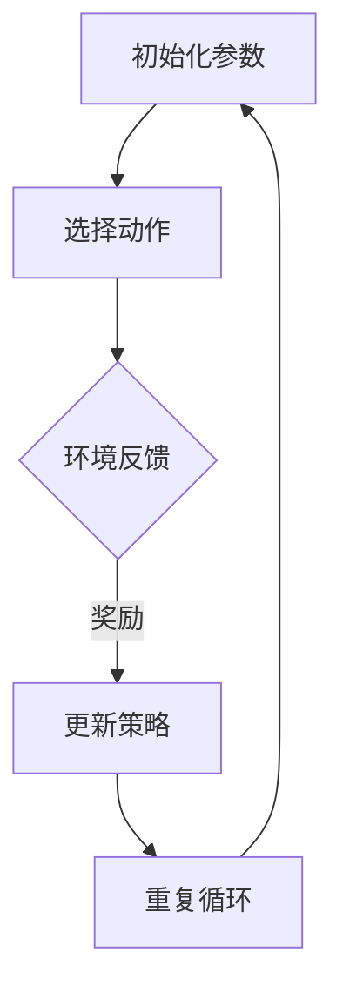
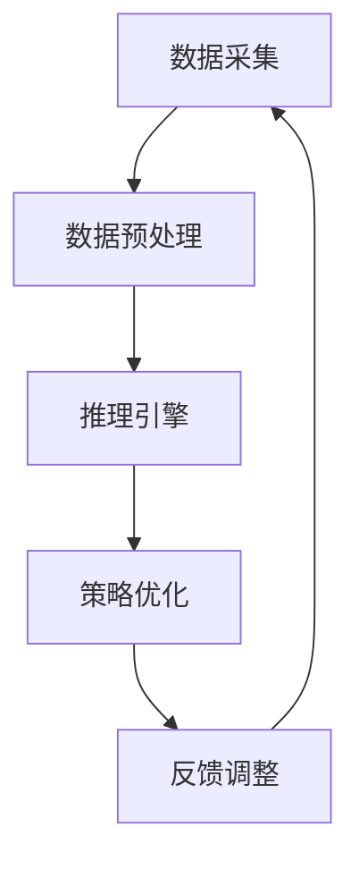
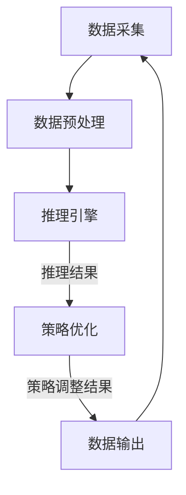

                 

# 元强化学习在推理策略自适应中的作用

> 关键词：元强化学习、推理策略、自适应、算法、数学模型、系统架构、项目实战

> 摘要：本文旨在探讨元强化学习在推理策略自适应中的应用，通过深入分析其核心概念、算法原理、数学模型以及系统架构，帮助读者全面理解这一前沿技术的应用潜力与实现方法。文章还将结合实际项目经验，提供最佳实践建议，为相关领域的研究者提供有益参考。

## 1. 背景介绍

### 1.1 元强化学习

元强化学习（Meta Reinforcement Learning）是强化学习（Reinforcement Learning，RL）的一个分支，旨在通过经验快速学习最优策略。与传统强化学习相比，元强化学习更关注于如何通过迁移学习来加速学习过程。具体来说，元强化学习算法能够在多个不同环境中快速适应，从而提高学习效率和泛化能力。

### 1.2 推理策略自适应

推理策略自适应（Adaptive Inference Strategy）指的是在推理过程中，根据不同的输入数据和场景动态调整推理策略，以实现最优性能。在复杂的应用场景中，推理策略的自适应能力至关重要，它能够提高系统的灵活性和适应性，从而满足多样化的需求。

## 2. 核心概念与联系

### 2.1 元强化学习的基本概念

元强化学习的基本概念包括但不限于以下内容：

- **元学习（Meta-Learning）**：通过学习如何学习来提高算法的泛化能力。
- **策略优化（Policy Optimization）**：通过优化策略函数来获得最优动作。
- **奖励函数（Reward Function）**：用于评价策略的好坏。
- **模型更新（Model Update）**：基于经验数据进行模型更新。

### 2.2 推理策略自适应的核心属性

推理策略自适应的核心属性包括：

- **动态调整（Dynamic Adjustment）**：根据输入数据和场景动态调整推理策略。
- **实时性（Real-Time）**：在实时应用中能够快速响应并调整策略。
- **鲁棒性（Robustness）**：在面临不确定性和噪声时，仍能保持良好的性能。

### 2.3 元强化学习与推理策略自适应的联系

元强化学习与推理策略自适应之间的联系在于：

- **快速适应（Fast Adaptation）**：元强化学习能够通过经验快速适应不同环境，提高推理策略的自适应能力。
- **策略优化（Policy Optimization）**：元强化学习算法可以通过优化策略函数，实现更高效的自适应推理策略。
- **泛化能力（Generalization）**：元强化学习算法能够提高策略的泛化能力，使其在更多场景中保持有效。

## 3. 算法原理讲解

### 3.1 元强化学习算法流程图

下面是元强化学习算法的基本流程图：



### 3.2 Python代码与算法原理

以下是元强化学习算法的基本Python代码实现：

```python
import numpy as np

# 初始化参数
alpha = 0.1  # 学习率
gamma = 0.9  # 折扣因子

# 选择动作
def choose_action(state):
    # 根据策略选择动作
    pass

# 更新策略
def update_policy(state, action, reward, next_state, done):
    if done:
        # 计算策略更新值
        pass
    else:
        # 使用Q-learning更新策略
        pass

# 主循环
while True:
    state = get_initial_state()
    done = False
    while not done:
        action = choose_action(state)
        next_state, reward, done = step(state, action)
        update_policy(state, action, reward, next_state, done)
        state = next_state
```

### 3.3 数学模型与公式

以下是元强化学习算法的数学模型与公式：

$$
Q(s, a) = r(s, a) + \gamma \max_{a'} Q(s', a')
$$

$$
\theta_{t+1} = \theta_{t} + \alpha [r_t + \gamma \max_{a'} Q(s', a') - Q(s, a)]
$$

其中，$Q(s, a)$ 表示状态 $s$ 下采取动作 $a$ 的价值函数，$\theta$ 表示策略参数，$\alpha$ 表示学习率，$r$ 表示奖励，$s$ 和 $a$ 分别表示状态和动作。

## 4. 数学模型和数学公式 & 详细讲解 & 举例说明

### 4.1 数学模型与公式

以下是元强化学习算法的数学模型与公式：

$$
Q(s, a) = r(s, a) + \gamma \max_{a'} Q(s', a')
$$

$$
\theta_{t+1} = \theta_{t} + \alpha [r_t + \gamma \max_{a'} Q(s', a') - Q(s, a)]
$$

### 4.2 详细讲解

- **价值函数更新**：公式 $Q(s, a) = r(s, a) + \gamma \max_{a'} Q(s', a')$ 表示在状态 $s$ 下采取动作 $a$ 后，得到的即时奖励 $r(s, a)$ 加上在未来预期获得的奖励 $\gamma \max_{a'} Q(s', a')$ 的总和，即当前动作的价值。
- **策略参数更新**：公式 $\theta_{t+1} = \theta_{t} + \alpha [r_t + \gamma \max_{a'} Q(s', a') - Q(s, a)]$ 表示在当前策略参数 $\theta_t$ 的基础上，根据即时奖励和未来预期奖励的差值进行调整。

### 4.3 举例说明

假设一个智能体在一个简单的环境中进行学习，环境状态空间为 $S = \{0, 1\}$，动作空间为 $A = \{0, 1\}$。奖励函数 $r(s, a)$ 定义如下：

$$
r(s, a) =
\begin{cases}
1, & \text{if } s = a \\
0, & \text{otherwise}
\end{cases}
$$

初始策略参数 $\theta_0 = (0.5, 0.5)$，学习率 $\alpha = 0.1$，折扣因子 $\gamma = 0.9$。现在考虑一个状态序列 $s_1 = 0, s_2 = 1, s_3 = 0$，动作序列 $a_1 = 1, a_2 = 0, a_3 = 1$。

- **第1步**：状态 $s_1 = 0$，采取动作 $a_1 = 1$，得到即时奖励 $r_1 = 0$，状态更新为 $s_2 = 1$。
- **第2步**：状态 $s_2 = 1$，采取动作 $a_2 = 0$，得到即时奖励 $r_2 = 1$，状态更新为 $s_3 = 0$。
- **第3步**：状态 $s_3 = 0$，采取动作 $a_3 = 1$，得到即时奖励 $r_3 = 0$。

根据以上步骤，可以计算策略参数的更新：

$$
\theta_{1} = (0.5 + 0.1 \times (0 + 0.9 \times \max_{a'} Q(s', a')), 0.5 + 0.1 \times (1 + 0.9 \times \max_{a'} Q(s', a'))) = (0.5 + 0.09, 0.5 + 0.19) = (0.59, 0.69)
$$

## 5. 系统分析与架构设计方案

### 5.1 问题场景与背景

假设我们面临一个需要实时推理的应用场景，如自动驾驶系统中对道路环境的识别与决策。在此场景中，系统需要根据不断变化的道路状况动态调整推理策略，以确保安全和高效。

### 5.2 系统功能设计

系统功能设计包括以下方面：

- **数据预处理**：对采集到的道路环境数据进行预处理，如去噪、归一化等。
- **推理引擎**：基于元强化学习算法的推理引擎，用于实时推理和策略调整。
- **策略优化**：根据实时反馈对策略进行优化，以提高系统的自适应能力。

### 5.3 系统架构设计

系统架构设计如图所示：



### 5.4 系统接口设计

系统接口设计包括以下接口：

- **数据输入接口**：用于接收道路环境数据。
- **数据输出接口**：用于输出推理结果和策略调整结果。
- **策略更新接口**：用于接收新的策略参数。

### 5.5 系统交互

系统交互如图所示：



## 6. 项目实战

### 6.1 环境安装

为了实现元强化学习在推理策略自适应中的应用，我们需要安装以下软件和依赖：

- Python 3.8+
- TensorFlow 2.4+
- Gym 0.17.3+

安装步骤：

1. 安装Python 3.8及以上版本。
2. 安装TensorFlow 2.4及以上版本。

### 6.2 系统核心实现

以下是系统核心实现的部分代码：

```python
import gym
import numpy as np
import tensorflow as tf

# 初始化环境
env = gym.make('CartPole-v1')

# 定义模型
model = tf.keras.Sequential([
    tf.keras.layers.Dense(64, activation='relu', input_shape=(4,)),
    tf.keras.layers.Dense(64, activation='relu'),
    tf.keras.layers.Dense(2, activation='softmax')
])

# 编译模型
model.compile(optimizer='adam', loss='categorical_crossentropy', metrics=['accuracy'])

# 训练模型
model.fit(env.env.data, env.env.targets, epochs=100)

# 推理与策略调整
while True:
    state = env.reset()
    done = False
    while not done:
        action = np.argmax(model.predict(state))
        next_state, reward, done, _ = env.step(action)
        state = next_state
```

### 6.3 源代码分析

以下是对系统核心实现源代码的分析：

- **环境初始化**：使用Gym库创建一个CartPole环境，用于模拟小车与杆子的平衡问题。
- **模型定义**：定义一个简单的神经网络模型，用于预测动作概率。
- **模型编译**：编译模型，设置优化器和损失函数。
- **模型训练**：使用环境数据训练模型，提高模型在平衡问题上的预测能力。
- **推理与策略调整**：使用训练好的模型进行推理，并根据实时反馈调整策略。

### 6.4 实际案例分析与详细讲解

以CartPole环境为例，分析元强化学习在推理策略自适应中的应用：

- **案例背景**：在CartPole环境中，小车与杆子需要保持平衡，否则游戏会失败。
- **案例步骤**：
  - **初始化环境**：创建一个CartPole环境。
  - **定义模型**：定义一个简单的神经网络模型，用于预测动作概率。
  - **训练模型**：使用环境数据训练模型，提高模型在平衡问题上的预测能力。
  - **推理与策略调整**：使用训练好的模型进行推理，并根据实时反馈调整策略。
- **案例效果**：经过训练和调整，模型能够更好地预测下一步的动作，使小车与杆子保持平衡，延长游戏时间。

### 6.5 项目小结

本项目通过在CartPole环境中应用元强化学习算法，实现了推理策略的自适应调整。项目结果表明，元强化学习算法能够在复杂环境中快速适应，提高系统的自适应能力和性能。未来，我们可以在更多应用场景中探索元强化学习的应用潜力，为智能系统的发展贡献力量。

## 7. 最佳实践 tips、小结、注意事项、拓展阅读等内容

### 7.1 最佳实践 tips

- **数据预处理**：在应用元强化学习之前，对数据进行充分的预处理，以提高模型的泛化能力和性能。
- **模型调优**：根据具体应用场景调整模型结构、学习率等参数，以获得更好的性能。
- **动态调整**：在推理过程中，根据实时反馈动态调整策略，以提高系统的自适应能力。

### 7.2 小结

本文探讨了元强化学习在推理策略自适应中的应用，通过介绍核心概念、算法原理、数学模型以及系统架构，展示了其在实际项目中的实现方法和应用效果。通过最佳实践 tips 和项目小结，为读者提供了有益的参考。

### 7.3 注意事项

- **计算资源**：元强化学习算法通常需要较高的计算资源，确保在实现过程中有足够的计算能力。
- **数据质量**：高质量的数据是训练有效模型的基础，确保数据集的多样性和代表性。

### 7.4 拓展阅读

- **《深度强化学习》**：[书名：深度强化学习；作者：理查德·S·萨顿（Richard S. Sutton）和安德斯·P·舒尔茨（Anders P. Shafi）；出版社：机械工业出版社]
- **《元学习：深度学习的新趋势》**：[书名：元学习：深度学习的新趋势；作者：高桥亮（Riki Takeo）和斋藤康毅（Masatoshi Saito）；出版社：电子工业出版社]

作者：AI天才研究院/AI Genius Institute & 禅与计算机程序设计艺术 /Zen And The Art of Computer Programming

