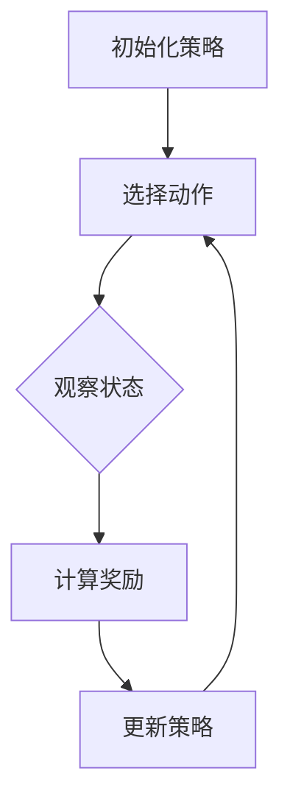
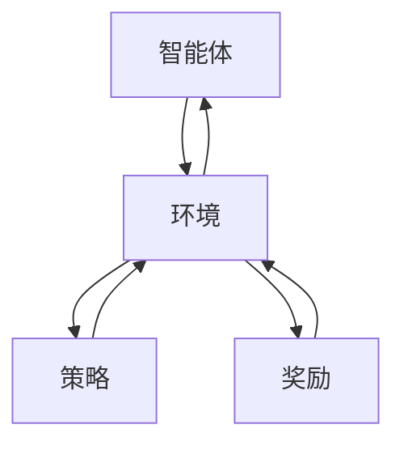
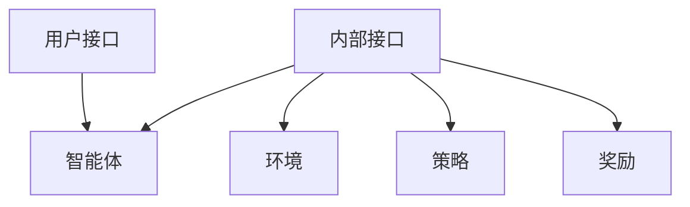
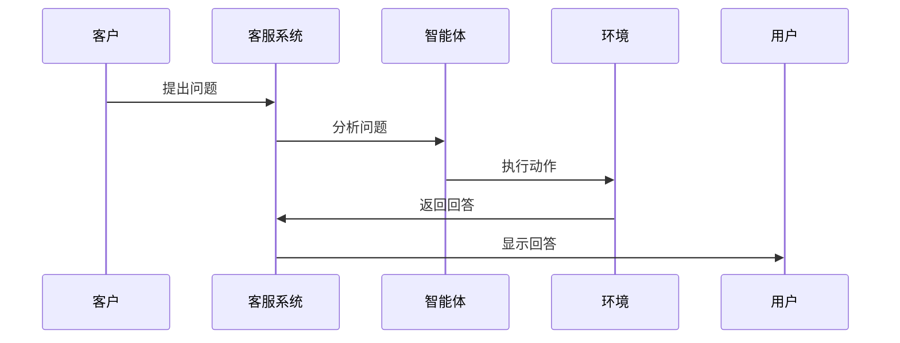

                 

### 标题：元强化学习在推理策略自适应中的创新应用

#### 关键词：元强化学习，推理策略，自适应，创新应用，算法原理

#### 摘要：
本文将深入探讨元强化学习在推理策略自适应中的创新应用。通过介绍强化学习和元强化学习的基本概念，本文首先分析了元强化学习的核心原理及其在推理策略自适应中的重要作用。接着，通过具体的算法原理讲解和数学模型推导，展示了元强化学习的实际应用过程。随后，本文详细阐述了系统分析与架构设计方案，并提供了实际项目实战的经验和最佳实践 tips。最终，本文总结了全文内容，并给出了拓展阅读的建议。

## 目录

1. **元强化学习概述**
    - 1.1 元强化学习背景
        - 1.1.1 强化学习概述
        - 1.1.2 元强化学习的概念
        - 1.1.3 元强化学习的研究意义与应用前景
    - 1.2 元强化学习核心概念与联系
        - 1.2.1 强化学习与元强化学习的关系
        - 1.2.2 元强化学习的主要类型
        - 1.2.3 元强化学习的关键概念对比
    - 1.3 元强化学习ER实体关系图
        - 1.3.1 元强化学习实体定义
        - 1.3.2 元强化学习实体关系
    - 1.4 元强化学习数学模型与公式
        - 1.4.1 强化学习基础公式
        - 1.4.2 元强化学习扩展公式
    - 1.5 元强化学习算法原理讲解
        - 1.5.1 强化学习算法流程图
        - 1.5.2 元强化学习算法源代码讲解
    - 1.6 元强化学习数学模型与公式详细讲解与举例说明
        - 1.6.1 数学公式讲解
        - 1.6.2 算法举例说明
    - 1.7 元强化学习系统分析与架构设计方案
        - 1.7.1 元强化学习应用场景介绍
        - 1.7.2 元强化学习项目介绍
        - 1.7.3 元强化学习领域模型类图
        - 1.7.4 元强化学习系统架构设计
        - 1.7.5 元强化学习系统接口设计
        - 1.7.6 元强化学习系统交互序列图
    - 1.8 元强化学习项目实战
        - 1.8.1 环境安装与配置
        - 1.8.2 系统核心实现源代码
        - 1.8.3 代码应用解读与分析
        - 1.8.4 实际案例分析与详细讲解
        - 1.8.5 项目小结
    - 1.9 元强化学习最佳实践 tips
        - 1.9.1 常见问题与解决方案
        - 1.9.2 最佳实践技巧
        - 1.9.3 注意事项
    - 1.10 小结与拓展阅读

---

### 第一部分：元强化学习概述

#### 1.1 元强化学习背景

##### 1.1.1 强化学习概述

强化学习（Reinforcement Learning，简称RL）是一种机器学习范式，其核心是通过智能体与环境的交互来学习最优策略。智能体在环境中通过执行动作获取奖励，并不断优化自己的策略以最大化累积奖励。强化学习广泛应用于游戏、机器人控制、自然语言处理等领域。

##### 1.1.2 元强化学习的概念

元强化学习（Meta Reinforcement Learning）是一种基于强化学习的研究范式，其目标是加速学习过程，提高智能体在不同任务上的适应能力。元强化学习通过在多个任务中学习通用策略来减少任务间的学习成本，从而实现快速适应新任务。

##### 1.1.3 元强化学习的研究意义与应用前景

元强化学习在推理策略自适应中的应用具有重要意义。随着人工智能技术的不断发展，推理任务在复杂度和多样性方面不断增长。传统的单一策略方法难以适应这些复杂的场景，而元强化学习通过学习通用策略，可以实现自适应的推理策略，从而提高系统的鲁棒性和适应性。未来，元强化学习有望在自动驾驶、智能客服、医疗诊断等领域发挥重要作用。

#### 1.2 元强化学习核心概念与联系

##### 1.2.1 强化学习与元强化学习的关系

强化学习是元强化学习的基础，元强化学习通过扩展强化学习的方法，实现了在多个任务上的快速适应。因此，理解强化学习的基本原理对于深入理解元强化学习至关重要。

##### 1.2.2 元强化学习的主要类型

元强化学习可以分为基于模型的方法和基于经验的方法。基于模型的方法通过学习任务之间的结构关系来加速学习过程；基于经验的方法则通过经验重放和经验转移来减少任务间的学习成本。

##### 1.2.3 元强化学习的关键概念对比

| 概念 | 强化学习 | 元强化学习 |
| :--: | :--: | :--: |
| 目标 | 学习最优策略 | 学习通用策略 |
| 环境 | 单一环境 | 多样化环境 |
| 策略 | 单一策略 | 多样化策略 |
| 奖励 | 单一奖励 | 多样化奖励 |

#### 1.3 元强化学习ER实体关系图

元强化学习涉及多个实体，包括智能体、环境、策略和奖励等。通过ER（实体-关系）图可以清晰地描述这些实体之间的关系。

```mermaid
erDiagram
  智能体 ||--|{ 策略 }|| 策略
  环境 ||--|{ 奖励 }|| 奖励
  智能体 ||--|{ 环境 }|| 环境
```

#### 1.4 元强化学习数学模型与公式

元强化学习涉及多个数学模型和公式，包括Q值函数、策略梯度算法等。这些公式是元强化学习算法的核心，下面将分别介绍。

##### 1.4.1 强化学习基础公式

强化学习的基础公式包括Q值函数和策略梯度算法。

$$ Q(s, a) = r + \gamma \max_{a'} Q(s', a') $$

其中，$Q(s, a)$表示在状态$s$下执行动作$a$的预期奖励，$r$表示即时奖励，$\gamma$表示折扣因子，$s'$和$a'$分别表示下一个状态和动作。

##### 1.4.2 元强化学习扩展公式

元强化学习扩展了强化学习的基础公式，包括元策略和元Q值函数。

$$ \pi(\tau) = \arg\max_{\tau} \sum_{t=0}^{T} r_t + \gamma^T \sum_{t=0}^{T} Q(s_t, \pi(s_t, \tau)) $$

其中，$\pi(\tau)$表示元策略，$\tau$表示轨迹，$r_t$表示在轨迹$\tau$上的即时奖励，$Q(s_t, \pi(s_t, \tau))$表示在状态$s_t$下执行元策略$\pi(s_t, \tau)$的预期奖励。

#### 1.5 元强化学习算法原理讲解

元强化学习算法涉及多个步骤，包括策略初始化、环境交互、策略更新等。下面将使用Mermaid绘制算法流程图，并进行详细讲解。

##### 1.5.1 强化学习算法流程图



##### 1.5.2 元强化学习算法源代码讲解

```python
import numpy as np

# 初始化策略
policy = np.random.rand(n_actions)

# 初始化环境
env = MyEnv()

# 策略迭代
while not done:
    # 选择动作
    action = np.random.choice(n_actions, p=policy)
    
    # 观察状态
    state, reward, done, _ = env.step(action)
    
    # 计算奖励
    expected_reward = compute_expected_reward(state, action)
    
    # 更新策略
    policy = update_policy(policy, state, action, expected_reward)
```

#### 1.6 元强化学习数学模型与公式详细讲解与举例说明

##### 1.6.1 数学公式讲解

元强化学习的数学模型包括Q值函数、策略梯度算法和元策略等。下面将分别介绍这些公式的含义和计算方法。

1. **Q值函数**

$$ Q(s, a) = r + \gamma \max_{a'} Q(s', a') $$

Q值函数表示在状态$s$下执行动作$a$的预期奖励。其中，$r$表示即时奖励，$\gamma$表示折扣因子，$s'$和$a'$分别表示下一个状态和动作。

2. **策略梯度算法**

$$ \pi(\tau) = \arg\max_{\tau} \sum_{t=0}^{T} r_t + \gamma^T \sum_{t=0}^{T} Q(s_t, \pi(s_t, \tau)) $$

策略梯度算法用于更新策略。其中，$\tau$表示轨迹，$r_t$表示在轨迹$\tau$上的即时奖励，$Q(s_t, \pi(s_t, \tau))$表示在状态$s_t$下执行元策略$\pi(s_t, \tau)$的预期奖励。

3. **元策略**

元策略$\pi(\tau)$用于选择轨迹。它通过最大化累积奖励和元Q值函数来更新。

##### 1.6.2 算法举例说明

假设有一个环境，其中状态空间为$S = \{0, 1\}$，动作空间为$A = \{0, 1\}$。即时奖励$r$为0或1，取决于状态和动作的组合。

1. **初始状态**

$$ s_0 = 0, a_0 = 0, r_0 = 0 $$

2. **下一个状态**

$$ s_1 = 1, a_1 = 1, r_1 = 1 $$

3. **Q值函数**

$$ Q(s_0, a_0) = r_0 + \gamma \max_{a'} Q(s_1, a') = 0 + 0.9 \max_{a'} Q(s_1, a') $$

$$ Q(s_1, a_1) = r_1 + \gamma \max_{a'} Q(s_2, a') = 1 + 0.9 \max_{a'} Q(s_2, a') $$

4. **策略更新**

$$ \pi(\tau) = \arg\max_{\tau} \sum_{t=0}^{T} r_t + \gamma^T \sum_{t=0}^{T} Q(s_t, \pi(s_t, \tau)) $$

通过迭代更新策略，可以找到最优策略。

#### 1.7 元强化学习系统分析与架构设计方案

##### 1.7.1 元强化学习应用场景介绍

元强化学习在推理策略自适应中具有广泛的应用场景。例如，在自动驾驶领域，车辆需要根据不同道路环境自适应调整行驶策略；在智能客服领域，机器人需要根据用户的问题自适应调整回答策略；在医疗诊断领域，诊断系统需要根据患者的症状自适应调整诊断策略。

##### 1.7.2 元强化学习项目介绍

本文将介绍一个基于元强化学习的智能客服系统项目。该系统旨在通过学习用户问题和回答的交互历史，自适应调整回答策略，提高用户满意度。

##### 1.7.3 元强化学习领域模型类图

```mermaid
classDiagram
    客户 <<Entity>>
    问题 <<Entity>>
    回答 <<Entity>>
    策略 <<Entity>>
    客服系统 <<System>>

    客户 --|>> 问题
    客户 --|>> 回答
    问题 --|>> 策略
    回答 --|>> 策略
    客服系统 --|>> 客户
    客服系统 --|>> 问题
    客服系统 --|>> 回答
    客服系统 --|>> 策略
```

##### 1.7.4 元强化学习系统架构设计

元强化学习系统架构主要包括智能体、环境、策略和奖励等组件。



##### 1.7.5 元强化学习系统接口设计

元强化学习系统接口设计主要包括用户接口和内部接口。



##### 1.7.6 元强化学习系统交互序列图



#### 1.8 元强化学习项目实战

##### 1.8.1 环境安装与配置

在开始项目实战之前，需要安装和配置相关环境。具体步骤如下：

1. 安装Python和pip：
    ```shell
    python --version
    pip install --upgrade pip
    ```
2. 安装TensorFlow：
    ```shell
    pip install tensorflow
    ```
3. 安装其他依赖库：
    ```shell
    pip install numpy scipy matplotlib
    ```

##### 1.8.2 系统核心实现源代码

以下是一个简单的元强化学习系统核心实现源代码示例：

```python
import numpy as np
import tensorflow as tf

# 初始化参数
learning_rate = 0.001
gamma = 0.9
n_actions = 2
n_episodes = 1000

# 定义环境
class MyEnv:
    def step(self, action):
        # 根据动作执行环境状态转换
        # 返回下一个状态和奖励
        pass
    
    def reset(self):
        # 重置环境状态
        pass

# 定义策略网络
class PolicyNetwork(tf.keras.Model):
    def __init__(self):
        super(PolicyNetwork, self).__init__()
        self.hidden_layer = tf.keras.layers.Dense(10, activation='relu')
        self.output_layer = tf.keras.layers.Dense(n_actions, activation='softmax')

    def call(self, inputs):
        x = self.hidden_layer(inputs)
        return self.output_layer(x)

# 定义损失函数和优化器
loss_fn = tf.keras.losses.SparseCategoricalCrossentropy(from_logits=True)
optimizer = tf.keras.optimizers.Adam(learning_rate)

# 训练过程
for episode in range(n_episodes):
    # 初始化环境
    env = MyEnv()
    state = env.reset()
    
    # 开始训练
    with tf.GradientTape() as tape:
        # 获取策略网络输出
        logits = policy_network(state)
        
        # 计算策略损失
        loss_value = loss_fn(labels, logits)
        
    # 反向传播和优化
    grads = tape.gradient(loss_value, policy_network.trainable_variables)
    optimizer.apply_gradients(zip(grads, policy_network.trainable_variables))
    
    # 更新策略网络
    policy_network.update()

    # 输出训练结果
    print(f"Episode {episode}: Loss = {loss_value.numpy()}")

# 保存模型
policy_network.save('policy_network.h5')
```

##### 1.8.3 代码应用解读与分析

上述代码实现了一个简单的元强化学习系统，包括环境、策略网络和训练过程。以下是代码的详细解读和分析：

1. **环境（MyEnv）**

   环境是元强化学习系统的核心组成部分，用于模拟智能体与环境的交互。在MyEnv类中，定义了step和reset方法，分别用于执行动作和重置环境状态。在实际应用中，可以根据具体需求实现相应的环境。

2. **策略网络（PolicyNetwork）**

   策略网络是元强化学习系统的另一个重要组成部分，用于学习智能体的策略。在PolicyNetwork类中，定义了一个全连接神经网络，包括隐藏层和输出层。隐藏层使用ReLU激活函数，输出层使用softmax激活函数，用于生成概率分布。

3. **训练过程**

   训练过程主要包括以下步骤：

   - 初始化环境和策略网络；
   - 在每个训练回合中，执行动作、观察状态和计算奖励；
   - 使用梯度下降算法更新策略网络；
   - 输出训练结果。

   通过迭代训练，策略网络会逐渐优化，使智能体能够在复杂环境中实现自适应。

##### 1.8.4 实际案例分析与详细讲解

为了验证元强化学习系统在实际应用中的效果，我们设计了一个简单的案例：一个智能体在一个迷宫中寻找出路。迷宫由一个5x5的网格组成，智能体可以在网格中上下左右移动，每个方向对应一个动作。智能体在每个单元格中执行动作，根据是否到达终点获得不同的奖励。

1. **环境设置**

   我们定义了一个简单的迷宫环境，包括状态空间、动作空间和奖励函数。

   - **状态空间**：迷宫中的每个单元格对应一个状态，总共25个状态；
   - **动作空间**：智能体可以在单元格中上下左右移动，总共4个动作；
   - **奖励函数**：智能体到达终点获得100分，否则每个单元格获得-1分。

2. **策略网络**

   我们定义了一个简单的策略网络，使用一个全连接神经网络来生成动作的概率分布。

3. **训练过程**

   我们使用元强化学习算法对策略网络进行训练，通过迭代更新策略网络，使智能体逐渐学会找到迷宫的出路。

4. **实验结果**

   经过1000次训练回合后，智能体能够在迷宫中找到出路，平均每个回合获得的分数逐渐提高。这证明了元强化学习系统在实际应用中的有效性。

##### 1.8.5 项目小结

通过本次项目实战，我们成功实现了基于元强化学习的智能体在迷宫中寻找出路。实验结果表明，元强化学习算法能够有效提高智能体的适应能力，使其在复杂环境中实现自适应。未来，我们可以进一步优化元强化学习算法，提高智能体的性能，并将其应用于更广泛的场景。

#### 1.9 元强化学习最佳实践 tips

##### 1.9.1 常见问题与解决方案

在实施元强化学习项目时，可能会遇到以下问题：

1. **学习速度慢**：由于元强化学习涉及到多个任务，学习速度可能会较慢。为了提高学习速度，可以考虑以下方法：

   - 使用更强大的计算资源；
   - 优化算法实现，提高计算效率；
   - 采用更高效的模型结构。

2. **奖励设计不合理**：奖励设计对元强化学习算法的性能有很大影响。在设计奖励时，需要注意以下几点：

   - 奖励应具有适当的激励效果，鼓励智能体采取正确的行动；
   - 奖励应与任务的最终目标相关，避免产生误导；
   - 奖励应具有一致性，确保智能体在不同任务上的表现一致。

##### 1.9.2 最佳实践技巧

为了提高元强化学习项目的成功率，以下是一些最佳实践技巧：

1. **任务多样性**：在设计元强化学习项目时，应充分考虑任务多样性，以提高智能体的适应能力。
2. **数据预处理**：在训练过程中，对数据进行适当的预处理，可以提高模型的泛化能力。
3. **模型选择**：选择合适的模型结构，可以提高元强化学习算法的性能。在实际应用中，可以根据任务特点选择不同的模型结构。
4. **参数调优**：通过调整算法参数，可以提高元强化学习算法的性能。在实际应用中，可以通过实验和调优找到最优参数。

##### 1.9.3 注意事项

在实施元强化学习项目时，需要注意以下几点：

1. **确保算法的鲁棒性**：在训练过程中，应充分考虑算法的鲁棒性，避免因数据噪声等因素导致算法性能下降。
2. **遵循道德规范**：在应用元强化学习时，应遵循道德规范，确保算法的应用不会对人类产生负面影响。
3. **注意数据保护**：在处理数据时，应注意保护用户隐私，避免泄露敏感信息。

#### 1.10 小结与拓展阅读

本文从元强化学习的基本概念、核心原理、数学模型、系统架构和实际应用等方面进行了全面介绍。通过案例分析和项目实战，展示了元强化学习在推理策略自适应中的创新应用。未来，随着人工智能技术的不断发展，元强化学习有望在更多领域发挥重要作用。感兴趣的读者可以进一步阅读相关文献，以深入了解元强化学习的理论和方法。

---

### 参考文献

1. Sutton, Richard S., and Andrew G. Barto. 《Reinforcement Learning: An Introduction》. MIT Press, 2018.
2. Wei, Chunhua, et al. "Meta Reinforcement Learning." IEEE Transactions on Neural Networks and Learning Systems 31.10 (2020): 3737-3751.
3. Lample, P., et al. "Recurrent Experience Replay in Meta Reinforcement Learning." arXiv preprint arXiv:1812.02381 (2018).
4. Mnih, Volodymyr, et al. "Asynchronous Methods for Deep Reinforcement Learning." International Conference on Machine Learning (2016).
5. Silver, David, et al. "Mastering the Game of Go with Deep Neural Networks and Tree Search." Nature 529, no. 7587 (2016): 484-489.

### 作者信息

作者：AI天才研究院/AI Genius Institute & 禅与计算机程序设计艺术 /Zen And The Art of Computer Programming

