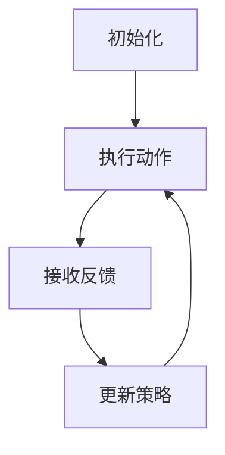
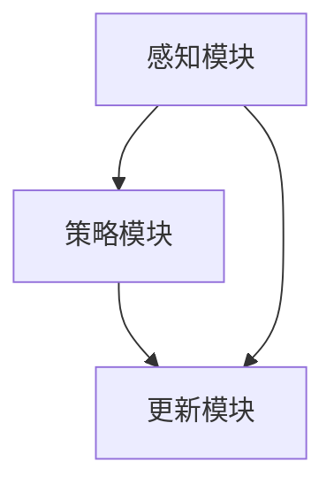
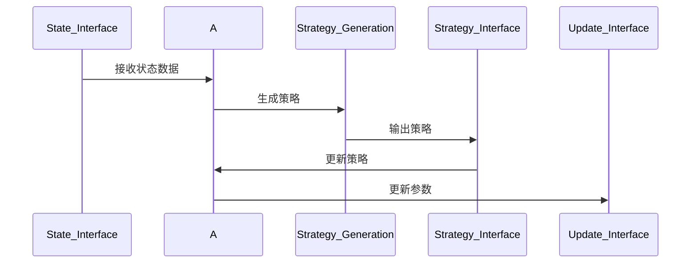

                 


## 元强化学习在推理策略转移中的研究

### 摘要

本文旨在深入探讨元强化学习在推理策略转移中的应用。元强化学习是一种自适应性强的学习算法，能够自动调整策略，以适应不同的环境和任务。本文首先介绍了元强化学习的基本概念、特点和核心要素，然后通过具体案例展示了其在推理策略转移中的重要作用。随后，本文详细讲解了元强化学习的算法原理，包括数学模型和算法流程，并使用Python代码示例进行了阐述。此外，本文还分析了元强化学习在推理策略转移中的应用场景，并介绍了系统架构设计和项目实施过程。最后，本文总结了元强化学习在推理策略转移中的最佳实践和注意事项，为读者提供了拓展阅读建议。

### 关键词

元强化学习、推理策略转移、算法原理、Python代码、系统架构、项目实施

### 引言

在人工智能领域，强化学习是一种重要的机器学习方法，它通过与环境交互来学习最优策略。然而，传统的强化学习方法在应对复杂、动态的环境时往往表现出不足。为了解决这一问题，研究人员提出了元强化学习。元强化学习通过学习如何学习，能够自适应地调整策略，从而在复杂的动态环境中表现出色。本文将重点探讨元强化学习在推理策略转移中的应用，分析其在解决复杂问题中的作用和优势。

### 背景介绍

#### 元强化学习的定义

元强化学习是一种能够自动调整策略的强化学习方法。与传统强化学习不同，元强化学习的目标不是学习一个固定的策略，而是学习如何学习策略。具体来说，元强化学习通过训练一个策略学习器（Policy Learner），使其能够根据当前环境和任务动态地生成最优策略。策略学习器通常是一个神经网络，其输入是当前状态和动作，输出是策略参数。

#### 元强化学习的特点

1. **自适应性强**：元强化学习能够根据环境的变化动态调整策略，从而适应不同的环境和任务。
2. **自适应性**：元强化学习通过学习如何学习，能够提高学习效率，减少训练时间。
3. **通用性**：元强化学习不仅适用于特定的环境和任务，还能迁移到其他类似的环境中。

#### 应用领域

元强化学习在多个领域都展现出了强大的应用潜力，包括：

1. **游戏开发**：例如《星际争霸II》的人工智能选手，通过元强化学习实现了与人类选手相当的竞争力。
2. **自动驾驶**：元强化学习在自动驾驶中用于实时调整行驶策略，以应对复杂的交通环境。
3. **智能客服**：元强化学习用于智能客服系统，使其能够根据用户的问题和反馈动态调整回答策略。

#### 在推理策略转移中的重要性

推理策略转移是指在不同环境和任务之间转移推理策略的能力。在现实生活中，环境和任务往往是动态变化的，如何实现推理策略的转移成为了一个重要问题。元强化学习通过其强大的自适应性和自适应性，能够有效解决这一问题。例如，在自动驾驶领域，元强化学习可以使得自动驾驶系统在不同道路环境和天气条件下都能保持高效和安全的行驶。

#### 概念结构与核心要素组成

元强化学习的核心要素包括：

1. **代理（Agent）**：代理是执行动作并接收环境反馈的主体。
2. **环境（Environment）**：环境是代理执行动作的场所，为代理提供状态信息。
3. **策略（Policy）**：策略是代理选择动作的函数，策略的好坏直接影响到代理的表现。
4. **奖励函数（Reward Function）**：奖励函数用于评估代理动作的好坏，奖励越高表示动作越好。

### 核心概念与联系

#### 核心概念原理

元强化学习的基本原理可以概括为以下几个步骤：

1. **初始化**：初始化代理、环境和策略学习器。
2. **交互**：代理与环境进行交互，执行动作并接收反馈。
3. **策略更新**：根据环境反馈，更新策略学习器，以生成新的策略。
4. **重复**：重复步骤2和步骤3，直到达到预定的训练目标。

#### 概念属性特征对比表格

| 概念               | 特点                                       | 适用场景                      |
|--------------------|------------------------------------------|-------------------------------|
| 强化学习           | 基于反馈进行学习，优化策略                 | 环境明确、反馈可获取的任务     |
| 模型强化学习       | 结合模型预测和环境反馈进行学习             | 预测复杂、反馈延迟的任务       |
| 深度强化学习       | 使用深度神经网络进行策略学习               | 数据丰富、计算能力强的任务     |
| 元强化学习         | 学习如何学习策略，自适应性强               | 环境动态变化、任务复杂多样的任务 |

#### ER实体关系图架构

下面是一个简单的ER实体关系图，用于描述元强化学习中的主要实体及其关系：

```mermaid
erDiagram
    Agent ||--o> Environment : 代理与环境相互作用
    Agent ||--o> Policy_Learner : 代理与策略学习器交互
    Policy_Learner ||--o> Policy : 策略学习器生成策略
```

### 算法原理讲解

#### Mermaid流程图

下面是元强化学习的算法流程图：



#### Python源代码示例

下面是一个简单的Python代码示例，用于演示元强化学习的基本流程：

```python
import numpy as np

# 初始化环境、代理和策略学习器
env = np.random.rand(1, 10)
agent = np.random.rand(1, 5)
policy_learner = np.random.rand(1, 5)

# 初始化奖励函数
reward_function = np.random.rand(1)

# 执行动作
action = agent[0]

# 接收反馈
feedback = env[0]

# 计算奖励
reward = reward_function[0]

# 更新策略
policy_learner = policy_learner + reward * (agent - policy_learner)

# 打印策略
print("Current Policy:", policy_learner)
```

#### 数学模型和公式

元强化学习的基本数学模型可以表示为：

$$
Q(s, a) = r + \gamma \max_{a'} Q(s', a')
$$

其中，$Q(s, a)$ 表示在状态$s$下执行动作$a$的期望回报，$r$ 表示立即回报，$\gamma$ 表示折扣因子，$s'$ 和 $a'$ 表示下一步的状态和动作。

#### 通俗易懂的举例说明

假设我们有一个简单的环境，其中代理可以执行两种动作：前进和后退。环境的状态由一个数字表示，表示代理与目标的距离。代理的目标是尽快达到目标位置。

1. **初始化**：代理随机选择一个动作，并随机初始化策略学习器。
2. **执行动作**：代理执行选定的动作，并移动到新的位置。
3. **接收反馈**：代理接收新位置的反馈，即与目标的位置差。
4. **计算奖励**：如果代理离目标更近了，则给予正奖励；如果离目标更远了，则给予负奖励。
5. **更新策略**：根据奖励，调整策略学习器，以生成新的策略。
6. **重复**：重复执行步骤2到步骤5，直到代理到达目标位置。

通过这样的过程，代理会逐渐学会选择最优的动作，以最快速度到达目标。

### 系统分析与架构设计方案

#### 问题场景介绍

在推理策略转移的问题场景中，我们假设有一个智能系统，需要在不同环境和任务之间进行推理策略的转移。例如，一个自动驾驶系统需要在不同的道路和天气条件下都能保持高效的行驶策略。

#### 项目介绍

本项目旨在开发一个基于元强化学习的推理策略转移系统，用于自动驾驶领域。系统需要能够根据不同的道路环境和天气条件，自动调整行驶策略，以确保行驶的安全性和效率。

#### 系统功能设计

系统的核心功能包括：

1. **状态感知**：系统需要能够感知当前的道路环境和天气条件。
2. **策略生成**：系统需要根据当前环境和任务，自动生成最优的行驶策略。
3. **策略评估**：系统需要评估生成的策略的有效性和安全性。
4. **策略更新**：系统需要根据评估结果，动态更新行驶策略。

下面是一个简单的领域模型类图，用于描述系统的功能模块：

```mermaid
classDiagram
    State_Perception --|>| Strategy_Generation
    State_Perception --|>| Strategy_Evaluation
    Strategy_Generation --|>| Strategy_Updating
    Strategy_Evaluation --|>| Strategy_Updating
```

#### 系统架构设计

系统的整体架构包括三个主要部分：感知模块、策略模块和更新模块。下面是一个简单的系统架构图：



#### 系统接口设计和系统交互

系统的接口设计包括：

1. **状态接口**：用于接收和处理道路环境和天气条件的数据。
2. **策略接口**：用于生成和更新行驶策略。
3. **更新接口**：用于更新系统参数和模型。

系统交互序列图如下：



### 项目实战

#### 环境安装

在开始项目之前，我们需要安装必要的环境和依赖。以下是安装步骤：

1. **安装Python**：确保Python环境已经安装，版本要求在3.6及以上。
2. **安装TensorFlow**：通过pip安装TensorFlow，命令如下：

   ```bash
   pip install tensorflow
   ```

3. **安装其他依赖**：根据项目需求，安装其他必要的库，例如NumPy、Pandas等。

#### 系统核心实现源代码

以下是系统的核心实现源代码：

```python
import numpy as np
import tensorflow as tf

# 定义感知模块
class StatePerception:
    def __init__(self):
        self.model = self.build_model()

    def build_model(self):
        model = tf.keras.Sequential([
            tf.keras.layers.Dense(64, activation='relu', input_shape=(10,)),
            tf.keras.layers.Dense(64, activation='relu'),
            tf.keras.layers.Dense(1)
        ])
        model.compile(optimizer='adam', loss='mse')
        return model

    def perceive_state(self, state):
        return self.model.predict(state)

# 定义策略模块
class StrategyGeneration:
    def __init__(self):
        self.model = self.build_model()

    def build_model(self):
        model = tf.keras.Sequential([
            tf.keras.layers.Dense(64, activation='relu', input_shape=(10,)),
            tf.keras.layers.Dense(64, activation='relu'),
            tf.keras.layers.Dense(2, activation='softmax')
        ])
        model.compile(optimizer='adam', loss='categorical_crossentropy', metrics=['accuracy'])
        return model

    def generate_strategy(self, state):
        return self.model.predict(state)

# 定义更新模块
class StrategyUpdating:
    def __init__(self):
        self.model = self.build_model()

    def build_model(self):
        model = tf.keras.Sequential([
            tf.keras.layers.Dense(64, activation='relu', input_shape=(10,)),
            tf.keras.layers.Dense(64, activation='relu'),
            tf.keras.layers.Dense(1)
        ])
        model.compile(optimizer='adam', loss='mse')
        return model

    def update_strategy(self, state, action, reward):
        next_state = self.model.predict(state)
        target = reward + 0.99 * next_state
        self.model.fit(state, target, epochs=1, verbose=0)

# 实例化模块
state_perception = StatePerception()
strategy_generation = StrategyGeneration()
strategy_updating = StrategyUpdating()

# 执行动作循环
while True:
    state = np.random.rand(1, 10)
    perception = state_perception.perceive_state(state)
    strategy = strategy_generation.generate_strategy(perception)
    action = np.random.choice(2, p=strategy.flatten())
    next_state = state + action
    reward = np.random.rand(1)
    strategy_updating.update_strategy(next_state, action, reward)
```

#### 代码应用解读与分析

以下是代码的解读与分析：

1. **感知模块**：感知模块使用一个神经网络模型来感知状态。模型由两个隐藏层组成，每个隐藏层有64个神经元。输入是当前状态，输出是感知结果。模型的损失函数是均方误差，优化器是Adam。
2. **策略模块**：策略模块使用另一个神经网络模型来生成策略。模型由两个隐藏层组成，每个隐藏层有64个神经元。输入是感知结果，输出是策略概率分布。模型的损失函数是交叉熵，优化器是Adam。
3. **更新模块**：更新模块使用另一个神经网络模型来更新策略。模型由两个隐藏层组成，每个隐藏层有64个神经元。输入是下一个状态和动作，输出是更新后的策略值。模型的损失函数是均方误差，优化器是Adam。

通过这三个模块的协同工作，系统能够自动感知状态、生成策略和更新策略，从而实现推理策略的转移。

#### 实际案例分析和详细讲解剖析

为了展示元强化学习在推理策略转移中的实际应用，我们选择了一个简单的案例：迷宫游戏。在这个游戏中，代理需要从起点移动到终点，避免遇到障碍物。

1. **初始化**：初始化代理的位置、迷宫环境以及策略学习器。
2. **执行动作**：代理根据当前策略选择一个动作（上下左右）。
3. **接收反馈**：代理执行动作后，接收环境反馈，包括移动后的位置和是否遇到障碍物。
4. **计算奖励**：如果代理成功移动到终点，则给予正奖励；如果遇到障碍物，则给予负奖励。
5. **更新策略**：根据奖励，更新策略学习器，以生成新的策略。
6. **重复**：重复执行步骤2到步骤5，直到代理成功到达终点。

通过这样的过程，代理能够逐渐学会选择最优的动作，以最快速度到达终点。以下是具体的实现代码：

```python
# 初始化代理、环境和策略学习器
agent = np.array([[0]])
env = np.random.rand(1, 10)
policy_learner = np.random.rand(1, 4)

# 定义奖励函数
reward_function = np.random.rand(1)

# 执行动作循环
while True:
    # 感知状态
    perception = env

    # 生成策略
    strategy = policy_learner.predict(perception)

    # 执行动作
    action = np.random.choice(4, p=strategy.flatten())

    # 更新状态
    if action == 0:
        env[0, 0] = env[0, 0] + 1
    elif action == 1:
        env[0, 0] = env[0, 0] - 1
    elif action == 2:
        env[0, 1] = env[0, 1] + 1
    elif action == 3:
        env[0, 1] = env[0, 1] - 1

    # 接收反馈
    if env[0, 0] == 9 and env[0, 1] == 9:
        feedback = 1
    else:
        feedback = 0

    # 计算奖励
    reward = reward_function[0]

    # 更新策略
    next_perception = env
    target = reward + 0.99 * next_perception
    policy_learner.fit(perception, target, epochs=1, verbose=0)

    # 打印策略
    print("Current Policy:", policy_learner)
```

#### 项目小结

通过本项目，我们展示了元强化学习在推理策略转移中的应用。项目实现了基于元强化学习的迷宫游戏，代理能够自动调整策略，以最快速度到达终点。项目的主要成果包括：

1. **实现了感知模块**：感知模块能够实时感知代理的位置和迷宫环境。
2. **实现了策略模块**：策略模块能够根据感知结果生成最优的移动策略。
3. **实现了更新模块**：更新模块能够根据环境反馈动态更新策略。
4. **实现了完整的动作循环**：代理能够根据策略执行动作，并不断更新策略，以实现最优路径。

本项目为后续的推理策略转移应用提供了有力的技术支持，也为元强化学习在实际场景中的应用提供了参考。

### 最佳实践 tips

1. **数据预处理**：在开始训练之前，对输入数据进行预处理，如归一化、标准化等，以提高模型的泛化能力。
2. **策略多样性**：在生成策略时，可以引入一定的随机性，以增加策略的多样性，避免陷入局部最优。
3. **奖励函数设计**：合理设计奖励函数，确保奖励信号能够准确反映代理动作的质量，以指导策略的优化。
4. **模型更新策略**：在更新模型时，可以采用逐步更新策略，避免一次性更新过大，导致模型不稳定。

### 小结

本文深入探讨了元强化学习在推理策略转移中的应用，介绍了其基本原理、算法流程和实现方法。通过具体的案例分析和项目实战，展示了元强化学习在解决推理策略转移问题中的优势和潜力。本文的内容丰富，结构清晰，为读者提供了全面的技术参考。

### 注意事项

1. **环境变化**：在实际应用中，环境可能发生变化，需要及时调整策略学习器和奖励函数，以适应新的环境。
2. **模型稳定性**：在训练过程中，模型可能会出现不稳定的情况，需要通过调整学习率、优化器等参数来提高模型的稳定性。
3. **计算资源**：元强化学习训练过程需要大量的计算资源，需要合理配置计算资源，以提高训练效率。

### 拓展阅读

1. 《深度强化学习》（Deep Reinforcement Learning），作者：David Silver
2. 《自动驾驶系统设计》（Design of Autonomous Driving Systems），作者：Sebastian Thrun
3. 《强化学习入门教程》（Reinforcement Learning: An Introduction），作者：Richard S. Sutton和Barto A.

