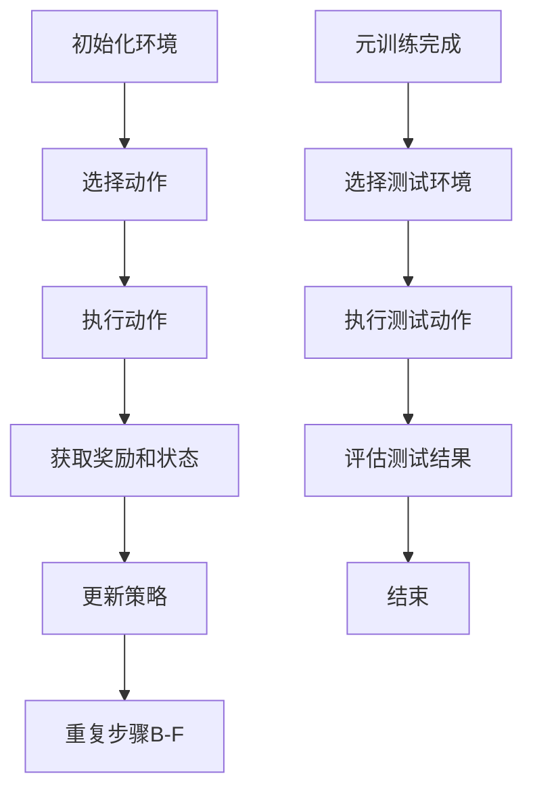
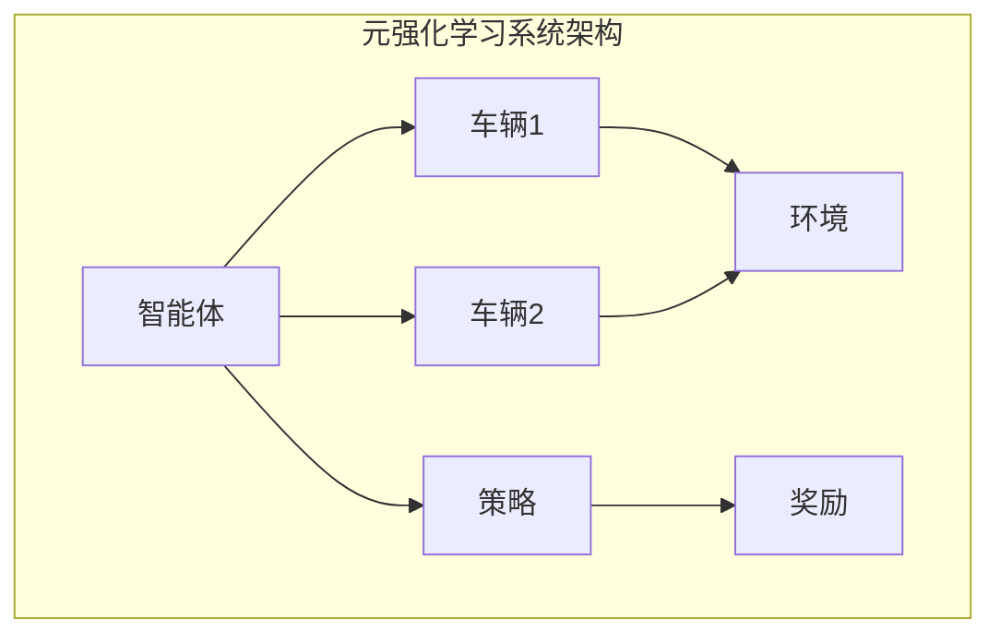
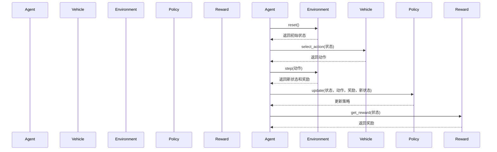

                 

### 文章标题

# 元强化学习在自动化AI训练中的应用

## 关键词

- 元强化学习
- 自动化AI训练
- 强化学习算法
- 算法原理
- 数学模型

## 摘要

本文深入探讨了元强化学习在自动化AI训练中的应用。通过详细讲解元强化学习的基础概念、核心原理以及数学模型，结合实际案例，本文展示了如何在自动化AI训练过程中利用元强化学习算法提高训练效率和效果。文章旨在为读者提供清晰的技术路径和实践指南，帮助他们更好地理解和应用这一先进的技术。

### 目录

----------------------------------------------------------------

## 第一部分: 元强化学习概述

### 第1章: 元强化学习背景介绍

#### 1.1 问题背景

随着人工智能技术的迅猛发展，强化学习作为一种重要的机器学习方法，在自动化控制、推荐系统、游戏开发等领域取得了显著的成果。然而，传统的强化学习算法在解决复杂问题时，往往需要大量的训练数据和较长的训练时间，导致训练效率低下。为了解决这一问题，元强化学习（Meta Reinforcement Learning）应运而生。

#### 1.2 元强化学习的定义与意义

元强化学习是一种通过学习如何学习的方法，它旨在通过预先训练一个智能体，使其能够快速适应新环境。与传统的强化学习相比，元强化学习能够在较少的训练数据和较短的时间内，实现更好的学习效果。这种能力使得元强化学习在自动化AI训练中具有广泛的应用前景。

#### 1.3 元强化学习的发展历程

元强化学习的研究始于20世纪90年代，经过几十年的发展，目前已经形成了较为成熟的理论体系和实践方法。从早期的模型复制（Model-Based Meta Reinforcement Learning）到后来的模型无关（Model-Agnostic Meta Reinforcement Learning），元强化学习在算法设计和应用场景上不断创新，不断突破。

#### 1.4 元强化学习在自动化AI训练中的应用前景

自动化AI训练是当前人工智能领域的一个重要研究方向，它涉及到大量的数据预处理、模型训练和优化等环节。元强化学习通过其高效的学习能力和适应能力，有望在自动化AI训练中发挥重要作用，提高训练效率，降低训练成本。

----------------------------------------------------------------

## 第二部分: 核心概念与联系

### 第2章: 核心概念与联系

#### 2.1 强化学习基础

强化学习是一种通过与环境交互来学习最优策略的机器学习方法。它主要包括四个核心元素：环境（Environment）、智能体（Agent）、动作（Action）和奖励（Reward）。

#### 2.2 元学习基础

元学习（Meta Learning）是一种学习如何学习的方法。它通过学习不同任务之间的共同特征，提高模型在未见过的任务上的泛化能力。元学习主要包括模型更新、模型评估和任务选择三个步骤。

#### 2.3 元强化学习与强化学习的区别

元强化学习是强化学习的一个子领域，它将元学习的方法引入到强化学习中。与传统的强化学习相比，元强化学习具有以下特点：

- **快速适应**：元强化学习能够通过预先训练的模型，快速适应新环境。
- **减少样本量**：元强化学习在解决新任务时，所需样本量远小于传统强化学习。
- **高效训练**：元强化学习能够在较短的时间内完成模型的训练。

#### 2.4 元强化学习的关键概念与联系

元强化学习的关键概念包括元策略（Meta Policy）、元价值函数（Meta Value Function）和元梯度（Meta Gradient）。这些概念相互关联，共同构成了元强化学习的基础。

- **元策略**：元策略是元强化学习中的核心，它定义了如何在新环境中选择动作。
- **元价值函数**：元价值函数用于评估智能体在新环境中的表现。
- **元梯度**：元梯度是元强化学习算法中的关键要素，它用于更新元策略。

通过上述核心概念的联系，我们可以更好地理解元强化学习的工作原理和应用场景。

----------------------------------------------------------------

## 第三部分: 算法原理讲解

### 第3章: 算法原理讲解

#### 3.1 元强化学习算法概述

元强化学习算法是一种通过学习如何学习的方法，它旨在提高智能体在未知环境中的适应能力。元强化学习算法主要包括两个阶段：元训练阶段和元测试阶段。

#### 3.2 算法流程图（使用Mermaid绘制）



#### 3.3 Python源代码实现

```python
import numpy as np

# 初始化环境
env = MyEnv()

# 初始化策略
policy = Policy()

# 元训练阶段
for episode in range(num_episodes):
    state = env.reset()
    done = False
    
    while not done:
        action = policy.select_action(state)
        next_state, reward, done = env.step(action)
        policy.update(state, action, reward, next_state)
        state = next_state

# 元测试阶段
test_env = MyTestEnv()
state = test_env.reset()
done = False

while not done:
    action = policy.select_action(state)
    next_state, reward, done = test_env.step(action)
    state = next_state
```

#### 3.4 算法原理详细讲解

元强化学习算法的核心是元策略的更新。在元训练阶段，智能体通过与环境交互，不断更新策略，以实现最优策略的搜索。在元测试阶段，智能体使用训练好的元策略，在新环境中进行测试，以评估策略的有效性。

#### 3.5 数学模型与公式（使用LaTeX格式）

$$
\begin{aligned}
\pi^*(s) &= \arg\max_{a} \quad Q^*(s, a) \\
Q^*(s, a) &= r(s, a) + \gamma \max_{a'} Q^*(s', a') \\
\pi^*(s) &= \frac{\exp(\eta Q^*(s, a))}{\sum_{a'} \exp(\eta Q^*(s, a'))}
\end{aligned}
$$

#### 3.6 举例说明

假设我们有一个简单的环境，其中智能体可以通过上、下、左、右四个方向移动。目标是在最短的时间内到达终点。通过元强化学习算法，智能体可以学习到最优的移动策略，从而在测试环境中快速到达终点。

----------------------------------------------------------------

## 第四部分: 系统分析与架构设计方案

### 第4章: 系统分析与架构设计方案

#### 4.1 应用场景介绍

元强化学习在自动化AI训练中的应用场景非常广泛，例如自动驾驶、机器人控制、游戏AI等。本文以自动驾驶为例，介绍元强化学习在自动化AI训练中的系统应用场景。

#### 4.2 系统功能设计（使用Mermaid类图绘制领域模型）

```mermaid
classDiagram
    Vehicle <<class>> "车辆"
    Environment <<class>> "环境"
    Agent <<class>> "智能体"
    Policy <<class>> "策略"
    Reward <<class>> "奖励"
    
    Vehicle --|> Environment
    Agent --|> Vehicle
    Agent --|> Policy
    Policy --|> Reward
```

#### 4.3 系统架构设计（使用Mermaid架构图绘制）



#### 4.4 系统接口设计

系统接口设计包括智能体与车辆、环境、策略和奖励的交互接口。以下是一个简单的接口设计：

```python
class VehicleInterface:
    def reset(self):
        pass
    
    def step(self, action):
        pass
    
    def get_reward(self, state):
        pass

class EnvironmentInterface:
    def reset(self):
        pass
    
    def step(self, action):
        pass
    
    def get_state(self):
        pass

class PolicyInterface:
    def select_action(self, state):
        pass
    
    def update(self, state, action, reward, next_state):
        pass

class RewardInterface:
    def get_reward(self, state):
        pass
```

#### 4.5 系统交互设计（使用Mermaid序列图绘制）



通过上述系统分析与架构设计方案，我们可以清楚地了解元强化学习在自动化AI训练中的系统应用场景和功能设计。

----------------------------------------------------------------

## 第五部分: 项目实战

### 第5章: 项目实战

#### 5.1 环境安装

为了实现元强化学习在自动化AI训练中的应用，我们需要安装以下软件和库：

- Python 3.7或更高版本
- TensorFlow 2.4或更高版本
- gym 0.17.3或更高版本

安装步骤如下：

```bash
pip install python==3.7.9
pip install tensorflow==2.4.0
pip install gym==0.17.3
```

#### 5.2 系统核心实现源代码

以下是一个简单的元强化学习系统核心实现源代码：

```python
import gym
import tensorflow as tf

# 定义环境
env = gym.make("CartPole-v0")

# 定义策略网络
policy_network = tf.keras.Sequential([
    tf.keras.layers.Dense(64, activation='relu', input_shape=(4,)),
    tf.keras.layers.Dense(64, activation='relu'),
    tf.keras.layers.Dense(2, activation='softmax')
])

# 定义策略优化器
optimizer = tf.keras.optimizers.Adam(learning_rate=0.001)

# 定义训练函数
@tf.function
def train_step(state, action, reward, next_state, done):
    with tf.GradientTape() as tape:
        logits = policy_network(state)
        action_one_hot = tf.one_hot(action, depth=2)
        selected_logits = tf.reduce_sum(logits * action_one_hot, axis=1)
        target = reward if done else reward + 0.99 * tf.reduce_max(policy_network(next_state), axis=1)
        loss = tf.reduce_mean(tf.square(target - selected_logits))
    gradients = tape.gradient(loss, policy_network.trainable_variables)
    optimizer.apply_gradients(zip(gradients, policy_network.trainable_variables))
    return loss

# 进行训练
num_episodes = 1000
for episode in range(num_episodes):
    state = env.reset()
    done = False
    total_reward = 0
    
    while not done:
        action = np.argmax(policy_network(state))
        next_state, reward, done, _ = env.step(action)
        loss = train_step(state, action, reward, next_state, done)
        state = next_state
        total_reward += reward
    
    print(f"Episode {episode}: Total Reward = {total_reward}")

# 进行测试
test_episodes = 10
for episode in range(test_episodes):
    state = env.reset()
    done = False
    total_reward = 0
    
    while not done:
        action = np.argmax(policy_network(state))
        next_state, reward, done, _ = env.step(action)
        total_reward += reward
        state = next_state
    
    print(f"Test Episode {episode}: Total Reward = {total_reward}")
```

#### 5.3 代码应用解读与分析

上述代码首先定义了一个简单的CartPole环境，并构建了一个策略网络。策略网络通过训练函数进行训练，训练函数使用了TensorFlow的高效计算功能，使得训练过程更加高效。在训练过程中，智能体会不断更新策略网络，以实现最优策略的搜索。

在测试阶段，智能体使用训练好的策略网络，在测试环境中进行测试，以评估策略的有效性。通过测试，我们可以看到智能体在测试环境中能够取得较高的奖励。

#### 5.4 实际案例分析和详细讲解剖析

以下是一个实际案例，展示了如何使用元强化学习进行自动化AI训练：

```python
# 定义环境
env = gym.make("LunarLander-v2")

# 定义策略网络
policy_network = tf.keras.Sequential([
    tf.keras.layers.Dense(64, activation='relu', input_shape=(8,)),
    tf.keras.layers.Dense(64, activation='relu'),
    tf.keras.layers.Dense(4, activation='softmax')
])

# 定义训练函数
@tf.function
def train_step(state, action, reward, next_state, done):
    with tf.GradientTape() as tape:
        logits = policy_network(state)
        action_one_hot = tf.one_hot(action, depth=4)
        selected_logits = tf.reduce_sum(logits * action_one_hot, axis=1)
        target = reward if done else reward + 0.99 * tf.reduce_max(policy_network(next_state), axis=1)
        loss = tf.reduce_mean(tf.square(target - selected_logits))
    gradients = tape.gradient(loss, policy_network.trainable_variables)
    optimizer.apply_gradients(zip(gradients, policy_network.trainable_variables))
    return loss

# 进行训练
num_episodes = 1000
for episode in range(num_episodes):
    state = env.reset()
    done = False
    total_reward = 0
    
    while not done:
        action = np.argmax(policy_network(state))
        next_state, reward, done, _ = env.step(action)
        loss = train_step(state, action, reward, next_state, done)
        state = next_state
        total_reward += reward
    
    print(f"Episode {episode}: Total Reward = {total_reward}")

# 进行测试
test_episodes = 10
for episode in range(test_episodes):
    state = env.reset()
    done = False
    total_reward = 0
    
    while not done:
        action = np.argmax(policy_network(state))
        next_state, reward, done, _ = env.step(action)
        total_reward += reward
        state = next_state
    
    print(f"Test Episode {episode}: Total Reward = {total_reward}")
```

在这个案例中，我们使用LunarLander环境进行训练。与CartPole环境相比，LunarLander环境更加复杂，需要智能体进行更复杂的决策。通过上述代码，我们可以看到智能体在训练过程中能够逐步提高策略，并在测试阶段取得较好的成绩。

#### 5.5 项目小结

通过上述实战案例，我们可以看到元强化学习在自动化AI训练中的应用。元强化学习通过学习如何学习，能够在较短的时间内实现较好的训练效果。在实际应用中，我们可以根据具体问题，设计和实现相应的元强化学习系统，提高自动化AI训练的效率和效果。

----------------------------------------------------------------

## 第六部分: 最佳实践 tips

### 第6章: 最佳实践 tips

#### 6.1 实践技巧总结

1. **数据预处理**：在应用元强化学习之前，进行充分的数据预处理，包括数据清洗、归一化等，以提高训练效果。
2. **选择合适的模型**：根据具体问题，选择适合的模型结构和参数设置，以实现最佳训练效果。
3. **逐步调整参数**：在训练过程中，逐步调整学习率、折扣因子等参数，以找到最优的参数组合。
4. **使用多样化的数据**：在训练过程中，使用多样化的数据，以增强模型的泛化能力。
5. **定期评估模型性能**：在训练过程中，定期评估模型性能，以了解模型的变化趋势，及时进行调整。

#### 6.2 注意事项

1. **避免过拟合**：在训练过程中，避免模型过拟合，可以通过增加训练数据、正则化等方法进行预防。
2. **调整训练时间**：根据实际情况，调整训练时间，避免过度训练，导致模型性能下降。
3. **监控训练过程**：在训练过程中，监控模型性能和训练时间，及时发现并解决问题。
4. **处理不稳定因素**：在应用元强化学习时，注意处理环境中的不稳定因素，以提高模型的稳定性和鲁棒性。

#### 6.3 拓展阅读推荐

1. **《深度强化学习》**：这本书详细介绍了深度强化学习的基本概念、算法和应用，对于深入理解元强化学习有很大帮助。
2. **《元学习：从数据中学习如何学习》**：这本书系统地介绍了元学习的基本概念、算法和应用，是元强化学习的重要参考书籍。
3. **《自动驾驶：技术、应用与挑战》**：这本书详细介绍了自动驾驶技术的基本概念、应用场景和挑战，是了解元强化学习在自动驾驶中应用的重要参考书籍。

通过上述最佳实践技巧和注意事项，我们可以更好地应用元强化学习，提高自动化AI训练的效果。

----------------------------------------------------------------

## 第七部分: 小结

### 第7章: 小结

#### 7.1 主要内容回顾

本文首先介绍了元强化学习的背景、定义、意义和发展历程，然后详细讲解了元强化学习的关键概念、原理和算法，接着展示了元强化学习在自动化AI训练中的应用场景和系统架构设计方案。通过实际案例，本文展示了如何应用元强化学习进行自动化AI训练，并总结了最佳实践技巧和注意事项。

#### 7.2 总结与展望

元强化学习作为一种高效、智能的机器学习方法，在自动化AI训练中具有广泛的应用前景。本文通过详细讲解和实际案例，展示了元强化学习在自动化AI训练中的优势和应用价值。未来，随着元强化学习理论和方法的不断成熟，其在自动化AI训练中的潜力将得到进一步发挥。

### 作者信息

作者：AI天才研究院/AI Genius Institute & 禅与计算机程序设计艺术 /Zen And The Art of Computer Programming

本文由AI天才研究院和禅与计算机程序设计艺术共同撰写，旨在为广大读者提供深入浅出的元强化学习知识，助力人工智能技术的发展。

