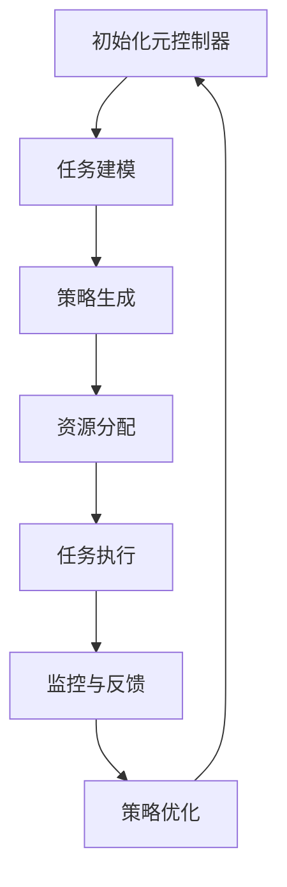

                 


## 元控制器在复杂推理任务分解与重组中的作用

### 关键词
- 元控制器
- 复杂推理任务
- 任务分解与重组
- 算法原理
- 系统架构
- 项目实战

### 摘要
本文旨在探讨元控制器在复杂推理任务分解与重组中的作用。我们将首先介绍元控制器的核心概念，然后分析复杂推理任务的特点，接着讨论任务分解与重组的方法。通过详细讲解算法原理、系统架构设计以及项目实战，我们将展示元控制器如何在实际应用中发挥关键作用。

## 背景介绍

### 核心概念术语说明
- **元控制器（Meta-controller）**：一种能够自动执行任务控制与管理的系统，负责在复杂任务中制定策略和分配资源。
- **复杂推理任务**：涉及多步骤、多层次逻辑推理的任务，通常需要处理大量的数据和变量。
- **任务分解与重组**：将复杂任务拆分成多个可管理的子任务，并在适当的时候重新组合这些子任务以优化系统性能。

### 问题背景
在人工智能领域，随着技术的不断进步，许多复杂任务需要高效地处理大量的数据和逻辑关系。这些任务通常难以直接解决，因为它们的规模和复杂性超出了传统方法的处理能力。因此，如何有效地分解和重组这些任务成为了当前研究的一个重要方向。

### 问题描述
复杂推理任务的分解与重组面临以下挑战：
- **任务规模庞大**：任务包含大量子任务，需要有效管理。
- **任务依赖关系复杂**：子任务之间存在复杂的依赖关系，影响任务的执行顺序和策略。
- **优化目标多样化**：需要在不同目标（如效率、成本、质量等）之间做出权衡。

### 问题解决
元控制器通过以下方式解决上述挑战：
- **自动化任务控制**：元控制器可以自动制定任务执行策略，优化资源分配。
- **灵活的任务分解与重组**：元控制器可以根据任务特点和环境动态地调整任务分解与重组策略。
- **多目标优化**：元控制器能够考虑不同优化目标，实现整体性能的最优化。

### 边界与外延
- **边界**：元控制器主要应用于复杂推理任务，但不限于特定领域。
- **外延**：元控制器的概念可以扩展到其他需要自动化任务控制的场景，如自主驾驶、智能家居等。

### 概念结构与核心要素组成
元控制器由以下几个核心要素组成：
1. **任务模型**：描述任务的抽象表示。
2. **策略生成器**：根据任务模型和环境信息生成执行策略。
3. **资源管理器**：管理任务执行所需的资源。
4. **监控与反馈机制**：监控任务执行过程，提供反馈以优化策略。

## 核心概念与联系

### 元控制器原理
元控制器的工作原理可以概括为以下几个步骤：
1. **任务建模**：将复杂推理任务表示为任务模型。
2. **策略生成**：策略生成器根据任务模型和环境信息生成执行策略。
3. **资源分配**：资源管理器根据策略分配任务所需的资源。
4. **任务执行**：执行策略指导任务的具体执行。
5. **监控与反馈**：监控任务执行过程，提供反馈以优化策略。

### 复杂推理任务特点
复杂推理任务通常具有以下特点：
- **任务规模大**：包含大量子任务，需要高效管理。
- **逻辑关系复杂**：子任务之间存在复杂的依赖关系，影响执行顺序。
- **动态性**：任务环境和目标可能随着时间变化。

### 任务分解与重组方法
任务分解与重组的方法可以分为以下几类：
1. **静态分解与重组**：预先定义任务分解与重组策略，不考虑动态调整。
2. **动态分解与重组**：根据任务执行过程中收集到的信息，实时调整分解与重组策略。
3. **层次化分解与重组**：将任务分解为多个层次，逐层优化。

## 算法原理讲解

### 算法流程图


### Python源代码讲解
```python
# 元控制器Python示例代码
class MetaController:
    def __init__(self):
        self.task_model = None
        self.strategy = None
    
    def build_task_model(self, task_data):
        # 建立任务模型
        self.task_model = TaskModel(task_data)
    
    def generate_strategy(self):
        # 生成执行策略
        self.strategy = StrategyGenerator(self.task_model).generate()
    
    def allocate_resources(self):
        # 分配资源
        ResourceManager(self.strategy).allocate()
    
    def execute_task(self):
        # 执行任务
        Executor(self.strategy).execute()
    
    def monitor_and_feedba
```

