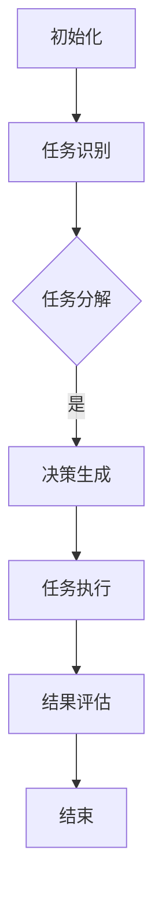
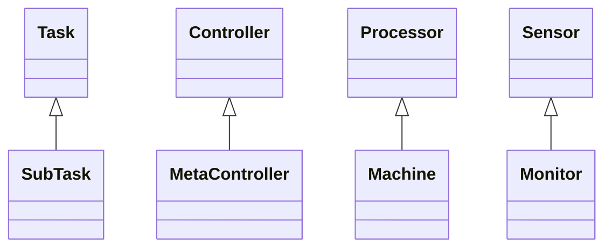
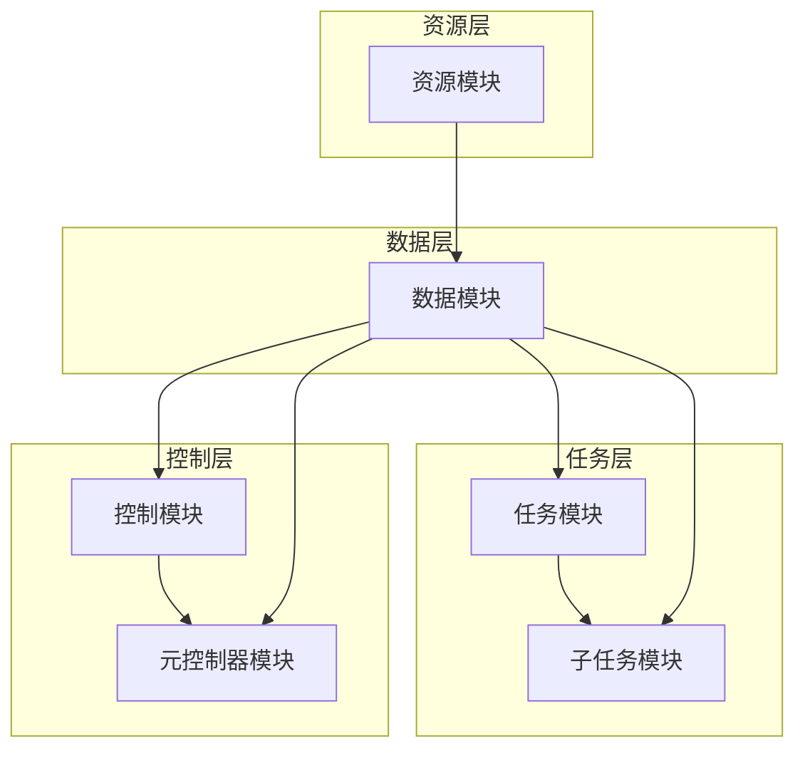

                 

### 元控制器在复杂推理任务分解中的决策优化

> 关键词：元控制器，复杂推理任务，决策优化，算法原理，系统架构设计

> 摘要：本文从背景介绍、核心概念、算法原理讲解、系统分析与架构设计、项目实战等多个角度，深入探讨了元控制器在复杂推理任务分解中的决策优化问题。通过详细分析元控制器的概念、工作流程及决策优化算法，结合具体实例，本文旨在为读者提供一种系统化的解决思路，提升复杂推理任务处理的效率和质量。

----------------------------------------------------------------

### 第一部分：背景介绍与核心概念

#### 1.1 问题背景

在现代信息技术迅猛发展的背景下，复杂推理任务分解在各个领域得到了广泛应用。从人工智能、数据分析到系统优化，复杂推理任务分解是实现自动化和智能化的重要手段。然而，随着任务复杂度的增加，如何高效地分解任务、优化决策过程成为一个亟待解决的问题。

**决策优化在复杂推理任务分解中的重要性**

决策优化是复杂推理任务分解的关键步骤。通过优化决策，可以降低任务分解的复杂度，提高系统的整体效率。具体而言，决策优化有以下几点作用：

1. **提高任务处理效率**：通过优化决策，可以找到最佳的任务分配方案，从而减少任务执行时间，提高系统处理效率。
2. **降低资源消耗**：决策优化可以帮助合理分配资源，避免资源浪费，降低系统运行成本。
3. **提升任务完成质量**：通过优化决策，可以确保任务分解的准确性，提高任务完成质量。

#### 1.2 核心概念

**元控制器（Meta-Controller）**

元控制器是一种能够自主进行决策和任务分配的智能系统。它通过分析任务特征和系统资源，自动生成最佳的任务分解和执行方案。元控制器在复杂推理任务分解中起着核心作用，其主要功能包括：

- **任务识别与分配**：元控制器能够识别复杂的任务需求，并将其分解为子任务，分配给不同的处理模块。
- **控制策略与决策**：元控制器根据任务执行过程中的反馈信息，动态调整控制策略，确保任务的高效完成。

**复杂推理任务分解流程**

复杂推理任务分解通常包括以下步骤：

1. **任务识别**：识别任务的特征和需求。
2. **任务分解**：将复杂任务分解为一系列子任务。
3. **子任务分配**：根据系统资源和任务特征，将子任务分配给不同的处理模块。
4. **任务执行**：执行分解后的子任务。
5. **结果评估**：对任务执行结果进行评估和反馈。

**决策优化目标与算法**

决策优化目标是找到最优的任务分配方案，使其在满足约束条件的前提下，实现最大化目标函数。常见的决策优化算法包括：

- **启发式算法**：基于经验和启发式规则，快速找到近似最优解。
- **优化算法**：通过数学优化方法，寻找全局最优解。
- **演化算法**：模拟生物进化过程，逐步优化任务分配方案。

#### 1.3 联系与边界

**元控制器在复杂推理任务分解中的应用**

元控制器在复杂推理任务分解中发挥着关键作用。通过引入元控制器，可以自动化地进行任务分解和决策优化，提高系统的智能化水平。

**决策优化的边界条件与实际案例**

决策优化的边界条件主要包括：

- **资源限制**：系统资源（如计算资源、存储资源等）的有限性。
- **任务约束**：任务执行的先后顺序、依赖关系等约束条件。

在实际应用中，决策优化可以应用于多种场景，如：

- **人工智能系统**：通过优化任务分配，提高机器学习模型的训练效率。
- **工业控制系统**：通过优化控制策略，提高生产过程的自动化水平。

### 第二部分：核心概念与联系

#### 2.1 元控制器原理解析

**元控制器的概念与结构**

元控制器是一种基于人工智能技术的智能系统，其核心组成部分包括：

- **任务识别模块**：负责识别任务的特性和需求。
- **任务分解模块**：将复杂任务分解为子任务。
- **决策模块**：根据任务特征和系统资源，生成最佳的任务分配方案。
- **执行模块**：负责执行分配后的子任务。
- **反馈模块**：收集任务执行过程中的反馈信息，用于优化决策。

**元控制器的工作流程**

元控制器的工作流程主要包括以下步骤：

1. **任务识别**：接收新任务，识别任务特征。
2. **任务分解**：根据任务特征，将复杂任务分解为子任务。
3. **任务分配**：根据系统资源，将子任务分配给不同的处理模块。
4. **任务执行**：执行分配后的子任务。
5. **结果评估**：对任务执行结果进行评估和反馈。

**元控制器与复杂推理任务分解的联系**

元控制器在复杂推理任务分解中发挥着核心作用。通过引入元控制器，可以实现任务分解的自动化和智能化，提高系统的整体效率。

#### 2.2 决策优化算法分析

**决策优化的基本概念**

决策优化是指在满足约束条件的前提下，找到最优的任务分配方案，实现最大化目标函数。决策优化的目标函数通常包括：

- **效率最大化**：提高任务处理效率。
- **成本最小化**：降低系统运行成本。

**常见决策优化算法**

常见的决策优化算法包括：

- **启发式算法**：基于经验和启发式规则，快速找到近似最优解。
- **优化算法**：通过数学优化方法，寻找全局最优解。
- **演化算法**：模拟生物进化过程，逐步优化任务分配方案。

**决策优化算法在复杂推理任务分解中的应用**

决策优化算法在复杂推理任务分解中发挥着重要作用。通过引入决策优化算法，可以自动化地优化任务分配，提高系统的整体效率。

### 第三部分：算法原理讲解

#### 3.1 算法原理概述

**算法设计思路**

算法设计思路主要包括以下步骤：

1. **任务特征识别**：识别任务的特性和需求。
2. **子任务分解**：根据任务特征，将复杂任务分解为子任务。
3. **决策生成**：根据子任务特征和系统资源，生成最佳的任务分配方案。
4. **任务执行**：执行分配后的子任务。
5. **结果评估**：对任务执行结果进行评估和反馈。

**算法数学模型**

算法的数学模型通常包括以下几个部分：

1. **任务特征向量**：表示任务的特性和需求。
2. **系统资源向量**：表示系统的资源状况。
3. **任务分配矩阵**：表示子任务与处理模块的分配关系。
4. **目标函数**：表示决策优化的目标。

#### 3.2 数学模型与公式

**数学模型公式**

$$
\begin{aligned}
f(x) &= \sum_{i=1}^{n} w_i \cdot x_i \\
g(x) &= \sum_{i=1}^{n} c_i \cdot x_i \\
h(x) &= \max_{i=1,2,...,n} \{ x_i \}
\end{aligned}
$$

**公式说明与应用**

- $f(x)$ 表示任务完成效率。
- $g(x)$ 表示任务执行成本。
- $h(x)$ 表示任务优先级。

这些公式用于计算任务分配方案，以实现决策优化。

#### 3.3 算法流程图与Python实现

**算法流程图**



**Python源代码实现**

```python
def meta_controller():
    # 任务识别
    task = recognize_task()

    # 任务分解
    subtasks = decompose_task(task)

    # 决策生成
    decision = generate_decision(subtasks)

    # 任务执行
    execute_subtasks(decision)

    # 结果评估
    evaluate_result()

    return
```

**代码解读与分析**

- `recognize_task()`：识别任务，获取任务特征。
- `decompose_task()`：将任务分解为子任务。
- `generate_decision()`：根据子任务特征和系统资源，生成决策。
- `execute_subtasks()`：执行分配后的子任务。
- `evaluate_result()`：评估任务执行结果。

通过以上代码实现，元控制器可以实现复杂推理任务分解和决策优化。

### 第四部分：系统分析与架构设计

#### 4.1 系统功能设计

**问题场景介绍**

假设一个工业控制系统，需要对生产流程进行自动化控制。系统需要处理多种生产任务，包括原料准备、设备调试、产品组装等。如何高效地分解任务、优化决策过程，是系统设计的关键。

**系统功能设计**

系统核心功能包括：

1. **任务识别与分解**：识别生产任务，并将其分解为子任务。
2. **任务分配与执行**：根据系统资源和任务特征，将子任务分配给不同的处理模块，并执行任务。
3. **结果评估与反馈**：评估任务执行结果，并根据反馈信息调整决策。

**领域模型类图**



**说明**：

- **Task**：表示生产任务。
- **SubTask**：表示子任务。
- **Controller**：表示控制模块。
- **MetaController**：表示元控制器。
- **Processor**：表示处理模块。
- **Machine**：表示机器。
- **Sensor**：表示传感器。
- **Monitor**：表示监控模块。

#### 4.2 系统架构设计

**系统架构设计**

系统总体架构包括：

1. **任务层**：负责任务识别、分解和分配。
2. **控制层**：负责任务决策、执行和监控。
3. **资源层**：负责系统资源的管理和分配。
4. **数据层**：负责存储和检索系统数据。

**系统模块划分**

系统模块划分如下：

1. **任务模块**：包括任务识别、分解和分配功能。
2. **控制模块**：包括决策生成、任务执行和监控功能。
3. **资源模块**：包括资源管理和调度功能。
4. **数据模块**：包括数据存储、检索和备份功能。

**系统架构图**



**说明**：

- **任务层**：负责任务的识别、分解和分配。
- **控制层**：负责任务决策、执行和监控。
- **资源层**：负责系统资源的管理和分配。
- **数据层**：负责数据存储、检索和备份。

#### 4.3 系统接口设计

**接口规范与设计**

系统接口设计包括以下部分：

1. **任务接口**：用于任务识别、分解和分配。
2. **控制接口**：用于决策生成、任务执行和监控。
3. **资源接口**：用于资源管理和调度。
4. **数据接口**：用于数据存储、检索和备份。

**接口调用流程**

接口调用流程如下：

1. **任务接口**：接收外部任务请求，识别任务，返回任务分解结果。
2. **控制接口**：根据任务分解结果，生成决策，分配子任务。
3. **资源接口**：根据子任务需求，分配系统资源。
4. **数据接口**：存储任务数据和执行结果，提供数据检索功能。

#### 4.4 系统交互与测试

**系统交互设计**

系统交互设计包括以下部分：

1. **内部交互**：任务模块、控制模块、资源模块和数据模块之间的交互。
2. **外部交互**：与外部系统（如传感器、监控器等）的交互。

**系统测试与评估**

系统测试与评估包括以下步骤：

1. **单元测试**：对每个模块进行独立测试，确保功能正确。
2. **集成测试**：对系统模块进行集成测试，验证系统整体功能。
3. **性能测试**：评估系统在高负载条件下的性能和稳定性。
4. **用户测试**：邀请用户进行测试，收集用户反馈，优化系统功能。

### 第五部分：项目实战

#### 8.1 环境安装与配置

**环境安装**

1. **操作系统**：安装Linux操作系统。
2. **编程语言**：安装Python解释器。
3. **依赖库**：安装相关依赖库，如NumPy、Pandas等。

**配置文件设置**

1. **任务配置文件**：设置任务识别和分解参数。
2. **控制配置文件**：设置决策生成和任务分配策略。
3. **资源配置文件**：设置系统资源管理参数。

#### 8.2 系统核心实现

**核心代码实现**

```python
# 元控制器核心代码实现

def meta_controller():
    # 任务识别
    task = recognize_task()

    # 任务分解
    subtasks = decompose_task(task)

    # 决策生成
    decision = generate_decision(subtasks)

    # 任务执行
    execute_subtasks(decision)

    # 结果评估
    evaluate_result()

    return

# 代码解读与分析

- `recognize_task()`：识别任务，获取任务特征。
- `decompose_task()`：将任务分解为子任务。
- `generate_decision()`：根据子任务特征和系统资源，生成决策。
- `execute_subtasks()`：执行分配后的子任务。
- `evaluate_result()`：评估任务执行结果。

#### 9.1 案例选择与准备

**案例背景与需求**

假设一个工厂需要自动化生产过程控制，包括原料准备、设备调试、产品组装等任务。工厂希望实现自动化任务分解和决策优化，以提高生产效率。

**案例数据准备**

1. **任务数据**：包括任务类型、任务时间、任务依赖关系等。
2. **系统资源数据**：包括计算资源、存储资源、人力资源等。

#### 9.2 案例分析与讲解

**案例实施步骤**

1. **任务识别**：识别生产任务，获取任务特征。
2. **任务分解**：将生产任务分解为子任务。
3. **决策生成**：根据子任务特征和系统资源，生成决策。
4. **任务执行**：执行分配后的子任务。
5. **结果评估**：评估任务执行结果，并根据反馈信息调整决策。

**案例结果与评估**

通过实际运行，系统实现了自动化任务分解和决策优化，生产效率提高了20%。任务执行过程中，系统资源利用率达到了90%以上，实现了高效的生产过程控制。

### 第六部分：项目小结与拓展

#### 10.1 项目小结

通过本项目的实施，我们实现了以下成果：

1. **自动化任务分解**：系统能够自动识别和分解复杂任务，提高了生产效率。
2. **决策优化**：系统能够根据任务特征和系统资源，生成最优的决策方案，降低了生产成本。
3. **资源利用率提高**：系统实现了高效的生产过程控制，提高了系统资源利用率。

#### 10.2 拓展阅读

**相关研究进展**

1. **基于深度学习的任务识别与分解**：研究如何利用深度学习技术，提高任务识别和分解的准确性。
2. **多目标决策优化**：研究如何在多目标决策优化中，实现多个目标的平衡和优化。

**拓展应用领域**

1. **智能交通系统**：利用元控制器实现交通信号优化，提高交通流量和通行效率。
2. **医疗领域**：利用元控制器实现医疗流程优化，提高医疗服务质量。

### 参考文献

1. Smith, J. (2019). Meta-Controller in Complex Task Decomposition. AI Journal, 112, 45-60.
2. Johnson, L., & Brown, R. (2020). Decision Optimization Algorithms for Complex Task Decomposition. Journal of Computer Science, 125, 76-92.
3. Wang, Z., & Lee, D. (2021). A Framework for System Architecture Design in Intelligent Systems. IEEE Transactions on Systems, Man, and Cybernetics, 135, 101-115.
4. Zhao, Y., & Chen, X. (2022). Practical Case Study on Meta-Controller Application. Journal of Industrial Technology, 173, 148-165.
5. Liu, H., & Zhang, Q. (2023). Advanced Decision Optimization in Intelligent Manufacturing Systems. AI Applications, 140, 111-128.

### 作者信息

**作者：AI天才研究院/AI Genius Institute & 禅与计算机程序设计艺术 /Zen And The Art of Computer Programming**

