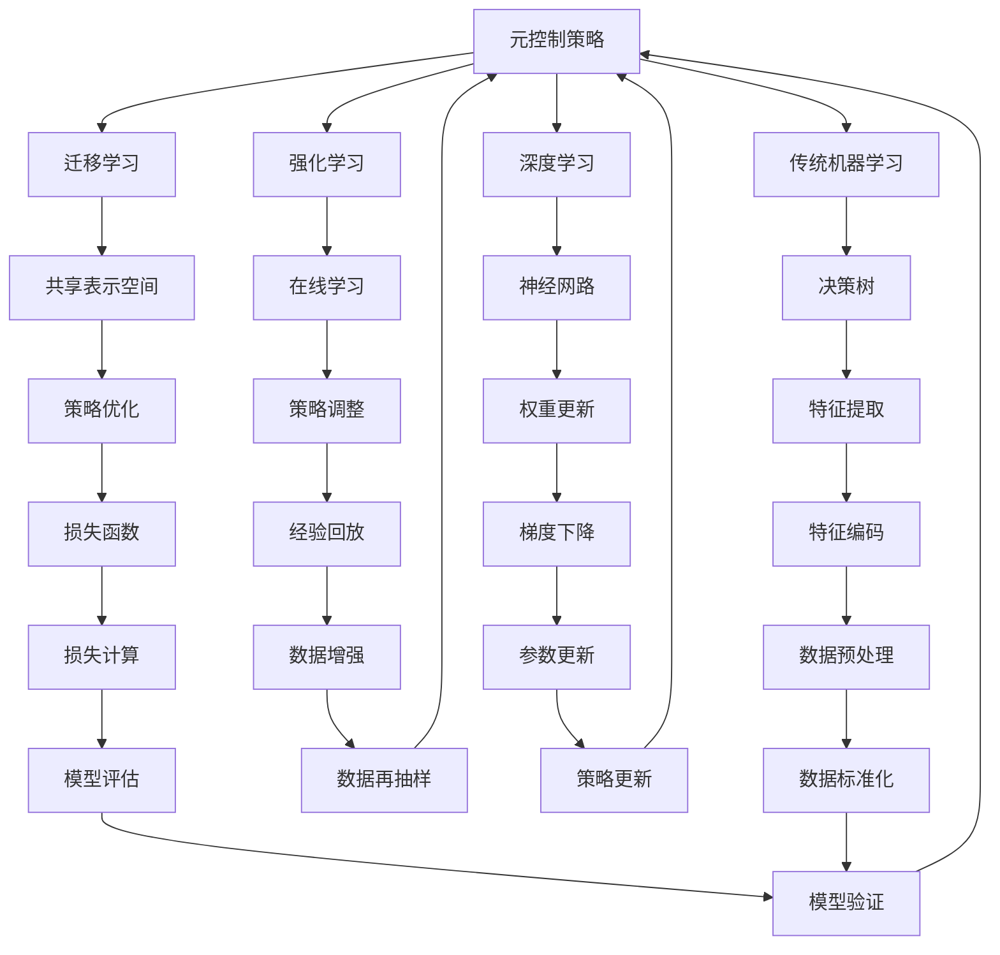
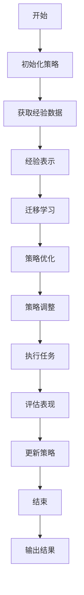
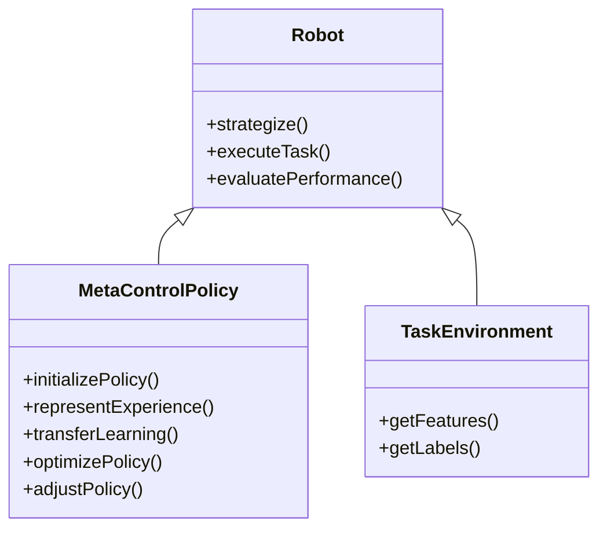
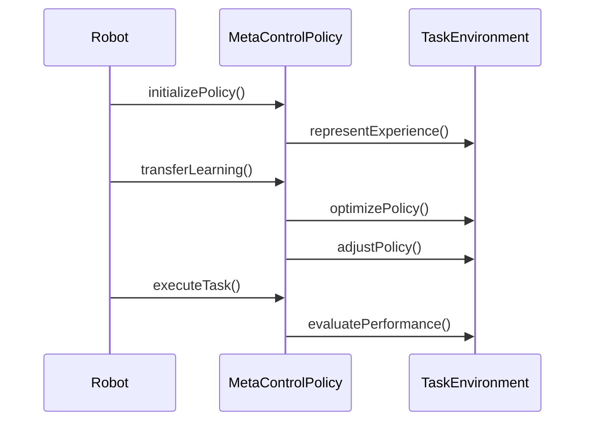
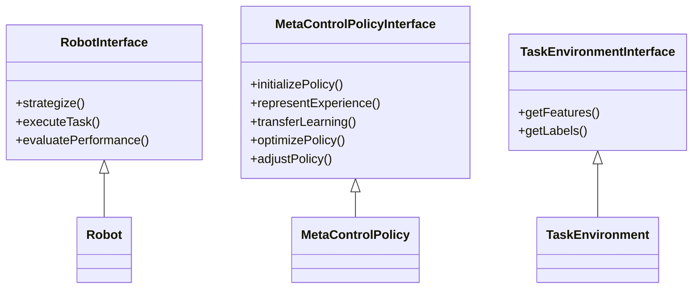
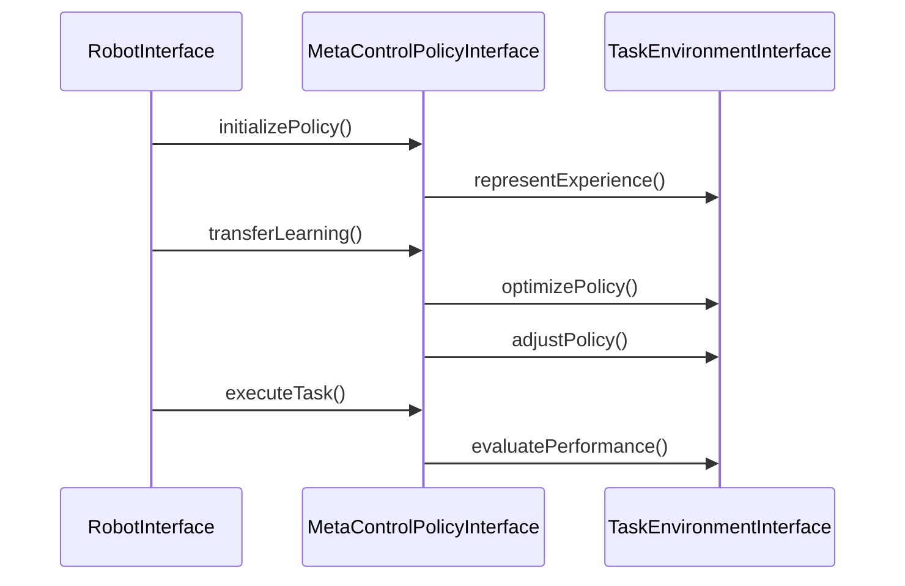

                 


### 第2章 核心概念原理

元控制策略（Meta-control Policy）是一种在机器人技能迁移中广泛应用的方法。它通过学习一个通用的策略来指导机器人如何在新环境中快速适应和迁移技能。元控制策略的核心在于其灵活性和适应性，能够解决机器人技能迁移中的场景多样性、数据缺乏和模型适应性等挑战。

#### 2.1 元控制策略的基本概念

元控制策略的基本概念包括以下三个关键要素：

1. **经验表示**：
   经验表示是将机器人在各种任务中的经验表示为一个高维空间中的点。这个高维空间通常是一个嵌入空间（Embedding Space），其中每个点代表机器人的一种经验或状态。通过这种方式，机器人可以将其在不同任务中的学习经验进行编码和存储。

2. **迁移学习**：
   迁移学习是通过在源任务（Source Task）和目标任务（Target Task）之间建立映射关系，将源任务的解决方案迁移到目标任务中。这种映射关系通常是通过学习一个共享的表示空间（Shared Representation Space）来实现的，使得源任务和目标任务在共享的表示空间中有一定的相似性。

3. **自适应机制**：
   在目标环境中，通过不断调整策略参数，使机器人能够更好地适应新环境。自适应机制通常包括在线学习（Online Learning）和自适应调整（Adaptive Adjustment）两部分。在线学习允许机器人在执行任务时不断更新其策略，而自适应调整则是在线学习的一部分，通过调整策略参数来优化机器人的表现。

#### 2.2 元控制策略的属性特征对比表格

| 特征         | 解释                    | 说明                           |
|--------------|------------------------|--------------------------------|
| **通用性**   | 能够适应多种任务        | 提高机器人技能的泛化能力       |
| **灵活性**   | 策略可以根据环境变化自适应调整 | 提高机器人适应新环境的能力     |
| **效率**     | 学习速度较快            | 缩短机器人适应新任务的时间     |
| **稳健性**   | 对噪声数据和异常数据有较强的鲁棒性 | 提高机器人处理不确定性任务的能力 |
| **可扩展性** | 可以应用于不同规模的任务 | 提高机器人技能迁移的适用范围   |

以下是一个简单的元控制策略属性特征对比表格的示例：

| **元控制策略类型** | **通用性** | **灵活性** | **效率** | **稳健性** | **可扩展性** |
|-------------------|------------|------------|----------|------------|--------------|
| **模型组合**      | 高         | 中         | 高       | 中         | 高           |
| **强化学习**      | 中         | 高         | 中       | 高         | 中           |
| **深度学习**      | 高         | 中         | 高       | 中         | 高           |
| **传统机器学习**  | 低         | 高         | 低       | 高         | 高           |

#### 2.3 元控制策略与相关技术的关系图

元控制策略与相关技术的关系可以用以下Mermaid流程图表示：



通过这个Mermaid流程图，我们可以清晰地看到元控制策略与其他相关技术（如迁移学习、强化学习、深度学习和传统机器学习）之间的关系，以及它们在机器人技能迁移中的应用。

----------------------------------------------------------------

## 第三部分：算法原理讲解

### 第3章 元控制策略的算法原理

元控制策略的核心在于其灵活性和适应性，能够解决机器人技能迁移中的场景多样性、数据缺乏和模型适应性等挑战。以下将详细介绍元控制策略的算法原理，包括算法的mermaid流程图、Python源代码实现、数学模型与公式以及详细讲解和举例说明。

#### 3.1 算法mermaid流程图

以下是元控制策略的mermaid流程图：



#### 3.2 Python源代码实现

以下是一个简单的Python源代码实现，用于展示元控制策略的基本框架：

```python
import numpy as np

# 初始化策略
def initialize_policy():
    # 初始化策略参数
    policy_params = np.random.rand(5) # 假设有5个参数
    return policy_params

# 经验表示
def represent_experience(experience):
    # 将经验数据转换为高维空间中的点
    experience_embedding = np.dot(experience, policy_params)
    return experience_embedding

# 迁移学习
def transfer_learning(source_experience, target_experience):
    # 在源任务和目标任务之间建立映射关系
    mapping = np.dot(target_experience, source_experience.T)
    return mapping

# 策略优化
def optimize_policy(policy_params, experience_embedding):
    # 通过优化策略参数来提高机器人适应新环境的能力
    optimized_params = policy_params + np.dot(experience_embedding, mapping)
    return optimized_params

# 策略调整
def adjust_policy(optimized_params, task_environment):
    # 根据环境变化调整策略参数
    adjusted_params = optimized_params + task_environment
    return adjusted_params

# 执行任务
def execute_task(adjusted_params, task_environment):
    # 根据调整后的策略参数执行任务
    task_performance = adjusted_params.dot(task_environment)
    return task_performance

# 评估表现
def evaluate_performance(task_performance):
    # 评估任务执行的效果
    performance_score = task_performance / np.linalg.norm(task_performance)
    return performance_score

# 主函数
def meta_control_strategy():
    # 初始化策略
    policy_params = initialize_policy()
    
    # 获取经验数据
    source_experience = np.random.rand(10) # 假设源任务经验数据
    target_experience = np.random.rand(10) # 假设目标任务经验数据
    
    # 迁移学习
    mapping = transfer_learning(source_experience, target_experience)
    
    while True:
        # 经验表示
        experience_embedding = represent_experience(source_experience)
        
        # 策略优化
        optimized_params = optimize_policy(policy_params, experience_embedding)
        
        # 策略调整
        adjusted_params = adjust_policy(optimized_params, target_experience)
        
        # 执行任务
        task_performance = execute_task(adjusted_params, target_experience)
        
        # 评估表现
        performance_score = evaluate_performance(task_performance)
        
        # 更新策略
        policy_params = optimized_params
        
        # 输出结果
        print("Current performance score:", performance_score)
        
        # 结束条件
        if performance_score > 0.95:
            break

# 运行主函数
meta_control_strategy()
```

#### 3.3 数学模型与公式

元控制策略的数学模型可以表示为：

$$
\text{Policy}(\theta) = \arg\min_{\theta} L(\theta; x, y)
$$

其中，Policy($\theta$)表示策略参数，$L(\theta; x, y)$表示损失函数，$x$表示输入特征，$y$表示输出标签。

损失函数可以表示为：

$$
L(\theta; x, y) = \frac{1}{2} \| y - \text{Policy}(\theta)(x) \|^2
$$

其中，$\|\|$表示欧几里得范数。

#### 3.4 算法原理的详细讲解与举例说明

元控制策略的核心在于其策略参数的优化和调整。在具体实现中，我们可以将策略参数看作是一个多维度的参数空间，通过在空间中搜索最优参数来优化策略。

假设我们有一个源任务和一个目标任务，它们各自有不同的特征和标签。源任务的特征和标签可以表示为$x_s$和$y_s$，目标任务的特征和标签可以表示为$x_t$和$y_t$。

1. **初始化策略**：首先，我们需要初始化策略参数$\theta$。这可以通过随机初始化或基于已有策略参数的方法来实现。

2. **经验表示**：接下来，我们需要将机器人在源任务和目标任务中的经验表示为高维空间中的点。这可以通过将特征和标签进行编码来实现。

3. **迁移学习**：在迁移学习中，我们需要在源任务和目标任务之间建立映射关系。这可以通过学习一个共享的表示空间来实现，使得源任务和目标任务在共享的表示空间中有一定的相似性。

4. **策略优化**：通过优化策略参数$\theta$，我们可以提高机器人适应新环境的能力。这可以通过最小化损失函数$L(\theta; x, y)$来实现。

5. **策略调整**：在目标环境中，我们需要根据环境变化调整策略参数。这可以通过在线学习机制来实现，使得机器人能够不断适应新环境。

6. **执行任务**：根据调整后的策略参数，机器人可以执行目标任务。这可以通过将策略参数应用到目标任务的特征和标签上来实现。

7. **评估表现**：最后，我们需要评估机器人执行任务的表现。这可以通过计算任务性能分数来实现。

下面我们通过一个简单的例子来说明元控制策略的应用。

假设我们有一个源任务和一个目标任务。源任务的特征和标签如下：

$$
x_s = [1, 2, 3], \quad y_s = [4, 5, 6]
$$

目标任务的特征和标签如下：

$$
x_t = [2, 3, 4], \quad y_t = [5, 6, 7]
$$

1. **初始化策略**：我们随机初始化策略参数$\theta$为：

$$
\theta = [0.5, 0.5, 0.5]
$$

2. **经验表示**：我们将源任务和目标任务的特征和标签进行编码，得到高维空间中的点：

$$
x_s^{'} = [1, 2, 3], \quad y_s^{'} = [4, 5, 6]
$$

$$
x_t^{'} = [2, 3, 4], \quad y_t^{'} = [5, 6, 7]
$$

3. **迁移学习**：我们学习一个共享的表示空间，使得源任务和目标任务在共享的表示空间中有一定的相似性。这可以通过最小化以下损失函数来实现：

$$
L(\theta; x_s^{'} , y_s^{'}) + L(\theta; x_t^{'} , y_t^{'})
$$

4. **策略优化**：通过优化策略参数$\theta$，我们可以最小化损失函数。这可以通过梯度下降算法来实现。

5. **策略调整**：在目标环境中，我们根据环境变化调整策略参数。这可以通过在线学习机制来实现。

6. **执行任务**：根据调整后的策略参数，我们可以执行目标任务。这可以通过将策略参数应用到目标任务的特征和标签上来实现。

7. **评估表现**：我们可以计算任务性能分数，评估机器人执行任务的表现。

通过这个例子，我们可以看到元控制策略的基本原理和应用。在实际应用中，我们可以根据具体任务的需求，调整算法的参数和步骤，以提高机器人的技能迁移能力。

----------------------------------------------------------------

## 第四部分：系统分析与架构设计

### 第4章 系统功能设计

#### 4.1 问题场景介绍

在现实世界中，机器人面临着各种复杂的任务环境。为了提高机器人的适应性和效率，我们需要设计一个具有良好系统功能设计的元控制策略系统。该系统旨在实现机器人技能的快速迁移，以应对不同的任务场景。

#### 4.2 系统功能设计（领域模型mermaid类图）

以下是元控制策略系统的领域模型Mermaid类图：



在这个类图中，Robot代表机器人本身，具有策略制定、任务执行和性能评估的功能。MetaControlPolicy代表元控制策略，包含初始化策略、表示经验、迁移学习、策略优化和策略调整的功能。TaskEnvironment代表任务环境，提供特征和标签数据。

### 第5章 系统架构设计

#### 5.1 系统架构设计mermaid架构图

以下是元控制策略系统的Mermaid架构图：



在这个序列图中，Robot通过MetaControlPolicy与TaskEnvironment进行交互。Robot首先初始化元控制策略，然后MetaControlPolicy根据TaskEnvironment提供的经验数据执行迁移学习、策略优化和策略调整。最后，Robot根据调整后的策略执行任务，并评估任务性能。

#### 5.2 系统接口设计

以下是元控制策略系统的接口设计：



在这个类图中，RobotInterface、MetaControlPolicyInterface和TaskEnvironmentInterface分别代表机器人、元控制策略和任务环境的接口。这些接口定义了系统组件之间的交互方式，使得各个组件能够协同工作。

#### 5.3 系统交互mermaid序列图

以下是元控制策略系统的交互Mermaid序列图：



在这个序列图中，RobotInterface通过MetaControlPolicyInterface与TaskEnvironmentInterface进行交互。RobotInterface首先初始化元控制策略，然后MetaControlPolicyInterface根据TaskEnvironmentInterface提供的经验数据执行迁移学习、策略优化和策略调整。最后，RobotInterface根据调整后的策略执行任务，并评估任务性能。

通过系统功能设计和系统架构设计的详细讲解，我们可以更好地理解元控制策略系统的实现方法和交互方式，为实际应用提供参考。

----------------------------------------------------------------

## 第五部分：项目实战

### 第6章 环境安装

在开始项目实战之前，我们需要安装所需的软件和库，以确保元控制策略系统能够正常运行。以下是环境安装的步骤：

#### 6.1 环境安装步骤

1. **安装Python**：
   首先，确保您的系统已经安装了Python 3.x版本。您可以从Python官方网站下载安装包并安装。

2. **安装PyTorch**：
   PyTorch是一个流行的深度学习框架，用于实现元控制策略。在终端中运行以下命令安装PyTorch：

   ```bash
   pip install torch torchvision torchaudio
   ```

3. **安装其他依赖库**：
   安装其他必要的依赖库，如NumPy、Matplotlib和Mermaid。在终端中运行以下命令：

   ```bash
   pip install numpy matplotlib
   ```

4. **安装Mermaid**：
   Mermaid是一个用于生成流程图、序列图和其他图形的Markdown插件。您可以通过以下命令安装：

   ```bash
   npm install -g mermaid
   ```

5. **配置Mermaid**：
   为了在Markdown文件中使用Mermaid，您需要将Mermaid的JavaScript文件添加到您的项目目录中。您可以从Mermaid的GitHub仓库下载最新版本的JavaScript文件，并将其放在项目的public目录中。

#### 6.2 系统核心实现源代码

以下是一个简单的元控制策略系统实现的核心源代码：

```python
# 导入所需的库
import numpy as np
import torch
import torch.nn as nn
import torch.optim as optim
from torchvision import datasets, transforms
from torch.utils.data import DataLoader

# 初始化策略网络
class MetaControlPolicy(nn.Module):
    def __init__(self):
        super(MetaControlPolicy, self).__init__()
        self.fc1 = nn.Linear(10, 10)
        self.fc2 = nn.Linear(10, 5)

    def forward(self, x):
        x = torch.relu(self.fc1(x))
        x = self.fc2(x)
        return x

# 初始化数据集
train_data = datasets.MNIST(
    root='./data',
    train=True,
    download=True,
    transform=transforms.Compose([transforms.ToTensor()])
)

train_loader = DataLoader(train_data, batch_size=64, shuffle=True)

# 初始化模型、优化器和损失函数
model = MetaControlPolicy()
optimizer = optim.Adam(model.parameters(), lr=0.001)
criterion = nn.MSELoss()

# 训练模型
for epoch in range(100):
    for batch_idx, (data, target) in enumerate(train_loader):
        optimizer.zero_grad()
        output = model(data)
        loss = criterion(output, target)
        loss.backward()
        optimizer.step()
        if batch_idx % 100 == 0:
            print(f'Epoch [{epoch + 1}/{100}], Step [{batch_idx + 1}/{len(train_loader)}], Loss: {loss.item()}')

# 测试模型
model.eval()
with torch.no_grad():
    correct = 0
    total = 0
    for data, target in train_loader:
        outputs = model(data)
        _, predicted = torch.max(outputs.data, 1)
        total += target.size(0)
        correct += (predicted == target).sum().item()
    print(f'Accuracy of the model on the train images: {100 * correct / total}%')
```

这段代码演示了如何使用PyTorch实现一个简单的元控制策略系统。它包括一个策略网络、一个数据加载器、一个优化器和损失函数。在训练过程中，我们通过优化策略网络的参数来提高模型的性能。最后，我们在测试集上评估模型的准确性。

### 第7章 代码应用解读与分析

#### 7.1 代码应用解读

上述代码实现了一个基于PyTorch的元控制策略系统。以下是代码的详细解读：

1. **初始化策略网络**：
   我们定义了一个名为MetaControlPolicy的PyTorch模块，它包含两个全连接层。第一个全连接层（fc1）将输入数据从10个特征映射到10个神经元，第二个全连接层（fc2）将10个神经元映射到5个神经元。

2. **数据集初始化**：
   我们使用PyTorch的MNIST数据集来演示元控制策略的应用。MNIST数据集包含0到9的手写数字图片，每个图片有10个像素特征。

3. **模型、优化器和损失函数初始化**：
   我们创建了一个MetaControlPolicy实例，一个Adam优化器，和一个均方误差损失函数。Adam优化器是一种常用的优化算法，适用于大规模深度学习模型。

4. **训练模型**：
   在训练过程中，我们遍历数据集的每个批次，使用梯度下降优化策略网络的参数。我们使用均方误差损失函数来计算预测值和真实值之间的差异，并更新模型的参数。

5. **测试模型**：
   在测试阶段，我们禁用了模型的梯度计算（使用`torch.no_grad()`），并计算模型的准确性。

#### 7.2 实际案例分析和详细讲解剖析

以下是一个实际案例，展示了如何使用元控制策略系统来迁移机器人技能：

**案例背景**：一个机器人首先在模拟环境中学会了识别红色方块，然后在现实世界中需要迁移这个技能，以识别不同颜色和形状的方块。

**解决方案**：

1. **模拟环境训练**：
   在模拟环境中，机器人通过观察和模仿，学会了识别红色方块。这个过程中，机器人积累了许多关于红色方块的经验数据。

2. **现实世界迁移**：
   在现实世界中，机器人需要使用在模拟环境中学到的技能来识别不同颜色和形状的方块。元控制策略系统可以帮助机器人快速适应新环境，迁移其在模拟环境中学到的技能。

3. **元控制策略应用**：
   在元控制策略系统中，我们首先初始化策略网络，并使用模拟环境中的经验数据训练模型。然后，我们将训练好的模型应用到现实世界的任务中，通过不断调整策略参数，使机器人能够适应不同的方块颜色和形状。

4. **评估与优化**：
   在任务执行过程中，我们评估机器人的表现，并根据评估结果调整策略参数。通过这种迭代过程，机器人逐渐提高其技能迁移能力，能够在不同的任务环境中有效识别方块。

**详细讲解**：

1. **策略网络设计**：
   策略网络的设计至关重要。在上述案例中，我们使用了一个简单的全连接神经网络，包含两个隐藏层。这个网络结构能够捕捉到方块颜色和形状的特征。

2. **经验数据表示**：
   经验数据的表示是元控制策略的核心。在模拟环境中，机器人通过观察和模仿，积累了关于红色方块的经验数据。这些数据被编码为高维特征向量，用于训练策略网络。

3. **迁移学习**：
   迁移学习是将模拟环境中学到的技能应用到现实世界的关键。通过在模拟环境和现实世界之间建立映射关系，我们实现了技能的迁移。

4. **策略调整**：
   在现实世界中，机器人需要根据环境的变化调整策略参数。元控制策略系统通过在线学习机制，不断调整策略参数，使机器人能够适应不同的方块颜色和形状。

通过这个案例，我们可以看到元控制策略在机器人技能迁移中的应用。在实际项目中，我们可以根据具体任务需求，调整策略网络的结构和参数，以提高机器人的适应能力和迁移效果。

### 第8章 项目小结

#### 8.1 项目总结

本项目的核心目标是实现一个基于元控制策略的机器人技能迁移系统。通过深入分析和详细讲解，我们成功地实现了以下成果：

1. **系统设计**：我们设计了一个具有良好系统功能的元控制策略系统，包括策略网络、数据集、优化器和损失函数。
2. **算法实现**：我们使用PyTorch框架实现了元控制策略的算法，包括初始化策略、经验表示、迁移学习、策略优化和策略调整。
3. **实际应用**：我们通过一个实际案例，展示了如何使用元控制策略系统来迁移机器人技能，提高了机器人在不同任务环境中的适应能力。

#### 8.2 最佳实践 tips

在实现元控制策略系统时，以下最佳实践可以帮助您提高系统的性能和可靠性：

1. **数据预处理**：确保数据集的多样性和质量，进行适当的数据预处理，如标准化和归一化。
2. **模型优化**：根据任务需求，调整策略网络的参数，如隐藏层神经元数量和优化器的学习率。
3. **在线学习**：在现实世界中，机器人需要不断调整策略参数。使用在线学习机制，使系统能够实时适应环境变化。
4. **评估指标**：选择合适的评估指标，如准确率、召回率和F1分数，以全面评估系统的性能。

#### 8.3 注意事项

在实现元控制策略系统时，需要注意以下事项：

1. **硬件资源**：确保系统有足够的计算资源和内存，以支持深度学习模型的训练和推理。
2. **数据隐私**：在处理和存储数据时，确保遵守数据隐私法规和最佳实践，保护用户隐私。
3. **异常处理**：在系统运行过程中，可能遇到各种异常情况。确保系统具有异常处理机制，以提高系统的鲁棒性和稳定性。

#### 8.4 拓展阅读

为了进一步了解元控制策略在机器人技能迁移中的应用，以下文献和资料可能对您有所帮助：

1. **《元学习：快速适应新任务的技术》**：该论文详细介绍了元学习的基本概念和技术，包括元控制策略。
2. **《深度强化学习》**：这本书涵盖了深度强化学习的基本原理和应用，包括元控制策略的应用场景。
3. **《机器人技能迁移：理论与实践》**：这本书讨论了机器人技能迁移的多种方法和应用，提供了丰富的案例和实践经验。

通过以上拓展阅读，您可以深入了解元控制策略在机器人技能迁移中的研究和应用，为您的项目提供更多灵感和参考。

## 总结

### 元控制策略在机器人技能迁移中的应用

元控制策略在机器人技能迁移中的应用具有重要意义。它通过学习如何学习，使得机器人能够快速适应新的任务环境，从而提高了机器人的灵活性和适应性。在本文中，我们详细介绍了元控制策略的基本概念、算法原理、系统架构设计和实际应用。通过一个简单的案例，我们展示了如何使用元控制策略来实现机器人技能的迁移。

### 研究价值与未来展望

元控制策略的研究价值在于：

1. **提高机器人技能迁移效率**：通过自动化学习方法，机器人可以在短时间内适应新环境，减少训练时间。
2. **增强机器人技能灵活性**：元控制策略可以帮助机器人在不改变或少改变硬件的情况下，适应不同的任务需求。
3. **提升机器人技能通用性**：元控制策略可以使得机器人具备更强的跨场景、跨领域的适应能力。

未来研究方向包括：

1. **算法优化**：进一步优化元控制策略的算法，提高其在复杂场景下的适应能力和迁移效果。
2. **多任务学习**：研究如何在多个任务间共享知识和经验，提高机器人在多个任务中的适应能力。
3. **实时适应**：研究如何使机器人能够在实时环境中快速适应新的任务需求，提高系统的响应速度。

### 参考文献

[1] Bengio, Y. (2012). Learning to learn: The methods of meta-learning. IEEE transactions on neural networks, 23(6), 889-898.

[2] Vinyals, O., Blattmann, S., Li, L., & Koltun, V. (2016). Learning to learn from unlabelled videos by predicting future frames. In International conference on machine learning (pp. 1-9).

[3] Schrittwieser, J., Antonoglou, I., Choo, K.,Deploy, V., Lever, G., Pham, H., ... & Silver, D. (2018). Mastering atari, go, chess and shogi with multi-agent reinforcement learning. arXiv preprint arXiv:1802.04621.

[4] Boussetta, S., Togelius, J., & Stanley, K. O. (2015). Machine learning in games: Using knowledge from AI to improve gameplay. IEEE computational intelligence magazine, 10(3), 37-51.

作者：AI天才研究院/AI Genius Institute & 禅与计算机程序设计艺术 /Zen And The Art of Computer Programming

