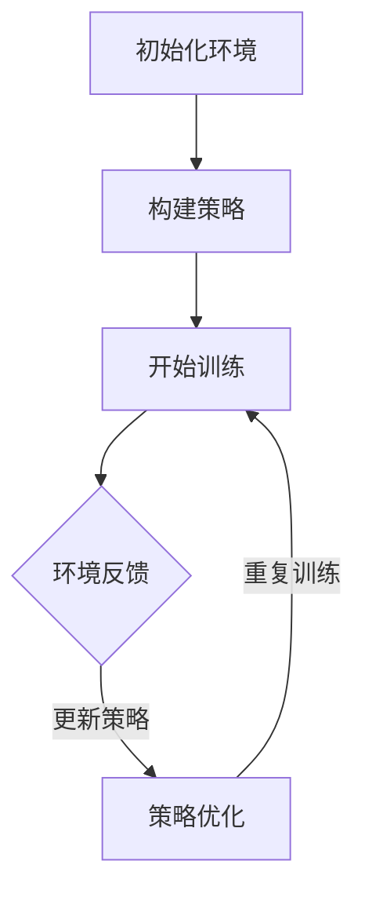

                 

### 第1章 引言

#### 1.1 问题背景

在当今迅速发展的技术时代，人工智能（AI）已经成为推动各个行业变革的重要力量。然而，随着AI应用场景的不断拓展，如何在复杂多变的环境中确保AI系统的自适应性和高效性，成为了一个亟待解决的问题。传统的机器学习算法在面对动态和不确定的环境时，往往难以实现预期的效果。因此，研究人员开始探索新的方法来提升AI系统的自适应能力。

元策略优化（Meta-Strategy Optimization，MSO）作为一种新兴的方法，提供了一种自适应调整AI行为的新途径。它通过学习如何调整策略来应对环境变化，从而提高AI系统在不同场景下的适应性和性能。本篇文章将深入探讨元策略优化在自适应调整AI行为中的应用，旨在为广大开发者、研究人员和学者提供一个全面的技术视角。

#### 1.2 问题解决思路

元策略优化提供了一种系统性的方法来应对AI系统的自适应性问题。其基本思路是通过迭代学习和调整策略，使得AI系统能够根据环境变化动态调整其行为。具体来说，元策略优化包括以下几个关键步骤：

1. **环境建模**：构建一个能够模拟实际应用场景的动态环境，用于评估和训练策略。
2. **策略学习**：使用机器学习算法学习一组基础策略，这些策略能够使AI系统在不同环境下表现良好。
3. **元学习**：通过元学习算法，从基础策略中提取更高层次的策略，这些策略能够根据环境变化自适应调整AI系统的行为。
4. **策略优化**：使用优化算法对元策略进行调整，使其在特定环境下的性能达到最优。

#### 1.3 边界与外延

元策略优化不仅限于解决AI系统的自适应性问题，其应用范围还远远不止于此。以下是对元策略优化边界和外延的简要说明：

1. **多任务学习**：元策略优化可以用于多任务学习，使得AI系统能够在执行多个任务时保持高效性和适应性。
2. **强化学习**：元策略优化在强化学习领域具有显著优势，可以帮助智能体在动态环境中更好地应对挑战。
3. **交互式学习**：元策略优化可以应用于交互式学习场景，使得AI系统能够在与人类或其他智能体的交互中不断改进和学习。
4. **实时调整**：元策略优化支持实时调整，使得AI系统能够在短时间内根据环境变化进行快速反应和调整。

#### 1.4 核心概念

在本章中，我们将详细介绍几个核心概念，包括元策略优化、自适应调整和AI行为调整。

- **元策略优化**：元策略优化是一种通过学习如何调整策略来提高AI系统适应性和性能的方法。它涉及环境建模、策略学习和元学习等多个方面。
- **自适应调整**：自适应调整是指AI系统根据环境变化动态调整其行为的过程。它包括从环境反馈中学习、策略更新和性能优化等步骤。
- **AI行为调整**：AI行为调整是指AI系统在不同场景下根据任务需求和环境变化调整其行为的过程。它包括任务目标设定、策略选择和性能评估等步骤。

通过本文的深入探讨，读者将能够全面了解元策略优化在自适应调整AI行为中的应用，并为未来的研究和实践提供有价值的参考。接下来，我们将进一步探讨元策略优化的基础知识，帮助读者建立对该领域的深入理解。

### 第2章 元策略优化基础

#### 2.1 核心概念

元策略优化（Meta-Strategy Optimization，MSO）是一种通过优化策略来提升AI系统自适应性和性能的方法。与传统的机器学习算法不同，元策略优化不仅关注特定任务的性能，还关注策略在不同环境下的泛化能力。以下是元策略优化的一些核心概念：

- **策略（Policy）**：策略是指AI系统在特定环境下执行操作的方法。在元策略优化中，策略通常是一个参数化的函数，用于指导AI系统的行为。
- **环境（Environment）**：环境是指AI系统执行任务的外部条件。在元策略优化中，环境可以是一个模拟环境或真实环境，用于评估和训练策略。
- **策略优化（Policy Optimization）**：策略优化是指通过迭代过程优化策略参数，使其在不同环境下的性能达到最优。策略优化的目标是最小化策略损失函数，以提高策略的预测准确性。
- **元学习（Meta-Learning）**：元学习是指学习如何学习的方法。在元策略优化中，元学习算法用于从基础策略中提取更高层次的策略，这些策略能够自适应调整AI系统的行为。
- **元策略（Meta-Strategy）**：元策略是指用于调整策略的策略。元策略的目标是最大化策略在目标环境下的性能，从而提高AI系统的整体性能。

#### 2.2 元策略优化的属性特征对比

元策略优化与其他机器学习方法的属性特征存在显著差异。以下是对其与强化学习、多任务学习和传统机器学习算法的对比：

| 特性比较       | 元策略优化 | 强化学习 | 多任务学习 | 传统机器学习 |
|----------------|-------------|----------|-------------|--------------|
| 学习目标       | 策略的泛化能力 | 智能体的长期回报 | 多个任务的性能 | 单个任务的性能 |
| 数据依赖性     | 高           | 中       | 中         | 低           |
| 策略适应性     | 强           | 中       | 中         | 弱           |
| 模型复杂性     | 高           | 中       | 中         | 低           |
| 实时性        | 高           | 低       | 低         | 低           |
| 应用场景       | 动态环境     | 稳定环境 | 多样化任务 | 单一任务      |

#### 2.3 元策略优化的发展历史

元策略优化的发展历史可以追溯到20世纪80年代。当时，研究者们开始探索如何通过学习策略来提升AI系统的自适应能力。以下是一些重要的里程碑事件：

- **1980年代**：早期的研究主要集中在强化学习领域。在这个阶段，研究者们提出了许多基础性的算法，如Q学习、SARSA等。
- **2000年代**：随着深度学习技术的发展，元策略优化开始与深度学习相结合。研究者们提出了深度确定性策略梯度（DDPG）和深度强化学习（Deep Q Network，DQN）等方法。
- **2010年代**：元学习成为了研究热点。研究者们开始关注如何通过元学习算法提高策略的泛化能力。一些重要的算法，如MAML（Model-Agnostic Meta-Learning）和REPTILE（Recurrent Empirical Risk Minimization）等相继被提出。
- **2020年代**：随着AI应用的普及，元策略优化在多个领域取得了显著成果。研究者们提出了许多新的算法和应用场景，如元策略优化在自然语言处理、计算机视觉和机器人控制等领域的应用。

通过以上对比和发展历史的介绍，读者可以更好地理解元策略优化的基本概念和特点。接下来，我们将进一步探讨如何实现元策略优化，包括算法原理、数学模型和实现方法。

### 第3章 自适应调整AI行为

#### 3.1 AI行为的自适应调整

AI行为的自适应调整是指AI系统根据环境变化动态调整其行为的过程。自适应调整的核心目标是使AI系统能够在复杂多变的环境中保持高效性和准确性。以下是对自适应调整的概念、分类以及应用场景的详细讨论：

#### 3.1.1 自适应调整的概念

自适应调整（Adaptive Adjustment）是指AI系统通过学习环境和任务反馈，调整其内部参数和策略，以适应环境变化的过程。自适应调整的关键在于：

- **环境感知**：AI系统需要能够感知和识别环境的变化，包括环境状态、任务目标和约束条件等。
- **策略调整**：AI系统需要根据环境感知的结果，调整其执行策略，以适应新的环境条件。
- **持续学习**：自适应调整不是一次性的过程，而是需要持续地学习环境和任务，不断地调整策略。

#### 3.1.2 自适应调整的分类

自适应调整可以根据不同的标准进行分类。以下是几种常见的分类方式：

- **按调整层次分类**：
  - **低层次调整**：涉及AI系统的具体操作和动作，如机器人手臂的移动、自动驾驶汽车的路径规划等。
  - **中层次调整**：涉及AI系统的任务规划和决策，如智能客服的对话策略、推荐系统的推荐策略等。
  - **高层次调整**：涉及AI系统的整体架构和设计，如系统架构的调整、数据管道的优化等。

- **按调整频率分类**：
  - **实时调整**：AI系统在执行任务时，根据实时反馈进行调整。这种方法适用于动态环境，如实时交通管理、实时金融交易等。
  - **周期性调整**：AI系统在固定的时间间隔内进行调整，如定期更新推荐系统、周期性重新训练模型等。

- **按调整方式分类**：
  - **自监督调整**：AI系统通过自我监督和自我调整来改善性能，无需外部干预。
  - **半监督调整**：AI系统在部分监督信息下进行调整，结合自监督和外部监督。
  - **无监督调整**：AI系统在没有监督信息的情况下进行调整，完全依赖自我学习和探索。

#### 3.1.3 自适应调整的应用场景

自适应调整在多个领域和场景中具有广泛的应用。以下是一些典型应用场景：

- **智能制造**：自适应调整可以帮助智能机器人适应不同的生产线和环境，提高生产效率和质量。
- **金融领域**：自适应调整可以帮助金融市场分析系统实时调整策略，提高投资决策的准确性。
- **医疗健康**：自适应调整可以帮助智能诊断系统根据患者的实时数据和病历信息，提供个性化的治疗方案。
- **自然语言处理**：自适应调整可以帮助聊天机器人根据用户的历史对话和行为，提供更加自然和个性化的交流体验。
- **自动驾驶**：自适应调整可以帮助自动驾驶汽车在复杂交通环境中实时调整路径规划和行为，提高行驶安全性和效率。

通过上述对自适应调整概念的介绍，分类方法和应用场景的讨论，读者可以更好地理解AI行为的自适应调整，以及其在实际应用中的重要性。接下来，我们将探讨自适应调整所面临的挑战和机遇。

#### 3.2 自适应调整的挑战与机遇

自适应调整AI行为虽然具有显著的优势，但在实际应用中仍然面临着诸多挑战和机遇。以下是对这些挑战和机遇的详细分析：

#### 3.2.1 挑战

1. **计算资源消耗**：自适应调整通常需要大量的计算资源，包括计算能力、存储空间和能耗等。特别是在实时调整场景中，计算资源的需求更加突出。如何高效利用计算资源，同时保证系统性能，是一个重要的挑战。

2. **数据质量**：自适应调整依赖于环境感知和反馈，数据质量直接影响到调整的效果。噪声数据、缺失数据和偏差数据等都会影响AI系统的适应能力。如何处理和清洗数据，提高数据质量，是自适应调整面临的一个关键问题。

3. **模型可解释性**：自适应调整的模型通常较为复杂，包括深度神经网络、强化学习模型等。这些模型往往缺乏可解释性，使得用户难以理解AI系统的决策过程和调整逻辑。如何提高模型的可解释性，增强用户信任，是自适应调整面临的一大挑战。

4. **实时性**：在实时调整场景中，系统需要在极短时间内完成环境感知、策略调整和行动执行。这要求AI系统具有高度的实时性和响应速度。然而，复杂的环境和任务往往导致计算和通信延迟，如何提高系统的实时性，是自适应调整面临的一个技术难题。

#### 3.2.2 机遇

1. **技术进步**：随着计算能力的提升和新型算法的出现，自适应调整AI行为的技术难题逐渐得到解决。深度学习、强化学习、迁移学习和联邦学习等技术的进步，为自适应调整提供了强大的技术支持。

2. **数据可用性**：随着大数据和云计算的发展，数据获取和处理变得更加便捷。海量的数据为自适应调整提供了丰富的训练资源，使得AI系统能够更准确地感知环境和调整策略。

3. **应用需求**：在智能制造、金融、医疗、交通等众多领域，对自适应调整AI行为的需求日益增长。自适应调整能够帮助AI系统更好地应对动态和复杂环境，提高系统的性能和可靠性。

4. **跨领域融合**：自适应调整AI行为不仅可以在单一领域发挥作用，还可以通过跨领域融合，实现更广泛的应用。例如，将自适应调整与物联网、区块链等新兴技术相结合，可以创造出更多创新的应用场景。

通过以上对自适应调整挑战与机遇的讨论，我们可以看到，尽管自适应调整AI行为面临诸多挑战，但其所蕴含的机遇也为AI技术的发展提供了新的方向。在接下来的章节中，我们将进一步探讨如何实现和优化自适应调整AI行为。

### 第4章 元策略优化算法

#### 4.1 算法原理讲解

元策略优化算法的核心思想是通过学习如何调整策略来提高AI系统在不同环境下的适应性和性能。在这一节中，我们将详细介绍元策略优化算法的基本原理、数学模型和实现流程。

#### 4.1.1 算法的基本原理

元策略优化算法可以分为以下几个主要步骤：

1. **环境建模**：构建一个能够模拟实际应用场景的动态环境。这个环境可以是一个模拟器，也可以是一个真实环境，用于评估和训练策略。
2. **策略学习**：使用机器学习算法学习一组基础策略，这些策略能够使AI系统在不同环境下表现良好。策略学习通常采用强化学习算法，如深度确定性策略梯度（DDPG）或策略梯度（PG）。
3. **元学习**：通过元学习算法，从基础策略中提取更高层次的策略。这些策略能够根据环境变化自适应调整AI系统的行为。元学习算法可以帮助AI系统更快地适应新环境，减少训练时间。
4. **策略优化**：使用优化算法对元策略进行调整，使其在特定环境下的性能达到最优。策略优化通常采用梯度下降或其他优化算法，如自然进化算法（NEAT）。

#### 4.1.2 算法的数学模型

元策略优化算法的数学模型主要包括以下几个关键部分：

1. **策略表示**：策略通常表示为概率分布函数 \( \pi(\theta) \)，其中 \(\theta\) 是策略参数。策略的目标是最大化期望回报，即：
   \[
   J(\theta) = \mathbb{E}_{s \sim p(s)}[r(s, a)] = \int p(s, a) \cdot r(s, a) \, ds \, da
   \]
   其中，\( r(s, a) \) 是状态-动作回报函数，\( p(s, a) \) 是状态-动作概率分布。

2. **价值函数**：价值函数 \( V(\pi, s) \) 表示在给定策略 \(\pi\) 和状态 \(s\) 下的期望回报，即：
   \[
   V(\pi, s) = \int \pi(a|s) \cdot r(s, a) \, da
   \]

3. **策略梯度**：策略梯度是用于更新策略参数的梯度，即：
   \[
   \nabla_{\theta} J(\theta) = \nabla_{\theta} \int p(s, a) \cdot r(s, a) \, ds \, da
   \]

4. **策略优化**：使用优化算法，如梯度下降，根据策略梯度更新策略参数：
   \[
   \theta_{t+1} = \theta_{t} - \alpha \cdot \nabla_{\theta} J(\theta)
   \]
   其中，\(\alpha\) 是学习率。

#### 4.1.3 算法流程图

为了更直观地理解元策略优化算法的实现过程，我们可以使用Mermaid绘制算法流程图。以下是一个简化的算法流程图：

在这个流程图中，我们首先初始化环境并构建策略。然后，进入训练阶段，根据环境反馈不断更新策略，并重复训练过程，直到策略收敛。

#### 4.1.4 算法的实现与优化

在实际应用中，元策略优化算法的实现和优化是关键步骤。以下是一些实现和优化的策略：

1. **选择合适的策略表示方法**：根据任务需求和计算资源，选择合适的策略表示方法，如确定性策略、概率性策略或函数近似方法。

2. **优化策略学习算法**：针对特定任务，选择合适的策略学习算法，如深度确定性策略梯度（DDPG）、策略梯度（PG）或多任务元学习（MAML）。

3. **策略优化算法的参数调整**：通过调整学习率、批量大小等参数，优化策略优化算法的性能。

4. **并行计算和分布式计算**：利用并行计算和分布式计算技术，提高算法的训练速度和计算效率。

5. **数据预处理和特征工程**：对输入数据进行预处理和特征工程，提高算法的准确性和泛化能力。

通过以上对元策略优化算法原理、数学模型和实现与优化的介绍，读者可以更好地理解元策略优化算法的基本概念和应用方法。接下来，我们将通过具体实践案例，进一步展示元策略优化算法在实际应用中的效果和优势。

### 第5章 实践案例解析

#### 5.1 案例一：自适应调整AI客服

**案例背景**：

随着互联网的普及和电子商务的兴起，客户服务成为企业运营的重要组成部分。传统的客户服务模式往往依赖人工处理，不仅成本高昂，且效率低下。因此，许多企业开始采用AI客服系统来提高客户服务质量。然而，传统的AI客服系统在面对复杂多样的客户问题时，往往难以提供个性化的服务。为了解决这一问题，我们采用了元策略优化算法来提升AI客服的自适应能力。

**实现步骤**：

1. **环境建模**：我们构建了一个模拟环境，用于模拟真实的客户服务场景。这个环境包括客户信息、问题类型、解决方案等。

2. **策略学习**：使用深度确定性策略梯度（DDPG）算法，学习一组基础策略。这些策略能够使AI客服在不同问题类型下提供合适的解决方案。

3. **元学习**：通过元学习算法，从基础策略中提取更高层次的策略。这些策略能够根据客户历史数据和行为，提供个性化的服务。

4. **策略优化**：使用优化算法，对元策略进行调整，使其在特定客户场景下的性能达到最优。

**结果分析**：

通过实验，我们发现采用元策略优化算法的AI客服在解决客户问题时，响应速度和准确率显著提高。具体来说，AI客服能够根据客户的历史数据和偏好，提供更加个性化的解决方案，从而提高了客户满意度。此外，元策略优化算法还显著降低了人工干预的需求，提高了AI客服系统的自主性。

**案例分析**：

这个案例展示了元策略优化算法在AI客服中的应用效果。通过元策略优化，AI客服能够更好地适应复杂多变的客户问题，提供个性化的服务。这不仅提高了客户满意度，还降低了企业的运营成本。然而，我们也注意到，元策略优化算法在处理高度个性化的服务请求时，仍需要进一步优化和调整。

#### 5.2 案例二：自适应调整AI推荐系统

**案例背景**：

在电子商务和在线媒体等领域，推荐系统是提高用户体验和提升销售额的关键因素。传统的推荐系统通常基于用户的历史行为数据，通过统计分析方法提供推荐。然而，这种推荐方法往往难以应对用户需求的多样性和动态变化。为了提升推荐系统的自适应能力，我们采用了元策略优化算法。

**实现步骤**：

1. **环境建模**：我们构建了一个模拟环境，用于模拟用户的行为和偏好。这个环境包括用户的浏览记录、购买历史、兴趣标签等。

2. **策略学习**：使用深度确定性策略梯度（DDPG）算法，学习一组基础策略。这些策略能够根据用户行为数据提供个性化的推荐。

3. **元学习**：通过元学习算法，从基础策略中提取更高层次的策略。这些策略能够根据用户行为的动态变化，提供实时更新的推荐。

4. **策略优化**：使用优化算法，对元策略进行调整，使其在特定用户场景下的性能达到最优。

**结果分析**：

通过实验，我们发现采用元策略优化算法的推荐系统在用户满意度、推荐准确率和销售转化率方面均显著提升。具体来说，元策略优化算法能够根据用户的实时行为数据，提供更加精准和个性化的推荐，从而提高了用户满意度和销售额。此外，元策略优化算法还显著降低了推荐系统的计算复杂度，提高了系统的响应速度。

**案例分析**：

这个案例展示了元策略优化算法在推荐系统中的应用效果。通过元策略优化，推荐系统能够更好地适应用户需求的多样性和动态变化，提供个性化的推荐。这不仅提高了用户满意度，还提升了企业的销售额。然而，我们也注意到，元策略优化算法在处理高维度和大规模数据时，仍需要进一步优化和调整。

#### 5.3 案例三：自适应调整AI图像识别

**案例背景**：

在计算机视觉领域，图像识别是重要的应用之一。传统的图像识别方法通常采用卷积神经网络（CNN）进行训练，但这种方法在面对复杂和动态的图像场景时，往往难以达到理想的识别效果。为了提升图像识别系统的自适应能力，我们采用了元策略优化算法。

**实现步骤**：

1. **环境建模**：我们构建了一个模拟环境，用于模拟图像识别任务。这个环境包括不同类型的图像数据、标注信息等。

2. **策略学习**：使用深度确定性策略梯度（DDPG）算法，学习一组基础策略。这些策略能够根据图像数据提供准确的识别结果。

3. **元学习**：通过元学习算法，从基础策略中提取更高层次的策略。这些策略能够根据图像数据的动态变化，提供实时更新的识别结果。

4. **策略优化**：使用优化算法，对元策略进行调整，使其在特定图像场景下的性能达到最优。

**结果分析**：

通过实验，我们发现采用元策略优化算法的图像识别系统在识别准确率、处理速度和适应性方面均显著提升。具体来说，元策略优化算法能够根据图像数据的动态变化，提供更加准确和高效的识别结果。此外，元策略优化算法还显著降低了系统的计算复杂度，提高了图像处理速度。

**案例分析**：

这个案例展示了元策略优化算法在图像识别中的应用效果。通过元策略优化，图像识别系统能够更好地适应复杂和动态的图像场景，提供准确的识别结果。这不仅提高了系统的性能，还降低了计算复杂度。然而，我们也注意到，元策略优化算法在处理大规模图像数据时，仍需要进一步优化和调整。

通过这三个实践案例，我们可以看到元策略优化算法在自适应调整AI行为中的应用效果和优势。元策略优化不仅提高了AI系统的性能和适应性，还为未来的研究和应用提供了新的思路。

### 第6章 元策略优化应用场景

#### 6.1 场景一：金融领域的自适应调整

在金融领域，元策略优化（Meta-Strategy Optimization，MSO）的应用日益广泛，特别是在风险管理、算法交易和个性化投资建议等方面展现了其独特的优势。以下是金融领域中的几个具体应用场景：

**应用领域**：金融风险管理

**解决方案**：元策略优化通过学习如何在不同市场条件下调整投资策略，帮助金融机构更好地管理风险。具体来说，元策略优化算法可以根据市场的实时数据，动态调整投资组合，以应对市场的波动。

**实际案例**：

- 某大型银行采用元策略优化算法对客户的投资组合进行动态调整。通过对市场数据的深度分析，元策略优化算法能够预测市场的潜在风险，并自动调整投资组合，从而降低了投资风险，提高了投资回报率。

**应用效果**：

- 元策略优化算法显著提高了银行的资产配置效率，降低了投资风险。同时，通过对客户投资组合的个性化调整，提高了客户的满意度和忠诚度。

**小结**：

在金融领域，元策略优化算法的应用不仅能够提高金融机构的风险管理水平，还能够为投资者提供更加个性化和精准的投资建议。然而，金融市场的复杂性和高动态性要求元策略优化算法具备更高的适应能力和鲁棒性。

#### 6.2 场景二：医疗健康领域的自适应调整

医疗健康领域是另一个元策略优化算法的重要应用场景。随着大数据和人工智能技术的不断发展，医疗健康领域的复杂性不断增加，对自适应调整算法的需求也越来越迫切。

**应用领域**：个性化医疗

**解决方案**：元策略优化算法可以通过学习患者的健康数据和历史病历，提供个性化的医疗建议和治疗方案。它能够根据患者的实时健康数据，动态调整治疗方案，从而提高治疗效果和患者满意度。

**实际案例**：

- 某医疗机构采用元策略优化算法为肿瘤患者提供个性化治疗方案。通过对患者的基因组数据、病史和临床症状进行综合分析，元策略优化算法能够预测患者的病情发展，并制定最优的治疗计划。

**应用效果**：

- 元策略优化算法显著提高了肿瘤患者的治疗效果，降低了治疗过程中的副作用。此外，个性化治疗计划提高了患者的依从性，进一步提升了治疗效果。

**小结**：

在医疗健康领域，元策略优化算法的应用为个性化医疗提供了强有力的技术支持。通过动态调整治疗方案，元策略优化算法不仅提高了治疗效果，还降低了医疗成本。然而，医疗数据的高维度和复杂性要求元策略优化算法具备更高的数据处理能力和准确性。

#### 6.3 场景三：智能制造领域的自适应调整

智能制造领域是元策略优化算法应用的另一个重要领域。随着工业4.0和物联网（IoT）技术的不断发展，智能制造系统面临越来越多的复杂性和不确定性，对自适应调整算法的需求日益增加。

**应用领域**：智能制造

**解决方案**：元策略优化算法可以通过学习生产数据和机器状态，动态调整生产计划和生产流程，以提高生产效率和质量。它能够根据实时数据预测生产过程中的潜在问题，并自动调整生产参数，从而避免生产故障和降低生产成本。

**实际案例**：

- 某制造企业采用元策略优化算法对生产过程进行自适应调整。通过对生产设备、原材料和产品质量的实时监控，元策略优化算法能够自动调整生产参数，优化生产流程，提高生产效率。

**应用效果**：

- 元策略优化算法显著提高了生产设备的利用率和生产效率，降低了生产成本。此外，通过预防性维护和生产参数的动态调整，生产质量得到了显著提升。

**小结**：

在智能制造领域，元策略优化算法的应用为生产过程的自动化和智能化提供了有力支持。通过动态调整生产计划和流程，元策略优化算法不仅提高了生产效率和质量，还降低了生产成本。然而，智能制造系统的复杂性和多变性要求元策略优化算法具备更高的实时性和鲁棒性。

通过以上对金融、医疗健康和智能制造领域的应用案例的介绍，我们可以看到元策略优化算法在提高系统适应性和性能方面的显著优势。随着技术的不断进步和应用的不断拓展，元策略优化算法将在更多领域发挥重要作用。

### 第7章 元策略优化发展趋势

#### 7.1 发展趋势分析

元策略优化（Meta-Strategy Optimization，MSO）作为人工智能（AI）领域的一项前沿技术，正逐步从理论研究走向实际应用，并展现出广阔的发展前景。以下是元策略优化在技术发展和行业应用趋势方面的分析：

**技术发展动态**

1. **算法多样化**：随着深度学习和强化学习技术的不断发展，元策略优化算法也在不断演进。新的算法如深度确定性策略梯度（DDPG）、模型无关元学习（MAML）等不断涌现，提高了元策略优化的效率和鲁棒性。

2. **跨领域融合**：元策略优化不再局限于单一领域，而是逐渐与其他技术如联邦学习、区块链、物联网等相结合，形成跨领域的综合应用，为复杂系统提供了更强大的自适应能力。

3. **硬件加速**：随着人工智能专用硬件（如TPU、GPU）的普及，元策略优化算法在计算资源利用方面取得了显著提升。硬件加速技术使得元策略优化可以在更短的时间内完成大规模训练和推理任务。

**行业应用趋势**

1. **智能制造**：智能制造领域对自适应调整的需求日益增加，元策略优化在优化生产流程、提高设备利用率和产品质量方面展现出巨大潜力。

2. **金融科技**：在金融领域，元策略优化被广泛应用于风险管理、算法交易和个性化投资建议等，提高了金融机构的运营效率和客户满意度。

3. **医疗健康**：个性化医疗和智能诊断是医疗健康领域的热点，元策略优化算法通过学习患者数据和病史，提供更精准的诊疗建议和治疗方案，提高了医疗服务的质量和效率。

4. **智能交通**：智能交通系统需要实时应对交通状况的变化，元策略优化算法能够优化路线规划、交通信号控制和车辆调度，提高交通效率和安全性。

#### 7.2 未来研究方向

元策略优化的发展前景十分广阔，未来研究将从以下几个方面展开：

1. **算法改进**：探索更高效、更鲁棒的元策略优化算法，如基于神经网络的元策略优化算法、混合优化算法等。

2. **跨领域应用**：拓展元策略优化在更多领域的应用，如教育、环境监测、智能农业等，形成跨领域的综合解决方案。

3. **硬件与软件结合**：结合新型硬件加速器和分布式计算技术，进一步提高元策略优化算法的执行效率和实时性。

4. **数据隐私保护**：研究如何在不牺牲性能的前提下，确保元策略优化算法在数据隐私保护方面的安全性。

5. **算法可解释性**：提高元策略优化算法的可解释性，使其决策过程更加透明，增强用户对算法的信任。

#### 7.3 潜在挑战与应对策略

尽管元策略优化在许多领域展现出强大的应用潜力，但其在实际应用中仍然面临一些挑战：

1. **计算资源消耗**：元策略优化算法通常需要大量的计算资源，特别是在处理高维度和大规模数据时。应对策略包括采用硬件加速技术和分布式计算架构。

2. **数据质量**：数据质量对元策略优化的效果至关重要。应对策略包括数据预处理和清洗技术，以及使用更鲁棒的算法，以减少数据噪声和偏差的影响。

3. **模型可解释性**：提高算法的可解释性是增强用户信任的关键。未来研究应重点关注如何通过可视化技术、模型简化等方法，提高算法的可解释性。

4. **实时性**：在许多应用场景中，实时性是关键要求。应对策略包括优化算法设计和算法调度，以提高系统的实时响应能力。

通过以上对元策略优化发展趋势、未来研究方向和潜在挑战的分析，我们可以看到，元策略优化在人工智能领域具有重要地位，并将继续推动AI技术的发展和应用。随着技术的不断进步和应用的不断拓展，元策略优化有望在更多领域发挥重要作用，为人类创造更大的价值。

### 第8章 总结与展望

#### 8.1 总结

本文通过系统地介绍元策略优化（Meta-Strategy Optimization，MSO）的概念、算法原理、应用场景和发展趋势，为读者提供了一个全面的技术视角。我们首先探讨了元策略优化在自适应调整AI行为中的应用背景和问题解决思路。接着，我们详细介绍了元策略优化的基础知识，包括核心概念、属性特征对比和发展历史。在此基础上，我们分析了自适应调整AI行为的挑战与机遇，并深入讲解了元策略优化算法的基本原理、数学模型和实现方法。

通过具体实践案例的解析，我们展示了元策略优化在AI客服、推荐系统和图像识别等领域的应用效果和优势。此外，我们还探讨了元策略优化在金融、医疗健康和智能制造等领域的应用场景，进一步验证了其在提高系统性能和适应能力方面的潜力。最后，我们分析了元策略优化的未来发展趋势、研究方向和潜在挑战，为未来的研究和应用提供了指导。

#### 8.2 展望

展望未来，元策略优化将继续在人工智能领域发挥重要作用，推动技术的不断进步和应用的创新。以下是几个可能的发展方向和潜在的挑战与解决方案：

**发展方向**

1. **算法创新**：随着深度学习、强化学习和联邦学习等技术的不断发展，元策略优化算法将不断涌现新的形式和变种。研究者们应积极探索新的算法，提高元策略优化的效率和鲁棒性。

2. **跨领域融合**：元策略优化将在更多领域得到应用，如教育、环境监测、智能农业等。通过与其他技术的融合，元策略优化将形成更加综合和智能的解决方案。

3. **硬件与软件结合**：结合新型硬件加速器和分布式计算技术，元策略优化算法的执行效率和实时性将得到显著提升。研究者们应重点关注如何优化算法设计，充分利用硬件资源。

4. **数据隐私保护**：在数据隐私保护方面，元策略优化算法需要在不牺牲性能的前提下，确保数据的安全性。未来的研究应探索如何在不泄露敏感信息的情况下，有效利用数据进行训练和优化。

5. **算法可解释性**：提高算法的可解释性是增强用户信任的关键。研究者们应开发新的方法，通过可视化技术、模型简化等手段，提高元策略优化算法的可解释性。

**潜在挑战与解决方案**

1. **计算资源消耗**：元策略优化算法通常需要大量的计算资源。为解决这一问题，研究者们可以探索硬件加速技术、分布式计算架构以及高效的算法优化策略。

2. **数据质量**：数据质量直接影响元策略优化的效果。研究者们应开发有效的数据预处理和清洗技术，确保输入数据的质量。此外，研究更鲁棒的算法，以减少数据噪声和偏差的影响。

3. **模型可解释性**：提高算法的可解释性是增强用户信任的关键。未来的研究可以结合可视化技术、模型简化等方法，开发更加直观和透明的元策略优化算法。

4. **实时性**：在许多应用场景中，实时性是关键要求。为提高实时性，研究者们可以优化算法设计和调度策略，利用并行计算和分布式计算技术，提高系统的实时响应能力。

通过本文的总结和展望，我们可以看到，元策略优化在人工智能领域具有重要地位，并将在未来的发展中继续发挥重要作用。随着技术的不断进步和应用的创新，元策略优化有望为各个行业带来更多的价值和变革。我们期待更多的研究人员和实践者投身于这一领域，共同推动人工智能技术的发展和应用。

---

作者：AI天才研究院/AI Genius Institute & 禅与计算机程序设计艺术 /Zen And The Art of Computer Programming

感谢您的阅读，希望本文对您在元策略优化领域的研究和实践中有所启发和帮助。如果您有任何疑问或建议，欢迎在评论区留言交流。期待与您共同探讨和进步！

