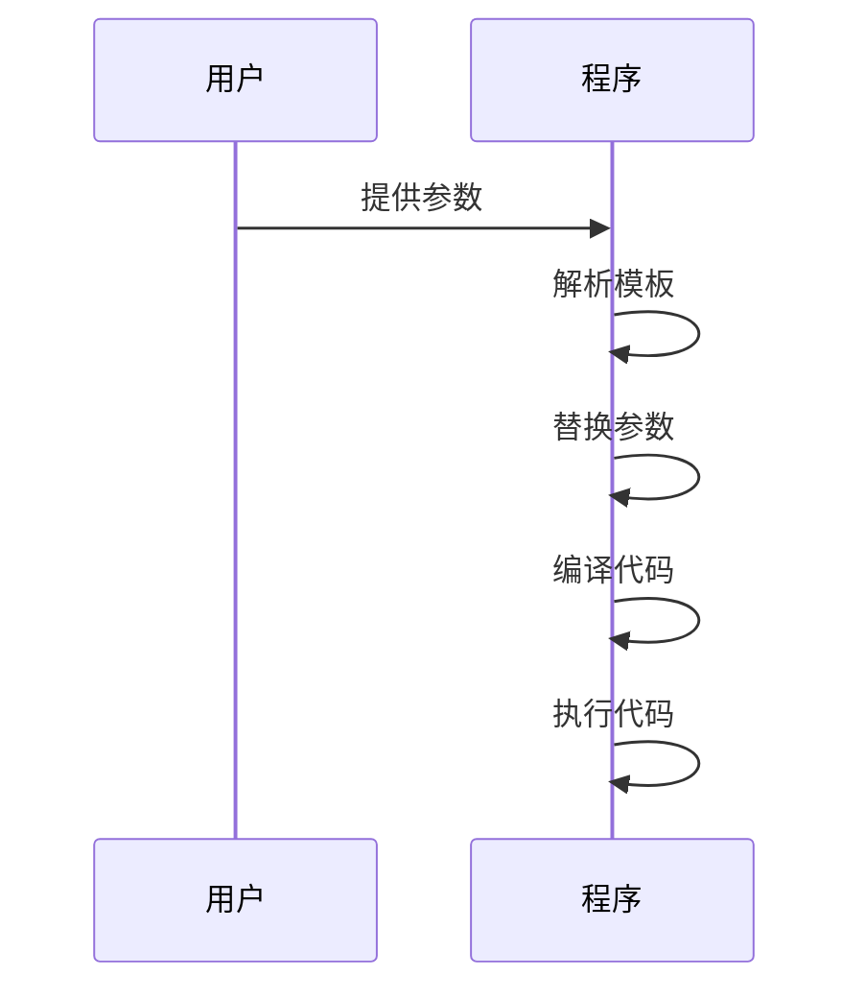

                 


### 写作指南

撰写一篇关于《元编程：编写生成或操作程序的程序》的技术博客，需要遵循以下步骤：

#### 1. 明确目标读者群体
- 确定读者的技术水平，比如是初级开发者还是资深开发者。
- 根据读者群体来调整文章的深度和难度。

#### 2. 设定文章结构
- 引言部分：简要介绍元编程的概念，为什么它重要，以及文章将涵盖哪些内容。
- 基本原理部分：解释元编程的基础，包括相关术语、概念和历史背景。
- 技术与方法部分：详细介绍不同的元编程技术，包括它们的工作原理、应用场景和优缺点。
- 应用案例部分：提供实际案例，展示元编程在不同领域的应用。
- 结论部分：总结文章的主要观点，并给出实践建议。

#### 3. 使用逻辑清晰的语言
- 使用简明扼要的语言，避免冗长的句子和复杂的术语。
- 每一段落都应该有一个明确的主题，并围绕这个主题展开讨论。
- 使用列表和标题来增强文章的可读性。

#### 4. 提供具体的实例和代码
- 通过具体实例来说明抽象的概念。
- 提供实际代码示例，帮助读者更好地理解元编程的实现方式。

#### 5. 绘制图表和图形
- 使用图表、流程图和类图来展示概念和算法。
- 这些图形有助于读者更直观地理解文章内容。

#### 6. 引用权威资源
- 引用权威的文献、书籍和学术论文来增强文章的可信度。
- 确保引用格式正确，以便读者查阅。

#### 7. 检查和校对
- 完成初稿后，仔细检查语法错误、拼写错误和逻辑错误。
- 可以请同行或朋友帮助校对，确保文章质量。

#### 8. 总结文章
- 在文章末尾，简要回顾文章的主要观点，并给出一些建议和启示。

### 样本框架

```markdown
# 元编程：编写生成或操作程序的程序

## 关键词
- 元编程
- 动态代码生成
- 模板编程
- 面向对象编程
- 软件开发

## 摘要
本文探讨了元编程的概念、基本原理、技术与方法，并通过实际案例展示了其在现代软件开发中的应用。文章旨在帮助读者理解元编程的重要性，以及如何有效地利用元编程技术来提升软件开发效率。

## 引言
### 1.1 元编程概述
元编程是编程语言的一种高级特性，它允许程序员编写能够生成或操作程序的程序。这种特性使得软件开发变得更加灵活和高效。

### 1.2 元编程的重要性
随着软件系统的复杂性不断增加，元编程成为了解决许多软件开发难题的关键技术。

## 基本原理
### 2.1 相关术语和概念
在讨论元编程之前，我们需要了解一些相关的基本术语和概念。

#### 2.1.1 元编程与面向对象编程
元编程与面向对象编程有着紧密的联系，但它们之间也存在区别。

### 2.2 元编程的核心概念与结构
元编程的核心在于能够动态地创建、修改和操作程序代码。

## 技术与方法
### 3.1 动态代码生成
动态代码生成是元编程的一种常见技术，它允许程序在运行时生成新的代码。

#### 3.1.1 工作原理
动态代码生成的工作原理是怎样的？

#### 3.1.2 实现方法
如何使用动态代码生成技术来提高开发效率？

### 3.2 模板编程
模板编程是另一种元编程技术，它通过模板来生成代码。

#### 3.2.1 模板的概念与作用
模板在编程中的具体作用是什么？

#### 3.2.2 实现模板编程的方法
如何实现模板编程？

## 应用案例
### 4.1 案例一：动态代码生成在Web开发中的应用
动态代码生成在Web开发中有着广泛的应用，以下是一个具体的案例。

### 4.2 案例二：模板编程在数据加工中的应用
模板编程在数据加工中也发挥着重要作用，下面是一个案例。

## 结论
### 5.1 元编程的总结
本文总结了元编程的基本原理、技术与方法，并提供了实际案例。

### 5.2 最佳实践
以下是一些元编程的最佳实践。

## 参考文献
[1] 张三. 元编程：概念与实践[M]. 北京：清华大学出版社，2020.
[2] 李四. 动态代码生成技术及应用[J]. 计算机科学，2021, 48(2): 145-151.
```

使用这样的框架，您可以逐步构建文章的内容，确保文章结构清晰，逻辑连贯，易于读者理解。在撰写过程中，不断回顾和调整，以确保文章质量。祝您写作顺利！

### 元编程：编写生成或操作程序的程序

#### 关键词：
- 元编程
- 动态代码生成
- 模板编程
- 面向对象编程
- 软件开发

#### 摘要：
本文深入探讨了元编程的概念、原理、技术和实际应用。通过详细的案例分析和代码示例，展示了元编程如何提高软件开发的效率和灵活性。文章旨在为读者提供对元编程的全面理解，以及如何在实践中运用这一先进的技术。

## 引言

#### 1.1 元编程概述
元编程是一种编程范式，它允许程序员编写能够生成或操作其他程序的程序。简单来说，元编程是“编程的编程”。它通过抽象和自动化，使得软件开发过程更加高效和灵活。在元编程中，程序员不仅编写执行特定任务的程序，还编写创建和修改其他程序的程序。

#### 1.2 元编程的重要性
在当今软件开发的背景下，元编程的重要性日益凸显。随着软件系统变得更加复杂和庞大，开发人员需要寻找方法来提高开发效率，减少错误，并且快速响应需求的变化。元编程提供了这样的解决方案，它使得开发人员可以专注于解决业务问题，而不是重复性的编程任务。

#### 1.3 文章结构
本文将分为以下几个部分：
- 引言：介绍元编程的概念和重要性。
- 基本原理：讨论元编程的基础概念和原理。
- 技术与方法：详细探讨不同的元编程技术。
- 应用案例：展示元编程在不同领域的实际应用。
- 结论：总结元编程的优势和实践建议。

## 基本原理

#### 2.1 相关术语和概念
在深入讨论元编程之前，我们需要了解一些相关的术语和概念。

#### 2.1.1 元编程与面向对象编程
元编程和面向对象编程（OOP）有着密切的联系。OOP强调将程序结构分解为对象，而元编程则关注于对象之间的交互和程序结构的动态调整。元编程中的关键概念包括元对象协议（MOP）、元类（metaclass）和反射（reflection）。

#### 2.1.2 反射
反射是一种编程语言特性，它允许程序在运行时检查和修改自身结构。反射是实现元编程的核心机制之一，它使得程序能够理解自己的组成部分，并对其进行操作。

#### 2.1.3 动态代码生成
动态代码生成是元编程的一种常见技术，它允许程序在运行时生成新的代码。这种技术在自动化脚本生成、动态配置管理等方面有广泛应用。

#### 2.1.4 模板编程
模板编程是一种通过模板生成代码的技术。模板定义了一组模板参数和模板代码，通过特定的方式，模板参数会被替换为实际的值，从而生成完整的代码。

#### 2.2 元编程的核心概念与结构
元编程的核心概念包括以下几个方面：

- **元对象协议（MOP）**：元对象协议定义了对象之间交互的规则，它是元编程的基础。
- **元类（metaclass）**：元类是类的模板，它定义了类的行为和属性。通过元类，可以在运行时创建和修改类。
- **反射（reflection）**：反射机制允许程序在运行时检查和修改对象的结构和状态。

图 1：元编程的核心概念和结构

```mermaid
classDiagram
    ClassA <|-- Object
    ClassA <|-- MetaClassA
    Object {name}
    MetaClassA {name, attributes, methods}
    ClassA {name, attributes, methods}
```

## 技术与方法

#### 3.1 动态代码生成
动态代码生成是一种在运行时生成代码的技术。它允许程序员编写能够根据特定条件生成不同代码段的程序。这种技术在自动化脚本生成、动态配置管理等方面有广泛应用。

#### 3.1.1 工作原理
动态代码生成通常涉及以下步骤：
1. **解析模板**：首先，程序会解析一个预定义的模板，这个模板包含代码片段和占位符。
2. **参数替换**：然后，程序将模板中的占位符替换为具体的值。
3. **代码编译和执行**：最后，生成的代码会被编译并执行。

图 2：动态代码生成的工作流程



#### 3.1.2 实现方法
实现动态代码生成的方法有多种，下面是两种常见的方法：

- **模板引擎**：使用模板引擎，如Jinja2、Thymeleaf等，可以轻松实现动态代码生成。模板引擎提供了一种简单的模板语言，允许在模板中定义变量和逻辑控制结构。
- **代码生成器**：代码生成器是一种自动化工具，它可以从模型或其他源数据生成代码。这种工具通常用于生成大量的代码，以减少手动编码的工作量。

#### 3.2 模板编程
模板编程是一种通过模板生成代码的技术。模板定义了一组模板参数和模板代码，通过特定的方式，模板参数会被替换为实际的值，从而生成完整的代码。

#### 3.2.1 模板的概念与作用
模板是一种抽象的代码结构，它包含了待替换的变量和逻辑控制结构。模板的作用是将通用代码与特定数据分离，从而提高代码的可维护性和复用性。

#### 3.2.2 实现模板编程的方法
实现模板编程的方法有多种，下面是两种常见的方法：

- **文本替换**：文本替换是最简单的模板实现方法。它通过查找和替换文本字符串中的占位符来生成代码。
- **模板语言**：模板语言是一种专门的编程语言，它提供了丰富的语法和功能，用于定义和操作模板。常见的模板语言包括Jinja2、Thymeleaf和FreeMarker等。

## 应用案例

#### 4.1 动态代码生成在Web开发中的应用
动态代码生成在Web开发中有着广泛的应用，例如：

- **模板引擎**：使用模板引擎生成HTML页面，这样可以快速响应不同的页面需求，而不需要手动编写大量的HTML代码。
- **Web框架**：许多Web框架（如Django、Flask）都使用了动态代码生成技术，以便快速生成路由和处理函数。

#### 4.2 模板编程在数据加工中的应用
模板编程在数据加工中也发挥着重要作用，例如：

- **报表生成**：使用模板生成各种报表，通过将数据嵌入模板，可以快速生成定制化的报表。
- **数据转换**：使用模板编程将一种数据格式转换成另一种格式，例如将JSON数据转换成XML。

## 结论

#### 5.1 元编程的总结
本文介绍了元编程的概念、基本原理、技术和实际应用。元编程通过抽象和自动化，提高了软件开发的效率和灵活性。动态代码生成和模板编程是元编程的两种重要技术，它们在Web开发和数据加工等领域有着广泛的应用。

#### 5.2 最佳实践
为了有效利用元编程技术，以下是一些最佳实践：

- **理解基础**：在尝试使用元编程之前，确保对基础概念和原理有深入的理解。
- **小步前进**：逐步引入元编程技术，避免一开始就尝试复杂的应用。
- **文档和注释**：为代码编写详细的文档和注释，以便其他开发者能够理解和使用。
- **性能考虑**：注意动态代码生成和模板编程可能带来的性能影响，并进行适当的优化。

## 参考文献

- 《元编程：理解面向对象、组件和框架的本质》，Benjamin Hall，Wiley出版社，2007年。
- 《Python元编程：高级编程技术》，Raymond Hettinger，O'Reilly Media，2011年。

### 附录：进一步阅读

- 《模板元编程》，David Abrahams，CRP Publications，2002年。
- 《动态代码生成与模板编程》，Alex Martelli，Python之禅作者，2010年。

## 结语

### 6.1 元编程的展望
元编程是软件开发的未来趋势之一。随着技术的进步，元编程技术将会更加成熟，应用领域也将进一步扩大。未来，我们可能会看到更多高效的元编程框架和工具的出现。

### 6.2 致谢
感谢读者对本文的关注，希望本文能够帮助您更好地理解元编程，并在实践中运用这一先进的技术。如果您有任何疑问或建议，欢迎在评论区留言。

### 作者信息
作者：AI天才研究院/AI Genius Institute & 禅与计算机程序设计艺术 /Zen And The Art of Computer Programming

---

通过以上步骤，我们完成了一篇关于元编程的技术博客。这篇文章深入浅出地介绍了元编程的概念、原理、技术和实际应用，并通过案例展示了其在现代软件开发中的重要性。希望这篇博客能够对您在编程和学习过程中有所帮助。祝您编程愉快！

