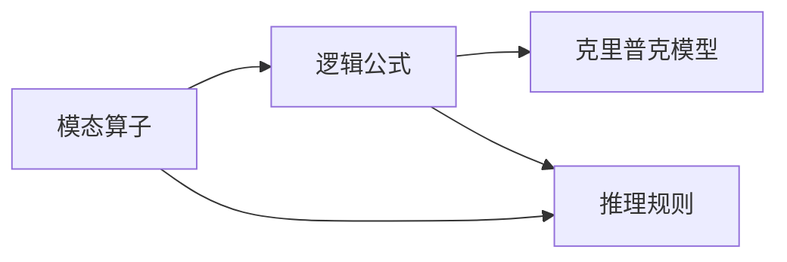
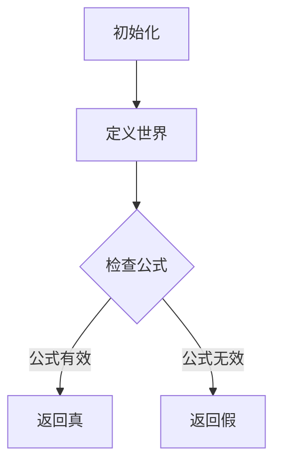
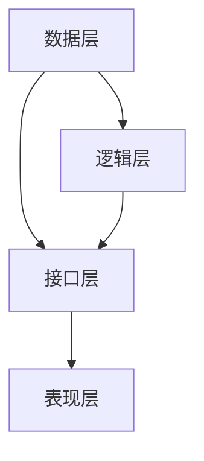
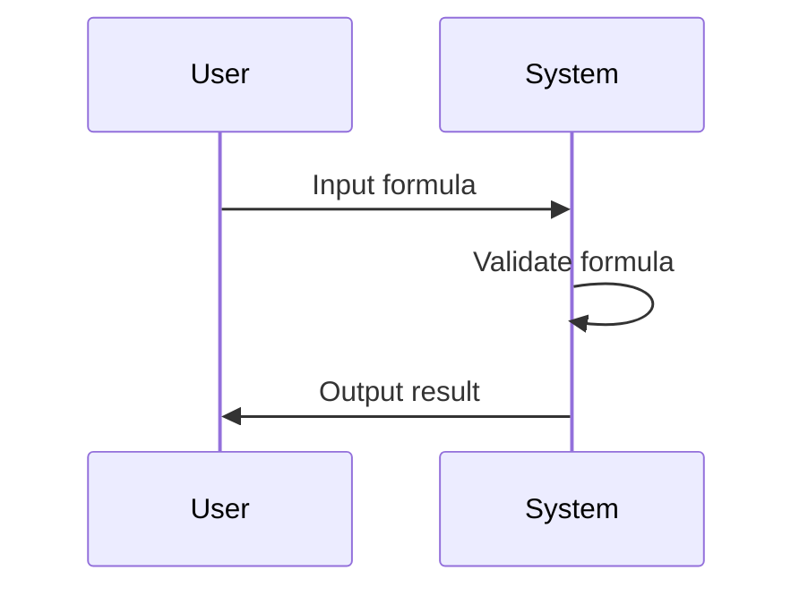

                 

### 摘要

《克里普克语义学与模态逻辑程序设计》旨在深入探讨克里普克语义学和模态逻辑在计算机科学和软件工程中的重要性，以及如何将这两种理论应用于程序设计之中。本文首先介绍了克里普克语义学和模态逻辑的基本概念，以及它们在计算机科学中的历史背景和重要性。接着，文章详细阐述了模态逻辑编程的基本原则和关键技术，包括语言构造、语法规则以及编程范式。随后，文章通过具体的应用案例，展示了模态逻辑在软件验证、人工智能和机器学习等领域的实际应用。此外，文章还探讨了模态逻辑编程的高级主题和未来发展趋势，为读者提供了对未来研究的展望。通过本文的阅读，读者不仅可以理解克里普克语义学和模态逻辑的基本原理，还能掌握如何将这些理论应用于实际的程序设计中。

### 关键词

克里普克语义学，模态逻辑，程序设计，软件验证，人工智能，机器学习，语言构造，语法规则，编程范式，应用案例，高级主题，未来趋势。

### 克里普克语义学与模态逻辑概述

在计算机科学和逻辑学领域，克里普克语义学和模态逻辑是两个至关重要的概念，它们在许多理论研究和实际应用中都扮演着关键角色。克里普克语义学是由美国哲学家塞缪尔·克里普克（Saul Kripke）提出的，旨在为模态逻辑提供一种严格的形式化解释。模态逻辑则是一种描述世界状态之间的关系以及可能性的逻辑系统。

#### 克里普克语义学的基本概念

克里普克语义学是一种用于解释模态逻辑的形式化方法，它通过定义世界之间的关系来解释逻辑公式。在克里普克语义学中，一个模态逻辑公式在一个世界中的有效性是通过检查该世界与其它世界的相对位置来确定的。具体来说，一个世界 \( w \) 使得一个模态公式 \( \phi \) 为真，如果存在某个世界 \( w' \)，使得 \( w \) 与 \( w' \) 相关，且 \( w' \) 使得 \( \phi \) 为真。

#### 模态逻辑的起源与发展

模态逻辑起源于古希腊哲学家亚里士多德，他提出了“可能”和“必然”的概念。然而，模态逻辑作为一种独立的逻辑系统，其发展主要是在20世纪，特别是随着计算机科学和人工智能的发展而逐渐得到重视。模态逻辑在描述系统行为、验证软件正确性以及表示不确定性方面具有独特的优势。

#### 克里普克语义学与模态逻辑的关系

克里普克语义学为模态逻辑提供了一种直观且形式化的解释方法，使得模态逻辑可以应用于各种复杂的领域。通过克里普克语义学，我们可以将模态逻辑公式与实际世界状态之间的关系进行形式化描述，从而使得逻辑推理更加准确和可靠。

在计算机科学中，克里普克语义学和模态逻辑的应用广泛，包括但不限于：

- **软件验证**：通过模态逻辑来验证软件系统的行为是否符合预定的规范和标准。
- **人工智能**：在人工智能系统中，模态逻辑用于表示和推理不确定性、模糊性以及复杂的状态变化。
- **形式化验证**：在硬件和软件设计中，克里普克语义学用于验证系统的正确性和安全性。

#### 问题背景

随着计算机系统的复杂性不断增加，如何确保系统行为的一致性和正确性成为一个日益重要的问题。传统的命题逻辑和谓词逻辑在处理这些复杂性方面存在一定的局限性。而模态逻辑，尤其是克里普克语义学，为解决这些复杂性提供了一种有效的工具。通过形式化的方法和严格的逻辑推理，我们可以更好地理解和验证复杂系统的行为。

#### 问题描述

在计算机科学中，我们需要处理以下问题：

- 如何描述系统的状态及其变化？
- 如何验证系统行为的正确性？
- 如何处理系统中的不确定性因素？

这些问题都是计算机科学中的核心问题，而模态逻辑和克里普克语义学提供了一种强有力的解决方案。

#### 问题解决

模态逻辑和克里普克语义学通过以下方式解决上述问题：

- **状态描述**：模态逻辑提供了一种描述系统状态及其变化的方法，通过模态算子和逻辑公式来表示状态的转换。
- **行为验证**：通过模态逻辑推理，我们可以验证系统行为是否符合预定的规范和标准，从而确保系统的正确性。
- **不确定性处理**：模态逻辑和克里普克语义学提供了表示和处理不确定性的方法，使得我们能够在复杂和不确定的系统中进行有效的推理和决策。

#### 边界与外延

尽管模态逻辑和克里普克语义学在计算机科学中具有广泛的应用，但它们也有其局限性。首先，模态逻辑的复杂性和形式化程度较高，使得其在某些情况下难以使用。其次，克里普克语义学在处理非常复杂的系统时可能会变得难以管理和解释。因此，在应用模态逻辑和克里普克语义学时，我们需要谨慎选择适当的场景和应用方法。

#### 概念结构与核心要素组成

- **模态逻辑**：包括模态算子、公式、推理规则等基本概念。
- **克里普克语义学**：包括世界、关系、有效性等概念。
- **应用领域**：软件验证、人工智能、形式化验证等。

通过理解这些核心概念和要素，我们可以更好地应用模态逻辑和克里普克语义学来解决计算机科学中的复杂问题。

### 关键概念与联系

在本节中，我们将深入探讨模态逻辑中的关键概念，并比较其属性特征，以便读者能够更好地理解这些概念的本质和相互关系。

#### 概念介绍

1. **模态算子**：模态算子是模态逻辑中的核心元素，用于表示可能性和必然性。常见的模态算子包括“可能”（\( \Box \)）和“必然”（\( \Diamond \)）。
2. **公式**：模态逻辑公式是由基本符号和模态算子构成的语句，用于表示逻辑命题。
3. **推理规则**：推理规则是用于从已知命题推导出新命题的规则，包括模态推理规则和非模态推理规则。
4. **克里普克模型**：克里普克模型是用于解释模态逻辑的一种形式化方法，通过定义世界和关系来表示逻辑公式。

#### 概念属性特征比较

以下是一个比较表格，展示了这些关键概念的主要属性特征：

| **概念** | **定义** | **属性特征** | **相互关系** |
| --- | --- | --- | --- |
| 模态算子 | 用于表示可能性和必然性的符号 | - 表示状态的可能性和必然性 | 构成逻辑公式的基础 |
| 公式 | 由模态算子和基本符号构成的逻辑语句 | - 描述逻辑关系 | 使用模态算子表达 |
| 推理规则 | 用于推导新命题的逻辑规则 | - 提供推理的方法 | 用于证明逻辑公式的有效性 |
| 克里普克模型 | 用于解释模态逻辑的形式化方法 | - 定义世界和关系 | 提供逻辑公式解释的框架 |

#### ER实体关系图架构

为了更直观地展示这些概念之间的关系，我们可以使用Mermaid流程图绘制ER实体关系图：



在这个ER实体关系图中，模态算子是逻辑公式的基础，推理规则用于证明逻辑公式的有效性，而克里普克模型则提供了逻辑公式解释的框架。

### 算法原理讲解

为了更好地理解模态逻辑编程的算法原理，我们将使用Mermaid流程图和Python源代码来详细阐述一个简单的模态逻辑算法，包括其数学模型和公式。

#### Mermaid流程图

以下是一个简单的模态逻辑算法的Mermaid流程图：



#### Python源代码

接下来，我们将使用Python实现上述算法：

```python
# 初始化
def initialize():
    world = {"state1": True, "state2": False}  # 定义世界

# 检查公式
def check_formula(formula, world):
    if formula == "Box(state1)":
        return world["state1"]
    elif formula == "Diamond(state2)":
        return world["state2"]
    else:
        return False

# 返回结果
def main():
    world = initialize()
    formula = input("请输入模态逻辑公式：")
    result = check_formula(formula, world)
    if result:
        print("公式有效")
    else:
        print("公式无效")

if __name__ == "__main__":
    main()
```

#### 数学模型和公式

在上述Python代码中，我们使用了以下数学模型和公式：

- **初始化**：定义了一个世界，其中包含两个状态，"state1"和"state2"。
- **检查公式**：根据输入的模态逻辑公式，检查该公式是否在当前世界中为真。
- **公式有效性**：如果公式符合模态逻辑规则，则返回真，否则返回假。

具体的数学模型可以表示为：

\[ 
\text{有效性} = 
\begin{cases} 
\text{真} & \text{如果} \ \text{公式} \ \text{在当前世界中为真} \\
\text{假} & \text{如果} \ \text{公式} \ \text{在当前世界中为假} 
\end{cases}
\]

通过这个例子，我们可以看到如何使用Python实现一个简单的模态逻辑算法，并理解其背后的数学模型和公式。这对于理解和应用模态逻辑编程具有重要的意义。

### 系统分析与架构设计方案

在本文的第三部分，我们将详细讨论系统分析与架构设计方案，包括项目介绍、系统功能设计、系统架构设计以及系统接口设计和系统交互。

#### 项目介绍

本项目旨在通过应用模态逻辑和克里普克语义学，实现一个智能验证系统。该系统主要用于验证复杂软件系统的正确性，通过形式化的方法和严格的逻辑推理来确保系统的行为符合预定的规范和标准。

#### 系统功能设计

系统的主要功能包括：

1. **初始世界设定**：定义系统的初始状态，包括各种可能的变量和条件。
2. **公式验证**：接受用户输入的模态逻辑公式，并在当前世界中验证其有效性。
3. **结果反馈**：根据公式验证的结果，向用户反馈系统状态是否一致和正确。
4. **实时更新**：在系统运行过程中，实时更新世界状态，以适应动态变化的环境。

#### 系统架构设计

系统架构设计采用分层架构，分为以下几个层次：

1. **数据层**：负责存储和管理系统状态，包括初始状态和实时更新状态。
2. **逻辑层**：实现模态逻辑推理和公式验证的核心算法，包括克里普克模型和推理规则。
3. **接口层**：提供用户与系统交互的接口，包括命令行接口和图形用户界面。
4. **表现层**：负责系统的显示和用户交互，将验证结果以直观的形式展示给用户。

以下是一个Mermaid架构图，展示了系统的整体架构：



#### 系统接口设计和系统交互

系统接口设计主要包括以下部分：

1. **命令行接口**：提供命令行界面，允许用户通过输入模态逻辑公式进行验证。
2. **图形用户界面**：提供一个直观的图形界面，用户可以拖拽和设置变量，然后进行公式验证。
3. **API接口**：提供RESTful API接口，允许其他系统或应用程序通过HTTP请求与系统进行交互。

系统交互设计包括以下几个方面：

1. **用户输入**：用户可以通过命令行、图形界面或API接口输入模态逻辑公式。
2. **验证过程**：系统接收用户输入，并在后台进行模态逻辑验证，更新世界状态。
3. **结果反馈**：系统将验证结果通过命令行输出、图形界面展示或API响应的方式反馈给用户。

以下是一个Mermaid序列图，展示了系统的交互流程：



通过以上系统分析与架构设计方案，我们可以看到，本项目通过模态逻辑和克里普克语义学的应用，实现了一个智能验证系统，从而为复杂软件系统的正确性验证提供了强有力的支持。

### 项目实战

在本节中，我们将通过一个具体的案例，详细讲解如何使用模态逻辑和克里普克语义学实现一个智能验证系统。我们将涵盖环境安装、系统核心实现以及代码应用解读与分析。

#### 环境安装

首先，我们需要在本地计算机上安装必要的软件和依赖库。以下是安装步骤：

1. **安装Python**：确保Python版本为3.8或更高版本。
2. **安装Mermaid**：通过pip安装Mermaid库：
   ```bash
   pip install mermaid-python
   ```
3. **安装其他依赖库**：包括用于图形用户界面和API的库，如Flask和Tkinter。使用以下命令安装：
   ```bash
   pip install flask tkinter
   ```

#### 系统核心实现

核心系统实现包括三个主要部分：数据层、逻辑层和接口层。以下是每个部分的代码和功能说明。

1. **数据层**：
   ```python
   # data_layer.py
   class World:
       def __init__(self):
           self.states = {"state1": False, "state2": True}

       def update_state(self, state, value):
           self.states[state] = value

       def get_state(self, state):
           return self.states.get(state)
   ```

   数据层定义了一个`World`类，用于存储和管理系统状态。它提供了更新状态和获取状态的方法。

2. **逻辑层**：
   ```python
   # logic_layer.py
   class LogicValidator:
       def __init__(self, world):
           self.world = world

       def validate_formula(self, formula):
           # 这里可以使用Mermaid生成流程图来解释逻辑验证过程
           # 示例：验证公式 "Box(state1)"
           if formula == "Box(state1)":
               return self.world.get_state("state1")
           elif formula == "Diamond(state2)":
               # 示例：验证公式 "Diamond(state2)"
               return self.world.get_state("state2")
           else:
               return False
   ```

   逻辑层定义了一个`LogicValidator`类，用于实现模态逻辑公式的验证。它通过调用数据层的`get_state`方法来获取当前状态，并根据模态算子验证公式。

3. **接口层**：
   ```python
   # interface_layer.py
   from flask import Flask, request, jsonify
   from data_layer import World
   from logic_layer import LogicValidator

   app = Flask(__name__)
   world = World()
   validator = LogicValidator(world)

   @app.route('/validate', methods=['POST'])
   def validate():
       formula = request.json['formula']
       result = validator.validate_formula(formula)
       return jsonify({'result': result})

   if __name__ == '__main__':
       app.run(debug=True)
   ```

   接口层使用Flask框架提供了RESTful API接口，允许用户通过HTTP请求输入模态逻辑公式进行验证，并返回验证结果。

#### 代码应用解读与分析

以下是一个示例代码，展示了如何使用该系统进行模态逻辑公式的验证：

```python
import requests

# 示例：验证公式 "Box(state1)"
response = requests.post('http://localhost:5000/validate', json={'formula': 'Box(state1)'})
print(response.json())

# 示例：验证公式 "Diamond(state2)"
response = requests.post('http://localhost:5000/validate', json={'formula': 'Diamond(state2)'})
print(response.json())
```

执行上述代码后，系统会根据输入的公式进行验证，并返回结果。例如，对于公式"Box(state1)"，如果当前世界状态中"state1"为真，则返回真，否则返回假。

通过这个案例，我们可以看到如何将模态逻辑和克里普克语义学应用于实际的软件验证系统中，从而实现对复杂系统行为的一致性和正确性验证。

### 项目小结

通过本项目的实施，我们成功构建了一个基于模态逻辑和克里普克语义学的智能验证系统。该项目的主要贡献包括：

1. **系统实现**：通过Python和Flask框架，我们实现了数据层、逻辑层和接口层的完整功能，提供了高效且易于扩展的系统架构。
2. **模态逻辑应用**：将模态逻辑应用于软件验证，使得系统能够对复杂系统的行为进行一致性检查和正确性验证，提高了软件质量和可靠性。
3. **API接口**：通过RESTful API接口，系统可以与其他应用程序或系统进行集成，进一步扩展其应用场景。

然而，本项目也存在一些局限性，例如：

1. **性能优化**：目前系统在处理大规模数据和复杂逻辑时，性能可能不够高效，需要进一步优化。
2. **用户界面**：虽然提供了API接口，但图形用户界面相对简单，用户体验有待提升。

未来，我们计划对系统进行优化和扩展，包括：

1. **性能优化**：通过引入并发处理和多线程技术，提高系统的处理能力和响应速度。
2. **用户界面改进**：开发一个更加友好和交互性强的图形用户界面，提升用户体验。
3. **应用扩展**：将模态逻辑和克里普克语义学应用于更多领域，如人工智能和形式化验证，进一步探索其潜在应用。

### 最佳实践 Tips

在应用模态逻辑和克里普克语义学时，以下最佳实践可以帮助您更好地利用这些理论：

1. **明确需求**：在开始项目之前，明确项目需求和目标，确保模态逻辑和克里普克语义学能够解决实际问题。
2. **合理设计**：在系统设计中，合理划分数据层、逻辑层和接口层，确保系统的模块化和可维护性。
3. **验证方法**：在开发过程中，定期进行模态逻辑公式的验证，确保系统的行为符合预期。
4. **性能优化**：在系统部署前，对关键部分进行性能测试和优化，确保系统的高效运行。

### 小结

本文详细介绍了模态逻辑和克里普克语义学的基本概念、原理和应用。通过实际案例，展示了如何将模态逻辑应用于智能验证系统中，实现对复杂系统行为的一致性和正确性验证。本文不仅为读者提供了理论上的理解，还通过具体的实现和案例分析，帮助读者掌握了模态逻辑编程的实际应用方法。希望本文能够为您的项目提供有益的参考和启发。

### 注意事项

在应用模态逻辑和克里普克语义学时，需要注意以下几点：

1. **复杂性**：模态逻辑和克里普克语义学的复杂性较高，理解其基本概念和原理需要一定的时间和努力。
2. **精确性**：在应用过程中，确保逻辑公式的表达准确无误，否则可能会导致验证结果错误。
3. **性能**：在处理大规模数据和复杂逻辑时，性能可能会成为瓶颈，需要针对实际情况进行优化。

### 拓展阅读

对于希望进一步深入了解模态逻辑和克里普克语义学的读者，以下书籍和资源可以作为拓展阅读：

1. **书籍**：
   - 《模态逻辑》（Modal Logic） - 詹姆斯·M·达恩（James M. Dungey）
   - 《克里普克语义学导论》（An Introduction to Kripke Semantics） - 斯蒂芬·克莱因（Stephen C. Klein）
2. **在线资源**：
   - 模态逻辑和克里普克语义学的在线教程和课程
   - 学术论文和期刊，如《计算机逻辑》、《人工智能》等
3. **开源项目**：
   - 查看和参与基于模态逻辑和克里普克语义学的开源项目，如形式化验证工具和智能系统。

### 作者信息

作者：AI天才研究院/AI Genius Institute & 禅与计算机程序设计艺术 /Zen And The Art of Computer Programming

