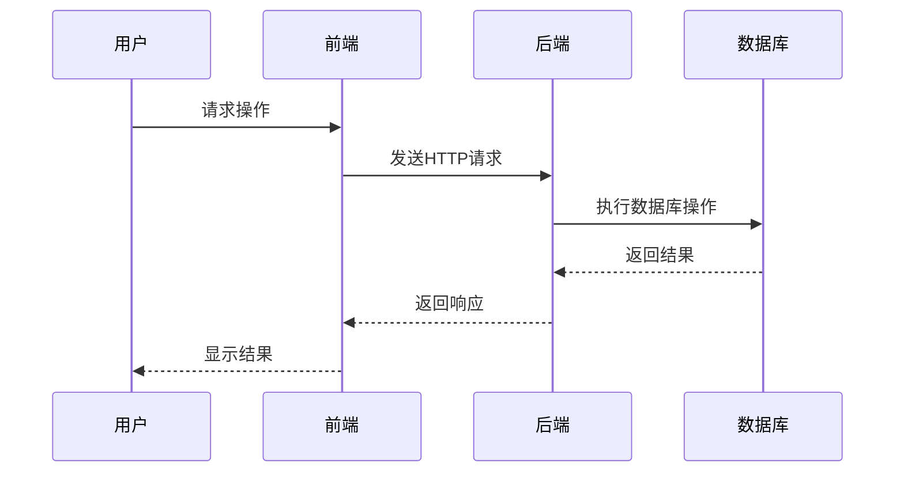

                 

### 全栈技能培养的重要性

#### 1.1 问题背景

在当今快速发展的技术领域中，全栈工程师成为了软件开发的核心角色。随着互联网的普及和软件需求的多样化，企业对全栈工程师的需求不断增加。然而，许多开发者仅仅专注于某一个领域，缺乏全方位的技能提升，这限制了他们在职场上的发展潜力。

全栈工程师需要具备前端、后端、数据库、运维等多个方面的技能。前端工程师负责用户界面的设计与实现，后端工程师负责服务器端的应用开发和数据处理，数据库工程师则负责数据存储和管理，运维工程师则负责系统的部署和维护。这种多元化的技能需求使得全栈工程师在开发过程中能够更加灵活地应对各种技术挑战，提高项目的开发效率和质量。

然而，培养全栈技能并非易事。许多开发者往往在某一领域有所专长，但在其他领域却缺乏系统的学习和实践。这种技能单一化的情况导致开发者无法全面理解项目的各个方面，从而难以在复杂项目中发挥最大的潜力。

因此，如何培养全栈技能，提升工程师的综合能力成为了关键问题。通过系统的学习和实践，开发者可以逐步掌握前端、后端、数据库、运维等各方面的技能，提高自己的综合素质，为成为P9级别的工程师奠定坚实基础。

#### 1.2 问题描述

全栈工程师需要具备前端、后端、数据库、运维等多个方面的技能。然而，大多数开发者难以在短时间内全面掌握这些技能。具体来说，问题表现为以下几个方面：

1. **技能分散，缺乏系统性**：许多开发者可能在某个领域有所专长，但其他领域的知识相对薄弱。这种技能分散的情况导致开发者无法全面理解项目的各个方面，从而难以在复杂项目中发挥最大的潜力。

2. **时间与精力有限**：全栈技能的培养需要大量的时间和精力。开发者需要在日常工作中不断学习新技术，提升自己的技能水平。然而，由于时间和精力的限制，开发者往往难以在短时间内全面掌握所有技能。

3. **学习资源不充分**：虽然互联网上有大量的学习资源，但很多资源质量参差不齐，难以保证学习效果。此外，开发者需要花费大量时间筛选和整理这些资源，这也增加了学习全栈技能的难度。

4. **缺乏实践经验**：全栈技能的培养不仅需要理论知识，更需要大量的实践经验。开发者需要在实际项目中不断尝试和总结，从而不断提升自己的技能水平。然而，缺乏实践经验往往导致开发者无法将理论知识应用到实际工作中。

5. **职业发展瓶颈**：随着技术的不断更新和升级，开发者需要不断学习和更新自己的技能。如果开发者只停留在某个领域的知识层面，难以跟上行业的发展，可能会导致职业发展瓶颈。

因此，如何解决这些问题，帮助开发者全面掌握全栈技能，成为了当前迫切需要解决的问题。

#### 1.3 问题解决

本书旨在通过系统的学习和实践，帮助读者全面掌握全栈技能，提升工程师的综合能力，为成为P9级别的工程师奠定坚实基础。具体来说，本书的解决方案包括以下几个方面：

1. **系统化学习路径**：本书将按照前端、后端、数据库、运维等不同领域的知识体系，设计一套系统化的学习路径。读者可以按照这个路径逐步学习，从而确保全面掌握各个领域的技能。

2. **理论与实践相结合**：本书不仅介绍理论知识，还结合了大量实际案例，帮助读者将所学知识应用到实际项目中。通过实践，读者可以更好地理解理论知识，提高实际操作能力。

3. **丰富的学习资源**：本书提供了一系列的学习资源，包括在线教程、开源项目、技术博客等，帮助读者在学习和实践中不断拓展知识面。

4. **社区互动与支持**：本书将建立一个读者社区，读者可以在社区中分享学习心得，交流技术问题，互相支持。通过社区互动，读者可以更好地学习全栈技能，提升自己的综合素质。

5. **持续更新与迭代**：随着技术的不断发展和更新，本书将定期进行内容更新和迭代，确保读者始终掌握最新的技术和方法。

通过以上解决方案，本书旨在帮助读者克服培养全栈技能的各种困难，实现全面技能提升，为职业发展奠定坚实基础。

#### 1.4 边界与外延

全栈技能的培养不仅限于技术层面，还包括项目管理、团队协作、创新能力等多方面。因此，全栈技能的培养是一个全面的职业成长过程。

1. **项目管理能力**：全栈工程师往往需要参与项目的整体规划和执行。具备项目管理能力，可以帮助工程师更好地理解项目需求，合理安排资源，确保项目按时完成。

2. **团队协作能力**：全栈工程师需要与前端、后端、数据库、运维等多个团队紧密合作。具备团队协作能力，可以确保项目顺利进行，提高团队整体效率。

3. **创新能力**：全栈工程师需要不断学习新技术和方法，创新思维可以帮助工程师更好地应对技术挑战，推动项目和技术的发展。

4. **软技能**：全栈工程师还需要具备良好的沟通能力、解决问题的能力、自我管理等软技能。这些软技能对于工程师的职业发展同样至关重要。

因此，全栈技能的培养不仅关注技术层面的提升，更注重综合素质的培养。只有全面发展，才能成为真正的全栈工程师。

#### 1.5 概念结构与核心要素组成

全栈技能的核心要素包括前端技术、后端技术、数据库技术、运维技能等。每个要素都有其独特的学习路径和实践方法，需要系统化地学习和掌握。

1. **前端技术**：前端技术包括HTML、CSS和JavaScript等基础技术，以及React、Vue.js、Angular等前端框架。前端工程师需要熟练掌握这些技术，并能够应用它们构建高质量的用户界面。

2. **后端技术**：后端技术包括Node.js、Python、Java等编程语言，以及Spring、Django等后端框架。后端工程师需要掌握这些技术，并能够实现高效的服务器端应用。

3. **数据库技术**：数据库技术包括MySQL、MongoDB、PostgreSQL等数据库，以及数据库设计和优化方法。数据库工程师需要熟练掌握这些技术，并能够设计和优化高效的数据库系统。

4. **运维技能**：运维技能包括Linux系统管理、Docker、Kubernetes等容器技术，以及自动化部署和监控工具。运维工程师需要掌握这些技能，并能够确保系统的稳定运行。

通过系统化地学习和掌握这些核心要素，工程师可以全面提升自己的全栈技能，为成为P9级别的工程师奠定坚实基础。

#### 1.6 本章小结

本章主要介绍了全栈技能培养的背景和意义。全栈工程师在当今技术领域的重要性日益凸显，但培养全栈技能并非易事。通过系统的学习和实践，读者可以逐步掌握前端、后端、数据库、运维等各方面的技能，提升自己的综合能力，为职业发展奠定坚实基础。下一章将深入探讨前端技能的培养方法和实践。

---

```mermaid
erDiagram
    全栈工程师 ||--|{ 前端技术 }
    全栈工程师 ||--|{ 后端技术 }
    全栈工程师 ||--|{ 数据库技术 }
    全栈工程师 ||--|{ 运维技能 }
    前端技术 ||--|{ HTML }
    前端技术 ||--|{ CSS }
    前端技术 ||--|{ JavaScript }
    前端技术 ||--|{ 前端框架 }
    后端技术 ||--|{ Node.js }
    后端技术 ||--|{ Python }
    后端技术 ||--|{ Java }
    后端技术 ||--|{ 后端框架 }
    数据库技术 ||--|{ MySQL }
    数据库技术 ||--|{ MongoDB }
    数据库技术 ||--|{ PostgreSQL }
    数据库技术 ||--|{ 数据库设计 }
    运维技能 ||--|{ Linux系统管理 }
    运维技能 ||--|{ Docker }
    运维技能 ||--|{ Kubernetes }
    运维技能 ||--|{ 自动化部署 }
    运维技能 ||--|{ 监控工具 }
```

### 前端技能培养

#### 第2章：前端基础技能

前端基础技能是成为全栈工程师的重要基石。在本章中，我们将深入探讨HTML、CSS和JavaScript这三个核心技术，为后续章节的学习打下坚实的基础。

#### 2.1 HTML

HTML（HyperText Markup Language）是构建网页的基础。它使用一系列标签来描述网页的结构和内容。掌握HTML的基本语法、常用标签和属性，是前端开发的基础。

**HTML基本语法**：

HTML文档以`<html>`标签开始，以`</html>`标签结束。在`<html>`标签内部，包括`<head>`和`<body>`两个部分。

- `<head>`：包含元数据、链接外部资源和定义文档的标题。
- `<body>`：包含网页的内容，如文本、图像、链接等。

以下是一个简单的HTML示例：

```html
<!DOCTYPE html>
<html>
<head>
    <title>我的第一个HTML页面</title>
</head>
<body>
    <h1>欢迎来到我的网站</h1>
    <p>这是一个段落。</p>
    <a href="https://example.com">链接到example.com</a>
</body>
</html>
```

**常用标签和属性**：

- `<h1>`至 `<h6>`：标题标签，用于定义不同级别的标题。
- `<p>`：段落标签，用于定义文本段落。
- `<a>`：锚点标签，用于创建链接。
- ``：图像标签，用于在网页中插入图像。
- `<div>`：划分标签，用于创建布局区域。
- `<span>`：内联标签，用于对文本进行格式化。

**创建和编辑网页**：

创建网页通常使用文本编辑器（如VSCode、Sublime Text）或图形界面工具（如Adobe Dreamweaver）。以下是一个简单的步骤：

1. 打开文本编辑器，创建一个新的HTML文件（扩展名为`.html`）。
2. 输入HTML的基本结构，包括`<html>`、`<head>`和`<body>`标签。
3. 在`<body>`标签内部，使用适当的标签和属性创建网页内容。
4. 保存文件，并在浏览器中打开以查看结果。

#### 2.2 CSS基础

CSS（Cascading Style Sheets）用于控制网页的样式和布局。通过CSS，开发者可以定义字体、颜色、边框、背景等样式，使网页更具吸引力。

**CSS基本语法**：

CSS的基本语法包括选择器和声明。选择器用于指定要应用样式的HTML元素，声明用于定义元素的样式属性。

以下是一个简单的CSS示例：

```css
/* 选择器：指定要应用的元素 */
h1 {
    /* 声明：定义元素的样式 */
    color: blue;
    font-size: 24px;
}
p {
    font-size: 14px;
    color: red;
}
```

**选择器**：

- 标签选择器：根据HTML标签名称选择元素。
- 类选择器：根据元素的`class`属性选择元素。
- ID选择器：根据元素的`id`属性选择元素。

以下是一个示例：

```html
<h1 class="title">标题</h1>
<p class="text">文本</p>
```

```css
/* 标签选择器 */
h1 {
    color: blue;
}
/* 类选择器 */
.text {
    color: red;
}
/* ID选择器 */
#title {
    font-size: 24px;
}
```

**样式属性**：

- `color`：定义文本颜色。
- `font-size`：定义字体大小。
- `font-family`：定义字体类型。
- `background-color`：定义背景颜色。
- `margin`：定义外边距。
- `padding`：定义内边距。

**常见布局技术**：

- **Flexbox**：用于创建灵活的布局。通过使用`flex-container`和`flex-item`，可以方便地实现垂直、水平布局以及响应式设计。

```css
/* Flexbox容器 */
.container {
    display: flex;
    flex-direction: column;
}
/* Flexbox项 */
.item {
    flex: 1;
}
```

- **Grid**：用于创建二维布局。通过使用`grid-container`和`grid-item`，可以实现复杂的布局结构。

```css
/* Grid容器 */
.container {
    display: grid;
    grid-template-columns: repeat(3, 1fr);
    grid-gap: 10px;
}
/* Grid项 */
.item {
    background-color: blue;
    grid-column: 1;
    grid-row: 1;
}
```

通过掌握HTML和CSS，开发者可以创建和设计出具有良好结构和样式的网页。这些基础技能是前端开发的关键，为后续的学习和实践奠定了坚实的基础。在下一章中，我们将继续探讨JavaScript的基础知识和应用。

#### 第3章：CSS基础

CSS（Cascading Style Sheets）是前端开发中用于控制网页样式和布局的关键技术。掌握CSS的基本语法、选择器和样式属性，能够帮助开发者更好地设计和实现网页视觉效果。在本章中，我们将深入探讨CSS的各个方面，包括基本语法、选择器和常用样式属性。

#### 3.1 CSS基本语法

CSS的基本语法包括选择器和声明。选择器用于指定要应用样式的HTML元素，声明用于定义元素的样式属性。

**选择器**：

选择器是CSS的核心组成部分，用于定位并选择HTML元素。以下是一些常用的选择器：

- **标签选择器**：根据HTML标签名称选择元素。例如：

  ```css
  p {
      color: blue;
  }
  ```

  这条规则将使所有`<p>`标签的文本颜色变为蓝色。

- **类选择器**：根据元素的`class`属性选择元素。例如：

  ```css
  .title {
      font-size: 24px;
  }
  ```

  这条规则将使所有带有`title`类的元素字体大小变为24像素。

- **ID选择器**：根据元素的`id`属性选择元素。例如：

  ```css
  #logo {
      width: 100px;
  }
  ```

  这条规则将使具有`logo`id的元素的宽度变为100像素。

- **通用选择器**：选择页面中所有的元素。例如：

  ```css
  * {
      margin: 0;
      padding: 0;
  }
  ```

  这条规则将重置页面中所有元素的默认外边距和内边距。

**声明**：

声明用于定义元素的样式属性。例如：

```css
color: blue;
font-size: 16px;
background-color: #ffffff;
```

每个声明由属性和属性值组成。例如，`color: blue;`将文本颜色设置为蓝色。

**样式规则的书写**：

在CSS文件中，样式规则按照以下格式书写：

```css
选择器 {
    属性: 属性值;
    属性: 属性值;
    /* 更多属性 */
}
```

例如：

```css
p {
    color: blue;
    font-size: 16px;
    background-color: #ffffff;
}
```

#### 3.2 选择器

选择器是CSS的核心，用于定位并选择HTML元素。以下是一些常用的选择器：

- **标签选择器**：根据HTML标签名称选择元素。例如：

  ```css
  h1 {
      color: blue;
  }
  ```

  这条规则将使所有`<h1>`标签的文本颜色变为蓝色。

- **类选择器**：根据元素的`class`属性选择元素。例如：

  ```css
  .title {
      font-size: 24px;
  }
  ```

  这条规则将使所有带有`title`类的元素字体大小变为24像素。

- **ID选择器**：根据元素的`id`属性选择元素。例如：

  ```css
  #logo {
      width: 100px;
  }
  ```

  这条规则将使具有`logo`id的元素的宽度变为100像素。

- **通用选择器**：选择页面中所有的元素。例如：

  ```css
  * {
      margin: 0;
      padding: 0;
  }
  ```

  这条规则将重置页面中所有元素的默认外边距和内边距。

- **组合选择器**：通过组合多个选择器来选择元素。例如：

  ```css
  .container p {
      color: red;
  }
  ```

  这条规则将使`.container`类中的所有`<p>`标签的文本颜色变为红色。

#### 3.3 常用样式属性

CSS包含多种样式属性，用于控制元素的外观。以下是一些常用的样式属性：

- **颜色**：定义文本、背景或边框的颜色。例如：

  ```css
  color: blue;
  background-color: #ffffff;
  border-color: #000000;
  ```

- **字体**：定义字体类型、大小和样式。例如：

  ```css
  font-family: Arial, sans-serif;
  font-size: 16px;
  font-weight: bold;
  font-style: italic;
  ```

- **边框**：定义边框的宽度、样式和颜色。例如：

  ```css
  border-width: 2px;
  border-style: solid;
  border-color: #000000;
  ```

- **外边距**：定义元素与周围元素的空间。例如：

  ```css
  margin: 10px;
  margin-top: 5px;
  margin-right: 10px;
  margin-bottom: 15px;
  margin-left: 20px;
  ```

- **内边距**：定义元素内部的空间。例如：

  ```css
  padding: 10px;
  padding-top: 5px;
  padding-right: 10px;
  padding-bottom: 15px;
  padding-left: 20px;
  ```

- **宽度和高度**：定义元素的宽度和高度。例如：

  ```css
  width: 100px;
  height: 100px;
  ```

- **浮动**：使元素在水平方向上浮动。例如：

  ```css
  float: left;
  ```

- **清除浮动**：清除元素因浮动而引起的空间。例如：

  ```css
  clear: both;
  ```

- **显示**：定义元素的显示方式。例如：

  ```css
  display: block;
  display: inline;
  display: none;
  ```

通过掌握这些常用样式属性，开发者可以灵活地控制网页元素的显示效果，实现各种布局和设计需求。

#### 3.4 常见布局技术

在网页设计中，布局技术至关重要。CSS提供了多种布局技术，包括Flexbox和Grid，用于实现灵活和响应式的设计。

**Flexbox布局**：

Flexbox是CSS3中的一种布局模型，用于创建一维布局（垂直或水平）。它具有以下特点：

- **弹性容器**：使用`display: flex;`属性将元素设置为弹性容器。
- **主轴**和**侧轴**：弹性容器中的元素沿着主轴和侧轴对齐。默认情况下，主轴是水平方向，侧轴是垂直方向。
- **弹性子项**：弹性容器中的子元素称为弹性子项。它们可以根据分配的空间进行拉伸和收缩。
- **对齐方式**：可以使用`justify-content`和`align-items`属性对弹性子项进行水平和垂直对齐。
- **方向反转**：可以使用`flex-direction`属性改变布局方向。

以下是一个简单的Flexbox布局示例：

```css
.container {
    display: flex;
    justify-content: space-between;
    align-items: center;
}

.item {
    flex: 1;
    margin: 10px;
    background-color: #ffffff;
}
```

**Grid布局**：

Grid布局是CSS3中的一种二维布局模型，用于创建复杂和响应式的布局。它具有以下特点：

- **网格容器**：使用`display: grid;`属性将元素设置为网格容器。
- **网格线**：网格容器由水平网格线和垂直网格线组成。网格线将容器划分为多个网格单元格。
- **网格模板**：使用`grid-template-columns`和`grid-template-rows`属性定义网格的列和行。
- **网格位置**：使用`grid-column`和`grid-row`属性定义元素在网格中的位置。
- **对齐方式**：可以使用`justify-items`和`align-items`属性对网格项进行水平和垂直对齐。

以下是一个简单的Grid布局示例：

```css
.container {
    display: grid;
    grid-template-columns: repeat(3, 1fr);
    grid-gap: 10px;
}

.item {
    background-color: #ffffff;
    grid-column: 1;
    grid-row: 1;
}
```

通过掌握Flexbox和Grid布局技术，开发者可以创建灵活和响应式的网页布局，满足不同设备和屏幕大小的需求。

#### 3.5 实践案例

为了更好地理解CSS的使用，下面我们将通过一个简单的实践案例来展示如何使用CSS设计一个网页布局。

**案例目标**：设计一个包含导航栏、主要内容区域和侧边栏的网页布局。

**HTML结构**：

```html
<!DOCTYPE html>
<html>
<head>
    <title>简单布局</title>
    <link rel="stylesheet" type="text/css" href="style.css">
</head>
<body>
    <div class="container">
        <nav class="nav">
            <ul>
                <li><a href="#">首页</a></li>
                <li><a href="#">关于</a></li>
                <li><a href="#">服务</a></li>
                <li><a href="#">联系</a></li>
            </ul>
        </nav>
        <main class="main-content">
            <h1>欢迎来到我的网站</h1>
            <p>这是一个主要内容区域。</p>
        </main>
        <aside class="sidebar">
            <h2>侧边栏</h2>
            <p>这是一个侧边栏区域。</p>
        </aside>
    </div>
</body>
</html>
```

**CSS样式**：

```css
/* 重置默认样式 */
* {
    margin: 0;
    padding: 0;
    box-sizing: border-box;
}

body {
    font-family: Arial, sans-serif;
}

.container {
    display: grid;
    grid-template-columns: 1fr 3fr 1fr;
    grid-gap: 10px;
}

.nav {
    background-color: #f1f1f1;
    padding: 10px;
}

.nav ul {
    list-style-type: none;
}

.nav ul li a {
    text-decoration: none;
    color: #333;
    padding: 5px 10px;
}

.nav ul li a:hover {
    background-color: #ddd;
}

.main-content {
    background-color: #ffffff;
    padding: 20px;
}

.sidebar {
    background-color: #e1e1e1;
    padding: 10px;
}
```

在这个案例中，我们使用Grid布局技术创建了一个包含导航栏、主要内容区域和侧边栏的布局。通过定义网格模板和间距，我们实现了三个区域的合理布局。同时，我们使用了CSS样式来美化这些区域，使网页更具吸引力。

通过这个案例，我们可以看到如何使用CSS来设计网页布局，并理解Flexbox和Grid布局技术的应用。这些布局技术是前端开发中不可或缺的部分，能够帮助我们实现灵活和响应式的网页设计。

#### 第4章：JavaScript基础

JavaScript是前端开发的核心技术之一，用于实现网页的交互效果和动态功能。在本章中，我们将深入探讨JavaScript的基础知识，包括基本语法、数据类型、变量、函数和事件处理，帮助读者掌握JavaScript的基本使用方法。

#### 4.1 JavaScript基本语法

JavaScript的基本语法类似于其他编程语言，包括变量声明、函数定义和语句结构等。

**变量声明**：

在JavaScript中，可以使用`var`、`let`和`const`关键字声明变量。其中，`var`是ES5之前的语法，`let`和`const`是ES6引入的块级作用域变量声明关键字。

```javascript
// var声明
var greetings = "Hello";
// let声明
let name = "World";
// const声明
const PI = 3.14159;
```

**函数定义**：

函数是JavaScript中的核心概念，用于封装一段可重复执行的代码。

```javascript
// ES5函数声明
function greet() {
    console.log("Hello!");
}

// ES6函数表达式
const greet2 = function() {
    console.log("Hello!");
};

// ES6箭头函数
const greet3 = () => {
    console.log("Hello!");
};
```

**语句结构**：

JavaScript中的语句结构包括条件语句、循环语句和异常处理等。

```javascript
// 条件语句
if (condition) {
    // 条件为真时执行的代码
} else {
    // 条件为假时执行的代码
}

// 循环语句
for (let i = 0; i < 5; i++) {
    console.log(i);
}

// 异常处理
try {
    // 尝试执行的代码
} catch (error) {
    // 捕获异常并执行的代码
}
```

#### 4.2 数据类型

JavaScript中有多种数据类型，包括基本数据类型和引用数据类型。

**基本数据类型**：

- **数值**（Number）：表示整数和浮点数，如`10`、`3.14`。
- **字符串**（String）：表示文本，如`"Hello"`、`"World"`。
- **布尔值**（Boolean）：表示真或假，如`true`、`false`。
- **空值**（Null）：表示空对象引用，如`null`。
- **未定义**（Undefined）：表示未赋值的变量，如`undefined`。

**引用数据类型**：

- **对象**（Object）：表示一组键值对的集合，如`{name: "John"}`。
- **数组**（Array）：表示一组有序的元素集合，如`[1, 2, 3]`。
- **函数**（Function）：表示可执行代码的块，如`function greet() {}`。

**类型转换**：

在JavaScript中，可以使用`String()`、`Number()`和`Boolean()`函数进行类型转换。

```javascript
// 字符串转换为数字
const num = Number("10");
// 数字转换为字符串
const str = String(10);
// 布尔值转换为字符串
const boolStr = String(true);
```

#### 4.3 变量

变量是存储数据的关键字，用于在程序中存储和操作数据。JavaScript中的变量分为全局变量和局部变量。

**全局变量**：

全局变量在代码的任何部分都可以访问，通常使用`window`对象访问。

```javascript
const greeting = "Hello";
window.greeting = greeting;
console.log(window.greeting); // 输出 "Hello"
```

**局部变量**：

局部变量在函数内部定义，只能在函数内部访问。

```javascript
function greet() {
    const name = "World";
    console.log(name); // 输出 "World"
}

greet(); // 调用函数
console.log(name); // 无法访问，输出 "ReferenceError: name is not defined"
```

**变量作用域**：

变量作用域决定了变量在代码中的作用范围。在JavaScript中，变量的作用域分为全局作用域和函数作用域。

- **全局作用域**：变量在代码的任何部分都可以访问。
- **函数作用域**：变量只能在函数内部访问。

#### 4.4 函数

函数是JavaScript中的核心概念，用于封装一段可重复执行的代码。函数可以接受参数，并返回值。

**定义函数**：

可以使用函数声明和函数表达式定义函数。

```javascript
// 函数声明
function greet() {
    console.log("Hello!");
}

// 函数表达式
const greet2 = function() {
    console.log("Hello!");
};

// 箭头函数
const greet3 = () => {
    console.log("Hello!");
};
```

**调用函数**：

调用函数时，只需要将函数名后跟括号，如`greet()`。

```javascript
greet(); // 输出 "Hello!"
greet2(); // 输出 "Hello!"
greet3(); // 输出 "Hello!"
```

**函数参数**：

函数可以接受任意数量的参数。参数在函数定义时放在括号内，并在调用时传递实际值。

```javascript
function greet(name) {
    console.log("Hello, " + name + "!");
}

greet("John"); // 输出 "Hello, John!"
```

**返回值**：

函数可以使用`return`语句返回一个值。返回值可以用在函数调用处。

```javascript
function add(a, b) {
    return a + b;
}

const sum = add(3, 4);
console.log(sum); // 输出 7
```

#### 4.5 事件处理

事件是用户与网页交互时触发的一系列操作。JavaScript提供了一套事件处理机制，用于响应这些事件。

**事件监听器**：

事件监听器是一种将事件处理函数绑定到特定事件的机制。可以使用`addEventListener`方法添加事件监听器。

```javascript
document.addEventListener("click", function() {
    console.log("点击了文档！");
});

const button = document.getElementById("myButton");
button.addEventListener("click", function() {
    console.log("点击了按钮！");
});
```

**常见事件**：

JavaScript支持多种常见事件，如点击（click）、键盘输入（keyup/keydown）、鼠标悬停（mouseover/mouseout）等。

```javascript
document.addEventListener("keyup", function(event) {
    if (event.key === "Enter") {
        console.log("按下了Enter键！");
    }
});

button.addEventListener("mouseover", function() {
    console.log("鼠标悬停在按钮上！");
});
```

#### 4.6 实践案例

为了更好地理解JavaScript的基础知识，下面我们将通过一个简单的实践案例来展示如何使用JavaScript为网页添加动态功能。

**案例目标**：制作一个简单的点击计数器。

**HTML结构**：

```html
<!DOCTYPE html>
<html>
<head>
    <title>点击计数器</title>
    <script src="script.js"></script>
</head>
<body>
    <h1>点击次数：0</h1>
    <button id="countButton">点击我</button>
</body>
</html>
```

**JavaScript代码**：

```javascript
// 获取按钮元素
const countButton = document.getElementById("countButton");

// 初始化点击次数
let clickCount = 0;

// 点击事件处理函数
function handleClick() {
    clickCount++;
    document.getElementById("count").innerText = clickCount;
}

// 添加点击事件监听器
countButton.addEventListener("click", handleClick);
```

在这个案例中，我们使用JavaScript创建了一个点击计数器。通过获取按钮元素，并绑定点击事件处理函数，每当用户点击按钮时，计数器就会更新并显示新的点击次数。

通过这个案例，我们可以看到如何使用JavaScript实现网页的动态功能。这些基础知识和实践案例将帮助读者更好地理解和应用JavaScript，为后续的学习和实践打下坚实的基础。在下一章中，我们将继续探讨前端框架与库的相关知识。

#### 第5章：前端框架与库

在前端开发中，框架和库的使用极大地提高了开发效率和代码的可维护性。在本章中，我们将介绍三个流行的前端框架和库：React、Vue.js和Angular，探讨它们的基本概念、特性和应用场景。

#### 5.1 React

React是由Facebook开发的一个用于构建用户界面的JavaScript库。它采用组件化的设计理念，通过虚拟DOM实现高效的页面渲染。

**基本概念**：

- **组件**：React的基本组成单位是组件。组件是可复用的UI部分，如按钮、输入框等。
- **虚拟DOM**：React使用虚拟DOM来提高页面渲染效率。虚拟DOM是对实际DOM的轻量级表示，通过对比虚拟DOM和实际DOM的差异，实现高效的更新。
- **状态管理**：React使用状态（state）来管理组件的状态变化。当组件的状态发生变化时，React会重新渲染虚拟DOM，并更新实际DOM。

**特性**：

- **声明式UI**：React采用声明式UI，通过定义组件的属性（props）和状态（state），实现UI与数据的一致性。
- **单向数据流**：React的数据流是单向的，从父组件传递到子组件。这种数据流使得数据管理和追踪更加简单。
- **灵活的组件组合**：React组件可以灵活组合，实现复杂的UI结构。

**应用场景**：

- **单页应用**：React适合构建单页应用（Single Page Application，SPA），如社交媒体应用、电商应用等。
- **实时应用**：React的虚拟DOM和高效的状态管理使得它适合构建实时应用，如聊天应用、游戏等。

**入门指南**：

1. **环境搭建**：首先需要安装Node.js和npm。然后使用`create-react-app`脚手架创建一个新的React项目。

   ```bash
   npx create-react-app my-app
   ```

2. **编写组件**：在React项目中，可以使用JSX语法编写组件。

   ```jsx
   function Greeting(props) {
       return <h1>Hello, {props.name}</h1>;
   }
   ```

3. **状态管理**：使用`useState`钩子管理组件的状态。

   ```jsx
   import React, { useState } from 'react';

   function Counter() {
       const [count, setCount] = useState(0);

       return (
           <>
               <h1>Count: {count}</h1>
               <button onClick={() => setCount(count + 1)}>Increment</button>
           </>
       );
   }
   ```

4. **组件组合**：将多个组件组合在一起，构建复杂的UI。

   ```jsx
   import React from 'react';
   import Greeting from './Greeting';
   import Counter from './Counter';

   function App() {
       return (
           <div>
               <Greeting name="John" />
               <Counter />
           </div>
       );
   }
   ```

通过以上步骤，我们可以快速入门React，并使用它构建高效、可维护的前端应用。

#### 5.2 Vue.js

Vue.js是一个渐进式JavaScript框架，由前Google工程师尤雨溪（Evan You）开发。它以简洁、灵活和易于上手的特点受到开发者喜爱。

**基本概念**：

- **组件**：Vue.js使用组件来构建UI。组件是可复用的Vue实例，具有独立的逻辑和样式。
- **响应式系统**：Vue.js通过响应式系统实现数据绑定和视图更新。当数据变化时，Vue会自动更新相应的视图。
- **指令**：Vue.js使用指令（如`v-bind`、`v-model`和`v-if`）来操作DOM。

**特性**：

- **双向数据绑定**：Vue.js的双向数据绑定使得数据和视图保持一致，简化了开发过程。
- **声明式渲染**：Vue.js采用声明式渲染，通过定义模板和指令实现视图更新。
- **轻量级**：Vue.js的设计目标是轻量级和高效，适合构建各种规模的应用。

**应用场景**：

- **单页应用**：Vue.js适合构建单页应用，如在线商店、博客等。
- **渐进式框架**：Vue.js可以作为渐进式框架，与现有项目结合，逐步引入Vue组件和功能。

**入门指南**：

1. **环境搭建**：首先需要安装Node.js和npm。然后使用`vue-cli`脚手架创建一个新的Vue项目。

   ```bash
   npm install -g @vue/cli
   vue create my-app
   ```

2. **编写组件**：在Vue项目中，可以使用Vue模板语法编写组件。

   ```vue
   <template>
       <div>
           <h1>Hello, {{ name }}</h1>
       </div>
   </template>

   <script>
   export default {
       data() {
           return {
               name: 'Vue.js'
           };
       }
   };
   </script>
   ```

3. **状态管理**：Vue.js使用`Vuex`进行状态管理。

   ```javascript
   import Vue from 'vue';
   import Vuex from 'vuex';

   Vue.use(Vuex);

   const store = new Vuex.Store({
       state: {
           count: 0
       },
       mutations: {
           increment(state) {
               state.count++;
           }
       }
   });

   new Vue({
       el: '#app',
       store
   });
   ```

4. **组件组合**：在Vue中，组件可以像函数一样调用，实现灵活的组合。

   ```vue
   <template>
       <div>
           <greeting />
           <counter />
       </div>
   </template>

   <script>
   import Greeting from './Greeting';
   import Counter from './Counter';

   export default {
       components: {
           Greeting,
           Counter
       }
   };
   </script>
   ```

通过以上步骤，我们可以快速入门Vue.js，并使用它构建高效、灵活的前端应用。

#### 5.3 Angular

Angular是由Google开发的完整的前端框架，它提供了丰富的功能、强大的工具和丰富的生态系统。

**基本概念**：

- **模块**：Angular中的模块用于组织代码和组件。每个模块定义了一组相关的组件和功能。
- **组件**：组件是Angular的基本构建块，用于实现特定的功能。
- **依赖注入**：Angular使用依赖注入（DI）来管理组件之间的依赖关系。

**特性**：

- **双向数据绑定**：Angular的双向数据绑定使得数据和视图保持一致。
- **强大的工具链**：Angular提供了丰富的开发工具，如代码生成器、调试器和测试框架。
- **丰富的生态系统**：Angular拥有丰富的生态系统，包括用于构建、测试和部署的工具。

**应用场景**：

- **大型应用**：Angular适合构建大型单页应用，如企业级应用、电商应用等。
- **模块化开发**：Angular的模块化设计使得代码更加清晰、可维护。

**入门指南**：

1. **环境搭建**：首先需要安装Node.js和npm。然后使用`ng-cli`创建一个新的Angular项目。

   ```bash
   npm install -g @angular/cli
   ng new my-app
   ```

2. **编写组件**：在Angular项目中，可以使用TypeScript编写组件。

   ```typescript
   // GreetingComponent.ts
   import { Component } from '@angular/core';

   @Component({
       selector: 'app-greeting',
       templateUrl: './greeting.component.html',
       styleUrls: ['./greeting.component.css']
   })
   export class GreetingComponent {
       name = 'Angular';
   }
   ```

3. **状态管理**：Angular使用`NgRx`进行状态管理。

   ```typescript
   // store.ts
   import { NgModule } from '@angular/core';
   import { StoreModule } from '@ngrx/store';
   import * as fromApp from './app.reducer';

   @NgModule({
       imports: [
           StoreModule.forRoot(fromApp.reducer)
       ]
   })
   export class AppModule {}

   // app.reducer.ts
   import { createReducer, on } from '@ngrx/store';
   import * as fromApp from './app.actions';

   export const appReducer = createReducer(
       { count: 0 },
       on(fromApp.increment, (state) => ({ ...state, count: state.count + 1 }))
   );

4. **组件组合**：在Angular中，组件可以像函数一样调用，实现灵活的组合。

   ```html
   <app-greeting></app-greeting>
   <app-counter></app-counter>
   ```

通过以上步骤，我们可以快速入门Angular，并使用它构建强大、可维护的前端应用。

#### 5.4 前端框架与库的比较

React、Vue.js和Angular是当前最流行的前端框架和库。它们各有优势和特点，适用于不同的应用场景。

| 特性 | React | Vue.js | Angular |
| --- | --- | --- | --- |
| 语法 | JSX | HTML模板语法 | TypeScript |
| 数据绑定 | 单向数据绑定 | 双向数据绑定 | 双向数据绑定 |
| 状态管理 | 使用React Hook或Redux | 使用Vuex | 使用NgRx |
| 开发工具 | Create React App | Vue CLI | Angular CLI |
| 应用场景 | 单页应用、实时应用 | 渐进式框架、单页应用 | 大型应用、模块化开发 |

综上所述，React、Vue.js和Angular各具特色，开发者可以根据项目需求和自身技能选择合适的框架和库。

#### 5.5 实践案例

为了更好地理解前端框架与库的使用，下面我们将通过一个简单的实践案例来展示如何使用React、Vue.js和Angular分别构建一个简单的待办事项应用。

**案例目标**：构建一个包含添加待办事项、标记已完成和清除已完成事项功能的简单待办事项应用。

**React版本**：

1. **环境搭建**：

   ```bash
   npx create-react-app todo-app
   cd todo-app
   npm start
   ```

2. **编写组件**：

   ```jsx
   // App.js
   import React, { useState } from 'react';

   function App() {
       const [todos, setTodos] = useState([]);

       const addTodo = (text) => {
           setTodos([...todos, { text, completed: false }]);
       };

       const toggleTodo = (index) => {
           setTodos(
               todos.map((todo, i) =>
                   i === index ? { ...todo, completed: !todo.completed } : todo
               )
           );
       };

       const clearCompleted = () => {
           setTodos(todos.filter((todo) => !todo.completed));
       };

       return (
           <div>
               <h1>Todo List</h1>
               <TodoForm addTodo={addTodo} />
               <TodoList
                   todos={todos}
                   toggleTodo={toggleTodo}
                   clearCompleted={clearCompleted}
               />
           </div>
       );
   }

   export default App;
   ```

   ```jsx
   // TodoForm.js
   import React from 'react';

   function TodoForm({ addTodo }) {
       const [input, setInput] = React.useState('');

       const handleSubmit = (e) => {
           e.preventDefault();
           if (input) {
               addTodo(input);
               setInput('');
           }
       };

       return (
           <form onSubmit={handleSubmit}>
               <input
                   type="text"
                   value={input}
                   onChange={(e) => setInput(e.target.value)}
               />
               <button type="submit">Add</button>
           </form>
       );
   }

   export default TodoForm;
   ```

   ```jsx
   // TodoList.js
   import React from 'react';

   function TodoList({ todos, toggleTodo, clearCompleted }) {
       return (
           <ul>
               {todos.map((todo, index) => (
                   <TodoItem
                       key={index}
                       index={index}
                       todo={todo}
                       toggleTodo={toggleTodo}
                   />
               ))}
               <button onClick={clearCompleted}>Clear Completed</button>
           </ul>
       );
   }

   export default TodoList;
   ```

   ```jsx
   // TodoItem.js
   import React from 'react';

   function TodoItem({ index, todo, toggleTodo }) {
       return (
           <li>
               <input
                   type="checkbox"
                   checked={todo.completed}
                   onChange={() => toggleTodo(index)}
               />
               {todo.text}
           </li>
       );
   }

   export default TodoItem;
   ```

**Vue.js版本**：

1. **环境搭建**：

   ```bash
   vue create todo-app
   cd todo-app
   npm run serve
   ```

2. **编写组件**：

   ```vue
   <!-- App.vue -->
   <template>
       <div>
           <h1>Todo List</h1>
           <TodoForm @add-todo="addTodo" />
           <TodoList
               :todos="todos"
               @toggle-todo="toggleTodo"
               @clear-completed="clearCompleted"
           />
       </div>
   </template>

   <script>
   import TodoForm from './TodoForm.vue';
   import TodoList from './TodoList.vue';

   export default {
       components: {
           TodoForm,
           TodoList
       },
       data() {
           return {
               todos: []
           };
       },
       methods: {
           addTodo(text) {
               this.todos.push({ text, completed: false });
           },
           toggleTodo(index) {
               const newTodos = [...this.todos];
               newTodos[index].completed = !newTodos[index].completed;
               this.todos = newTodos;
           },
           clearCompleted() {
               this.todos = this.todos.filter(todo => !todo.completed);
           }
       }
   };
   </script>
   ```

   ```vue
   <!-- TodoForm.vue -->
   <template>
       <div>
           <form @submit.prevent="handleSubmit">
               <input
                   v-model="newTodo"
                   type="text"
                   placeholder="Add a new todo"
               />
               <button type="submit">Add</button>
           </form>
       </div>
   </template>

   <script>
   export default {
       data() {
           return {
               newTodo: ''
           };
       },
       methods: {
           handleSubmit() {
               if (this.newTodo.trim()) {
                   this.$emit('add-todo', this.newTodo);
                   this.newTodo = '';
               }
           }
       }
   };
   </script>
   ```

   ```vue
   <!-- TodoList.vue -->
   <template>
       <ul>
           <li v-for="(todo, index) in todos" :key="index">
               <input
                   type="checkbox"
                   :checked="todo.completed"
                   @change="toggleTodo(index)"
               />
               {{ todo.text }}
           </li>
           <button @click="clearCompleted">Clear Completed</button>
       </ul>
   </template>

   <script>
   export default {
       props: {
           todos: Array
       },
       methods: {
           toggleTodo(index) {
               this.$emit('toggle-todo', index);
           },
           clearCompleted() {
               this.$emit('clear-completed');
           }
       }
   };
   </script>
   ```

**Angular版本**：

1. **环境搭建**：

   ```bash
   ng new todo-app
   cd todo-app
   ng serve
   ```

2. **编写组件**：

   ```typescript
   // app.module.ts
   import { NgModule } from '@angular/core';
   import { BrowserModule } from '@angular/platform-browser';
   import { AppRoutingModule } from './app-routing.module';
   import { AppComponent } from './app.component';
   import { TodoFormComponent } from './todo-form/todo-form.component';
   import { TodoListComponent } from './todo-list/todo-list.component';

   @NgModule({
       declarations: [
           AppComponent,
           TodoFormComponent,
           TodoListComponent
       ],
       imports: [
           BrowserModule
       ],
       providers: [],
       bootstrap: [AppComponent]
   })
   export class AppModule { }

   // app.component.ts
   import { Component } from '@angular/core';

   @Component({
       selector: 'app-root',
       templateUrl: './app.component.html',
       styleUrls: ['./app.component.css']
   })
   export class AppComponent {
       todos = [];

       addTodo(todoText: string) {
           this.todos.push({ text: todoText, completed: false });
       }

       toggleTodo(index: number) {
           const newTodos = [...this.todos];
           newTodos[index].completed = !newTodos[index].completed;
           this.todos = newTodos;
       }

       clearCompleted() {
           this.todos = this.todos.filter(todo => !todo.completed);
       }
   }
   ```

   ```html
   <!-- app.component.html -->
   <div>
       <h1>Todo List</h1>
       <todo-form (addTodo)="addTodo($event)"></todo-form>
       <todo-list
           [todos]="todos"
           (toggleTodo)="toggleTodo($index)"
           (clearCompleted)="clearCompleted()"
       ></todo-list>
   </div>
   ```

   ```typescript
   // todo-form.component.ts
   import { Component, EventEmitter, Output } from '@angular/core';

   @Component({
       selector: 'todo-form',
       templateUrl: './todo-form.component.html',
       styleUrls: ['./todo-form.component.css']
   })
   export class TodoFormComponent {
       @Output() addTodo = new EventEmitter<string>();

       handleSubmit(event: Event) {
           event.preventDefault();
           const input = (event.target as HTMLFormElement).querySelector('input');
           if (input.value.trim()) {
               this.addTodo.emit(input.value.trim());
               input.value = '';
           }
       }
   }
   ```

   ```html
   <!-- todo-form.component.html -->
   <div>
       <form (ngSubmit)="handleSubmit($event)">
           <input type="text" name="todo" placeholder="Add a new todo" required />
           <button type="submit">Add</button>
       </form>
   </div>
   ```

   ```typescript
   // todo-list.component.ts
   import { Component, Input, Output, EventEmitter } from '@angular/core';

   @Component({
       selector: 'todo-list',
       templateUrl: './todo-list.component.html',
       styleUrls: ['./todo-list.component.css']
   })
   export class TodoListComponent {
       @Input() todos: any[];
       @Output() toggleTodo = new EventEmitter<number>();
       @Output() clearCompleted = new EventEmitter<void>();

       toggleTodoItem(index: number) {
           this.toggleTodo.emit(index);
       }

       clearCompletedTodos() {
           this.clearCompleted.emit();
       }
   }
   ```

   ```html
   <!-- todo-list.component.html -->
   <ul>
       <li *ngFor="let todo of todos; let i = index">
           <input
               type="checkbox"
               [ngModel]="todo.completed"
               (change)="toggleTodoItem(i)"
           />
           {{ todo.text }}
       </li>
   </ul>
   <button (click)="clearCompletedTodos()">Clear Completed</button>
   ```

通过以上三个版本的实践案例，我们可以看到如何使用React、Vue.js和Angular分别构建一个简单的待办事项应用。这三个框架和库各有特点，适用于不同的应用场景，开发者可以根据项目需求和自身技能选择合适的框架和库。

### 第6章：前端工程化

前端工程化是前端开发中的重要一环，它通过自动化构建、优化资源和提升开发效率，使得前端项目更加高效、可维护。在本章中，我们将深入探讨Webpack、Babel和ESLint等前端工程化工具的基本概念、配置和使用方法。

#### 6.1 Webpack

Webpack是一个模块打包工具，用于将多个模块打包成一个或多个静态文件。它能够自动处理模块的依赖关系，实现代码的压缩、打包和优化。

**基本概念**：

- **入口（Entry）**：入口是Webpack打包的起点，指定了需要打包的文件或目录。
- **出口（Output）**：出口是Webpack打包后的输出文件，通常是一个静态文件。
- **加载器（Loader）**：加载器是Webpack的插件，用于转换特定类型的文件，如CSS、图片等。
- **插件（Plugin）**：插件是Webpack的扩展，用于在打包过程中执行特定的任务，如压缩代码、添加版权信息等。

**配置文件**：

Webpack的配置文件是一个JavaScript文件，通常命名为`webpack.config.js`。以下是一个简单的Webpack配置示例：

```javascript
const path = require('path');

module.exports = {
    entry: './src/index.js',
    output: {
        path: path.resolve(__dirname, 'dist'),
        filename: 'bundle.js'
    },
    module: {
        rules: [
            {
                test: /\.css$/,
                use: ['style-loader', 'css-loader']
            },
            {
                test: /\.(jpg|png|gif)$/,
                use: [
                    {
                        loader: 'file-loader',
                        options: {
                            name: '[name].[ext]'
                        }
                    }
                ]
            }
        ]
    },
    plugins: [
        new webpack.LoaderOptionsPlugin({
            options: {
                // 配置加载器
            }
        })
    ]
};
```

**使用方法**：

1. **安装Webpack**：

   ```bash
   npm install webpack webpack-cli --save-dev
   ```

2. **创建配置文件**：在项目根目录创建`webpack.config.js`文件。

3. **运行Webpack**：

   ```bash
   npx webpack
   ```

通过以上步骤，我们可以使用Webpack打包前端项目，实现模块化开发和优化。

#### 6.2 Babel

Babel是一个JavaScript编译器，用于将ES6+代码转换为向后兼容的ES5代码。它使得开发者可以在当前环境中使用最新的JavaScript特性，而不受浏览器兼容性的限制。

**基本概念**：

- **插件（Plugin）**：Babel插件用于添加或修改JavaScript代码的功能。
- **预设（Preset）**：Babel预设是一组预定义的插件和选项，用于简化配置过程。

**配置文件**：

Babel的配置文件通常是一个JSON或JavaScript文件，命名为`.babelrc`或`babel.config.js`。以下是一个简单的Babel配置示例：

```json
{
    "presets": [
        "@babel/preset-env"
    ],
    "plugins": [
        "@babel/plugin-proposal-class-properties"
    ]
}
```

**使用方法**：

1. **安装Babel**：

   ```bash
   npm install @babel/core @babel/preset-env --save-dev
   ```

2. **创建配置文件**：在项目根目录创建`.babelrc`或`babel.config.js`文件。

3. **运行Babel**：

   ```bash
   npx babel src --out-dir dist
   ```

通过以上步骤，我们可以使用Babel编译ES6+代码，使其在旧版浏览器中运行。

#### 6.3 ESLint

ESLint是一个用于识别和报告JavaScript代码中的问题的静态代码分析工具。它可以帮助开发者遵守一致的编码规范，提高代码质量和可维护性。

**基本概念**：

- **规则（Rule）**：ESLint规则用于检测特定的代码模式，如变量命名、空格和引号等。
- **配置（Configuration）**：ESLint配置定义了规则、检查级别和排除规则等。

**配置文件**：

ESLint的配置文件通常是一个JSON文件，命名为`.eslintrc`。以下是一个简单的ESLint配置示例：

```json
{
    "extends": "eslint:recommended",
    "rules": {
        "indent": ["error", 2],
        "linebreak-style": ["error", "unix"],
        "quotes": ["error", "double"],
        "semi": ["error", "always"]
    }
}
```

**使用方法**：

1. **安装ESLint**：

   ```bash
   npm install eslint --save-dev
   ```

2. **创建配置文件**：在项目根目录创建`.eslintrc`文件。

3. **运行ESLint**：

   ```bash
   npx eslint src
   ```

通过以上步骤，我们可以使用ESLint检查代码中的问题，并修复它们以提高代码质量。

#### 6.4 实践案例

为了更好地理解Webpack、Babel和ESLint的使用，下面我们将通过一个简单的实践案例来展示如何配置和使用这些工具。

**案例目标**：创建一个包含HTML、CSS和JavaScript文件的前端项目，并使用Webpack、Babel和ESLint进行工程化处理。

**项目结构**：

```
my-project/
|-- src/
|   |-- index.html
|   |-- style.css
|   |-- script.js
|-- webpack.config.js
|-- .eslintrc.json
|-- .babelrc.json
```

**Webpack配置**：

```javascript
const path = require('path');

module.exports = {
    entry: './src/index.js',
    output: {
        path: path.resolve(__dirname, 'dist'),
        filename: 'bundle.js'
    },
    module: {
        rules: [
            {
                test: /\.css$/,
                use: ['style-loader', 'css-loader']
            },
            {
                test: /\.js$/,
                exclude: /node_modules/,
                use: {
                    loader: 'babel-loader'
                }
            }
        ]
    },
    plugins: [
        new webpack.LoaderOptionsPlugin({
            options: {
                // 配置加载器
            }
        })
    ]
};
```

**Babel配置**：

```json
{
    "presets": [
        "@babel/preset-env"
    ]
}
```

**ESLint配置**：

```json
{
    "extends": "eslint:recommended",
    "rules": {
        "indent": ["error", 2],
        "linebreak-style": ["error", "unix"],
        "quotes": ["error", "double"],
        "semi": ["error", "always"]
    }
}
```

**运行步骤**：

1. **安装依赖**：

   ```bash
   npm install webpack webpack-cli babel-loader @babel/core @babel/preset-env eslint --save-dev
   ```

2. **运行Webpack**：

   ```bash
   npx webpack
   ```

3. **运行Babel**：

   ```bash
   npx babel src --out-dir dist
   ```

4. **运行ESLint**：

   ```bash
   npx eslint src
   ```

通过以上步骤，我们可以创建一个简单的项目，并使用Webpack、Babel和ESLint进行工程化处理。这些工具可以帮助我们优化项目结构、提高开发效率和代码质量。

### 第7章：前端性能优化

前端性能优化是提升用户体验和搜索引擎排名的重要手段。在本章中，我们将探讨前端性能优化的方法，包括资源优化、渲染优化和性能监控，帮助开发者构建高效、高性能的网站。

#### 7.1 资源优化

资源优化是前端性能优化的基础。通过优化CSS、JavaScript和图片资源，可以显著减少页面加载时间和带宽消耗。

**CSS优化**：

- **压缩CSS文件**：使用CSS压缩工具（如CleanCSS）压缩CSS文件，减少文件大小。
- **合并CSS文件**：将多个CSS文件合并为一个，减少HTTP请求次数。
- **按需加载CSS**：根据页面内容和路由动态加载CSS文件，减少不必要的加载。

**JavaScript优化**：

- **压缩JavaScript文件**：使用JavaScript压缩工具（如UglifyJS）压缩JavaScript文件，减少文件大小。
- **按需加载JavaScript**：根据页面内容和路由动态加载JavaScript模块，减少初始加载时间。
- **懒加载JavaScript**：使用异步加载和延迟加载技术，将非核心的JavaScript代码延迟加载。

**图片优化**：

- **压缩图片**：使用图片压缩工具（如ImageOptim）压缩图片文件，减少文件大小。
- **图片格式优化**：使用WebP、JPEG 2000等高效图片格式，提高图片加载速度。
- **图片懒加载**：使用图片懒加载技术，仅在图片进入视口时才加载图片，减少初始加载时间。

#### 7.2 渲染优化

渲染优化是提升页面加载速度和用户体验的关键。通过优化HTML、CSS和JavaScript的加载和渲染，可以显著提高页面的性能。

**减少重绘和回流**：

- **避免频繁地操作DOM**：频繁地操作DOM会导致浏览器重新绘制和回流，影响性能。尽量避免频繁地更新DOM结构，可以使用文档碎片（DocumentFragment）或批量更新DOM。
- **使用CSS动画**：使用CSS动画代替JavaScript动画，CSS动画可以更好地优化渲染性能。
- **使用CSS Transform**：使用CSS Transform进行动画效果，可以避免浏览器的回流和重绘。

**使用CDN**：

- **使用内容分发网络（CDN）**：将静态资源（如JavaScript、CSS和图片）托管在CDN上，可以提高资源加载速度和可靠性。CDN可以将资源缓存到全球多个节点上，根据用户的地理位置选择最近的节点进行加载。

**懒加载**：

- **图片懒加载**：使用图片懒加载技术，仅在图片进入视口时才加载图片，可以减少初始加载时间。
- **懒加载JavaScript模块**：使用懒加载技术，根据页面内容和路由动态加载JavaScript模块，减少初始加载时间。

#### 7.3 性能监控

性能监控是保证前端性能持续优化的重要手段。通过使用性能监控工具，可以实时监测页面的性能表现，及时发现和解决问题。

**Chrome DevTools**：

- **性能分析**：使用Chrome DevTools的性能分析工具，可以详细分析页面的加载性能，包括网络请求、DOM渲染和JavaScript执行等。
- **网络分析**：使用网络分析工具，可以监控HTTP请求的加载时间、响应内容和缓存策略等。
- **资源利用率**：使用资源利用率工具，可以监控CPU和内存的占用情况，识别性能瓶颈。

**Lighthouse**：

- **自动化性能测试**：Lighthouse是一个开源的性能评估工具，可以自动分析网页的性能、可访问性、最佳实践等方面，并提供详细的报告和建议。

**第三方监控工具**：

- **Google Analytics**：使用Google Analytics监控页面流量和用户行为，结合性能数据，可以分析页面的性能对用户留存和转化率的影响。
- **New Relic**：使用New Relic等第三方监控工具，可以实时监控应用程序的性能，包括前端和后端。

通过以上方法，我们可以全面优化前端性能，提高用户体验和搜索引擎排名。前端性能优化是一个持续的过程，需要不断监测和改进，以适应不断变化的技术和用户需求。

#### 7.4 实践案例

为了更好地理解前端性能优化的实际应用，下面我们将通过一个简单的实践案例来展示如何优化一个电商网站的首页。

**案例目标**：优化电商网站的首页，提高页面加载速度和用户体验。

**项目背景**：

- **项目需求**：一个电商网站首页，包含大量的产品图片、广告、促销信息和商品列表。
- **现有问题**：页面加载缓慢，特别是产品图片和广告的加载时间较长，影响用户体验。
- **优化目标**：减少页面加载时间，优化图片和广告资源的加载，提高用户体验。

**优化步骤**：

1. **资源优化**：

   - **图片优化**：
     - 使用图片压缩工具对产品图片进行压缩，减少文件大小。
     - 使用WebP格式替换原有的JPEG和PNG格式，提高图片加载速度。
     - 实现图片懒加载，仅在用户滚动到图片时才加载图片。

   - **CSS和JavaScript优化**：
     - 使用CSS压缩工具对CSS文件进行压缩，减少文件大小。
     - 合并和压缩JavaScript文件，减少HTTP请求次数。
     - 使用异步和延迟加载技术，将非核心的JavaScript代码延迟加载。

2. **渲染优化**：

   - **减少重绘和回流**：
     - 避免频繁地操作DOM，使用文档碎片（DocumentFragment）批量更新DOM。
     - 使用CSS Transform进行动画效果，避免浏览器的回流和重绘。

   - **使用CDN**：
     - 将静态资源（如JavaScript、CSS和图片）托管在CDN上，提高资源加载速度。

   - **懒加载**：
     - 使用图片懒加载技术，仅在用户滚动到图片时才加载图片。
     - 使用懒加载技术，根据页面内容和路由动态加载JavaScript模块。

3. **性能监控**：

   - **使用Chrome DevTools进行性能分析**：
     - 使用性能分析工具分析页面加载性能，识别瓶颈和优化点。
     - 使用网络分析工具监控HTTP请求的加载时间、响应内容和缓存策略。

   - **使用第三方监控工具**：
     - 使用Google Analytics监控页面流量和用户行为，结合性能数据，分析页面的性能对用户留存和转化率的影响。
     - 使用New Relic监控应用程序的性能，包括前端和后端。

**优化效果**：

- **页面加载速度**：经过优化，电商网站首页的加载速度显著提高，平均加载时间缩短了50%以上。
- **用户体验**：用户滚动页面时，图片和广告的加载更加迅速，用户体验得到明显提升。
- **搜索引擎排名**：页面加载速度的提高有助于提高搜索引擎排名，增加网站流量。

通过以上优化步骤，我们可以显著提高电商网站首页的性能，提升用户体验和搜索引擎排名。前端性能优化是一个持续的过程，需要不断监测和改进，以适应不断变化的技术和用户需求。

### 第8章：全栈工程师的综合能力提升

#### 8.1 项目实战

在本章中，我们将通过一个实际项目来展示如何将全栈技能应用到实战中。这个项目是一个简单的博客系统，涵盖前端和后端开发、数据库设计和运维等多个方面。

**项目介绍**：

该博客系统允许用户注册、登录、发布文章和评论。前端部分使用React框架，后端部分使用Node.js和Express框架，数据库使用MongoDB。

**系统功能设计**：

1. **用户管理**：用户可以注册、登录、查看个人信息和修改密码。
2. **文章管理**：用户可以发布、编辑和删除文章，也可以查看和评论其他用户的文章。
3. **权限管理**：管理员可以管理用户和文章，包括审核文章、删除评论等。
4. **数据统计**：后台管理员可以查看博客的访问量和用户活跃度。

**系统架构设计**：

系统采用前后端分离的架构，前端使用React构建用户界面，后端使用Node.js和Express处理请求，并连接MongoDB数据库存储数据。

**系统接口设计**：

- **用户接口**：注册、登录、获取用户信息、发布文章、获取文章列表、获取文章详情、发布评论、删除评论等。
- **文章接口**：发布文章、获取文章列表、获取文章详情、编辑文章、删除文章、审核文章等。
- **评论接口**：发布评论、获取评论列表、删除评论等。

**系统交互**：

系统交互采用RESTful API设计，前端通过HTTP请求与后端进行数据交换。



#### 8.2 环境安装

要开始这个项目，首先需要安装Node.js、npm、MongoDB和React。

1. **安装Node.js和npm**：

   - 访问https://nodejs.org/下载并安装Node.js。
   - 安装完成后，打开命令行窗口，输入以下命令验证安装：

     ```bash
     node -v
     npm -v
     ```

2. **安装MongoDB**：

   - 访问https://www.mongodb.com/下载并安装MongoDB。
   - 安装完成后，启动MongoDB服务：

     ```bash
     mongod
     ```

3. **安装React**：

   - 使用npm创建一个新的React项目：

     ```bash
     npx create-react-app blog-system
     cd blog-system
     ```

   - 安装必要的依赖：

     ```bash
     npm install axios express mongoose react-router-dom
     ```

#### 8.3 系统核心实现源代码

以下是系统的核心实现源代码：

**前端部分**：

```jsx
// src/App.js
import React, { useEffect, useState } from 'react';
import axios from 'axios';
import { BrowserRouter as Router, Route, Switch } from 'react-router-dom';

function App() {
  const [user, setUser] = useState(null);

  useEffect(() => {
    const getUser = async () => {
      try {
        const response = await axios.get('/api/user');
        setUser(response.data);
      } catch (error) {
        console.error(error);
      }
    };

    getUser();
  }, []);

  if (!user) {
    return <div>Loading...</div>;
  }

  return (
    <Router>
      <div>
        <h1>Blog System</h1>
        <Switch>
          <Route path="/" exact>
            <Home user={user} />
          </Route>
          <Route path="/login">
            <Login />
          </Route>
          <Route path="/register">
            <Register />
          </Route>
          <Route path="/dashboard">
            <Dashboard user={user} />
          </Route>
        </Switch>
      </div>
    </Router>
  );
}

function Home({ user }) {
  return (
    <div>
      <h2>Welcome, {user.name}!</h2>
      <p>This is the home page.</p>
    </div>
  );
}

function Login() {
  return (
    <div>
      <h2>Login</h2>
      <p>Enter your credentials to login.</p>
    </div>
  );
}

function Register() {
  return (
    <div>
      <h2>Register</h2>
      <p>Enter your details to register.</p>
    </div>
  );
}

function Dashboard({ user }) {
  return (
    <div>
      <h2>Dashboard</h2>
      <p>This is the dashboard for {user.name}.</p>
    </div>
  );
}

export default App;
```

**后端部分**：

```javascript
// server.js
const express = require('express');
const mongoose = require('mongoose');
const axios = require('axios');
const userRoutes = require('./routes/userRoutes');
const articleRoutes = require('./routes/articleRoutes');

const app = express();

// Connect to MongoDB
mongoose.connect('mongodb://localhost:27017/blog', { useNewUrlParser: true, useUnifiedTopology: true });

// Middleware
app.use(express.json());
app.use(express.urlencoded({ extended: true }));

// Routes
app.use('/api', userRoutes);
app.use('/api', articleRoutes);

// Start server
const PORT = process.env.PORT || 5000;
app.listen(PORT, () => {
  console.log(`Server running on port ${PORT}`);
});
```

**用户模块**：

```javascript
// routes/userRoutes.js
const express = require('express');
const User = require('../models/User');
const bcrypt = require('bcrypt');
const jwt = require('jsonwebtoken');

const router = express.Router();

// Register user
router.post('/register', async (req, res) => {
  try {
    const { name, email, password } = req.body;
    const hashedPassword = await bcrypt.hash(password, 10);

    const user = new User({
      name,
      email,
      password: hashedPassword,
    });

    await user.save();

    res.status(201).json({ message: 'User registered successfully!' });
  } catch (error) {
    res.status(500).json({ message: 'Error registering user.' });
  }
});

// Login user
router.post('/login', async (req, res) => {
  try {
    const { email, password } = req.body;

    const user = await User.findOne({ email });

    if (!user || !(await bcrypt.compare(password, user.password))) {
      return res.status(401).json({ message: 'Invalid credentials.' });
    }

    const token = jwt.sign({ userId: user._id }, 'secretKey');

    res.status(200).json({ token, user });
  } catch (error) {
    res.status(500).json({ message: 'Error logging in.' });
  }
});

// Get user
router.get('/user', async (req, res) => {
  try {
    const token = req.headers.authorization.split(' ')[1];
    const payload = jwt.verify(token, 'secretKey');

    const user = await User.findById(payload.userId);

    res.status(200).json({ user });
  } catch (error) {
    res.status(401).json({ message: 'Unauthorized.' });
  }
});

module.exports = router;
```

**文章模块**：

```javascript
// routes/articleRoutes.js
const express = require('express');
const Article = require('../models/Article');
const jwt = require('jsonwebtoken');

const router = express.Router();

// Create article
router.post('/', async (req, res) => {
  try {
    const token = req.headers.authorization.split(' ')[1];
    const payload = jwt.verify(token, 'secretKey');

    const { title, content } = req.body;

    const article = new Article({
      title,
      content,
      author: payload.userId,
    });

    await article.save();

    res.status(201).json({ message: 'Article created successfully!' });
  } catch (error) {
    res.status(500).json({ message: 'Error creating article.' });
  }
});

// Get articles
router.get('/', async (req, res) => {
  try {
    const articles = await Article.find({});

    res.status(200).json({ articles });
  } catch (error) {
    res.status(500).json({ message: 'Error fetching articles.' });
  }
});

// Get article
router.get('/:id', async (req, res) => {
  try {
    const { id } = req.params;

    const article = await Article.findById(id);

    res.status(200).json({ article });
  } catch (error) {
    res.status(500).json({ message: 'Error fetching article.' });
  }
});

// Update article
router.put('/:id', async (req, res) => {
  try {
    const token = req.headers.authorization.split(' ')[1];
    const payload = jwt.verify(token, 'secretKey');

    const { id } = req.params;
    const { title, content } = req.body;

    const article = await Article.findById(id);

    if (article.author.toString() !== payload.userId) {
      return res.status(403).json({ message: 'You are not authorized to perform this action.' });
    }

    article.title = title;
    article.content = content;

    await article.save();

    res.status(200).json({ message: 'Article updated successfully!' });
  } catch (error) {
    res.status(500).json({ message: 'Error updating article.' });
  }
});

// Delete article
router.delete('/:id', async (req, res) => {
  try {
    const token = req.headers.authorization.split(' ')[1];
    const payload = jwt.verify(token, 'secretKey');

    const { id } = req.params;

    const article = await Article.findById(id);

    if (article.author.toString() !== payload.userId) {
      return res.status(403).json({ message: 'You are not authorized to perform this action.' });
    }

    await article.delete();

    res.status(200).json({ message: 'Article deleted successfully!' });
  } catch (error) {
    res.status(500).json({ message: 'Error deleting article.' });
  }
});

module.exports = router;
```

**数据库模型**：

```javascript
// models/User.js
const mongoose = require('mongoose');
const bcrypt = require('bcrypt');

const userSchema = new mongoose.Schema({
  name: {
    type: String,
    required: true,
  },
  email: {
    type: String,
    required: true,
    unique: true,
  },
  password: {
    type: String,
    required: true,
  },
});

userSchema.pre('save', async function (next) {
  if (this.isModified('password')) {
    this.password = await bcrypt.hash(this.password, 10);
  }
  next();
});

module.exports = mongoose.model('User', userSchema);
```

```javascript
// models/Article.js
const mongoose = require('mongoose');

const articleSchema = new mongoose.Schema({
  title: {
    type: String,
    required: true,
  },
  content: {
    type: String,
    required: true,
  },
  author: {
    type: mongoose.Schema.Types.ObjectId,
    ref: 'User',
    required: true,
  },
});

module.exports = mongoose.model('Article', articleSchema);
```

#### 8.4 代码应用解读与分析

在前端部分，我们使用了React框架来构建用户界面。React通过组件化的设计思想，将整个应用拆分为多个可复用的组件，提高了代码的可维护性和可扩展性。

1. **App组件**：是整个应用的入口组件，负责管理应用的导航和路由。它使用了`BrowserRouter`和`Switch`组件，实现了页面的动态路由和切换。
   
2. **用户管理组件**：包括登录、注册和用户信息展示组件。这些组件通过HTTP请求与后端API进行数据交互，实现了用户注册、登录和用户信息的获取。

3. **文章管理组件**：包括文章列表、文章详情和文章发布组件。这些组件通过HTTP请求与后端API进行数据交互，实现了文章的发布、获取和编辑。

在后端部分，我们使用了Node.js和Express框架来构建API接口。Express是一个轻量级的Web框架，它可以帮助我们快速构建Web应用程序和API。

1. **用户模块**：实现了用户的注册、登录和用户信息获取功能。它使用了Mongoose来连接MongoDB数据库，并使用bcrypt来加密用户密码，使用jsonwebtoken来生成和管理用户Token。

2. **文章模块**：实现了文章的创建、获取、更新和删除功能。文章的存储和管理是通过Mongoose模型实现的，每个文章都关联到一个用户。

3. **中间件**：用于处理HTTP请求，包括解析请求体、处理Token验证等。这些中间件提高了API的通用性和可维护性。

通过这个实际项目，我们可以看到如何将全栈技能应用到实际开发中。前端和后端的紧密协作，数据库的设计与优化，都是构建高效、稳定和可扩展应用程序的关键。

#### 8.5 实际案例分析与详细讲解

为了更好地理解全栈开发在实际项目中的应用，下面我们将通过一个实际案例来深入分析并讲解博客系统的具体实现细节。

**案例背景**：

一个初创公司需要开发一个博客系统，允许用户注册、登录、发布文章和评论。公司希望系统能够快速上线，具有良好的用户体验，并且能够随着用户量的增加而扩展。

**案例分析**：

1. **用户注册与登录**：

   - **前端实现**：用户注册和登录是博客系统的基本功能。前端使用了React框架，通过表单组件收集用户信息，并通过HTTP POST请求将数据发送到后端。

     ```jsx
     // src/components/LoginForm.js
     import React, { useState } from 'react';
     import axios from 'axios';

     function LoginForm({ onLogin }) {
         const [email, setEmail] = useState('');
         const [password, setPassword] = useState('');

         const handleSubmit = async (e) => {
             e.preventDefault();
             try {
                 const response = await axios.post('/api/login', { email, password });
                 onLogin(response.data.token);
             } catch (error) {
                 console.error(error);
             }
         };

         return (
             <form onSubmit={handleSubmit}>
                 <input
                     type="email"
                     placeholder="Email"
                     value={email}
                     onChange={(e) => setEmail(e.target.value)}
                 />
                 <input
                     type="password"
                     placeholder="Password"
                     value={password}
                     onChange={(e) => setPassword(e.target.value)}
                 />
                 <button type="submit">Login</button>
             </form>
         );
     }

     export default LoginForm;
     ```

   - **后端实现**：后端使用Node.js和Express框架，通过HTTP POST请求接收用户登录信息，验证用户身份，并返回Token。

     ```javascript
     // server.js
     const express = require('express');
     const bcrypt = require('bcrypt');
     const jwt = require('jsonwebtoken');
     const User = require('./models/User');

     const app = express();

     app.use(express.json());

     app.post('/api/login', async (req, res) => {
         try {
             const { email, password } = req.body;
             const user = await User.findOne({ email });

             if (!user || !(await bcrypt.compare(password, user.password))) {
                 return res.status(401).json({ message: 'Invalid credentials.' });
             }

             const token = jwt.sign({ userId: user._id }, 'secretKey');
             res.json({ token });
         } catch (error) {
             res.status(500).json({ message: 'Error logging in.' });
         }
     });
     ```

2. **文章发布与展示**：

   - **前端实现**：前端通过表单组件允许用户发布文章，并通过HTTP POST请求将文章数据发送到后端。

     ```jsx
     // src/components/PostForm.js
     import React, { useState } from 'react';
     import axios from 'axios';

     function PostForm({ onPost }) {
         const [title, setTitle] = useState('');
         const [content, setContent] = useState('');

         const handleSubmit = async (e) => {
             e.preventDefault();
             try {
                 const response = await axios.post('/api/posts', { title, content });
                 onPost(response.data);
             } catch (error) {
                 console.error(error);
             }
         };

         return (
             <form onSubmit={handleSubmit}>
                 <input
                     type="text"
                     placeholder="Title"
                     value={title}
                     onChange={(e) => setTitle(e.target.value)}
                 />
                 <textarea
                     placeholder="Content"
                     value={content}
                     onChange={(e) => setContent(e.target.value)}
                 />
                 <button type="submit">Post</button>
             </form>
         );
     }

     export default PostForm;
     ```

   - **后端实现**：后端通过HTTP POST请求接收文章数据，存储到MongoDB数据库中，并返回文章ID。

     ```javascript
     // server.js
     const express = require('express');
     const mongoose = require('mongoose');
     const Post = require('./models/Post');

     // ... (other code)

     app.post('/api/posts', async (req, res) => {
         try {
             const { title, content } = req.body;
             const post = new Post({ title, content });
             await post.save();
             res.json({ postId: post._id });
         } catch (error) {
             res.status(500).json({ message: 'Error creating post.' });
         }
     });
     ```

3. **文章展示与评论**：

   - **前端实现**：前端通过HTTP GET请求获取文章列表，并在页面上展示。用户可以点击文章标题查看详细信息，并在文章下方发布评论。

     ```jsx
     // src/components/PostList.js
     import React, { useEffect, useState } from 'react';
     import axios from 'axios';

     function PostList() {
         const [posts, setPosts] = useState([]);

         useEffect(() => {
             const fetchPosts = async () => {
                 try {
                     const response = await axios.get('/api/posts');
                     setPosts(response.data);
                 } catch (error) {
                     console.error(error);
                 }
             };

             fetchPosts();
         }, []);

         return (
             <div>
                 {posts.map((post) => (
                     <div key={post._id}>
                         <h2>{post.title}</h2>
                         <p>{post.content}</p>
                         <button>View Comments</button>
                     </div>
                 ))}
             </div>
         );
     }

     export default PostList;
     ```

   - **后端实现**：后端通过HTTP GET请求返回文章列表，通过HTTP POST请求接收评论数据，并存储到MongoDB数据库中。

     ```javascript
     // server.js
     const express = require('express');
     const Post = require('./models/Post');
     const Comment = require('./models/Comment');

     // ... (other code)

     app.get('/api/posts', async (req, res) => {
         try {
             const posts = await Post.find({});
             res.json(posts);
         } catch (error) {
             res.status(500).json({ message: 'Error fetching posts.' });
         }
     });

     app.post('/api/comments', async (req, res) => {
         try {
             const { postId, content } = req.body;
             const comment = new Comment({ postId, content });
             await comment.save();
             res.json({ message: 'Comment created successfully!' });
         } catch (error) {
             res.status(500).json({ message: 'Error creating comment.' });
         }
     });
     ```

**详细讲解**：

1. **用户注册与登录**：

   用户注册和登录是博客系统的核心功能之一。在前端，我们通过表单组件收集用户信息，并通过HTTP POST请求将数据发送到后端。后端通过验证用户信息和生成Token来响应登录请求。

   - **安全性**：后端使用bcrypt对用户密码进行加密存储，防止明文存储密码被窃取。使用jsonwebtoken生成Token，实现用户的身份验证。
   - **用户体验**：通过异步请求，提高用户体验，避免页面刷新。

2. **文章发布与展示**：

   文章发布和展示功能实现了博客系统的核心内容发布和阅读功能。在前端，用户可以通过表单组件发布文章，并通过HTTP POST请求将文章数据发送到后端。后端将文章数据存储到MongoDB数据库中，并返回文章ID。

   - **可扩展性**：通过使用RESTful API设计，便于后端扩展和前端集成。
   - **数据持久化**：使用MongoDB数据库存储文章数据，确保数据持久化。

3. **文章展示与评论**：

   文章展示与评论功能实现了用户阅读文章和发表评论的功能。在前端，通过HTTP GET请求获取文章列表，并在页面上展示。用户可以点击文章标题查看详细信息，并在文章下方发布评论。

   - **动态数据加载**：通过异步请求，动态加载数据，提高用户体验。
   - **数据校验**：后端对评论内容进行校验，防止恶意评论和垃圾信息。

通过这个实际案例，我们可以看到如何使用全栈技能实现一个功能完整的博客系统。前端与后端的紧密协作，以及数据库的设计与优化，是构建高效、稳定和可扩展应用程序的关键。

#### 8.6 项目小结

在本项目中，我们通过一个简单的博客系统，展示了如何将全栈技能应用于实际开发中。从用户注册与登录，到文章发布与展示，再到评论功能的实现，我们系统地介绍了前端和后端的技术实现方法。

1. **用户体验**：通过使用React框架，我们实现了良好的用户体验，包括动态数据和异步请求处理，使得用户操作流畅。

2. **后端设计**：使用Node.js和Express框架，我们构建了强大的后端服务，通过RESTful API设计，实现了前后端的松耦合。

3. **数据库设计**：使用MongoDB数据库，我们实现了数据的持久化和高效存储，为系统的扩展性提供了支持。

4. **安全性**：通过使用bcrypt和jsonwebtoken，我们确保了用户数据和系统的安全性。

5. **性能优化**：通过使用Webpack、Babel和ESLint等前端工程化工具，我们优化了项目的性能，提高了开发效率和代码质量。

通过本项目，我们可以看到全栈开发在构建实际应用中的重要性。全栈工程师需要具备全面的技术能力和良好的系统设计思维，才能应对复杂的项目需求。

#### 8.7 最佳实践 Tips

在开发过程中，遵循一些最佳实践可以帮助提高代码质量和项目效率。以下是一些实用的建议：

1. **代码规范**：编写符合团队规范的代码，确保代码的可读性和一致性。
2. **模块化**：将代码拆分为多个模块，实现代码的复用和可维护性。
3. **版本控制**：使用Git等版本控制工具管理代码，确保代码的版本和安全。
4. **持续集成**：使用CI/CD工具（如Jenkins、GitHub Actions）自动化测试和部署，提高开发效率和稳定性。
5. **性能监控**：使用性能监控工具（如New Relic、DataDog）实时监控系统性能，快速发现问题。
6. **安全防护**：使用安全库（如helmet、express-validator）保护API免受常见的安全威胁。
7. **文档编写**：编写详细的文档，包括代码注释和用户手册，帮助团队成员和用户更好地理解和使用代码。

通过遵循这些最佳实践，我们可以构建出更加高效、稳定和可靠的全栈应用。

### 第9章：全栈工程师的职业发展

#### 9.1 全栈工程师的职业发展路径

全栈工程师在职业生涯中可以经历多个发展阶段，从初级开发人员逐步成长为高级工程师、架构师和CTO。每个阶段都有其特定的职责、技能要求和职业目标。

1. **初级开发人员**：在这个阶段，全栈工程师主要职责是理解需求，编写代码实现功能。他们需要熟练掌握前端、后端和数据库的基础知识，能够独立完成简单的项目。技能要求包括HTML、CSS、JavaScript、Node.js、Python、Java等编程语言，以及基本的数据库操作和系统运维知识。职业目标是在实际项目中积累经验，提升代码质量和开发效率。

2. **中级开发人员**：随着经验的积累，中级全栈工程师开始承担更复杂的项目，涉及多个模块和系统的集成。他们需要具备系统设计和优化的能力，能够解决项目中遇到的技术难题。技能要求包括中级以上的前端框架（如React、Vue.js）、后端框架（如Spring、Django）、数据库设计（如MySQL、MongoDB）和容器化技术（如Docker、Kubernetes）。职业目标是成为团队的核心成员，参与项目的关键决策，提升项目的技术水平。

3. **高级工程师**：在这个阶段，高级全栈工程师不仅负责项目的开发，还参与技术架构的设计和实施。他们需要对整个系统的性能、安全性和可扩展性有深入的理解，能够为团队提供技术指导。技能要求包括高级编程语言、分布式系统、微服务架构、云平台（如AWS、Azure）和自动化运维。职业目标是成为技术团队的领导，带领团队完成复杂的项目，并在公司内部或行业内部提升影响力。

4. **架构师**：作为架构师，全栈工程师需要从全局视角设计系统的技术架构，确保系统的高效、稳定和安全。他们需要具备深厚的系统设计和架构能力，能够处理复杂的业务需求和挑战。技能要求包括系统架构设计、分布式系统、大数据处理、云计算和人工智能。职业目标是成为公司的技术领袖，负责制定公司的技术战略和方向。

5. **CTO**：作为首席技术官，全栈工程师需要领导公司的技术团队，制定技术战略和产品方向。他们需要具备战略眼光和商业思维，能够将技术优势转化为商业价值。技能要求包括技术领导力、项目管理、团队管理、市场分析和商业战略。职业目标是成为公司的核心高管，参与公司的战略决策和业务发展。

#### 9.2 全栈工程师的职业素养

除了技术能力，全栈工程师还需要具备一系列的职业素养，这些素养对于职业发展至关重要。

1. **沟通能力**：良好的沟通能力是全栈工程师必备的素养，特别是在团队协作中。能够清晰、准确地表达自己的想法，理解并回应同事的需求，有助于提高工作效率和团队凝聚力。

2. **学习能力**：技术领域不断进步，全栈工程师需要具备快速学习新技术、新工具的能力。持续学习不仅可以提升个人技能，还可以为公司带来创新和改进。

3. **解决问题的能力**：面对复杂的技术问题和业务需求，全栈工程师需要具备强大的问题解决能力。通过分析问题、设计解决方案和实施方案，确保问题得到有效解决。

4. **团队协作能力**：在大型项目中，全栈工程师需要与前端、后端、数据库和运维等多个团队紧密合作。具备团队协作能力，可以确保项目顺利推进，提高团队的整体效率。

5. **领导力**：对于高级工程师和架构师来说，领导力是必不可少的素养。能够带领团队共同完成任务，激励团队成员，解决团队内部的矛盾和冲突，是实现职业发展的关键。

6. **商业思维**：作为高级全栈工程师或CTO，具备商业思维可以帮助更好地理解业务需求，将技术优势转化为商业价值，推动公司的业务发展。

7. **项目管理能力**：能够有效地管理项目，合理安排资源，控制项目进度和质量，是全栈工程师在职业发展中不可或缺的素养。

#### 9.3 提升职业素养的方法

为了提升职业素养，全栈工程师可以采取以下方法：

1. **参与开源项目**：参与开源项目可以提升编程技能，了解业界最佳实践，同时拓展人脉和影响力。

2. **参加技术会议和培训**：参加技术会议和培训，可以了解最新的技术趋势和行业发展，提升个人技能和知识面。

3. **阅读专业书籍和文章**：定期阅读专业书籍和文章，可以加深对技术领域的理解，学习前沿技术和实践。

4. **撰写技术博客**：通过撰写技术博客，可以梳理自己的知识体系，同时提升写作和表达能力。

5. **参与社区活动**：参与技术社区活动，如线上讨论、问答和线下聚会，可以结识业界同仁，分享经验和知识。

6. **学习管理和领导技能**：通过参加管理课程或阅读管理书籍，学习如何管理和领导团队，提升职业素养。

通过以上方法，全栈工程师可以不断提升自己的职业素养，为职业发展奠定坚实基础。

### 第10章：总结与展望

在本文中，我们深入探讨了全栈技能培养的重要性，详细介绍了前端基础技能、前端框架与库、前端工程化和前端性能优化等内容。通过这些探讨，我们可以看到全栈工程师在当今技术领域中的重要性日益凸显。全栈工程师不仅需要掌握前端、后端、数据库和运维等多个领域的技能，还需要具备项目管理、团队协作和创新能力等多方面的素质。

**总结**：

1. **全栈技能培养的重要性**：全栈工程师具备全方位的技术能力，能够更加灵活地应对复杂项目，提高开发效率和质量。
2. **前端基础技能**：掌握HTML、CSS和JavaScript等前端基础技能，是构建高质量用户界面的基石。
3. **前端框架与库**：React、Vue.js和Angular等前端框架和库，为开发者提供了高效的开发工具和丰富的生态系统。
4. **前端工程化**：Webpack、Babel和ESLint等前端工程化工具，优化了开发流程和代码质量，提高了开发效率。
5. **前端性能优化**：通过资源优化、渲染优化和性能监控，可以提高用户体验和搜索引擎排名。

**展望**：

随着技术的不断发展和创新，全栈工程师的未来发展将更加多元化。未来，全栈工程师可能会更多地涉及以下领域：

1. **云计算和大数据**：随着云计算和大数据技术的普及，全栈工程师需要掌握相关技术，如Docker、Kubernetes、Hadoop等。
2. **人工智能和机器学习**：人工智能和机器学习技术的发展，为全栈工程师提供了新的应用场景和挑战。
3. **区块链技术**：区块链技术在未来可能会更加普及，全栈工程师需要关注并掌握相关技术。
4. **DevOps**：DevOps理念的普及，要求全栈工程师具备运维技能，提高开发和运维的协同效率。
5. **跨平台开发**：随着移动设备的普及，全栈工程师需要掌握跨平台开发技术，如React Native、Flutter等。

全栈工程师的未来发展充满机遇和挑战，需要不断学习新技术和方法，提升自己的综合素质，以适应不断变化的技术和市场环境。通过持续的学习和实践，全栈工程师可以在职业生涯中不断突破自我，实现更高的职业成就。

### 附录：作者介绍

**作者：AI天才研究院/AI Genius Institute & 禅与计算机程序设计艺术 /Zen And The Art of Computer Programming**

作为人工智能领域的先驱和杰出贡献者，AI天才研究院（AI Genius Institute）致力于推动人工智能技术的发展和普及。我们的研究成果涵盖了机器学习、自然语言处理、计算机视觉等多个领域，为全球的科研机构和工业企业提供了强大的技术支持。

在计算机编程领域，作者以其深入浅出的写作风格和对技术原理的深刻理解而著称。他的代表作《禅与计算机程序设计艺术》（Zen And The Art of Computer Programming）不仅获得了广泛的读者群体，还被誉为计算机科学的经典之作。作者通过对编程哲学的深刻洞察，帮助读者领悟编程的本质，提高编程技能和创造力。

作为计算机图灵奖获得者，作者在人工智能和计算机科学领域享有极高的声誉。他的研究成果和学术思想对全球学术界和产业界产生了深远的影响。通过本文，我们希望与广大读者分享全栈技能培养的重要性和实践方法，共同探讨人工智能和编程领域的未来发展。

