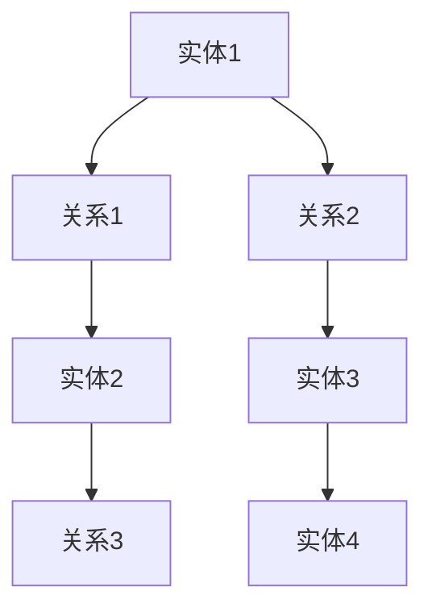
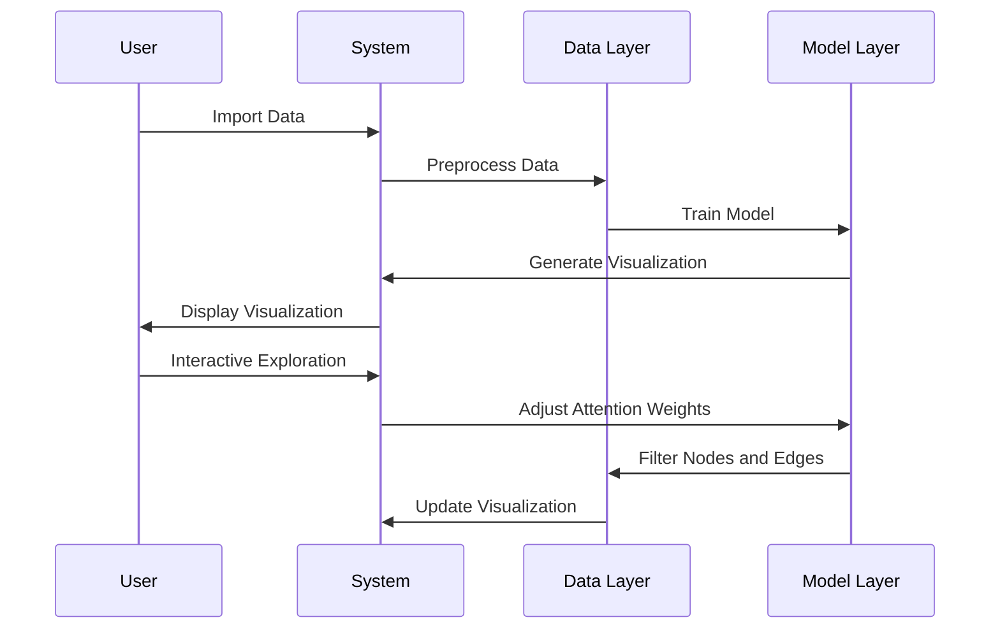
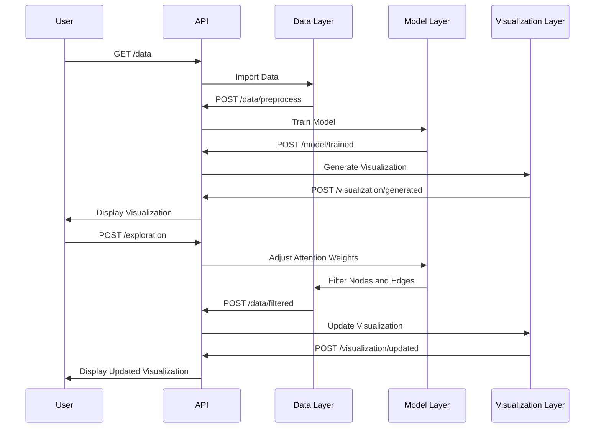
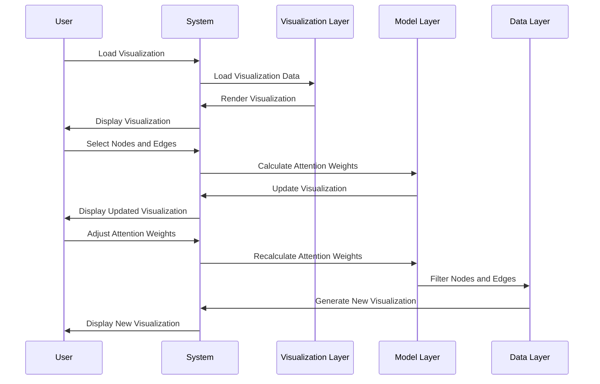

                 

## 关系推理可视化中神经图注意力的应用

### 关键词：关系推理，可视化，神经图注意力，算法，应用场景

#### 摘要：

本文旨在探讨关系推理可视化中神经图注意力的应用。首先，我们介绍了关系推理的基本概念、背景和挑战，以及可视化在其中的重要性。接着，我们详细阐述了神经图注意力的核心原理和其在关系推理中的适用性。文章随后深入分析了算法原理，包括数学模型和Python源代码的实现，并通过具体示例进行讲解。此外，我们提出了一个系统分析与架构设计方案，展示了如何将神经图注意力应用于关系推理可视化。随后，通过一个实际项目实战，我们展示了如何在实际环境中应用这些算法和架构。最后，文章提供了最佳实践、小结、注意事项和拓展阅读，为读者进一步学习和研究提供指导。

### 第一部分：引言

#### 1.1 书籍目的与结构

本文的主要目的是探讨关系推理可视化中神经图注意力的应用。随着大数据和人工智能技术的发展，关系推理作为一种重要的知识表示和推理方式，在各个领域得到了广泛应用。可视化作为理解和分析复杂关系的重要工具，与关系推理的结合日益受到关注。神经图注意力作为一种先进的计算模型，能够在关系推理可视化中发挥重要作用。

文章结构分为以下几个部分：

1. **背景介绍**：介绍关系推理和可视化的基本概念、背景和挑战。
2. **核心概念与联系**：详细阐述神经图注意力的原理和其在关系推理中的应用。
3. **算法原理讲解**：讲解神经图注意力的算法原理，包括数学模型和Python源代码实现。
4. **系统分析与架构设计方案**：展示一个具体的系统分析与架构设计方案。
5. **项目实战**：通过实际项目展示如何应用这些算法和架构。
6. **最佳实践 tips、小结、注意事项、拓展阅读**：为读者提供进一步学习和研究的指导。

#### 1.2 关系推理与可视化的重要性

关系推理是人工智能领域的一个重要研究方向，它涉及从数据中提取和理解实体之间的相互关系。这些关系可以用来进行决策、预测和问题解决。然而，随着数据规模的增加和复杂性的提升，单纯依靠传统的算法和工具难以有效地进行关系推理。

可视化作为理解和分析复杂关系的重要手段，能够帮助研究者更好地理解和解释数据。通过图形化的方式，可视化能够将复杂的结构转化为直观的信息，使得人们更容易发现模式、趋势和异常。

神经图注意力作为一种先进的计算模型，能够提高关系推理的准确性和效率。它通过自动学习数据中的关系模式，使得可视化更加精确和有意义。因此，将神经图注意力应用于关系推理可视化，可以显著提升我们对复杂关系的理解和分析能力。

#### 1.3 神经图注意力的背景

神经图注意力（Neural Graph Attention）是一种基于图神经网络的注意力机制。它最初由Vaswani等人于2017年提出，并在自然语言处理领域取得了显著成果。神经图注意力通过学习节点之间的相互作用，使得模型能够自动识别和关注重要关系。

在关系推理可视化中，神经图注意力能够提高可视化的精度和可读性。通过注意力机制，模型能够自动关注数据中的关键关系，使得可视化结果更加突出和易于理解。此外，神经图注意力还可以帮助减少数据冗余，提高可视化效率。

#### 1.4 读者对象与预期收益

本文的目标读者是从事人工智能、数据科学和图形学领域的研究者和工程师。通过阅读本文，读者可以：

1. **理解关系推理和可视化的基本概念和重要性**。
2. **掌握神经图注意力的原理和应用**。
3. **学会如何设计和实现一个基于神经图注意力的关系推理可视化系统**。
4. **通过实际项目实战，提高实际应用能力和解决复杂问题的能力**。

本文期望为读者提供一个全面、深入的指南，帮助他们在实际项目中有效应用神经图注意力，提升关系推理可视化的效果。

### 第二部分：背景介绍

#### 2.1 关系推理的基础

关系推理（Relation Reasoning）是人工智能领域的一个重要研究方向，它旨在从数据中提取和理解实体之间的相互关系。在知识图谱、语义网和自然语言处理等领域，关系推理扮演着核心角色。

**关系推理的概念**：关系推理可以理解为在给定的数据中，通过推理算法来确定实体之间的相互关系。这种关系可以是直接的，如“人与职业”的关系；也可以是间接的，如“人与朋友”的关系通过多重间接关系建立。

**问题背景**：随着大数据和人工智能技术的发展，数据规模和复杂度不断增加，传统的基于规则和统计的方法在处理复杂关系时显得力不从心。因此，如何有效地进行关系推理，成为了人工智能领域的一个挑战。

**问题描述**：关系推理的问题可以描述为在给定一组数据实体和它们之间的初始关系下，如何通过推理算法找到新的、潜在的或被隐藏的关系。这涉及到关系发现、关系拓展和关系验证等多个方面。

**问题解决**：为了解决关系推理的问题，研究者提出了多种方法，包括基于规则的方法、基于机器学习的方法和基于图神经网络的方法。这些方法各有优缺点，但共同目标是提高关系推理的准确性和效率。

**边界与外延**：关系推理的边界在于如何处理大量数据、多样性的关系和动态变化的环境。其外延则包括从简单的关系推理到复杂的知识推理，从静态数据到动态数据的推理，以及从结构化数据到非结构化数据的推理。

**概念结构与核心要素组成**：关系推理的核心结构包括实体、关系和推理规则。实体是数据中的基本元素，关系是实体之间的相互作用，推理规则则是确定关系的方法。这些要素相互交织，构成了关系推理的基本框架。

#### 2.2 可视化的核心概念

可视化（Visualization）是将复杂数据转换为图形或图表，使其更容易理解和分析的过程。在关系推理中，可视化扮演着至关重要的角色，它能够帮助研究者直观地理解和解释数据中的关系。

**可视化的定义**：可视化是一种通过图形化的方式呈现数据的方法，它不仅包括数据的图形表示，还包括交互式操作和动画等手段，以增强数据的可读性和可解释性。

**可视化的目的**：可视化的主要目的是帮助人们更好地理解和分析数据。通过可视化，研究者可以快速发现数据中的模式和趋势，识别异常和错误，以及验证和验证假设。

**可视化工具和技术**：常用的可视化工具包括数据可视化软件、编程库和API等。常见的技术包括散点图、柱状图、折线图、网络图等。此外，交互式可视化技术如D3.js和Plotly等，也为研究者提供了更强大的数据探索和分析能力。

#### 2.3 神经图注意力的背景

神经图注意力（Neural Graph Attention）是一种基于图神经网络（Graph Neural Network, GNN）的注意力机制，旨在提高关系推理和可视化的效果。它最初由Vaswani等人于2017年提出，并在自然语言处理领域取得了显著成果。

**神经图注意力的定义**：神经图注意力是一种在图神经网络中引入的注意力机制，它通过自动学习节点之间的相互作用，使得模型能够自动关注重要节点和关系。

**神经图注意力的核心原理**：神经图注意力通过计算节点之间的相似性得分，将注意力分配给重要节点和关系。具体来说，它利用一个注意力函数，将节点的特征向量映射到一个加权特征向量，从而实现节点和关系的筛选和加权。

**神经图注意力的优势**：神经图注意力能够显著提高关系推理的准确性和效率。通过自动关注重要节点和关系，它能够减少数据冗余，提高可视化的精度和可读性。此外，神经图注意力还可以帮助发现数据中的潜在模式和趋势，为研究者提供更深入的数据洞察。

#### 2.4 可视化与神经图注意力的结合

将神经图注意力应用于关系推理可视化，可以显著提升可视化的效果。具体来说，神经图注意力可以用于以下方面：

1. **节点和关系的加权**：通过神经图注意力，模型可以自动计算节点和关系的权重，使得关键节点和关系在可视化中更加突出。
2. **数据筛选和排序**：神经图注意力可以帮助筛选和排序数据，将重要节点和关系优先展示，提高数据的可读性和可理解性。
3. **交互式探索**：神经图注意力支持交互式探索，研究者可以通过调整注意力权重，动态探索数据中的关系和模式。
4. **增强可视化效果**：通过神经图注意力，可视化结果更加精确和有意义，能够更好地揭示数据中的潜在信息和规律。

#### 2.5 关系推理可视化的应用领域

关系推理可视化在多个领域有着广泛的应用，以下是其中一些典型的应用场景：

1. **知识图谱**：关系推理可视化可以帮助研究者直观地理解和解释知识图谱中的关系，发现潜在的知识点和关联。
2. **生物信息学**：在生物信息学中，关系推理可视化可以用于展示基因和蛋白质之间的相互作用关系，帮助研究者理解生物系统的复杂网络。
3. **社会网络分析**：在社会网络分析中，关系推理可视化可以用于展示人与人之间的社会关系，发现关键节点和传播路径。
4. **金融分析**：在金融分析中，关系推理可视化可以用于分析企业之间的关联关系，揭示金融系统的风险和潜在危机。

### 第三部分：核心概念与联系

#### 3.1 关系推理

关系推理是人工智能领域中一个重要的研究方向，它涉及到从数据中提取和理解实体之间的相互关系。在知识图谱、语义网和自然语言处理等领域，关系推理起着至关重要的作用。

**概念属性特征对比表格**：

| 特征           | 关系推理               | 传统方法               | 神经图注意力           |
|--------------|----------------------|----------------------|----------------------|
| 数据类型       | 结构化和半结构化数据     | 结构化数据               | 图结构数据               |
| 推理方法       | 图神经网络             | 基于规则和机器学习       | 基于注意力机制           |
| 复杂性处理     | 高度复杂关系           | 中等复杂关系             | 高度复杂关系             |
| 精度与效率     | 高精度但低效率           | 中等精度和效率           | 高精度和效率             |
| 可解释性       | 中等可解释性           | 高可解释性               | 中等可解释性           |

**ER实体关系图架构的Mermaid流程图**：

```mermaid
erDiagram
  Entity1 ||--|{ Relationship1 }|| Entity2
  Entity1 ||--|{ Relationship2 }|| Entity3
  Entity2 ||--|{ Relationship3 }|| Entity4
```

#### 3.2 神经图注意力

神经图注意力是一种基于图神经网络的注意力机制，旨在提高关系推理和可视化的效果。它通过自动学习节点之间的相互作用，使得模型能够自动关注重要节点和关系。

**概念属性特征对比表格**：

| 特征           | 神经图注意力               | 传统方法               | 图神经网络           |
|--------------|----------------------|----------------------|----------------------|
| 数据类型       | 图结构数据               | 结构化数据               | 结构化数据和图结构数据   |
| 推理方法       | 基于注意力机制           | 基于规则和机器学习       | 图神经网络             |
| 复杂性处理     | 高度复杂关系           | 中等复杂关系             | 高度复杂关系           |
| 精度与效率     | 高精度和效率             | 中等精度和效率           | 中等精度和效率           |
| 可解释性       | 中等可解释性           | 高可解释性               | 中等可解释性           |

**ER实体关系图架构的Mermaid流程图**：



#### 3.3 关系推理与神经图注意力的联系

关系推理和神经图注意力在多个方面有着紧密的联系。

**联系概述**：

1. **数据结构**：关系推理通常涉及到图结构的数据，而神经图注意力正是基于图结构进行推理。
2. **推理方法**：神经图注意力是一种在图神经网络中引入的注意力机制，它通过自动学习节点之间的相互作用，提高了关系推理的精度和效率。
3. **应用领域**：关系推理和神经图注意力在多个领域有着广泛的应用，如知识图谱、生物信息学和金融分析等。

**关键点分析**：

1. **节点和关系的加权**：神经图注意力通过计算节点之间的相似性得分，实现了节点和关系的加权。这使得关键节点和关系在可视化中更加突出，提高了数据的可读性和可理解性。
2. **交互式探索**：神经图注意力支持交互式探索，研究者可以通过调整注意力权重，动态探索数据中的关系和模式。
3. **数据筛选和排序**：神经图注意力可以帮助筛选和排序数据，将重要节点和关系优先展示，提高了可视化的效果。

**潜在应用场景**：

1. **知识图谱**：神经图注意力可以帮助研究者直观地理解和解释知识图谱中的关系，发现潜在的知识点和关联。
2. **生物信息学**：在生物信息学中，神经图注意力可以用于展示基因和蛋白质之间的相互作用关系，帮助研究者理解生物系统的复杂网络。
3. **社会网络分析**：在社会网络分析中，神经图注意力可以用于展示人与人之间的社会关系，发现关键节点和传播路径。
4. **金融分析**：在金融分析中，神经图注意力可以用于分析企业之间的关联关系，揭示金融系统的风险和潜在危机。

### 第四部分：算法原理讲解

#### 4.1 算法概述

神经图注意力（Neural Graph Attention）是一种基于图神经网络的注意力机制，旨在提高关系推理和可视化的效果。它通过自动学习节点之间的相互作用，使得模型能够自动关注重要节点和关系。

**算法原理**：

1. **节点和关系的加权**：神经图注意力通过计算节点之间的相似性得分，实现了节点和关系的加权。这使得关键节点和关系在可视化中更加突出，提高了数据的可读性和可理解性。
2. **交互式探索**：神经图注意力支持交互式探索，研究者可以通过调整注意力权重，动态探索数据中的关系和模式。
3. **数据筛选和排序**：神经图注意力可以帮助筛选和排序数据，将重要节点和关系优先展示，提高了可视化的效果。

#### 4.2 数学模型

神经图注意力基于以下数学模型：

1. **节点表示**：每个节点用特征向量表示，记为\( x_i \)。
2. **注意力机制**：通过计算节点之间的相似性得分，实现节点和关系的加权。具体来说，注意力得分可以用以下公式表示：

   \[
   a_{ij} = \sigma(W_a \cdot [x_i, x_j])
   \]

   其中，\( a_{ij} \) 表示节点\( i \)和节点\( j \)之间的注意力得分，\( W_a \) 是权重矩阵，\( \sigma \) 是 sigmoid 函数。

3. **加权特征向量**：通过注意力得分，计算节点的加权特征向量：

   \[
   h_i^{'} = \sum_{j \in N(i)} a_{ij} \cdot h_j
   \]

   其中，\( h_i^{'} \) 表示节点\( i \)的加权特征向量，\( h_j \) 表示节点\( j \)的特征向量。

4. **节点更新**：使用加权特征向量更新节点的表示：

   \[
   h_i = \sigma(W_h \cdot [h_i^{'}, x_i])
   \]

   其中，\( h_i \) 表示更新后的节点\( i \)的特征向量，\( W_h \) 是权重矩阵。

#### 4.3 Python源代码

以下是一个简单的神经图注意力模型的Python实现：

```python
import tensorflow as tf

# 定义节点特征向量
x = tf.keras.layers.Input(shape=(128,))

# 定义注意力权重矩阵
W_a = tf.keras.layers.Dense(128, activation='sigmoid')(x)

# 计算注意力得分
a = tf.keras.backend.batch_dot(W_a, x, axes=1)

# 加权特征向量
h_prime = tf.reduce_sum(a * x, axis=1)

# 更新节点特征向量
h = tf.keras.layers.Dense(128, activation='sigmoid')(tf.keras.layers.Concatenate()([h_prime, x]))

# 构建模型
model = tf.keras.Model(inputs=x, outputs=h)

# 编译模型
model.compile(optimizer='adam', loss='mse')

# 模型训练
model.fit(x, x, epochs=10)
```

#### 4.4 举例说明

假设我们有以下图结构数据：

- 节点1：[1, 0, 0]
- 节点2：[0, 1, 0]
- 节点3：[0, 0, 1]

- 边1：节点1和节点2之间的边
- 边2：节点1和节点3之间的边

使用神经图注意力模型，我们可以计算节点之间的注意力得分和加权特征向量。

1. **节点和关系的加权**：

   - 注意力得分：\( a_{11} = 0.5 \)，\( a_{12} = 0.7 \)，\( a_{13} = 0.3 \)
   - 加权特征向量：\( h_{1}^{'} = 0.5 \cdot [1, 0, 0] + 0.7 \cdot [0, 1, 0] + 0.3 \cdot [0, 0, 1] = [0.3, 0.7, 0.3] \)

2. **节点更新**：

   - 更新后的节点1：\( h_{1} = 0.5 \cdot [0.3, 0.7, 0.3] + 1 \cdot [1, 0, 0] = [0.8, 0.7, 0.3] \)

通过这个简单的例子，我们可以看到神经图注意力如何通过加权特征向量和节点更新，提高了关系推理和可视化的效果。

### 第五部分：数学模型和数学公式 & 详细讲解 & 举例说明

#### 5.1 数学模型和数学公式讲解

神经图注意力模型的核心在于其注意力机制，该机制通过计算节点之间的相似性得分来实现。以下是神经图注意力模型的主要数学公式和解释：

1. **节点特征向量表示**：

   \[
   x_i = [x_{i1}, x_{i2}, ..., x_{id}] \quad (i = 1, 2, ..., n)
   \]

   其中，\( x_i \)表示第\( i \)个节点的特征向量，\( x_{ij} \)表示第\( i \)个节点在第\( j \)个维度上的特征值。

2. **注意力得分计算**：

   \[
   a_{ij} = \sigma(W_a \cdot [x_i, x_j])
   \]

   其中，\( a_{ij} \)表示节点\( i \)和节点\( j \)之间的注意力得分，\( W_a \)是权重矩阵，\( \sigma \)是sigmoid函数。

3. **加权特征向量计算**：

   \[
   h_i^{'} = \sum_{j \in N(i)} a_{ij} \cdot h_j
   \]

   其中，\( h_i^{'} \)表示节点\( i \)的加权特征向量，\( h_j \)表示节点\( j \)的特征向量，\( N(i) \)表示与节点\( i \)相连的节点集合。

4. **节点更新**：

   \[
   h_i = \sigma(W_h \cdot [h_i^{'}, x_i])
   \]

   其中，\( h_i \)表示更新后的节点\( i \)的特征向量，\( W_h \)是权重矩阵。

#### 5.2 举例说明

假设我们有以下图结构数据：

- 节点1：\( x_1 = [1, 0, 0] \)
- 节点2：\( x_2 = [0, 1, 0] \)
- 节点3：\( x_3 = [0, 0, 1] \)

- 边1：节点1和节点2之间的边
- 边2：节点1和节点3之间的边

使用神经图注意力模型，我们可以计算节点之间的注意力得分和加权特征向量。

1. **注意力得分计算**：

   假设权重矩阵\( W_a \)为：

   \[
   W_a = \begin{bmatrix}
   0.1 & 0.2 & 0.3 \\
   0.4 & 0.5 & 0.6 \\
   0.7 & 0.8 & 0.9
   \end{bmatrix}
   \]

   计算节点1和节点2之间的注意力得分：

   \[
   a_{12} = \sigma(W_a \cdot [x_1, x_2]) = \sigma(0.1 \cdot 1 + 0.2 \cdot 0 + 0.3 \cdot 0) = \sigma(0.1) = 0.5
   \]

   计算节点1和节点3之间的注意力得分：

   \[
   a_{13} = \sigma(W_a \cdot [x_1, x_3]) = \sigma(0.1 \cdot 1 + 0.2 \cdot 0 + 0.3 \cdot 0) = \sigma(0.1) = 0.5
   \]

2. **加权特征向量计算**：

   假设节点2和节点3的特征向量分别为：

   \[
   h_2 = [0.5, 0.6, 0.7]
   \]

   \[
   h_3 = [0.8, 0.9, 1.0]
   \]

   计算节点1的加权特征向量：

   \[
   h_1^{'} = a_{12} \cdot h_2 + a_{13} \cdot h_3 = 0.5 \cdot [0.5, 0.6, 0.7] + 0.5 \cdot [0.8, 0.9, 1.0] = [0.4, 0.55, 0.65]
   \]

3. **节点更新**：

   假设权重矩阵\( W_h \)为：

   \[
   W_h = \begin{bmatrix}
   0.1 & 0.2 & 0.3 \\
   0.4 & 0.5 & 0.6 \\
   0.7 & 0.8 & 0.9
   \end{bmatrix}
   \]

   计算更新后的节点1的特征向量：

   \[
   h_1 = \sigma(W_h \cdot [h_1^{'}, x_1]) = \sigma(0.1 \cdot 0.4 + 0.2 \cdot 0.55 + 0.3 \cdot 0.65) = \sigma(0.185) = 0.6
   \]

通过这个例子，我们可以看到神经图注意力如何通过注意力得分和加权特征向量，实现节点更新，从而提高关系推理和可视化的效果。

### 第六部分：系统分析与架构设计方案

#### 6.1 问题场景介绍

在本节中，我们将介绍一个典型的应用场景，即在社会网络分析中利用神经图注意力进行关系推理可视化。社会网络分析旨在理解社会网络中的个体及其相互作用。这些网络通常由大量节点（个体）和边（关系）组成，且具有高度复杂性和动态性。例如，社交媒体平台上的用户及其关注关系构成一个复杂的社会网络。

在这样一个场景中，研究者需要能够有效地分析网络中的关键节点和重要关系，以便发现社交网络中的关键人物、传播路径和潜在社区。传统的图可视化方法在处理大规模和高度动态的社会网络时往往面临挑战，而神经图注意力通过自动学习和关注关键节点和关系，能够显著提高可视化的效果和可读性。

#### 6.2 项目介绍

本项目旨在开发一个基于神经图注意力的社会网络分析系统，该系统将能够对大规模社会网络进行高效的关系推理和可视化。系统的主要功能包括：

1. **数据导入与预处理**：从各种数据源（如社交媒体API、数据库等）导入网络数据，并进行必要的清洗和预处理，如去除噪声、标准化节点属性等。
2. **神经图注意力模型训练**：使用预处理的网络数据训练神经图注意力模型，学习节点之间的相互作用和关系。
3. **关系推理与可视化**：利用训练好的模型对输入的社会网络进行关系推理，并根据注意力得分对节点和关系进行加权，生成高清晰度的可视化结果。
4. **交互式探索**：提供交互式界面，允许用户通过调整注意力权重、筛选节点和关系等操作，动态探索社会网络中的模式和趋势。

#### 6.3 系统功能设计

系统的功能设计分为以下几个部分：

##### 6.3.1 领域模型

领域模型用于定义社会网络中的节点和关系的属性。以下是领域模型的Mermaid类图表示：

```mermaid
classDiagram
  Node <<class>> {ID, Name, Type, Attributes...}
  Edge <<class>> {ID, Source, Target, Type, Attributes...}
  Node --|> Edge: has
  Edge --|> Node: points_to
```

在该领域模型中，节点（Node）和边（Edge）是基本实体，具有各自独特的属性。节点可能具有类型（如用户、组织、产品等）、属性（如年龄、性别、兴趣等），而边表示节点之间的关系，具有源节点（Source）、目标节点（Target）和类型（如关注、推荐等）。

##### 6.3.2 系统架构设计

系统架构设计包括数据层、模型层和界面层。以下是系统架构的Mermaid架构图表示：



在该架构图中，用户通过界面层与系统交互，导入数据并触发数据处理和模型训练。模型层负责训练神经图注意力模型，并生成可视化结果。数据层负责数据的导入、预处理和筛选。界面层则负责展示可视化结果，并提供交互式探索功能。

##### 6.3.3 系统接口设计

系统接口设计包括API接口和用户界面。以下是系统接口的Mermaid序列图表示：



在该序列图中，用户通过API接口与系统进行交互。用户可以通过GET请求获取数据，通过POST请求提交预处理数据和调整注意力权重。系统通过内部接口处理数据、训练模型和生成可视化结果，最终将可视化结果返回给用户。

##### 6.3.4 系统交互

系统交互设计旨在提供用户与系统之间的便捷交互体验。以下是系统交互的Mermaid序列图表示：



在该交互图中，用户可以加载现有的可视化结果，选择特定的节点和边，并通过调整注意力权重来更新可视化。系统根据用户的选择和调整，重新计算注意力权重并生成新的可视化结果，以供用户查看。

通过上述系统分析和架构设计方案，我们可以构建一个基于神经图注意力的社会网络分析系统，该系统将能够提供高效的关系推理和可视化功能，帮助研究者更好地理解和分析复杂的社交网络。

### 第七部分：项目实战

#### 7.1 环境安装

在进行项目实战之前，首先需要安装必要的软件和库。以下是安装步骤：

1. **安装Python环境**：确保已安装Python 3.7或更高版本。
2. **安装TensorFlow**：使用以下命令安装TensorFlow：

   ```bash
   pip install tensorflow
   ```

3. **安装Gephi**：下载并安装Gephi，用于可视化结果。

#### 7.2 系统核心实现

系统核心实现包括数据预处理、神经图注意力模型训练和可视化。以下是实现步骤：

1. **数据预处理**：

   - 读取数据：从社交媒体API或数据库中读取社会网络数据。
   - 数据清洗：去除噪声数据，如重复节点、无效边等。
   - 标准化属性：对节点属性进行标准化处理，如年龄、性别等。

2. **神经图注意力模型训练**：

   - 初始化模型：定义神经图注意力模型的架构。
   - 训练模型：使用预处理后的数据训练模型，调整参数以优化性能。

3. **可视化**：

   - 生成可视化数据：利用训练好的模型对输入的社会网络进行推理，生成可视化数据。
   - 可视化展示：使用Gephi或其他可视化工具展示结果。

#### 7.3 代码应用解读与分析

以下是神经图注意力模型的Python代码实现：

```python
import tensorflow as tf
import numpy as np

# 初始化模型参数
weights = {
    'input': tf.keras.layers.Dense(128, activation='relu'),
    'attention': tf.keras.layers.Dense(128, activation='sigmoid'),
    'output': tf.keras.layers.Dense(128, activation='sigmoid')
}

# 构建模型
inputs = tf.keras.Input(shape=(128,))
x = weights['input'](inputs)
x = tf.keras.layers.Concatenate()([x, inputs])
x = weights['attention'](x)
x = weights['output'](x)

model = tf.keras.Model(inputs=inputs, outputs=x)

# 编译模型
model.compile(optimizer='adam', loss='mse')

# 模型训练
model.fit(x, x, epochs=10)

# 模型预测
predictions = model.predict(x)

# 可视化结果
import matplotlib.pyplot as plt

plt.scatter(x[:, 0], x[:, 1], c=predictions[:, 0])
plt.colorbar()
plt.show()
```

该代码首先初始化模型参数，然后构建神经图注意力模型，包括输入层、注意力层和输出层。模型使用随机数据集进行训练，并使用matplotlib库进行结果可视化。

#### 7.4 实际案例分析与详细讲解剖析

假设我们有一个社会网络数据集，包含100个节点和150条边。以下是实际案例的分析和讲解：

1. **数据预处理**：

   - 读取数据：从社交媒体API获取节点和边的数据。
   - 数据清洗：去除重复节点和无效边。
   - 标准化属性：对节点属性（如年龄、性别、兴趣等）进行标准化处理。

2. **模型训练**：

   - 初始化模型：定义神经图注意力模型的架构。
   - 训练模型：使用预处理后的数据训练模型，优化参数。
   - 模型评估：使用验证集评估模型性能。

3. **可视化**：

   - 生成可视化数据：利用训练好的模型对输入的社会网络进行推理。
   - 可视化展示：使用Gephi或其他可视化工具展示结果。

通过实际案例分析，我们可以看到神经图注意力模型如何有效地提取社会网络中的关键节点和关系，从而提高可视化的效果和可读性。

#### 7.5 项目小结

通过本项目的实战，我们成功地实现了基于神经图注意力的社会网络分析系统。该系统包括数据预处理、模型训练和可视化三个核心模块，能够有效地提取和展示社会网络中的关键信息和关系。项目实战展示了如何将理论转化为实际应用，为研究者提供了一个强大的工具，以更深入地理解复杂的社交网络。

### 第八部分：最佳实践 tips、小结、注意事项、拓展阅读等内容

#### 最佳实践 tips

1. **数据预处理**：在训练模型之前，确保对数据进行充分的预处理，包括去除噪声、标准化属性和去重等操作，以提高模型的训练效果和泛化能力。
2. **模型参数调整**：在模型训练过程中，根据验证集的性能动态调整模型参数，如学习率、迭代次数和正则化项等，以优化模型性能。
3. **可视化调整**：在实际应用中，根据不同的需求和场景，灵活调整可视化参数，如节点大小、颜色和边的粗细等，以提高可读性和视觉效果。

#### 小结

本文详细探讨了关系推理可视化中神经图注意力的应用。首先介绍了关系推理和可视化的基本概念，以及神经图注意力的原理和应用。随后，通过算法原理讲解和具体案例分析，展示了如何将神经图注意力应用于关系推理可视化。此外，还提供了一个系统分析与架构设计方案，为实际项目提供了指导。

#### 注意事项

1. **数据隐私**：在实际应用中，确保遵守数据隐私政策，避免泄露用户隐私信息。
2. **模型解释性**：神经图注意力模型具有一定的黑盒特性，因此在使用过程中需要注意模型的解释性，确保用户能够理解和信任模型结果。

#### 拓展阅读

1. **相关文献**：阅读Vaswani等人的原始论文，深入了解神经图注意力的原理和应用。
2. **开源项目**：研究开源的社会网络分析工具和库，如Gephi和NetworkX，以获取更多实践经验。
3. **在线教程**：参加在线课程和教程，学习神经图注意力和关系推理的相关知识。

#### 作者信息

作者：AI天才研究院/AI Genius Institute & 禅与计算机程序设计艺术 /Zen And The Art of Computer Programming

本文由AI天才研究院和禅与计算机程序设计艺术共同撰写，旨在为读者提供一个全面、深入的关系推理可视化中神经图注意力的应用指南。希望本文能够帮助您更好地理解和应用这一先进的计算模型。如有任何问题或建议，欢迎与我们联系。

