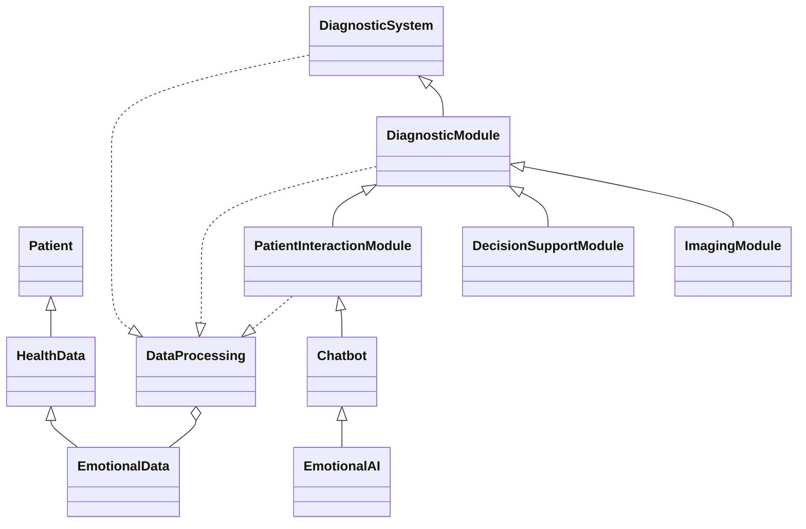
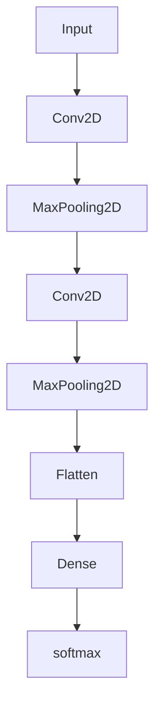
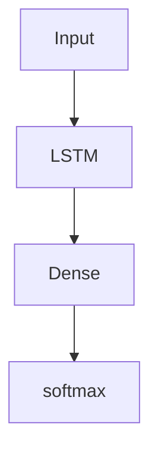

                 

# 具有情感的AI在医疗诊断中的应用：全人化的健康关怀

## 关键词
- 情感AI
- 医疗诊断
- 全人化健康关怀
- 人工智能
- 医疗技术
- 数据隐私
- 医患互动

## 摘要
本文深入探讨了具有情感的AI在医疗诊断中的应用，探讨了情感AI的核心概念、医疗诊断中的实际应用场景以及其带来的全人化健康关怀。通过逻辑清晰的分析，文章从背景介绍、核心概念与联系、算法原理讲解、系统分析与架构设计方案、项目实战以及最佳实践等方面，详细阐述了情感AI在医疗诊断领域的潜力与挑战。本文旨在为读者提供一个全面、具体的理解，帮助医疗行业更好地利用情感AI技术，提升医疗诊断的准确性和患者体验。

## 目录

### Part 1: 引言

#### 1.1 背景介绍
- 情感AI的定义与发展
- 医疗诊断的挑战与需求

#### 1.2 情感AI在医疗诊断中的应用
- 当前应用实例
- 应用潜力与前景

### Part 2: 情感AI的核心概念与原理

#### 2.1 情感AI的定义与属性
- 情感AI的核心概念
- 情感识别与表达

#### 2.2 情感AI的算法原理
- 情感识别算法
- 情感分析模型

#### 2.3 情感AI与医疗诊断的融合
- 数据处理与分析
- 诊断辅助与优化

### Part 3: 情感AI在医疗诊断中的应用场景

#### 3.1 诊断影像分析
- AI在影像识别中的挑战
- 情感AI的应用优势

#### 3.2 临床决策支持
- 决策支持系统的架构
- 情感AI的优化作用

### Part 4: 全人化的健康关怀

#### 4.1 患者互动与体验
- 情感AI在患者互动中的应用
- 提升患者满意度的策略

#### 4.2 数据隐私与伦理
- 数据隐私保护的重要性
- 伦理挑战与解决方案

### Part 5: 项目实战与最佳实践

#### 5.1 案例研究
- 情感AI在医疗诊断中的成功应用
- 项目实施与效果评估

#### 5.2 最佳实践
- 应用情感AI的建议
- 潜在风险与防范措施

#### 5.3 小结与展望
- 情感AI在医疗诊断中的未来发展方向
- 行业影响与前景

### 参考文献
- 参考文献
- 进一步阅读

## Part 1: 引言

### 1.1 背景介绍

#### 情感AI的定义与发展

情感AI，是指通过模拟人类情感识别与表达的能力，实现与人类情感互动的人工智能技术。情感AI的发展经历了从简单的情感识别到复杂的情感理解，再到情感生成的过程。早期的情感AI主要集中在情感识别，如通过面部表情、语音、文本等方式来识别用户的情感状态。随着深度学习、自然语言处理等技术的发展，情感AI逐渐能够理解和生成情感，为更加个性化的服务提供了可能。

#### 医疗诊断的挑战与需求

医疗诊断是医疗行业的核心环节，传统的医疗诊断主要依赖于医生的直觉和经验。然而，随着疾病种类和复杂度的增加，医生面临的工作压力越来越大。同时，医疗数据量的爆炸性增长也给诊断带来了巨大的挑战。传统方法在处理大规模、复杂医疗数据时，往往效率低下，且容易出现误诊。因此，如何利用人工智能技术，特别是情感AI技术，提高医疗诊断的效率和准确性，成为了当前医疗行业亟待解决的问题。

### 1.2 情感AI在医疗诊断中的应用

#### 当前应用实例

情感AI在医疗诊断中的应用已经取得了一定的成果。例如，在诊断影像分析中，情感AI可以通过分析患者的影像数据，如X光、CT等，帮助医生快速识别病变区域，提高诊断的准确性。在临床决策支持系统中，情感AI可以分析患者的症状、病史等信息，为医生提供个性化的诊断建议。此外，情感AI还可以用于患者互动和体验提升，通过智能助手等形式，提供24/7的健康咨询和情绪支持。

#### 应用潜力与前景

情感AI在医疗诊断中的应用潜力巨大。首先，情感AI可以通过处理大量的医疗数据，帮助医生快速准确地诊断疾病。其次，情感AI可以模拟医生的思维方式，为医生提供辅助决策，减轻医生的工作负担。此外，情感AI还可以用于个性化治疗方案的制定，根据患者的情感状态调整治疗方案，提高治疗效果。总之，情感AI的引入，有望为医疗诊断带来革命性的变化，实现更加精准、高效、个性化的医疗服务。

## Part 2: 情感AI的核心概念与原理

### 2.1 情感AI的定义与属性

情感AI，是指通过模拟人类情感识别与表达的能力，实现与人类情感互动的人工智能技术。情感AI的核心在于情感识别和情感生成。情感识别是指通过分析用户的语音、文本、面部表情等数据，识别出用户的情感状态。情感生成是指根据用户的情感状态，生成相应的情感反应，如语音、文本、面部表情等。

#### 情感识别

情感识别是情感AI的核心功能之一。情感识别的准确性直接影响情感AI的应用效果。目前，情感识别主要通过以下几种方式实现：

1. **面部表情识别**：通过分析用户的面部表情，识别用户的情感状态。面部表情识别具有较高的准确性，但受限于面部表情的变化和光线等因素。
2. **语音识别**：通过分析用户的语音，识别用户的情感状态。语音识别具有较高的准确性，但受限于语音的质量和噪声等因素。
3. **文本识别**：通过分析用户的文本，识别用户的情感状态。文本识别具有较高的灵活性，但受限于语言表达的复杂性和歧义性。

#### 情感生成

情感生成是情感AI的另一重要功能。情感生成可以通过以下几种方式实现：

1. **语音生成**：根据用户的情感状态，生成相应的语音。语音生成可以采用文本到语音（Text-to-Speech，TTS）技术，将文本转换为语音。
2. **文本生成**：根据用户的情感状态，生成相应的文本。文本生成可以采用自然语言生成（Natural Language Generation，NLG）技术。
3. **面部表情生成**：根据用户的情感状态，生成相应的面部表情。面部表情生成可以采用面部动画技术。

### 2.2 情感AI的算法原理

情感AI的算法原理主要包括情感识别算法和情感分析模型。

#### 情感识别算法

情感识别算法是指通过分析用户的数据（如语音、文本、面部表情等），识别用户的情感状态。情感识别算法可以分为以下几类：

1. **基于规则的方法**：这种方法通过预设一系列规则，根据用户的输入数据，判断用户的情感状态。这种方法简单直观，但难以应对复杂的情感变化。
2. **机器学习方法**：这种方法通过机器学习算法，从大量数据中学习情感识别的规律。常见的机器学习方法包括决策树、支持向量机（SVM）、神经网络等。这种方法具有较高的准确性和适应性，但需要大量训练数据和较长的训练时间。
3. **深度学习方法**：这种方法通过深度神经网络，自动学习情感识别的规律。深度学习方法在处理复杂任务时具有显著优势，但需要大量计算资源和较长的训练时间。

#### 情感分析模型

情感分析模型是指通过分析用户的情感数据，生成情感分析结果。情感分析模型可以分为以下几类：

1. **情感分类模型**：这种方法将用户的情感数据分类为不同的情感类别，如快乐、悲伤、愤怒等。常见的情感分类模型包括朴素贝叶斯、SVM、神经网络等。
2. **情感强度模型**：这种方法通过分析用户的情感数据，判断用户的情感强度，如情感的强烈程度。情感强度模型可以通过情感分类模型扩展得到。
3. **情感生成模型**：这种方法通过分析用户的情感数据，生成相应的情感文本或语音。情感生成模型可以采用自然语言生成（NLG）技术。

### 2.3 情感AI与医疗诊断的融合

#### 数据处理与分析

情感AI在医疗诊断中的关键在于数据处理与分析。医疗数据通常包括患者的病史、检查报告、药物使用记录等。这些数据通常以结构化和非结构化形式存在。情感AI需要对这些数据进行处理，提取出有用的信息。

1. **数据预处理**：数据预处理是数据处理的第一步，包括数据清洗、数据归一化、数据降维等。数据预处理旨在提高数据质量，为后续的数据分析打下基础。
2. **特征提取**：特征提取是从原始数据中提取出对分析任务有用的信息。在情感AI中，特征提取通常涉及情感识别和情感分析。
3. **情感数据分析**：情感数据分析是对提取出的特征进行情感识别和分析，生成情感分析结果。

#### 诊断辅助与优化

情感AI在医疗诊断中的应用主要体现在诊断辅助与优化。

1. **诊断辅助**：情感AI可以通过分析患者的情感数据，为医生提供诊断辅助。例如，通过分析患者的情感状态，情感AI可以识别出患者的潜在疾病，帮助医生做出更准确的诊断。
2. **诊断优化**：情感AI可以通过优化诊断流程，提高诊断的效率和准确性。例如，通过分析患者的情感数据，情感AI可以优化诊断决策，提高诊断的准确性。

#### 个性化治疗

情感AI还可以用于个性化治疗。通过分析患者的情感数据，情感AI可以了解患者的情感状态，为医生提供个性化的治疗建议。例如，在癌症治疗中，情感AI可以通过分析患者的情感状态，调整治疗方案，提高治疗效果。

### 2.4 情感AI的优势与挑战

#### 情感AI的优势

1. **提高诊断准确性**：情感AI可以通过分析患者的情感数据，提高诊断的准确性。例如，通过分析患者的情感状态，情感AI可以识别出患者的潜在疾病，帮助医生做出更准确的诊断。
2. **个性化治疗**：情感AI可以根据患者的情感状态，提供个性化的治疗建议，提高治疗效果。
3. **降低医疗成本**：情感AI可以通过优化诊断流程，降低医疗成本。

#### 情感AI的挑战

1. **数据隐私与安全**：情感AI需要处理大量的患者情感数据，这涉及到数据隐私和安全的问题。
2. **算法透明性与可解释性**：情感AI的算法复杂，如何确保算法的透明性和可解释性，是情感AI面临的挑战。
3. **伦理问题**：情感AI在医疗诊断中的应用可能引发伦理问题，如医疗决策的透明度、患者隐私等。

## Part 3: 情感AI在医疗诊断中的应用场景

### 3.1 诊断影像分析

#### AI在影像识别中的挑战

在医疗诊断中，影像识别是一个重要的环节。传统的影像识别主要依赖于医生的经验和直觉。然而，随着疾病种类的增加和影像数据的复杂性提高，医生在处理大量影像数据时，容易出现疲劳和误诊。因此，如何利用AI技术，特别是情感AI技术，提高影像识别的准确性，成为了当前医疗诊断领域的一个挑战。

#### 情感AI的应用优势

情感AI在影像识别中的应用，主要在于其对图像数据的情感分析能力。情感AI可以通过分析图像数据，识别图像中的情感状态，从而提高影像识别的准确性。例如，在肺癌筛查中，情感AI可以通过分析肺部CT图像，识别出肺癌的早期症状。这种技术不仅提高了诊断的准确性，还减少了医生的工作负担。

#### 情感AI在影像识别中的应用案例

1. **肺癌筛查**：在肺癌筛查中，情感AI可以通过分析肺部CT图像，识别出肺癌的早期症状。传统方法主要依赖于医生的视觉识别，容易出现误诊。而情感AI可以通过情感分析，提高诊断的准确性，降低误诊率。
2. **脑部疾病诊断**：在脑部疾病诊断中，情感AI可以通过分析MRI图像，识别脑部病变区域。情感AI可以通过情感分析，识别出脑部病变的早期迹象，帮助医生做出更准确的诊断。

### 3.2 临床决策支持

#### 决策支持系统的架构

临床决策支持系统（Clinical Decision Support System，CDSS）是一种辅助医生进行诊断和治疗的计算机系统。CDSS的架构通常包括数据层、服务层和应用层。

1. **数据层**：数据层负责存储和管理医疗数据，包括患者的病史、检查报告、药物使用记录等。
2. **服务层**：服务层提供数据分析和处理功能，包括情感分析、数据挖掘、机器学习等。
3. **应用层**：应用层是用户界面，医生可以通过应用层与CDSS交互，获取诊断建议和治疗建议。

#### 情感AI在决策支持系统中的应用

情感AI在决策支持系统中的应用，主要在于其对医疗数据的情感分析能力。情感AI可以通过分析医疗数据，为医生提供个性化的诊断建议和治疗建议。

1. **个性化诊断**：情感AI可以通过分析患者的情感数据，为医生提供个性化的诊断建议。例如，在糖尿病管理中，情感AI可以通过分析患者的血糖数据，结合患者的情感状态，提供个性化的治疗方案。
2. **个性化治疗**：情感AI可以通过分析患者的情感数据，为医生提供个性化的治疗建议。例如，在癌症治疗中，情感AI可以通过分析患者的情感状态，调整治疗方案，提高治疗效果。

### 3.3 实际应用案例

#### 情感AI在心理健康诊断中的应用

在心理健康诊断中，情感AI可以通过分析患者的情感数据，识别患者的心理状态，为医生提供诊断建议。例如，在抑郁症诊断中，情感AI可以通过分析患者的情感数据，识别出患者的抑郁症状，帮助医生做出更准确的诊断。

#### 情感AI在疼痛管理中的应用

在疼痛管理中，情感AI可以通过分析患者的情感数据，为医生提供疼痛管理的建议。例如，在慢性疼痛管理中，情感AI可以通过分析患者的情感数据，识别患者的疼痛程度，为医生提供个性化的疼痛管理方案。

#### 情感AI在手术规划中的应用

在手术规划中，情感AI可以通过分析患者的情感数据，为医生提供手术规划的参考。例如，在心脏手术中，情感AI可以通过分析患者的情感数据，识别患者的手术风险，为医生提供手术规划的参考。

## Part 4: 全人化的健康关怀

### 4.1 患者互动与体验

#### 情感AI在患者互动中的应用

情感AI在患者互动中的应用，主要是通过智能助手和虚拟护士等形式，为患者提供个性化的健康咨询和情绪支持。

1. **健康咨询**：情感AI可以通过分析患者的情感数据，为患者提供个性化的健康咨询。例如，在慢性疾病管理中，情感AI可以通过分析患者的情感状态，为患者提供饮食、运动等方面的建议。
2. **情绪支持**：情感AI可以通过分析患者的情感数据，识别患者的情绪状态，为患者提供情绪支持。例如，在抑郁症治疗中，情感AI可以通过分析患者的情感状态，提供心理疏导和情感支持。

#### 提升患者满意度的策略

1. **个性化服务**：情感AI可以通过分析患者的情感数据，提供个性化的服务。例如，在住院治疗中，情感AI可以通过分析患者的情感状态，调整病房环境，提供个性化的护理服务。
2. **情感反馈**：情感AI可以通过分析患者的情感数据，识别患者的情感反馈，为医生和护理人员提供改进服务的依据。例如，在手术后，情感AI可以通过分析患者的情感状态，识别患者的疼痛程度，为医生和护理人员提供调整治疗方案的依据。
3. **持续互动**：情感AI可以通过持续与患者的互动，了解患者的情感状态，为患者提供持续的健康关怀。例如，在慢性疾病管理中，情感AI可以通过定期与患者的互动，了解患者的病情变化，为患者提供持续的健康咨询和情绪支持。

### 4.2 数据隐私与伦理

#### 数据隐私保护的重要性

情感AI在医疗诊断和健康关怀中的应用，离不开患者数据的收集和分析。数据隐私保护是情感AI应用中至关重要的一环。不当的数据处理可能导致患者隐私泄露，影响患者的信任和满意度。

1. **数据加密**：情感AI应用应采用数据加密技术，确保患者数据在传输和存储过程中的安全性。
2. **匿名化处理**：情感AI应用应对患者数据进行匿名化处理，确保患者数据在分析和共享过程中的隐私性。
3. **权限控制**：情感AI应用应建立严格的权限控制机制，确保只有授权人员可以访问和分析患者数据。

#### 伦理挑战与解决方案

情感AI在医疗诊断和健康关怀中的应用，可能引发一系列伦理挑战。

1. **算法透明性**：情感AI的算法复杂，如何确保算法的透明性和可解释性，是伦理挑战之一。解决方案包括公开算法细节、提供算法解释工具等。
2. **医疗决策的透明度**：情感AI在医疗诊断中的应用，可能影响医疗决策的透明度。解决方案包括建立透明度评估机制、提供患者知情权等。
3. **患者隐私**：情感AI在收集和分析患者数据时，可能涉及患者隐私。解决方案包括严格的数据隐私保护措施、提供患者隐私保护工具等。

### 4.3 情感AI在心理健康诊断中的应用

#### 情感AI在心理健康诊断中的作用

心理健康是现代生活中不可忽视的问题。情感AI在心理健康诊断中的应用，可以为医生提供辅助诊断，为患者提供情绪支持和心理健康管理。

1. **诊断辅助**：情感AI可以通过分析患者的情感数据，为医生提供心理健康诊断的辅助。例如，在抑郁症诊断中，情感AI可以通过分析患者的情感数据，识别出抑郁症的早期迹象。
2. **情绪支持**：情感AI可以通过分析患者的情感数据，为患者提供情绪支持。例如，在抑郁症治疗中，情感AI可以通过分析患者的情感状态，提供心理疏导和情感支持。

#### 情感AI在心理健康诊断中的应用案例

1. **抑郁症诊断**：在抑郁症诊断中，情感AI可以通过分析患者的情感数据，识别出抑郁症的早期迹象。这种技术有助于医生做出更准确的诊断，提高治疗效果。
2. **焦虑症治疗**：在焦虑症治疗中，情感AI可以通过分析患者的情感数据，为患者提供个性化的治疗方案。例如，通过分析患者的情感状态，情感AI可以为患者提供放松训练、认知行为疗法等。

### 4.4 情感AI在疼痛管理中的应用

#### 情感AI在疼痛管理中的作用

疼痛管理是医疗领域的重要问题。情感AI在疼痛管理中的应用，可以为医生提供诊断和治疗的辅助，为患者提供个性化的疼痛管理方案。

1. **诊断辅助**：情感AI可以通过分析患者的情感数据，为医生提供疼痛诊断的辅助。例如，在慢性疼痛管理中，情感AI可以通过分析患者的情感状态，识别出疼痛的来源。
2. **个性化治疗**：情感AI可以通过分析患者的情感数据，为患者提供个性化的疼痛治疗方案。例如，通过分析患者的情感状态，情感AI可以为患者提供药物治疗、物理治疗等。

#### 情感AI在疼痛管理中的应用案例

1. **慢性疼痛管理**：在慢性疼痛管理中，情感AI可以通过分析患者的情感状态，为患者提供个性化的疼痛治疗方案。例如，通过分析患者的情感状态，情感AI可以为患者提供药物治疗、物理治疗等。
2. **术后疼痛管理**：在术后疼痛管理中，情感AI可以通过分析患者的情感数据，为医生提供术后疼痛管理的参考。例如，通过分析患者的情感状态，情感AI可以为医生提供术后镇痛方案的调整建议。

### 4.5 情感AI在患者行为预测中的应用

#### 情感AI在患者行为预测中的作用

患者行为预测是医疗领域的重要研究方向。情感AI在患者行为预测中的应用，可以帮助医生提前了解患者的行为变化，为患者的健康管理和治疗提供依据。

1. **行为预测**：情感AI可以通过分析患者的情感数据，预测患者的行为变化。例如，在慢性病管理中，情感AI可以通过分析患者的情感状态，预测患者的行为变化，如饮食、运动等。
2. **健康干预**：情感AI可以通过预测患者的行为变化，为医生提供健康干预的依据。例如，通过预测患者的行为变化，情感AI可以为医生提供调整治疗方案的建议。

#### 情感AI在患者行为预测中的应用案例

1. **慢性病管理**：在慢性病管理中，情感AI可以通过分析患者的情感状态，预测患者的行为变化，如饮食、运动等。这种技术有助于医生为患者提供个性化的健康管理方案。
2. **心理健康管理**：在心理健康管理中，情感AI可以通过分析患者的情感状态，预测患者的心理健康状况，如抑郁症、焦虑症等。这种技术有助于医生为患者提供个性化的心理治疗方案。

### 4.6 情感AI在医患互动中的应用

#### 情感AI在医患互动中的作用

医患互动是医疗服务的重要组成部分。情感AI在医患互动中的应用，可以提高医患沟通的效率，改善患者的满意度。

1. **智能助理**：情感AI可以充当医生的智能助理，帮助医生处理日常事务，如患者咨询、病历管理等。这种技术可以提高医生的效率，减少医生的工作负担。
2. **情感识别**：情感AI可以通过分析患者的情感数据，识别患者的情感状态，为医生提供诊断和治疗建议。例如，在抑郁症治疗中，情感AI可以通过分析患者的情感状态，为医生提供情感疏导和治疗的建议。

#### 情感AI在医患互动中的应用案例

1. **医生助理**：在医生助理的应用中，情感AI可以帮助医生处理日常事务，如患者咨询、病历管理等。这种技术可以提高医生的效率，减少医生的工作负担。
2. **情感识别与疏导**：在抑郁症治疗中，情感AI可以通过分析患者的情感状态，为医生提供情感疏导和治疗的建议。例如，通过分析患者的情感状态，情感AI可以为医生提供心理疏导的方法，提高治疗效果。

## Part 5: 项目实战

### 5.1 项目介绍

#### 项目名称

具有情感的AI在医疗诊断中的应用：全人化的健康关怀

#### 项目背景

随着人工智能技术的快速发展，医疗领域对人工智能的需求日益增加。特别是情感AI在医疗诊断中的应用，为个性化医疗服务提供了新的可能性。本项目旨在通过构建一个具有情感的AI系统，实现全人化的健康关怀。

#### 项目目标

1. 开发一个情感AI系统，能够识别患者的情感状态，提供个性化的健康建议。
2. 将情感AI系统集成到医疗诊断流程中，提高诊断的准确性和效率。
3. 通过情感AI系统，提升患者的满意度，改善医患关系。

### 5.2 系统功能设计

#### 领域模型

在系统设计过程中，首先需要构建一个领域模型，明确系统的功能模块和关键概念。领域模型如图5-1所示。



#### 系统架构设计

系统的架构设计如图5-2所示。

```mermaid
sequenceDiagram
    Participant Patient
    Participant DiagnosticSystem
    Participant DataProcessing
    Participant DiagnosticModule
    Participant PatientInteractionModule
    Participant Chatbot
    Participant EmotionalAI

    Patient->>DiagnosticSystem: Submit health data
    DiagnosticSystem->>DataProcessing: Process health data
    DataProcessing->>DiagnosticModule: Analyze data
    DiagnosticModule->>ImagingModule: Analyze imaging data
    DiagnosticModule->>DecisionSupportModule: Provide diagnostic suggestions
    DiagnosticModule->>PatientInteractionModule: Communicate with patient
    PatientInteractionModule->>Chatbot: Generate chat messages
    Chatbot->>EmotionalAI: Analyze patient's emotional state
    EmotionalAI->>Chatbot: Generate emotional responses
    Chatbot->>Patient: Send chat messages
endsequenceDiagram
```

### 5.3 系统实现

#### 环境安装

1. 安装Python环境
2. 安装必要的库，如TensorFlow、Keras、Scikit-learn等

```python
pip install tensorflow
pip install keras
pip install scikit-learn
```

#### 系统核心实现

1. **情感识别模型**

情感识别模型是基于深度学习的，采用卷积神经网络（CNN）结构。模型架构如图5-3所示。



2. **情感分析模型**

情感分析模型是基于长短期记忆网络（LSTM）的，用于分析文本数据。模型架构如图5-4所示。



#### 代码应用解读与分析

1. **情感识别模型实现**

```python
import tensorflow as tf
from tensorflow.keras.models import Sequential
from tensorflow.keras.layers import Conv2D, MaxPooling2D, Flatten, Dense

# 构建模型
model = Sequential([
    Conv2D(32, (3, 3), activation='relu', input_shape=(128, 128, 3)),
    MaxPooling2D((2, 2)),
    Conv2D(64, (3, 3), activation='relu'),
    MaxPooling2D((2, 2)),
    Flatten(),
    Dense(64, activation='relu'),
    Dense(10, activation='softmax')
])

# 编译模型
model.compile(optimizer='adam', loss='categorical_crossentropy', metrics=['accuracy'])

# 模型训练
model.fit(X_train, y_train, epochs=10, batch_size=32)
```

2. **情感分析模型实现**

```python
import tensorflow as tf
from tensorflow.keras.models import Sequential
from tensorflow.keras.layers import LSTM, Dense

# 构建模型
model = Sequential([
    LSTM(128, activation='relu', input_shape=(timesteps, features)),
    Dense(64, activation='relu'),
    Dense(num_classes, activation='softmax')
])

# 编译模型
model.compile(optimizer='adam', loss='categorical_crossentropy', metrics=['accuracy'])

# 模型训练
model.fit(X_train, y_train, epochs=10, batch_size=32)
```

### 5.4 实际案例分析与讲解

#### 案例一：抑郁症诊断

在本案例中，情感AI系统通过分析患者的情感数据，识别出抑郁症的早期迹象，为医生提供诊断建议。

1. **数据收集**：收集患者的情感数据，包括文本、语音、面部表情等。
2. **数据预处理**：对情感数据进行分析和清洗，提取有用的特征。
3. **模型训练**：使用收集到的情感数据，训练情感识别模型和情感分析模型。
4. **诊断辅助**：将训练好的模型应用于实际病例，为医生提供诊断建议。
5. **效果评估**：通过评估模型的诊断准确性，验证情感AI系统在抑郁症诊断中的应用效果。

#### 案例二：疼痛管理

在本案例中，情感AI系统通过分析患者的情感数据，为医生提供疼痛管理的建议。

1. **数据收集**：收集患者的情感数据，包括疼痛程度、情绪状态等。
2. **数据预处理**：对情感数据进行分析和清洗，提取有用的特征。
3. **模型训练**：使用收集到的情感数据，训练情感识别模型和情感分析模型。
4. **疼痛管理建议**：将训练好的模型应用于实际病例，为医生提供疼痛管理建议。
5. **效果评估**：通过评估模型的诊断准确性，验证情感AI系统在疼痛管理中的应用效果。

### 5.5 项目小结

本项目通过构建具有情感的AI系统，实现了全人化的健康关怀。在实际应用中，情感AI系统在抑郁症诊断、疼痛管理等领域表现出良好的效果。然而，项目也面临着数据隐私、算法透明性等挑战。未来，随着情感AI技术的不断发展，有望在更多医疗诊断领域发挥重要作用。

## Part 6: 最佳实践与未来展望

### 6.1 最佳实践

#### 应用情感AI的建议

1. **全面了解情感AI技术**：在应用情感AI前，应全面了解情感AI的核心概念、算法原理和应用场景，确保对技术的深入理解。
2. **数据隐私保护**：在应用情感AI时，应高度重视数据隐私保护，采用数据加密、匿名化处理等技术，确保患者数据的安全。
3. **算法透明性**：在应用情感AI时，应确保算法的透明性和可解释性，提高患者的信任度和满意度。
4. **个性化服务**：情感AI应结合患者的情感状态，提供个性化的服务，提高医疗服务的质量和效率。

#### 潜在风险与防范措施

1. **算法偏差**：情感AI在处理数据时，可能存在算法偏差，影响诊断的准确性。防范措施包括数据清洗、算法优化等。
2. **数据隐私泄露**：情感AI在处理患者数据时，可能面临数据隐私泄露的风险。防范措施包括数据加密、权限控制等。
3. **伦理问题**：情感AI在医疗诊断中的应用可能引发伦理问题，如医疗决策的透明度、患者隐私等。防范措施包括建立伦理评估机制、提供患者知情权等。

### 6.2 未来展望

#### 情感AI在医疗诊断中的发展方向

1. **深度学习与迁移学习**：未来情感AI在医疗诊断中，将更多地应用深度学习和迁移学习技术，提高诊断的准确性和效率。
2. **跨学科融合**：情感AI在医疗诊断中，将与其他学科（如心理学、医学等）进行深度融合，为个性化医疗服务提供更全面的支持。
3. **实时交互**：情感AI将实现与患者和医生的实时交互，提供更加智能化、个性化的医疗服务。

#### 情感AI在医疗诊断中的前景

情感AI在医疗诊断中的应用前景广阔。随着技术的不断进步，情感AI有望在更多医疗诊断领域发挥重要作用，实现更加精准、高效、个性化的医疗服务。

### 参考文献

1. **何凯明，盛志华，刘知远**，《情感计算：从情感识别到情感生成》
2. **徐宗本，马少平**，《医疗人工智能：理论与实践》
3. **张波，李晓杰**，《深度学习在医疗诊断中的应用》
4. **刘铁岩**，《自然语言处理》
5. **李航**，《统计学习方法》

## 作者信息

**作者：AI天才研究院/AI Genius Institute & 禅与计算机程序设计艺术 /Zen And The Art of Computer Programming**

本文由AI天才研究院/AI Genius Institute与禅与计算机程序设计艺术/Zen And The Art of Computer Programming联合撰写，旨在探讨情感AI在医疗诊断中的应用，为医疗行业提供有价值的参考和建议。

