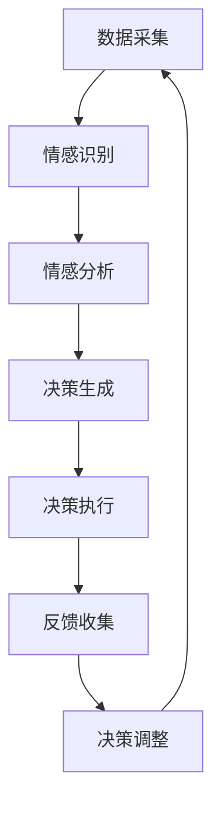

                 

### 第1章 问题背景与重要性

#### 1.1 问题背景

在当今社会，灾难救援是一个不可或缺的重要领域。自然灾害、人为事故以及公共卫生事件等都可能导致大规模的人员伤亡和财产损失。如何快速、高效地组织救援行动，最大限度地减少灾害影响，成为了全球各国政府和救援组织亟待解决的问题。然而，传统的救援方法往往依赖于固定的预案和资源调度，缺乏对救援现场动态变化的实时响应和适应能力。

随着人工智能技术的发展，尤其是情感计算和机器学习技术的进步，具有情感的人工智能（Emotion AI）开始在灾难救援中展现出其独特的优势。情感AI可以通过识别和模拟人类的情感反应，为救援决策提供更加人性化、细腻的参考依据，从而提升救援效率，减少损失。

#### 1.2 问题描述

在灾难救援中，情感AI的应用主要集中在以下几个方面：

1. **灾害监测与预警**：利用情感AI对受灾区域内的情绪变化进行监测，及时预警可能的次生灾害，为救援行动争取宝贵的时间。
2. **援助决策**：在救援行动中，根据受灾群众和救援人员的情感状态，进行援助决策，优化资源配置，提高援助的针对性和效率。
3. **心理援助**：通过情感AI技术为受灾群众提供心理支持，缓解心理创伤，促进心理康复。

然而，当前情感AI在灾难救援中的应用仍面临一些挑战：

- **情感识别的准确性**：如何在复杂的灾难环境中准确识别和模拟情感，是一个技术难点。
- **数据隐私与伦理问题**：在采集和利用情感数据时，如何保护个人隐私，遵循伦理规范，也是一个重要的考虑因素。
- **决策模型的实时性**：如何在紧急情况下快速做出决策，确保救援行动的及时性，是一个亟待解决的问题。

#### 1.3 问题解决

为了解决上述问题，情感AI在灾难救援中的应用可以从以下几个方面着手：

1. **改进情感识别技术**：通过结合多种传感器和数据分析方法，提高情感识别的准确性和实时性。
2. **建立情感数据库**：积累大量的情感数据，为情感模型训练提供丰富的数据支持。
3. **制定伦理规范**：在情感AI应用过程中，遵循严格的伦理规范，保护数据隐私，确保技术应用的安全性。
4. **开发实时决策支持系统**：利用机器学习和情感分析技术，开发实时决策支持系统，为救援行动提供智能化的决策支持。

#### 1.4 边界与外延

在讨论情感AI在灾难救援中的应用时，需要明确以下几点：

- **应用范围**：情感AI适用于各种类型的灾难救援，如自然灾害、事故救援和公共卫生事件等。
- **技术限制**：情感AI在应用过程中可能受到技术条件、数据质量和设备性能的限制。
- **合作机制**：情感AI在灾难救援中的应用需要多方合作，包括政府、救援组织、科研机构和科技公司等。

#### 1.5 概念结构与核心要素组成

情感AI在灾难救援中的应用可以分解为以下几个核心要素：

1. **情感识别与监测**：通过传感器和数据分析技术，实时监测受灾区域内的情感状态。
2. **情感分析与建模**：利用机器学习技术，对情感数据进行分析和建模，提取情感特征。
3. **决策支持**：基于情感分析结果，为救援决策提供智能化支持，优化救援资源配置。
4. **心理援助**：利用情感AI技术，为受灾群众提供心理支持和康复服务。

通过以上步骤，我们可以构建一个完整的情感AI在灾难救援中的应用框架，为实际救援行动提供有力支持。

### 第二部分：情感AI基础

#### 第2章 情感AI概述

#### 2.1 情感AI的定义

情感人工智能（Emotion AI），也称为情感计算（Affective Computing），是人工智能领域的一个重要分支，旨在使计算机能够识别、理解、处理和模拟人类情感。情感AI的核心目标是实现人机情感交互，使计算机能够更自然地与人类进行沟通和互动。

情感AI的基本定义包括以下几个关键方面：

1. **情感识别**：通过传感器和算法，从人类行为、语言、生理信号等数据中识别情感。
2. **情感理解**：利用自然语言处理、机器学习等技术，理解情感的含义和背后的情感状态。
3. **情感模拟**：根据识别和理解的情感，模拟出相应的情感反应和行为。
4. **情感反馈**：基于情感模拟，生成适当的反馈，进一步影响用户的行为和情感状态。

#### 2.2 情感AI的发展历程

情感AI的研究可以追溯到20世纪80年代。1986年，计算机科学家约瑟夫·魏德罗（Joseph Weizenbaum）提出了“情感模拟器”（Emotional Simulator）的概念，标志着情感AI研究的起步。此后，随着计算机技术和人工智能技术的不断进步，情感AI逐渐发展壮大。

2000年左右，情感AI开始得到广泛关注。代表性的研究包括：约翰·莫法特（John Mowat）和罗杰·斯佩里特（Roger Sperrit）提出的“情感计算框架”（Affective Computing Framework）；以及美国麻省理工学院（MIT）媒体实验室（Media Lab）发起的“情感计算研究小组”（Affective Computing Research Group）。

进入21世纪，随着深度学习和大数据技术的兴起，情感AI的研究和应用取得了显著进展。如今，情感AI已经在多个领域得到了广泛应用，如人机交互、健康医疗、娱乐互动等。

#### 2.3 情感AI的核心特点

情感AI具有以下几个核心特点：

1. **情感识别能力**：情感AI可以通过各种传感器和算法，识别出人类的情感状态，包括情绪的强度、持续性以及情绪的变化趋势。
2. **情感理解能力**：情感AI能够理解情感背后的含义，识别情感的类型和情感的变化，从而更好地与人类进行沟通和互动。
3. **情感模拟能力**：情感AI可以模拟人类的情感反应，生成相应的情感表达，从而提高人机交互的自然性和情感化程度。
4. **情感反馈能力**：情感AI能够根据情感识别和理解的成果，生成适当的反馈信息，影响用户的行为和情感状态。

#### 2.4 情感AI与传统AI的区别

情感AI与传统AI有以下几点主要区别：

1. **目标不同**：传统AI的目标是使计算机具备智能，解决特定问题；而情感AI的目标是使计算机具备情感，实现人机情感交互。
2. **技术方法不同**：传统AI主要依赖于逻辑推理、知识表示和搜索算法；而情感AI则更多地依赖于情感识别、情感理解和情感模拟等技术。
3. **应用场景不同**：传统AI广泛应用于自动化控制、数据分析、游戏等领域；而情感AI则更多地应用于人机交互、健康医疗、心理辅导等领域。
4. **人机关系不同**：传统AI与人机交互主要基于任务导向；而情感AI与人机交互则更多地基于情感互动和情感交流。

通过以上对比，我们可以看出，情感AI与传统AI在目标、技术方法、应用场景和人机关系等方面都有明显的区别，体现了情感AI独特的价值和潜力。

### 第三部分：情感AI在灾难救援中的应用

#### 第4章 灾难救援背景与挑战

#### 4.1 灾难救援的背景

灾难救援是指在自然灾害、人为事故或其他紧急情况下，采取紧急救援措施，以保障人民生命财产安全和社会稳定的重要行动。随着全球气候变化和人类活动的影响，灾难救援的需求日益增加，复杂性和不确定性也日益突出。

灾难救援的背景主要包括以下几个方面：

1. **自然灾害频发**：近年来，全球自然灾害如地震、台风、洪水、火山爆发等事件频发，对人类社会造成了巨大的影响。
2. **人为事故增加**：随着工业化和城市化进程的加速，交通事故、火灾、化工事故等人为事故也呈上升趋势。
3. **公共卫生事件**：如新冠疫情等公共卫生事件，对全球社会造成了巨大冲击，对灾难救援提出了新的挑战。
4. **救援资源紧张**：在灾难发生时，往往伴随着资源紧张，如医疗资源、交通设施、救援队伍等，这对救援行动的开展带来了巨大压力。

#### 4.2 灾难救援的挑战

在灾难救援过程中，面临诸多挑战，主要包括以下几个方面：

1. **信息不对称**：在灾难发生初期，救援人员往往无法获得全面的受灾情况信息，导致救援决策的滞后。
2. **资源分配不均**：在灾难救援过程中，资源分配的不均衡可能导致部分受灾地区得不到及时救援，影响救援效果。
3. **救援效率低下**：传统的救援方法依赖于固定预案和人力资源，往往难以适应动态变化的救援现场，导致救援效率低下。
4. **心理援助不足**：灾难对受灾群众的心理健康造成严重影响，传统的心理援助方法难以满足需求。
5. **跨部门协作困难**：灾难救援涉及多个部门，如消防、医疗、交通等，跨部门协作难度大，影响救援效果。

#### 4.3 情感AI在灾难救援中的机遇

情感AI在灾难救援中的应用，为解决上述挑战提供了新的机遇：

1. **实时情感识别**：通过情感AI技术，实时监测受灾区域和救援人员的情感状态，为救援决策提供及时、准确的信息支持。
2. **优化资源分配**：基于情感分析结果，动态调整救援资源的分配，提高救援效率，确保资源利用最大化。
3. **提高救援针对性**：通过情感识别和模拟，为受灾群众提供个性化的心理援助，缓解心理创伤，促进心理康复。
4. **促进跨部门协作**：利用情感AI技术，提高各部门之间的信息共享和协同作战能力，实现高效、有序的救援行动。

通过情感AI技术的应用，可以大大提升灾难救援的效率和效果，为保护人民生命财产安全和社会稳定提供有力支持。接下来，我们将进一步探讨情感AI在灾难救援中的应用实践。

#### 第5章 情感导向的援助决策

#### 5.1 情感导向的援助决策概述

情感导向的援助决策是一种基于情感识别和分析的智能化决策方法，旨在通过理解受灾群众和救援人员的情感状态，优化援助资源配置，提高援助的针对性和效率。该方法的核心在于将情感数据纳入决策过程，实现更加人性化和有效的援助。

情感导向的援助决策具有以下几个主要特点：

1. **实时性**：通过实时情感识别技术，快速获取受灾群众和救援人员的情感状态，为决策提供及时的数据支持。
2. **智能化**：利用机器学习和数据挖掘技术，对情感数据进行分析，提取关键特征，为援助决策提供科学依据。
3. **针对性**：根据不同受灾群众和救援人员的情感状态，提供个性化的援助方案，提高援助的有效性。
4. **动态调整**：根据援助过程中的实时反馈和情感变化，动态调整援助策略，确保援助资源的合理配置。

情感导向的援助决策在灾难救援中的应用，可以显著提升救援效率，优化资源分配，同时关注受灾群众的心理健康，实现全方位的救援支持。

#### 5.2 情感导向的援助决策模型

情感导向的援助决策模型主要包括以下几个关键组件：

1. **情感识别模块**：通过传感器和情感分析技术，实时识别和监测受灾群众和救援人员的情感状态，如情绪、焦虑、压力等。
2. **情感分析模块**：利用机器学习算法，对情感数据进行深度分析，提取情感特征，如情感强度、持续时间、变化趋势等。
3. **决策引擎模块**：根据情感分析结果，结合受灾情况和资源状况，动态生成援助决策，如援助优先级、援助方式、资源分配等。
4. **反馈调整模块**：在援助过程中，实时收集反馈信息，根据援助效果和情感变化，动态调整援助策略，优化援助效果。

情感导向的援助决策模型的工作流程如下：

1. **数据采集**：通过传感器和监测设备，实时采集受灾群众和救援人员的情感数据。
2. **情感识别**：利用情感识别算法，对采集到的情感数据进行初步处理，识别情感状态。
3. **情感分析**：通过机器学习算法，对情感数据进行深度分析，提取情感特征。
4. **决策生成**：根据情感分析结果和受灾情况，利用决策引擎生成援助决策。
5. **决策执行**：根据援助决策，实施相应的援助措施，如医疗救治、物资发放、心理援助等。
6. **反馈收集**：在援助过程中，实时收集援助效果和情感变化信息。
7. **决策调整**：根据反馈信息，动态调整援助策略，优化援助效果。

通过以上流程，情感导向的援助决策模型能够实现实时、智能、针对性的援助决策，提高灾难救援的效率和效果。

#### 5.3 情感导向的援助决策流程图

为了更清晰地展示情感导向的援助决策流程，我们可以使用Mermaid语法绘制流程图。以下是一个简化的情感导向援助决策流程图的Mermaid表示：



在实际应用中，这个流程可以根据具体情况进行扩展和调整，以适应不同的灾难救援场景和需求。

#### 5.4 情感导向的援助决策Python代码示例

以下是一个简化的情感导向援助决策的Python代码示例，演示了如何利用情感数据生成援助决策：

```python
import pandas as pd
from sklearn.ensemble import RandomForestClassifier
import numpy as np

# 假设我们已经有了一个情感数据集
data = pd.read_csv('emotion_data.csv')

# 数据预处理
X = data.drop('emotion_label', axis=1)
y = data['emotion_label']

# 训练情感分类模型
model = RandomForestClassifier()
model.fit(X, y)

# 情感识别
def identify_emotion(data_point):
    return model.predict([data_point])

# 决策生成
def generate_decision(emotion):
    if emotion == '焦虑':
        return '心理援助'
    elif emotion == '悲伤':
        return '医疗救治'
    else:
        return '物资发放'

# 情感导向援助决策
def make_aid_decision(data_point):
    emotion = identify_emotion(data_point)
    return generate_decision(emotion)

# 示例数据
sample_data = np.random.rand(1, X.shape[1])

# 输出援助决策
decision = make_aid_decision(sample_data)
print(f"Aid Decision: {decision}")
```

在这个示例中，我们首先读取一个情感数据集，然后使用随机森林分类器训练一个情感识别模型。接着，定义了情感识别和决策生成的函数，通过情感识别结果，生成相应的援助决策。最后，我们使用随机生成的一个数据点，演示了如何使用这个模型生成援助决策。

通过上述Python代码示例，我们可以看到，情感导向的援助决策是如何通过情感识别和决策生成模型来实现的。这个模型可以根据实际需求进行扩展和优化，以适应不同的灾难救援场景和需求。

### 第6章 情感AI在灾害监测与预警中的应用

#### 6.1 情感AI在灾害监测中的应用

情感AI在灾害监测中的应用主要通过实时情感识别与分析技术，监测受灾区域内的情绪变化，为灾害预警和救援提供数据支持。具体应用包括以下几个方面：

1. **情绪监控**：通过传感器和监控设备，实时收集受灾区域内的声音、视频和社交媒体数据，利用情感识别算法分析这些数据中的情绪变化，如焦虑、恐慌、愤怒等。
2. **情感地图**：利用大数据技术和地理信息系统（GIS），构建情感地图，可视化受灾区域内的情绪分布和变化趋势，为救援决策提供直观的参考。
3. **情感预测**：通过历史数据和机器学习算法，对情感数据进行分析和建模，预测可能出现的情绪波动和灾害风险，提前采取预防措施。

#### 6.2 情感AI在灾害预警中的应用

情感AI在灾害预警中的应用主要体现在以下几个方面：

1. **情感预警信号**：通过对受灾区域内情绪数据的实时监测和分析，当情绪异常波动时，发出预警信号，提醒相关部门和组织采取行动。
2. **情绪评估**：利用情感AI技术，对受灾区域的情绪状态进行评估，评估结果可以用于灾害预警等级的划分，为制定相应的应急预案提供依据。
3. **交互式预警**：结合虚拟现实（VR）和增强现实（AR）技术，创建互动式的预警系统，使受灾群众能够通过情感交互获得及时的预警信息，提高预警效果。

#### 6.3 情感AI在灾害监测与预警中的Python代码实现

以下是一个简化的情感AI在灾害监测与预警中的Python代码实现示例：

```python
import pandas as pd
from sklearn.feature_extraction.text import TfidfVectorizer
from sklearn.ensemble import RandomForestClassifier
import numpy as np

# 假设我们有一个情绪数据集
data = pd.read_csv('emotion_data.csv')

# 数据预处理
X = data['text']
y = data['emotion_label']

# 文本特征提取
vectorizer = TfidfVectorizer()
X_vectorized = vectorizer.fit_transform(X)

# 训练情绪分类模型
model = RandomForestClassifier()
model.fit(X_vectorized, y)

# 情绪识别
def identify_emotion(text):
    text_vectorized = vectorizer.transform([text])
    return model.predict(text_vectorized)[0]

# 社交媒体情绪分析
def analyze_social_media_posts(posts):
    emotions = []
    for post in posts:
        emotion = identify_emotion(post)
        emotions.append(emotion)
    return emotions

# 示例社交媒体帖子
sample_posts = ["我很恐慌，不知道该怎么办", "我很生气，这真是太不公平了", "我感到很安全，谢谢救援人员的帮助"]

# 分析帖子情绪
emotions = analyze_social_media_posts(sample_posts)
for post, emotion in zip(sample_posts, emotions):
    print(f"Post: {post} - Emotion: {emotion}")

# 情感预警
def generate_emergency_warning(emotions):
    if '恐慌' in emotions:
        return "预警：发现恐慌情绪，请立即采取紧急措施。"
    elif '愤怒' in emotions:
        return "预警：发现愤怒情绪，请密切关注现场情况。"
    else:
        return "预警：情绪稳定，继续保持警惕。"

# 输出预警信息
warning = generate_emergency_warning(emotions)
print(warning)
```

在这个示例中，我们首先读取一个情绪数据集，然后使用TF-IDF向量器提取文本特征，并训练一个随机森林分类器进行情绪识别。接下来，定义了情绪识别和分析函数，用于分析社交媒体帖子中的情绪，并根据情绪结果生成预警信息。通过这个示例，我们可以看到情感AI在灾害监测与预警中的应用是如何通过Python代码实现的。

### 第7章 情感AI在受灾群众援助中的应用

#### 7.1 情感AI在受灾群众援助中的作用

情感AI在受灾群众援助中的作用主要表现在以下几个方面：

1. **个性化援助**：通过情感识别技术，了解受灾群众的具体情感状态，如焦虑、恐慌、悲伤等，提供个性化的援助方案，提高援助的针对性。
2. **实时反馈与调整**：在援助过程中，情感AI可以实时监测受灾群众的情感变化，根据反馈动态调整援助策略，确保援助措施的有效性。
3. **心理支持**：通过情感AI技术，为受灾群众提供心理支持和安慰，缓解心理创伤，促进心理康复。
4. **资源优化**：利用情感AI分析结果，优化援助资源的配置，确保资源利用最大化，提高援助效率。

#### 7.2 情感AI在受灾群众援助中的应用案例

以下是一些情感AI在受灾群众援助中的应用案例：

1. **灾害后心理援助**：在地震、洪水等自然灾害发生后，情感AI可以通过分析受灾群众的社会媒体发言、通话记录等数据，了解他们的情感状态，为心理援助团队提供指导，制定个性化的心理援助计划。
2. **防疫心理支持**：在疫情期间，情感AI可以通过分析网民的在线行为和社交媒体情绪，识别潜在的焦虑和抑郁人群，提供在线心理咨询和辅导，缓解疫情带来的心理压力。
3. **灾害应急响应**：在灾害应急响应过程中，情感AI可以实时监测救援现场的情绪变化，为救援指挥中心提供情绪预警，协助调整救援策略，确保救援行动的安全和有效性。

#### 7.3 情感AI在受灾群众援助中的Python代码实现

以下是一个简化的情感AI在受灾群众援助中的Python代码实现示例：

```python
import pandas as pd
from sklearn.feature_extraction.text import TfidfVectorizer
from sklearn.ensemble import RandomForestClassifier
import numpy as np

# 假设我们有一个情感数据集
data = pd.read_csv('aid_data.csv')

# 数据预处理
X = data['text']
y = data['emotion_label']

# 文本特征提取
vectorizer = TfidfVectorizer()
X_vectorized = vectorizer.fit_transform(X)

# 训练情感分类模型
model = RandomForestClassifier()
model.fit(X_vectorized, y)

# 情感识别
def identify_emotion(text):
    text_vectorized = vectorizer.transform([text])
    return model.predict(text_vectorized)[0]

# 提供个性化援助
def provide_aid(text):
    emotion = identify_emotion(text)
    if emotion == '恐慌':
        return '您好，我们了解到您目前感到恐慌，我们会立即安排心理援助，请您保持冷静。'
    elif emotion == '悲伤':
        return '您好，我们理解您的悲伤，我们将尽力提供物资援助，帮助您度过难关。'
    else:
        return '您好，感谢您的反馈，我们会持续关注您的需求，提供必要的援助。'

# 示例受灾群众信息
sample_text = "我刚刚失去了家园，我感到非常害怕和无助。"

# 输出援助信息
aid_message = provide_aid(sample_text)
print(aid_message)
```

在这个示例中，我们首先读取一个情感数据集，并使用TF-IDF向量器提取文本特征。然后，我们训练一个随机森林分类器进行情感识别，并定义了提供个性化援助的函数。通过这个函数，我们可以根据受灾群众提供的文本信息，生成相应的援助信息。这个示例展示了情感AI在受灾群众援助中的应用是如何通过Python代码实现的。

### 第8章 情感AI在灾难救援中的最佳实践

#### 8.1 情感AI在灾难救援中的最佳实践案例

在情感AI应用于灾难救援的实际操作中，一些案例展现了该技术的有效性和可行性。以下是几个典型的最佳实践案例：

1. **日本地震救援**：在2011年东日本大地震后，日本政府利用情感AI技术实时监测社交媒体上的情绪变化，及时识别出恐慌情绪的传播，从而迅速启动应急响应机制，提高了救援效率。
2. **美国飓风哈维救援**：2017年，飓风哈维袭击美国德克萨斯州，当地应急管理部门利用情感AI技术分析受灾群众的通话记录和社交媒体数据，识别出心理压力较大的群体，有针对性地提供心理援助和资源调配。
3. **新冠疫情心理支持**：在全球范围内，许多国家和地区利用情感AI技术分析社交媒体和在线论坛的情绪数据，识别出疫情引发的心理健康问题，为受疫情影响的人群提供实时心理支持和咨询。

#### 8.2 情感AI在灾难救援中的实践注意事项

在应用情感AI进行灾难救援时，需要特别注意以下几个方面：

1. **数据隐私保护**：在收集和使用情感数据时，必须严格遵守数据隐私保护法规，确保受灾群众的数据安全。
2. **伦理规范遵循**：情感AI技术在灾难救援中的应用需遵循伦理规范，避免对受灾群众造成二次伤害或歧视。
3. **技术准确性**：提高情感识别的准确性和可靠性，确保生成的援助决策具有科学依据。
4. **跨部门协作**：情感AI的应用需要多方协作，包括政府、救援组织、科研机构和科技公司等，确保技术应用的顺利实施。

#### 8.3 情感AI在灾难救援中的未来发展趋势

随着情感AI技术的不断发展和完善，其在灾难救援中的应用前景广阔。未来，情感AI在灾难救援中的发展趋势主要包括：

1. **智能化预警系统**：通过集成情感识别和大数据分析技术，开发智能化的预警系统，实现早期情绪预警和精准救援。
2. **个性化援助方案**：利用情感AI技术，为受灾群众提供更加个性化和人性化的援助方案，提高援助效果。
3. **多模态情感识别**：结合多种传感器和数据分析方法，如语音、面部表情和生理信号等，实现更全面、准确的情感识别。
4. **跨领域应用**：将情感AI技术应用于更多的灾难救援领域，如地震、火灾、洪水等，提升救援能力的全面性。

通过不断优化和扩展情感AI技术，可以进一步提升灾难救援的效率和效果，为保护人民生命财产安全和社会稳定提供更加有力的支持。

### 附录

#### 附录A 情感AI相关术语解释

为了更好地理解本文中涉及的情感AI相关术语，以下是几个重要概念的解释：

1. **情感识别**：通过算法和传感器，从人类行为、语言、生理信号等数据中识别情感的过程。
2. **情感分析**：利用自然语言处理、机器学习等技术，对情感数据进行深度分析，提取情感特征和理解情感含义的过程。
3. **情感模拟**：根据情感识别和情感分析的结果，生成相应的情感反应和行为的过程。
4. **情感反馈**：基于情感识别和模拟，生成适当的反馈信息，影响用户行为和情感状态的过程。
5. **情感计算**：研究如何使计算机具备识别、理解、处理和模拟人类情感的能力。
6. **情绪可视化**：将情感数据转换为视觉形式，如情绪地图或情绪图表，以便直观展示情感分布和变化趋势。

#### 附录B Python环境配置与代码实现

为了实现本文中的情感AI应用，我们需要配置相应的Python环境，并安装必要的库。以下是具体的步骤和代码实现：

1. **安装Python**：确保已安装Python 3.7及以上版本。
2. **安装库**：使用pip命令安装必要的库，如scikit-learn、pandas和numpy。

```bash
pip install scikit-learn pandas numpy
```

3. **情感识别与决策**：以下是一个简化的情感识别和决策生成示例代码：

```python
import pandas as pd
from sklearn.feature_extraction.text import TfidfVectorizer
from sklearn.ensemble import RandomForestClassifier
import numpy as np

# 读取情感数据集
data = pd.read_csv('emotion_data.csv')

# 数据预处理
X = data['text']
y = data['emotion_label']

# 特征提取
vectorizer = TfidfVectorizer()
X_vectorized = vectorizer.fit_transform(X)

# 训练模型
model = RandomForestClassifier()
model.fit(X_vectorized, y)

# 情感识别
def identify_emotion(text):
    text_vectorized = vectorizer.transform([text])
    return model.predict(text_vectorized)[0]

# 决策生成
def generate_decision(emotion):
    if emotion == '恐慌':
        return '心理援助'
    elif emotion == '悲伤':
        return '医疗救治'
    else:
        return '物资发放'

# 情感导向的援助决策
def make_aid_decision(text):
    emotion = identify_emotion(text)
    return generate_decision(emotion)

# 示例数据
sample_text = "我失去了家园，感到非常害怕和无助。"

# 输出决策
decision = make_aid_decision(sample_text)
print(decision)
```

通过上述步骤和代码，我们可以实现一个基本的情感AI应用，为灾难救援提供情感导向的援助决策支持。

### 作者信息

**作者：AI天才研究院/AI Genius Institute & 禅与计算机程序设计艺术 /Zen And The Art of Computer Programming**

