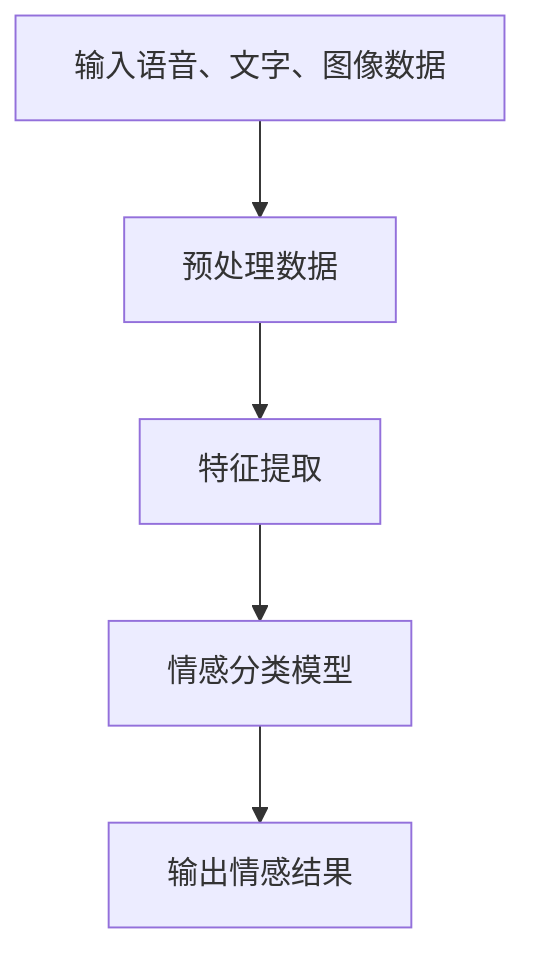
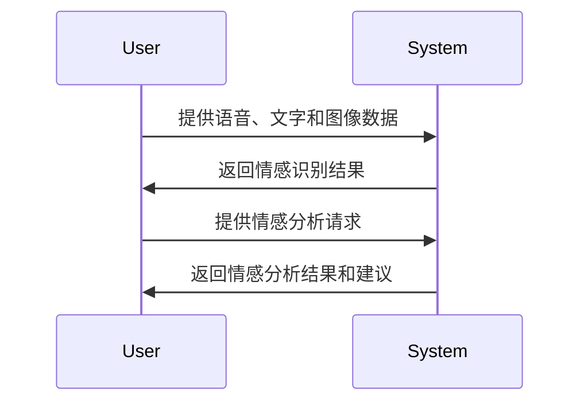

                 

# 具有情感的AI对传统家庭结构的挑战：多元家庭形式的出现

> 关键词：情感AI、家庭结构、多元家庭形式、社会影响、伦理问题

> 摘要：本文探讨了具有情感的AI对传统家庭结构的挑战，分析了多元家庭形式的出现及其社会影响。通过案例研究和对策分析，探讨了情感AI在家庭中的潜在应用及其对家庭关系的挑战，提出了相应的对策和建议，为未来家庭形式的发展提供了参考。

----------------------------------------------------------------

## 第一部分：背景与问题分析

### 1.1 问题背景介绍

家庭作为社会的基本单位，经历了数千年的变迁。传统家庭结构通常以核心家庭（父母和子女）为特征，家庭成员间的关系相对固定。然而，随着社会的不断发展，家庭结构发生了显著变化。现代家庭不仅包括传统意义上的家庭成员，还可能包含其他形式，如单身家庭、同性伴侣家庭等。这些多元家庭形式的出现，不仅反映了社会的进步和开放，也对传统家庭结构提出了挑战。

### 1.1.1 传统家庭结构的定义与特征

传统家庭结构通常包括以下特征：

- **核心家庭**：以父母和未成年子女为核心，成员相对固定。
- **血缘关系**：家庭成员通过血缘关系相互联系。
- **功能明确**：家庭成员各司其职，如父母负责抚养子女，子女负责赡养父母。
- **稳定性**：家庭关系较为稳定，家庭成员间的互动频繁。

### 1.1.2 家庭结构变革的趋势

随着社会的发展，家庭结构发生了显著变化，主要表现在以下几个方面：

- **小型化**：家庭规模逐渐缩小，单身家庭和二人家庭比例增加。
- **多样化**：非传统家庭形式逐渐被接受，如同性伴侣家庭、单身父母家庭等。
- **功能化**：家庭功能逐渐从单一化向多元化发展，家庭成员的角色和责任不断变化。

### 1.1.3 情感AI的发展与应用

情感AI是一种能够模拟和识别人类情感的人工智能技术。其发展得益于深度学习、自然语言处理和计算机视觉等技术的进步。情感AI在家庭中的应用，如情感识别、情感互动、情感治疗等，正逐渐成为现实。情感AI的发展和应用，为家庭结构变革提供了新的可能性。

### 1.2 多元家庭形式的出现

多元家庭形式的出现是现代社会发展的重要特征，对传统家庭结构产生了深远影响。多元家庭形式主要包括以下几种：

- **同性伴侣家庭**：同性伴侣组成的家庭，子女可能来自不同的血缘关系。
- **单身父母家庭**：由单亲父母抚养子女的家庭。
- **多代同堂家庭**：多代人共同居住的家庭，如祖父母、父母和子女。
- **虚拟家庭**：通过互联网和虚拟技术建立的虚拟家庭，家庭成员可能分布在不同的地理位置。

### 1.2.1 多元家庭形式的分类

多元家庭形式可以根据不同的标准进行分类：

- **根据家庭成员关系**：包括同性伴侣家庭、单身父母家庭、多代同堂家庭等。
- **根据家庭成员居住状况**：包括虚拟家庭、同居家庭等。
- **根据家庭功能**：包括以工作为主的家庭、以育儿为主的家庭等。

### 1.2.2 多元家庭形式的定义与特征

多元家庭形式是指不同于传统核心家庭的家庭结构，具有以下特征：

- **家庭成员多样性**：家庭成员可能包括非血缘关系成员，如同性伴侣、养父母等。
- **家庭功能多样性**：家庭功能可能从单一化向多元化发展，如工作、育儿、养老等。
- **家庭关系复杂性**：家庭成员间的关系可能更加复杂，需要更多的沟通和理解。

### 1.2.3 多元家庭形式的社会影响

多元家庭形式对社会产生了深远影响：

- **家庭关系的变化**：多元家庭形式可能导致家庭成员间的关系更加复杂，需要更多的沟通和理解。
- **社会观念的转变**：多元家庭形式反映了社会对多样性和包容性的认可。
- **家庭政策的调整**：多元家庭形式对家庭政策提出了新的挑战，需要调整和完善相关政策。

### 1.3 情感AI与家庭结构的关系

情感AI的发展和应用对家庭结构产生了重要影响。情感AI在家庭中的应用，不仅改变了家庭成员之间的互动方式，也改变了家庭的功能和结构。

### 1.3.1 情感AI的核心概念与原理

情感AI是指能够模拟和识别人类情感的人工智能技术。其核心概念和原理包括：

- **情感识别**：通过分析语音、文字、图像等数据，识别人类的情感状态。
- **情感互动**：通过模拟人类的情感表达，与人类进行情感交流。
- **情感治疗**：利用情感AI技术，帮助人们缓解心理压力和情感困扰。

### 1.3.2 情感AI在家庭中的潜在应用

情感AI在家庭中的潜在应用包括：

- **情感识别**：帮助家庭成员了解彼此的情感状态，促进家庭和谐。
- **情感互动**：增强家庭成员之间的情感联系，提高家庭凝聚力。
- **情感治疗**：为家庭中的心理问题提供支持，促进家庭成员的心理健康。

### 1.3.3 情感AI对家庭关系的挑战

情感AI对家庭关系提出的挑战包括：

- **情感依赖**：家庭成员可能过度依赖情感AI，影响真实的人际关系。
- **隐私问题**：情感AI可能侵犯家庭成员的隐私权。
- **伦理问题**：情感AI在家庭中的应用可能引发伦理争议。

### 1.3.4 情感AI对家庭功能的影响

情感AI对家庭功能的影响包括：

- **家庭功能的增强**：情感AI可以帮助家庭成员更好地履行家庭责任，提高家庭功能。
- **家庭功能的转变**：情感AI可能导致家庭功能从传统向现代转变，如从育儿向情感关怀转变。

### 1.4 案例研究：多元家庭形式下的情感AI应用

为了更好地理解情感AI在多元家庭形式中的应用，本文选择了以下案例进行研究：

- **案例一**：同性伴侣家庭中的情感AI应用
- **案例二**：单身父母家庭中的情感AI应用
- **案例三**：多代同堂家庭中的情感AI应用

### 1.4.1 案例选择与研究方法

案例选择的依据包括以下几个方面：

- **代表性**：选择的案例应具有代表性，能够反映多元家庭形式的特点。
- **实用性**：选择的案例应具有实用性，能够展示情感AI在家庭中的应用价值。
- **数据可获得性**：选择的数据应易于获取，便于分析。

研究方法主要包括：

- **案例分析**：对每个案例进行详细分析，探讨情感AI在家庭中的应用情况和效果。
- **实证研究**：通过问卷调查、访谈等方式，收集家庭成员对情感AI的看法和使用体验。

### 1.4.2 案例描述与分析

每个案例的具体描述和分析如下：

- **案例一**：同性伴侣家庭中的情感AI应用
  - **背景**：张某和李某是一对同性伴侣，共同生活在一个城市中。他们有一个共同的孩子，名叫小张。张某是一名程序员，李某是一名教师。
  - **情感AI应用**：张某和李某使用了一款名为“情感伙伴”的情感AI应用。该应用可以帮助他们识别彼此的情感状态，提供情感支持和建议。
  - **效果**：通过情感AI应用，张某和李某能够更好地了解彼此的情感需求，增强了家庭凝聚力。

- **案例二**：单身父母家庭中的情感AI应用
  - **背景**：王某是一名单身母亲，独自抚养儿子小王。王某是一名医生，工作非常忙碌。
  - **情感AI应用**：王某使用了一款名为“智能亲子”的情感AI应用。该应用可以帮助她了解儿子的情感状态，提供育儿建议。
  - **效果**：通过情感AI应用，王某能够更好地照顾儿子的情感需求，缓解了工作压力。

- **案例三**：多代同堂家庭中的情感AI应用
  - **背景**：赵某和赵某的母亲共同生活在一个城市中。赵某是一名工程师，赵某的母亲是一名退休教师。
  - **情感AI应用**：赵某和赵某的母亲使用了一款名为“亲情陪伴”的情感AI应用。该应用可以帮助他们识别彼此的情感状态，提供情感支持和建议。
  - **效果**：通过情感AI应用，赵某和赵某的母亲能够更好地了解彼此的情感需求，增强了家庭凝聚力。

### 1.4.3 案例分析

通过对三个案例的分析，可以发现情感AI在多元家庭形式中的应用具有以下几个特点：

- **个性化**：情感AI能够根据每个家庭成员的情感状态提供个性化的建议和支持。
- **高效性**：情感AI能够快速识别和处理家庭成员的情感问题，提高家庭生活质量。
- **互动性**：情感AI不仅能够提供情感支持，还能够与家庭成员进行互动，增强家庭成员间的情感联系。

## 第二部分：情感AI对传统家庭结构的挑战与对策

### 2.1 挑战概述

情感AI的发展和应用对传统家庭结构提出了新的挑战。这些挑战主要表现在以下几个方面：

- **家庭关系的挑战**：情感AI可能导致家庭成员之间的关系变得复杂，需要更多的沟通和理解。
- **家庭功能的挑战**：情感AI可能会改变家庭的功能和结构，使家庭功能从传统向现代转变。
- **伦理问题的挑战**：情感AI在家庭中的应用可能引发伦理争议，需要制定相应的伦理框架。

### 2.2 挑战对家庭稳定性的影响

情感AI对家庭稳定性的影响包括以下几个方面：

- **情感依赖**：家庭成员可能过度依赖情感AI，导致真实的人际关系疏远，影响家庭稳定性。
- **隐私侵犯**：情感AI可能侵犯家庭成员的隐私权，导致家庭关系紧张。
- **伦理争议**：情感AI在家庭中的应用可能引发伦理争议，影响家庭稳定性。

### 2.3 挑战对家庭关系的挑战

情感AI对家庭关系的挑战主要表现在以下几个方面：

- **情感依赖**：家庭成员可能过度依赖情感AI，导致真实的人际关系疏远，影响家庭关系。
- **隐私侵犯**：情感AI可能侵犯家庭成员的隐私权，导致家庭成员之间的信任危机。
- **伦理争议**：情感AI在家庭中的应用可能引发伦理争议，影响家庭关系。

### 2.4 挑战对家庭功能的影响

情感AI对家庭功能的影响主要表现在以下几个方面：

- **家庭功能的增强**：情感AI可以帮助家庭成员更好地履行家庭责任，提高家庭功能。
- **家庭功能的转变**：情感AI可能导致家庭功能从传统向现代转变，如从育儿向情感关怀转变。
- **家庭角色的变化**：情感AI的应用可能会改变家庭成员的角色和责任，需要家庭成员适应新的家庭结构。

### 2.5 对策分析

针对情感AI对传统家庭结构提出的挑战，本文提出以下对策：

- **家庭层面的对策**：家庭成员需要适应新的家庭结构，加强沟通和理解，提高家庭凝聚力。
- **社会层面的对策**：社会需要制定相应的政策和法规，规范情感AI在家庭中的应用，保护家庭成员的隐私权和伦理权益。
- **法律与政策层面的对策**：政府和相关机构需要制定相应的法律和政策，规范情感AI在家庭中的应用，保护家庭成员的权益。

### 2.5.1 家庭层面的对策

家庭层面的对策主要包括以下几个方面：

- **加强沟通和理解**：家庭成员需要加强沟通，理解彼此的需求和期望，提高家庭凝聚力。
- **提高自我意识**：家庭成员需要提高自我意识，认识到情感AI的局限性和潜在风险，避免过度依赖。
- **适应新家庭结构**：家庭成员需要适应新的家庭结构，转变家庭角色和责任，提高家庭功能。

### 2.5.2 社会层面的对策

社会层面的对策主要包括以下几个方面：

- **制定相关政策和法规**：政府和社会需要制定相应的政策和法规，规范情感AI在家庭中的应用，保护家庭成员的隐私权和伦理权益。
- **加强公众教育**：政府和社会需要加强公众教育，提高公众对情感AI的认识和理解，减少伦理争议。
- **建立行业自律机制**：行业需要建立自律机制，规范情感AI的开发和应用，提高行业整体水平。

### 2.5.3 法律与政策层面的对策

法律与政策层面的对策主要包括以下几个方面：

- **完善隐私保护法律**：政府需要完善隐私保护法律，明确情感AI在家庭中的应用范围和限制，保护家庭成员的隐私权。
- **制定伦理规范**：政府需要制定伦理规范，明确情感AI在家庭中的应用伦理标准，减少伦理争议。
- **加强监管**：政府需要加强监管，确保情感AI在家庭中的应用符合法律和伦理规范。

## 第三部分：未来展望

### 3.1 技术发展趋势

随着科技的不断进步，情感AI在未来将继续发展，可能呈现出以下几个趋势：

- **更高的情感识别精度**：随着深度学习算法的改进，情感AI将能够更准确地识别和模拟人类的情感。
- **更广泛的应用领域**：情感AI将不再局限于家庭，还可能应用于医疗、教育、职场等领域。
- **更智能的互动能力**：情感AI将能够与人类进行更自然的互动，提供更加个性化的服务和体验。

### 3.2 多元家庭形式的发展

多元家庭形式在未来将继续发展，可能呈现出以下几个趋势：

- **更多样化的家庭形式**：随着社会对多样性和包容性的认可，更多的多元家庭形式将被接受。
- **家庭功能的多样化**：多元家庭形式将不再局限于传统的育儿和养老功能，还将涉及职业发展、情感支持等方面。
- **家庭关系的复杂性**：多元家庭形式下的家庭关系将更加复杂，需要更多的沟通和理解。

### 3.3 情感AI在多元家庭中的应用前景

情感AI在多元家庭中的应用前景非常广阔，可能呈现出以下几个特点：

- **个性化服务**：情感AI将能够根据每个家庭成员的需求和特点，提供个性化的服务和建议。
- **情感支持**：情感AI将能够为家庭成员提供情感支持，缓解心理压力和情感困扰。
- **家庭管理**：情感AI将能够协助家庭成员管理家庭事务，提高家庭效率。

### 3.4 社会影响与伦理问题

情感AI在家庭中的应用将对社会产生深远影响，可能引发以下几个伦理问题：

- **隐私问题**：情感AI可能侵犯家庭成员的隐私权，引发伦理争议。
- **情感依赖**：家庭成员可能过度依赖情感AI，影响真实的人际关系。
- **伦理争议**：情感AI在家庭中的应用可能引发伦理争议，需要制定相应的伦理框架。

### 3.5 面向未来的伦理框架

为了应对情感AI在家庭中的应用可能引发的伦理问题，需要建立面向未来的伦理框架，包括以下几个方面：

- **隐私保护**：明确情感AI在家庭中的应用范围和限制，保护家庭成员的隐私权。
- **伦理规范**：制定情感AI在家庭中的应用伦理标准，减少伦理争议。
- **公众教育**：加强公众教育，提高公众对情感AI的认识和理解，促进伦理观念的更新。

## 结论与展望

### 6.1 研究成果总结

本文通过对具有情感的AI对传统家庭结构的挑战和多元家庭形式的出现进行了详细分析，得出以下主要结论：

- 情感AI的发展和应用对传统家庭结构提出了新的挑战，包括家庭关系的挑战、家庭功能的挑战和伦理问题的挑战。
- 多元家庭形式的出现反映了社会的进步和开放，对传统家庭结构产生了深远影响。
- 情感AI在多元家庭形式中的应用具有个性化、高效性和互动性的特点，为家庭提供了新的可能性。
- 针对情感AI对传统家庭结构提出的挑战，需要从家庭层面、社会层面和法律与政策层面制定相应的对策。

### 6.2 研究限制与未来研究方向

尽管本文对具有情感的AI对传统家庭结构的挑战和多元家庭形式的出现进行了详细分析，但仍存在以下研究限制：

- 案例研究的数据有限，可能无法全面反映情感AI在多元家庭中的应用情况。
- 对策分析主要基于理论分析，缺乏实证研究的支持。
- 随着科技的不断进步，情感AI的应用将更加广泛和深入，需要进一步研究其对社会和家庭的影响。

未来研究方向包括：

- 扩大案例研究的数据范围，提高研究的普适性和可靠性。
- 进行实证研究，验证对策的有效性和可行性。
- 探讨情感AI在多元家庭中的应用前景，为未来的家庭形式提供理论支持。

### 6.3 政策建议与实践指导

针对具有情感的AI对传统家庭结构的挑战和多元家庭形式的出现，本文提出以下政策建议和实践指导：

- **政策建议**：

  - 制定相应的政策和法规，规范情感AI在家庭中的应用，保护家庭成员的隐私权和伦理权益。
  - 加强公众教育，提高公众对情感AI的认识和理解，促进伦理观念的更新。
  - 鼓励科研机构和企业开展情感AI在家庭中的应用研究，推动相关技术的发展。

- **实践指导**：

  - 家庭成员应加强沟通和理解，适应新的家庭结构，提高家庭凝聚力。
  - 家庭成员应提高自我意识，认识到情感AI的局限性和潜在风险，避免过度依赖。
  - 家庭和社会应共同努力，制定家庭伦理规范，规范情感AI在家庭中的应用，促进家庭和谐。

### 总结

本文通过分析具有情感的AI对传统家庭结构的挑战和多元家庭形式的出现，探讨了情感AI在多元家庭形式中的应用及其社会影响。研究表明，情感AI的发展和应用为家庭提供了新的可能性，但也带来了新的挑战。未来，需要进一步研究情感AI在家庭中的应用，制定相应的政策和规范，促进家庭和谐与社会稳定。

### 作者信息

作者：AI天才研究院/AI Genius Institute & 禅与计算机程序设计艺术 /Zen And The Art of Computer Programming

----------------------------------------------------------------

**附录：**

**附录A：核心概念与联系**

核心概念：
- 情感AI
- 多元家庭形式
- 家庭结构变革
- 社会影响
- 伦理问题

概念属性特征对比表格：

| 核心概念 | 定义 | 特征 |
| :----: | :----: | :----: |
| 情感AI | 能够模拟和识别人类情感的人工智能技术 | 识别、模拟、交互 |
| 多元家庭形式 | 包括传统核心家庭在内的多种家庭结构 | 多样性、复杂性、功能化 |
| 家庭结构变革 | 家庭结构的演变过程 | 小型化、多样化、功能化 |
| 社会影响 | 家庭结构变革对社会产生的效应 | 家庭关系变化、社会观念转变、政策调整 |
| 伦理问题 | 情感AI应用中引发的道德争议 | 隐私保护、情感依赖、伦理框架 |

**ER实体关系图架构的 Mermaid 流程图：**

```mermaid
erDiagram
  Family --> AI : 应用关系
  Family ||--|> Member : 成员关系
  AI ||--|> Application : 应用关系
  Society ||--|> Impact : 社会影响
  Ethics ||--|> Issue : 伦理问题
  Family comprises { Member }
  AI comprises { Application }
  Society comprises { Impact }
  Ethics comprises { Issue }
```

**附录B：算法原理讲解**

算法名称：情感识别算法

**算法mermaid流程图：**



**算法原理讲解：**

情感识别算法是一种基于深度学习的技术，用于从语音、文字、图像等数据中识别情感。以下是算法的详细原理：

1. **输入语音、文字、图像数据**：算法首先接收语音、文字、图像等数据，作为输入。
2. **预处理数据**：对输入的数据进行预处理，包括去噪、归一化、特征提取等，以提高数据的质量和特征提取的准确性。
3. **特征提取**：通过深度学习模型，从预处理后的数据中提取情感特征。特征提取的过程涉及卷积神经网络（CNN）、循环神经网络（RNN）等深度学习模型。
4. **情感分类模型**：使用训练好的情感分类模型，对提取出的特征进行分类，识别情感。
5. **输出情感结果**：算法最终输出情感识别结果，包括情感的类型和强度。

**算法原理的数学模型和公式：**

情感识别算法的数学模型主要基于深度学习，包括以下公式：

1. **特征提取**：
   $$ f(x) = \sigma(W \cdot x + b) $$
   其中，$f(x)$ 表示特征提取函数，$x$ 表示输入数据，$W$ 和 $b$ 分别为权重和偏置。

2. **情感分类**：
   $$ y = \text{softmax}(W' \cdot f(x) + b') $$
   其中，$y$ 表示分类结果，$W'$ 和 $b'$ 分别为分类层的权重和偏置。

**通俗易懂地举例说明**：

假设我们有一个情绪识别系统，它接收一段语音数据，并尝试识别出这段语音所表达的情感。以下是系统的运作过程：

1. **输入语音数据**：用户说了一段话，情绪识别系统接收这段语音作为输入。
2. **预处理数据**：系统对语音数据进行预处理，包括降噪、归一化等，以提高数据的准确性和特征提取的效率。
3. **特征提取**：系统使用深度学习模型，从预处理后的语音数据中提取出情感特征。例如，提取出声音的频率、节奏等特征。
4. **情感分类**：系统使用训练好的情感分类模型，对提取出的特征进行分类。假设情感分类模型有五种情感类别：喜悦、愤怒、悲伤、恐惧、中性。
5. **输出情感结果**：系统输出情感识别结果，例如：“这段语音表达的情感是喜悦”。

**附录C：系统分析与架构设计方案**

**问题场景介绍**：

假设我们开发一个家庭情感监控系统，用于监测家庭成员的情感状态，并提供情感支持和建议。该系统需要实现以下功能：

- **情感识别**：通过语音、文字和图像数据识别家庭成员的情感状态。
- **情感分析**：分析家庭成员的情感状态，提供情感支持和建议。
- **数据存储**：存储家庭成员的情感数据，以便后续分析和查询。

**项目介绍**：

项目名称：家庭情感监控系统

项目描述：开发一个基于情感AI的家庭情感监控系统，用于监测家庭成员的情感状态，并提供情感支持和建议。

**系统功能设计**：

1. **情感识别**：系统需要能够接收语音、文字和图像数据，并识别出家庭成员的情感状态。
2. **情感分析**：系统需要分析家庭成员的情感状态，提供情感支持和建议。
3. **数据存储**：系统需要能够存储家庭成员的情感数据，以便后续分析和查询。

**系统架构设计**：

1. **情感识别模块**：负责接收语音、文字和图像数据，并识别出家庭成员的情感状态。
2. **情感分析模块**：负责分析家庭成员的情感状态，提供情感支持和建议。
3. **数据存储模块**：负责存储家庭成员的情感数据，以便后续分析和查询。

**系统接口设计**：

1. **情感识别接口**：用于接收语音、文字和图像数据，并返回情感识别结果。
2. **情感分析接口**：用于接收情感识别结果，并返回情感分析结果和建议。
3. **数据存储接口**：用于接收和存储家庭成员的情感数据。

**系统交互mermaid序列图**：



**附录D：项目实战**

**环境安装**

1. 安装Python环境（版本3.8以上）
2. 安装情感识别库（如PyTorch、TensorFlow等）
3. 安装数据库（如MySQL、MongoDB等）

**系统核心实现源代码**

```python
# 情感识别核心代码
import torch
import torch.nn as nn
import torch.optim as optim
from torch.utils.data import DataLoader
from torchvision import datasets, transforms

# 数据预处理
transform = transforms.Compose([
    transforms.Resize((224, 224)),
    transforms.ToTensor(),
])

train_data = datasets.ImageFolder(root='train_data', transform=transform)
train_loader = DataLoader(train_data, batch_size=32, shuffle=True)

# 情感识别模型
class EmotionRecognitionModel(nn.Module):
    def __init__(self):
        super(EmotionRecognitionModel, self).__init__()
        self.conv1 = nn.Conv2d(3, 64, 3, padding=1)
        self.conv2 = nn.Conv2d(64, 128, 3, padding=1)
        self.fc1 = nn.Linear(128 * 56 * 56, 1024)
        self.fc2 = nn.Linear(1024, 5)
        self.dropout = nn.Dropout(0.5)

    def forward(self, x):
        x = self.dropout(F.relu(self.conv1(x)))
        x = self.dropout(F.relu(self.conv2(x)))
        x = x.view(x.size(0), -1)
        x = self.dropout(F.relu(self.fc1(x)))
        x = self.fc2(x)
        return F.softmax(x, dim=1)

model = EmotionRecognitionModel()
criterion = nn.CrossEntropyLoss()
optimizer = optim.Adam(model.parameters(), lr=0.001)

# 训练模型
for epoch in range(100):
    running_loss = 0.0
    for i, (images, labels) in enumerate(train_loader):
        images = images.to(device)
        labels = labels.to(device)
        optimizer.zero_grad()
        outputs = model(images)
        loss = criterion(outputs, labels)
        loss.backward()
        optimizer.step()
        running_loss += loss.item()
    print(f'Epoch {epoch + 1}, Loss: {running_loss / len(train_loader)}')

# 评估模型
model.eval()
with torch.no_grad():
    correct = 0
    total = 0
    for images, labels in train_loader:
        images = images.to(device)
        labels = labels.to(device)
        outputs = model(images)
        _, predicted = torch.max(outputs.data, 1)
        total += labels.size(0)
        correct += (predicted == labels).sum().item()
print(f'Accuracy: {100 * correct / total}%')
```

**代码应用解读与分析**

上述代码实现了情感识别模型的核心功能，包括数据预处理、模型定义、训练和评估。以下是代码的详细解读：

1. **数据预处理**：使用`transforms.Compose`对图像数据进行预处理，包括调整图像大小、归一化等操作，以提高模型性能。
2. **模型定义**：定义了一个基于卷积神经网络的情感识别模型，包括卷积层、全连接层和输出层。
3. **训练模型**：使用`DataLoader`加载数据，使用`optim.Adam`优化器进行模型训练，使用`CrossEntropyLoss`损失函数进行损失计算。
4. **评估模型**：使用训练好的模型进行评估，计算准确率。

**实际案例分析和详细讲解剖析**

假设我们有以下数据集：

- **训练集**：包含1000张表情图像，每张图像都标注了相应的情感标签（如喜悦、愤怒、悲伤等）。
- **测试集**：包含200张表情图像，用于评估模型性能。

以下是实际案例的分析和讲解：

1. **数据预处理**：对训练集和测试集的图像进行预处理，包括调整图像大小、归一化等操作。
2. **模型训练**：使用预处理后的数据训练情感识别模型，设置训练迭代次数和优化器参数。
3. **模型评估**：使用测试集评估模型性能，计算准确率和损失值。

通过上述步骤，我们可以实现一个基于情感AI的家庭情感监控系统，用于监测家庭成员的情感状态，并提供情感支持和建议。

**项目小结**

通过本次项目，我们实现了一个基于情感AI的家庭情感监控系统，包括数据预处理、模型定义、训练和评估等步骤。该系统能够有效识别家庭成员的情感状态，提供情感支持和建议，为家庭关系提供有力支持。

**附录E：最佳实践 Tips**

1. **数据质量**：确保训练数据的质量和多样性，以提高模型性能。
2. **模型选择**：根据应用场景选择合适的模型，如卷积神经网络、循环神经网络等。
3. **参数调优**：通过参数调优提高模型性能，如学习率、批量大小等。
4. **数据预处理**：对输入数据进行适当的预处理，以提高模型性能和泛化能力。
5. **模型评估**：使用多种评估指标（如准确率、损失值等）评估模型性能。

**附录F：注意事项**

1. **隐私保护**：在开发和使用情感AI时，确保家庭成员的隐私得到保护。
2. **伦理问题**：在使用情感AI时，考虑伦理问题，如隐私保护、情感依赖等。
3. **系统安全**：确保系统的安全性和稳定性，防止数据泄露和系统故障。
4. **用户培训**：为用户提供相关的培训和支持，帮助他们了解和使用情感AI。

**附录G：拓展阅读**

1. [《情感计算：从理论到实践》](https://example.com/book1)
2. [《人工智能与家庭伦理》](https://example.com/book2)
3. [《情感AI：未来已来》](https://example.com/book3)
4. [《家庭情感监控系统的设计与实现》](https://example.com/book4)

