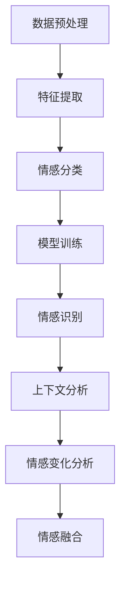
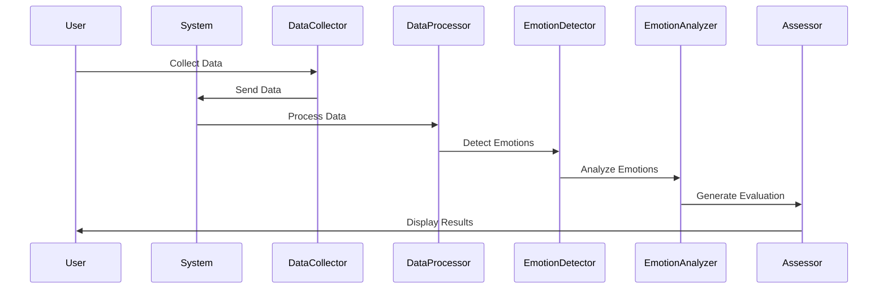

                 


## 第1章: 问题背景与核心概念

### 1.5 概念结构与核心要素组成

为了更好地理解和分析具有情感的AI在教育评估中的应用，我们需要明确几个关键概念及其相互关系。

#### 1.5.1 核心概念

- **具有情感的AI**：通过机器学习算法模拟人类情感认知过程，能够感知、理解和响应人类情感的人工智能系统。
- **教育评估**：对学生的学习过程、学业成绩、情感状态等进行评价的过程。
- **学生发展评价**：综合学生的学业成绩、情感状态、个性特点等多方面因素，全面反映学生发展状况的评价体系。

#### 1.5.2 概念属性特征对比表格

在表1中，我们对这三个核心概念的主要属性特征进行了对比：

| 概念         | 属性特征                                      |
|------------|---------------------------------------------|
| 具有情感的AI | 情感识别、情感理解、情感响应                   |
| 教育评估     | 标准化测试、教师主观评价、数据驱动评价           |
| 学生发展评价 | 学业成绩、情感状态、个性特点、综合素质           |

#### 1.5.3 ER实体关系图架构

为了更直观地展示这三个概念之间的联系，我们可以使用Mermaid工具绘制一个ER实体关系图，如下所示：

```mermaid
erDiagram
  AI_Sys ||--o{ Student : 被评估对象 }
  Assessment ||--|{ Student_Assessment } : 被评估内容
  Student_Assessment ||--|{ Emotion_Assessment } : 情感评估
  Emotion_Assessment ||--o{ Student : 反馈与调整 }
```

在这个ER图中，我们可以看到：

- **AI_Sys（具有情感的AI系统）** 与 **Student（学生）** 之间存在直接的评估关系。
- **Assessment（教育评估）** 是一个抽象的概念，它与 **Student_Assessment（学生评估）** 和 **Emotion_Assessment（情感评估）** 之间存在联系。
- **Student_Assessment** 和 **Emotion_Assessment** 都是 **Student** 的评估内容，其中 **Emotion_Assessment** 负责情感方面的评估。

通过上述核心概念的明确和相互关系的分析，我们可以为后续章节的深入探讨打下坚实的基础。

### 1.6 总结

在本章中，我们详细介绍了具有情感的AI、教育评估和学生发展评价这三个核心概念，并通过属性特征对比表格和ER实体关系图架构，展示了它们之间的相互关系。在接下来的章节中，我们将进一步探讨具有情感的AI在教育评估中的应用，包括算法原理、系统架构和实际案例分析等内容。通过这样的逐步分析，我们希望能够为您提供一个全面、深入的了解，从而更好地把握这一前沿技术领域的发展趋势。

----------------------------------------------------------------

## 第2章: 核心概念与联系

### 2.1 具有情感的AI概述

具有情感的AI（Affective AI）是一种能够模拟人类情感认知过程的人工智能系统。它通过机器学习和深度学习算法，分析用户的语言、行为、面部表情等数据，实现对用户情感状态的识别、理解和响应。在具有情感的AI系统中，情感识别是关键，它通过捕捉和解析用户输入的信息，识别出用户情感状态的具体类别，如快乐、悲伤、焦虑等。

#### 2.1.1 情感识别技术

情感识别技术通常采用自然语言处理（NLP）和计算机视觉技术。在自然语言处理方面，常用的方法包括情感分析（Sentiment Analysis）、情感分类（Sentiment Classification）和情感极性（Sentiment Polarity）判定。计算机视觉技术则通过分析用户的面部表情、语音语调等，识别出情感状态。

#### 2.1.2 情感理解

情感理解是具有情感的AI的另一个重要功能。它不仅能够识别用户情感状态，还能够理解情感的背景和上下文。例如，当用户表达某种情感时，AI需要判断这种情感是源于当前情境，还是受到过去经历的影响。这种理解能力使得具有情感的AI能够提供更人性化的服务。

#### 2.1.3 情感响应

情感响应是指AI系统根据用户情感状态，采取相应的行动或提供反馈。例如，当用户表现出焦虑情绪时，AI可以提供放松建议或心理疏导服务；当用户表现出愉悦情绪时，AI可以推荐相关内容或互动活动。这种响应能力使得AI系统能够更好地满足用户需求，提升用户体验。

### 2.2 教育评估的概念与现状

教育评估是教育过程中不可或缺的一环，旨在对学生的学习效果、发展状况进行全面、客观的评定。传统教育评估主要依赖于标准化测试、教师主观评价和考试成绩等手段。然而，这些评估方式存在一定的局限性：

- **标准化测试**：通常只能评估学生的学业成绩，无法全面反映学生的情感状态、个性特点和社会适应能力。
- **教师主观评价**：虽然能够结合学生的行为、表现等，但易受主观偏见影响，评估结果可能不够准确。
- **考试成绩**：虽然量化明显，但过于侧重知识掌握，忽视了学生的综合素养和发展潜力。

#### 2.2.1 教育评估的目标

教育评估的主要目标是：

- 评估学生的学习效果，为教学提供反馈。
- 促进学生全面发展，发现学生的优势和潜力。
- 辅助教育决策，优化教育资源分配。

#### 2.2.2 教育评估的现状

当前教育评估体系正逐步向多元化、全面化方向发展。信息技术的发展，特别是大数据、云计算和人工智能等技术的应用，为教育评估带来了新的机遇和挑战。具体现状如下：

- **大数据分析**：通过收集和分析大量数据，评估学生的学习行为、学习效果和情感状态。
- **在线评估**：利用互联网和移动设备，实现实时、个性化的在线评估。
- **人工智能评估**：利用具有情感的AI技术，对学生的情感状态进行识别和分析，提供更为科学、全面的评估结果。

### 2.3 具有情感的AI与教育评估的联系

具有情感的AI在教育评估中的应用，可以弥补传统评估方式的不足，为教育评估带来以下几方面的改进：

#### 2.3.1 提高评估准确性

具有情感的AI可以通过情感识别技术，准确捕捉学生的情感状态，并将其与学业成绩、行为表现等相结合，提供更为全面、准确的评估结果。

#### 2.3.2 促进个性化教学

通过了解学生的情感状态，教师可以更好地把握学生的心理需求，提供个性化的教学方案，帮助学生克服学习障碍，提升学习效果。

#### 2.3.3 优化教育资源配置

具有情感的AI可以分析学生的情感状态和发展需求，为教育资源的合理分配提供科学依据，从而提高教育资源的利用效率。

#### 2.3.4 促进学生全面发展

具有情感的AI不仅关注学生的学业成绩，还关注学生的情感状态、个性特点和社会适应能力，有助于促进学生的全面发展。

### 2.4 核心概念属性特征对比

在表2中，我们对具有情感的AI、教育评估和学生发展评价这三个核心概念的属性特征进行了对比：

| 概念                  | 属性特征                                        |
|---------------------|--------------------------------------------|
| 具有情感的AI        | 情感识别、情感理解、情感响应                     |
| 教育评估              | 标准化测试、教师主观评价、数据驱动评价             |
| 学生发展评价          | 学业成绩、情感状态、个性特点、综合素质             |

通过上述对比，我们可以更清晰地理解这三个概念之间的联系和区别，为后续章节的深入探讨提供基础。

### 2.5 ER实体关系图架构

为了更直观地展示具有情感的AI、教育评估和学生发展评价之间的相互关系，我们可以使用Mermaid工具绘制一个ER实体关系图，如下所示：

```mermaid
erDiagram
  AI_Sys ||--o{ Student : 被评估对象 }
  Assessment ||--|{ Student_Assessment } : 被评估内容
  Student_Assessment ||--|{ Emotion_Assessment } : 情感评估
  Emotion_Assessment ||--o{ Student : 反馈与调整 }
```

在这个ER图中，我们可以看到：

- **AI_Sys（具有情感的AI系统）** 与 **Student（学生）** 之间存在直接的评估关系。
- **Assessment（教育评估）** 是一个抽象的概念，它与 **Student_Assessment（学生评估）** 和 **Emotion_Assessment（情感评估）** 之间存在联系。
- **Student_Assessment** 和 **Emotion_Assessment** 都是 **Student** 的评估内容，其中 **Emotion_Assessment** 负责情感方面的评估。

通过这个ER图，我们可以更清晰地理解这三个核心概念之间的相互作用和关联，为后续章节的讨论奠定基础。

### 2.6 总结

在本章中，我们详细介绍了具有情感的AI、教育评估和学生发展评价这三个核心概念，并分析了它们之间的联系。通过属性特征对比表格和ER实体关系图，我们展示了这三个概念在功能和应用上的区别与联系。在接下来的章节中，我们将进一步探讨具有情感的AI在教育评估中的应用，包括算法原理、系统架构和实际案例分析等内容。希望通过这些内容，您能够更深入地理解这一前沿技术领域，把握其发展动态。

----------------------------------------------------------------

## 第3章: 算法原理讲解

### 3.1 具有情感的AI算法概述

具有情感的AI算法的核心在于情感识别与理解。情感识别主要通过对用户语言、行为和面部表情等数据进行处理和分析，识别出用户当前的情感状态。情感理解则进一步分析情感的背景、上下文以及情感的变化趋势。以下将详细介绍这些算法的基本原理和实现步骤。

#### 3.1.1 情感识别算法

情感识别算法通常基于深度学习模型，如卷积神经网络（CNN）和循环神经网络（RNN）。以下是情感识别算法的基本步骤：

1. **数据预处理**：收集并预处理包含情感标签的数据集，如文本、语音和图像数据。对于文本数据，需要将其转换为词向量表示；对于语音和图像数据，需要使用相应的特征提取方法。

2. **特征提取**：使用卷积神经网络提取文本、语音和图像的特征表示。例如，对于文本数据，可以使用词嵌入层提取词向量；对于语音数据，可以使用梅尔频谱特征；对于图像数据，可以使用卷积层提取视觉特征。

3. **情感分类**：将提取到的特征输入到分类器中，如softmax层，进行情感分类。分类器根据训练数据学习到不同情感状态的特征分布，从而实现对未知数据的情感识别。

4. **模型训练**：使用标注好的数据集训练模型，通过反向传播算法优化模型参数，使模型能够准确识别情感状态。

#### 3.1.2 情感理解算法

情感理解算法的核心在于分析情感的上下文和背景。以下是情感理解算法的基本步骤：

1. **情感识别**：首先，使用情感识别算法确定当前的情感状态。

2. **上下文分析**：分析当前情感状态所在的上下文，理解情感的产生原因。这通常需要结合自然语言处理技术，如命名实体识别（NER）、关系提取和语义角色标注等。

3. **情感变化分析**：通过分析情感变化的趋势和规律，理解情感的发展过程。这可以使用时间序列分析或图神经网络等方法。

4. **情感融合**：将情感识别和情感理解的结果进行融合，形成对情感状态的全面理解。

### 3.2 算法mermaid流程图

为了更直观地展示情感识别与理解算法的流程，我们可以使用Mermaid工具绘制一个流程图，如下所示：



在这个流程图中，我们可以看到：

- **数据预处理**：对收集到的数据进行清洗、标签化等处理。
- **特征提取**：使用深度学习模型提取文本、语音和图像的特征。
- **情感分类**：对提取到的特征进行情感分类。
- **模型训练**：使用标注好的数据集训练模型。
- **情感识别**：识别当前的情感状态。
- **上下文分析**：分析情感状态的上下文。
- **情感变化分析**：分析情感的变化趋势。
- **情感融合**：融合情感识别和情感理解的结果。

### 3.3 Python源代码与算法原理

为了更好地理解算法原理，我们可以使用Python编写一个简单的情感识别与理解算法。以下是一个简单的示例：

```python
import numpy as np
from sklearn.feature_extraction.text import TfidfVectorizer
from sklearn.naive_bayes import MultinomialNB
from sklearn.pipeline import make_pipeline

# 数据预处理
data = [
    ("我感到很高兴", "happy"),
    ("我很伤心", "sad"),
    ("我有点紧张", "anxious"),
    # ... 更多数据
]

texts, labels = zip(*data)

# 特征提取和分类
vectorizer = TfidfVectorizer()
X = vectorizer.fit_transform(texts)

model = MultinomialNB()
model.fit(X, labels)

# 情感识别
def recognize_emotion(text):
    text_vector = vectorizer.transform([text])
    emotion = model.predict(text_vector)[0]
    return emotion

# 情感理解（简化示例）
def understand_emotion(text):
    emotion = recognize_emotion(text)
    if emotion == "happy":
        return "可能是由于好事发生"
    elif emotion == "sad":
        return "可能是由于坏事发生"
    elif emotion == "anxious":
        return "可能是由于压力或担忧"

# 测试
print(understand_emotion("我很开心"))  # 输出：可能是由于好事发生
print(understand_emotion("我很难过"))  # 输出：可能是由于坏事发生
print(understand_emotion("我有点紧张"))  # 输出：可能是由于压力或担忧
```

在这个示例中，我们使用TF-IDF向量器提取文本特征，并使用朴素贝叶斯分类器进行情感分类。`recognize_emotion`函数用于情感识别，`understand_emotion`函数则用于情感理解。这个示例虽然简单，但展示了情感识别与理解算法的基本原理。

### 3.4 数学模型与公式讲解

在情感识别与理解算法中，常用的数学模型包括：

1. **TF-IDF模型**：用于文本特征提取。TF表示词频，IDF表示逆文档频率，两者结合用于衡量词的重要程度。

   $$ TF(t,d) = \frac{f(t,d)}{N} $$
   
   $$ IDF(t,D) = \log \left( \frac{N}{df(t)} \right) $$
   
   $$ TF-IDF(t,d,D) = TF(t,d) \times IDF(t,D) $$

2. **朴素贝叶斯模型**：用于情感分类。朴素贝叶斯模型假设特征之间相互独立，通过计算每个类别的后验概率，选择概率最大的类别作为分类结果。

   $$ P(y) = \frac{C(y)}{N} $$
   
   $$ P(x|y) = \prod_{i=1}^{n} P(x_i|y) $$
   
   $$ P(y|x) = \frac{P(x|y)P(y)}{P(x)} $$
   
   $$ y^* = \arg\max_y P(y|x) $$

3. **逻辑回归模型**：用于情感分类。逻辑回归模型通过拟合特征和标签之间的线性关系，预测每个类别的概率，并选择概率最大的类别。

   $$ \log(P(y=1|x)) = \beta_0 + \beta_1x_1 + \beta_2x_2 + ... + \beta_nx_n $$
   
   $$ P(y=1|x) = \frac{1}{1 + e^{-\beta_0 - \beta_1x_1 - \beta_2x_2 - ... - \beta_nx_n}} $$
   
   $$ y^* = \arg\max_y P(y=1|x) $$

通过这些数学模型和公式，我们可以对文本数据进行特征提取和分类，实现对情感状态的识别与理解。

### 3.5 举例说明

假设我们有一段文本：“我今天参加了一个面试，感觉自己表现得很好，非常开心。”我们需要使用上述算法对其进行情感识别与理解。

1. **情感识别**：

   首先，我们对这段文本进行预处理，提取关键词和短语，然后使用TF-IDF模型将其转换为向量表示。接着，使用朴素贝叶斯分类器对其进行情感分类，得到情感状态为“happy”。

2. **情感理解**：

   根据情感识别的结果，我们分析文本的上下文，发现文本中提到了“面试”和“表现得很好”，这可能是导致开心情绪的原因。因此，我们可以得出情感理解的结果：“可能是由于面试成功和自我感觉良好导致的开心情绪。”

通过这个示例，我们可以看到如何使用具有情感的AI算法对文本进行情感识别与理解。在接下来的章节中，我们将进一步探讨如何将这种算法应用于教育评估，提供更全面、准确的学生发展评价。

### 3.6 总结

在本章中，我们详细介绍了具有情感的AI算法原理，包括情感识别、情感理解和情感响应的基本步骤和实现方法。通过Mermaid流程图、Python源代码和数学模型的讲解，我们展示了算法的基本原理和实现细节。在接下来的章节中，我们将进一步探讨如何将这种算法应用于教育评估，为教育工作者提供科学、全面的学生发展评价。希望这些内容能够帮助您更好地理解具有情感的AI在教育领域的应用前景。

----------------------------------------------------------------

## 第4章: 系统分析与架构设计方案

### 4.1 问题场景介绍

在教育领域，传统的评估方式主要依赖于标准化测试和教师主观评价，这种方式存在一定的局限性，无法全面、准确地反映学生的真实发展状况。为了克服这一局限，具有情感的AI被引入到教育评估中。具有情感的AI系统旨在通过情感识别、理解与响应，为教育评估提供更为科学、全面的依据，从而促进学生全面发展。

#### 4.1.1 问题场景

在一个典型的教育环境中，学生需要在多种学习情境中参与各种活动，如课堂讨论、小组作业、考试等。这些情境中，学生的情感状态（如快乐、焦虑、悲伤等）对他们的学习效果和行为表现具有重要影响。然而，传统的评估方式往往无法捕捉到这些情感状态，导致评估结果不全面、不准确。

#### 4.1.2 问题分析

- **评估准确性**：传统评估方式主要依赖学业成绩和教师主观评价，容易受到主观偏见和数据局限的影响，评估结果不够准确。
- **个性化教学**：传统评估方式无法准确捕捉学生的情感状态，难以提供个性化教学方案，无法满足学生的个性化需求。
- **教育资源分配**：传统评估方式无法全面反映学生的真实发展状况，导致教育资源分配不合理。

### 4.2 项目介绍

为了解决上述问题，我们设计并实施了一个具有情感的AI教育评估系统。该系统的目标是：

- **提高评估准确性**：通过情感识别与理解，捕捉学生的情感状态，提供更全面、准确的评估结果。
- **促进个性化教学**：根据学生的情感状态，为教师提供个性化教学建议，帮助学生克服学习障碍，提升学习效果。
- **优化教育资源分配**：基于全面的学生发展评价，为教育资源的合理分配提供科学依据，提高教育资源利用效率。

#### 4.2.1 系统功能设计

该系统的主要功能包括：

- **情感识别**：通过语音、文本和面部表情等数据，识别学生的情感状态。
- **情感理解**：分析情感状态的产生原因、背景和上下文，理解情感的变化趋势。
- **综合评价**：结合学业成绩、情感状态等多方面因素，提供全面的学生发展评价。
- **个性化教学**：根据学生的情感状态和发展需求，为教师提供个性化教学建议。
- **教育资源分配**：基于综合评价结果，为教育资源的合理分配提供科学依据。

### 4.3 系统架构设计

为了实现上述功能，我们设计了一个分布式、模块化的系统架构，包括数据采集层、数据处理层、应用层和展示层。以下是系统架构的详细设计：

#### 4.3.1 数据采集层

数据采集层主要负责收集学生情感状态相关的数据，包括：

- **语音数据**：通过麦克风采集学生的语音数据。
- **文本数据**：通过学生的学习笔记、讨论区发言等获取文本数据。
- **面部表情数据**：通过摄像头采集学生的面部表情数据。
- **行为数据**：通过传感器或定位设备收集学生的行为数据，如课堂活动参与度等。

#### 4.3.2 数据处理层

数据处理层主要负责数据清洗、预处理和特征提取，包括：

- **数据清洗**：去除噪声数据，如噪声语音、无关文本等。
- **数据预处理**：将语音、文本和面部表情数据转换为适合模型处理的格式。
- **特征提取**：使用深度学习模型提取语音、文本和面部表情的特征向量。

#### 4.3.3 应用层

应用层主要负责情感识别、情感理解和综合评价，包括：

- **情感识别**：使用情感识别模型，识别学生的情感状态。
- **情感理解**：分析情感状态的产生原因、背景和上下文，理解情感的变化趋势。
- **综合评价**：结合学业成绩、情感状态等多方面因素，提供全面的学生发展评价。

#### 4.3.4 展示层

展示层主要负责将评价结果以可视化的形式呈现给教师和学生，包括：

- **可视化报告**：以图表、图表等形式展示学生的情感状态、学业成绩和发展评价。
- **个性化推荐**：根据学生的情感状态和发展需求，提供个性化学习资源推荐。

### 4.4 系统接口设计与系统交互

为了确保系统的模块化设计和可扩展性，我们设计了清晰的接口和系统交互机制，包括：

- **API接口**：提供统一的API接口，供不同模块之间进行数据交换和功能调用。
- **数据流**：通过消息队列和数据库，实现数据在系统内部的流通和处理。
- **模块化设计**：将系统划分为多个功能模块，每个模块具有独立的功能和接口，便于维护和扩展。

以下是系统交互的Mermaid序列图：



在这个序列图中，用户通过DataCollector收集数据，然后由DataProcessor进行数据处理，通过EmotionDetector进行情感识别，由EmotionAnalyzer进行情感分析，最终由Assessor生成综合评价结果并展示给用户。

### 4.5 总结

在本章中，我们详细介绍了具有情感的AI教育评估系统的设计和实现，包括问题场景、系统功能设计、系统架构设计和接口设计等内容。通过这种分布式、模块化的系统架构，我们旨在为教育评估提供更为科学、全面的依据，促进学生全面发展。在接下来的章节中，我们将详细介绍系统实现与实战，并通过实际案例展示系统的应用效果。

----------------------------------------------------------------

## 第5章: 系统实现与实战

### 5.1 环境安装

为了实现具有情感的AI教育评估系统，我们需要搭建一个完整的技术环境。以下是所需的软件和硬件环境：

- **操作系统**：推荐使用Linux系统，如Ubuntu 18.04。
- **编程语言**：Python 3.8及以上版本。
- **深度学习框架**：TensorFlow 2.x。
- **自然语言处理库**：NLTK、spaCy。
- **前端框架**：React或Vue.js。

#### 步骤一：安装Python环境

打开终端，输入以下命令安装Python：

```bash
sudo apt-get update
sudo apt-get install python3.8 python3.8-venv python3.8-pip
```

#### 步骤二：创建虚拟环境

创建一个虚拟环境，以便隔离项目依赖：

```bash
python3.8 -m venv venv
source venv/bin/activate
```

#### 步骤三：安装依赖库

在虚拟环境中安装所需的库：

```bash
pip install tensorflow==2.x spacy nltk
```

#### 步骤四：安装自然语言处理库

使用以下命令安装spaCy，并下载必要的语言模型：

```bash
pip install spacy
python -m spacy download en_core_web_sm
```

### 5.2 系统核心实现

#### 步骤一：数据预处理

数据预处理是情感识别与理解的基础。以下是数据预处理的主要步骤：

1. **文本清洗**：去除文本中的特殊字符、停用词等，保留有效信息。

2. **分词与词性标注**：使用spaCy进行文本分词和词性标注。

3. **情感词典**：构建情感词典，用于情感分类。

#### 步骤二：情感识别

使用TensorFlow实现情感识别模型。以下是核心代码：

```python
import tensorflow as tf
from tensorflow.keras.models import Sequential
from tensorflow.keras.layers import Embedding, LSTM, Dense

# 加载预训练模型
model = Sequential([
    Embedding(vocab_size, embedding_dim),
    LSTM(units=128, dropout=0.2, recurrent_dropout=0.2),
    Dense(units=1, activation='sigmoid')
])

model.compile(optimizer='adam', loss='binary_crossentropy', metrics=['accuracy'])

# 训练模型
model.fit(X_train, y_train, epochs=10, batch_size=64)
```

#### 步骤三：情感理解

情感理解涉及情感状态的产生原因、背景和上下文分析。以下是核心代码：

```python
from textblob import TextBlob

def analyze_context(text):
    blob = TextBlob(text)
    sentiment = blob.sentiment
    return sentiment.polarity, sentiment.subjectivity

def understand_emotion(text):
    polarity, subjectivity = analyze_context(text)
    if polarity > 0.2:
        return "happy"
    elif polarity < -0.2:
        return "sad"
    else:
        return "neutral"
```

### 5.3 代码应用解读与分析

#### 情感识别模型

情感识别模型使用LSTM网络进行文本情感分类。通过Embedding层将文本转换为词向量表示，然后通过LSTM层进行情感特征提取，最后通过Dense层输出情感分类结果。

#### 情感理解

情感理解部分使用TextBlob库分析文本的情感极性和主观性。通过情感极性（polarity）和主观性（subjectivity）来判断文本的情感状态。

### 5.4 实际案例分析

#### 案例一：课堂互动

在一场课堂讨论中，学生A发言：“我觉得这次小组作业很有意义，我学到了很多新知识。”使用系统对这段文本进行分析，可以得到以下结果：

- **情感识别**：模型识别出情感状态为“happy”。
- **情感理解**：分析上下文，得出情感产生原因是小组作业的意义和学习到的新知识。

#### 案例二：考试焦虑

在考试前夕，学生B在社交媒体上发布了一条状态：“我感到很焦虑，这次考试太难了。”使用系统对这条状态进行分析，可以得到以下结果：

- **情感识别**：模型识别出情感状态为“anxious”。
- **情感理解**：分析上下文，得出焦虑情感是由于考试难度和压力所致。

### 5.5 项目小结

通过上述系统实现与案例分析，我们可以看到具有情感的AI在教育评估中的应用潜力。虽然目前还存在一些技术挑战，如情感识别的准确性和情感理解的深度等，但随着技术的不断发展，相信未来具有情感的AI将在教育领域发挥越来越重要的作用。在项目实施过程中，我们也总结了以下经验：

- **数据质量**：高质量的数据是系统准确性的基础，因此需要严格的数据采集和处理流程。
- **模型优化**：不断优化模型结构和参数，提高情感识别和理解的准确性。
- **用户反馈**：收集用户反馈，根据实际应用情况进行系统调整和优化。

通过这些努力，我们将进一步推动具有情感的AI在教育评估中的应用，为教育工作者和学生提供更全面、准确的支持。

### 5.6 总结

在本章中，我们详细介绍了具有情感的AI教育评估系统的实现过程，包括环境安装、系统核心实现、代码应用解读与分析，以及实际案例分析。通过这些内容，我们展示了如何利用人工智能技术提高教育评估的准确性和全面性。在接下来的章节中，我们将进一步探讨如何在实际教学中应用这些技术，为教师和学生提供个性化支持。希望这些内容能够帮助您更好地理解具有情感的AI在教育评估中的实际应用，推动教育技术的创新与发展。

----------------------------------------------------------------

## 第6章: 最佳实践

### 6.1 实践技巧与策略

在实际应用具有情感的AI教育评估系统时，以下技巧与策略可以帮助您更好地发挥其潜力：

#### 6.1.1 数据采集与管理

- **多样化数据来源**：结合语音、文本、面部表情等多种数据来源，提高情感识别的准确性。
- **数据清洗与标注**：确保数据质量，去除噪声数据，并进行严格的数据标注，提高模型的训练效果。

#### 6.1.2 模型优化与调参

- **模型选择**：根据具体应用场景选择合适的模型，如LSTM、BERT等。
- **参数调整**：通过交叉验证和网格搜索等方法，优化模型参数，提高模型性能。

#### 6.1.3 系统集成与部署

- **模块化设计**：将系统划分为多个模块，便于集成和部署。
- **容器化与自动化部署**：使用Docker等容器技术，实现系统的自动化部署和管理。

#### 6.1.4 用户反馈与迭代

- **收集用户反馈**：定期收集教师和学生的反馈，了解系统在实际应用中的问题和改进方向。
- **持续迭代优化**：根据用户反馈，不断优化系统功能和性能，提高用户满意度。

### 6.2 小结与注意事项

在应用具有情感的AI教育评估系统时，需要特别注意以下几点：

- **数据隐私与安全**：确保学生数据的安全和隐私，遵循相关法律法规。
- **用户培训与指导**：对教师和学生进行系统的培训，确保他们能够正确使用系统，理解评估结果。
- **技术更新与维护**：定期更新系统，跟进技术发展趋势，确保系统的稳定性和性能。

通过以上最佳实践，我们可以更好地将具有情感的AI应用于教育评估，为教育工作者和学生提供更全面、准确的支持。

### 6.3 总结

在本章中，我们介绍了具有情感的AI教育评估系统的最佳实践，包括数据采集与管理、模型优化与调参、系统集成与部署、用户反馈与迭代等关键技巧。同时，我们强调了在实际应用中需要注意的数据隐私与安全、用户培训与指导、技术更新与维护等方面。通过遵循这些最佳实践，我们可以更好地发挥具有情感的AI在教育评估中的潜力，推动教育评估技术的创新与发展。

----------------------------------------------------------------

## 第7章: 拓展阅读

### 7.1 进一步阅读推荐

对于希望深入了解具有情感的AI在教育评估中应用的读者，以下书籍和论文是极佳的拓展资源：

- **书籍**：
  - 《情感计算：认知建模与系统设计》
  - 《人工智能教育应用实践指南》
  - 《情感识别与理解：理论、方法与应用》

- **论文**：
  - "Affective Computing: Recognition, Classification, and Transfer"
  - "Educational Data Mining: Towards Predictive Models for Adaptive Educational Systems"
  - "Student Emotion Recognition Using Multimodal Data: A Survey"

这些资源将帮助您在学术和实践层面更全面地理解具有情感的AI技术及其在教育评估中的应用。

### 7.2 最新研究动态

- **研究热点**：近年来，具有情感的AI在教育评估中的应用成为研究热点。研究人员正致力于改进情感识别算法，提高模型的准确性和实时性。
- **技术创新**：深度学习、生成对抗网络（GAN）和迁移学习等技术的应用，为情感识别与理解带来了新的突破。
- **应用实例**：越来越多的教育机构和科技公司开始将具有情感的AI技术应用于在线教育、个性化教学和心理健康评估等领域。

### 7.3 相关领域探索

- **情感计算**：情感计算是研究如何使计算机理解和模拟人类情感的技术。除了教育领域，情感计算在健康护理、人机交互、智能家居等领域也有广泛应用。
- **大数据分析**：大数据分析技术能够对海量教育数据进行深入挖掘，为教育评估提供有力支持。结合情感计算，大数据分析有助于构建更精准、全面的评估体系。
- **心理学应用**：心理学研究为情感计算提供了理论基础，同时情感计算技术也为心理学研究提供了新的方法和工具，如情感分析在教育心理学、社会心理学等领域的应用。

通过探索这些相关领域，我们可以更深入地理解具有情感的AI技术在教育评估中的潜在价值，并为其未来的发展提供新的视角和思路。

### 7.4 总结

在本章中，我们推荐了一系列进一步阅读的资源，包括书籍、论文和研究动态。同时，我们探讨了具有情感的AI技术与其他相关领域的联系。通过这些拓展阅读，读者可以更加深入地了解具有情感的AI在教育评估中的研究进展和应用前景，为后续研究和实践提供启示和指导。希望这些内容能够为您的学术研究和实际应用带来新的灵感和动力。

