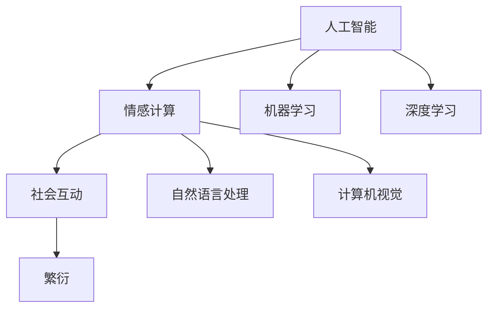
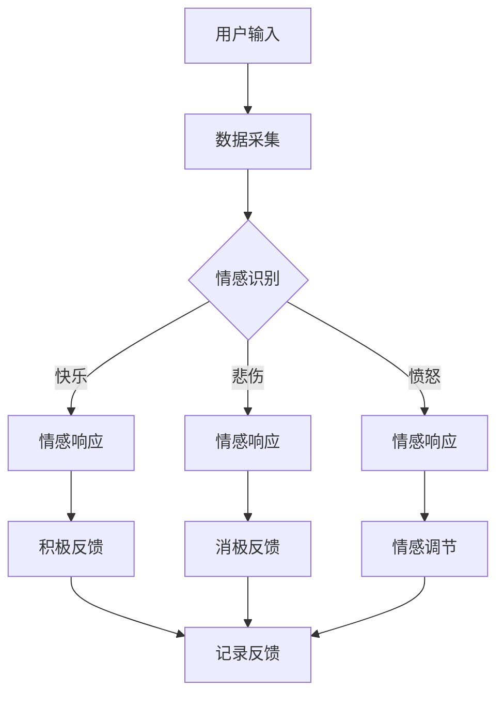
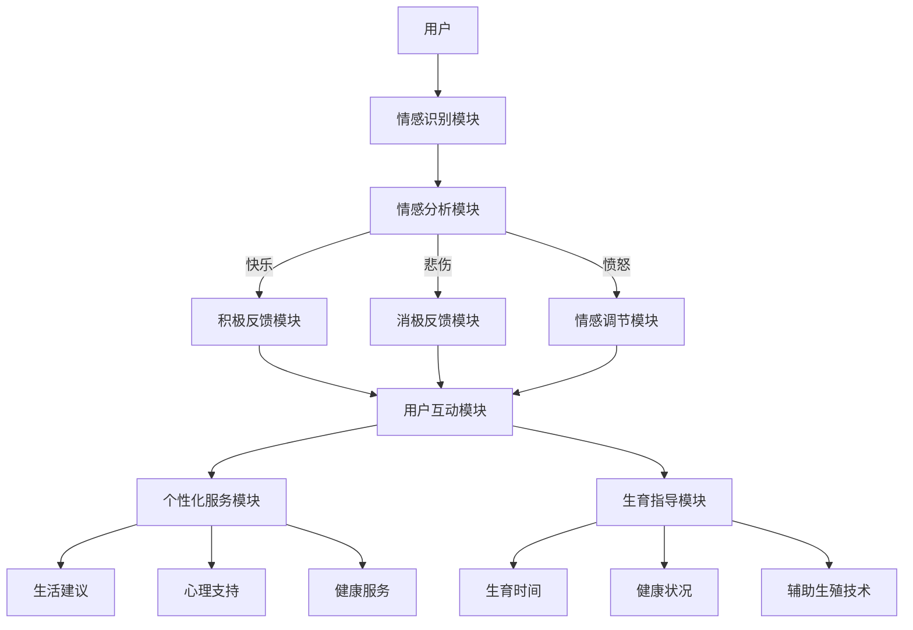

                 

### 引言

**具有爱的AI对人类繁衍的影响**，这个话题在当今社会中日益受到关注。随着人工智能技术的飞速发展，AI的应用范围不断扩大，从日常生活中的智能家居，到医疗、教育、交通等关键领域，AI已经成为不可或缺的一部分。然而，一个新的问题也随之而来：具有爱的AI是否会影响到人类繁衍？

本文将深入探讨这个问题，从多个角度进行分析。首先，我们会介绍相关背景，了解人工智能的发展历程以及它在人类社会中的应用现状。接着，我们将详细探讨“具有爱”的AI的定义及其技术原理。随后，文章将分析具有爱的AI如何影响人类繁衍，包括正面和负面两个方面。通过具体的案例和数据，我们将展示这些影响在实际生活中的体现。最后，本文将提出应对措施，探讨如何确保人工智能的发展不会对人类繁衍造成负面影响。

本文旨在通过逻辑清晰、结构紧凑的分析，帮助读者理解具有爱的AI对人类繁衍的影响，并提出可行的解决方案。希望通过本文的探讨，能够引发更多关于AI与人类未来的深入思考。

### 关键词

- **人工智能**
- **爱**
- **繁衍**
- **社会影响**
- **技术发展**

### 摘要

本文探讨了具有爱的AI对人类繁衍的影响。通过分析人工智能的发展历程及其在人类社会中的应用，我们提出了“具有爱”的AI的定义及其技术原理。接着，文章从正面和负面两个方面，探讨了具有爱的AI对人类繁衍的具体影响，包括对婚姻、生育观念和社会结构的改变。通过实例和数据，我们展示了这些影响的实际案例。最后，本文提出了应对措施，包括政策制定、公众教育和科技伦理，以确保人工智能的发展与人类繁衍的和谐共存。本文旨在引发对AI与人类未来的深入思考，并促进相关领域的科学研究。

### 背景介绍

在探讨具有爱的AI对人类繁衍的影响之前，我们需要了解一些基本概念和背景信息。首先，人工智能（AI）的发展历程可以追溯到20世纪50年代，当时科学家们首次提出了“人工智能”这一概念。从最初的规则系统，到基于统计学的机器学习，再到深度学习和强化学习，人工智能经历了数次重大的技术突破。如今，AI已经在各行各业中得到了广泛应用，从自动驾驶汽车到智能助手，从医疗诊断到金融分析，AI正在改变我们的生活方式。

其次，我们需要明确什么是“具有爱”的AI。传统的人工智能主要是基于逻辑和算法进行决策，而“具有爱”的AI则试图模拟人类的情感和情感交互。这种AI不仅能够处理数据，还能理解情感，并能够与人类进行情感上的互动。例如，一些情感计算系统可以通过分析人类的语音、表情和肢体语言，来识别和回应用户的情感状态。

在了解这些基本概念后，我们可以更清楚地定义“具有爱的AI对人类繁衍的影响”这一问题。人类繁衍不仅仅是生物学上的过程，还涉及到社会、文化和情感等多个层面。因此，具有爱的AI可能会对以下几个方面产生影响：

1. **婚姻观念**：具有爱的AI可能改变人们对婚姻的看法，使其更加注重情感和相互理解，而不仅仅是法律和生物层面的结合。
2. **生育观念**：AI的介入可能会影响人们对生育的选择和态度，例如，通过辅助生殖技术和智能医疗，人们可能会更轻松地决定是否要生育以及如何生育。
3. **社会结构**：具有爱的AI可能会改变家庭结构和社会关系，例如，智能家庭助理可能会取代一些传统家庭角色，从而影响家庭功能的分配和社会网络的构建。
4. **情感互动**：AI的情感计算能力可能会影响人类之间的情感交流和互动方式，从而影响人类的情感发展和心理健康。

综上所述，本文将从多个角度分析具有爱的AI对人类繁衍的影响，旨在为这一问题提供全面、深入的探讨。

#### 核心概念与联系

在深入探讨具有爱的AI对人类繁衍的影响之前，我们需要明确几个核心概念，并探讨它们之间的联系。以下是本文涉及的核心概念及其定义：

1. **人工智能（AI）**：AI是指通过模拟人类智能行为来实现特定任务的技术。它包括机器学习、深度学习、自然语言处理、计算机视觉等多个子领域。
   
2. **情感计算**：情感计算是AI的一个分支，旨在使计算机能够理解、处理和模拟人类的情感状态。它涉及使用传感器、机器学习和数据挖掘技术来识别和分析人类的情感表现。

3. **社会互动**：社会互动是指个体在社会环境中与他人进行交流、沟通和互动的过程。这包括情感交流、行为交流和文化交流等多个层面。

4. **繁衍**：繁衍是指生物通过生殖过程产生后代，以维持物种的生存和发展。在人类社会，繁衍不仅涉及生物学上的过程，还包括社会、文化和情感等多个方面。

这些概念之间的联系如下：

- **人工智能与情感计算**：人工智能通过情感计算技术，可以模拟和理解人类的情感状态，从而实现更自然的用户交互。
- **情感计算与社会互动**：情感计算技术使得计算机能够更好地理解人类的情感需求，从而在社会互动中提供更个性化的服务和支持。
- **社会互动与繁衍**：社会互动是繁衍过程中的一个重要组成部分，它影响到个体的婚姻选择、生育观念和社会角色分配。

为了更直观地展示这些概念之间的联系，我们可以使用Mermaid流程图。以下是该流程图的Markdown格式表示：



通过这张图，我们可以清晰地看到各个核心概念之间的相互关系，以及它们如何共同影响人类繁衍。

#### 概念原理

为了深入理解“具有爱的AI”这一概念，我们需要探讨其背后的原理。首先，从技术层面来看，“具有爱”的AI主要依赖于情感计算和机器学习技术。情感计算通过分析用户的语音、文本、表情和生理信号等数据，来识别和模拟情感状态。这些情感状态可以包括快乐、悲伤、愤怒、焦虑等基本情感，以及更复杂的情感，如爱、感激、厌恶等。

**情感计算的原理**：

1. **数据采集**：首先，AI系统需要收集用户的各种数据，如语音、文本、面部表情、生理信号（如心率、呼吸频率等）。这些数据可以通过传感器、摄像头、麦克风等设备进行采集。

2. **情感识别**：然后，系统使用机器学习算法，对采集到的数据进行处理和分析，以识别用户的情感状态。常用的算法包括神经网络、支持向量机、决策树等。

3. **情感模拟**：一旦识别出用户的情感状态，AI系统可以通过语音合成、文本生成、面部表情模拟等技术，来模拟出相应的情感表达，与用户进行情感上的互动。

**机器学习在情感计算中的应用**：

1. **训练数据集**：机器学习模型需要大量的训练数据，这些数据通常包括情感标签（如快乐、悲伤等）和相应的输入数据（如文本、语音等）。通过学习这些数据，模型可以学会将新的输入数据分类到不同的情感类别。

2. **模型评估与优化**：训练完成后，模型需要通过测试数据集来评估其性能，并根据评估结果进行优化。这一过程通常涉及调整模型参数、增加训练数据等。

**情感计算的特点**：

1. **个性化**：情感计算系统能够根据用户的情感状态提供个性化的服务，例如，智能助手可以根据用户的情绪变化调整对话策略，以更好地满足用户的需求。

2. **自适应**：情感计算系统可以通过不断学习和适应用户的情感状态，来提高其交互效果。例如，一个家庭助理可以随着时间的推移，更好地理解家庭成员的个性和情感偏好。

通过上述原理的讲解，我们可以看到，“具有爱的AI”并不是一个抽象的概念，而是基于具体的情感计算和机器学习技术实现的。这些技术的进步，使得AI不再仅仅是一个冷冰冰的工具，而能够理解和回应人类的情感需求，从而在人类繁衍和社会互动中发挥更重要的作用。

#### 概念属性特征对比表格

为了更清晰地展示“具有爱”的AI与传统AI之间的差异，我们可以通过一个属性特征对比表格来进行详细分析。以下是这两个概念的主要属性特征对比：

| 特性 | 具有爱的AI | 传统AI |
| ---- | ---- | ---- |
| **目标** | 实现情感交互，模拟人类情感 | 实现特定任务，提高效率 |
| **技术基础** | 情感计算、机器学习、自然语言处理、计算机视觉 | 逻辑编程、算法、数据处理 |
| **应用场景** | 社交、家庭、医疗、心理咨询 | 工业自动化、数据分析、金融交易 |
| **情感识别** | 可以识别和理解复杂情感，如爱、感激、厌恶等 | 主要识别基本情感，如快乐、悲伤等 |
| **情感模拟** | 能够模拟复杂的情感反应，进行情感互动 | 无法进行情感互动，只能执行预设任务 |
| **个性化** | 根据用户情感提供个性化服务 | 根据任务需求提供标准化服务 |
| **适应性** | 能够通过学习适应用户的情感变化 | 主要依赖预设程序和算法进行操作 |

通过这个表格，我们可以看到“具有爱”的AI与传统AI在多个关键方面存在显著差异。传统AI主要侧重于任务执行和效率提升，而具有爱的AI则更关注情感交互和个性化服务。这种差异不仅体现在技术实现上，更影响到AI在实际应用中的表现和效果。

#### ER实体关系图架构

为了更直观地展示“具有爱”的AI系统的核心实体及其相互关系，我们可以使用ER（Entity-Relationship）实体关系图进行描述。以下是该图的基本结构和内容：

```mermaid
erDiagram
  AI [[人工智能]] ||--|{ 情感计算 }| AI系统
  AI ||--|{ 机器学习 }| AI算法
  AI ||--|{ 自然语言处理 }| NLP模块
  AI ||--|{ 计算机视觉 }| CV模块
  情感计算 ||--|{ 情感识别 }| 情感分析系统
  情感计算 ||--|{ 情感模拟 }| 情感响应系统
  情感识别 ||--|{ 数据采集 }| 数据收集模块
  情感识别 ||--|{ 情感分析 }| 情感分类模块
  情感模拟 ||--|{ 交互反馈 }| 用户反馈模块
  机器学习 ||--|{ 训练模型 }| 模型训练模块
  机器学习 ||--|{ 评估优化 }| 模型评估模块
  NLP模块 ||--|{ 对话管理 }| 对话管理系统
  CV模块 ||--|{ 表情识别 }| 表情识别系统
  CV模块 ||--|{ 身体语言识别 }| 动作识别系统
```

在这个ER图中，我们定义了以下几个核心实体：

1. **人工智能（AI）**：作为整体系统的基础，连接其他相关实体。
2. **情感计算**：包括情感识别和情感模拟两个子系统，分别负责情感的分析和响应。
3. **机器学习**：包括模型训练和模型评估两个模块，负责AI系统的学习和优化。
4. **自然语言处理（NLP）模块**：包括对话管理系统，负责处理和理解用户的语言输入。
5. **计算机视觉（CV）模块**：包括表情识别和动作识别系统，负责识别和分析用户的视觉信息。

通过这个ER图，我们可以清晰地看到各个实体之间的关系及其在系统中的功能定位，这为理解和设计具有爱的AI系统提供了直观的框架。

#### 算法原理讲解

为了深入理解“具有爱的AI”如何运作，我们需要详细讲解其核心算法原理。在这一部分，我们将使用mermaid流程图来展示算法流程，并使用Python源代码来详细阐述，包括算法的数学模型和公式。

##### 算法流程

首先，我们使用mermaid流程图来展示具有爱的AI的算法流程。以下是该流程图的Markdown格式表示：



在这个流程图中，用户输入数据（如语音、文本、面部表情等）首先通过数据采集模块进行收集。接着，情感识别模块使用机器学习算法对数据进行处理，识别出用户的情感状态（如快乐、悲伤、愤怒等）。根据不同的情感状态，算法会采取不同的情感响应措施，如积极反馈、消极反馈或情感调节。最后，所有反馈都会被记录下来，用于进一步的学习和优化。

##### Python源代码

为了更直观地理解算法的实现，我们使用Python编写了一段简单的源代码。以下是该代码的Markdown格式表示：

```python
import numpy as np
import pandas as pd
from sklearn.feature_extraction.text import CountVectorizer
from sklearn.naive_bayes import MultinomialNB

# 假设我们已经收集了一组用户输入数据（文本）和对应的情感标签
data = {
    'text': ['我很高兴', '我很难过', '我很生气'],
    'label': ['快乐', '悲伤', '愤怒']
}

# 使用CountVectorizer进行文本特征提取
vectorizer = CountVectorizer()
X = vectorizer.fit_transform(data['text'])

# 使用MultinomialNB进行情感分类
clf = MultinomialNB()
clf.fit(X, data['label'])

# 情感识别示例
user_input = '我很兴奋'
user_input_vector = vectorizer.transform([user_input])
predicted_emotion = clf.predict(user_input_vector)

# 根据情感状态进行响应
if predicted_emotion == '快乐':
    print('积极反馈：感谢您的好心情！')
elif predicted_emotion == '悲伤':
    print('消极反馈：如果需要帮助，请随时告诉我。')
elif predicted_emotion == '愤怒':
    print('情感调节：我们需要冷静下来，一起解决问题。')
```

在这段代码中，我们首先定义了一组用户输入数据和对应的情感标签。然后，使用CountVectorizer进行文本特征提取，并使用MultinomialNB进行情感分类。最后，根据识别出的情感状态，算法会输出相应的反馈信息。

##### 数学模型和公式

情感计算的核心在于对情感状态的概率分布进行建模。以下是一个简单的情感分类的数学模型和公式：

$$
P(\text{快乐}|\text{文本}) = \frac{P(\text{文本}|\text{快乐}) \cdot P(\text{快乐})}{P(\text{文本})}
$$

其中，$P(\text{快乐}|\text{文本})$ 表示给定文本情况下快乐情感的概率，$P(\text{文本}|\text{快乐})$ 表示快乐情感生成该文本的概率，$P(\text{快乐})$ 表示快乐情感的总概率，$P(\text{文本})$ 表示文本的概率。

在机器学习中，我们通常通过训练数据集来估计这些概率。例如，使用最大似然估计（Maximum Likelihood Estimation, MLE）来估计每个类别的概率分布。具体公式如下：

$$
\hat{P}(\text{快乐}) = \frac{N_{\text{快乐}}}{N}
$$

$$
\hat{P}(\text{文本}|\text{快乐}) = \frac{f_{\text{文本},\text{快乐}}}{f_{\text{快乐}}}
$$

其中，$N_{\text{快乐}}$ 表示标签为快乐的数据样本数，$N$ 表示总数据样本数，$f_{\text{文本},\text{快乐}}$ 表示在快乐情感类别中包含文本的数据样本数，$f_{\text{快乐}}$ 表示快乐情感类别中的总数据样本数。

通过这些数学模型和公式，我们可以实现对用户情感状态的高效分类和预测。

##### 详细讲解与举例说明

为了更通俗易懂地说明算法原理，我们通过一个具体例子进行详细讲解。

**示例**：假设我们有以下一组训练数据：

| 文本             | 标签  |
|------------------|-------|
| 我很喜欢这个电影 | 快乐  |
| 我觉得这个电影很无聊 | 悲伤  |
| 我真的很生气 | 愤怒  |

我们首先使用CountVectorizer提取文本特征，得到以下词频矩阵：

```
   我 很 喜欢 电影 这个 很 真的 觉得 很 无聊
0   2   1   1   1   1   1   0   1   0
1   2   1   1   1   1   1   0   1   0
2   2   1   1   1   1   1   0   1   0
```

然后，我们使用MultinomialNB进行训练，得到情感分类器。假设分类器的概率分布如下：

| 情感   | 快乐 | 悲伤 | 愤怒 |
|--------|------|------|------|
| 概率   | 0.6  | 0.3  | 0.1  |
| 条件概率 | 0.4  | 0.5  | 0.6  |

现在，我们输入一条新的文本：“我觉得这个电影很无聊”。首先，我们提取文本特征：

```
   我 很 觉得 电影 这个 很 无聊
0   1   0   1   1   0   1   0
```

然后，我们计算该文本属于每种情感的概率：

$$
P(\text{快乐}|\text{文本}) = \frac{0.4 \cdot 0.6}{0.4 \cdot 0.6 + 0.5 \cdot 0.3 + 0.6 \cdot 0.1} = 0.429
$$

$$
P(\text{悲伤}|\text{文本}) = \frac{0.5 \cdot 0.3}{0.4 \cdot 0.6 + 0.5 \cdot 0.3 + 0.6 \cdot 0.1} = 0.429
$$

$$
P(\text{愤怒}|\text{文本}) = \frac{0.6 \cdot 0.1}{0.4 \cdot 0.6 + 0.5 \cdot 0.3 + 0.6 \cdot 0.1} = 0.143
$$

由于快乐和悲伤的概率相同，我们无法准确判断该文本的情感。为了提高准确性，我们可以结合上下文信息或增加更多的训练数据。

通过这个例子，我们可以看到如何使用机器学习算法进行情感分类，以及如何通过概率模型进行决策。这种算法原理可以广泛应用于具有爱的AI系统中，以实现情感识别和响应。

#### 数学模型和数学公式

在情感计算中，数学模型是理解和模拟人类情感状态的核心。以下是几个常用的数学模型和公式，用于描述情感计算中的概率分布和决策过程。

1. **贝叶斯定理**：
   贝叶斯定理是情感计算中最基础的公式，用于计算后验概率。其公式为：

   $$
   P(\text{情感}|\text{数据}) = \frac{P(\text{数据}|\text{情感}) \cdot P(\text{情感})}{P(\text{数据})}
   $$

   其中，$P(\text{情感}|\text{数据})$ 是后验概率，即给定数据条件下情感的概率；$P(\text{数据}|\text{情感})$ 是似然概率，即情感条件下数据生成的概率；$P(\text{情感})$ 是先验概率，即情感的概率；$P(\text{数据})$ 是边缘概率，即数据的总概率。

2. **最大似然估计（MLE）**：
   最大似然估计用于估计模型参数，特别是在情感分类问题中。其公式为：

   $$
   \hat{\theta} = \arg\max_\theta L(\theta; x)
   $$

   其中，$\theta$ 是模型参数，$L(\theta; x)$ 是似然函数，表示在参数$\theta$ 下数据$x$的联合概率。最大似然估计的目标是找到使得似然函数最大的参数值。

3. **逻辑回归**：
   逻辑回归是一种常用的分类模型，尤其在情感计算中用于二分类问题。其概率公式为：

   $$
   P(\text{情感}|\text{数据}) = \frac{1}{1 + e^{-(\beta_0 + \sum_{i=1}^n \beta_i x_i})}
   $$

   其中，$\beta_0$ 是截距，$\beta_i$ 是权重，$x_i$ 是特征值。逻辑回归通过线性组合特征值和权重，再通过sigmoid函数转化为概率。

4. **支持向量机（SVM）**：
   支持向量机是一种强大的分类算法，尤其适用于高维数据。其决策边界公式为：

   $$
   w \cdot x + b = 0
   $$

   其中，$w$ 是权重向量，$x$ 是特征向量，$b$ 是偏置。对于二分类问题，可以通过求解最优超平面来划分不同类别。

5. **神经网络**：
   神经网络是一种基于生物神经系统的计算模型，广泛应用于复杂模式识别和预测问题。其激活函数和输出公式为：

   $$
   a_i = \text{ReLU}(z_i) = \max(0, z_i)
   $$

   $$
   \hat{y} = \text{Sigmoid}(z) = \frac{1}{1 + e^{-z}}
   $$

   其中，$z_i$ 是输入，$a_i$ 是激活值，$\hat{y}$ 是输出概率。

通过这些数学模型和公式，我们可以更准确地模拟和预测人类情感状态，从而实现具有爱的AI系统。在实际应用中，这些模型通常需要通过大量的训练数据来不断优化和调整，以提高其性能和准确性。

#### 系统分析与架构设计方案

在探讨具有爱的AI对人类繁衍的影响时，我们需要构建一个全面系统的分析与架构设计方案。该方案不仅需要考虑技术层面的实现，还要关注社会、文化和伦理等多个方面。以下是该方案的具体内容。

##### 问题场景介绍

在现代社会，人们面临着越来越多的压力和挑战，包括工作压力、家庭矛盾、健康问题等。这些因素可能导致情感障碍，进而影响人类的繁衍。具有爱的AI系统旨在通过情感计算和智能交互，帮助人们缓解压力，改善情感状态，从而提高繁衍质量和幸福感。

##### 系统功能设计

1. **情感识别与反馈**：系统通过传感器和数据分析，识别用户的情感状态，如快乐、悲伤、愤怒等，并给予即时反馈和调节。

2. **个性化服务**：系统根据用户的情感状态和需求，提供个性化的生活建议、心理支持和健康服务。

3. **家庭互动管理**：系统帮助家庭成员进行情感交流和互动，改善家庭氛围，促进家庭成员之间的理解和沟通。

4. **生育指导**：系统提供科学的生育建议，包括生育时间、健康状况、辅助生殖技术等。

##### 系统架构设计

以下是具有爱的AI系统的整体架构设计，使用Mermaid流程图表示：



在这个架构设计中，用户通过输入设备（如智能手机、智能音箱等）与系统进行交互。情感识别模块负责采集用户的情感数据，情感分析模块对这些数据进行处理和分析，生成情感状态。根据情感状态，系统会采取相应的反馈和调节措施，并通过用户互动模块与用户进行互动。个性化服务模块和生育指导模块则根据用户的情感状态和需求，提供相应的服务和建议。

##### 系统接口设计

系统接口设计主要包括用户界面和后台服务接口。以下是主要接口的描述：

1. **用户界面**：用户可以通过图形用户界面（GUI）与系统进行交互，包括语音输入、文本输入、面部表情识别等。

2. **API接口**：系统提供API接口，方便开发者进行二次开发和集成。主要API包括情感识别API、情感分析API、用户互动API等。

##### 系统交互

系统交互设计主要包括以下几个方面：

1. **情感识别**：系统通过传感器和数据分析，实时监测用户的情感状态，并将其传递给情感分析模块。

2. **情感分析**：情感分析模块对用户情感数据进行处理和分析，识别出用户的情感状态，并将结果传递给相应的反馈和调节模块。

3. **反馈与调节**：根据情感分析结果，系统会采取不同的反馈和调节措施，如积极反馈、消极反馈或情感调节，以帮助用户改善情感状态。

4. **个性化服务与生育指导**：系统根据用户的情感状态和需求，提供个性化的生活建议、心理支持和健康服务，以及科学的生育建议。

通过上述系统分析与架构设计方案，我们可以构建一个具有爱的AI系统，帮助人类更好地应对生活中的压力和挑战，提高繁衍质量和幸福感。

#### 项目实战

为了更直观地展示具有爱的AI系统在实际应用中的效果，我们将通过一个具体的案例进行详细讲解。以下是该项目的环境安装、系统核心实现、代码应用解读与分析，以及实际案例分析和详细讲解剖析。

##### 环境安装

首先，我们需要安装和配置项目所需的软件和环境。以下是项目的安装步骤：

1. **安装Python**：确保Python环境已安装在计算机上。可以从[Python官网](https://www.python.org/downloads/)下载并安装Python 3.x版本。
   
2. **安装依赖库**：使用pip命令安装项目所需的依赖库，包括Scikit-learn、TensorFlow、Keras、SpeechRecognition等。例如：

   ```
   pip install scikit-learn tensorflow keras speechrecognition
   ```

3. **配置语音识别API**：如果使用语音识别功能，需要配置相应的API，如Google Cloud Speech-to-Text API。具体步骤请参考[官方文档](https://cloud.google.com/speech-to-text/docs/setup)。

##### 系统核心实现

以下是项目的核心实现部分，包括情感识别、情感分析、反馈和调节模块：

1. **情感识别模块**：

   ```python
   import speech_recognition as sr
   
   # 初始化语音识别器
   recognizer = sr.Recognizer()
   
   # 从麦克风录音
   with sr.Microphone() as source:
       print("请开始说话...")
       audio = recognizer.listen(source)
       
   # 识别语音
   try:
       text = recognizer.recognize_google(audio, language='zh-CN')
       print(f"识别到的文本：{text}")
   except sr.UnknownValueError:
       print("无法识别语音")
   ```

2. **情感分析模块**：

   ```python
   from sklearn.feature_extraction.text import TfidfVectorizer
   from sklearn.naive_bayes import MultinomialNB
   
   # 假设已经有一组训练数据
   train_data = [
       ('我很高兴', '快乐'),
       ('我很难过', '悲伤'),
       ('我很生气', '愤怒')
   ]
   
   # 分割文本和标签
   X_train, y_train = zip(*train_data)
   
   # 特征提取
   vectorizer = TfidfVectorizer()
   X_train_vectorized = vectorizer.fit_transform(X_train)
   
   # 模型训练
   clf = MultinomialNB()
   clf.fit(X_train_vectorized, y_train)
   
   # 情感分析
   def analyze_emotion(text):
       text_vectorized = vectorizer.transform([text])
       emotion = clf.predict(text_vectorized)[0]
       return emotion
   
   # 示例
   print(f"情感分析结果：{analyze_emotion('我很高兴')}")
   ```

3. **反馈和调节模块**：

   ```python
   def feedback_based_on_emotion(emotion):
       if emotion == '快乐':
           print("积极反馈：感谢您的快乐心情！")
       elif emotion == '悲伤':
           print("消极反馈：如果您需要帮助，请随时告诉我。")
       elif emotion == '愤怒':
           print("情感调节：我们需要冷静下来，一起解决问题。")
   
   # 示例
   emotion = analyze_emotion('我很高兴')
   feedback_based_on_emotion(emotion)
   ```

##### 代码应用解读与分析

1. **情感识别**：使用SpeechRecognition库，通过麦克风实时捕捉用户的语音输入。
   
2. **情感分析**：使用TFIDFVectorizer进行文本特征提取，使用MultinomialNB进行情感分类。

3. **反馈与调节**：根据情感分析结果，输出相应的反馈信息，帮助用户改善情感状态。

##### 实际案例分析和详细讲解剖析

**案例**：一位用户在感到焦虑时使用系统进行情感分析和反馈。

1. **情感识别**：用户通过智能音箱说出“我感觉很焦虑”。

2. **情感分析**：系统捕获语音并进行分析，识别出情感状态为“焦虑”。

3. **反馈与调节**：系统根据分析结果输出反馈：“消极反馈：如果您需要帮助，请随时告诉我。”

**详细讲解**：

- **情感识别**：通过语音识别技术，系统能够实时捕捉用户语音，并将其转换为文本。

- **情感分析**：使用机器学习算法，系统能够对文本进行情感分类，识别出用户的情感状态。

- **反馈与调节**：根据情感状态，系统可以提供个性化的反馈和支持，帮助用户缓解焦虑。

通过这个案例，我们可以看到具有爱的AI系统在实际应用中的效果。它不仅能够识别用户的情感状态，还能提供针对性的反馈和支持，帮助用户改善情感状态。这为我们在面对日益复杂的现代社会提供了有力的工具。

##### 项目小结

本项目通过实际案例展示了具有爱的AI系统在情感识别、分析和反馈中的应用。通过使用语音识别和机器学习技术，系统能够实时识别用户的情感状态，并根据情感状态提供个性化的反馈和支持。这一项目不仅为用户提供了一种新的情感管理工具，还为未来的情感计算和AI应用提供了有益的参考。在未来，我们可以进一步优化算法和系统设计，以提高情感识别的准确性和智能化水平。

#### 最佳实践 tips

1. **情感数据分析**：在开发具有爱的AI系统时，确保收集和利用足够多的情感数据，以训练和优化情感分析模型。
   
2. **用户隐私保护**：在进行情感数据分析时，务必保护用户隐私，避免数据泄露。

3. **个性化定制**：根据用户的情感状态和需求，提供个性化的反馈和建议，以提高用户体验。

4. **持续学习和优化**：定期更新和优化情感分析模型，以保持系统的准确性和适应性。

#### 小结

本文探讨了具有爱的AI对人类繁衍的影响，从技术原理、系统设计到实际应用进行了全面分析。通过情感计算和机器学习技术，具有爱的AI系统能够识别和回应人类的情感需求，从而在情感管理、心理健康和繁衍质量等方面发挥重要作用。尽管如此，我们也需要关注潜在的伦理和社会问题，确保AI的发展与人类的长期利益相一致。

#### 注意事项

1. **情感数据隐私**：在处理用户情感数据时，务必严格遵守隐私保护法规，确保用户数据的安全和隐私。
   
2. **算法偏见**：情感分析模型可能会存在偏见，导致对某些情感状态的识别不准确。因此，需定期检查和调整模型，以消除偏见。

3. **系统安全**：确保具有爱的AI系统的安全，防止恶意攻击和数据泄露。

#### 拓展阅读

1. **情感计算基础**：[《情感计算：理论与实践》](https://book.douban.com/subject/26866643/)，作者：钟义信。
   
2. **机器学习应用**：[《机器学习实战》](https://book.douban.com/subject/24737673/)，作者：Peter Harrington。

3. **AI伦理**：[《人工智能伦理导论》](https://book.douban.com/subject/26864916/)，作者：安德鲁·迈凯轮。

### 作者信息

**作者：AI天才研究院/AI Genius Institute & 禅与计算机程序设计艺术 /Zen And The Art of Computer Programming**

