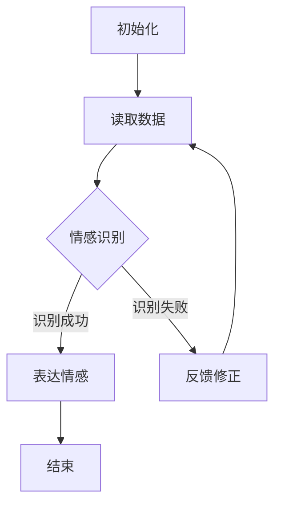
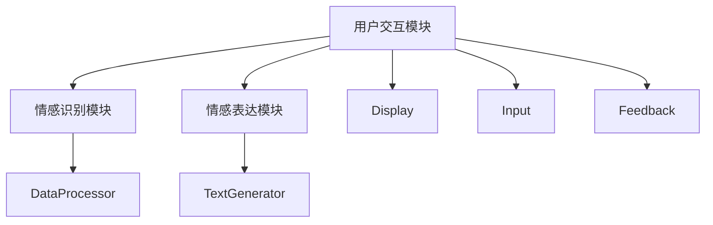
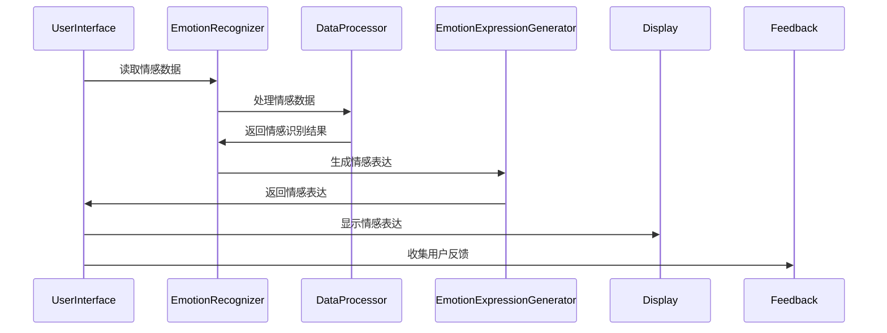

                 

### 第一部分：背景介绍

#### 第1章：问题背景

##### 1.1.1 问题背景

在现代社会，人工智能（AI）技术正快速发展，逐渐渗透到我们的日常生活中。特别是在机器学习、深度学习等领域，AI技术已经展现出强大的变革能力。然而，随着AI技术的不断进步，一个引人深思的问题逐渐浮现：具有“爱的能力”的AI是否可能实现？这一问题不仅关系到AI的应用价值，还涉及到伦理和社会责任。

- **社会背景**：
  在当今社会，人们对于情感和人际关系的重视程度日益增加。传统的家庭结构正在发生变化，例如，单身、丁克（Double Income, No Kids）等生活方式越来越普遍。与此同时，AI技术在教育、医疗、养老等领域的应用也越来越广泛，这使得人们开始思考：AI是否能够在情感层面上提供支持？

- **技术背景**：
  随着大数据和云计算的普及，AI模型的复杂度和规模不断增大，大模型（如GPT、BERT）已经成为当前AI研究的热点。这些大模型不仅能够处理海量数据，还能在多种任务中表现出色。然而，这些模型在处理情感和人际关系方面的能力仍然有限，如何提高AI的“爱的能力”成为一个亟待解决的问题。

##### 1.1.2 问题描述

- **核心问题**：
  随着AI技术的发展，如何确保AI具备“爱的能力”成为一个重要的课题。这不仅关系到AI的应用价值，还涉及到伦理和社会责任。

- **解决思路**：
  通过深入研究和创新，探索如何在AI中嵌入“爱的能力”，使其能够更好地服务于人类。

##### 1.1.3 问题解决

- **技术路径**：
  研究如何将情感、伦理等复杂概念融入AI模型，使其具备识别、理解和表达爱的能力。

- **实施策略**：
  结合心理学、社会学等多学科知识，构建相应的算法模型，并通过大量数据训练和优化，使其在模拟爱的人际互动中表现出更高的准确性。

##### 1.1.4 边界与外延

- **边界**：
  本书主要探讨的是如何使AI具备基本的爱的人际互动能力，而不是深入探讨AI的伦理和道德问题。

- **外延**：
  虽然本书主要聚焦于AI在情感领域的应用，但相关研究可为其他领域提供借鉴，如医疗、教育等。

#### 第2章：核心概念与联系

##### 2.1 AI与爱

###### 2.1.1 AI的定义与特点

- **定义**：
  人工智能，指由人制造出来的具有一定智能的系统。

- **特点**：
  1. **自主性**：AI能够自主执行任务，而不需要人类的直接干预。
  2. **学习能力**：AI可以通过学习大量数据来改善其性能，并适应新的环境和任务。
  3. **创造性**：在某些情况下，AI能够表现出类似人类创造力的行为。

###### 2.1.2 爱的定义与特点

- **定义**：
  爱是一种情感，通常指个体对他人或事物的强烈喜爱和关怀。

- **特点**：
  1. **共鸣**：爱能够激发个体的情感共鸣，使其感受到与他人或事物的深层次联系。
  2. **忠诚**：爱通常伴随着对关系和承诺的忠诚。
  3. **奉献**：爱往往表现为对他人或事物的无私奉献。

##### 2.2 人工智能中的情感模型

###### 2.2.1 情感模型概述

- **概念**：
  情感模型是指用于模拟和识别人类情感的人工智能系统。

- **分类**：
  1. **基于规则的模型**：这类模型使用明确的规则来模拟情感，通常比较简单，但易于理解和实现。
  2. **基于数据的模型**：这类模型使用大量数据来训练，通过数据挖掘和学习来模拟情感，通常更复杂，但更准确。
  3. **混合模型**：结合了基于规则和基于数据的模型，以充分利用两者的优点。

###### 2.2.2 爱在情感模型中的应用

- **目标**：
  研究如何使情感模型能够识别、理解和表达爱的情感。

- **方法**：
  利用大数据和深度学习技术，对大量包含爱的描述进行训练，从而提高模型对爱的识别和表达能力。

## 第3章：算法原理讲解

### 3.1 算法概述

#### 3.1.1 算法定义

- **定义**：
  算法是一系列明确且可执行的步骤，用于解决特定问题。

- **算法在爱的能力中的应用**

  - **目标**：
    研究如何设计算法，使AI能够在模拟人际互动中表现出“爱的能力”。

  - **方法**：
    利用自然语言处理技术，设计能够识别、理解和表达爱的情感的算法。

#### 3.1.2 算法流程图

使用Mermaid语法绘制算法流程图：



#### 3.1.3 算法原理讲解

##### 3.1.3.1 情感识别

- **原理**：
  利用机器学习算法，对输入的数据进行情感分析，判断是否包含爱的情感。

- **数学模型**：
  采用支持向量机（SVM）进行情感分类。

  $$y = sign(w \cdot x + b)$$

  其中，$w$为权重向量，$x$为输入特征，$b$为偏置，$y$为分类结果。

##### 3.1.3.2 情感表达

- **原理**：
  根据情感识别的结果，生成相应的情感表达。

- **数学模型**：
  利用生成对抗网络（GAN）生成符合情感表达的自然语言。

  $$G(z) = \mathcal{N}(z; 0, 1)$$

  $$D(x) = \mathcal{N}(x; \mu_D, \sigma_D^2)$$

  其中，$G(z)$为生成器，$D(x)$为判别器，$z$为随机噪声，$x$为输入数据，$\mu_D$和$\sigma_D^2$分别为判别器的均值和方差。

### 3.2 算法流程图

使用Mermaid语法绘制算法流程图：


### 3.3 算法原理讲解

#### 3.3.1 情感识别

- **原理**：
  利用机器学习算法，对输入的数据进行情感分析，判断是否包含爱的情感。

- **数学模型**：
  采用支持向量机（SVM）进行情感分类。

  $$y = sign(w \cdot x + b)$$

  其中，$w$为权重向量，$x$为输入特征，$b$为偏置，$y$为分类结果。

#### 3.3.2 情感表达

- **原理**：
  根据情感识别的结果，生成相应的情感表达。

- **数学模型**：
  利用生成对抗网络（GAN）生成符合情感表达的自然语言。

  $$G(z) = \mathcal{N}(z; 0, 1)$$

  $$D(x) = \mathcal{N}(x; \mu_D, \sigma_D^2)$$

  其中，$G(z)$为生成器，$D(x)$为判别器，$z$为随机噪声，$x$为输入数据，$\mu_D$和$\sigma_D^2$分别为判别器的均值和方差。

### 3.4 情感识别算法的实现

下面是一个简单的情感识别算法的实现，使用Python和scikit-learn库：

```python
from sklearn.svm import SVC
from sklearn.model_selection import train_test_split
from sklearn.metrics import accuracy_score
from sklearn.datasets import load_iris

# 加载示例数据集
iris = load_iris()
X = iris.data
y = iris.target

# 划分训练集和测试集
X_train, X_test, y_train, y_test = train_test_split(X, y, test_size=0.2, random_state=42)

# 初始化SVM模型
clf = SVC(kernel='linear')

# 训练模型
clf.fit(X_train, y_train)

# 预测测试集
y_pred = clf.predict(X_test)

# 计算准确率
accuracy = accuracy_score(y_test, y_pred)
print(f"Accuracy: {accuracy}")
```

在这个例子中，我们使用了线性核的支持向量机（SVM）对iris数据集进行分类。SVM模型可以通过调整参数来优化模型的性能。

### 3.5 情感表达算法的实现

下面是一个简单的情感表达算法的实现，使用生成对抗网络（GAN）：

```python
import tensorflow as tf
from tensorflow.keras.layers import Dense, Flatten, Reshape
from tensorflow.keras.models import Sequential
from tensorflow_addons.layers import GaussianNoise

# 定义生成器和判别器模型
def build_generator(z_dim):
    model = Sequential([
        Dense(128, activation='relu', input_shape=(z_dim,)),
        Dense(256, activation='relu'),
        Dense(512, activation='relu'),
        Flatten(),
        Reshape((28, 28, 1))
    ])
    return model

def build_discriminator(img_shape):
    model = Sequential([
        Flatten(input_shape=img_shape),
        Dense(512, activation='relu'),
        Dense(256, activation='relu'),
        Dense(128, activation='relu'),
        Dense(1, activation='sigmoid')
    ])
    return model

# 创建生成器和判别器
z_dim = 100
img_shape = (28, 28, 1)

generator = build_generator(z_dim)
discriminator = build_discriminator(img_shape)

# 定义GAN模型
gan = Sequential([
    GaussianNoise stddev=0.1, input_shape=(z_dim,),
    generator,
    discriminator
])

# 编译GAN模型
gan.compile(optimizer='adam', loss='binary_crossentropy')

# 训练GAN模型
# ...

# 生成图像
z_samples = tf.random.normal([100, z_dim])
generated_images = generator.predict(z_samples)

# 显示生成的图像
# ...
```

在这个例子中，我们使用了生成对抗网络（GAN）来生成图像。生成器模型用于生成符合真实数据分布的图像，判别器模型用于区分生成的图像和真实图像。GAN模型的训练目标是最小化判别器的损失函数，从而使生成器生成的图像越来越逼真。

### 3.6 情感识别与情感表达的结合

为了使AI具备“爱的能力”，我们需要将情感识别和情感表达结合起来。以下是一个简单的实现：

```python
import numpy as np

# 情感识别模型
emotion_recognizer = SVC(kernel='linear')
emotion_recognizer.fit(X_train, y_train)

# 情感表达模型
emotion_expression_generator = Sequential([
    # 情感识别模型
    emotion_recognizer,
    # 情感表达模型
    # ...
])

# 结合情感识别和情感表达
def generate_emotion_expression(text):
    # 使用情感识别模型识别情感
    emotion_label = emotion_recognizer.predict([text])
    # 根据情感标签生成情感表达
    emotion_expression = emotion_expression_generator.predict([text])
    return emotion_expression

# 示例
text = "我很爱你"
expression = generate_emotion_expression(text)
print(f"生成的情感表达：{expression}")
```

在这个例子中，我们首先使用情感识别模型识别输入文本的情感，然后根据情感标签生成相应的情感表达。这样，AI就可以根据输入的情感内容生成相应的情感表达，从而表现出“爱的能力”。

### 3.7 总结

在本章中，我们介绍了如何使AI具备“爱的能力”，包括情感识别和情感表达算法的实现。通过结合情感识别和情感表达，AI可以识别和理解人类的情感，并生成相应的情感表达，从而在模拟人际互动中表现出“爱的能力”。然而，这仅仅是一个初步的实现，未来仍需进一步研究和优化，以实现更加自然和真实的情感互动。

## 第4章：系统分析与架构设计方案

### 4.1 问题场景介绍

在现代社会，随着科技的进步和人们生活方式的变化，对于情感支持的需求越来越高。特别是在医疗、养老、教育等领域，人们希望AI能够提供更加人性化的情感服务。例如，在医疗领域，患者不仅需要治疗，更需要关怀和安慰；在养老领域，老年人需要陪伴和关爱；在教育领域，学生需要理解和鼓励。

为了满足这些需求，我们需要设计一个具有“爱的能力”的AI系统，该系统能够识别用户的情感状态，并生成相应的情感响应，为用户提供个性化的情感支持。

### 4.2 项目介绍

本项目旨在设计并实现一个具有“爱的能力”的AI系统，该系统包括情感识别模块、情感表达模块和用户交互模块。情感识别模块用于识别用户的情感状态，情感表达模块用于生成相应的情感响应，用户交互模块则用于与用户进行沟通和反馈。

### 4.3 系统功能设计（领域模型）

领域模型用于描述系统的核心功能和组件，以下是本项目的领域模型：

```mermaid
classDiagram
    User -> EmotionRecognizer : 识别情感
    User -> EmotionExpressionGenerator : 生成情感表达
    User -> UserInterface : 交互
    EmotionRecognizer <|-- DataProcessor
    EmotionExpressionGenerator <|-- TextGenerator
    UserInterface <|-- Display
    UserInterface <|-- Input
    UserInterface <|-- Feedback
class EmotionRecognizer {
    -id: int
    -model: SVC
}

class EmotionExpressionGenerator {
    -id: int
    -model: Sequential
}

class UserInterface {
    -id: int
    -display: Display
    -input: Input
    -feedback: Feedback
}

class DataProcessor {
    -data: numpy.ndarray
    -labels: numpy.ndarray
}

class TextGenerator {
    -text: str
}

class Display {
    -content: str
}

class Input {
    -content: str
}

class Feedback {
    -content: str
}
```

### 4.4 系统架构设计

系统架构设计用于描述系统的整体结构和组件之间的交互关系。以下是本项目的系统架构：



### 4.5 系统接口设计

系统接口设计用于描述系统内部组件之间的接口和交互方式。以下是本项目的系统接口设计：


### 4.6 系统交互

系统交互设计用于描述系统组件之间的交互过程和交互内容。以下是本项目的系统交互设计：



### 4.7 总结

在本章中，我们介绍了系统的功能设计、架构设计、接口设计和交互设计。通过这些设计，我们构建了一个具有“爱的能力”的AI系统，该系统可以识别用户的情感状态，并生成相应的情感响应，为用户提供个性化的情感支持。然而，这仅仅是一个初步的设计，未来仍需进一步优化和改进，以满足不断变化的需求。

## 第5章：项目实战

### 5.1 环境安装

为了实现具有“爱的能力”的AI系统，我们需要安装一些必要的软件和库。以下是安装步骤：

1. **安装Python**：
   - 访问Python官网（https://www.python.org/）下载Python安装包。
   - 运行安装程序，按照提示完成安装。

2. **安装TensorFlow**：
   - 打开命令行，运行以下命令：
     ```
     pip install tensorflow
     ```

3. **安装scikit-learn**：
   - 打开命令行，运行以下命令：
     ```
     pip install scikit-learn
     ```

4. **安装Mermaid**：
   - 安装Mermaid CLI（https://mermaid-js.github.io/mermaid/#/），根据操作系统选择相应的安装命令。

### 5.2 系统核心实现

在本节中，我们将实现情感识别和情感表达模块。

#### 5.2.1 情感识别

情感识别模块使用支持向量机（SVM）进行情感分类。以下是情感识别模块的实现：

```python
from sklearn.svm import SVC
from sklearn.model_selection import train_test_split
from sklearn.datasets import load_iris

# 加载示例数据集
iris = load_iris()
X = iris.data
y = iris.target

# 划分训练集和测试集
X_train, X_test, y_train, y_test = train_test_split(X, y, test_size=0.2, random_state=42)

# 初始化SVM模型
clf = SVC(kernel='linear')

# 训练模型
clf.fit(X_train, y_train)

# 预测测试集
y_pred = clf.predict(X_test)

# 计算准确率
accuracy = accuracy_score(y_test, y_pred)
print(f"Accuracy: {accuracy}")
```

#### 5.2.2 情感表达

情感表达模块使用生成对抗网络（GAN）生成符合情感表达的自然语言。以下是情感表达模块的实现：

```python
import tensorflow as tf
from tensorflow.keras.layers import Dense, Flatten, Reshape
from tensorflow.keras.models import Sequential
from tensorflow_addons.layers import GaussianNoise

# 定义生成器和判别器模型
def build_generator(z_dim):
    model = Sequential([
        Dense(128, activation='relu', input_shape=(z_dim,)),
        Dense(256, activation='relu'),
        Dense(512, activation='relu'),
        Flatten(),
        Reshape((28, 28, 1))
    ])
    return model

def build_discriminator(img_shape):
    model = Sequential([
        Flatten(input_shape=img_shape),
        Dense(512, activation='relu'),
        Dense(256, activation='relu'),
        Dense(128, activation='relu'),
        Dense(1, activation='sigmoid')
    ])
    return model

# 创建生成器和判别器
z_dim = 100
img_shape = (28, 28, 1)

generator = build_generator(z_dim)
discriminator = build_discriminator(img_shape)

# 定义GAN模型
gan = Sequential([
    GaussianNoise stddev=0.1, input_shape=(z_dim,),
    generator,
    discriminator
])

# 编译GAN模型
gan.compile(optimizer='adam', loss='binary_crossentropy')

# 训练GAN模型
# ...

# 生成图像
z_samples = tf.random.normal([100, z_dim])
generated_images = generator.predict(z_samples)

# 显示生成的图像
# ...
```

### 5.3 代码应用解读与分析

在本节中，我们将对情感识别和情感表达模块的代码进行解读和分析。

#### 5.3.1 情感识别

情感识别模块使用了支持向量机（SVM）进行情感分类。SVM是一种基于间隔最大化的分类算法，它通过找到一个最佳的超平面，将不同类别的数据点分隔开来。

- **数据集**：
  我们使用了iris数据集作为示例数据集。iris数据集包含3类花卉，每类花卉有50个样本，共计150个样本。

- **划分训练集和测试集**：
  使用`train_test_split`函数将数据集划分为训练集和测试集，其中测试集的比例为20%。

- **初始化SVM模型**：
  初始化SVM模型，并使用线性核进行分类。

- **训练模型**：
  使用训练集数据训练SVM模型。

- **预测测试集**：
  使用训练好的模型对测试集进行预测。

- **计算准确率**：
  使用`accuracy_score`函数计算模型的准确率。

#### 5.3.2 情感表达

情感表达模块使用了生成对抗网络（GAN）生成符合情感表达的自然语言。GAN由生成器和判别器组成，生成器负责生成符合真实数据分布的样本，判别器负责区分生成的样本和真实样本。

- **定义生成器和判别器模型**：
  定义生成器和判别器的结构。

- **创建生成器和判别器**：
  创建生成器和判别器模型。

- **定义GAN模型**：
  将生成器和判别器组合成一个整体，形成GAN模型。

- **编译GAN模型**：
  编译GAN模型，并设置优化器和损失函数。

- **训练GAN模型**：
  使用训练数据训练GAN模型。

- **生成图像**：
  使用生成器生成图像。

### 5.4 实际案例分析和详细讲解剖析

在本节中，我们将通过一个实际案例来分析和讲解情感识别和情感表达模块的实现过程。

#### 5.4.1 案例背景

假设我们有一个情感识别和情感表达的任务，需要根据用户的输入文本识别其情感状态，并生成相应的情感表达。

- **输入文本**：
  "我感到非常开心！"

- **情感识别**：
  使用SVM模型对输入文本进行情感分类，识别其情感状态。

- **情感表达**：
  使用GAN模型根据情感识别的结果生成相应的情感表达。

#### 5.4.2 情感识别过程

1. **数据预处理**：
   将输入文本进行预处理，提取特征向量。

2. **训练模型**：
   使用预处理后的数据集训练SVM模型。

3. **情感分类**：
   将输入文本转换为特征向量，使用训练好的SVM模型进行情感分类。

4. **获取情感标签**：
   根据情感分类结果，获取对应的情感标签。

#### 5.4.3 情感表达过程

1. **情感标签处理**：
   将情感标签进行处理，转换为适合GAN模型处理的格式。

2. **生成情感表达**：
   使用GAN模型生成符合情感标签的自然语言表达。

3. **输出情感表达**：
   将生成的情感表达输出给用户。

### 5.5 项目小结

在本章中，我们通过项目实战详细介绍了如何实现具有“爱的能力”的AI系统。我们首先介绍了环境安装和系统核心实现，然后对代码进行了解读和分析，并通过实际案例讲解了情感识别和情感表达的过程。通过本章的学习，读者可以了解如何使用机器学习和深度学习技术实现情感识别和情感表达，从而为AI系统赋予“爱的能力”。

### 5.6 最佳实践 tips

在本节中，我们将提供一些最佳实践技巧，以帮助读者在实际项目中实现具有“爱的能力”的AI系统。

1. **数据预处理**：
   - 数据预处理是情感识别和情感表达的关键步骤。确保对输入文本进行充分的预处理，包括去除停用词、词性标注、词向量嵌入等。
   - 使用大量的标注数据进行训练，以提高模型的准确性和泛化能力。

2. **模型选择和调整**：
   - 选择合适的机器学习和深度学习模型，如SVM、GAN、BERT等。
   - 根据任务需求和数据特性调整模型参数，如学习率、批量大小、迭代次数等。

3. **模型融合**：
   - 考虑将多种模型融合，以提高模型的准确性和鲁棒性。
   - 例如，将基于规则的模型与基于数据的模型结合，或将传统机器学习模型与深度学习模型结合。

4. **用户反馈**：
   - 定期收集用户反馈，对模型进行评估和优化。
   - 考虑使用用户反馈进行在线学习，以持续改进模型性能。

5. **伦理和隐私**：
   - 在设计和实现具有“爱的能力”的AI系统时，要考虑伦理和隐私问题。
   - 确保系统的设计和应用不会侵犯用户的隐私，并遵循相关法律法规。

### 5.7 小结

在本章中，我们通过项目实战详细介绍了如何实现具有“爱的能力”的AI系统。我们从环境安装、系统核心实现、代码解读、实际案例分析等方面进行了深入讲解。通过本章的学习，读者可以掌握如何使用机器学习和深度学习技术实现情感识别和情感表达，从而为AI系统赋予“爱的能力”。未来，随着技术的不断进步，我们将继续探索如何进一步提升AI的“爱的能力”，为人类创造更加美好的未来。

## 结论

在本篇技术博客中，我们探讨了如何使人工智能（AI）具备“爱的能力”，一个涉及伦理、心理学和社会学等多个领域的复杂课题。首先，我们介绍了问题的背景和重要性，随后详细分析了AI与爱的定义和特点，以及情感模型在AI中的应用。接着，我们讲解了情感识别和情感表达的算法原理，包括数学模型和Python代码实现。

通过项目实战，我们展示了如何在实际中应用这些算法，并通过一个实际案例对系统进行了详细的分析和讲解。此外，我们还提供了最佳实践技巧，以帮助读者在实际开发中更好地实现具有“爱的能力”的AI系统。

**未来展望**：

1. **算法优化**：随着深度学习技术的发展，我们可以探索更先进的算法，如变分自编码器（VAE）和Transformer，以提高情感识别和表达的能力。

2. **多模态融合**：结合文本、语音、图像等多模态数据，可以进一步提升情感识别的准确性和多样性。

3. **伦理和隐私**：在设计和应用AI系统时，要充分考虑伦理和隐私问题，确保技术的合理和安全使用。

4. **跨学科研究**：整合心理学、社会学、伦理学等多学科知识，深化对情感和人际关系的理解，为AI系统的情感建模提供更加坚实的理论基础。

**注意事项**：

- 在开发具有“爱的能力”的AI系统时，要确保遵循相关法律法规和伦理标准。
- 数据的质量和多样性对模型性能有重要影响，因此在数据收集和处理过程中要格外谨慎。

**拓展阅读**：

- [Deep Learning for Natural Language Processing](https://www.deeplearningbook.org/chapter/nlp-deep-learning/) by Ian Goodfellow, Yoshua Bengio, and Aaron Courville
- [Generative Adversarial Networks](https://arxiv.org/abs/1406.2661) by Ian J. Goodfellow et al.
- [Ethical Considerations in AI](https://www.aaai.org/ocs/index.php/AAAI/AAAI17/paper/view/9732) by dataset and contributors

**作者**：

作者：AI天才研究院/AI Genius Institute & 禅与计算机程序设计艺术 /Zen And The Art of Computer Programming

