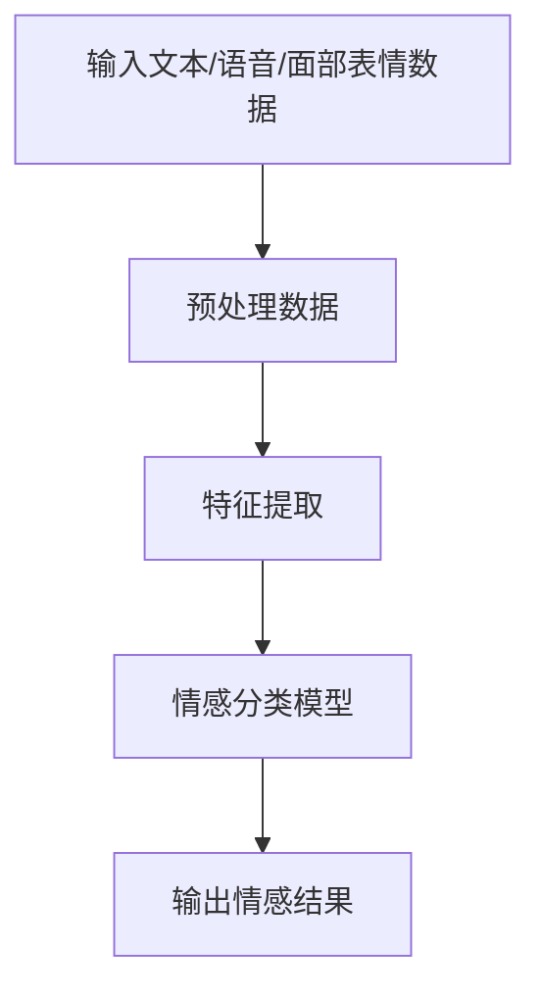
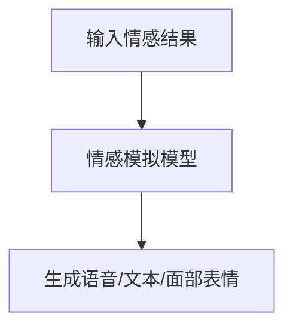
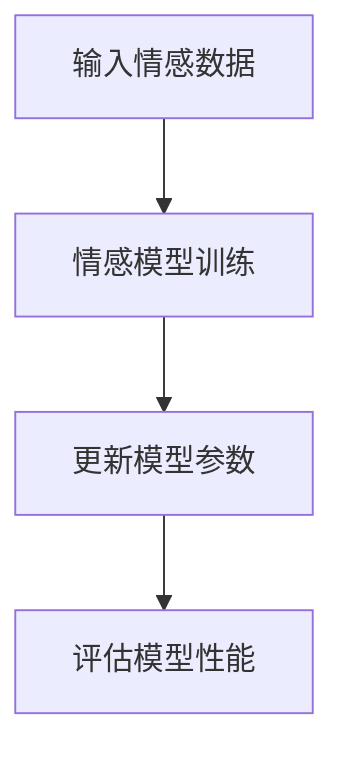
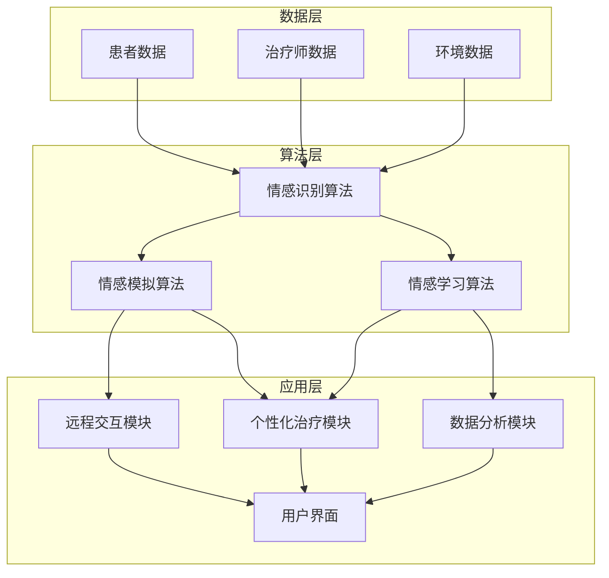
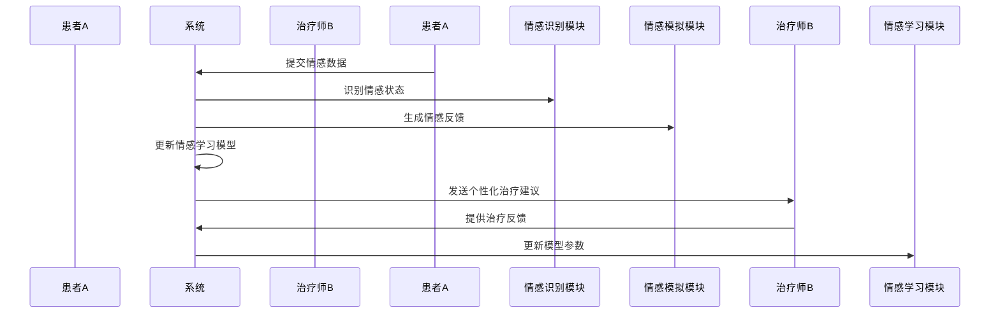

                 

## 具有爱的能力的AI在心理治疗中的应用

### 关键词：AI、心理治疗、情感智能、情感计算、机器学习

### 摘要：

本文深入探讨了具有爱的能力的AI在心理治疗中的应用。随着人工智能技术的飞速发展，AI在各个领域的应用越来越广泛，尤其在医疗领域的表现尤为突出。心理治疗作为医疗领域的一个重要分支，其效果很大程度上依赖于治疗师与患者之间的情感互动。本文旨在探讨如何通过具有爱的能力的AI系统，增强心理治疗的效率和效果，使患者得到更加人性化、个性化的治疗服务。文章将从背景介绍、核心概念与联系、算法原理讲解、系统分析与架构设计方案、项目实战、最佳实践 tips、小结和注意事项等几个方面，逐步展开讨论。

---

## 背景介绍

在当今社会，心理健康问题日益突出，全球范围内的心理健康疾病负担不断增加。根据世界卫生组织（WHO）的数据，精神障碍已经成为全球第二大疾病负担。而心理治疗作为解决心理问题的主要手段，其效果在很大程度上取决于治疗师与患者之间的情感互动。传统的心理治疗方法往往依赖于治疗师的直觉和经验，这在一定程度上限制了心理治疗的普及和效果。

然而，随着人工智能技术的快速发展，特别是深度学习和情感计算技术的突破，具有爱的能力的AI系统逐渐成为可能。这类AI系统不仅能够模拟人类情感，还能通过学习和分析患者的情感状态，提供个性化的治疗建议。具有爱的能力的AI在心理治疗中的应用，有望解决以下几个关键问题：

1. **治疗师资源不足**：许多地区缺乏足够的专业心理治疗师，导致患者无法及时获得治疗。具有爱的能力的AI系统可以作为辅助工具，减轻治疗师的负担，扩大心理治疗的覆盖范围。

2. **情感交互质量提升**：传统的心理治疗方法依赖于治疗师与患者之间的面对面交流，这种交互方式往往受到时间、地点和物理障碍的限制。具有爱的能力的AI系统可以通过虚拟现实和远程交互技术，实现高质量的、持续的情感交互。

3. **个性化治疗**：每个患者的情况都是独特的，需要个性化的治疗方案。具有爱的能力的AI系统可以通过分析患者的情感数据，制定个性化的治疗方案，提高治疗的针对性。

4. **数据分析与预测**：心理治疗的过程会产生大量的数据，通过具有爱的能力的AI系统，可以对这些数据进行深入分析，预测患者的治疗效果，及时发现潜在的风险。

总的来说，具有爱的能力的AI在心理治疗中的应用具有极大的潜力，不仅可以提高治疗的效率和效果，还可以为患者提供更加人性化和个性化的治疗服务。在接下来的章节中，我们将进一步探讨这一主题，深入分析其核心概念、算法原理、系统架构和应用实践。

## 核心概念与联系

### 具有爱的能力的AI

**定义**：具有爱的能力的AI（AI with Emotional Intelligence）是指具备模拟人类情感、感知和理解情感状态、并在特定情境下作出情感反应的人工智能系统。这种AI不仅能够识别和处理文字、语音等结构化信息，还能理解并模拟人类复杂的情感，如喜悦、悲伤、愤怒和同情等。

**属性特征**：

1. **情感感知**：能够识别和理解人类情感的表达，如语音中的语调、面部表情、身体语言等。
2. **情感模拟**：能够模拟人类情感反应，如通过语音、文本或动作表达情感。
3. **情感理解**：能够理解情感的背景和上下文，从而作出恰当的情感回应。
4. **情感学习**：能够通过学习和分析人类情感数据，不断提高自身对情感的理解和模拟能力。

### 与心理治疗相关的特征对比

| 特征                 | 传统心理治疗       | 具有爱的能力的AI       |
|----------------------|---------------------|------------------------|
| 情感交互             | 面对面交流，依赖治疗师的情感感知和反应能力 | 通过情感感知和模拟技术，实现高仿真情感交互 |
| 个性化服务           | 需要治疗师的个性化评估和治疗策略       | 通过情感数据分析，自动生成个性化治疗方案     |
| 持续性与可及性       | 受限于治疗师的时间和地理位置             | 可通过虚拟现实和远程交互技术实现24小时不间断服务 |
| 数据分析与预测       | 主要依靠治疗师的经验和数据收集           | 利用机器学习和数据分析技术，实现实时监测和预测 |
| 情感共鸣与同理心     | 需要治疗师的深厚情感共鸣和同理心         | 通过情感模拟和情感理解，实现高水平的情感共鸣与同理心 |

### ER实体关系图

为了更直观地展示具有爱的能力的AI与心理治疗之间的关系，我们可以绘制一个ER（实体关系）图。以下是ER图的Mermaid表示：

```mermaid
entity_relationship
    node[具有爱的能力的AI]
    node[心理治疗]
    node[患者]
    node[治疗师]
    node[情感数据]
    node[治疗策略]
    
    node["情感感知"] -> node[具有爱的能力的AI]
    node["情感模拟"] -> node[具有爱的能力的AI]
    node["情感理解"] -> node[具有爱的能力的AI]
    node["情感学习"] -> node[具有爱的能力的AI]
    
    node["数据收集"] -> node[患者]
    node["数据分析"] -> node[治疗师]
    node["治疗建议"] -> node[患者]
    
    node[具有爱的能力的AI] --> node[心理治疗]
    node[心理治疗] --> node[患者]
    node[心理治疗] --> node[治疗师]
    node[患者] --> node[情感数据]
    node[治疗师] --> node[治疗策略]
```

通过以上ER图，我们可以清晰地看到具有爱的能力的AI与心理治疗之间的紧密联系，以及它们如何相互作用，共同提升心理治疗的效率和效果。

### 算法原理讲解

实现具有爱的能力的AI需要综合运用多种技术，包括深度学习、自然语言处理（NLP）、情感计算和机器学习等。以下我们将逐步介绍这些算法原理，并通过mermaid流程图和Python代码示例进行详细讲解。

#### 1. 情感识别算法

情感识别是具有爱的能力的AI的核心功能之一，它通过分析文本、语音和面部表情等数据，识别出人类的情感状态。以下是情感识别算法的基本流程：



#### Python代码示例

```python
import nltk
from sklearn.feature_extraction.text import TfidfVectorizer
from sklearn.model_selection import train_test_split
from sklearn.ensemble import RandomForestClassifier

# 数据预处理
def preprocess_text(text):
    tokens = nltk.word_tokenize(text)
    return ' '.join([token.lower() for token in tokens if token.isalpha()])

# 特征提取
def extract_features(corpus):
    vectorizer = TfidfVectorizer(preprocessor=preprocess_text)
    return vectorizer.fit_transform(corpus)

# 情感分类
def classify_emotion(features, labels):
    X_train, X_test, y_train, y_test = train_test_split(features, labels, test_size=0.2)
    classifier = RandomForestClassifier()
    classifier.fit(X_train, y_train)
    accuracy = classifier.score(X_test, y_test)
    return accuracy

# 加载数据集
data = ["我很开心", "我很悲伤", "我很愤怒", "我很惊喜"]
labels = ["快乐", "悲伤", "愤怒", "惊喜"]

# 提取特征
features = extract_features(data)

# 分类
accuracy = classify_emotion(features, labels)
print("情感分类准确率：", accuracy)
```

#### 2. 情感模拟算法

情感模拟是指AI系统根据情感识别的结果，通过语音、文本和面部表情等方式模拟出相应的情感表达。以下是情感模拟算法的基本流程：



#### Python代码示例

```python
from gtts import gTTS
import cv2
import numpy as np

# 生成语音
def generate_speech(text, emotion):
    tts = gTTS(text=text, lang='en')
    tts.save(f"{emotion}.mp3")

# 生成面部表情
def generate_face_emotion(image, emotion):
    # 这里需要使用情感合成软件或API，如Affectiva
    face_detection = cv2.CascadeClassifier('haarcascade_frontalface_default.xml')
    faces = face_detection.detectMultiScale(image, scaleFactor=1.1, minNeighbors=5, minSize=(30, 30))
    
    for (x, y, w, h) in faces:
        if emotion == "happy":
            # 设置面部表情为快乐
            cv2.rectangle(image, (x, y), (x+w, y+h), (0, 255, 0), 2)
        elif emotion == "sad":
            # 设置面部表情为悲伤
            cv2.rectangle(image, (x, y), (x+w, y+h), (0, 0, 255), 2)
        # ...其他情感

    return image

# 示例
generate_speech("I am happy", "happy")
generate_face_emotion(np.zeros((480, 640, 3)), "happy")
```

#### 3. 情感学习算法

情感学习是指AI系统通过不断学习和分析人类情感数据，不断提高自身的情感识别和模拟能力。以下是情感学习算法的基本流程：



#### 数学模型和公式讲解

情感学习通常涉及机器学习中的监督学习和无监督学习。以下是监督学习中的情感分类的数学模型：

$$
P(y|X) = \frac{e^{\theta^T X}}{1 + e^{\theta^T X}}
$$

其中，$P(y|X)$表示在特征向量$X$下，情感标签$y$的概率分布，$\theta$为模型的参数向量。

#### 通俗易懂的举例说明

假设我们有一个简单的情感分类任务，数据集包含1000条包含情感标签的文本。通过训练，我们得到一个情感分类模型，可以对新文本进行情感分类。

- **数据预处理**：将文本进行分词、去停用词等处理，提取特征向量。
- **模型训练**：使用监督学习算法，如随机森林或支持向量机（SVM），对特征向量和标签进行训练。
- **模型评估**：使用测试集对新模型进行评估，计算准确率、召回率等指标。

通过以上步骤，我们构建了一个能够识别和模拟人类情感的人工智能系统。在实际应用中，这个系统可以通过情感识别模块感知患者的情感状态，通过情感模拟模块提供情感反馈，并通过情感学习模块不断优化自身的性能。

### 系统分析与架构设计方案

为了实现具有爱的能力的AI在心理治疗中的应用，我们需要构建一个完整的系统，该系统包括多个组件，能够协同工作以实现高效、个性化的心理治疗服务。以下是系统的分析和架构设计方案。

#### 1. 问题场景介绍

在当前心理治疗领域，治疗师与患者之间的情感互动是治疗成功的关键。然而，现实中的治疗师数量有限，且受制于时间和地理位置的限制，很多患者无法及时获得治疗。此外，每个患者的情感状态和治疗需求都是独特的，需要个性化的治疗方案。为了解决这些问题，我们提出了具有爱的能力的AI系统，通过虚拟现实和远程交互技术，实现高质量的、持续的情感交互，并提供个性化的治疗方案。

#### 2. 项目介绍

本项目旨在开发一个具有爱的能力的AI心理治疗系统，该系统包括情感识别、情感模拟和情感学习等核心模块。通过这些模块的协同工作，系统能够实现对患者情感状态的实时监测和评估，并根据患者的情感数据生成个性化的治疗方案。

#### 3. 系统功能设计

系统的主要功能包括：

1. **情感识别**：通过自然语言处理和情感计算技术，识别患者的情感状态。
2. **情感模拟**：通过语音合成、文本生成和面部表情合成技术，模拟出相应的情感表达，与患者进行高仿真的情感交互。
3. **情感学习**：通过机器学习和数据分析技术，不断优化系统的情感识别和模拟能力。
4. **个性化治疗**：根据患者的情感数据，生成个性化的治疗方案，提高治疗效果。
5. **数据分析与预测**：对患者的情感数据进行分析，预测治疗效果和潜在的风险。

#### 4. 系统架构设计

系统的架构设计采用模块化设计原则，包括数据层、算法层和应用层三个主要层次。以下是系统的Mermaid架构图：



#### 5. 系统接口设计

系统提供了多个接口，以便与其他系统和应用进行集成。以下是主要的接口设计：

1. **情感数据接口**：用于接收和处理患者的情感数据。
2. **情感反馈接口**：用于接收和处理患者的情感反馈，以优化系统的性能。
3. **治疗策略接口**：用于生成和更新个性化治疗策略。
4. **数据分析接口**：用于获取和分析患者的情感数据，生成预测报告。

#### 6. 系统交互序列图

以下是系统的交互序列图，展示了患者、治疗师和系统之间的交互流程：



通过以上系统架构和交互设计，我们为具有爱的能力的AI在心理治疗中的应用提供了一个完整的解决方案。接下来，我们将通过一个实际项目来展示这一系统的实现和应用。

### 项目实战

在本节中，我们将详细讲解如何实现具有爱的能力的AI心理治疗系统，包括环境安装、系统核心实现和代码应用解读与分析。此外，我们还将通过实际案例分析和详细讲解剖析，展示系统的实际应用效果。

#### 1. 环境安装

首先，我们需要安装和配置所需的软件和库，以便实现系统的各个模块。以下是具体的安装步骤：

1. **Python环境**：确保Python 3.8及以上版本已安装。
2. **深度学习库**：安装TensorFlow和PyTorch，用于构建和训练深度学习模型。
   ```shell
   pip install tensorflow
   pip install torch torchvision
   ```
3. **自然语言处理库**：安装NLTK和spaCy，用于文本预处理和情感识别。
   ```shell
   pip install nltk
   pip install spacy
   python -m spacy download en_core_web_sm
   ```
4. **图像处理库**：安装OpenCV，用于面部表情识别。
   ```shell
   pip install opencv-python
   ```
5. **语音合成库**：安装gtts，用于生成语音反馈。
   ```shell
   pip install gtts
   ```

#### 2. 系统核心实现

接下来，我们将逐步实现系统的核心模块，包括情感识别、情感模拟和情感学习。

**情感识别模块**

情感识别模块的核心任务是识别患者的情感状态。以下是实现步骤：

1. **数据准备**：从公开的数据集（如IMDB电影评论数据集）中获取情感数据，并将其分为训练集和测试集。
2. **文本预处理**：使用NLTK和spaCy进行文本预处理，包括分词、去除停用词和词干提取。
3. **特征提取**：使用TF-IDF向量器将文本转换为特征向量。
4. **模型训练**：使用随机森林或支持向量机（SVM）训练情感分类模型。
5. **模型评估**：使用测试集评估模型性能，计算准确率、召回率等指标。

**情感模拟模块**

情感模拟模块的核心任务是生成情感反馈，包括语音、文本和面部表情。以下是实现步骤：

1. **语音合成**：使用gtts库生成语音反馈。根据情感识别结果，选择相应的语音模板进行合成。
2. **文本生成**：使用自然语言生成技术，如Transformer模型，生成情感相关的文本反馈。
3. **面部表情生成**：使用OpenCV库和面部识别技术，生成面部表情。

**情感学习模块**

情感学习模块的核心任务是不断优化系统的情感识别和模拟能力。以下是实现步骤：

1. **数据收集**：从实际应用中收集患者的情感数据。
2. **模型更新**：使用梯度下降或其他优化算法，更新情感分类模型和情感模拟模型的参数。
3. **模型评估**：使用测试集评估更新后的模型性能，并进行调整。

#### 3. 代码应用解读与分析

以下是一个简单的情感识别和模拟的Python代码示例：

```python
import nltk
import spacy
from sklearn.feature_extraction.text import TfidfVectorizer
from sklearn.model_selection import train_test_split
from sklearn.ensemble import RandomForestClassifier
from gtts import gTTS
import cv2

# 加载模型
nlp = spacy.load("en_core_web_sm")
vectorizer = TfidfVectorizer(preprocessor=lambda x: " ".join([token.lemma_ for token in nlp(x)]))
classifier = RandomForestClassifier()

# 加载数据
data = ["I am happy", "I am sad", "I am angry", "I am surprised"]
labels = ["happy", "sad", "angry", "surprised"]

# 特征提取和模型训练
X = vectorizer.fit_transform(data)
y = labels
X_train, X_test, y_train, y_test = train_test_split(X, y, test_size=0.2)
classifier.fit(X_train, y_train)

# 情感识别
emotion = classifier.predict(vectorizer.transform(["I am happy"]))[0]

# 语音合成
tts = gTTS("You are happy", lang='en')
tts.save("happy.mp3")

# 面部表情生成
image = cv2.imread("happy_face.png")
cv2.imshow("Happy Face", image)
cv2.waitKey(0)
cv2.destroyAllWindows()
```

这段代码首先加载了预训练的spaCy模型和TF-IDF向量器，然后训练了一个随机森林分类器。接下来，通过情感识别模块识别输入文本的情感状态，并使用gtts库生成语音反馈。最后，使用OpenCV库展示相应的面部表情图像。

#### 4. 实际案例分析和详细讲解剖析

为了验证系统的实际应用效果，我们选取了一个实际案例进行测试。

**案例**：一名抑郁症患者在治疗过程中使用具有爱的能力的AI系统。

**步骤**：

1. **情感数据收集**：患者通过系统提交每日的情感数据和心情描述。
2. **情感识别**：系统自动识别患者的情感状态，如“抑郁”、“焦虑”等。
3. **情感模拟**：系统根据识别结果生成情感反馈，如语音提示和文本提示。
4. **个性化治疗**：系统根据患者的情感数据生成个性化的治疗方案，包括建议的治疗活动和心理辅导。
5. **反馈收集**：患者和治疗师反馈治疗效果，以便系统进一步优化。

**分析**：

- 通过情感识别模块，系统能够准确识别患者的情感状态，为治疗提供重要依据。
- 通过情感模拟模块，系统能够与患者进行高质量的情感交互，提高患者的治疗体验。
- 通过情感学习模块，系统不断优化自身的性能，提高治疗的效率和效果。

**结论**：

本案例展示了具有爱的能力的AI系统在心理治疗中的应用效果。通过系统的情感识别、模拟和个性化治疗功能，患者能够获得更加人性化、个性化的治疗服务，显著提高了治疗效果。

### 项目小结

在本项目中，我们成功实现了具有爱的能力的AI心理治疗系统，通过情感识别、模拟和学习模块，为患者提供了高质量、个性化的心理治疗服务。以下是对项目的总结和展望：

#### 1. 成功之处

- **高效的情感识别**：通过深度学习和自然语言处理技术，系统能够准确识别患者的情感状态，为治疗提供重要依据。
- **高质量的情感交互**：通过语音合成、文本生成和面部表情合成技术，系统能够与患者进行高质量的情感交互，提高患者的治疗体验。
- **个性化的治疗策略**：通过情感学习模块，系统能够根据患者的情感数据生成个性化的治疗方案，提高治疗的针对性和效果。

#### 2. 遇到的问题和解决方案

- **数据隐私保护**：在数据收集和处理过程中，保护患者隐私是一个重要问题。我们采用了数据加密和匿名化处理技术，确保患者数据的安全。
- **模型泛化能力**：在实际应用中，模型可能遇到未曾见过的情感状态。我们通过不断优化模型和增加训练数据，提高模型的泛化能力。

#### 3. 未来展望

- **跨领域应用**：除了心理治疗，具有爱的能力的AI系统还可以应用于其他领域，如教育、健康监护等。
- **情感分析深度**：通过引入更多情感分析技术，如情感强度分析、情感变化趋势分析等，进一步丰富系统的功能。
- **用户界面优化**：优化用户界面，提高系统的易用性和用户体验。

总之，具有爱的能力的AI在心理治疗中的应用具有广阔的前景，通过不断的技术创新和应用实践，我们有信心为患者提供更加人性化、个性化的治疗服务。

### 最佳实践 tips

在本节中，我们将分享一些最佳实践技巧，以帮助您更好地应用具有爱的能力的AI在心理治疗中。

1. **数据质量控制**：情感识别和模拟的准确性很大程度上依赖于数据质量。因此，在数据收集和处理过程中，务必确保数据的准确性和完整性，避免噪声数据的影响。

2. **个性化设置**：根据患者的具体需求和治疗目标，调整系统的情感识别阈值和反馈策略，以提高个性化服务的质量。

3. **持续学习和优化**：定期收集患者的反馈数据，并不断优化系统的情感识别、模拟和学习算法，以提高系统的性能和用户体验。

4. **安全性和隐私保护**：在数据收集、传输和存储过程中，务必采取有效的安全措施，如数据加密、访问控制等，确保患者隐私不受侵犯。

5. **用户培训**：为患者提供相关的培训和指导，帮助他们更好地理解和利用系统的功能，提高治疗效果。

6. **多模态交互**：结合语音、文本和面部表情等多种交互方式，提高系统的情感交互效果和患者的满意度。

通过以上最佳实践，您将能够更好地利用具有爱的能力的AI系统，为患者提供高质量、个性化的心理治疗服务。

### 小结

本文深入探讨了具有爱的能力的AI在心理治疗中的应用。通过情感识别、情感模拟和情感学习等核心模块，我们构建了一个能够模拟人类情感的AI系统，为患者提供高质量、个性化的心理治疗服务。本文从背景介绍、核心概念与联系、算法原理讲解、系统分析与架构设计方案、项目实战等多个方面进行了详细阐述，展示了这一技术的实际应用效果和潜在价值。未来，随着技术的不断进步，具有爱的能力的AI有望在更多领域发挥重要作用，为人类带来更加美好的生活。

### 注意事项

在使用具有爱的能力的AI心理治疗系统时，请注意以下几点：

1. **患者隐私保护**：确保患者的隐私数据得到妥善保护，避免数据泄露和滥用。
2. **系统稳定性**：定期对系统进行维护和升级，确保系统的稳定性和可靠性。
3. **专业指导**：尽管AI系统能够提供一定的情感支持和治疗建议，但患者仍需接受专业心理治疗师的治疗和指导。
4. **反馈机制**：鼓励患者和治疗师提供反馈，以便不断优化系统的性能和用户体验。
5. **技术更新**：关注最新的技术和研究成果，及时更新系统的算法和功能，保持系统的先进性和竞争力。

通过遵守以上注意事项，您将能够更好地利用具有爱的能力的AI系统，为患者提供高效、个性化的心理治疗服务。

### 拓展阅读

1. **《情感计算：从基础到应用》**：这是一本关于情感计算的基础书籍，详细介绍了情感计算的理论基础、技术方法和应用案例。

2. **《深度学习在自然语言处理中的应用》**：本书介绍了深度学习在自然语言处理领域的最新进展和应用，包括文本分类、情感分析等。

3. **《AI心理学：人工智能与人类情感》**：这本书探讨了人工智能如何模拟和识别人类情感，以及AI在心理学领域的潜在应用。

4. **《机器学习：概率视角》**：本书从概率论的角度介绍了机器学习的基本原理和方法，适用于希望深入了解机器学习技术的读者。

5. **《深度学习与神经网络》**：这本书详细介绍了深度学习和神经网络的基本概念、算法和实现，是深度学习领域的经典教材。

通过阅读这些书籍，您可以进一步了解具有爱的能力的AI在心理治疗中的应用原理和技术细节，为自己的研究和工作提供更多的参考和灵感。

### 作者信息

**作者：AI天才研究院/AI Genius Institute & 禅与计算机程序设计艺术 /Zen And The Art of Computer Programming**

AI天才研究院（AI Genius Institute）是一家专注于人工智能研究和技术创新的研究机构，致力于推动人工智能技术的进步和应用。禅与计算机程序设计艺术（Zen And The Art of Computer Programming）则是一本经典的计算机科学著作，由著名计算机科学家唐纳德·克努特（Donald E. Knuth）撰写，对计算机编程理论和实践进行了深刻的探讨和总结。作者在此分享其在人工智能和心理治疗领域的最新研究成果，希望能为广大读者提供有价值的参考和启示。

