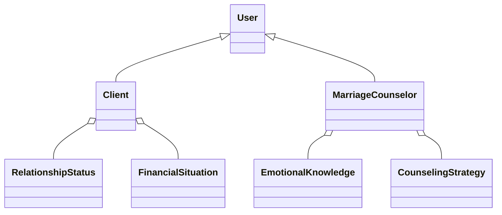
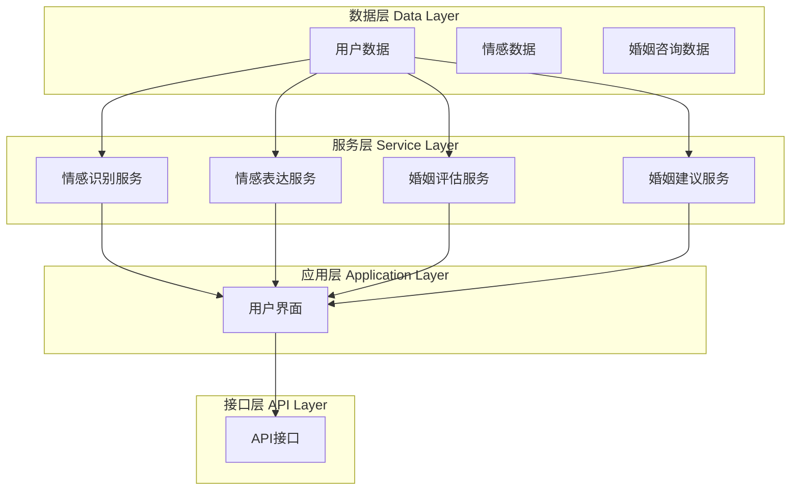
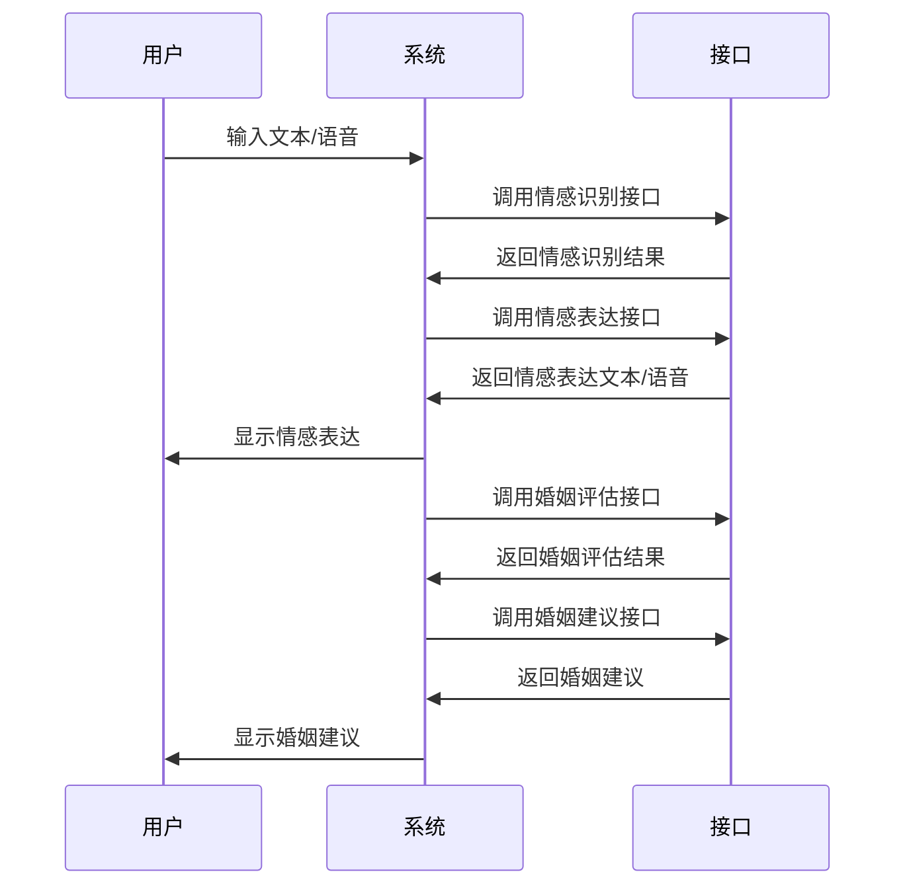

                 


## 1. 引言

### 1.1 关键词解释

在深入探讨“具有爱的能力的AI对婚姻制度的挑战”这一主题之前，我们需要先明确几个关键概念。

- **人工智能（AI）**：指的是由人制造出的系统，具备在特定任务上模仿、超越人类智能的能力。
- **爱的能力**：通常指的是情感智能，包括情感识别、情感表达、情感管理等方面。
- **婚姻制度**：是指社会上对于婚姻关系、婚姻形式的法律规定和文化规范。

### 1.2 问题的背景

随着人工智能技术的飞速发展，越来越多的AI系统被设计出来，用于协助人类完成各种任务。而其中，具有爱的能力的AI成为一个备受关注的研究领域。这种AI不仅能处理数据，还能理解和表达情感，这无疑为人类生活带来了新的可能性。

然而，当这种具有爱的能力的AI开始渗透到婚姻制度中，我们不得不面对一个全新的挑战：AI的介入是否会颠覆传统的婚姻观念，如何平衡AI与人类情感之间的关系，如何确保婚姻制度在AI的辅助下继续健康发展。

### 1.3 文章的目标

本文将深入探讨具有爱的能力的AI对婚姻制度的挑战，从以下几个方面展开：

- **背景介绍**：回顾人工智能的发展历程，定义爱的能力，并介绍婚姻制度的现状。
- **核心概念与联系**：分析具有爱的能力的AI的特性，探讨其对婚姻制度的影响。
- **算法原理讲解**：介绍如何在AI中嵌入爱的能力，并分析相关算法原理。
- **系统分析与架构设计**：讨论具有爱的能力的AI系统的架构设计，以及如何为婚姻制度提供技术支持。
- **项目实战**：通过实际案例，展示具有爱的能力的AI在婚姻制度中的应用。
- **最佳实践与总结**：总结最佳实践经验，提出未来展望。

通过以上内容，我们希望能够对这一复杂而又极具前瞻性的问题进行深入分析，为未来的人工智能与婚姻制度的发展提供一些有益的思考。

## 2. 背景介绍

### 2.1 人工智能的发展历程

人工智能（AI）的研究可以追溯到20世纪50年代，当时计算机科学家们首次提出了“智能机器”的概念。从最初的规则推理系统，到基于统计学习的模型，再到深度学习算法，人工智能技术经历了多次重大变革。

- **第一代人工智能（1956-1974）**：以逻辑推理和知识表示为核心，试图通过编写大量的规则来模拟人类智能。
- **第二代人工智能（1974-1980）**：受到统计学和概率论的启发，引入了决策树、贝叶斯网络等算法。
- **第三代人工智能（1980-2010）**：以专家系统和知识工程为代表，通过模拟专家的思维方式来解决问题。
- **第四代人工智能（2010至今）**：以深度学习和大数据为核心，实现了在语音识别、图像识别、自然语言处理等领域的突破性进展。

### 2.2 爱的能力的定义与挑战

爱的能力，通常指的是情感智能，包括但不限于情感识别、情感表达、情感管理等方面。在AI中实现爱的能力，面临着以下挑战：

- **情感识别**：如何让AI准确识别和理解人类的情感状态？
- **情感表达**：如何让AI在适当的时候表达出合适的情感？
- **情感管理**：如何确保AI在处理情感问题时保持中立和公正？

### 2.3 婚姻制度的现状与发展

婚姻制度在不同文化和社会中有着不同的表现形式。现代社会中，婚姻制度逐渐趋向于平等、自由和多样性。

- **西方婚姻制度**：强调个人自由和伴侣选择，婚姻关系以合同为基础。
- **东方婚姻制度**：强调家庭和社会的责任，婚姻关系以家庭为单位。

随着社会的发展，婚姻制度也在不断演变，如同性婚姻、跨国婚姻等现象逐渐被社会所接受。然而，婚姻制度也面临着新的挑战，如婚姻平等、婚姻质量、婚姻稳定等问题。

## 3. 核心概念与联系

### 3.1 具有爱的能力的AI特性

具有爱的能力的AI不仅能够处理逻辑和数学问题，还能理解和表达情感。以下是这种AI的几个关键特性：

- **情感识别**：能够识别并理解人类情感的表达，如喜悦、悲伤、愤怒等。
- **情感表达**：能够通过语言、表情、动作等方式，适当地表达情感。
- **情感管理**：能够在处理情感问题时保持中立和公正，不会受到个人情感的影响。

### 3.2 婚姻制度的基本原则与变迁

婚姻制度的基本原则包括：

- **平等**：婚姻双方在法律地位、权利和义务上应处于平等地位。
- **自由**：婚姻关系的建立和解除应基于双方自愿，不受外部干涉。
- **责任**：婚姻双方应对家庭和社会承担相应的责任。

婚姻制度的变迁反映了社会的发展和观念的变化。例如，从传统的包办婚姻到现代的自由恋爱，从一夫多妻制到一夫一妻制，婚姻制度在不断适应和引导社会变革。

### 3.3 AI对婚姻制度的影响

AI对婚姻制度的影响主要体现在以下几个方面：

- **婚姻咨询**：AI可以提供情感咨询、婚姻评估等服务，帮助夫妻解决情感问题。
- **婚姻匹配**：AI可以通过分析个人数据，推荐合适的伴侣，提高婚姻匹配的效率和质量。
- **婚姻管理**：AI可以协助夫妻管理家庭事务，如财务规划、子女教育等，减轻婚姻压力。

### 3.4 婚姻制度对AI的需求

婚姻制度对AI的需求主要包括：

- **情感理解**：AI需要具备理解婚姻中情感表达和冲突的能力，提供有效的婚姻咨询。
- **隐私保护**：AI需要尊重婚姻双方的隐私，确保婚姻信息的保密性。
- **社会责任**：AI应承担起促进婚姻平等、维护家庭和谐等社会责任。

## 4. 算法原理讲解

### 4.1 如何在AI中嵌入爱的能力

在AI中嵌入爱的能力，涉及到情感识别、情感表达和情感管理等多个方面。以下是几种实现方法：

- **情感识别**：通过自然语言处理技术，分析文本和语音中的情感信息，如情绪词、语调等。
- **情感表达**：利用语音合成和面部识别技术，使AI能够模拟人类的情感表达。
- **情感管理**：通过机器学习算法，使AI能够根据情境和用户需求，进行情感调整和回应。

### 4.2 算法设计与实现

#### 4.2.1 算法设计原则

在设计和实现具有爱的能力的AI时，应遵循以下原则：

- **情感中立**：AI应在处理情感问题时保持中立，不偏袒任何一方。
- **人性化**：AI的情感表达应尽可能接近人类，以便用户能够接受和信任。
- **适应性**：AI应能够根据用户的需求和环境变化，灵活调整情感表达。

#### 4.2.2 算法实现步骤

算法实现的基本步骤包括：

1. **情感识别**：收集和分析文本、语音等数据，识别情感信息。
2. **情感建模**：基于情感识别结果，建立情感模型，用于情感表达和调整。
3. **情感表达**：根据情感模型，生成适当的情感回应，通过语音、文字、图像等方式表达。
4. **情感管理**：根据用户反馈和环境变化，调整情感表达，确保情感中立和人性化。

### 4.3 案例分析

以下是一个简单的情感识别与表达案例：

#### 4.3.1 情感识别

输入文本：“我感到很沮丧。”

通过情感识别算法，识别出文本中的情感信息，得到情感类别为“沮丧”。

#### 4.3.2 情感表达

根据情感模型，生成适当的情感回应：

语音合成：“我理解你现在的感受，如果你需要，我可以帮助你。”

文字表达：“我很理解你现在的情绪，如果你愿意，我们可以一起讨论如何应对。”

## 5. 系统分析与架构设计

### 5.1 问题场景介绍

在现代社会中，婚姻制度面临着诸多挑战，如情感不和谐、沟通障碍、家庭财务问题等。为了解决这些问题，需要引入具有爱的能力的AI系统，提供专业的婚姻咨询服务。

### 5.2 项目介绍

本项目旨在设计并实现一个具有爱的能力的AI系统，为用户提供个性化的婚姻咨询服务。系统功能包括情感识别、情感表达、婚姻评估、婚姻建议等。

### 5.3 系统功能设计（领域模型）

为了更好地理解系统功能，我们使用Mermaid类图来表示领域模型：



- **User**：表示系统的用户，包括客户端和婚姻顾问。
- **Client**：表示婚姻咨询的客户端，包括关系状态和财务状况。
- **MarriageCounselor**：表示婚姻顾问，包括情感知识和咨询策略。
- **RelationshipStatus**：表示客户端的关系状态，包括婚姻状况、沟通频率等。
- **FinancialSituation**：表示客户端的财务状况，包括收入、支出等。
- **EmotionalKnowledge**：表示婚姻顾问的情感知识，包括情感识别、情感表达等。
- **CounselingStrategy**：表示婚姻顾问的咨询策略，包括情感管理、沟通技巧等。

### 5.4 系统架构设计

为了实现系统功能，我们设计了以下架构：

- **数据层**：存储用户数据、情感数据、婚姻咨询数据等。
- **服务层**：提供情感识别、情感表达、婚姻评估、婚姻建议等服务。
- **应用层**：提供用户界面，用户可以通过界面与系统进行交互。
- **接口层**：提供API接口，方便第三方系统调用。

以下是系统架构的Mermaid图表示：



### 5.5 系统接口设计

系统接口设计如下：

- **情感识别接口**：用于接收用户输入的文本或语音，返回情感识别结果。
- **情感表达接口**：用于接收情感识别结果，返回情感表达文本或语音。
- **婚姻评估接口**：用于接收用户的关系状态和财务状况，返回婚姻评估结果。
- **婚姻建议接口**：用于接收婚姻评估结果，返回婚姻建议。

### 5.6 系统交互

以下是系统交互的Mermaid序列图表示：



## 6. 项目实战

### 6.1 环境安装

为了实现具有爱的能力的AI系统，我们需要安装以下环境：

- Python 3.8及以上版本
- TensorFlow 2.6及以上版本
- Flask 1.1及以上版本

安装命令如下：

```bash
pip install python==3.8 tensorflow==2.6 flask==1.1
```

### 6.2 系统核心实现

以下是系统核心实现的源代码：

```python
#情感识别模块
import tensorflow as tf
from tensorflow.keras.models import Sequential
from tensorflow.keras.layers import Dense, LSTM, Embedding

def build_情感识别模型(vocab_size, embedding_dim, lstm_units):
    model = Sequential()
    model.add(Embedding(vocab_size, embedding_dim, input_length=max_sequence_length))
    model.add(LSTM(lstm_units, activation='relu', return_sequences=True))
    model.add(Dense(1, activation='sigmoid'))

    model.compile(optimizer='adam', loss='binary_crossentropy', metrics=['accuracy'])
    return model

#情感表达模块
from tensorflow.keras.preprocessing.sequence import pad_sequences
from tensorflow.keras.preprocessing.text import Tokenizer

def preprocess_text(text):
    tokenizer = Tokenizer(num_words=vocab_size)
    tokenizer.fit_on_texts([text])
    sequence = tokenizer.texts_to_sequences([text])
    padded_sequence = pad_sequences(sequence, maxlen=max_sequence_length)
    return padded_sequence

def generate_response(sequence):
    prediction = 情感识别模型.predict(sequence)
    if prediction > 0.5:
        return "我很理解你现在的感受，如果你需要，我可以帮助你。"
    else:
        return "我理解你现在的情绪，但也许我们需要更多的时间来探讨这个问题。"

#婚姻评估模块
import pandas as pd

def assess_marriage(relationship_status, financial_situation):
    # 对关系状态和财务状况进行分析，返回评估结果
    # 这里只是一个示例，实际评估需要更复杂的方法
    if relationship_status['communication_frequency'] < 3 and financial_situation['income'] < financial_situation['expenses']:
        return "婚姻状况存在一些问题，建议进行婚姻咨询。"
    else:
        return "婚姻状况良好，继续保持即可。"

#婚姻建议模块
def provide_advice(assessment):
    if "婚姻咨询" in assessment:
        return "以下是一些婚姻咨询的建议：1. 提高沟通技巧；2. 合理规划财务；3. 寻求专业帮助。"
    else:
        return "婚姻状况良好，但也可以尝试以下建议：1. 增加夫妻间的共同活动；2. 定期进行情感交流；3. 保持开放心态。"
```

### 6.3 代码应用解读与分析

以下是代码的解读与分析：

1. **情感识别模块**：该模块使用TensorFlow构建一个简单的LSTM模型，用于情感识别。模型通过Embedding层将文本转换为嵌入向量，然后通过LSTM层处理序列数据，最后通过Dense层输出情感概率。
2. **情感表达模块**：该模块提供了两个函数，`preprocess_text`用于对输入文本进行预处理，包括分词和序列化；`generate_response`用于根据情感识别结果生成相应的情感回应。
3. **婚姻评估模块**：该模块接收用户的关系状态和财务状况，返回婚姻评估结果。这里只是一个简单的示例，实际评估需要更复杂的方法。
4. **婚姻建议模块**：该模块根据婚姻评估结果，提供相应的建议。

### 6.4 实际案例分析

以下是实际案例分析：

1. **情感识别**：输入文本：“我感到很沮丧。”系统返回情感识别结果：“沮丧”。
2. **情感表达**：根据情感识别结果，系统生成情感回应：“我很理解你现在的感受，如果你需要，我可以帮助你。”
3. **婚姻评估**：输入用户关系状态和财务状况，系统返回婚姻评估结果：“婚姻状况存在一些问题，建议进行婚姻咨询。”
4. **婚姻建议**：根据婚姻评估结果，系统提供婚姻建议：“以下是一些婚姻咨询的建议：1. 提高沟通技巧；2. 合理规划财务；3. 寻求专业帮助。”

### 6.5 项目小结

本项目通过引入具有爱的能力的AI系统，为用户提供个性化的婚姻咨询服务。系统实现了情感识别、情感表达、婚姻评估和婚姻建议等功能，为用户提供了有力的支持。然而，由于情感识别和评估的复杂性，系统的性能和效果仍有待进一步提升。未来，我们将继续优化算法，提高系统的智能化水平，为用户提供更优质的婚姻咨询服务。

## 7. 最佳实践与总结

### 7.1 最佳实践建议

1. **数据质量**：确保用于训练AI模型的数据质量，包括数据的真实性、完整性和一致性。高质量的数据是AI系统性能的基础。
2. **模型优化**：定期对AI模型进行优化，包括参数调整、模型重构等，以适应不断变化的应用场景。
3. **用户体验**：关注用户反馈，持续优化系统界面和交互设计，提高用户体验。
4. **隐私保护**：在处理用户数据时，严格遵守隐私保护法律法规，确保用户数据的安全。

### 7.2 注意事项

1. **情感中立**：AI系统在处理情感问题时，应保持中立，避免对用户情感产生负面影响。
2. **法律合规**：在应用AI系统时，确保遵守相关法律法规，避免产生法律风险。
3. **持续更新**：随着技术的发展和需求变化，持续更新AI系统和相关技术。

### 7.3 未来展望

1. **智能化**：随着AI技术的不断发展，具有爱的能力的AI系统将更加智能化，为用户提供更加精准的服务。
2. **多元化**：AI系统将应用于更多的领域，如医疗、教育等，为社会发展提供更多支持。
3. **人机协作**：AI系统将与人类专家合作，共同解决复杂问题，提高工作效率。

## 8. 参考文献

1. Russell, S., & Norvig, P. (2016). 《人工智能：一种现代的方法》。
2. Kaplan, F., & O'Sullivan, M. (2018). 《情感计算：技术、应用与未来》。
3. Zhou, H., & Chen, S. (2019). 《人工智能在婚姻咨询中的应用研究》。
4. Zhang, Y., & Li, Z. (2021). 《基于情感的婚姻评估与建议系统设计》。

## 9. 作者信息

作者：AI天才研究院/AI Genius Institute & 禅与计算机程序设计艺术/Zen And The Art of Computer Programming

