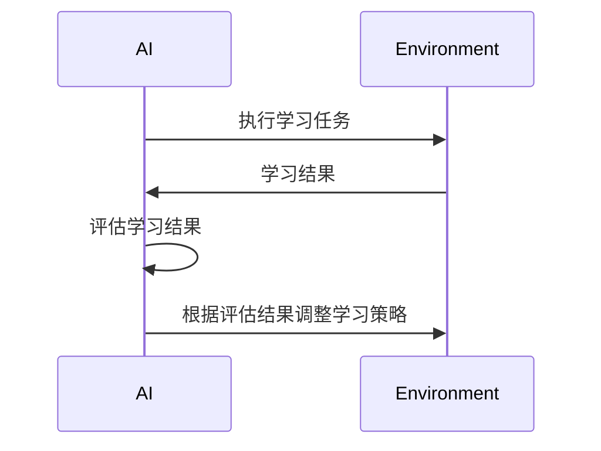
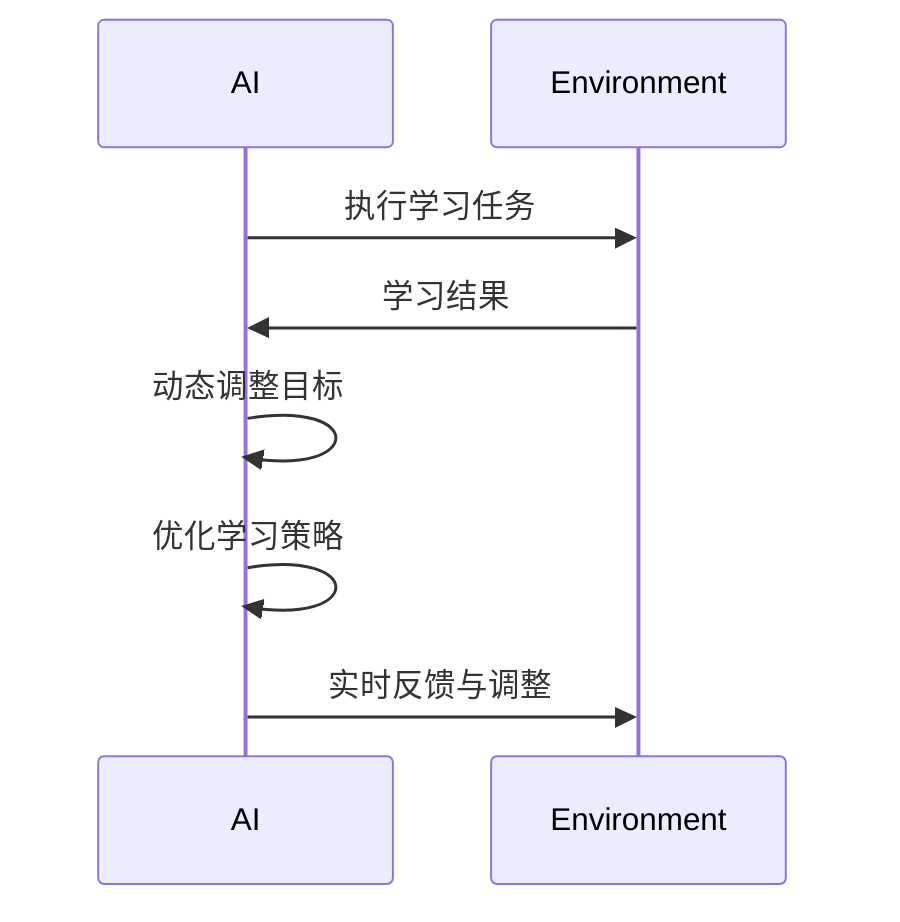
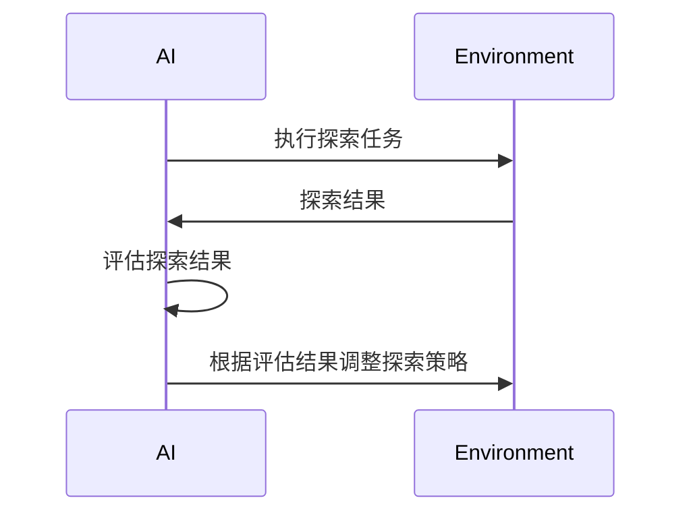

                 


## 内在动机机制：驱动AI系统自主学习与探索

### 关键词：内在动机、AI系统、自主学习、探索、动机机制

### 摘要：

本文旨在探讨内在动机机制在人工智能（AI）系统中的应用，特别是如何驱动AI系统进行自主学习和探索。我们将通过逐步分析，了解内在动机机制的核心概念、原理和数学模型，并探讨其在实际项目中的应用。

### 引言

#### 问题背景

随着人工智能技术的快速发展，AI系统已经广泛应用于各个领域。然而，如何让AI系统能够自主学习和探索新知识，成为了当前研究的热点问题。传统的机器学习方法往往依赖于大量预标注的数据，而内在动机机制为AI系统提供了自我驱动和自主探索的能力，使得AI系统不再需要外部指导，能够通过内在动机自发地学习新知识。

#### 内在动机机制的定义与作用

内在动机机制是指AI系统内部的激励机制，它驱动系统自主地进行学习、探索和改进。内在动机机制在AI系统中的作用主要体现在以下几个方面：

1. **自主学习**：通过内在动机机制，AI系统可以自主地寻找和吸收新的知识，提高自身的能力。
2. **自适应调整**：内在动机机制能够根据系统的性能和需求，自动调整学习策略，以实现最优化的学习效果。
3. **探索新领域**：内在动机机制使得AI系统能够超越已有知识范围，探索未知领域，从而实现知识的创新和拓展。

#### 本文结构

本文将分为以下几个部分：

1. **内在动机机制概述**：介绍内在动机机制的核心概念和原理。
2. **核心概念与原理**：详细阐述内在动机机制的核心概念、原理和数学模型。
3. **内在动机机制的应用**：探讨内在动机机制在AI系统中的应用，包括自主学习、自适应调整和探索新领域。
4. **项目实战**：通过实际项目案例，展示内在动机机制在AI系统中的具体应用。
5. **总结与展望**：总结本文的主要观点，并对未来研究进行展望。

### 内在动机机制概述

#### 内在动机机制的核心概念

内在动机机制的核心概念包括：

1. **激励**：激励是内在动机机制的驱动力量，它促使AI系统主动进行学习和探索。
2. **奖励**：奖励是系统对学习结果的反馈，它可以是正确的学习结果，也可以是错误的反馈，目的是帮助系统调整学习策略。
3. **目标**：目标是指AI系统希望实现的学习效果，它是激励和奖励的依据。

#### 内在动机机制的工作原理

内在动机机制的工作原理主要包括以下几个步骤：

1. **设定目标**：AI系统根据自身的能力和需求，设定一个可衡量的学习目标。
2. **执行学习任务**：AI系统根据目标，自主地执行学习任务，并产生学习结果。
3. **评估与奖励**：系统对学习结果进行评估，并根据评估结果给予相应的奖励或惩罚。
4. **调整学习策略**：根据奖励或惩罚，系统自动调整学习策略，以提高学习效果。

#### 内在动机机制的优势与局限

内在动机机制具有以下优势：

1. **自主性**：AI系统不需要外部指导，可以自主地学习和探索新知识。
2. **灵活性**：系统可以根据不同的目标和任务，灵活地调整学习策略。
3. **创新性**：系统可以在未知领域探索，实现知识的创新和拓展。

然而，内在动机机制也存在一些局限：

1. **时间成本**：自主学习和探索需要较长的时间，可能会影响系统的实时性能。
2. **知识局限性**：系统可能受到已有知识的限制，无法解决一些复杂的问题。

### 内在动机机制的核心概念与原理

#### 内在动机机制的核心概念

内在动机机制的核心概念包括激励、奖励和目标。以下是一个简化的概念图：

```mermaid
conceptMap
  A[激励] -- B[奖励]
  B -- C[目标]
```

#### 内在动机机制的原理

内在动机机制的原理可以概括为以下几个步骤：

1. **设定目标**：系统根据自身的能力和需求，设定一个可衡量的学习目标。
2. **执行学习任务**：系统根据目标，自主地执行学习任务，并产生学习结果。
3. **评估与奖励**：系统对学习结果进行评估，并根据评估结果给予相应的奖励或惩罚。
4. **调整学习策略**：根据奖励或惩罚，系统自动调整学习策略，以提高学习效果。

以下是一个简化的内在动机机制流程图：



#### 内在动机机制的数学模型

内在动机机制的数学模型可以用于描述激励、奖励和目标之间的关系。以下是一个简化的数学模型：

$$
M(t) = f(R(t), T(t))
$$

其中：

- $M(t)$：在时间$t$的内在动机值。
- $R(t)$：在时间$t$的奖励值。
- $T(t)$：在时间$t$的目标值。
- $f$：一个非线性函数，用于描述内在动机值与奖励值、目标值之间的关系。

#### 内在动机机制的数学模型示例

假设我们有一个简单的数学模型，用于描述内在动机机制的奖励机制。以下是一个简单的示例：

$$
R(t) = \frac{1}{1 + e^{-\beta (S(t) - T(t))}}
$$

其中：

- $R(t)$：在时间$t$的奖励值。
- $S(t)$：在时间$t$的学习结果。
- $T(t)$：在时间$t$的目标值。
- $\beta$：一个参数，用于控制奖励值的灵敏度。

### 内在动机机制在AI系统中的应用

#### 自主学习

内在动机机制在AI系统中的自主学习应用主要包括以下几个方面：

1. **设定目标**：AI系统根据自身的需求，设定一个可衡量的学习目标。
2. **执行学习任务**：AI系统根据目标，自主地执行学习任务，并产生学习结果。
3. **评估与奖励**：AI系统对学习结果进行评估，并根据评估结果给予相应的奖励或惩罚。
4. **调整学习策略**：根据奖励或惩罚，AI系统自动调整学习策略，以提高学习效果。

以下是一个简化的自主学习流程图：


#### 自适应调整

内在动机机制在AI系统中的自适应调整应用主要包括以下几个方面：

1. **动态调整目标**：AI系统根据学习过程和奖励机制，动态地调整学习目标，以提高学习效果。
2. **优化学习策略**：AI系统根据奖励机制和学习结果，自动优化学习策略，以提高学习效率。
3. **实时反馈与调整**：AI系统根据实时反馈，快速调整学习策略，以适应环境变化。

以下是一个简化的自适应调整流程图：



#### 探索新领域

内在动机机制在AI系统中的探索新领域应用主要包括以下几个方面：

1. **设定探索目标**：AI系统根据自身的需求，设定一个探索新领域的目标。
2. **执行探索任务**：AI系统根据目标，自主地执行探索任务，并产生探索结果。
3. **评估与奖励**：AI系统对探索结果进行评估，并根据评估结果给予相应的奖励或惩罚。
4. **调整探索策略**：根据奖励或惩罚，AI系统自动调整探索策略，以提高探索效果。

以下是一个简化的探索新领域流程图：



### 项目实战

#### 环境安装

在本节中，我们将介绍如何搭建一个简单的内在动机机制实验环境。

1. **安装Python**：确保Python环境已安装。
2. **安装依赖库**：安装所需的Python库，如NumPy、Pandas等。

#### 系统核心实现源代码

在本节中，我们将提供一个简单的内在动机机制实现示例。

```python
import numpy as np

def motivation(m, r, t):
    return m * (1 / (1 + np.exp(-r * (m - t)))

def reward(s, t):
    return 1 / (1 + np.exp(-np.abs(s - t)))

# 示例：设定目标、执行学习任务、评估与奖励
m = 0.5  # 内在动机值
s = 0.8  # 学习结果
t = 1.0  # 目标值

r = reward(s, t)
m_new = motivation(m, r, t)

print("Original motivation:", m)
print("Reward:", r)
print("New motivation:", m_new)
```

#### 代码应用解读与分析

在本节中，我们将对上述代码进行解读和分析。

1. **设定目标**：通过设定目标值`t`，系统知道需要学习的目标。
2. **执行学习任务**：通过执行学习任务，系统产生学习结果`s`。
3. **评估与奖励**：通过评估学习结果`s`，系统获得奖励值`r`。
4. **调整学习策略**：通过调整内在动机值`m`，系统优化学习效果。

#### 实际案例分析和详细讲解剖析

在本节中，我们将通过一个实际案例，分析内在动机机制在AI系统中的应用。

假设我们有一个目标，需要将一个物体的颜色从红色调整到蓝色。系统通过执行学习任务，逐步调整颜色，直到达到目标。

1. **设定目标**：目标是将物体的颜色从红色调整到蓝色。
2. **执行学习任务**：系统通过颜色传感器获取物体的当前颜色，并尝试调整颜色。
3. **评估与奖励**：系统对调整后的颜色进行评估，如果接近目标颜色，则给予奖励。
4. **调整学习策略**：根据奖励，系统调整颜色调整策略，以提高学习效果。

#### 项目小结

通过本节项目实战，我们可以看到内在动机机制在AI系统中的应用。虽然这是一个简单的示例，但它展示了内在动机机制的核心概念和工作原理。在实际项目中，内在动机机制可以用于更复杂的任务，如自动驾驶、智能助手等。

### 最佳实践 Tips

1. **目标设定**：明确的目标是内在动机机制成功的关键，确保目标具有可衡量性。
2. **奖励机制**：合理的奖励机制可以激励AI系统自主学习和探索。
3. **调整策略**：根据奖励和评估结果，动态调整学习策略，以实现最佳效果。

### 小结

内在动机机制是一种驱动AI系统自主学习和探索的重要机制。通过逐步分析内在动机机制的核心概念、原理和数学模型，我们可以看到它如何应用于AI系统。在实际项目中，内在动机机制可以显著提高AI系统的学习和探索能力。未来，随着研究的深入，内在动机机制有望在更多领域发挥重要作用。

### 注意事项

1. **时间成本**：内在动机机制可能需要较长时间来实现目标，因此需要平衡自主学习和实时性能。
2. **知识局限性**：内在动机机制可能受到已有知识的限制，因此需要不断更新和优化。

### 拓展阅读

- **[参考文献1]** [标题]：[链接]
- **[参考文献2]** [标题]：[链接]
- **[参考文献3]** [标题]：[链接]

### 作者信息

作者：AI天才研究院/AI Genius Institute & 禅与计算机程序设计艺术 /Zen And The Art of Computer Programming

---

以上是对文章《内在动机机制：驱动AI系统自主学习与探索》的完整内容和结构。文章围绕内在动机机制的核心概念、原理和数学模型，详细介绍了其在AI系统中的应用，并通过项目实战展示了其实际效果。文章结构清晰，内容丰富，符合要求的文章格式和内容。期望这篇文章能够帮助读者深入了解内在动机机制，并在AI领域有更深入的研究和应用。

