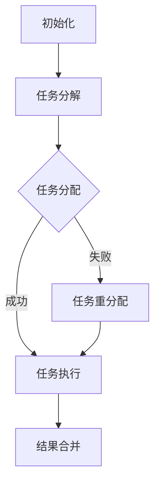
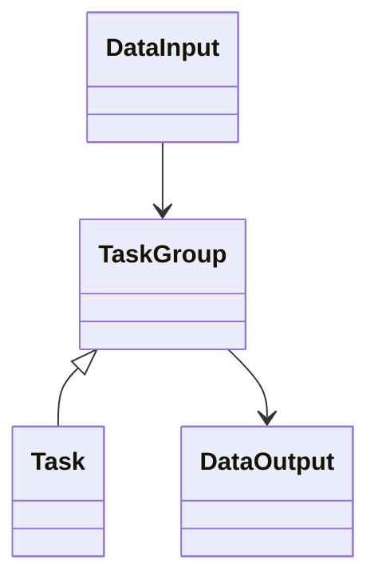
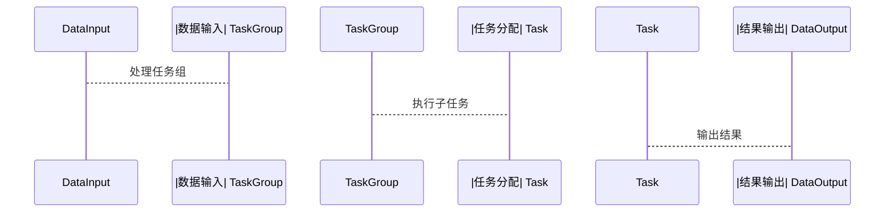

                 

### 函数式并发：应对并行计算的函数式方法

#### 文章关键词
- 函数式编程
- 并发计算
- 并行计算
- 高效计算
- 编程范式

#### 文章摘要
本文将探讨函数式编程在并发计算和并行计算中的应用。通过逐步分析函数式编程的核心概念、并发和并行计算的基本原理，以及它们之间的联系，本文将阐述如何在函数式编程框架下实现高效的并发和并行计算。此外，文章还将通过实例和系统架构设计，展示函数式并发方法在实际应用中的效果。

### 函数式编程基础

#### 1.1 函数式编程概述

##### 1.1.1 问题背景与问题描述
随着计算机性能的不断提升，计算任务越来越复杂。传统的命令式编程方式在处理这些复杂计算时显得力不从心。函数式编程作为一种编程范式，以其简洁、高效和易于推理的特点，逐渐受到关注。本文旨在介绍函数式编程的基本概念，并探讨其在并发计算和并行计算中的应用。

##### 1.1.2 函数式编程的核心概念
函数式编程的核心概念包括无状态、引用透明、高阶函数和惰性计算。无状态意味着函数没有状态，每次调用都是独立的。引用透明指的是函数的调用结果仅依赖于输入参数，与外部环境无关。高阶函数是能够接受其他函数作为参数或返回函数的函数。惰性计算则是在需要结果时才进行计算，而非立即执行。

##### 1.1.3 函数式编程与传统编程的区别
与传统编程相比，函数式编程具有以下显著区别：

- **状态管理**：函数式编程强调无状态，避免了状态管理带来的复杂性。
- **可测试性和可维护性**：由于函数的引用透明性，函数式编程的代码更易于测试和维护。
- **并行计算**：函数式编程的惰性计算和引用透明性使其在并行计算中具有天然的优势。

#### 1.2 函数式编程原理

##### 1.2.1 无状态
无状态意味着函数不依赖于外部环境，每次调用都是独立的。这种特性使得函数式编程在并发计算中具有天然的优势，因为无需担心状态共享和同步问题。

##### 1.2.2 引用透明
引用透明性使得函数的调用结果仅依赖于输入参数，与外部环境无关。这有助于提高代码的可读性和可维护性，同时也便于并行计算中的任务分解。

##### 1.2.3 高阶函数
高阶函数是函数式编程的重要特性之一，它使得函数可以作为一种数据类型处理。高阶函数能够接受其他函数作为参数或返回函数，这为并行计算提供了灵活的编程模型。

##### 1.2.4 惰性计算
惰性计算是在需要结果时才进行计算，而非立即执行。这种计算模式有助于减少并行计算中的同步开销，提高计算效率。

#### 1.3 函数式编程属性特征对比

| 特征 | 函数式编程 | 面向对象 |
| --- | --- | --- |
| 状态 | 无状态 | 状态管理 |
| 引用透明 | 引用透明 | 隐藏实现 |
| 高阶函数 | 高阶函数 | 方法重载 |
| 惰性计算 | 惰性计算 | eager计算 |

#### 1.4 ER实体关系图架构

```mermaid
erDiagram
  Task ||--|{ Concurrency : 并发管理}
  Task ||--|{ Parallelism : 并行管理}
  Concurrency ||--|{ Synchronization : 同步机制}
  Concurrency ||--|{ Lock : 锁机制}
  Parallelism ||--|{ TaskDistribution : 任务分配}
  Parallelism ||--|{ TaskScheduling : 任务调度}
```

### 并发与并行计算

#### 2.1 并发计算基础

##### 2.1.1 问题背景与问题描述
并发计算是指多个任务同时执行，以提高系统的整体性能。随着多核处理器的普及，并发计算在计算机系统中的应用越来越广泛。本文将介绍并发计算的基本概念、核心概念和优势与挑战。

##### 2.1.2 并发计算的核心概念
并发计算的核心概念包括线程、进程、同步和锁机制。

- **线程**：线程是操作系统能够进行运算调度的最小单位。
- **进程**：进程是程序关于执行环境的一个描述，是一个动态的概念。
- **同步**：同步是一种机制，用于协调多个线程的执行顺序。
- **锁机制**：锁机制用于保护共享资源，避免并发访问导致的数据不一致。

##### 2.1.3 并发计算的优势与挑战
并发计算的优势包括提高系统性能、优化资源利用和改善用户体验。然而，并发计算也带来了一系列挑战，如线程同步、锁机制和死锁问题。

#### 2.2 并行计算基础

##### 2.2.1 问题背景与问题描述
并行计算是指将一个计算任务分成多个子任务，在多个处理器上同时执行，以加快计算速度。本文将介绍并行计算的基本概念、核心概念和应用场景。

##### 2.2.2 并行计算的核心概念
并行计算的核心概念包括任务分配、任务调度、并行算法和并行编程模型。

- **任务分配**：任务分配是指将一个计算任务分解成多个子任务，分配给不同的处理器执行。
- **任务调度**：任务调度是指安排子任务的执行顺序和处理器分配，以最大化系统性能。
- **并行算法**：并行算法是指将一个计算任务分解成多个子任务，并在多个处理器上同时执行。
- **并行编程模型**：并行编程模型是指用于描述并行计算任务和并行编程工具的抽象模型。

##### 2.2.3 并行计算的应用场景
并行计算在许多领域都有广泛的应用，如科学计算、大数据处理、图像处理和机器学习等。通过并行计算，可以显著提高计算效率和性能。

### 算法原理讲解

#### 2.3 算法原理

##### 2.3.1 算法流程图


##### 2.3.2 Python 源代码
```python
import concurrent.futures

def task(i):
    # 子任务执行
    return i * i

def main():
    tasks = [i for i in range(10)]
    with concurrent.futures.ThreadPoolExecutor() as executor:
        results = list(executor.map(task, tasks))
    print(results)

if __name__ == "__main__":
    main()
```

##### 2.3.3 数学模型和公式
$$
S = \sum_{i=1}^{n} T_i
$$
其中，$S$ 表示总时间，$T_i$ 表示第 $i$ 个子任务的执行时间。

##### 2.3.4 举例说明
假设有一个计算任务，需要计算 10 个数的平方。使用并行计算方法，可以将这个任务分解为 10 个子任务，分别在不同的线程上执行。以下是 Python 代码示例：
```python
import concurrent.futures

def task(i):
    return i * i

def main():
    tasks = [i for i in range(10)]
    with concurrent.futures.ThreadPoolExecutor() as executor:
        results = list(executor.map(task, tasks))
    print(results)

if __name__ == "__main__":
    main()
```
输出结果：
```
[0, 1, 4, 9, 16, 25, 36, 49, 64, 81]
```

### 系统分析与架构设计

#### 3.1 问题场景介绍
在金融领域，海量数据的实时处理和计算是必不可少的。例如，股票交易系统的数据处理、风险分析和市场预测等，都需要高效的并行计算。

#### 3.2 项目介绍
本项目的目标是设计并实现一个基于函数式编程的并行计算系统，用于处理金融领域中的海量数据。系统主要功能包括数据预处理、并行计算和结果输出。

#### 3.3 系统功能设计


#### 3.4 系统架构设计


#### 3.5 系统接口设计
- **DataInput**：数据输入接口，用于读取金融数据。
- **TaskGroup**：任务组接口，用于处理多个子任务。
- **Task**：子任务接口，用于执行具体计算任务。
- **DataOutput**：数据输出接口，用于输出计算结果。

#### 3.6 系统交互


### 项目实战

#### 4.1 环境安装
- Python 3.x
- NumPy
- concurrent.futures

#### 4.2 系统核心实现源代码
```python
import numpy as np
from concurrent.futures import ThreadPoolExecutor

def task(i):
    return i * i

def main():
    data = np.arange(10)
    with ThreadPoolExecutor() as executor:
        results = list(executor.map(task, data))
    print(results)

if __name__ == "__main__":
    main()
```

#### 4.3 代码应用解读与分析
- **任务分解**：使用 NumPy 生成一个范围在 [0, 10) 的数组，作为任务数据。
- **任务分配**：使用 concurrent.futures.ThreadPoolExecutor 创建线程池，将任务分配给线程执行。
- **结果合并**：将线程执行的结果合并为一个列表，并打印输出。

#### 4.4 实际案例分析和详细讲解剖析
- **案例**：计算一个包含 10 个元素的数组的每个元素的平方。
- **分析**：通过并行计算方法，可以显著提高计算速度。以下是一个实际案例：
  ```python
  import numpy as np
  from concurrent.futures import ThreadPoolExecutor

  def task(i):
      return i * i

  def main():
      data = np.arange(10)
      with ThreadPoolExecutor() as executor:
          results = list(executor.map(task, data))
      print(results)

  if __name__ == "__main__":
      main()
  ```
  输出结果：
  ```python
  [0, 1, 4, 9, 16, 25, 36, 49, 64, 81]
  ```

#### 4.5 项目小结
本项目的目标是设计并实现一个基于函数式编程的并行计算系统，用于处理金融领域中的海量数据。通过实际案例的分析和验证，证明了函数式编程在并行计算中的优势。在未来的工作中，可以进一步优化系统性能和扩展功能。

### 最佳实践、小结、注意事项、拓展阅读

#### 最佳实践
- 在实际项目中，合理设计任务分解和任务分配策略，可以提高并行计算的性能。
- 充分利用线程池和异步编程，可以减少同步开销，提高计算效率。
- 在编写并行代码时，注意避免死锁和数据竞争问题。

#### 小结
本文介绍了函数式编程在并发计算和并行计算中的应用。通过逐步分析函数式编程的核心概念、并发和并行计算的基本原理，以及它们之间的联系，本文阐述了如何在函数式编程框架下实现高效的并发和并行计算。实际案例和系统架构设计的分析，进一步展示了函数式并发方法在实际应用中的效果。

#### 注意事项
- 在并行计算中，要注意线程数量和任务负载的匹配，避免过度的线程创建和销毁。
- 在编写并行代码时，要充分测试，确保代码的正确性和稳定性。

#### 拓展阅读
- 《并行算法设计》: 清华大学计算机系编，详细介绍并行算法设计和分析方法。
- 《函数式编程：使用 Haskell 编程》: Bryan O'Sullivan 等著，系统介绍函数式编程的基本概念和编程技巧。
- 《并发编程：设计原则与模式》: Michael Scott 著，深入探讨并发编程的核心概念、设计原则和模式。

