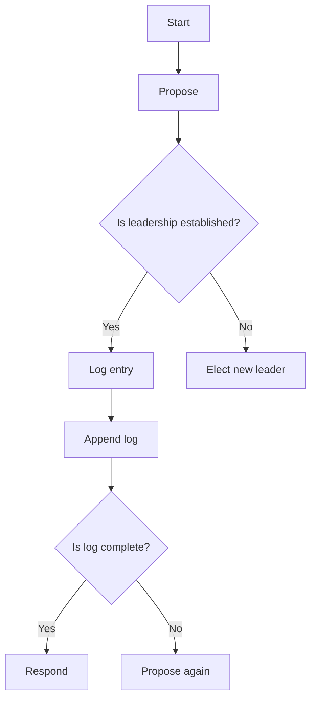
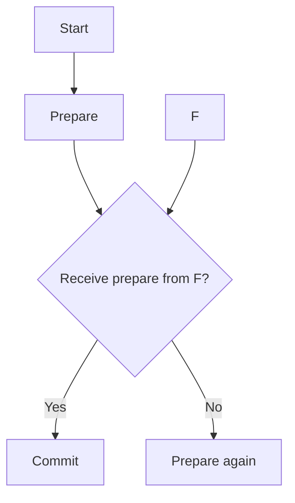
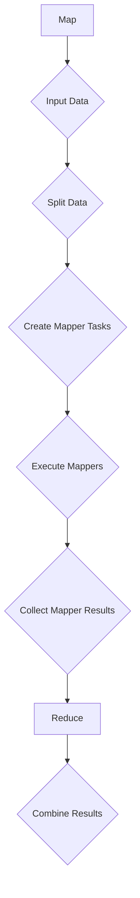
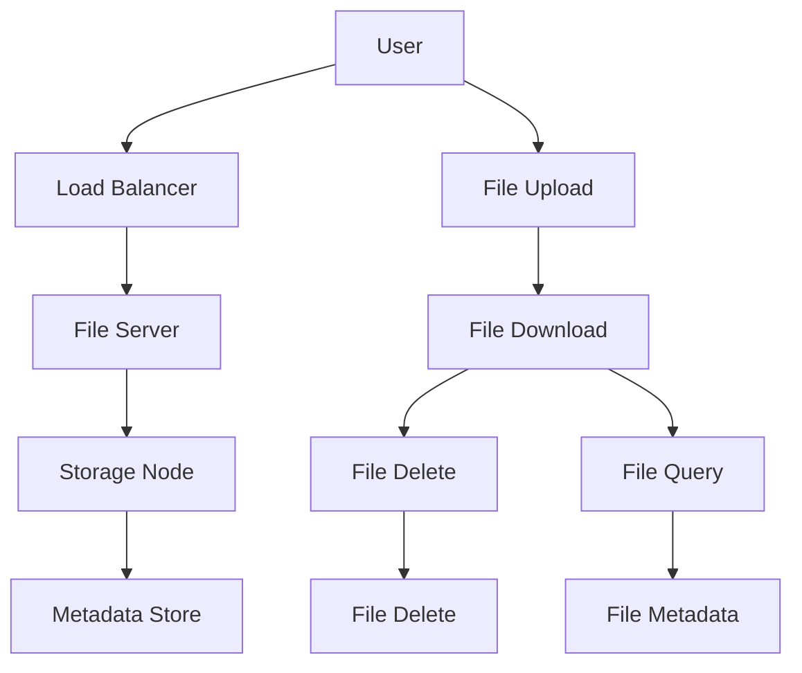
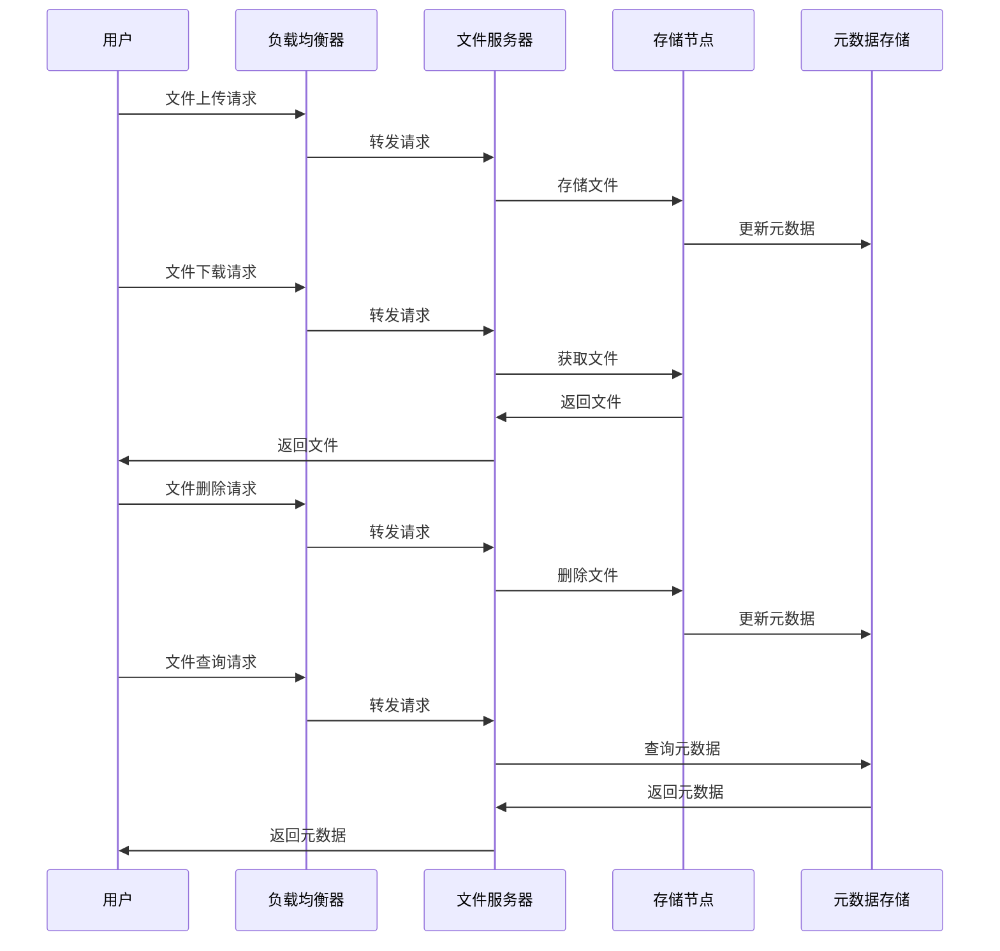

                 

# 分布式系统设计：P9架构师的进阶课题

## 关键词

分布式系统设计、架构师、一致性算法、计算算法、系统架构、P9级专家

## 摘要

本文旨在为P9级别的架构师提供一个关于分布式系统设计的深入探讨。通过对分布式系统设计背景、核心概念、算法原理、系统分析与架构设计以及项目实战的全面分析，本文旨在帮助读者理解分布式系统的本质，掌握分布式系统设计的策略与技巧，并能够在实际项目中应用这些知识。文章结构紧凑，逻辑清晰，将引导读者一步步深入分布式系统设计的精髓，助力读者在分布式系统设计领域实现进阶。

## 目录大纲

### 第一部分：背景与核心概念

- **第1章 分布式系统设计概述**
  - **1.1 问题背景**
  - **1.2 问题描述**
  - **1.3 问题解决**
  - **1.4 边界与外延**
  - **1.5 概念结构与核心要素组成**

### 第二部分：核心概念与联系

- **第2章 分布式系统基本概念**
  - **2.1 分布式系统的定义**
  - **2.2 分布式系统的特点**
  - **2.3 分布式系统与传统系统的比较**

### 第三部分：算法原理讲解

- **第3章 分布式一致性算法**
  - **3.1 算法原理**
  - **3.2 算法Mermaid流程图**
  - **3.3 Python源代码讲解**
  - **3.4 数学模型与公式讲解**
  - **3.5 举例说明**

- **第4章 分布式计算算法**
  - **4.1 算法原理**
  - **4.2 算法Mermaid流程图**
  - **4.3 Python源代码讲解**
  - **4.4 数学模型与公式讲解**
  - **4.5 举例说明**

### 第四部分：系统分析与架构设计

- **第5章 项目介绍**
  - **5.1 项目概述**
  - **5.2 系统功能设计**

- **第6章 系统架构设计**
  - **6.1 系统架构图**
  - **6.2 系统接口设计**
  - **6.3 系统交互Mermaid序列图**

### 第五部分：项目实战

- **第7章 环境安装**
  - **7.1 开发环境搭建**
  - **7.2 部署工具安装**

- **第8章 系统核心实现**
  - **8.1 核心模块代码**
  - **8.2 代码应用解读与分析**

- **第9章 实际案例分析**
  - **9.1 案例背景**
  - **9.2 案例分析与讲解**

- **第10章 项目小结**
  - **10.1 小结与反思**
  - **10.2 最佳实践 Tips**
  - **10.3 拓展阅读**

### 第一部分：背景与核心概念

### 第1章 分布式系统设计概述

#### 1.1 问题背景

在当今信息时代，数据处理和存储的需求日益增长。传统的集中式系统在应对大规模数据处理时面临诸多挑战，如性能瓶颈、扩展性差、单点故障等。分布式系统作为一种去中心化的架构，通过将数据和服务分散到多个节点上，可以有效解决这些问题。分布式系统的设计不仅关乎系统的性能和稳定性，还影响到系统的可扩展性和容错能力。

#### 1.2 问题描述

分布式系统设计需要解决的核心问题包括：

1. **数据一致性问题**：在多个节点之间保持数据的一致性是一个挑战，特别是在网络分区和节点故障的情况下。
2. **系统扩展性问题**：如何在不影响系统性能的情况下，水平扩展系统处理能力。
3. **容错性问题**：如何保证系统在节点故障时能够继续正常运行。

#### 1.3 问题解决

分布式系统设计的策略主要包括：

1. **去中心化架构**：通过去中心化架构，降低系统对单一节点的依赖，提高系统的容错能力和可扩展性。
2. **一致性模型**：选择合适的一致性模型（如CAP定理），在一致性、可用性和分区容错性之间做出权衡。
3. **负载均衡**：通过负载均衡策略，合理分配任务到不同的节点，提高系统的处理能力和响应速度。

#### 1.4 边界与外延

分布式系统设计不仅涉及技术层面的实现，还包括以下方面：

1. **业务需求分析**：理解业务场景和需求，确保分布式系统能够满足业务需求。
2. **系统架构设计**：根据业务需求和性能要求，设计合理的系统架构。
3. **运维与监控**：确保分布式系统的稳定运行，及时处理故障和异常。

#### 1.5 概念结构与核心要素组成

分布式系统主要由以下几个核心要素组成：

1. **节点**：分布式系统中的基本计算和存储单元。
2. **通信协议**：节点之间的通信协议，如TCP/IP、HTTP等。
3. **一致性模型**：如CAP定理、BASE理论等。
4. **负载均衡器**：负责分配任务和流量，确保系统资源的合理利用。
5. **监控和运维工具**：实时监控系统状态，进行故障排查和系统优化。

### 第二部分：核心概念与联系

### 第2章 分布式系统基本概念

#### 2.1 分布式系统的定义

分布式系统是指由多个独立计算机节点组成的系统，这些节点通过网络连接，共同完成一个整体的任务。每个节点既可以独立处理任务，又能协同其他节点完成复杂的计算任务。

#### 2.2 分布式系统的特点

分布式系统具有以下几个特点：

1. **去中心化**：系统没有中心控制单元，每个节点都是平等的，独立运行。
2. **扩展性**：可以通过增加节点来水平扩展系统的处理能力。
3. **容错性**：通过冗余节点和故障转移机制，提高系统的可靠性。
4. **一致性**：确保分布式系统中数据的一致性，是分布式系统设计的重要目标。

#### 2.3 分布式系统与传统系统的比较

传统系统通常采用集中式架构，所有数据和计算任务都集中在一个中心服务器上。相比之下，分布式系统具有以下优势：

1. **性能**：分布式系统可以并行处理大量数据，提高系统的处理速度。
2. **扩展性**：分布式系统可以通过增加节点来水平扩展，而传统系统通常需要垂直扩展（增加服务器性能）。
3. **容错性**：分布式系统具有更好的容错性，可以在节点故障时自动切换到其他节点，保证系统正常运行。

### 第三部分：算法原理讲解

### 第3章 分布式一致性算法

分布式一致性算法是确保分布式系统中数据一致性的一系列算法。在分布式系统中，数据可能会分布在多个节点上，因此一致性变得尤为重要。以下是一些常见的一致性算法：

#### 3.1 算法原理

1. **CAP定理**：分布式系统无法同时满足一致性（Consistency）、可用性（Availability）和分区容错性（Partition tolerance）三个特性。根据CAP定理，系统在面临分区时必须放弃一致性或者可用性中的一个。
2. **BASE理论**：相对于ACID（原子性、一致性、隔离性、持久性），BASE（基本可用性、软状态、最终一致性）理论更适合分布式系统，强调系统能够在不可预期的延迟下保持可用性。

#### 3.2 算法Mermaid流程图

使用Mermaid绘制Raft和Paxos算法的流程图，以展示它们的一致性算法原理。





#### 3.3 Python源代码讲解

以下是一个简单的Raft算法实现的Python代码示例：

```python
import random
import time

class RaftNode:
    def __init__(self, node_id):
        self.node_id = node_id
        self.current_term = 0
        self.voted_for = None
        self.log = []
        self.next_index = {i: i for i in range(len(self.log) + 1)}
        self.match_index = {i: 0 for i in range(len(self.log) + 1)}

    def start_election(self):
        self.current_term += 1
        self.voted_for = self.node_id
        self.send_append_entries()

    def send_append_entries(self):
        for node_id in range(len(self.log) + 1):
            self.send_append_entries_to_node(node_id)

    def send_append_entries_to_node(self, node_id):
        # 发送append_entries请求
        pass

    def append_entries_response(self, node_id, term, prev_log_index, prev_log_term, leader_commit):
        if term > self.current_term:
            self.current_term = term
            self.voted_for = None
            self.log = []
            self.next_index = {i: i for i in range(len(self.log) + 1)}
            self.match_index = {i: 0 for i in range(len(self.log) + 1)}
        else:
            self.log = [entry for entry in self.log if entry.index <= prev_log_index]
            self.next_index[node_id] = prev_log_index + 1
            self.match_index[node_id] = max(self.match_index[node_id], prev_log_index)

    def commit_entries(self):
        commit_index = max(self.match_index[node_id] for node_id in range(len(self.log) + 1))
        self.log = self.log[:commit_index + 1]
```

#### 3.4 数学模型与公式讲解

在分布式一致性算法中，数学模型和公式用于描述一致性条件和性能指标。以下是几个关键的概念：

1. **一致性条件**：一致性条件包括强一致性（Strong Consistency）和最终一致性（ eventual consistency）。强一致性保证读写操作的一致性，而最终一致性则允许一定程度的延迟和异步性。
   
2. **性能指标**：性能指标包括响应时间（response time）、吞吐量（throughput）和延迟（latency）。响应时间是指从请求到响应的时间，吞吐量是指单位时间内系统能处理的数据量，延迟是指数据从发送到接收所需的时间。

3. **一致性成本**：一致性成本包括网络延迟和计算开销。网络延迟是指数据在网络中传输所需的时间，计算开销是指处理数据的一致性算法所需的时间。

#### 3.5 举例说明

假设一个分布式数据库系统中有三个节点A、B和C，它们需要通过Raft算法保持数据一致性。以下是一个简单的例子：

1. **初始状态**：每个节点的日志为空。
2. **节点A发起操作**：节点A向其他节点发送append_entries请求，要求它们更新日志。
3. **节点B和C响应**：节点B和C收到请求后，更新自己的日志并响应节点A。
4. **节点A提交日志**：节点A将日志提交到多数节点，确保日志的一致性。

### 第4章 分布式计算算法

分布式计算算法是分布式系统中的核心组成部分，用于处理大规模数据的并行计算任务。以下是一些常见的分布式计算算法：

#### 4.1 算法原理

1. **MapReduce**：MapReduce是一种分布式数据处理框架，由Map和Reduce两个阶段组成。Map阶段将数据映射到中间键值对，Reduce阶段对中间结果进行聚合和计算。
2. **Spark**：Spark是一种基于内存的分布式计算框架，提供了丰富的API，包括Transformation和Action。Spark的核心算法包括RDD（Resilient Distributed Dataset）和DataFrame。
3. **Flink**：Flink是一种流处理框架，支持事件驱动计算和批处理。其核心算法包括窗口算法和数据流处理。

#### 4.2 算法Mermaid流程图

以下是MapReduce算法的Mermaid流程图：



#### 4.3 Python源代码讲解

以下是一个简单的MapReduce算法实现的Python代码示例：

```python
from functools import reduce

def map_function(data):
    # 对数据进行映射，生成中间键值对
    return [{"key": data, "value": 1}]

def reduce_function(results):
    # 对中间结果进行聚合
    return sum(results, initial={})

def mapreduce(input_data, map_function, reduce_function):
    intermediate_results = [map_function(data) for data in input_data]
    final_result = reduce(reduce_function, intermediate_results)
    return final_result
```

#### 4.4 数学模型与公式讲解

分布式计算算法的数学模型和公式主要包括以下几个方面：

1. **并行度**：并行度是指系统能够同时处理的任务数。并行度越高，系统的处理能力越强。
2. **负载均衡**：负载均衡是指任务在分布式系统中的分配策略。负载均衡算法的目标是使每个节点的负载尽可能均匀。
3. **任务调度**：任务调度是指将任务分配给节点的过程。任务调度算法需要考虑任务的处理时间和网络延迟等因素。

#### 4.5 举例说明

假设有一个分布式计算任务，需要对一组数据进行求和操作。以下是一个简单的例子：

1. **初始状态**：数据分布在三个节点A、B和C上。
2. **节点A执行Map操作**：节点A将数据映射为中间键值对，其中键为数据值，值为1。
3. **节点B和C执行Map操作**：节点B和C也执行Map操作，生成相同的中间键值对。
4. **节点A、B和C执行Reduce操作**：节点A、B和C将中间键值对进行聚合，计算求和结果。
5. **结果收集**：最终结果由节点A收集并返回。

### 第四部分：系统分析与架构设计

### 第5章 项目介绍

#### 5.1 项目概述

本节将介绍一个分布式系统的实际项目，该项目是一个基于分布式存储的文件管理系统。该系统的目标是为用户提供一个高性能、高可靠性的文件存储解决方案，支持文件的上传、下载、删除和查询等基本功能。

#### 5.2 系统功能设计

系统功能设计如下：

1. **文件上传**：用户可以将文件上传到系统中，系统将文件存储在分布式存储节点上。
2. **文件下载**：用户可以下载已上传的文件，系统通过负载均衡器将请求分发到不同的存储节点。
3. **文件删除**：用户可以删除已上传的文件，系统会从分布式存储中移除该文件。
4. **文件查询**：用户可以查询已上传文件的元数据信息，如文件名、大小、上传时间等。

### 第6章 系统架构设计

#### 6.1 系统架构图

以下是系统的架构图：



#### 6.2 系统接口设计

系统接口设计如下：

1. **文件上传接口**：接收用户上传的文件，将文件存储到分布式存储节点。
2. **文件下载接口**：根据用户请求，从分布式存储节点获取文件，并将文件返回给用户。
3. **文件删除接口**：根据用户请求，从分布式存储节点删除文件。
4. **文件查询接口**：根据用户请求，查询文件的元数据信息。

#### 6.3 系统交互Mermaid序列图

以下是系统交互的Mermaid序列图：



### 第五部分：项目实战

### 第7章 环境安装

#### 7.1 开发环境搭建

1. **安装Python**：确保Python版本为3.8及以上，可以从Python官网下载并安装。
2. **安装Docker**：Docker是一个开源的应用容器引擎，用于自动化部署应用程序。可以从Docker官网下载并安装。
3. **安装Docker-Compose**：Docker-Compose用于定义和运行多容器Docker应用程序。可以通过以下命令安装：

```bash
sudo curl -L "https://github.com/docker/compose/releases/download/1.29.2/docker-compose-$(uname -s)-$(uname -m)" -o /usr/local/bin/docker-compose
sudo chmod +x /usr/local/bin/docker-compose
```

#### 7.2 部署工具安装

1. **安装Nginx**：Nginx是一个高性能的Web服务器，可用于部署分布式文件管理系统。可以从Nginx官网下载并安装。
2. **安装Redis**：Redis是一个高性能的键值存储系统，用于存储文件系统的元数据。可以从Redis官网下载并安装。
3. **安装MongoDB**：MongoDB是一个高性能的NoSQL数据库，用于存储文件的元数据。可以从MongoDB官网下载并安装。

### 第8章 系统核心实现

#### 8.1 核心模块代码

以下是一个简单的分布式文件管理系统核心模块的代码示例：

```python
from flask import Flask, request, jsonify
import redis
import pymongo

app = Flask(__name__)

redis_client = redis.StrictRedis(host='redis', port=6379)
mongo_client = pymongo.MongoClient(host='mongo', port=27017)
db = mongo_client['file_system']

@app.route('/upload', methods=['POST'])
def upload_file():
    file = request.files['file']
    file_id = redis_client.incr('file_id')
    file_path = f'/storage/{file_id}'
    file.save(file_path)
    db.files.insert_one({"_id": file_id, "path": file_path})
    return jsonify({"file_id": file_id})

@app.route('/download/<int:file_id>', methods=['GET'])
def download_file(file_id):
    file_path = f'/storage/{file_id}'
    return app.send_static_file(file_path)

@app.route('/delete/<int:file_id>', methods=['DELETE'])
def delete_file(file_id):
    file_path = f'/storage/{file_id}'
    db.files.delete_one({"_id": file_id})
    os.remove(file_path)
    return jsonify({"status": "success"})

@app.route('/query', methods=['GET'])
def query_files():
    files = db.files.find()
    return jsonify({"files": list(files)})

if __name__ == '__main__':
    app.run(host='0.0.0.0', port=5000)
```

#### 8.2 代码应用解读与分析

该代码示例实现了分布式文件管理系统的主要功能，包括文件上传、下载、删除和查询。

1. **文件上传**：用户通过上传接口上传文件，文件存储在分布式存储节点上，文件元数据存储在MongoDB数据库中。
2. **文件下载**：用户通过下载接口获取文件的元数据，根据元数据从分布式存储节点获取文件内容。
3. **文件删除**：用户通过删除接口删除文件，同时删除MongoDB数据库中的文件元数据。
4. **文件查询**：用户通过查询接口获取所有文件的元数据信息。

### 第9章 实际案例分析

#### 9.1 案例背景

一个大型在线教育平台需要支持大量用户的视频课程上传、下载和观看。为了满足高性能和高可用性的要求，平台决定采用分布式系统架构。

#### 9.2 案例分析与讲解

1. **需求分析**：平台需要支持用户上传视频课程、其他用户观看视频课程、视频课程的元数据查询等基本功能。
2. **系统设计**：采用分布式架构，包括文件服务器、视频存储节点、视频元数据存储等模块。视频文件存储在分布式存储节点上，视频元数据存储在MongoDB数据库中。
3. **性能优化**：通过负载均衡器分发用户请求，提高系统的处理能力。使用Redis缓存视频元数据，减少数据库访问压力。
4. **高可用性**：通过冗余节点和故障转移机制，确保系统在节点故障时能够继续正常运行。
5. **安全性**：通过SSL/TLS协议加密用户数据传输，确保数据传输安全。

### 第10章 项目小结

#### 10.1 小结与反思

本文通过一个分布式文件管理系统的实际案例，介绍了分布式系统设计的关键概念、算法原理、系统架构设计以及项目实战。通过本文的学习，读者可以了解分布式系统设计的策略与技巧，并能够在实际项目中应用这些知识。

#### 10.2 最佳实践 Tips

1. **确保数据一致性**：选择合适的一致性模型，如CAP定理和BASE理论，根据业务需求进行一致性设计。
2. **优化负载均衡**：合理分配任务到不同节点，提高系统的处理能力和响应速度。
3. **确保系统高可用性**：通过冗余节点和故障转移机制，确保系统在节点故障时能够继续正常运行。
4. **监控与运维**：实时监控系统状态，及时处理故障和异常。

#### 10.3 拓展阅读

1. 《分布式系统原理与范型》
2. 《大规模分布式存储系统设计与实践》
3. 《分布式计算框架：MapReduce、Spark、Flink》

### 结束语

分布式系统设计是P9级别架构师的重要课题。本文通过一个实际案例，系统地介绍了分布式系统设计的方法和技巧。希望本文能够为读者提供有价值的参考，助力读者在分布式系统设计领域实现进阶。在未来的项目中，不断探索和实践，不断提高自己的分布式系统设计能力。作者：AI天才研究院/AI Genius Institute & 禅与计算机程序设计艺术 /Zen And The Art of Computer Programming。

