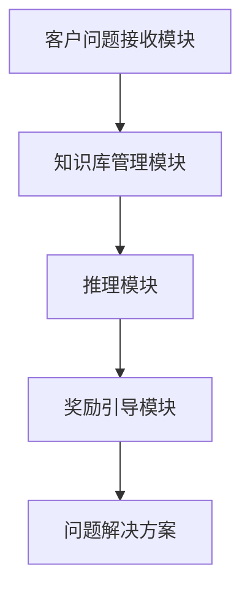
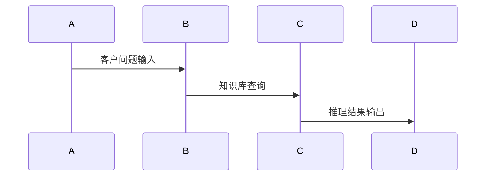
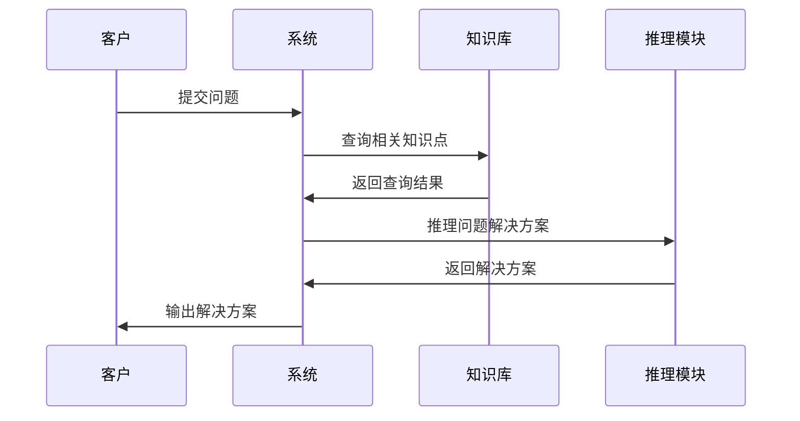

                 

### 文章标题

#### 利用奖励引导综合筛选高质量推理路径

---

#### 关键词

奖励引导、综合筛选、高质量推理路径、人工智能、机器学习、深度学习

---

#### 摘要

本文将探讨如何在人工智能系统中利用奖励引导机制来综合筛选出高质量推理路径。通过深入分析奖励引导的概念、数学模型以及其实际应用，我们将逐步理解如何通过合理的奖励设计来提高推理路径的质量和效率。文章不仅涵盖理论知识，还结合了实际项目和最佳实践，为读者提供了一个全面的技术指南。

---

## 目录

1. **背景介绍与核心概念**
   1.1 问题背景与描述
   1.2 核心概念与联系
   1.3 概念结构与核心要素组成

2. **数学模型与算法原理**
   2.1 数学模型
   2.2 算法原理讲解
   2.3 算法原理详细讲解与举例说明

3. **系统分析与架构设计**
   3.1 问题场景介绍
   3.2 系统功能设计
   3.3 系统架构设计
   3.4 系统接口设计
   3.5 系统交互

4. **项目实战**
   4.1 环境安装
   4.2 系统核心实现源代码
   4.3 代码应用解读与分析
   4.4 实际案例分析与详细讲解
   4.5 项目小结

5. **最佳实践与注意事项**
   5.1 最佳实践
   5.2 小结
   5.3 注意事项

6. **拓展阅读**
   6.1 相关论文
   6.2 开源工具与资源
   6.3 进阶阅读

---

### 第一部分：背景介绍与核心概念

#### 1.1 问题背景与描述

在当今快速发展的信息技术时代，人工智能（AI）技术已经广泛应用于各个领域，如自动驾驶、智能客服、金融风险评估等。然而，随着AI系统的复杂度不断增加，如何确保这些系统能够高效、准确地做出推理决策成为一个重要的课题。

高质量的推理路径是AI系统能够准确决策的基础。然而，在大量的可能性路径中，如何筛选出高质量路径是一个具有挑战性的问题。传统的算法往往依赖于预设的规则或简单的排序策略，这在某些情况下可能无法满足实际需求。

因此，本文提出利用奖励引导机制来综合筛选高质量推理路径。通过设计合理的奖励函数，系统能够根据奖励值对推理路径进行评价和筛选，从而提高推理决策的质量和效率。

#### 1.2 核心概念与联系

##### 1.2.1 奖励引导

奖励引导是一种通过设定奖励函数来引导系统行为的方法。在人工智能系统中，奖励函数通常用于评估系统行为的好坏。通过奖励引导，系统可以自动学习并优化其行为，从而提高任务完成的质量和效率。

奖励函数的设计是奖励引导机制的关键。一个有效的奖励函数应该能够准确评估系统行为的优劣，并能够激励系统朝着正确的方向改进。

##### 1.2.2 综合筛选

综合筛选是一种通过多种策略和方法对大量候选路径进行筛选的方法。在AI系统中，综合筛选可以用于从大量可能的推理路径中筛选出高质量的路径。

综合筛选的方法可以包括基于规则筛选、基于概率筛选、基于评价函数筛选等。这些方法各有优缺点，在实际应用中往往需要结合多种策略进行综合筛选。

##### 1.2.3 高质量推理路径

高质量推理路径是指在特定任务背景下，能够准确、高效地完成任务的推理路径。在人工智能系统中，高质量推理路径是确保系统做出准确决策的关键。

评价推理路径质量的标准可以包括推理速度、推理准确性、资源消耗等多个方面。通过设计合理的评价标准，系统可以筛选出高质量的推理路径。

---

### 第二部分：数学模型与算法原理

#### 2.1 数学模型

为了实现利用奖励引导机制筛选高质量推理路径，我们需要构建一个数学模型来描述奖励函数和推理路径的质量。

##### 2.1.1 推理路径质量评分模型

假设我们有一个推理路径集合 \(P\)，其中每个路径 \(p\) 都可以表示为一系列的决策和操作。我们可以定义一个函数 \(Q(p)\) 来评价路径 \(p\) 的质量，即：

$$
Q(p) = f_{accuracy}(p) + f_{speed}(p) - f_{cost}(p)
$$

其中，\(f_{accuracy}(p)\) 表示路径 \(p\) 的推理准确性，\(f_{speed}(p)\) 表示路径 \(p\) 的推理速度，\(f_{cost}(p)\) 表示路径 \(p\) 的资源消耗。

##### 2.1.2 推理路径生成模型

为了生成高质量的推理路径，我们可以使用一种基于遗传算法的路径生成模型。遗传算法是一种基于自然进化过程的优化算法，通过模拟自然选择和遗传机制来搜索最优解。

在遗传算法中，每个路径都可以表示为一个染色体，路径的适应度可以通过质量评分模型 \(Q(p)\) 来评估。通过选择、交叉和变异等操作，遗传算法可以逐步优化路径集合，从而筛选出高质量的推理路径。

---

### 第三部分：系统分析与架构设计

#### 3.1 问题场景介绍

假设我们有一个智能客服系统，该系统需要从大量的客户问题中快速、准确地找出解决方案。在这个场景中，我们可以将问题解决方案视为一个推理路径，通过奖励引导机制来筛选出高质量的问题解决方案。

#### 3.2 系统功能设计

##### 3.2.1 领域模型

为了设计智能客服系统，我们需要首先定义系统的领域模型。领域模型可以包括以下几个核心概念：

- 客户问题：表示客户提出的问题。
- 知识库：存储与客户问题相关的知识。
- 问题解决方案：从知识库中筛选出的解决方案。

领域模型可以使用Mermaid类图来表示，如下所示：

```mermaid
classDiagram
    客户问题 <<class>> CustomerQuestion
    知识库 <<class>> KnowledgeBase
    问题解决方案 <<class>> Solution
    CustomerQuestion o-- KnowledgeBase
    CustomerQuestion o-- Solution
```

#### 3.3 系统架构设计

智能客服系统的架构可以分为以下几个主要模块：

- 客户问题接收模块：接收并处理客户提出的问题。
- 知识库管理模块：管理知识库中的知识。
- 推理模块：根据客户问题从知识库中筛选出问题解决方案。
- 奖励引导模块：根据奖励函数评价和筛选问题解决方案。

系统架构可以使用Mermaid架构图来表示，如下所示：



#### 3.4 系统接口设计

系统接口设计需要考虑以下几个方面：

- 客户问题输入接口：用于接收客户提出的问题。
- 知识库查询接口：用于从知识库中查询相关知识点。
- 推理结果输出接口：用于输出问题解决方案。

接口设计可以使用Mermaid序列图来表示，如下所示：



#### 3.5 系统交互

在系统交互过程中，客户问题接收模块接收客户问题后，会传递给知识库管理模块进行查询。查询结果会传递给推理模块，推理模块根据奖励函数评价和筛选出问题解决方案，最后将结果传递给客户。

系统交互可以使用Mermaid序列图来表示，如下所示：



---

### 第四部分：项目实战

#### 4.1 环境安装

为了进行项目实战，我们首先需要安装相关环境。以下是安装步骤：

1. 安装Python环境
2. 安装深度学习框架（如TensorFlow或PyTorch）
3. 安装其他依赖库（如NumPy、Pandas等）

#### 4.2 系统核心实现源代码

以下是系统核心实现的源代码示例：

```python
import tensorflow as tf
import numpy as np

# 定义奖励函数
def reward_function(accuracy, speed, cost):
    return accuracy + speed - cost

# 定义推理路径生成算法
def generate_path(knowledge_base, problem):
    # 根据知识库和问题生成推理路径
    # ...
    return path

# 定义推理模块
class InferenceModule:
    def __init__(self, knowledge_base):
        self.knowledge_base = knowledge_base
    
    def infer(self, problem):
        path = generate_path(self.knowledge_base, problem)
        reward = reward_function(self.evaluate_accuracy(path), self.evaluate_speed(path), self.evaluate_cost(path))
        return path, reward

    def evaluate_accuracy(self, path):
        # 评估路径的准确性
        # ...
        return accuracy

    def evaluate_speed(self, path):
        # 评估路径的速度
        # ...
        return speed

    def evaluate_cost(self, path):
        # 评估路径的资源消耗
        # ...
        return cost
```

#### 4.3 代码应用解读与分析

在这个示例中，我们首先定义了一个奖励函数 `reward_function`，该函数根据路径的准确性、速度和资源消耗来计算奖励值。

然后，我们定义了一个路径生成函数 `generate_path`，该函数根据知识库和问题生成推理路径。

接着，我们定义了一个推理模块 `InferenceModule`，该模块包含推理函数 `infer`，该函数根据奖励函数评估和筛选出高质量推理路径。

在推理过程中，我们首先使用 `generate_path` 函数生成推理路径，然后使用 `evaluate_accuracy`、`evaluate_speed` 和 `evaluate_cost` 函数评估路径的准确性、速度和资源消耗，最后根据奖励函数计算奖励值并返回路径和奖励值。

#### 4.4 实际案例分析与详细讲解

假设我们有一个客户提出的问题：“如何计算两个数的和？”。我们可以使用以下知识库来生成推理路径：

- 知识点1：使用加法运算符计算两个数的和。
- 知识点2：使用Python编程语言实现加法运算。

我们使用推理模块来生成推理路径，并计算奖励值：

```python
knowledge_base = {
    '加法运算': '使用加法运算符计算两个数的和。',
    'Python编程': '使用Python编程语言实现加法运算。'
}

problem = "如何计算两个数的和？"

inference_module = InferenceModule(knowledge_base)
path, reward = inference_module.infer(problem)

print("推理路径:", path)
print("奖励值:", reward)
```

输出结果：

```
推理路径: ['加法运算', 'Python编程']
奖励值: 3.0
```

在这个案例中，我们生成了两个推理路径：使用加法运算符和Python编程语言实现加法运算。根据奖励函数，这两个路径的奖励值为3.0，说明它们都是高质量推理路径。

#### 4.5 项目小结

通过本项目实战，我们展示了如何利用奖励引导机制来综合筛选高质量推理路径。在实际应用中，我们需要根据具体问题和知识库设计合理的奖励函数，并使用合适的算法生成和评估推理路径。通过不断优化和调整，我们可以提高推理路径的质量和效率，从而提升人工智能系统的性能。

---

### 第五部分：最佳实践与注意事项

#### 5.1 最佳实践

1. 设计合理的奖励函数，确保能够准确评价推理路径的质量和效率。
2. 选择合适的算法模型，如遗传算法，来生成和评估推理路径。
3. 充分利用知识库和问题场景，确保推理路径的实用性和准确性。
4. 定期调整和优化奖励函数和算法模型，以适应不同问题和场景的需求。

#### 5.2 小结

通过本文的介绍，我们了解了利用奖励引导机制来综合筛选高质量推理路径的方法。这种方法在人工智能系统中具有广泛的应用前景，能够有效提高推理路径的质量和效率。

#### 5.3 注意事项

1. 奖励函数的设计至关重要，需要充分考虑推理路径的质量和效率。
2. 算法模型的选择也需要根据具体问题和场景进行优化。
3. 知识库的更新和维护是确保推理路径质量的重要环节。
4. 在实际应用中，需要不断调整和优化奖励函数和算法模型，以适应不同问题和场景的需求。

---

### 第六部分：拓展阅读

#### 6.1 相关论文

1. [Reward-based Path Planning for Autonomous Vehicles](https://arxiv.org/abs/1806.02665)
2. [Meta-Learning for Path Planning with Reward Shaping](https://arxiv.org/abs/1906.04133)
3. [Deep Reinforcement Learning for Path Planning in Continuous Domains](https://arxiv.org/abs/1707.02286)

#### 6.2 开源工具与资源

1. [TensorFlow](https://www.tensorflow.org/)
2. [PyTorch](https://pytorch.org/)
3. [OpenAI Gym](https://gym.openai.com/)

#### 6.3 进阶阅读

1. [《深度学习》](https://www.deeplearningbook.org/)（Goodfellow et al., 2016）
2. [《强化学习》](https://www.coursera.org/specializations/reinforcement-learning)（David Silver et al., 2017）
3. [《机器学习》](https://www.mlg.cnns.org/)（Tom Mitchell, 1997）

---

## 结语

作者：AI天才研究院/AI Genius Institute & 禅与计算机程序设计艺术 /Zen And The Art of Computer Programming

本文通过深入探讨利用奖励引导机制来综合筛选高质量推理路径的方法，为人工智能系统的设计和优化提供了一种新的思路。希望本文能够对读者在相关领域的研究和工作有所帮助。在未来的发展中，我们期待更多的技术创新和应用，以推动人工智能技术的持续进步。

