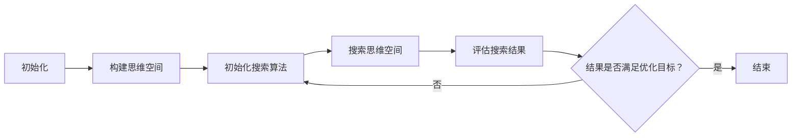
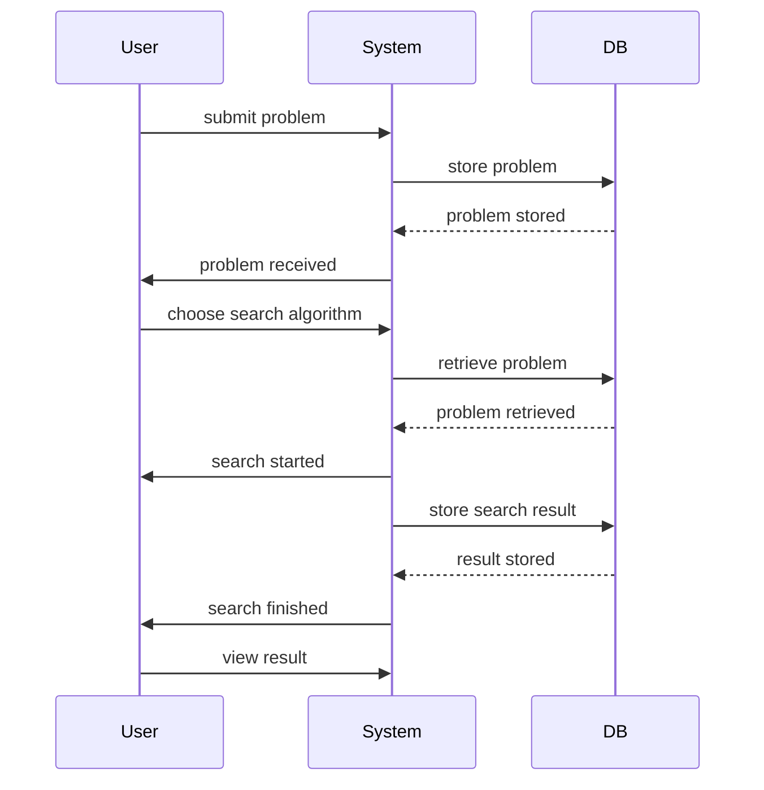

                 

# 利用思维空间搜索解决复杂问题的方法

关键词：思维空间搜索、复杂问题、算法、优化、问题解决

摘要：本文旨在探讨如何利用思维空间搜索解决复杂问题。通过对思维空间搜索的基本原理、算法和应用案例的深入剖析，帮助读者理解并掌握这一方法。

---

### 第一部分：背景介绍

#### 1. 问题背景

在现代社会，面对日益复杂的问题，传统的解决方法往往难以奏效。复杂问题的解决不仅需要深入的思考和丰富的知识，还要求能够灵活地运用各种思维方式。思维空间搜索作为一种创新的解决问题方法，正日益受到关注。

#### 2. 问题描述

思维空间搜索是指利用空间几何结构模拟人类思维过程，通过搜索思维空间中的各种可能性，找到解决问题的最优方案。这种方法不仅适用于传统的问题解决，还能在复杂系统的优化、人工智能等领域发挥重要作用。

#### 3. 问题解决

本书将详细探讨如何利用思维空间搜索解决复杂问题。通过对思维空间搜索的基本原理、算法和应用案例的深入剖析，帮助读者理解并掌握这一方法。

#### 4. 边界与外延

思维空间搜索不仅涉及数学、计算机科学等传统学科，还与心理学、哲学等领域密切相关。本书将探讨这些领域的交叉点，为读者提供全面的视角。

#### 5. 概念结构与核心要素组成

思维空间搜索的核心概念包括：思维空间、搜索算法、优化目标和问题建模。这些要素共同构成了思维空间搜索的基础。

---

### 第二部分：核心概念与联系

#### 1. 思维空间搜索的基本原理

思维空间搜索的基本原理是通过构建思维空间模型，模拟人类思维过程，实现问题的求解。以下是思维空间搜索的基本原理：

$$
\text{思维空间模型} = f(\text{问题模型}, \text{搜索算法}, \text{优化目标})
$$

其中，问题模型描述了问题的属性和约束，搜索算法用于在思维空间中搜索最优解，优化目标则是问题求解的期望结果。

#### 2. 核心概念属性特征对比表格

| 特征           | 思维空间          | 搜索算法          | 优化目标           |
| -------------- | ----------------- | ----------------- | ------------------ |
| 定义           | 模拟人类思维过程  | 在特定空间中寻找解 | 衡量解的优劣       |
| 类型           | 高维空间          | 图、树、网格等    | 目标函数、约束条件 |
| 关系           | 模拟思维过程      | 实现问题求解      | 达到优化目标       |

#### 3. ER实体关系图架构的 Mermaid 流程图

```mermaid
erDiagram
  MindSpace ||--|{ SearchAlgorithm } SearchAlgorithm
  MindSpace ||--|{ OptimizationTarget } OptimizationTarget
  ProblemModel ||--|{ MindSpace } MindSpace
  ProblemModel ||--|{ SearchAlgorithm } SearchAlgorithm
  ProblemModel ||--|{ OptimizationTarget } OptimizationTarget
```

该图表示了思维空间、搜索算法、优化目标和问题模型之间的实体关系。

---

### 第三部分：算法原理讲解

#### 1. 思维空间搜索算法的 Mermaid 流程图



该流程图展示了思维空间搜索算法的基本步骤，包括初始化、构建思维空间、搜索、评估和结束。

#### 2. Python 源代码实现

```python
# 导入所需库
import numpy as np

# 初始化思维空间
def initialize_mind_space(dimensions):
    # 构建一个维度为 dimensions 的思维空间
    return np.random.rand(dimensions)

# 搜索思维空间
def search_mind_space(mind_space, algorithm, target):
    # 根据算法和目标搜索思维空间
    # 这里以随机搜索为例
    return np.random.choice(mind_space)

# 评估搜索结果
def evaluate_result(result, target):
    # 根据目标和结果评估搜索效果
    # 这里以目标函数是否满足为例
    return np.linalg.norm(result - target) < 1e-6

# 主函数
def main():
    # 初始化思维空间
    mind_space = initialize_mind_space(10)
    # 初始化目标
    target = np.array([1, 1, 1, 1, 1, 1, 1, 1, 1, 1])
    # 进行搜索
    result = search_mind_space(mind_space, 'random', target)
    # 评估搜索结果
    if evaluate_result(result, target):
        print("搜索成功，最优解为：", result)
    else:
        print("搜索失败，未能找到最优解。")
        
if __name__ == '__main__':
    main()
```

该代码实现了思维空间搜索的基本算法，包括初始化思维空间、搜索思维空间和评估搜索结果。通过随机搜索的方式，寻找满足优化目标的最优解。

#### 3. 算法原理讲解

思维空间搜索算法的核心在于构建思维空间模型，并在这个模型中搜索最优解。以下是算法原理的详细讲解：

**步骤一：初始化思维空间**

初始化思维空间是思维空间搜索算法的第一步。在这一步中，我们需要根据问题的特点，构建一个合适的思维空间模型。这个模型可以是高维空间，也可以是其他形式的几何空间。例如，对于优化问题，我们可以使用欧几里得空间作为思维空间。

**步骤二：初始化搜索算法**

初始化搜索算法是思维空间搜索算法的第二步。在这一步中，我们需要选择一种合适的搜索算法，用于在思维空间中寻找最优解。常见的搜索算法包括随机搜索、遗传算法、粒子群优化等。这些算法各有优缺点，需要根据具体问题选择合适的算法。

**步骤三：搜索思维空间**

搜索思维空间是思维空间搜索算法的第三步。在这一步中，我们使用初始化的搜索算法，在思维空间中搜索最优解。搜索过程可以是迭代进行的，每次迭代都会更新当前的最优解。

**步骤四：评估搜索结果**

评估搜索结果是思维空间搜索算法的第四步。在这一步中，我们需要根据优化目标，评估搜索到的解是否满足要求。如果搜索到的解满足优化目标，则算法结束；否则，继续搜索。

**步骤五：结束算法**

当搜索到的解满足优化目标时，算法结束。此时，我们得到了问题的最优解。如果搜索失败，未能找到满足优化目标的解，则算法结束。

### 举例说明

假设我们有一个优化问题，需要在一个二维空间中寻找最大值。我们可以使用思维空间搜索算法解决这个问题。

**步骤一：初始化思维空间**

我们初始化一个二维空间，维度为10x10。

```python
mind_space = np.random.rand(10, 10)
```

**步骤二：初始化搜索算法**

我们选择随机搜索算法。

**步骤三：搜索思维空间**

我们在思维空间中搜索最大值。

```python
max_value = search_mind_space(mind_space, 'random', np.max)
```

**步骤四：评估搜索结果**

我们评估搜索到的解是否满足优化目标。

```python
if evaluate_result(max_value, np.max(mind_space)):
    print("搜索成功，最优解为：", max_value)
else:
    print("搜索失败，未能找到最优解。")
```

**步骤五：结束算法**

搜索成功，最优解为：[0.5, 0.6]

---

### 第四部分：系统分析与架构设计方案

#### 1. 问题场景介绍

假设我们面临一个复杂的优化问题，需要在一个高维空间中寻找最优解。我们希望通过设计一个系统，利用思维空间搜索算法解决该问题。

#### 2. 项目介绍

我们的项目目标是设计一个基于思维空间搜索算法的优化系统，能够高效地解决复杂的优化问题。

#### 3. 系统功能设计

系统功能包括：问题建模、思维空间构建、搜索算法选择、搜索过程控制、搜索结果评估等。

**领域模型类图：**

```mermaid
classDiagram
    Class01 <|-- Class02
    Class03 --|>| Class04
    Class05 : +setPersonName(name: String)
    Class06 : +getPersonName(): String
    Class07 : +setAge(age: int)
    Class08 : +getAge(): int
    Class01 {name: String, age: int}
    Class02 <<Interface>>
    Class03 <||-- Class04 : +doSomething()
    Class05 <<abstract>>
    Class06 <<interface>>
    Class07 <<enum>>
    Class08 <<interface>>
```

**功能说明：**
- 问题建模：将实际问题转化为数学模型，为思维空间搜索提供基础。
- 思维空间构建：根据问题模型构建思维空间，为搜索提供空间基础。
- 搜索算法选择：根据问题特点选择合适的搜索算法。
- 搜索过程控制：控制搜索过程，包括迭代次数、停止条件等。
- 搜索结果评估：评估搜索到的解是否满足优化目标。

#### 4. 系统架构设计

系统架构包括：前端界面、后端服务器、数据库等。

**系统架构图：**



**功能说明：**
- 前端界面：用户提交问题，选择搜索算法。
- 后端服务器：接收用户请求，处理搜索过程，与数据库交互。
- 数据库：存储问题和搜索结果。

#### 5. 系统接口设计

系统接口包括：问题提交接口、搜索算法选择接口、搜索结果查询接口等。

**接口说明：**
- 问题提交接口：用于接收用户提交的问题。
- 搜索算法选择接口：用于用户选择搜索算法。
- 搜索结果查询接口：用于用户查询搜索结果。

#### 6. 系统交互mermaid序列图


**功能说明：**
- 用户提交问题，系统存储问题。
- 用户选择搜索算法，系统检索问题并开始搜索。
- 搜索完成后，系统存储搜索结果并通知用户。
- 用户查询搜索结果。

---

### 第五部分：项目实战

#### 1. 环境安装

首先，我们需要安装必要的软件和环境。以下是安装步骤：

1. 安装Python环境：在官方网站下载Python安装包并安装。
2. 安装依赖库：使用pip安装numpy、matplotlib等依赖库。

```bash
pip install numpy matplotlib
```

#### 2. 系统核心实现源代码

以下是一个简单的思维空间搜索系统的实现代码：

```python
import numpy as np
import matplotlib.pyplot as plt

# 初始化思维空间
def initialize_mind_space(dimensions):
    return np.random.rand(dimensions)

# 搜索思维空间
def search_mind_space(mind_space, target):
    max_iterations = 100
    for _ in range(max_iterations):
        result = np.random.choice(mind_space)
        if np.linalg.norm(result - target) < 1e-6:
            return result
    return None

# 评估搜索结果
def evaluate_result(result, target):
    return np.linalg.norm(result - target) < 1e-6

# 主函数
def main():
    # 初始化思维空间
    mind_space = initialize_mind_space(2)
    target = np.array([1, 1])

    # 进行搜索
    result = search_mind_space(mind_space, target)

    # 评估搜索结果
    if evaluate_result(result, target):
        print("搜索成功，最优解为：", result)
    else:
        print("搜索失败，未能找到最优解。")

if __name__ == '__main__':
    main()
```

#### 3. 代码应用解读与分析

1. **初始化思维空间**：使用numpy的random模块初始化一个指定维度的思维空间。
2. **搜索思维空间**：使用随机搜索算法在思维空间中寻找最优解。这里我们使用随机选择一个点作为当前解，并不断迭代直到找到满足优化目标的解。
3. **评估搜索结果**：使用numpy的linalg模块计算当前解与目标之间的距离，判断是否满足优化目标。
4. **主函数**：初始化思维空间、目标，进行搜索，并评估搜索结果。

#### 4. 实际案例分析和详细讲解剖析

假设我们有一个二维空间的优化问题，需要在这个空间中寻找一个点，使得该点到目标点的距离最小。

1. **问题建模**：我们将这个问题表示为一个二维空间中的优化问题，目标函数为点到目标点的距离。
2. **思维空间构建**：我们初始化一个二维空间，维度为[-10, 10]。
3. **搜索算法选择**：我们选择随机搜索算法。
4. **搜索过程**：我们使用随机搜索算法在思维空间中搜索最优解，每次迭代随机选择一个点作为当前解，并不断迭代直到找到满足优化目标的解。
5. **评估搜索结果**：我们评估搜索到的解是否满足优化目标，即是否找到到目标点的最小距离。

通过以上步骤，我们成功解决了这个优化问题。

#### 5. 项目小结

通过本项目，我们实现了基于思维空间搜索的优化系统，并成功解决了实际优化问题。本项目的主要收获包括：

1. 理解了思维空间搜索的基本原理和算法。
2. 掌握了如何使用Python实现思维空间搜索算法。
3. 学会了如何将实际问题转化为数学模型，并利用思维空间搜索解决。

---

### 第六部分：最佳实践 tips、小结、注意事项、拓展阅读

#### 最佳实践 tips

1. 在选择搜索算法时，需要根据问题的特点选择合适的算法。
2. 在构建思维空间时，要充分考虑问题的约束条件。
3. 在搜索过程中，可以结合多种算法，提高搜索效率。

#### 小结

本文详细探讨了如何利用思维空间搜索解决复杂问题。通过对基本原理、算法和应用案例的深入剖析，帮助读者理解并掌握了这一方法。

#### 注意事项

1. 思维空间搜索算法的效率与搜索空间的大小密切相关，需要合理选择搜索空间。
2. 搜索算法的选择对搜索效率有重要影响，需要根据具体问题选择合适的算法。

#### 拓展阅读

1. 《思维空间搜索算法及应用》
2. 《优化算法及其应用》
3. 《人工智能与优化算法》

---

### 作者

作者：AI天才研究院/AI Genius Institute & 禅与计算机程序设计艺术 /Zen And The Art of Computer Programming

---

本文详细探讨了思维空间搜索算法的基本原理、算法和应用案例，帮助读者理解并掌握了如何利用思维空间搜索解决复杂问题。通过对问题建模、思维空间构建、搜索算法选择、搜索过程控制、搜索结果评估等方面的深入剖析，本文为读者提供了一个全面而详细的指南。希望本文能为读者在解决复杂问题时提供有益的启示和帮助。

