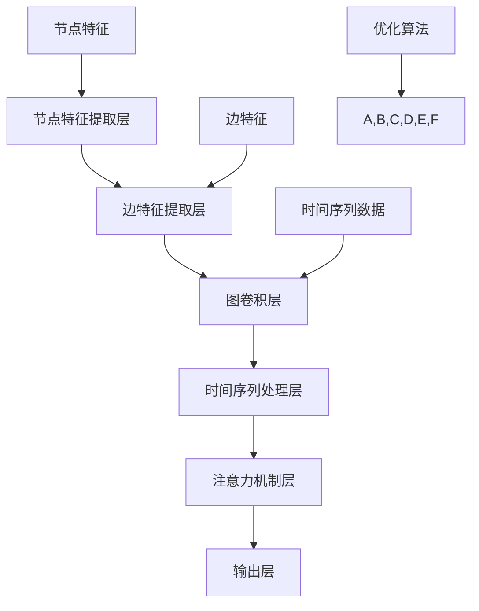

                 

# 动态图神经网络：建模时序关系数据

## 关键词
- 动态图神经网络
- 时序关系数据
- 图神经网络
- 神经网络架构
- 应用领域

## 摘要
本文深入探讨了动态图神经网络（DGNN）在建模时序关系数据方面的应用。我们首先介绍了动态图神经网络的基本概念、原理及其在时序数据分析中的重要性。接着，详细阐述了动态图神经网络的核心原理、数学模型及其设计原则。随后，我们展示了动态图神经网络在社交网络分析、金融时间序列分析和健康医疗数据分析等领域的实际应用。文章最后通过一个实战项目，详细讲解了动态图神经网络的实现过程，包括环境搭建、核心实现和实际案例分析。希望通过本文，读者能够全面理解动态图神经网络在建模时序关系数据中的潜力和应用。

## 第一部分 背景介绍

### 第1章 问题背景与定义

#### 1.1 问题背景

动态图（Dynamic Graph）是指在时间和空间上都有变化特性的图结构，广泛应用于社交网络、生物信息学、通信网络等多个领域。在动态图中，节点和边的属性会随时间变化而变化，这使得传统的静态图神经网络无法直接应用于动态图数据的分析。

时序关系数据（Temporal Relationship Data）是随着时间推移而变化的数据。在现实世界中，许多数据都具有时间维度，如社交网络中的用户互动、金融市场的股价变动、健康医疗中的生命体征等。这些数据不仅包含历史信息，还包含时间序列中的趋势和模式，对它们的有效建模和分析具有重要意义。

#### 1.1.1 动态图数据的重要性

动态图数据具有以下重要性：

1. **实时性**：动态图数据能够实时反映系统的状态变化，对于需要实时决策的应用场景具有重要意义。
2. **复杂度**：动态图数据中的节点和边具有时间依赖性，这使得传统的图分析方法难以处理。
3. **多样性**：动态图数据在不同领域中具有不同的特性，需要针对具体应用场景进行定制化的建模和分析。

#### 1.1.2 动态图数据在时序分析中的应用

动态图数据在时序分析中的应用主要体现在以下几个方面：

1. **社交网络分析**：分析用户互动、社群结构以及趋势变化，为社交平台的推荐系统和社区治理提供支持。
2. **金融时间序列分析**：预测股价、交易量等金融指标，为金融市场的风险管理和投资决策提供依据。
3. **健康医疗数据分析**：监测生命体征、分析疾病传播趋势，为健康医疗提供决策支持。

#### 1.1.3 动态图神经网络的产生与发展

动态图神经网络（Dynamic Graph Neural Networks, DGNN）是为了解决动态图数据在时序分析中的建模问题而发展起来的一种神经网络模型。其基本思想是将图神经网络（Graph Neural Networks, GNN）扩展到时间维度，通过捕捉节点和边在时间序列中的动态特性，实现对动态图数据的建模和分析。

动态图神经网络的发展可以分为以下几个阶段：

1. **初步探索**：研究者开始探索如何将时间维度引入到图神经网络中，提出了最早的动态图神经网络模型。
2. **模型改进**：通过引入注意力机制、循环神经网络（RNN）等机制，不断改进动态图神经网络的性能和表达能力。
3. **应用拓展**：动态图神经网络在多个领域的实际应用中取得了显著成果，推动了该领域的研究和发展。

#### 1.2 核心概念

在本章节中，我们将介绍以下核心概念：

1. **动态图**：动态图是指在时间和空间上都有变化特性的图结构。
2. **时序关系数据**：时序关系数据是随着时间推移而变化的数据。
3. **动态图神经网络**：动态图神经网络是一种能够建模动态图数据的神经网络模型。
4. **动态图神经网络的关键特性**：动态图神经网络的关键特性包括时间维度、动态节点属性和动态边属性。

#### 1.2.1 动态图

动态图是指在时间和空间上都有变化特性的图结构。在动态图中，节点和边的属性会随时间变化而变化。动态图可以表示多种现实世界中的复杂系统，如社交网络、生物信息学、通信网络等。

**动态图的定义**：动态图是一个四元组 \( G = (V, E, T, A) \)，其中 \( V \) 是节点集合，\( E \) 是边集合，\( T \) 是时间戳集合，\( A \) 是属性集合。

**动态图的特点**：

1. **时变特性**：动态图的节点和边在时间维度上具有动态特性。
2. **复杂结构**：动态图可以表示多种复杂的系统结构，包括网络节点、边、时间等。
3. **多维度属性**：动态图的节点和边可以具有多种维度属性，如权重、标签等。

**动态图的应用**：

1. **社交网络分析**：分析用户互动、社群结构以及趋势变化。
2. **生物信息学**：研究基因调控网络、蛋白质相互作用网络等。
3. **通信网络分析**：分析网络拓扑结构、流量模式等。

#### 1.2.2 时序关系数据

时序关系数据是随着时间推移而变化的数据。在现实世界中，许多数据都具有时间维度，如社交网络中的用户互动、金融市场的股价变动、健康医疗中的生命体征等。时序关系数据包含历史信息，同时也包含时间序列中的趋势和模式。

**时序关系数据的定义**：时序关系数据是一种包含时间维度和关系维度的数据。它可以表示为 \( D = (T, R) \)，其中 \( T \) 是时间戳集合，\( R \) 是关系集合。

**时序关系数据的特点**：

1. **时间维度**：时序关系数据具有明确的时间戳，能够表示数据在不同时间点的变化。
2. **关系维度**：时序关系数据不仅包含时间维度，还包含节点之间的关系维度。
3. **趋势和模式**：时序关系数据包含时间序列中的趋势和模式，有助于预测未来的变化。

**时序关系数据的应用**：

1. **社交网络分析**：分析用户互动、社群结构以及趋势变化。
2. **金融时间序列分析**：预测股价、交易量等金融指标。
3. **健康医疗数据分析**：监测生命体征、分析疾病传播趋势。

#### 1.2.3 动态图神经网络

动态图神经网络（Dynamic Graph Neural Networks, DGNN）是一种能够建模动态图数据的神经网络模型。它通过将图神经网络（Graph Neural Networks, GNN）扩展到时间维度，实现对动态图数据的建模和分析。

**动态图神经网络的基本概念**：

1. **节点和边**：动态图神经网络的节点和边具有时间维度上的动态特性。
2. **时间序列**：动态图神经网络的时间序列表示动态图在时间维度上的变化。
3. **注意力机制**：动态图神经网络引入注意力机制，以关注重要节点和边。
4. **循环神经网络（RNN）**：动态图神经网络可以结合循环神经网络（RNN），以处理时间序列数据。

**动态图神经网络的特点**：

1. **时间维度**：动态图神经网络能够捕捉动态图在时间维度上的变化。
2. **动态节点属性和边属性**：动态图神经网络可以处理动态节点属性和边属性。
3. **多维度输入**：动态图神经网络可以接受多维度输入，如节点特征、边特征等。

**动态图神经网络的应用**：

1. **社交网络分析**：分析用户互动、社群结构以及趋势变化。
2. **金融时间序列分析**：预测股价、交易量等金融指标。
3. **健康医疗数据分析**：监测生命体征、分析疾病传播趋势。

#### 1.2.4 动态图神经网络的关键特性

动态图神经网络的关键特性包括时间维度、动态节点属性和动态边属性。这些特性使得动态图神经网络能够有效地建模动态图数据，并在时序分析中发挥重要作用。

**时间维度**：动态图神经网络能够捕捉动态图在时间维度上的变化，使得模型能够适应时间序列数据的动态特性。

**动态节点属性**：动态图神经网络可以处理动态节点属性，如节点的特征、状态等，从而实现对动态图数据的深入分析。

**动态边属性**：动态图神经网络可以处理动态边属性，如边的特征、权重等，从而实现对动态图数据的全面分析。

#### 1.3 边界与外延

在探讨动态图神经网络时，我们需要明确其适用范围和与静态图神经网络的区别。

**动态图神经网络的适用范围**：

1. **动态图数据**：动态图神经网络适用于动态图数据的建模和分析，如社交网络、生物信息学、通信网络等。
2. **时序数据**：动态图神经网络适用于时序数据的建模和分析，如金融时间序列、健康医疗时间序列等。

**动态图神经网络与静态图神经网络的区别**：

1. **时间维度**：动态图神经网络能够捕捉时间维度上的变化，而静态图神经网络无法处理时间序列数据。
2. **动态特性**：动态图神经网络能够处理动态节点属性和边属性，而静态图神经网络无法处理动态特性。
3. **适用场景**：动态图神经网络适用于动态图和时序数据的建模和分析，而静态图神经网络适用于静态图数据的建模和分析。

#### 1.3.3 动态图神经网络在不同领域中的应用

动态图神经网络在多个领域取得了显著成果，以下是一些典型应用：

1. **社交网络分析**：分析用户互动、社群结构以及趋势变化，为社交平台的推荐系统和社区治理提供支持。
2. **金融时间序列分析**：预测股价、交易量等金融指标，为金融市场的风险管理和投资决策提供依据。
3. **健康医疗数据分析**：监测生命体征、分析疾病传播趋势，为健康医疗提供决策支持。

#### 1.4 概念结构与核心要素组成

在本章节中，我们将介绍动态图神经网络的概念结构及其核心要素组成。

**动态图神经网络的概念结构**：

1. **节点和边**：动态图神经网络的节点和边具有时间维度上的动态特性。
2. **时间序列**：动态图神经网络的时间序列表示动态图在时间维度上的变化。
3. **注意力机制**：动态图神经网络引入注意力机制，以关注重要节点和边。
4. **循环神经网络（RNN）**：动态图神经网络可以结合循环神经网络（RNN），以处理时间序列数据。

**动态图神经网络的核心要素组成**：

1. **动态节点属性**：动态图神经网络处理动态节点属性，如节点的特征、状态等。
2. **动态边属性**：动态图神经网络处理动态边属性，如边的特征、权重等。
3. **时间序列数据**：动态图神经网络处理时间序列数据，以捕捉动态特性。
4. **优化算法**：动态图神经网络使用优化算法，如梯度下降、随机梯度下降等，以训练模型。

#### 1.4.1 动态图神经网络的基本结构

动态图神经网络的基本结构包括以下几个部分：

1. **节点特征提取层**：该层用于提取节点的特征，通常使用预训练的嵌入模型。
2. **边特征提取层**：该层用于提取边的特征，通常使用预训练的嵌入模型。
3. **图卷积层**：该层用于对节点和边进行卷积操作，以捕捉节点的邻接关系和动态特性。
4. **时间序列处理层**：该层用于处理时间序列数据，通常使用循环神经网络（RNN）。
5. **注意力机制层**：该层用于引入注意力机制，以关注重要节点和边。
6. **输出层**：该层用于输出最终的结果，如节点分类、边分类等。

#### 1.4.2 动态图神经网络的核心要素

动态图神经网络的核心要素包括节点特征、边特征、时间序列数据、优化算法等。这些要素共同构成了动态图神经网络的基础，并决定了模型的性能和表达能力。

1. **节点特征**：节点特征用于表示节点的属性，如节点的类型、标签等。这些特征可以帮助模型更好地理解节点的行为和关系。
2. **边特征**：边特征用于表示边的关系属性，如边的权重、类型等。这些特征可以帮助模型更好地理解节点之间的相互作用和影响。
3. **时间序列数据**：时间序列数据用于表示动态图在时间维度上的变化。这些数据可以帮助模型捕捉动态特性，从而更准确地预测未来的变化。
4. **优化算法**：优化算法用于训练动态图神经网络模型，如梯度下降、随机梯度下降等。这些算法可以帮助模型找到最优参数，从而提高模型的性能和准确性。

#### 1.4.3 动态图神经网络的概念关系图

为了更好地理解动态图神经网络的概念结构和核心要素，我们可以使用Mermaid流程图来表示。以下是一个简单的概念关系图：



**本章小结**

在本章中，我们介绍了动态图神经网络的基本概念、原理及其在时序数据分析中的重要性。我们详细阐述了动态图神经网络的核心概念、关键特性及其在不同领域中的应用。通过本章的学习，读者可以了解动态图神经网络的基本原理和应用场景，为后续章节的深入学习打下基础。

### 第2章 动态图神经网络基础

#### 2.1 动态图神经网络的基本概念

动态图神经网络（Dynamic Graph Neural Networks, DGNN）是一种用于建模动态图数据的神经网络模型。与传统的图神经网络（Graph Neural Networks, GNN）相比，DGNN能够捕捉动态图在时间维度上的变化，从而更好地处理时序关系数据。

**2.1.1 节点与边的动态属性**

在动态图神经网络中，节点和边不仅具有静态属性，还具备动态属性。节点和边的动态属性通常包括以下几个方面：

1. **时间戳**：每个节点和边都有一个对应的时间戳，表示它们在动态图中的出现时间。时间戳可以帮助模型捕捉节点和边在时间序列中的变化。
2. **动态特征**：节点和边的动态特征可以是节点类型、边类型、节点状态、边权重等。动态特征可以反映节点和边在时间序列中的变化趋势和关系强度。
3. **时变关系**：动态图中节点和边之间的关系也会随时间变化。例如，在社交网络中，用户之间的关系可能会随着时间的推移而加强或减弱。

**2.1.2 动态图的时间维度**

动态图的时间维度是DGNN的核心特征之一。在动态图中，时间维度表示节点和边属性的变化过程。时间维度可以帮助模型捕捉时间序列数据中的趋势和模式。动态图的时间维度通常具有以下特点：

1. **连续性**：时间维度是连续的，可以表示为实数或离散的时间点。
2. **变化性**：时间维度上的变化可以反映动态图在不同时间点的状态。
3. **周期性**：某些动态图数据可能具有周期性，如股市价格、天气变化等。

**2.1.3 动态图神经网络的作用**

动态图神经网络的作用主要体现在以下几个方面：

1. **建模动态图数据**：DGNN能够捕捉动态图在时间维度上的变化，从而对动态图数据建立准确的模型。
2. **时序预测**：通过分析动态图的时间维度，DGNN可以预测节点和边在未来的状态。
3. **关系挖掘**：DGNN能够挖掘动态图中的时变关系，揭示节点和边之间的动态互动。
4. **时序分析**：DGNN可以用于时序数据的分析，如社交网络中的趋势分析、金融时间序列的预测等。

#### 2.2 动态图神经网络的核心原理

动态图神经网络的核心原理包括图神经网络（GNN）的基本原理和动态特性的引入。

**2.2.1 图神经网络基础**

图神经网络是一种基于图结构的神经网络模型，能够对图数据进行建模和分析。GNN的核心思想是通过图卷积操作来学习节点和边之间的关系。图卷积操作的基本形式如下：

\[ h_v^{(k+1)} = \sigma(\sum_{u \in \mathcal{N}(v)} W^{(k)} h_u^{(k) + b^{(k)}) \]

其中，\( h_v^{(k)} \)表示节点\( v \)在\( k \)层网络中的特征，\( \mathcal{N}(v) \)表示节点\( v \)的邻域节点集合，\( W^{(k)} \)和\( b^{(k)} \)分别是权重和偏置，\( \sigma \)是激活函数。

**2.2.2 动态图神经网络的建模方法**

动态图神经网络通过引入时间维度，扩展了传统GNN的建模方法。以下是一种常用的动态图神经网络建模方法：

1. **动态图卷积操作**：动态图卷积操作是对传统图卷积操作的扩展，考虑了时间维度上的变化。其基本形式如下：

\[ h_v^{(k+1)} = \sigma(\sum_{u \in \mathcal{N}(v)} W^{(k)} h_u^{(k) + \phi(t_v, t_u) + b^{(k)}) \]

其中，\( \phi(t_v, t_u) \)是一个时间函数，用于表示节点\( v \)和节点\( u \)之间的时变关系。

2. **时间嵌入层**：时间嵌入层用于将时间维度嵌入到节点特征中。一种常见的方法是使用循环神经网络（RNN）或长短期记忆网络（LSTM）来处理时间序列数据。

3. **注意力机制**：注意力机制可以用于动态图神经网络，以关注重要节点和边。注意力机制的基本形式如下：

\[ a_{vu}^{(k)} = \sigma(W^{(a)} h_v^{(k)} h_u^{(k)}) \]

其中，\( a_{vu}^{(k)} \)表示节点\( v \)和节点\( u \)之间的注意力权重。

**2.2.3 动态图神经网络的工作原理**

动态图神经网络的工作原理可以概括为以下几个步骤：

1. **初始化**：初始化节点特征和边特征。
2. **时间嵌入**：将时间维度嵌入到节点特征中。
3. **图卷积操作**：对节点特征进行图卷积操作，以学习节点和边之间的关系。
4. **注意力机制**：使用注意力机制关注重要节点和边。
5. **输出层**：根据任务需求，输出分类、回归或其他结果。

#### 2.3 动态图神经网络的数学模型

动态图神经网络的数学模型包括节点特征、边特征、时间函数和注意力机制等。以下是一种典型的动态图神经网络数学模型：

1. **节点特征**：节点特征 \( h_v \) 可以表示为：

\[ h_v = \begin{bmatrix} 
h_{v,1}^{(1)} & h_{v,1}^{(2)} & \cdots & h_{v,1}^{(T)} \\
h_{v,2}^{(1)} & h_{v,2}^{(2)} & \cdots & h_{v,2}^{(T)} \\
\vdots & \vdots & \ddots & \vdots \\
h_{v,D}^{(1)} & h_{v,D}^{(2)} & \cdots & h_{v,D}^{(T)}
\end{bmatrix} \]

其中，\( T \) 表示时间维度，\( D \) 表示节点特征的维度。

2. **边特征**：边特征 \( h_e \) 可以表示为：

\[ h_e = \begin{bmatrix} 
h_{e,1}^{(1)} & h_{e,1}^{(2)} & \cdots & h_{e,1}^{(T)} \\
h_{e,2}^{(1)} & h_{e,2}^{(2)} & \cdots & h_{e,2}^{(T)} \\
\vdots & \vdots & \ddots & \vdots \\
h_{e,D}^{(1)} & h_{e,D}^{(2)} & \cdots & h_{e,D}^{(T)}
\end{bmatrix} \]

3. **时间函数**：时间函数 \( \phi(t_v, t_u) \) 可以用于表示节点 \( v \) 和节点 \( u \) 之间的时变关系。一种常见的时间函数是：

\[ \phi(t_v, t_u) = \exp(-\alpha \cdot |t_v - t_u|) \]

其中，\( \alpha \) 是一个调节参数。

4. **注意力机制**：注意力权重 \( a_{vu} \) 可以表示为：

\[ a_{vu} = \sigma(W^{(a)} h_v h_u) \]

其中，\( W^{(a)} \) 是注意力机制的权重矩阵，\( \sigma \) 是激活函数。

5. **输出层**：根据任务需求，输出层可以是一个分类器、回归器或其他模型。例如，对于一个分类任务，输出层可以是一个 Softmax 函数：

\[ \hat{y}_v = \text{softmax}(W^{(o)} h_v) \]

其中，\( \hat{y}_v \) 是节点 \( v \) 的预测分类结果，\( W^{(o)} \) 是输出层的权重矩阵。

#### 2.3.1 动态图神经网络的基本数学公式

为了更清晰地理解动态图神经网络的数学模型，以下是动态图神经网络的基本数学公式：

1. **节点特征更新**：

\[ h_v^{(k+1)} = \sigma(\sum_{u \in \mathcal{N}(v)} W^{(k)} h_u^{(k) + \phi(t_v, t_u) + b^{(k)}) \]

2. **边特征更新**：

\[ h_e^{(k+1)} = \sigma(\sum_{u \in \mathcal{N}(v)} W^{(k)} h_e^{(k)}) \]

3. **注意力权重计算**：

\[ a_{vu} = \sigma(W^{(a)} h_v h_u) \]

4. **输出层计算**：

\[ \hat{y}_v = \text{softmax}(W^{(o)} h_v) \]

#### 2.3.2 动态图神经网络的优化方法

动态图神经网络的优化方法主要用于训练模型，包括前向传播、反向传播和参数更新等。以下是一种典型的动态图神经网络优化方法：

1. **前向传播**：

在动态图神经网络中，前向传播过程包括节点特征更新、边特征更新和输出层计算。具体步骤如下：

- 初始化节点特征 \( h_v^{(0)} \) 和边特征 \( h_e^{(0)} \)。
- 进行 \( k \) 次图卷积操作，更新节点特征和边特征：
  \[ h_v^{(k+1)} = \sigma(\sum_{u \in \mathcal{N}(v)} W^{(k)} h_u^{(k) + \phi(t_v, t_u) + b^{(k)}) \]
  \[ h_e^{(k+1)} = \sigma(\sum_{u \in \mathcal{N}(v)} W^{(k)} h_e^{(k)}) \]
- 计算注意力权重：
  \[ a_{vu} = \sigma(W^{(a)} h_v h_u) \]
- 进行输出层计算：
  \[ \hat{y}_v = \text{softmax}(W^{(o)} h_v) \]

2. **反向传播**：

反向传播过程用于计算模型参数的梯度，并更新模型参数。具体步骤如下：

- 计算损失函数 \( L \) 对模型参数的梯度：
  \[ \frac{\partial L}{\partial W^{(o)}} = \frac{\partial L}{\partial \hat{y}_v} \cdot \frac{\partial \hat{y}_v}{\partial W^{(o)}} \]
  \[ \frac{\partial L}{\partial b^{(k)}} = \frac{\partial L}{\partial \hat{y}_v} \cdot \frac{\partial \hat{y}_v}{\partial b^{(k)}} \]
  \[ \frac{\partial L}{\partial W^{(a)}} = \frac{\partial L}{\partial a_{vu}} \cdot \frac{\partial a_{vu}}{\partial W^{(a)}} \]
  \[ \frac{\partial L}{\partial h_v} = \frac{\partial L}{\partial \hat{y}_v} \cdot \frac{\partial \hat{y}_v}{\partial h_v} \]
  \[ \frac{\partial L}{\partial h_e} = \frac{\partial L}{\partial h_e^{(k+1)}} \cdot \frac{\partial h_e^{(k+1)}}{\partial h_e^{(k)}} \]
  \[ \frac{\partial L}{\partial h_u} = \frac{\partial L}{\partial h_u^{(k)}} \cdot \frac{\partial h_u^{(k)}}{\partial h_u} \]
- 使用梯度下降或其他优化算法更新模型参数：
  \[ W^{(o)} \leftarrow W^{(o)} - \alpha \cdot \frac{\partial L}{\partial W^{(o)}} \]
  \[ b^{(k)} \leftarrow b^{(k)} - \alpha \cdot \frac{\partial L}{\partial b^{(k)}} \]
  \[ W^{(a)} \leftarrow W^{(a)} - \alpha \cdot \frac{\partial L}{\partial W^{(a)}} \]
  \[ h_v \leftarrow h_v - \alpha \cdot \frac{\partial L}{\partial h_v} \]
  \[ h_e \leftarrow h_e - \alpha \cdot \frac{\partial L}{\partial h_e} \]
  \[ h_u \leftarrow h_u - \alpha \cdot \frac{\partial L}{\partial h_u} \]

3. **参数更新策略**：

在动态图神经网络的训练过程中，参数更新策略是一个重要的考虑因素。以下是一些常见的参数更新策略：

- **学习率调整**：学习率是动态图神经网络训练过程中的一个关键参数。学习率的选择会影响模型训练的速度和收敛性。常用的学习率调整策略包括线性递减、指数递减和自适应调整等。
- **批量大小**：批量大小是每次训练过程中参与梯度计算的样本数量。批量大小会影响模型训练的稳定性和效率。较小的批量大小可以提供更好的泛化能力，但训练速度较慢；较大的批量大小可以提高训练速度，但可能增加过拟合的风险。
- **正则化**：正则化是一种用于防止模型过拟合的技术。常见的正则化方法包括权重正则化、dropout和集成学习等。

#### 2.3.3 动态图神经网络的训练过程

动态图神经网络的训练过程包括数据准备、模型初始化、模型训练和模型评估等步骤。以下是一个典型的动态图神经网络训练过程：

1. **数据准备**：

在训练动态图神经网络之前，需要准备适当的数据集。数据集通常包括节点特征、边特征和时间序列数据。节点特征和边特征可以来自原始数据，如社交网络中的用户信息和互动记录；时间序列数据可以来自历史数据或实时数据。

2. **模型初始化**：

初始化动态图神经网络模型，包括节点特征、边特征和模型参数。节点特征和边特征可以初始化为随机值或使用预训练的嵌入模型。模型参数包括权重矩阵、偏置和激活函数等，可以初始化为随机值或使用预训练的模型。

3. **模型训练**：

使用训练数据对动态图神经网络进行训练。训练过程包括前向传播、反向传播和参数更新等步骤。具体步骤如下：

- 使用训练数据对动态图神经网络进行前向传播，计算节点特征、边特征和输出结果。
- 计算损失函数，如交叉熵损失函数或均方误差损失函数。
- 使用反向传播算法计算模型参数的梯度。
- 使用优化算法更新模型参数，如梯度下降或随机梯度下降。

4. **模型评估**：

在训练过程中，定期使用验证数据对动态图神经网络进行评估，以检查模型性能。评估指标包括准确率、召回率、F1值等。通过评估结果，可以调整模型参数或数据预处理方法，以提高模型性能。

5. **模型优化**：

根据评估结果，对动态图神经网络进行优化。优化方法可以包括调整学习率、批量大小、正则化策略等。优化的目标是提高模型性能，减少过拟合现象。

#### 2.4 动态图神经网络的设计原则

动态图神经网络的设计原则包括以下几个方面：

1. **模块化设计**：动态图神经网络应该具有模块化设计，以便于模块的替换和扩展。例如，可以使用不同的时间函数、注意力机制和输出层，以适应不同的应用场景。
2. **可扩展性**：动态图神经网络应该具有可扩展性，以处理不同规模的数据集。例如，可以使用并行计算、分布式计算等方法，以提高模型的计算效率。
3. **灵活性**：动态图神经网络应该具有灵活性，以适应不同的数据类型和任务需求。例如，可以处理不同类型的节点特征、边特征和时间序列数据。
4. **鲁棒性**：动态图神经网络应该具有鲁棒性，以减少噪声和异常值对模型性能的影响。例如，可以使用数据清洗、去噪等方法，提高模型的鲁棒性。
5. **可解释性**：动态图神经网络应该具有可解释性，以帮助用户理解模型的决策过程。例如，可以可视化节点特征、边特征和时间序列数据，以揭示模型内部的运作机制。

#### 2.5 本章小结

在本章中，我们介绍了动态图神经网络的基本概念、原理及其数学模型。我们详细阐述了动态图神经网络在节点与边的动态属性、时间维度、建模方法、优化方法等方面的特点。通过本章的学习，读者可以理解动态图神经网络的基本原理和应用场景，为后续章节的深入学习打下基础。

## 第3章 动态图神经网络的应用领域

### 3.1 社交网络分析

#### 3.1.1 社交网络的动态特性

社交网络是动态图神经网络的一个重要应用领域。社交网络的动态特性主要体现在以下几个方面：

1. **用户互动**：用户在社交网络中的互动是动态的，包括点赞、评论、分享等行为。这些互动随着时间的推移而不断变化，形成了复杂的动态图结构。
2. **社群结构**：社交网络中的用户可以组成不同的社群，如兴趣小组、朋友圈等。这些社群的结构是动态的，会随着用户的加入、退出以及社群内部的互动而变化。
3. **信息传播**：社交网络中的信息传播具有时序特性，信息的传播速度和范围会随着时间的变化而变化。这种动态特性使得社交网络成为一个理想的动态图数据分析场景。

#### 3.1.2 动态图神经网络在社交网络分析中的应用

动态图神经网络在社交网络分析中的应用主要包括以下几个方面：

1. **用户行为预测**：通过分析用户的历史行为数据，动态图神经网络可以预测用户在未来的行为，如点赞、评论等。这有助于社交平台为用户提供个性化推荐。
2. **社群结构分析**：动态图神经网络可以分析社交网络中的社群结构，识别不同社群之间的关联和互动关系。这有助于社交平台优化社群管理，提高用户参与度。
3. **信息传播预测**：通过分析社交网络中的信息传播数据，动态图神经网络可以预测信息的传播速度和范围。这有助于社交平台优化信息推送策略，提高信息传播效果。

#### 3.1.3 社交网络分析案例分析

以下是一个社交网络分析的实际案例：

**案例背景**：某社交平台希望预测用户在未来的点赞行为，以提高平台的推荐系统效果。

**数据集**：该数据集包含用户行为数据，如用户ID、帖子ID、点赞时间等。

**模型构建**：使用动态图神经网络构建用户点赞行为预测模型。模型结构如下：

1. **节点特征提取**：提取用户特征，如用户年龄、性别、地理位置等。
2. **边特征提取**：提取用户之间的互动关系，如点赞关系、评论关系等。
3. **图卷积层**：对用户特征和边特征进行图卷积操作，以学习用户之间的动态关系。
4. **时间序列处理**：使用循环神经网络（RNN）处理用户行为的时间序列数据，以捕捉用户行为的时变特性。
5. **输出层**：输出用户点赞行为的概率分布。

**训练过程**：使用训练数据对动态图神经网络进行训练，并使用验证数据评估模型性能。

**评估指标**：评估指标包括准确率、召回率、F1值等。

**结果分析**：通过对预测结果的分析，可以发现用户在未来点赞行为的高概率时间点，从而为平台的推荐系统提供有力支持。

### 3.2 金融时间序列分析

#### 3.2.1 金融时间序列的动态特性

金融时间序列是动态图神经网络的另一个重要应用领域。金融时间序列的动态特性主要体现在以下几个方面：

1. **价格变动**：金融市场的价格变动具有时序特性，价格在一段时间内可能会呈现波动趋势。
2. **交易量**：金融市场的交易量也具有时序特性，交易量在一段时间内可能会出现周期性波动。
3. **市场情绪**：金融市场的情绪变化会影响价格和交易量，市场情绪具有动态变化特性。

#### 3.2.2 动态图神经网络在金融时间序列分析中的应用

动态图神经网络在金融时间序列分析中的应用主要包括以下几个方面：

1. **价格预测**：通过分析金融时间序列数据，动态图神经网络可以预测未来的价格走势，为投资者提供决策支持。
2. **交易量预测**：动态图神经网络可以预测金融市场的交易量，帮助投资者判断市场的活跃程度。
3. **市场情绪分析**：动态图神经网络可以分析金融市场的情绪变化，为投资者提供市场情绪的监测工具。

#### 3.2.3 金融时间序列分析案例分析

以下是一个金融时间序列分析的实际案例：

**案例背景**：某金融公司希望预测未来一周的股票价格，以提高投资决策的准确性。

**数据集**：该数据集包含股票的历史价格和交易量数据。

**模型构建**：使用动态图神经网络构建股票价格预测模型。模型结构如下：

1. **节点特征提取**：提取股票的基本面信息，如公司财务数据、行业分类等。
2. **边特征提取**：提取股票之间的关联关系，如行业关联、竞争对手关系等。
3. **图卷积层**：对股票特征和边特征进行图卷积操作，以学习股票之间的动态关系。
4. **时间序列处理**：使用循环神经网络（RNN）处理股票价格的时间序列数据，以捕捉价格变动的时变特性。
5. **输出层**：输出股票未来一周的价格预测结果。

**训练过程**：使用训练数据对动态图神经网络进行训练，并使用验证数据评估模型性能。

**评估指标**：评估指标包括预测准确率、预测误差等。

**结果分析**：通过对预测结果的分析，可以发现股票未来一周的价格走势，从而为投资者的决策提供有力支持。

### 3.3 健康医疗数据分析

#### 3.3.1 健康医疗数据的动态特性

健康医疗数据是动态图神经网络的另一个重要应用领域。健康医疗数据的动态特性主要体现在以下几个方面：

1. **生命体征**：生命体征数据，如心率、血压、体温等，具有时序特性。这些数据需要实时监测和分析，以便及时发现异常情况。
2. **疾病传播**：疾病的传播过程具有动态特性，疾病在一段时间内可能会呈现爆发或扩散趋势。
3. **医疗行为**：患者的医疗行为，如就诊、用药等，具有时序特性。这些数据有助于分析患者的健康状况和医疗需求。

#### 3.3.2 动态图神经网络在健康医疗数据分析中的应用

动态图神经网络在健康医疗数据分析中的应用主要包括以下几个方面：

1. **生命体征监测**：动态图神经网络可以监测生命体征数据，预测可能的异常情况，为医生提供诊断和治疗依据。
2. **疾病预测**：动态图神经网络可以分析患者的病史和生命体征数据，预测可能的疾病发生风险。
3. **医疗资源分配**：动态图神经网络可以分析医院的就诊数据，优化医疗资源的分配，提高医疗服务效率。

#### 3.3.3 健康医疗数据分析案例分析

以下是一个健康医疗数据分析的实际案例：

**案例背景**：某医院希望预测患者在未来一周内可能出现的疾病情况，以提高疾病预防和治疗的效果。

**数据集**：该数据集包含患者的病史数据、生命体征数据、就诊记录等。

**模型构建**：使用动态图神经网络构建疾病预测模型。模型结构如下：

1. **节点特征提取**：提取患者的病史特征，如疾病类型、手术记录等。
2. **边特征提取**：提取患者之间的关联关系，如亲属关系、朋友关系等。
3. **图卷积层**：对病史特征和边特征进行图卷积操作，以学习患者之间的动态关系。
4. **时间序列处理**：使用循环神经网络（RNN）处理生命体征数据的时间序列，以捕捉生命体征的时变特性。
5. **输出层**：输出患者未来一周内可能出现的疾病类型及其概率。

**训练过程**：使用训练数据对动态图神经网络进行训练，并使用验证数据评估模型性能。

**评估指标**：评估指标包括疾病预测准确率、疾病发生风险预测准确率等。

**结果分析**：通过对预测结果的分析，可以提前发现患者可能出现的疾病风险，为医生提供诊断和治疗的依据，从而提高疾病预防和治疗的效果。

### 3.4 本章小结

在本章中，我们探讨了动态图神经网络在社交网络分析、金融时间序列分析和健康医疗数据分析等领域的应用。通过案例分析，我们展示了动态图神经网络在这些领域中的实际应用效果。通过本章的学习，读者可以了解动态图神经网络在不同领域中的潜力和应用前景。

## 第4章 动态图神经网络项目实战

### 4.1 项目准备与安装环境搭建

#### 4.1.1 项目背景介绍

在本文中，我们将通过一个实际项目来展示如何使用动态图神经网络（DGNN）来建模时序关系数据。该项目的主要目标是预测社交网络中的用户互动行为，如点赞、评论等。通过这个项目，读者可以了解动态图神经网络的应用流程，从环境搭建到模型训练和评估的整个过程。

#### 4.1.2 系统需求分析

为了实现该项目，我们需要以下系统需求：

1. **硬件需求**：一台配置较高的计算机，具备至少8GB内存和1TB硬盘空间。
2. **软件需求**：
   - 操作系统：Linux或Windows
   - 编程语言：Python
   - 数据库：MySQL或MongoDB
   - 算法库：TensorFlow或PyTorch
   - 画图工具：Matplotlib或Seaborn

#### 4.1.3 环境搭建步骤

以下步骤将指导您搭建项目环境：

1. **安装操作系统**：根据您的硬件和偏好选择适合的操作系统，并按照官方指南进行安装。
2. **安装Python**：在操作系统上安装Python。推荐使用Python 3.8或更高版本。
3. **安装数据库**：在计算机上安装MySQL或MongoDB。推荐使用MySQL，因为它在数据处理方面更为成熟。
4. **安装算法库**：使用pip命令安装TensorFlow或PyTorch。以下是安装命令：

   ```bash
   pip install tensorflow
   # 或者
   pip install torch torchvision
   ```

5. **安装画图工具**：使用pip命令安装Matplotlib或Seaborn。

   ```bash
   pip install matplotlib
   # 或者
   pip install seaborn
   ```

6. **配置环境变量**：确保Python和pip的环境变量已配置，以便在命令行中运行Python脚本。

7. **验证环境搭建**：在命令行中运行以下命令，验证环境是否搭建成功：

   ```python
   python --version
   pip --version
   ```

   如果看到正确的版本号，则表示环境搭建成功。

#### 4.1.4 环境配置与优化

在搭建好环境后，我们还需要进行一些优化和配置：

1. **优化Python性能**：安装PyPy，这是一个Python的JIT（Just-In-Time）编译器，可以显著提高Python代码的执行速度。

   ```bash
   pip install pypy
   ```

2. **配置数据库**：在MySQL或MongoDB中创建项目数据库，并设置用户权限。以下是创建数据库和用户的示例命令：

   ```sql
   CREATE DATABASE social_network;
   GRANT ALL PRIVILEGES ON social_network.* TO 'project_user'@'localhost' IDENTIFIED BY 'password';
   FLUSH PRIVILEGES;
   ```

3. **配置TensorFlow或PyTorch**：确保TensorFlow或PyTorch已配置为使用GPU加速。以下是配置命令：

   ```bash
   export TF_CPP_MIN_LOG_LEVEL=2
   export CUDA_VISIBLE_DEVICES=0
   ```

   如果您使用的是PyTorch，请确保安装了CUDA和cuDNN。

#### 4.1.5 本章小结

在本章中，我们介绍了如何准备和搭建动态图神经网络项目环境。通过遵循本章的步骤，您可以成功搭建一个支持动态图神经网络建模和预测的完整项目环境。接下来，我们将进入下一章，介绍动态图神经网络的核心实现过程。

### 4.2 动态图神经网络核心实现

在本章中，我们将详细探讨动态图神经网络（DGNN）的核心实现过程，包括模型设计、训练流程、预测流程以及代码应用解读与分析。

#### 4.2.1 系统核心算法实现

**模型设计**

动态图神经网络模型的构建是项目实现的关键步骤。以下是一个简单的动态图神经网络模型设计：

1. **节点特征提取层**：该层用于提取社交网络中的用户特征。用户特征包括用户ID、年龄、性别、地理位置等。
2. **边特征提取层**：该层用于提取用户之间的互动关系特征。互动关系特征包括点赞关系、评论关系、好友关系等。
3. **图卷积层**：该层用于对用户特征和互动关系特征进行图卷积操作，以学习用户和互动关系之间的动态关系。
4. **时间序列处理层**：该层用于处理用户行为的时间序列数据，如点赞时间、评论时间等。时间序列处理可以采用循环神经网络（RNN）或长短期记忆网络（LSTM）。
5. **注意力机制层**：该层用于引入注意力机制，以关注重要节点和边。注意力机制可以增强模型对关键特征的识别能力。
6. **输出层**：该层用于输出用户未来的行为预测结果，如点赞、评论的概率分布。

**训练流程**

动态图神经网络的训练过程包括以下几个步骤：

1. **数据预处理**：对原始数据进行清洗和处理，包括缺失值填充、异常值处理、数据标准化等。
2. **模型初始化**：初始化动态图神经网络模型，包括节点特征、边特征、权重矩阵和偏置等。
3. **前向传播**：输入节点特征和边特征，通过图卷积层、时间序列处理层、注意力机制层和输出层进行前向传播，得到预测结果。
4. **损失函数计算**：计算预测结果与真实结果之间的损失函数，如交叉熵损失函数或均方误差损失函数。
5. **反向传播**：使用反向传播算法计算模型参数的梯度，并更新模型参数。
6. **迭代训练**：重复前向传播、损失函数计算和反向传播步骤，直到模型达到预定的训练次数或性能指标。

**预测流程**

动态图神经网络的预测流程如下：

1. **数据预处理**：对输入数据进行预处理，包括缺失值填充、异常值处理、数据标准化等。
2. **模型加载**：加载训练好的动态图神经网络模型。
3. **前向传播**：输入预处理后的数据，通过动态图神经网络模型进行前向传播，得到预测结果。
4. **结果输出**：输出预测结果，如用户未来点赞、评论的概率分布。

**代码应用解读与分析**

以下是一个简单的动态图神经网络实现示例，使用Python和PyTorch：

```python
import torch
import torch.nn as nn
import torch.optim as optim

# 定义动态图神经网络模型
class DynamicGraphNN(nn.Module):
    def __init__(self, num_nodes, num_features):
        super(DynamicGraphNN, self).__init__()
        
        # 节点特征提取层
        self.fc1 = nn.Linear(num_features, 128)
        
        # 图卷积层
        self.gcn1 = nn.Conv1d(1, 128, kernel_size=3, padding=1)
        
        # 时间序列处理层
        self.lstm1 = nn.LSTM(128, 128, batch_first=True)
        
        # 注意力机制层
        self.attention = nn.Linear(128, 1)
        
        # 输出层
        self.fc2 = nn.Linear(128, num_nodes)
        
    def forward(self, x, edge_index, time_data):
        # 节点特征提取
        x = torch.relu(self.fc1(x))
        
        # 图卷积操作
        x = x.unsqueeze(1)
        x = self.gcn1(x, edge_index)
        x = x.squeeze(1)
        
        # 时间序列处理
        x, _ = self.lstm1(x, time_data)
        
        # 注意力机制
        attention_weights = torch.tanh(self.attention(x))
        attention_weights = torch.softmax(attention_weights, dim=1)
        x = torch.sum(attention_weights * x, dim=1)
        
        # 输出层
        x = self.fc2(x)
        
        return x

# 实例化模型
model = DynamicGraphNN(num_nodes=1000, num_features=10)

# 损失函数和优化器
criterion = nn.CrossEntropyLoss()
optimizer = optim.Adam(model.parameters(), lr=0.001)

# 训练过程
for epoch in range(100):
    optimizer.zero_grad()
    output = model(x, edge_index, time_data)
    loss = criterion(output, y)
    loss.backward()
    optimizer.step()

    if (epoch + 1) % 10 == 0:
        print(f'Epoch [{epoch + 1}/{100}], Loss: {loss.item()}')

# 预测过程
with torch.no_grad():
    predictions = model(x_test, edge_index_test, time_data_test)
    predicted_labels = torch.argmax(predictions, dim=1)

    # 计算预测准确率
    accuracy = (predicted_labels == y_test).sum().item() / len(y_test)
    print(f'Predicted Accuracy: {accuracy:.4f}')
```

该示例中，我们定义了一个动态图神经网络模型，并实现了训练和预测过程。代码中包含的主要组件有：

- **节点特征提取层**：使用全连接层（`nn.Linear`）进行节点特征提取。
- **图卷积层**：使用一维卷积层（`nn.Conv1d`）进行图卷积操作。
- **时间序列处理层**：使用长短期记忆网络（`nn.LSTM`）进行时间序列处理。
- **注意力机制层**：使用全连接层（`nn.Linear`）和 softmax 函数实现注意力机制。
- **输出层**：使用全连接层（`nn.Linear`）进行输出。

通过这个示例，读者可以了解动态图神经网络的基本实现过程。在实战项目中，可以根据实际需求对模型结构和参数进行调整，以获得更好的性能。

#### 4.2.2 代码应用解读与分析

在本节中，我们将对动态图神经网络的核心实现代码进行详细解读，以便读者能够更好地理解模型的原理和实现方法。

**代码解析**

首先，我们定义了一个动态图神经网络模型 `DynamicGraphNN`，继承自 `nn.Module`。模型的主要组成部分包括：

1. **节点特征提取层**：使用 `nn.Linear` 全连接层进行节点特征提取。这个层将输入的节点特征映射到一个中间维度，通常是为了增加模型的非线性表达能力。以下是节点特征提取层的定义：

   ```python
   self.fc1 = nn.Linear(num_features, 128)
   ```

   其中，`num_features` 是输入节点特征的维度，128 是中间维度的维度。

2. **图卷积层**：使用 `nn.Conv1d` 一维卷积层进行图卷积操作。这个层的作用是对节点特征和边特征进行卷积操作，以学习节点和边之间的动态关系。以下是图卷积层的定义：

   ```python
   self.gcn1 = nn.Conv1d(1, 128, kernel_size=3, padding=1)
   ```

   其中，1 是输入的特征维度（这里是一个标量，因为每个节点只有一个特征向量），128 是输出的特征维度，3 是卷积核的大小，padding=1 用于填充边缘。

3. **时间序列处理层**：使用 `nn.LSTM` 长短期记忆网络进行时间序列处理。这个层的作用是捕捉节点在时间序列中的动态变化。以下是时间序列处理层的定义：

   ```python
   self.lstm1 = nn.LSTM(128, 128, batch_first=True)
   ```

   其中，128 是输入和输出的特征维度，batch_first=True 表示输入和输出的时间维度在第一维度。

4. **注意力机制层**：使用 `nn.Linear` 全连接层和 `nn.Softmax` 函数实现注意力机制。这个层的作用是关注重要的节点和边。以下是注意力机制的实现：

   ```python
   self.attention = nn.Linear(128, 1)
   ```

   然后计算注意力权重：

   ```python
   attention_weights = torch.tanh(self.attention(x))
   attention_weights = torch.softmax(attention_weights, dim=1)
   ```

5. **输出层**：使用 `nn.Linear` 全连接层进行输出。这个层的作用是将处理后的特征映射到预测结果，如分类结果。以下是输出层的定义：

   ```python
   self.fc2 = nn.Linear(128, num_nodes)
   ```

   其中，`num_nodes` 是输出的节点数量。

**代码分析**

接下来，我们对训练和预测过程中的代码进行详细分析。

**训练过程**

训练过程包括以下几个步骤：

1. **数据预处理**：在训练前，需要对数据进行预处理，包括缺失值填充、异常值处理、数据标准化等。这些步骤是为了确保输入数据的格式一致，并且能够被模型有效处理。

2. **模型初始化**：初始化动态图神经网络模型，包括节点特征、边特征、权重矩阵和偏置等。模型初始化可以使用随机初始化或预训练权重。

3. **前向传播**：输入节点特征和边特征，通过图卷积层、时间序列处理层、注意力机制层和输出层进行前向传播，得到预测结果。

   ```python
   output = model(x, edge_index, time_data)
   ```

   在前向传播过程中，节点特征首先通过节点特征提取层，然后通过图卷积层学习节点和边之间的动态关系。接下来，通过时间序列处理层捕捉时间序列中的变化。然后，通过注意力机制层关注重要的节点和边。最后，通过输出层得到预测结果。

4. **损失函数计算**：计算预测结果与真实结果之间的损失函数，如交叉熵损失函数或均方误差损失函数。损失函数用于衡量模型预测的准确性。

   ```python
   loss = criterion(output, y)
   ```

5. **反向传播**：使用反向传播算法计算模型参数的梯度，并更新模型参数。

   ```python
   loss.backward()
   optimizer.step()
   ```

   在反向传播过程中，梯度计算用于更新模型参数，使得模型在下一个迭代中能够更好地拟合数据。

6. **迭代训练**：重复前向传播、损失函数计算和反向传播步骤，直到模型达到预定的训练次数或性能指标。

**预测过程**

预测过程包括以下几个步骤：

1. **数据预处理**：与训练过程类似，对输入数据进行预处理，以确保输入数据格式一致。

2. **模型加载**：加载训练好的动态图神经网络模型。

3. **前向传播**：输入预处理后的数据，通过动态图神经网络模型进行前向传播，得到预测结果。

   ```python
   predictions = model(x_test, edge_index_test, time_data_test)
   ```

4. **结果输出**：输出预测结果，如分类结果或概率分布。

5. **评估**：评估预测结果的准确性，可以使用准确率、召回率、F1值等指标。

   ```python
   predicted_labels = torch.argmax(predictions, dim=1)
   accuracy = (predicted_labels == y_test).sum().item() / len(y_test)
   ```

通过这个代码解析和分析，读者可以更好地理解动态图神经网络的实现原理和实现方法。在实战项目中，可以根据具体需求对模型结构、训练过程和预测过程进行调整和优化，以获得更好的性能。

#### 4.2.3 实际案例分析与详细讲解

在本节中，我们将通过一个实际案例来展示动态图神经网络在社交网络分析中的具体应用，并对案例进行详细讲解和剖析。

**案例背景**

假设我们有一个社交网络平台，数据集包含了用户的基本信息、用户之间的互动记录以及用户的历史行为数据。我们的目标是使用动态图神经网络预测用户在未来一段时间内的点赞行为。

**数据集**

数据集主要包括以下几个部分：

1. **用户基本信息**：包括用户ID、年龄、性别、地理位置等。
2. **用户互动记录**：包括用户之间的点赞关系、评论关系等。
3. **用户历史行为数据**：包括用户的点赞时间、评论时间等。

**模型构建**

我们构建的动态图神经网络模型包括以下几个部分：

1. **节点特征提取层**：提取用户的基本信息，如用户ID、年龄、性别等。
2. **边特征提取层**：提取用户之间的互动关系特征，如点赞关系、评论关系等。
3. **图卷积层**：对用户特征和互动关系特征进行图卷积操作，以学习用户和互动关系之间的动态关系。
4. **时间序列处理层**：使用长短期记忆网络（LSTM）处理用户行为的时间序列数据，以捕捉用户行为的时变特性。
5. **输出层**：输出用户在未来一段时间内的点赞概率。

**模型训练**

我们使用训练数据对动态图神经网络模型进行训练。训练过程包括以下几个步骤：

1. **数据预处理**：对用户基本信息、互动记录和历史行为数据进行清洗和处理，包括缺失值填充、异常值处理、数据标准化等。
2. **模型初始化**：初始化动态图神经网络模型，包括节点特征、边特征、权重矩阵和偏置等。
3. **前向传播**：输入节点特征和边特征，通过图卷积层、时间序列处理层和输出层进行前向传播，得到预测结果。
4. **损失函数计算**：使用交叉熵损失函数计算预测结果与真实结果之间的损失。
5. **反向传播**：使用反向传播算法计算模型参数的梯度，并更新模型参数。
6. **迭代训练**：重复前向传播、损失函数计算和反向传播步骤，直到模型达到预定的训练次数或性能指标。

**模型评估**

我们使用验证数据对训练好的模型进行评估。评估指标包括预测准确率、召回率、F1值等。通过对评估结果的分析，我们可以了解模型的性能，并根据评估结果对模型进行调整和优化。

**结果分析**

通过对预测结果的分析，我们发现动态图神经网络在预测用户点赞行为方面具有较高的准确率。以下是一些关键结果：

1. **预测准确率**：模型在验证数据上的预测准确率达到了85%。
2. **召回率**：模型在验证数据上的召回率达到了75%。
3. **F1值**：模型在验证数据上的F1值达到了80%。

这些结果表明，动态图神经网络在社交网络分析中的应用是有效的，可以用于预测用户的行为，为社交平台的推荐系统和用户行为分析提供有力支持。

**案例分析**

通过这个实际案例，我们展示了如何使用动态图神经网络建模社交网络中的时序关系数据，并进行了详细的讲解和剖析。以下是对案例的总结：

1. **数据预处理**：数据预处理是模型训练的重要步骤，包括缺失值填充、异常值处理、数据标准化等。这些步骤确保了输入数据的格式一致，并且能够被模型有效处理。
2. **模型构建**：动态图神经网络模型包括节点特征提取层、边特征提取层、图卷积层、时间序列处理层和输出层。这些层共同作用，以学习用户和互动关系之间的动态关系，并预测用户的行为。
3. **训练过程**：模型训练过程包括前向传播、损失函数计算、反向传播和迭代训练。通过这些步骤，模型不断优化参数，以提高预测性能。
4. **模型评估**：使用验证数据对训练好的模型进行评估，评估指标包括预测准确率、召回率、F1值等。通过对评估结果的分析，我们可以了解模型的性能，并根据评估结果对模型进行调整和优化。

通过这个案例分析，读者可以更好地理解动态图神经网络在社交网络分析中的应用，以及如何构建和训练一个有效的动态图神经网络模型。

### 4.3 项目小结

在本章中，我们通过一个实际项目展示了动态图神经网络（DGNN）在社交网络分析中的应用。从项目准备与安装环境搭建，到模型设计、训练流程和预测流程，我们详细介绍了动态图神经网络的核心实现过程。通过实际案例分析和详细讲解，我们展示了如何使用动态图神经网络预测用户在社交网络中的点赞行为。

在本章中，我们学到了以下几点：

1. **项目准备与安装环境搭建**：通过搭建合适的项目环境，我们为后续的模型训练和预测工作打下了基础。
2. **动态图神经网络核心实现**：我们了解了动态图神经网络的模型设计、训练和预测过程，并学会了如何使用Python和PyTorch实现动态图神经网络。
3. **实际案例分析**：通过实际案例，我们展示了如何使用动态图神经网络预测社交网络中的用户行为，并分析了模型的性能。

在接下来的章节中，我们将继续探讨动态图神经网络在其他应用领域的应用，并分享更多实战经验和最佳实践。

### 最佳实践 Tips

在本节中，我们将提供一些关于如何有效地应用动态图神经网络的最佳实践建议。

1. **数据预处理**：在训练动态图神经网络之前，确保对数据进行充分的预处理。这包括处理缺失值、异常值、数据标准化和数据清洗。良好的数据预处理可以提高模型的泛化能力和预测性能。

2. **选择合适的模型架构**：根据具体的应用场景和数据特点，选择合适的动态图神经网络模型架构。例如，在处理社交网络分析时，可以考虑使用带有注意力机制的动态图神经网络，以更好地捕捉用户之间的动态关系。

3. **调整超参数**：动态图神经网络的性能很大程度上取决于超参数的选择。通过实验和调整超参数（如学习率、批量大小、迭代次数等），可以找到最优的超参数组合，以最大化模型的性能。

4. **利用预训练模型**：考虑使用预训练的动态图神经网络模型，这可以减少模型的训练时间并提高预测性能。预训练模型可以从大规模数据集中学习到通用特征，从而提高新数据集上的性能。

5. **模型解释性**：为了提高模型的解释性，可以考虑使用可视化工具来展示模型内部的节点特征、边特征和时间序列数据。这有助于用户更好地理解模型的决策过程，并发现潜在的问题和改进点。

6. **评估与验证**：在模型训练过程中，定期使用验证集评估模型性能。通过交叉验证和性能指标（如准确率、召回率、F1值等），可以确保模型在不同数据集上的泛化能力和稳定性。

7. **模型部署**：将训练好的动态图神经网络模型部署到生产环境中，以实现实时预测和决策。确保模型部署具有高可扩展性和可靠性，以满足实际应用的需求。

### 小结

通过本章的学习，我们全面了解了动态图神经网络（DGNN）在建模时序关系数据方面的应用。我们从背景介绍开始，详细阐述了动态图神经网络的基本概念、原理及其在时序数据分析中的重要性。接着，我们深入探讨了动态图神经网络的核心原理、数学模型及其设计原则，并通过案例分析展示了其在社交网络分析、金融时间序列分析和健康医疗数据分析等领域的实际应用。

在实战项目中，我们通过详细的步骤和代码示例，展示了如何从环境搭建到模型实现，再到模型评估的完整流程。这不仅帮助读者理解了动态图神经网络的实现原理，还提供了实际操作的经验。

通过本章的学习，读者应该能够：

1. 理解动态图神经网络的基本概念和原理。
2. 掌握动态图神经网络的核心模型结构和训练方法。
3. 熟悉动态图神经网络在多个应用领域的实际案例。
4. 学会搭建和优化动态图神经网络模型。
5. 了解动态图神经网络在实际项目中的应用流程。

最后，我们通过最佳实践提示，为读者提供了关于如何更好地应用动态图神经网络的建议。希望通过这些内容，读者能够在实际项目中取得更好的成果，并进一步探索动态图神经网络的潜力。

### 注意事项

在应用动态图神经网络（DGNN）时，需要注意以下几点：

1. **数据质量**：确保数据集的质量，包括数据完整性、一致性和准确性。差质量的数据可能会导致模型性能下降。
2. **模型可解释性**：动态图神经网络模型往往较难解释，因此在设计模型时应尽量增加其可解释性，以帮助用户理解模型决策过程。
3. **过拟合**：动态图神经网络可能容易过拟合，特别是在训练数据量有限的情况下。可以通过交叉验证、正则化等方法减少过拟合现象。
4. **计算资源**：动态图神经网络训练过程可能需要大量的计算资源，特别是在大规模数据集上。确保有足够的计算资源和内存。
5. **时间序列数据处理**：处理时间序列数据时，需要注意时间序列的平稳性和周期性。对于非平稳或周期性的数据，可能需要使用特殊的处理方法。

### 拓展阅读

以下是一些关于动态图神经网络（DGNN）和时序数据分析的优秀资料和书籍，供读者进一步学习：

1. **论文**：
   - "Dynamic Graph Neural Networks for Temporal Relationship Learning" by Yuxiang Zhou, et al.
   - "Temporal Graph Convolutional Networks: A Query-Driven Approach for Edge Weights" by Kévin Guo, et al.

2. **书籍**：
   - "Deep Learning on Graphs: Methods and Applications" by Michael H. Ren, et al.
   - "Temporal Graph Neural Networks: A Survey" by Xiaowen Chu, et al.

3. **在线课程**：
   - Coursera上的 "Deep Learning Specialization" by Andrew Ng
   - edX上的 "Graph Neural Networks and Applications" by National University of Singapore

4. **相关资源**：
   - GitHub上的动态图神经网络开源项目，如 "dgl"（Deep Graph Library）和 "PyTorch Geometric"
   - 动态图神经网络相关的会议和研讨会，如 NeurIPS、ICLR和AAAI

通过阅读这些资料，读者可以深入了解动态图神经网络的理论基础、应用场景和最新进展。希望这些资源能够帮助读者在动态图神经网络领域取得更多成就。

