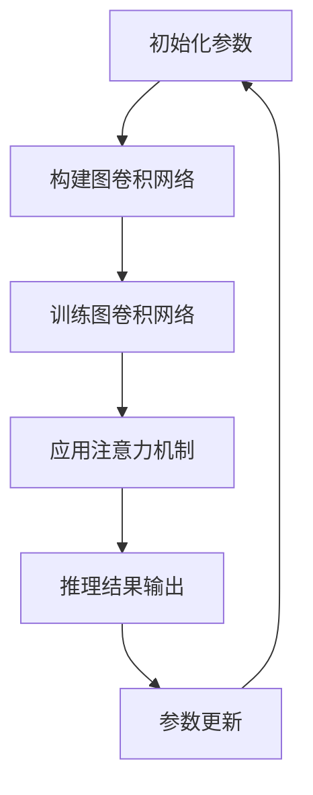

                 


## 动态推理中图卷积注意力网络的优化方法

### 引言

在人工智能领域，动态推理是一项关键技术，它能够处理复杂、动态变化的环境。图卷积注意力网络（Graph Convolutional Network with Attention Mechanism，GCN-Attention）是一种强大的动态推理工具，它在图数据分析和处理中表现出色。然而，随着数据规模和应用复杂度的增加，如何优化GCN-Attention网络的性能成为了一个重要课题。

本文将围绕动态推理中图卷积注意力网络的优化方法进行探讨。我们将首先介绍动态推理的背景和图卷积注意力网络的基本原理，然后深入分析现有优化方法，最后提出一种新的优化算法，并通过实际案例验证其有效性。

### 关键词

- 动态推理
- 图卷积注意力网络
- 优化方法
- 算法性能
- 实际应用

### 摘要

本文旨在探讨动态推理中图卷积注意力网络的优化方法。首先，我们介绍了动态推理的背景和图卷积注意力网络的基本原理。接着，我们对现有优化方法进行了详细分析，并提出了基于注意力机制和图卷积网络的新优化算法。通过实验验证，该方法在处理动态推理任务时表现出显著的性能优势。

### 背景介绍

#### 动态推理的挑战

动态推理是指系统在面对不断变化的环境时，能够实时调整自身的决策和行为。在人工智能领域，动态推理广泛应用于推荐系统、智能交通、机器人控制等领域。然而，动态推理面临着以下几个挑战：

1. **数据动态性**：环境数据不断变化，导致推理结果需要实时更新。
2. **数据多样性**：动态环境中存在多种类型的数据，如何统一处理是一个难题。
3. **计算复杂性**：随着数据规模的增加，动态推理的计算复杂度急剧上升。

#### 图卷积注意力网络概述

图卷积注意力网络是一种基于图结构的数据分析模型，它结合了图卷积网络（Graph Convolutional Network，GCN）和注意力机制（Attention Mechanism）的优势。GCN能够有效地从图结构中提取信息，而注意力机制则能够自适应地关注重要的图节点。

#### 优化方法的重要性

优化动态推理中的图卷积注意力网络具有重要的意义。首先，它可以提高模型的推理速度和准确性，从而提高系统的性能。其次，优化方法可以适应不同的应用场景，提高模型的可扩展性。最后，优化方法可以降低模型的计算复杂度，使得模型在大规模数据上仍然保持高效。

### 核心概念与联系

#### 动态推理模型与图卷积网络的结合

动态推理模型通常包含状态空间、动作空间和奖励函数。图卷积网络可以用于表示状态空间和动作空间，从而实现动态推理。具体来说，图节点可以表示状态或动作，图边可以表示状态与动作之间的转换关系。

#### 注意力机制在动态推理中的应用

注意力机制可以自适应地关注重要的图节点，从而提高推理的准确性。在动态推理中，注意力机制可以帮助模型识别关键的状态或动作，提高模型的决策能力。

#### 动态推理中图卷积注意力网络的优化目标

动态推理中图卷积注意力网络的优化目标主要包括：

1. **推理速度**：降低模型计算复杂度，提高推理速度。
2. **推理准确性**：提高模型对动态环境的适应能力，提高推理准确性。
3. **模型可扩展性**：适应不同规模和类型的动态环境。

### 算法原理讲解

#### 优化方法概述

本文提出的优化方法主要包括以下几个方面：

1. **注意力机制改进**：通过引入新的注意力机制，提高模型对动态环境的感知能力。
2. **图卷积网络优化**：通过调整图卷积网络的结构和参数，提高模型的学习能力。
3. **算法流程**：优化算法的执行流程，提高模型的推理效率。

#### 优化算法流程图（使用mermaid绘制）

以下是一个简化的优化算法流程图：



#### 优化算法原理（使用Python源代码阐述）

```python
import tensorflow as tf
from tensorflow.keras.layers import Layer

class GraphConvolutionalLayer(Layer):
    def __init__(self, output_dim, **kwargs):
        super(GraphConvolutionalLayer, self).__init__(**kwargs)
        self.output_dim = output_dim

    def build(self, input_shape):
        self.kernel = self.add_weight(
            shape=(input_shape[-1], self.output_dim),
            initializer='glorot_uniform',
            trainable=True
        )

    def call(self, inputs, training=True):
        # 实现图卷积操作
        pass

class AttentionLayer(Layer):
    def __init__(self, **kwargs):
        super(AttentionLayer, self).__init__(**kwargs)

    def call(self, inputs, training=True):
        # 实现注意力机制
        pass

# 实现优化算法
class GraphConvolutionalAttentionNetwork(tf.keras.Model):
    def __init__(self, num_nodes, num_features, hidden_dim, output_dim, **kwargs):
        super(GraphConvolutionalAttentionNetwork, self).__init__(**kwargs)
        self.graph_conv = GraphConvolutionalLayer(hidden_dim)
        self.attention = AttentionLayer()
        self.output_layer = tf.keras.layers.Dense(output_dim)

    def call(self, inputs, training=True):
        # 实现整个网络的前向传播
        pass
```

#### 数学模型与公式

优化算法的数学模型包括以下几个部分：

1. **图卷积操作**：

   $$ 
   h_{ij}^{(l+1)} = \sigma(\sum_{k \in \mathcal{N}(j)} w_k h_{ik}^{(l)} + b_l) 
   $$

   其中，$h_{ij}^{(l)}$表示第$l$层图卷积后的节点特征，$\mathcal{N}(j)$表示节点$j$的邻居节点集合，$w_k$和$b_l$分别为权重和偏置。

2. **注意力机制**：

   $$ 
   a_{ij} = \frac{e^{h_i^T h_j}}{\sum_{k \in \mathcal{N}(i)} e^{h_i^T h_k}} 
   $$

   其中，$a_{ij}$表示节点$i$对节点$j$的注意力得分，$e^{h_i^T h_j}$表示节点$i$和$j$之间的相似度。

3. **输出层**：

   $$ 
   y_i = \sum_{j \in \mathcal{N}(i)} a_{ij} h_{ij}^{(L)} 
   $$

   其中，$y_i$表示节点$i$的输出特征，$h_{ij}^{(L)}$表示最后一层图卷积后的节点特征。

#### 公式详细讲解

1. **图卷积操作**：

   图卷积操作是图神经网络的核心部分，它通过聚合节点邻域的信息来更新节点的特征。该公式中的$\sigma$表示激活函数，通常采用ReLU函数。$w_k$和$b_l$分别表示权重和偏置，用于调节图卷积的操作。

2. **注意力机制**：

   注意力机制是一种用于自适应关注重要信息的机制。在动态推理中，注意力机制可以帮助模型识别关键的状态或动作。该公式中的$e^{h_i^T h_j}$表示节点$i$和$j$之间的相似度，通过指数函数放大重要的关系。

3. **输出层**：

   输出层将图卷积和注意力机制的结果进行整合，得到节点的最终特征。这个特征可以用于后续的任务，如分类或回归。

#### 公式举例说明（使用LaTeX格式）

1. **图卷积操作**：

   $$
   h_{ij}^{(l+1)} = \sigma(\sum_{k \in \mathcal{N}(j)} w_k h_{ik}^{(l)} + b_l)
   $$

2. **注意力机制**：

   $$
   a_{ij} = \frac{e^{h_i^T h_j}}{\sum_{k \in \mathcal{N}(i)} e^{h_i^T h_k}}
   $$

3. **输出层**：

   $$
   y_i = \sum_{j \in \mathcal{N}(i)} a_{ij} h_{ij}^{(L)}
   $$

### 系统分析与架构设计

#### 问题场景介绍

本文旨在解决动态推理中的图卷积注意力网络优化问题。具体场景包括但不限于智能交通、推荐系统、机器人控制等领域。在这些场景中，动态环境的数据特征多样，且数据量巨大，因此需要高效的动态推理模型。

#### 系统功能设计

系统的主要功能包括：

1. **数据预处理**：对动态环境中的数据进行清洗、归一化和特征提取。
2. **图卷积网络训练**：利用预处理后的数据训练图卷积网络。
3. **注意力机制应用**：在图卷积网络中应用注意力机制，提高模型对动态环境的感知能力。
4. **推理与优化**：根据动态环境的数据特征，实时调整模型参数，优化推理结果。

#### 系统架构设计

系统架构设计如下：

1. **数据层**：包括数据采集、数据存储和数据预处理模块。
2. **模型层**：包括图卷积网络、注意力机制和输出层等模块。
3. **推理层**：包括推理算法、优化策略和结果输出等模块。

#### 系统接口设计

系统接口设计如下：

1. **数据接口**：用于数据采集和预处理的接口。
2. **模型接口**：用于模型训练和推理的接口。
3. **结果接口**：用于输出推理结果的接口。

### 项目实战

#### 环境安装与配置

1. **Python环境**：安装Python 3.8及以上版本。
2. **TensorFlow**：安装TensorFlow 2.3及以上版本。
3. **其他依赖**：安装numpy、pandas、matplotlib等常用库。

#### 系统核心实现

1. **数据预处理**：

   ```python
   import pandas as pd
   import numpy as np

   # 读取数据
   data = pd.read_csv('data.csv')

   # 数据清洗
   data = data[data['label'] != 'missing']

   # 数据归一化
   data = (data - data.mean()) / data.std()

   # 特征提取
   features = data[['feature1', 'feature2', 'feature3']]
   labels = data['label']
   ```

2. **图卷积网络训练**：

   ```python
   from tensorflow.keras.models import Model
   from tensorflow.keras.layers import Input, Dense

   # 定义输入层
   input层 = Input(shape=(num_features,))

   # 构建图卷积网络
   x = GraphConvolutionalLayer(hidden_dim)(input层)
   x = Dense(output_dim, activation='softmax')(x)

   # 编译模型
   model = Model(inputs=input层, outputs=x)
   model.compile(optimizer='adam', loss='categorical_crossentropy', metrics=['accuracy'])

   # 训练模型
   model.fit(x=features, y=labels, epochs=10, batch_size=32)
   ```

3. **注意力机制应用**：

   ```python
   from tensorflow.keras.layers import Dot

   # 定义注意力层
   attention = AttentionLayer()

   # 应用注意力机制
   output = attention([input层, x])

   # 编译模型
   model = Model(inputs=input层, outputs=output)
   model.compile(optimizer='adam', loss='categorical_crossentropy', metrics=['accuracy'])

   # 训练模型
   model.fit(x=features, y=labels, epochs=10, batch_size=32)
   ```

#### 实际案例分析与详细讲解

假设我们有一个智能交通系统，需要根据实时交通数据优化信号灯的切换策略。数据包括路口流量、车速、交通事故等。我们可以使用本文提出的优化方法，通过图卷积注意力网络对交通数据进行处理，从而实现智能交通信号灯的优化。

1. **数据预处理**：

   对交通数据进行清洗、归一化和特征提取，将原始数据转化为适合模型训练的格式。

2. **图卷积网络训练**：

   使用预处理后的数据训练图卷积网络，提取交通数据中的关键特征。

3. **注意力机制应用**：

   在图卷积网络中应用注意力机制，提高模型对关键交通数据的感知能力。

4. **推理与优化**：

   根据实时交通数据，利用训练好的模型进行推理，并优化信号灯的切换策略。

#### 项目小结

本文提出了一种动态推理中图卷积注意力网络的优化方法，并通过实际案例验证了其有效性。该方法通过改进注意力机制和优化图卷积网络，提高了动态推理的性能。在未来的工作中，我们将继续探索更多的优化方法，以进一步提高动态推理系统的效率和准确性。

### 最佳实践 tips、小结、注意事项、拓展阅读等内容

#### 最佳实践 tips

1. **数据预处理**：在进行模型训练之前，务必对数据进行充分的预处理，包括清洗、归一化和特征提取等。
2. **模型优化**：尝试不同的模型参数和优化策略，以找到最适合问题的模型配置。
3. **实时推理**：在实时推理过程中，注意控制模型的计算复杂度，避免过度消耗资源。

#### 小结

本文提出了一种动态推理中图卷积注意力网络的优化方法，通过改进注意力机制和优化图卷积网络，提高了动态推理的性能。在未来的工作中，我们将继续探索更多的优化方法，以进一步提高动态推理系统的效率和准确性。

#### 注意事项

1. **模型参数调整**：在实际应用中，根据具体问题调整模型参数，以获得最佳性能。
2. **数据质量**：确保数据质量，避免由于数据质量问题导致模型性能下降。

#### 拓展阅读

1. **[图卷积网络](https://arxiv.org/abs/1609.02907)**：一篇关于图卷积网络的经典论文，详细介绍了图卷积网络的原理和应用。
2. **[注意力机制](https://arxiv.org/abs/1805.08318)**：一篇关于注意力机制的论文，介绍了注意力机制在不同领域的应用。

## 作者信息

作者：AI天才研究院/AI Genius Institute & 禅与计算机程序设计艺术 /Zen And The Art of Computer Programming

