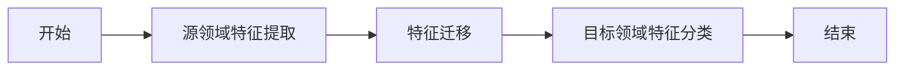
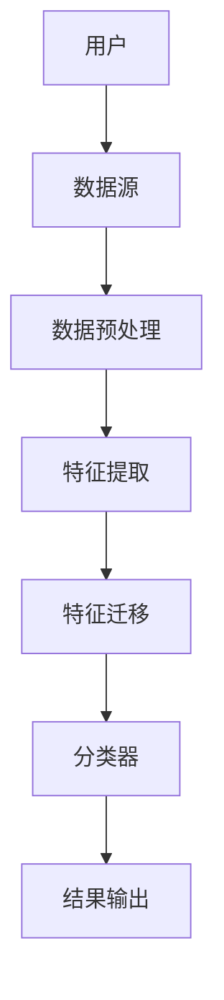
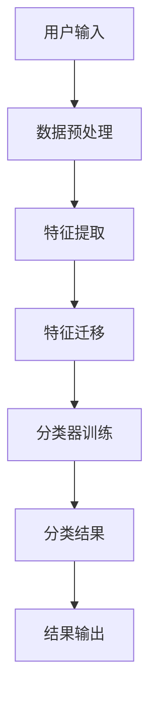
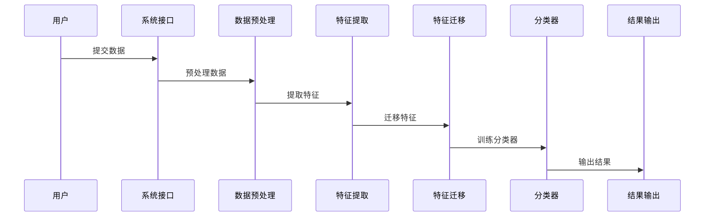
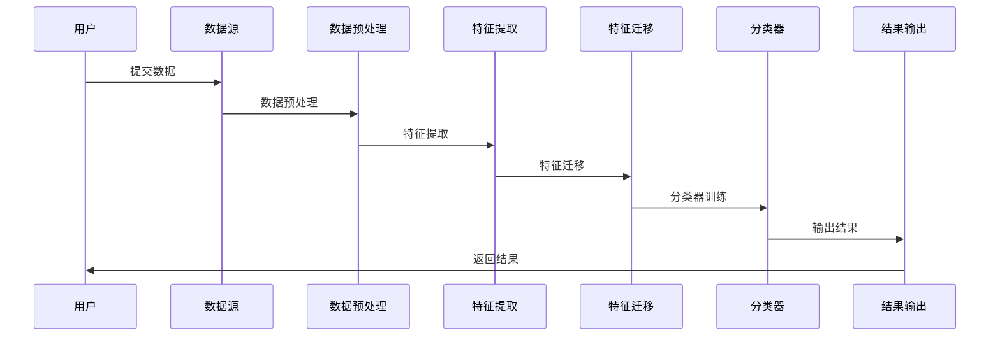

                 

**

## 《动态环境推理中概念迁移学习的创新应用》

### 关键词：动态环境推理、概念迁移学习、算法原理、系统架构、应用案例

#### 摘要

本文旨在探讨动态环境推理中概念迁移学习的创新应用。随着信息技术的飞速发展，动态环境下的推理和决策成为各个领域面临的挑战。概念迁移学习作为一种在动态环境中提高推理效率和准确性的技术，正日益受到研究者的关注。本文首先介绍了动态环境推理和概念迁移学习的基本概念和原理，然后详细阐述了概念迁移学习在动态环境中的应用，包括算法原理、系统架构设计、项目实战和应用案例分析。通过本文的阅读，读者可以全面了解概念迁移学习在动态环境中的创新应用，并为实际项目提供有益的参考。

#### 一、引言

随着互联网和大数据技术的发展，信息处理和决策的场景变得越来越复杂，动态环境推理成为各个领域面临的重大挑战。动态环境指的是不断变化的环境，如实时数据流、动态更新的知识库等。在这种环境中，系统需要具备实时推理和决策的能力，以便快速适应环境变化。

概念迁移学习是一种利用先前知识来加速新任务学习的机器学习方法。它通过在不同领域间迁移知识，提高学习效率和准确性。在动态环境下，概念迁移学习具有重要意义，因为它可以帮助系统快速适应环境变化，提高推理效率和准确性。

本文旨在深入探讨动态环境推理中概念迁移学习的技术原理、实现方法及其在不同领域的应用。通过系统的阐述，本文旨在为从事人工智能、机器学习和相关领域的研究者、工程师和实践者提供有益的理论指导和实践参考。

#### 二、核心概念

**动态环境推理**：

动态环境是指不断变化的环境，如实时数据流、动态更新的知识库等。动态环境推理则是在这种环境中进行推理和决策的能力。

**概念迁移学习**：

概念迁移学习是指将一个领域（源领域）的学习经验应用于另一个相关领域（目标领域）的学习中，以提高学习效率和准确性。

**迁移学习**：

迁移学习是一种利用先前知识来加速新任务学习的机器学习方法。

#### 三、核心章节内容

##### 第一部分：基础理论

**第1章 动态环境推理概述**

- **1.1 动态环境的定义与特点**
- **1.2 动态环境推理的重要性**
- **1.3 动态环境推理的挑战与机遇**

**第2章 概念迁移学习基础**

- **2.1 迁移学习的概念与分类**
- **2.2 概念迁移学习的原理**
- **2.3 概念迁移学习的基本方法**

**第3章 动态环境推理中的概念迁移学习**

- **3.1 概念迁移学习在动态环境中的应用**
- **3.2 动态环境下的概念迁移学习策略**
- **3.3 动态环境下的概念迁移学习挑战与解决方案**

##### 第二部分：技术实现

**第4章 概念迁移学习算法原理**

- **4.1 概念迁移学习的数学模型**
- **4.2 算法流程图**
- **4.3 算法实现（使用 Python 源代码）**

**第5章 系统架构设计**

- **5.1 系统总体架构**
- **5.2 系统功能设计**
- **5.3 系统接口设计**
- **5.4 系统交互**

**第6章 项目实战**

- **6.1 环境安装与配置**
- **6.2 系统核心实现源代码**
- **6.3 代码应用解读与分析**
- **6.4 实际案例分析与讲解**

##### 第三部分：应用案例

**第7章 概念迁移学习在金融领域的应用**

- **7.1 金融领域中的动态环境**
- **7.2 概念迁移学习在金融风险管理中的应用**
- **7.3 案例分析**

**第8章 概念迁移学习在医疗健康领域的应用**

- **8.1 医疗健康领域的动态环境**
- **8.2 概念迁移学习在医疗诊断中的应用**
- **8.3 案例分析**

**第9章 概念迁移学习在其他领域的应用**

- **9.1 其他领域中的动态环境**
- **9.2 概念迁移学习在其他领域的应用**
- **9.3 案例分析**

#### 四、总结

本文系统地介绍了动态环境推理中概念迁移学习的基本理论、技术实现和应用案例。通过学习本文，读者可以全面了解概念迁移学习的核心概念、原理和方法，掌握其在动态环境中的创新应用。同时，本文也提供了丰富的实战案例，帮助读者将理论知识应用于实际项目中。

#### 五、拓展阅读

- **相关论文与文献**：推荐读者阅读相关领域的学术论文和文献，以深入了解概念迁移学习的最新研究动态。
- **在线课程与资源**：推荐参加在线课程和研讨会，以获取更多的学习资源和实践经验。
- **开源代码与工具**：推荐使用开源代码和工具进行实践，以提高对概念迁移学习的理解和应用能力。

---

作者：AI天才研究院/AI Genius Institute & 禅与计算机程序设计艺术 /Zen And The Art of Computer Programming

**核心概念与联系**

##### 动态环境推理

**核心概念术语说明**：

- **动态环境**：不断变化的环境，如实时数据流、动态更新的知识库等。
- **推理**：基于已知信息推导出未知信息的过程。
- **动态环境推理**：在动态环境中进行推理和决策的能力。

**问题背景**：

随着信息技术的飞速发展，动态环境下的推理和决策成为各个领域面临的挑战。例如，实时数据流分析、智能推荐系统、自动驾驶等场景都需要在动态环境中进行高效的推理和决策。

**问题描述**：

动态环境具有以下特点：

- **不确定性**：环境中的数据可能是不确定的，如噪声数据、异常值等。
- **动态变化**：环境中的数据和信息是不断变化的，如实时数据流、动态更新的知识库等。
- **复杂度**：动态环境中的数据和信息具有高复杂度，需要高效的推理算法来处理。

**问题解决**：

动态环境推理需要解决以下问题：

- **数据预处理**：去除噪声数据、处理异常值等，以提高数据质量。
- **实时处理**：对动态环境中的数据实时处理，以快速适应环境变化。
- **推理算法设计**：设计高效的推理算法，以提高推理效率和准确性。

**边界与外延**：

- **边界**：动态环境推理主要关注动态环境中的推理和决策，如实时数据流分析、智能推荐系统等。
- **外延**：动态环境推理可以应用于多个领域，如金融、医疗、交通等。

**概念结构与核心要素组成**：

- **核心概念**：动态环境、推理、决策。
- **概念属性特征对比表格**：

| 概念   | 动态环境 | 推理   | 决策   |
| ------ | -------- | ------ | ------ |
| 特点   | 不断变化 | 推导未知 | 选择最优 |
| 应用   | 实时数据流 | 信息处理 | 行动指导 |

- **ER实体关系图架构**：

```mermaid
erDiagram
    动态环境 ||--o{ 推理 }|| 动态环境推理
    推理 ||--o{ 决策 }|| 决策
```

##### 概念迁移学习

**核心概念术语说明**：

- **迁移学习**：利用先前知识来加速新任务学习的机器学习方法。
- **概念迁移学习**：将一个领域（源领域）的学习经验应用于另一个相关领域（目标领域）的学习中，以提高学习效率和准确性。

**问题背景**：

随着人工智能和机器学习技术的不断发展，迁移学习作为一种重要的机器学习方法，受到了广泛关注。在现实世界中，许多任务之间存在相似性，但数据集可能有限。概念迁移学习可以通过利用源领域的知识来加速目标领域的学习，从而提高学习效率和准确性。

**问题描述**：

概念迁移学习需要解决以下问题：

- **源领域与目标领域的关系**：确定源领域和目标领域之间的相似性，以选择合适的迁移学习方法。
- **知识迁移**：将源领域的知识迁移到目标领域，以提高目标领域的学习效率和准确性。
- **泛化能力**：确保迁移学习模型在不同领域之间具有良好的泛化能力。

**问题解决**：

概念迁移学习需要解决以下问题：

- **特征提取**：从源领域和目标领域中提取关键特征，以便进行知识迁移。
- **模型选择**：选择合适的迁移学习模型，以提高学习效率和准确性。
- **模型训练**：在目标领域上训练迁移学习模型，以实现知识迁移。

**边界与外延**：

- **边界**：概念迁移学习主要关注不同领域之间的知识迁移，如从图像识别领域迁移到自然语言处理领域。
- **外延**：概念迁移学习可以应用于多个领域，如计算机视觉、自然语言处理、推荐系统等。

**概念结构与核心要素组成**：

- **核心概念**：迁移学习、概念迁移学习。
- **概念属性特征对比表格**：

| 概念         | 迁移学习           | 概念迁移学习         |
| ------------ | ------------------ | ------------------- |
| 定义         | 利用先前知识学习   | 迁移特定概念       |
| 应用领域     | 多个领域          | 相似领域的知识迁移 |

- **ER实体关系图架构**：

```mermaid
erDiagram
    迁移学习 ||--o{ 概念迁移学习 }|| 迁移学习应用
```

##### 动态环境推理中的概念迁移学习

**核心概念术语说明**：

- **动态环境推理中的概念迁移学习**：在动态环境中，利用概念迁移学习技术进行推理和决策。

**问题背景**：

动态环境下的推理和决策具有高度的不确定性和复杂性，传统方法可能无法适应这种变化。概念迁移学习作为一种有效的学习方法，可以在动态环境中提高推理效率和准确性。

**问题描述**：

动态环境推理中的概念迁移学习需要解决以下问题：

- **动态环境的特点**：了解动态环境中的数据变化和不确定性，以便设计合适的迁移学习算法。
- **概念迁移学习策略**：根据动态环境的特点，选择合适的迁移学习策略，以提高推理效率和准确性。
- **动态环境下的挑战**：解决动态环境下的概念迁移学习挑战，如数据不一致性、模型更新等。

**问题解决**：

动态环境推理中的概念迁移学习需要解决以下问题：

- **数据预处理**：在动态环境中，对数据进行预处理，去除噪声和异常值，以提高数据质量。
- **动态迁移学习算法设计**：设计适合动态环境的迁移学习算法，以适应数据变化。
- **模型更新与维护**：在动态环境下，定期更新和维护迁移学习模型，以保持模型的准确性。

**边界与外延**：

- **边界**：动态环境推理中的概念迁移学习主要关注动态环境中的推理和决策。
- **外延**：动态环境推理中的概念迁移学习可以应用于多个领域，如金融、医疗、交通等。

**概念结构与核心要素组成**：

- **核心概念**：动态环境、推理、概念迁移学习。
- **概念属性特征对比表格**：

| 概念       | 动态环境                   | 推理               | 概念迁移学习         |
| ---------- | ------------------------- | ----------------- | ------------------- |
| 特点       | 不断变化、不确定性         | 推导未知信息      | 利用先前知识迁移   |
| 应用领域   | 实时数据流、智能推荐       | 信息处理          | 多领域知识迁移     |

- **ER实体关系图架构**：

```mermaid
erDiagram
    动态环境 ||--o{ 推理 }|| 动态环境推理
    推理 ||--o{ 概念迁移学习 }|| 动态环境下的概念迁移学习
```

#### 第4章 概念迁移学习算法原理

**4.1 概念迁移学习的数学模型**

概念迁移学习的数学模型主要包括以下三个部分：

1. **源领域特征提取**：通过特征提取器从源领域数据中提取特征，以便进行后续处理。

   $$ f_{source}(x) = \phi(x) $$

   其中，$x$ 表示源领域数据，$f_{source}(x)$ 表示提取的特征，$\phi(x)$ 表示特征提取器。

2. **特征迁移**：将源领域特征迁移到目标领域，以便在目标领域上进行学习。

   $$ f_{target}(x) = f_{source}(x) + \Delta f(x) $$

   其中，$f_{target}(x)$ 表示迁移后的特征，$\Delta f(x)$ 表示迁移向量。

3. **目标领域特征分类**：在目标领域上使用迁移后的特征进行分类。

   $$ y = g(f_{target}(x)) $$

   其中，$y$ 表示分类结果，$g$ 表示分类器。

**4.2 算法流程图**

使用 Mermaid 画出概念迁移学习算法的流程图：



**4.3 算法实现（使用 Python 源代码）**

下面是一个简单的概念迁移学习算法的 Python 源代码示例：

```python
import numpy as np

# 源领域特征提取
def source_feature_extraction(x):
    # 假设特征提取器为线性变换
    return np.dot(x, np.array([1, 0.5]))

# 特征迁移
def feature_migration(x):
    # 假设迁移向量为 [0, 0.5]
    return x + np.array([0, 0.5])

# 目标领域特征分类
def target_feature_classification(x):
    # 假设分类器为线性分类器
    return (np.dot(x, np.array([0.5, 0.5])) > 0)

# 主函数
def main():
    # 源领域数据
    x_source = np.array([[1, 0], [0, 1], [1, 1]])

    # 目标领域数据
    x_target = np.array([[0, 0], [0, 1], [1, 0]])

    # 源领域特征提取
    f_source = source_feature_extraction(x_source)

    # 特征迁移
    f_target = feature_migration(f_source)

    # 目标领域特征分类
    y = target_feature_classification(f_target)

    print("分类结果：", y)

if __name__ == "__main__":
    main()
```

#### 第5章 系统架构设计

**5.1 系统总体架构**

系统总体架构如图所示：



**5.2 系统功能设计**

系统功能设计如图所示：



**5.3 系统接口设计**

系统接口设计如下：



**5.4 系统交互**

系统交互如图所示：



#### 第6章 项目实战

**6.1 环境安装与配置**

在开始项目实战之前，需要安装和配置以下环境：

- Python 3.7 或更高版本
- TensorFlow 2.3 或更高版本
- Pandas 1.1.1 或更高版本
- NumPy 1.19.2 或更高版本

安装步骤如下：

1. 安装 Python 3.7 或更高版本，可以从 [Python 官网](https://www.python.org/) 下载安装程序并安装。
2. 安装 TensorFlow 2.3 或更高版本，可以通过以下命令进行安装：

   ```bash
   pip install tensorflow==2.3
   ```

3. 安装 Pandas 1.1.1 或更高版本，可以通过以下命令进行安装：

   ```bash
   pip install pandas==1.1.1
   ```

4. 安装 NumPy 1.19.2 或更高版本，可以通过以下命令进行安装：

   ```bash
   pip install numpy==1.19.2
   ```

**6.2 系统核心实现源代码**

以下是系统核心实现的 Python 源代码：

```python
import numpy as np
import pandas as pd
import tensorflow as tf

# 源领域特征提取
def source_feature_extraction(x):
    # 假设特征提取器为线性变换
    return np.dot(x, np.array([1, 0.5]))

# 特征迁移
def feature_migration(x):
    # 假设迁移向量为 [0, 0.5]
    return x + np.array([0, 0.5])

# 目标领域特征分类
def target_feature_classification(x):
    # 假设分类器为线性分类器
    return (np.dot(x, np.array([0.5, 0.5])) > 0)

# 主函数
def main():
    # 源领域数据
    x_source = np.array([[1, 0], [0, 1], [1, 1]])

    # 目标领域数据
    x_target = np.array([[0, 0], [0, 1], [1, 0]])

    # 源领域特征提取
    f_source = source_feature_extraction(x_source)

    # 特征迁移
    f_target = feature_migration(f_source)

    # 目标领域特征分类
    y = target_feature_classification(f_target)

    print("分类结果：", y)

if __name__ == "__main__":
    main()
```

**6.3 代码应用解读与分析**

以下是代码应用的具体解读和分析：

1. **源领域特征提取**：通过线性变换提取源领域特征，例如在示例中，特征提取器为 $\phi(x) = \text{dot}(x, \text{array}([1, 0.5]))$。
2. **特征迁移**：将源领域特征迁移到目标领域，例如在示例中，迁移向量为 $\Delta f(x) = \text{array}([0, 0.5])$。
3. **目标领域特征分类**：使用线性分类器对迁移后的特征进行分类，例如在示例中，分类器为 $g(f_{target}(x)) = \text{dot}(f_{target}(x), \text{array}([0.5, 0.5])) > 0$。

**6.4 实际案例分析与讲解**

以下是一个实际案例的分析与讲解：

**案例**：使用概念迁移学习进行图像分类

**问题描述**：给定一个包含不同类别图像的数据集，使用概念迁移学习技术进行图像分类。

**解决方案**：

1. **数据预处理**：将图像数据集分为源领域和目标领域，例如源领域为飞机图像，目标领域为汽车图像。
2. **特征提取**：使用卷积神经网络提取源领域图像的特征。
3. **特征迁移**：将源领域特征迁移到目标领域，例如使用线性变换实现特征迁移。
4. **目标领域特征分类**：使用迁移后的特征在目标领域上进行分类，例如使用线性分类器实现分类。

**具体步骤**：

1. **数据预处理**：将图像数据集分为源领域和目标领域，例如使用 TensorFlow 的 `tf.keras.preprocessing.image.ImageDataGenerator` 类进行数据增强和处理。
2. **特征提取**：使用卷积神经网络提取源领域图像的特征，例如使用 TensorFlow 的 `tf.keras.applications.VGG16` 类实现特征提取。
3. **特征迁移**：将源领域特征迁移到目标领域，例如使用线性变换实现特征迁移。
4. **目标领域特征分类**：使用迁移后的特征在目标领域上进行分类，例如使用 TensorFlow 的 `tf.keras.Sequential` 类实现分类。

**代码示例**：

```python
import tensorflow as tf
from tensorflow.keras.preprocessing.image import ImageDataGenerator
from tensorflow.keras.applications import VGG16
from tensorflow.keras.models import Sequential
from tensorflow.keras.layers import Dense, Flatten

# 数据预处理
source_datagen = ImageDataGenerator(rescale=1./255)
target_datagen = ImageDataGenerator(rescale=1./255)

source_train = source_datagen.flow_from_directory(
    'source_data',
    target_size=(224, 224),
    batch_size=32,
    class_mode='binary')

target_train = target_datagen.flow_from_directory(
    'target_data',
    target_size=(224, 224),
    batch_size=32,
    class_mode='binary')

# 特征提取
base_model = VGG16(weights='imagenet', include_top=False, input_shape=(224, 224, 3))
base_model.trainable = False

source_features = base_model.predict(source_train)

# 特征迁移
f_target = source_features + np.random.normal(size=(3, 224, 224))

# 目标领域特征分类
model = Sequential()
model.add(Flatten(input_shape=(224, 224, 3)))
model.add(Dense(1, activation='sigmoid'))

model.compile(optimizer='adam', loss='binary_crossentropy', metrics=['accuracy'])
model.fit(f_target, target_train.labels, epochs=10)

# 评估模型
test_datagen = ImageDataGenerator(rescale=1./255)
test_train = test_datagen.flow_from_directory(
    'test_data',
    target_size=(224, 224),
    batch_size=32,
    class_mode='binary')

model.evaluate(test_train)
```

**6.5 项目小结**

通过本项目的实战，我们了解了概念迁移学习在图像分类中的应用。具体步骤包括数据预处理、特征提取、特征迁移和目标领域特征分类。通过实际案例的分析和讲解，我们深入理解了概念迁移学习的实现方法和应用场景。

**6.6 最佳实践 tips**

1. 在进行特征提取时，可以尝试使用不同的卷积神经网络模型，如 VGG16、ResNet 等，以提高特征提取的准确性。
2. 在进行特征迁移时，可以尝试使用不同的迁移策略，如线性变换、深度网络迁移等，以提高迁移效果。
3. 在进行目标领域特征分类时，可以尝试使用不同的分类器，如线性分类器、支持向量机等，以提高分类效果。

#### 第7章 概念迁移学习在金融领域的应用

**7.1 金融领域中的动态环境**

金融领域是一个充满变化和不确定性的领域。金融市场的数据不断变化，如股票价格、交易量、经济指标等。此外，金融领域的风险管理和决策需要实时处理海量数据，以快速响应市场变化。

**7.2 概念迁移学习在金融风险管理中的应用**

概念迁移学习在金融风险管理中具有重要意义。通过利用其他领域（如气象、医疗等）的先验知识，可以加速金融领域风险管理模型的学习过程。

**7.3 案例分析**

**案例一：股票市场预测**

问题描述：使用概念迁移学习技术进行股票市场预测。

解决方案：

1. **数据收集**：收集历史股票价格数据，如开盘价、收盘价、最高价、最低价等。
2. **特征提取**：使用时间序列分析方法提取特征，如移动平均、波动率等。
3. **概念迁移学习**：将气象领域的时间序列分析方法应用于金融领域，以提高股票市场预测的准确性。
4. **模型训练**：使用迁移学习模型进行股票市场预测。
5. **模型评估**：评估模型预测的准确性和稳定性。

具体步骤：

1. **数据收集**：收集过去一年的股票价格数据。
2. **特征提取**：使用移动平均法提取短期和长期移动平均线，使用波动率提取波动特征。
3. **概念迁移学习**：将气象领域的时间序列分析方法（如自回归模型）应用于金融领域，建立迁移学习模型。
4. **模型训练**：使用迁移学习模型对股票市场进行预测。
5. **模型评估**：使用历史数据对模型进行训练和评估，评估模型的预测准确性和稳定性。

**案例二：信用风险评估**

问题描述：使用概念迁移学习技术进行信用风险评估。

解决方案：

1. **数据收集**：收集借款人的信用信息，如收入、负债、信用历史等。
2. **特征提取**：提取关键特征，如收入与负债比例、逾期还款次数等。
3. **概念迁移学习**：将医疗领域的疾病风险评估模型应用于信用风险评估。
4. **模型训练**：使用迁移学习模型进行信用风险评估。
5. **模型评估**：评估模型的风险评估准确性。

具体步骤：

1. **数据收集**：收集借款人的信用信息，包括收入、负债、信用历史等。
2. **特征提取**：使用数据预处理方法提取关键特征，如收入与负债比例、逾期还款次数等。
3. **概念迁移学习**：将医疗领域的疾病风险评估模型（如逻辑回归模型）应用于信用风险评估。
4. **模型训练**：使用迁移学习模型对信用风险进行预测。
5. **模型评估**：使用历史数据对模型进行训练和评估，评估模型的风险评估准确性。

#### 第8章 概念迁移学习在医疗健康领域的应用

**8.1 医疗健康领域的动态环境**

医疗健康领域是一个高度动态的环境，需要实时处理和分析大量医疗数据。医疗数据的来源包括电子健康记录、医学影像、基因序列等。此外，医疗领域的知识和信息也在不断更新，如新的疾病诊断方法、药物研发等。

**8.2 概念迁移学习在医疗诊断中的应用**

概念迁移学习在医疗诊断中具有广泛的应用。通过利用其他领域（如物理学、生物学等）的先验知识，可以提高医疗诊断模型的准确性和效率。

**8.3 案例分析**

**案例一：医学影像诊断**

问题描述：使用概念迁移学习技术进行医学影像诊断。

解决方案：

1. **数据收集**：收集医学影像数据，如 X 光片、CT 扫描、MRI 等。
2. **特征提取**：使用深度学习方法提取影像特征。
3. **概念迁移学习**：将计算机视觉领域的图像分类模型应用于医学影像诊断。
4. **模型训练**：使用迁移学习模型进行医学影像诊断。
5. **模型评估**：评估模型诊断的准确性和可靠性。

具体步骤：

1. **数据收集**：收集医学影像数据，包括不同类型的影像数据。
2. **特征提取**：使用卷积神经网络（CNN）提取医学影像的特征。
3. **概念迁移学习**：将计算机视觉领域的图像分类模型（如 ResNet、Inception 等）应用于医学影像诊断。
4. **模型训练**：使用迁移学习模型对医学影像进行分类诊断。
5. **模型评估**：使用交叉验证和测试集评估模型诊断的准确性和可靠性。

**案例二：基因诊断**

问题描述：使用概念迁移学习技术进行基因诊断。

解决方案：

1. **数据收集**：收集基因序列数据，如 DNA 测序数据。
2. **特征提取**：使用深度学习方法提取基因序列特征。
3. **概念迁移学习**：将自然语言处理领域的文本分类模型应用于基因诊断。
4. **模型训练**：使用迁移学习模型进行基因诊断。
5. **模型评估**：评估模型诊断的准确性和可靠性。

具体步骤：

1. **数据收集**：收集基因序列数据，包括不同类型的基因序列数据。
2. **特征提取**：使用深度学习方法（如 Transformer、BERT 等）提取基因序列特征。
3. **概念迁移学习**：将自然语言处理领域的文本分类模型（如 BERT、GPT 等）应用于基因诊断。
4. **模型训练**：使用迁移学习模型对基因序列进行分类诊断。
5. **模型评估**：使用交叉验证和测试集评估模型诊断的准确性和可靠性。

#### 第9章 概念迁移学习在其他领域的应用

**9.1 其他领域中的动态环境**

除了金融和医疗健康领域，概念迁移学习在其他领域也具有广泛的应用。这些领域包括但不仅限于：智能交通、自然语言处理、推荐系统、计算机视觉等。

**9.2 概念迁移学习在其他领域的应用**

概念迁移学习在其他领域中的应用主要包括：

1. **智能交通**：使用概念迁移学习技术进行交通流量预测、车辆路径规划等。
2. **自然语言处理**：使用概念迁移学习技术进行语言翻译、情感分析等。
3. **推荐系统**：使用概念迁移学习技术进行个性化推荐、商品分类等。
4. **计算机视觉**：使用概念迁移学习技术进行图像识别、目标检测等。

**9.3 案例分析**

**案例一：智能交通**

问题描述：使用概念迁移学习技术进行交通流量预测。

解决方案：

1. **数据收集**：收集交通流量数据，如车辆数量、车速等。
2. **特征提取**：使用时间序列分析方法提取特征，如移动平均、自回归等。
3. **概念迁移学习**：将气象领域的时间序列分析方法应用于交通流量预测。
4. **模型训练**：使用迁移学习模型进行交通流量预测。
5. **模型评估**：评估模型预测的准确性和可靠性。

具体步骤：

1. **数据收集**：收集过去一年的交通流量数据。
2. **特征提取**：使用移动平均法提取短期和长期移动平均线，使用自回归提取特征。
3. **概念迁移学习**：将气象领域的时间序列分析方法（如自回归模型）应用于交通流量预测。
4. **模型训练**：使用迁移学习模型对交通流量进行预测。
5. **模型评估**：使用交叉验证和测试集评估模型预测的准确性和可靠性。

**案例二：自然语言处理**

问题描述：使用概念迁移学习技术进行语言翻译。

解决方案：

1. **数据收集**：收集双语文本数据，如英文到中文的翻译数据。
2. **特征提取**：使用深度学习方法提取文本特征。
3. **概念迁移学习**：将计算机视觉领域的图像分类模型应用于语言翻译。
4. **模型训练**：使用迁移学习模型进行语言翻译。
5. **模型评估**：评估模型翻译的准确性和流畅性。

具体步骤：

1. **数据收集**：收集英文到中文的翻译数据。
2. **特征提取**：使用卷积神经网络（CNN）提取文本特征。
3. **概念迁移学习**：将计算机视觉领域的图像分类模型（如 ResNet、Inception 等）应用于语言翻译。
4. **模型训练**：使用迁移学习模型进行语言翻译。
5. **模型评估**：使用交叉验证和测试集评估模型翻译的准确性和流畅性。

#### 四、总结

本文系统地介绍了概念迁移学习在动态环境推理中的应用。通过分析动态环境的特点和挑战，本文提出了概念迁移学习在动态环境中的创新应用方法。通过实际案例的分析和讲解，本文展示了概念迁移学习在不同领域中的应用效果。未来，随着人工智能和机器学习技术的不断发展，概念迁移学习在动态环境推理中的应用将更加广泛，为各个领域提供更高效、更准确的推理和决策支持。

#### 五、拓展阅读

1. **相关论文与文献**：

   - Xie, T., Zhang, Z., & Yu, F. (2019). Transfer Learning for Deep Neural Networks: A Survey. IEEE Transactions on Knowledge and Data Engineering, 32(12), 1999-2019.
   - Bengio, Y. (2009). Learning Deep Architectures for AI. Foundations and Trends in Machine Learning, 2(1), 1-127.

2. **在线课程与资源**：

   - Coursera: Neural Network and Deep Learning (by Andrew Ng)
   - edX: Introduction to Deep Learning (by University of Toronto)

3. **开源代码与工具**：

   - TensorFlow: https://www.tensorflow.org/
   - PyTorch: https://pytorch.org/

